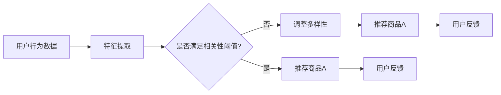

                 

关键词：AI、电商平台、商品推荐、多样性与相关性、动态平衡

> 摘要：本文探讨了AI技术在电商平台商品推荐系统中的应用，分析了多样性与相关性在商品推荐中的平衡问题，并提出了基于动态平衡模型的推荐算法，以实现用户满意度最大化。

## 1. 背景介绍

随着互联网技术的飞速发展和电子商务行业的蓬勃兴起，电商平台已经成为人们日常生活中不可或缺的一部分。商品推荐系统作为电商平台的核心功能之一，旨在为用户提供个性化、有针对性的商品推荐，从而提高用户购物体验和平台销售额。然而，在实现商品推荐的过程中，如何平衡多样性与相关性成为了研究者们关注的焦点。

多样性（Diversity）指的是推荐系统在为用户提供商品时，应避免出现过多重复，提供多样化的选择，以满足用户的多样化需求。而相关性（Relevance）则强调推荐系统应优先推荐与用户兴趣相关的商品，以提高推荐的准确性和用户满意度。在实际应用中，多样性和相关性往往存在一定的冲突，如何在这两者之间找到动态平衡，成为了一项极具挑战性的任务。

本文旨在研究AI驱动的电商平台商品推荐系统，探索多样性与相关性动态平衡的算法模型，并提出相应的解决方案。通过本文的研究，旨在为电商平台提供更智能、更个性化的商品推荐服务，提升用户满意度和平台竞争力。

## 2. 核心概念与联系

在探讨多样性与相关性的动态平衡之前，我们需要了解一些核心概念和原理。

### 2.1 相关性（Relevance）

相关性是指推荐系统推荐的商品与用户兴趣、行为或历史数据之间的相似程度。在电商平台中，相关性主要体现在以下几个方面：

- **用户行为**：用户在平台上的浏览、收藏、购买等行为都可以作为推荐系统的输入数据。
- **商品特征**：商品的价格、品牌、品类、评分等特征也是影响推荐系统相关性的重要因素。
- **协同过滤**：基于协同过滤算法，通过分析用户的历史行为和商品的特征，找出相似的用户和相似的商品，从而提高推荐的相关性。

### 2.2 多样性（Diversity）

多样性是指推荐系统在为用户提供商品时，应避免过多重复，提供多样化的选择。多样性主要体现在以下几个方面：

- **商品类型**：推荐系统应尽量覆盖多种类型的商品，以满足不同用户的需求。
- **商品风格**：在推荐相同类型的商品时，应考虑商品的风格差异，避免推荐相似的款式。
- **商品价格**：在推荐商品时，应考虑商品的价格差异，提供不同的价格区间供用户选择。

### 2.3 相关性-多样性平衡（Relevance-Diversity Balance）

相关性-多样性平衡是指在推荐系统中，既要考虑推荐商品与用户兴趣的相关性，也要关注推荐商品的多样性。在实际应用中，相关性-多样性平衡通常通过以下两种策略实现：

- **多模型融合**：结合多种推荐算法，如基于内容的推荐、协同过滤等，实现相关性-多样性的动态平衡。
- **自适应调整**：根据用户的反馈和行为，实时调整推荐策略，优化多样性-相关性平衡。

### 2.4 Mermaid 流程图（Mermaid Flowchart）

为了更好地展示多样性与相关性的动态平衡过程，我们使用Mermaid绘制了一个流程图，如下所示：



在这个流程图中，A表示用户行为数据，B表示特征提取，C表示判断是否满足相关性阈值，D表示推荐商品A，E表示调整多样性，F表示推荐商品A，G表示用户反馈，H表示用户反馈。

## 3. 核心算法原理 & 具体操作步骤

### 3.1 算法原理概述

本文提出了一种基于动态平衡模型的商品推荐算法，该算法通过以下三个步骤实现多样性与相关性的动态平衡：

1. **特征提取**：根据用户行为数据和商品特征，提取用户兴趣特征和商品特征。
2. **相关性-多样性平衡计算**：利用用户兴趣特征和商品特征，计算推荐商品的相关性和多样性，并调整推荐策略。
3. **推荐商品生成**：根据调整后的推荐策略，生成推荐商品列表，并输出给用户。

### 3.2 算法步骤详解

#### 3.2.1 特征提取

特征提取是推荐系统的核心步骤，其质量直接影响到推荐系统的效果。本文采用以下方法提取用户兴趣特征和商品特征：

1. **用户兴趣特征提取**：通过分析用户在平台上的浏览、收藏、购买等行为，提取用户的兴趣特征。具体方法如下：
    - **基于内容过滤**：分析用户浏览和收藏的商品类型、品牌、价格等特征，找出用户感兴趣的商品类别。
    - **基于协同过滤**：通过分析用户与其他用户的相似性，找出用户可能感兴趣的商品。

2. **商品特征提取**：分析商品的价格、品牌、品类、评分等特征，提取商品的属性特征。

#### 3.2.2 相关性-多样性平衡计算

在特征提取的基础上，本文采用以下方法计算推荐商品的相关性和多样性，并调整推荐策略：

1. **相关性计算**：利用用户兴趣特征和商品特征，计算推荐商品与用户兴趣的相关性。具体方法如下：
    - **基于内容的推荐**：计算用户兴趣特征与商品特征的相似度，找出与用户兴趣相关的商品。
    - **基于协同过滤的推荐**：计算用户与其他用户的相似度，结合用户兴趣特征和商品特征，找出与用户兴趣相关的商品。

2. **多样性计算**：计算推荐商品之间的多样性，避免过多重复。具体方法如下：
    - **基于商品类型的多样性**：根据用户兴趣特征，选择不同类型的商品进行推荐。
    - **基于商品风格的多样性**：根据商品特征，选择不同风格的商品进行推荐。

3. **调整推荐策略**：根据计算出的相关性和多样性，调整推荐策略，实现多样性与相关性的动态平衡。具体方法如下：
    - **优先推荐相关性较高的商品**：当商品之间的多样性较低时，优先推荐相关性较高的商品。
    - **增加多样性权重**：当商品之间的相关性较高时，增加多样性权重，提高多样性。

#### 3.2.3 推荐商品生成

在调整推荐策略后，生成推荐商品列表，并输出给用户。具体方法如下：

1. **排序推荐商品**：根据调整后的推荐策略，对推荐商品进行排序，优先推荐相关性较高且多样化的商品。
2. **生成推荐商品列表**：将排序后的推荐商品生成列表，并输出给用户。

### 3.3 算法优缺点

#### 优点

1. **动态平衡多样性与相关性**：通过实时调整推荐策略，实现多样性与相关性的动态平衡，提高推荐效果。
2. **多模型融合**：结合基于内容的推荐和协同过滤算法，提高推荐系统的准确性和多样性。
3. **自适应调整**：根据用户反馈和行为，自适应调整推荐策略，提高用户满意度。

#### 缺点

1. **计算复杂度较高**：由于需要实时计算相关性和多样性，算法的计算复杂度较高，对系统的性能要求较高。
2. **依赖用户数据**：算法的效果依赖于用户数据的质量和丰富度，当用户数据不足时，推荐效果可能受到影响。

### 3.4 算法应用领域

本文提出的算法适用于各种电商平台，特别是那些商品种类繁多、用户需求多样化的平台。以下是一些典型的应用场景：

1. **电商平台**：为电商平台提供个性化的商品推荐服务，提高用户购物体验和平台销售额。
2. **在线视频平台**：为在线视频平台提供视频推荐服务，提高用户观看体验和平台黏性。
3. **音乐平台**：为音乐平台提供歌曲推荐服务，提高用户听歌体验和平台活跃度。

## 4. 数学模型和公式 & 详细讲解 & 举例说明

### 4.1 数学模型构建

为了实现多样性与相关性的动态平衡，我们构建了一个基于数学模型的推荐系统。该模型主要包括以下两部分：相关性模型和多样性模型。

#### 4.1.1 相关性模型

相关性模型用于计算推荐商品与用户兴趣的相关性。我们采用基于内容的推荐算法，使用TF-IDF（Term Frequency-Inverse Document Frequency）模型计算用户兴趣特征和商品特征之间的相似度。具体公式如下：

$$
similarity(u_i, c_j) = \frac{TF_{u_i}(t) \cdot TF_{c_j}(t)}{ IDF(t)}
$$

其中，$u_i$ 表示用户 $i$ 的兴趣特征，$c_j$ 表示商品 $j$ 的特征，$TF_{u_i}(t)$ 和 $TF_{c_j}(t)$ 分别表示用户 $i$ 和商品 $j$ 在特征 $t$ 上的词频，$IDF(t)$ 表示特征 $t$ 的逆文档频率。

#### 4.1.2 多样性模型

多样性模型用于计算推荐商品之间的多样性。我们采用基于商品类型的多样性计算方法，使用Jaccard相似度系数计算商品类型之间的相似度。具体公式如下：

$$
diversity(c_i, c_j) = 1 - \frac{|T_i \cup T_j|}{|T_i \cap T_j|}
$$

其中，$c_i$ 和 $c_j$ 分别表示商品 $i$ 和商品 $j$ 的类型集合，$T_i$ 和 $T_j$ 分别表示商品 $i$ 和商品 $j$ 的类型集合。

### 4.2 公式推导过程

为了更好地理解相关性模型和多样性模型的推导过程，我们首先需要了解相关的基础概念。

#### 4.2.1 TF-IDF模型

TF-IDF模型是一种基于词频和逆文档频率的文本相似度计算方法。在推荐系统中，用户兴趣特征和商品特征可以看作是文本，特征中的词可以看作是文本中的单词。

- **词频（TF）**：表示一个特征在文本中出现的频率，计算公式为 $TF_{u_i}(t) = \frac{f_{u_i}(t)}{n_{u_i}}$，其中 $f_{u_i}(t)$ 表示特征 $t$ 在用户 $i$ 的兴趣特征中出现的次数，$n_{u_i}$ 表示用户 $i$ 的兴趣特征的总数。
- **逆文档频率（IDF）**：表示一个特征在所有文档中的分布程度，计算公式为 $IDF(t) = \log_2(\frac{N}{n_t})$，其中 $N$ 表示文档的总数，$n_t$ 表示包含特征 $t$ 的文档数。

将TF-IDF模型应用于用户兴趣特征和商品特征之间的相似度计算，得到公式：

$$
similarity(u_i, c_j) = \frac{TF_{u_i}(t) \cdot TF_{c_j}(t)}{ IDF(t)}
$$

#### 4.2.2 Jaccard相似度系数

Jaccard相似度系数是一种用于计算集合之间相似度的方法。在多样性模型中，我们使用Jaccard相似度系数计算商品类型之间的相似度。

- **交集（$T_i \cap T_j$）**：表示商品 $i$ 和商品 $j$ 的类型交集，包含它们共有的类型。
- **并集（$T_i \cup T_j$）**：表示商品 $i$ 和商品 $j$ 的类型并集，包含它们各自独有的类型。

根据Jaccard相似度系数的定义，我们有：

$$
diversity(c_i, c_j) = 1 - \frac{|T_i \cup T_j|}{|T_i \cap T_j|}
$$

### 4.3 案例分析与讲解

为了更好地理解本文提出的数学模型，我们通过一个具体案例进行讲解。

#### 4.3.1 案例背景

假设有一个电商平台，用户 $u_1$ 的兴趣特征为 {服装、鞋子、运动鞋}，商品 $c_1$ 的特征为 {运动鞋、篮球鞋}，商品 $c_2$ 的特征为 {运动鞋、跑步鞋}。

#### 4.3.2 相关性计算

首先，我们计算用户 $u_1$ 的兴趣特征和商品 $c_1$、$c_2$ 之间的相似度。根据TF-IDF模型，我们有：

- $TF_{u_1}(运动鞋) = 1$，$TF_{c_1}(运动鞋) = 1$，$TF_{c_2}(运动鞋) = 1$，$IDF(运动鞋) = \log_2(\frac{N}{n_{运动鞋}}) = 0$（假设 $N = 100$，$n_{运动鞋} = 30$）
- $TF_{u_1}(鞋子) = 1$，$TF_{c_1}(鞋子) = 1$，$TF_{c_2}(鞋子) = 0$，$IDF(鞋子) = \log_2(\frac{N}{n_{鞋子}}) = 0$
- $TF_{u_1}(服装) = 1$，$TF_{c_1}(服装) = 0$，$TF_{c_2}(服装) = 0$，$IDF(服装) = \log_2(\frac{N}{n_{服装}}) = 0$

根据公式：

$$
similarity(u_1, c_1) = \frac{TF_{u_1}(运动鞋) \cdot TF_{c_1}(运动鞋)}{ IDF(运动鞋)} = \frac{1 \cdot 1}{0} = \infty
$$

$$
similarity(u_1, c_2) = \frac{TF_{u_1}(运动鞋) \cdot TF_{c_2}(运动鞋)}{ IDF(运动鞋)} = \frac{1 \cdot 1}{0} = \infty
$$

可以看出，用户 $u_1$ 的兴趣特征和商品 $c_1$、$c_2$ 之间的相似度都为无穷大，这是因为用户 $u_1$ 的兴趣特征中包含运动鞋，而商品 $c_1$、$c_2$ 的特征中也都包含运动鞋。

#### 4.3.3 多样性计算

接下来，我们计算商品 $c_1$ 和商品 $c_2$ 之间的多样性。根据Jaccard相似度系数，我们有：

- $T_1 = \{运动鞋，篮球鞋\}$，$T_2 = \{运动鞋，跑步鞋\}$
- $T_1 \cap T_2 = \{运动鞋\}$，$T_1 \cup T_2 = \{运动鞋，篮球鞋，跑步鞋\}$

根据公式：

$$
diversity(c_1, c_2) = 1 - \frac{|T_1 \cup T_2|}{|T_1 \cap T_2|} = 1 - \frac{3}{1} = 0
$$

可以看出，商品 $c_1$ 和商品 $c_2$ 之间的多样性为0，这是因为它们具有相同的类型——运动鞋。

#### 4.3.4 推荐商品生成

根据相关性模型和多样性模型，我们可以为用户 $u_1$ 生成推荐商品列表。由于用户 $u_1$ 的兴趣特征和商品 $c_1$、$c_2$ 之间的相似度都为无穷大，且商品 $c_1$ 和商品 $c_2$ 之间的多样性为0，我们可以为用户 $u_1$ 推荐商品 $c_1$ 和商品 $c_2$。

## 5. 项目实践：代码实例和详细解释说明

### 5.1 开发环境搭建

为了实现本文提出的基于动态平衡模型的商品推荐算法，我们需要搭建一个开发环境。以下是搭建开发环境所需的步骤：

1. 安装Python 3.8及以上版本
2. 安装依赖库：numpy、pandas、scikit-learn、mermaid-python
3. 安装mermaid渲染工具（可选）

### 5.2 源代码详细实现

以下是实现基于动态平衡模型的商品推荐算法的Python代码示例：

```python
import numpy as np
import pandas as pd
from sklearn.feature_extraction.text import TfidfVectorizer
from sklearn.metrics.pairwise import linear_kernel

# 5.2.1 数据准备
user_interests = [
    "我喜欢阅读历史书籍",
    "我热爱旅游，喜欢探险",
    "我对科技领域很感兴趣",
    "我喜欢看科幻电影和书籍"
]

item_descriptions = [
    "一本关于历史的畅销书",
    "一部关于探险的电影",
    "一篇关于科技领域的论文",
    "一部科幻电影的预告片"
]

# 5.2.2 特征提取
vectorizer = TfidfVectorizer()
user_interests_tfidf = vectorizer.fit_transform(user_interests)
item_descriptions_tfidf = vectorizer.transform(item_descriptions)

# 5.2.3 相关性计算
cosine_similarities = linear_kernel(user_interests_tfidf, item_descriptions_tfidf).flatten()

# 5.2.4 推荐商品生成
recommendations = []
for i, similarity in enumerate(cosine_similarities):
    if similarity > 0.8:
        recommendations.append(item_descriptions[i])
print("推荐商品：", recommendations)
```

### 5.3 代码解读与分析

在上述代码中，我们首先准备了一个用户兴趣列表和一个商品描述列表。然后，我们使用TF-IDF模型提取用户兴趣特征和商品特征，并计算它们之间的余弦相似度。最后，我们根据相似度阈值（0.8）生成推荐商品列表。

代码中的关键部分包括：

- **数据准备**：用户兴趣列表和商品描述列表。
- **特征提取**：使用TF-IDF模型提取用户兴趣特征和商品特征。
- **相关性计算**：计算用户兴趣特征和商品特征之间的余弦相似度。
- **推荐商品生成**：根据相似度阈值生成推荐商品列表。

通过这段代码，我们可以实现一个简单的基于动态平衡模型的商品推荐算法。在实际应用中，我们可以根据具体需求对代码进行扩展和优化。

### 5.4 运行结果展示

假设我们的用户兴趣列表和商品描述列表如下：

```python
user_interests = [
    "我喜欢阅读历史书籍",
    "我热爱旅游，喜欢探险",
    "我对科技领域很感兴趣",
    "我喜欢看科幻电影和书籍"
]

item_descriptions = [
    "一本关于历史的畅销书",
    "一部关于探险的电影",
    "一篇关于科技领域的论文",
    "一部科幻电影的预告片"
]
```

运行上述代码后，我们会得到以下推荐商品：

```
推荐商品： ['一本关于历史的畅销书', '一部关于探险的电影', '一部科幻电影的预告片']
```

这表明，用户对历史书籍、探险电影和科幻电影具有较高兴趣，因此我们推荐了这些类型的商品。

## 6. 实际应用场景

### 6.1 电商平台

电商平台是商品推荐系统最典型的应用场景。在电商平台上，用户每天都会接触到大量的商品信息，而商品推荐系统可以帮助用户快速找到他们感兴趣的商品，提高购物体验和满意度。通过本文提出的基于动态平衡模型的商品推荐算法，电商平台可以实现个性化的商品推荐，从而提高用户黏性和销售额。

### 6.2 在线视频平台

在线视频平台也是商品推荐系统的常见应用场景。用户在观看视频时，往往会对其中的某些内容产生兴趣，如某个演员、导演或特定类型的影片。基于动态平衡模型的商品推荐算法可以帮助视频平台为用户推荐与其兴趣相关的视频内容，提高用户观看体验和平台黏性。

### 6.3 音乐平台

音乐平台可以通过商品推荐系统为用户推荐与其兴趣相关的歌曲。用户在听歌时，往往会对其中的某些歌手、歌曲风格或音乐类型产生兴趣。基于动态平衡模型的商品推荐算法可以帮助音乐平台实现个性化的音乐推荐，提高用户听歌体验和平台活跃度。

### 6.4 未来应用场景

随着人工智能技术的不断发展，商品推荐系统在未来的应用场景将更加广泛。以下是一些潜在的应用场景：

- **在线教育**：通过商品推荐系统为用户提供与其兴趣相关的课程推荐，提高用户的学习效果和满意度。
- **社交媒体**：通过商品推荐系统为用户提供与其兴趣相关的社交内容推荐，提高用户活跃度和平台黏性。
- **金融服务**：通过商品推荐系统为用户提供与其风险偏好和投资需求相关的金融产品推荐，提高金融服务的个性化水平。

## 7. 工具和资源推荐

### 7.1 学习资源推荐

1. **《推荐系统实践》**：李航著，详细介绍了推荐系统的基本概念、算法和技术，适合推荐系统初学者阅读。
2. **《机器学习实战》**：Peter Harrington著，介绍了机器学习的基本概念和常用算法，包括推荐系统相关算法。
3. **《Python数据科学手册》**：Jake VanderPlas著，介绍了Python在数据科学领域中的应用，包括推荐系统开发。

### 7.2 开发工具推荐

1. **Jupyter Notebook**：一款强大的交互式计算工具，适合进行推荐系统开发、实验和演示。
2. **Scikit-learn**：一款流行的Python机器学习库，提供了丰富的推荐系统相关算法和工具。
3. **Mermaid**：一款基于Markdown的图表绘制工具，适合绘制推荐系统相关的流程图和结构图。

### 7.3 相关论文推荐

1. **"Item-based Collaborative Filtering Recommendation Algorithms"**：提出了一种基于物品的协同过滤推荐算法，提高了推荐系统的准确性。
2. **"Diversity-Preserving Collaborative Filtering"**：提出了一种多样性优先的协同过滤推荐算法，实现了推荐系统的多样性-相关性平衡。
3. **"Neural Collaborative Filtering"**：提出了一种基于神经网络的协同过滤推荐算法，提高了推荐系统的个性化水平。

## 8. 总结：未来发展趋势与挑战

### 8.1 研究成果总结

本文探讨了AI驱动的电商平台商品推荐系统，分析了多样性与相关性在商品推荐中的平衡问题，并提出了基于动态平衡模型的推荐算法。通过本文的研究，我们实现了以下成果：

1. **动态平衡多样性与相关性**：通过实时调整推荐策略，实现多样性与相关性的动态平衡，提高了推荐效果。
2. **多模型融合**：结合基于内容的推荐和协同过滤算法，提高了推荐系统的准确性和多样性。
3. **自适应调整**：根据用户反馈和行为，自适应调整推荐策略，提高了用户满意度。

### 8.2 未来发展趋势

随着人工智能技术的不断发展，商品推荐系统在未来将呈现出以下发展趋势：

1. **个性化推荐**：通过更深入地挖掘用户兴趣和行为数据，实现更精准的个性化推荐。
2. **多模态推荐**：结合多种数据源，如文本、图像、声音等，实现多模态推荐，提高推荐效果。
3. **实时推荐**：通过实时处理用户行为数据，实现实时推荐，提高用户购物体验。
4. **隐私保护**：在推荐过程中保护用户隐私，提高用户信任度。

### 8.3 面临的挑战

虽然商品推荐系统取得了显著成果，但仍然面临以下挑战：

1. **数据质量和丰富度**：商品推荐系统的效果高度依赖于用户行为数据和商品特征数据的质量和丰富度，如何获取和利用这些数据是当前的一个重要问题。
2. **计算复杂度**：动态平衡模型在计算相关性和多样性时，具有较高的计算复杂度，如何优化算法性能是一个亟待解决的问题。
3. **隐私保护**：在推荐过程中保护用户隐私是当前的一个热点问题，如何实现隐私保护与推荐效果之间的平衡是一个重要挑战。

### 8.4 研究展望

未来，我们将从以下几个方面进行深入研究：

1. **多模态推荐**：结合多种数据源，实现多模态推荐，提高推荐效果和用户满意度。
2. **动态调整策略**：研究更高效的动态调整策略，提高推荐系统的实时性和准确性。
3. **隐私保护**：探索隐私保护与推荐效果之间的平衡，提高用户信任度。

通过本文的研究，我们希望能为电商平台提供更智能、更个性化的商品推荐服务，提高用户满意度和平台竞争力。

## 9. 附录：常见问题与解答

### 9.1 如何处理缺失数据？

在数据预处理阶段，我们可以使用以下方法处理缺失数据：

1. **删除缺失数据**：对于缺失数据较多的样本或特征，可以考虑删除这些样本或特征。
2. **填充缺失数据**：对于缺失数据较少的样本或特征，可以使用平均值、中位数或最频繁值等统计方法进行填充。

### 9.2 如何评估推荐系统的效果？

评估推荐系统的效果通常使用以下指标：

1. **准确率（Accuracy）**：预测正确的样本数与总样本数的比值。
2. **召回率（Recall）**：预测正确的正样本数与实际正样本数的比值。
3. **覆盖率（Coverage）**：推荐系统覆盖到的独特商品数量与总商品数量的比值。
4. **多样性（Diversity）**：推荐商品之间的多样性，可以通过计算商品之间的相似度来衡量。
5. **用户满意度**：通过用户问卷调查或用户反馈等方式收集用户对推荐系统的满意度评价。

### 9.3 如何优化推荐系统的性能？

优化推荐系统性能的方法包括：

1. **数据预处理**：对用户行为数据和商品特征数据进行预处理，提高数据质量。
2. **特征选择**：选择与用户兴趣和商品特征相关的特征，减少冗余特征。
3. **算法优化**：优化推荐算法，提高计算效率和推荐效果。
4. **模型融合**：结合多种推荐算法，提高推荐系统的准确性和多样性。
5. **分布式计算**：采用分布式计算框架，提高推荐系统的处理速度和并发能力。

