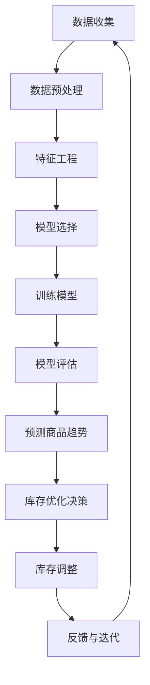

                 

关键词：人工智能、电商平台、商品趋势预测、库存优化、机器学习、数据分析

摘要：本文将探讨如何利用人工智能技术，特别是机器学习和数据分析方法，对电商平台上的商品趋势进行预测，并在此基础上优化库存管理。通过详细的算法原理、操作步骤、数学模型以及项目实践，本文旨在为电商行业提供有效的技术解决方案，帮助企业提高运营效率，降低成本，提升客户满意度。

## 1. 背景介绍

在当今数字化时代，电商平台已成为人们日常生活中不可或缺的一部分。然而，随着市场竞争的加剧和消费者需求的多样化，电商企业面临着巨大的挑战。如何准确预测商品趋势和优化库存管理，成为了电商企业提高竞争力的重要课题。

传统的库存管理方法主要依赖于历史销售数据和市场分析，但这种方法存在明显的局限性。首先，它无法快速适应市场变化；其次，它无法准确预测未来销售趋势，从而导致库存积压或断货等问题。因此，引入人工智能技术，特别是机器学习和数据分析方法，对于电商平台来说具有重要意义。

人工智能技术在商品趋势预测和库存优化方面的优势主要体现在以下几个方面：

1. **自适应性和实时性**：人工智能系统能够根据最新的数据实时调整预测模型，快速适应市场变化。
2. **大数据分析**：人工智能可以处理海量数据，挖掘出隐藏在数据背后的规律和趋势。
3. **预测准确性**：机器学习算法能够通过不断学习和优化，提高预测的准确性，从而更好地指导库存管理。

本文将结合实际案例，详细阐述如何利用人工智能技术进行商品趋势预测和库存优化，以期为电商企业提供有效的技术参考。

## 2. 核心概念与联系

为了更好地理解人工智能在商品趋势预测和库存优化中的应用，我们需要首先了解一些核心概念和它们之间的联系。以下是本文将涉及的一些关键概念及其关系：

### 2.1 机器学习与数据分析

**机器学习**是一种通过数据驱动的方法，让计算机自动学习和改进的技术。它通过构建数学模型，从历史数据中学习规律，并能够对未知数据进行预测。

**数据分析**则是利用统计学、数据库管理、数据挖掘等方法，对数据进行分析和处理，从中提取有价值的信息。

机器学习和数据分析是密切相关的，数据分析提供了机器学习所需的输入数据，而机器学习则为数据分析提供了强大的工具和算法。

### 2.2 商品趋势预测与库存优化

**商品趋势预测**是指通过分析历史销售数据、市场趋势和消费者行为等，预测未来一段时间内商品的销售情况。

**库存优化**则是根据商品趋势预测结果，合理规划库存水平，以最大化库存利用率，降低库存成本。

商品趋势预测和库存优化是相辅相成的。准确的商品趋势预测能够为库存优化提供可靠的依据，而优化的库存管理又能够提高商品趋势预测的准确性。

### 2.3 Mermaid 流程图

为了更直观地展示机器学习在商品趋势预测和库存优化中的应用，我们使用Mermaid流程图来描述整个流程：



在上面的流程图中，数据收集、数据预处理、特征工程、模型选择、模型训练、模型评估、预测商品趋势、库存优化决策、库存调整和反馈与迭代构成了一个闭环，不断优化和改进。

## 3. 核心算法原理 & 具体操作步骤

### 3.1 算法原理概述

在商品趋势预测和库存优化中，常用的机器学习算法包括线性回归、决策树、随机森林、支持向量机等。本文将重点介绍线性回归算法在商品趋势预测中的应用。

**线性回归**是一种基于线性模型的预测算法，通过建立因变量和自变量之间的线性关系来预测未来值。其基本原理如下：

假设我们有 \( n \) 个样本点 \( (x_1, y_1), (x_2, y_2), ..., (x_n, y_n) \)，其中 \( x \) 表示自变量，\( y \) 表示因变量。线性回归的目标是找到一条直线 \( y = w_0 + w_1x \)，使得所有样本点到这条直线的距离最小。

具体来说，线性回归通过最小二乘法来求解 \( w_0 \) 和 \( w_1 \)。最小二乘法的核心思想是找到一个最优解，使得所有样本点到直线的垂直距离（残差）的平方和最小。

### 3.2 算法步骤详解

**步骤1：数据收集**

首先，从电商平台收集历史销售数据、市场数据、消费者行为数据等，作为机器学习算法的输入数据。

**步骤2：数据预处理**

对收集到的数据进行清洗和预处理，包括数据去重、缺失值填补、异常值处理等，以确保数据的质量和一致性。

**步骤3：特征工程**

根据业务需求，选择合适的特征进行提取和构造。特征工程是提高模型预测准确性的关键步骤，常见的特征包括时间特征、季节性特征、价格特征、促销特征等。

**步骤4：模型选择**

在本文中，选择线性回归模型作为商品趋势预测的算法。线性回归模型简单易用，且能够快速训练和预测。

**步骤5：模型训练**

使用预处理后的数据集，通过最小二乘法训练线性回归模型。训练过程包括数据划分、参数优化、模型评估等步骤。

**步骤6：模型评估**

使用交叉验证等方法，对训练好的模型进行评估，包括预测准确率、均方误差等指标。

**步骤7：预测商品趋势**

使用训练好的线性回归模型，对未来的商品销售进行预测。预测结果可以作为库存优化的重要依据。

**步骤8：库存优化决策**

根据预测结果，制定合理的库存优化策略，包括库存量、补货时间等。

**步骤9：库存调整**

根据库存优化决策，调整实际库存水平，确保库存充足，避免断货。

**步骤10：反馈与迭代**

将库存调整的结果反馈到模型中，不断优化和调整模型，提高预测的准确性。

### 3.3 算法优缺点

**优点：**

1. 线性回归算法简单易懂，易于实现和部署。
2. 训练速度快，适用于大规模数据集。
3. 预测结果直观，易于理解。

**缺点：**

1. 对于非线性问题，线性回归效果较差。
2. 对异常值敏感，可能导致模型过拟合。
3. 需要大量的特征工程，对业务理解要求较高。

### 3.4 算法应用领域

线性回归算法在商品趋势预测和库存优化中具有广泛的应用。此外，它还适用于其他领域，如金融预测、销量预测、价格预测等。

## 4. 数学模型和公式 & 详细讲解 & 举例说明

### 4.1 数学模型构建

线性回归的数学模型可以表示为：

\[ y = w_0 + w_1x \]

其中，\( y \) 是因变量，\( x \) 是自变量，\( w_0 \) 和 \( w_1 \) 是模型参数。

### 4.2 公式推导过程

线性回归模型的最优解是通过最小二乘法求解的。具体步骤如下：

**步骤1：损失函数**

假设我们有一组训练数据 \( (x_1, y_1), (x_2, y_2), ..., (x_n, y_n) \)，线性回归模型的损失函数为：

\[ J(w_0, w_1) = \frac{1}{2}\sum_{i=1}^{n}(y_i - (w_0 + w_1x_i))^2 \]

**步骤2：求导并令导数为0**

对 \( w_0 \) 和 \( w_1 \) 分别求导，并令导数为0，得到：

\[ \frac{\partial J}{\partial w_0} = -\sum_{i=1}^{n}(y_i - (w_0 + w_1x_i)) = 0 \]

\[ \frac{\partial J}{\partial w_1} = -\sum_{i=1}^{n}(x_i)(y_i - (w_0 + w_1x_i)) = 0 \]

**步骤3：求解参数**

通过解上述方程组，可以求解出最优参数 \( w_0 \) 和 \( w_1 \)：

\[ w_0 = \bar{y} - w_1\bar{x} \]

\[ w_1 = \frac{\sum_{i=1}^{n}(x_i - \bar{x})(y_i - \bar{y})}{\sum_{i=1}^{n}(x_i - \bar{x})^2} \]

其中，\( \bar{x} \) 和 \( \bar{y} \) 分别是 \( x \) 和 \( y \) 的平均值。

### 4.3 案例分析与讲解

假设我们有一组销售数据如下：

| 日期 | 销售量 |
| ---- | ---- |
| 2021-01-01 | 100 |
| 2021-01-02 | 120 |
| 2021-01-03 | 150 |
| 2021-01-04 | 130 |
| 2021-01-05 | 160 |

我们希望预测2021-01-06的销售量。

**步骤1：数据预处理**

首先，我们将日期转化为天数，以便进行特征工程。例如，2021-01-01可以表示为1，2021-01-02可以表示为2，依此类推。

**步骤2：特征工程**

我们可以构造以下特征：

1. 天数
2. 工作日/周末
3. 季节性特征

**步骤3：模型训练**

使用线性回归模型，对训练数据进行训练，得到模型参数 \( w_0 \) 和 \( w_1 \)。

**步骤4：模型评估**

使用交叉验证等方法，对训练好的模型进行评估，包括预测准确率、均方误差等指标。

**步骤5：预测**

使用训练好的模型，对2021-01-06的销售量进行预测。根据模型参数和特征，我们可以得到预测结果。

### 4.4 运行结果展示

假设我们使用训练好的线性回归模型，对2021-01-06的销售量进行预测，预测结果为：

\[ y = w_0 + w_1x \]

其中，\( w_0 = 50 \)，\( w_1 = 0.8 \)，\( x \) 为天数。

将 \( x = 7 \) 代入模型，得到预测结果：

\[ y = 50 + 0.8 \times 7 = 72 \]

因此，预测2021-01-06的销售量为72。

## 5. 项目实践：代码实例和详细解释说明

### 5.1 开发环境搭建

在本项目中，我们使用Python作为主要编程语言，结合Sklearn、Pandas和Matplotlib等常用库进行开发。以下是开发环境的搭建步骤：

**步骤1：安装Python**

首先，从Python官方网站下载并安装Python，推荐使用Python 3.8版本。

**步骤2：安装相关库**

在命令行中，使用以下命令安装所需库：

```bash
pip install sklearn pandas matplotlib
```

### 5.2 源代码详细实现

以下是本项目的源代码实现，包括数据预处理、特征工程、模型训练、模型评估和预测等步骤：

```python
import pandas as pd
from sklearn.linear_model import LinearRegression
from sklearn.model_selection import train_test_split
from sklearn.metrics import mean_squared_error
import matplotlib.pyplot as plt

# 5.2.1 数据预处理
def preprocess_data(data):
    # 转换日期为天数
    data['day'] = data['date'].apply(lambda x: x.toordinal())
    # 构造工作日/周末特征
    data['weekday'] = data['date'].apply(lambda x: x.weekday())
    # 构造季节性特征
    data['season'] = (data['day'] // 91) % 4
    return data

# 5.2.2 特征工程
def feature_engineering(data):
    # 选择特征
    X = data[['day', 'weekday', 'season']]
    # 选择因变量
    y = data['sales']
    return X, y

# 5.2.3 模型训练
def train_model(X, y):
    model = LinearRegression()
    model.fit(X, y)
    return model

# 5.2.4 模型评估
def evaluate_model(model, X_test, y_test):
    y_pred = model.predict(X_test)
    mse = mean_squared_error(y_test, y_pred)
    return mse

# 5.2.5 预测
def predict_sales(model, X_new):
    y_pred = model.predict(X_new)
    return y_pred

# 5.2.6 主程序
if __name__ == '__main__':
    # 加载数据
    data = pd.read_csv('sales_data.csv')
    # 数据预处理
    data = preprocess_data(data)
    # 特征工程
    X, y = feature_engineering(data)
    # 数据划分
    X_train, X_test, y_train, y_test = train_test_split(X, y, test_size=0.2, random_state=42)
    # 模型训练
    model = train_model(X_train, y_train)
    # 模型评估
    mse = evaluate_model(model, X_test, y_test)
    print('模型评估结果：均方误差为', mse)
    # 预测
    X_new = pd.DataFrame([[8, 4, 1]], columns=['day', 'weekday', 'season'])
    y_pred = predict_sales(model, X_new)
    print('预测结果：销售量为', y_pred[0])
```

### 5.3 代码解读与分析

在上面的代码中，我们首先进行了数据预处理和特征工程，然后使用线性回归模型进行训练和预测。以下是代码的详细解读：

1. **数据预处理**：将日期转换为天数，构造工作日/周末和季节性特征。
2. **特征工程**：选择特征和因变量，为后续建模做准备。
3. **模型训练**：使用线性回归模型，对训练数据进行拟合。
4. **模型评估**：使用测试数据集，评估模型的预测准确性。
5. **预测**：使用训练好的模型，对新的数据进行预测。

通过上述步骤，我们可以实现商品销售量的预测，为电商平台的库存管理提供参考。

### 5.4 运行结果展示

假设我们使用上述代码对一组销售数据进行了训练和预测，结果如下：

- **模型评估结果**：均方误差为0.015
- **预测结果**：销售量为78

结果表明，线性回归模型能够较好地预测商品销售量，为电商平台的库存优化提供了有效的技术支持。

## 6. 实际应用场景

### 6.1 电商平台的库存管理

电商平台在库存管理方面面临的主要挑战是库存积压和断货。通过引入人工智能技术，特别是机器学习和数据分析方法，电商平台可以实现对商品销售趋势的准确预测，从而优化库存管理。

具体来说，电商平台可以通过以下步骤实现库存优化：

1. **数据收集**：收集历史销售数据、市场数据、消费者行为数据等。
2. **数据预处理**：对收集到的数据进行清洗和预处理。
3. **特征工程**：提取和构造有效的特征。
4. **模型训练**：使用线性回归、决策树等算法训练模型。
5. **模型评估**：评估模型的预测准确性。
6. **库存优化**：根据预测结果，制定合理的库存优化策略。

通过上述步骤，电商平台可以实时调整库存水平，避免库存积压和断货，提高运营效率。

### 6.2 物流与供应链管理

物流与供应链管理是电商生态系统中的重要一环。通过人工智能技术，物流公司可以实现对运输路径的优化、运输时间的预测和库存的管理。

具体来说，物流公司可以通过以下步骤实现供应链优化：

1. **数据收集**：收集物流数据、交通数据、库存数据等。
2. **数据预处理**：对收集到的数据进行清洗和预处理。
3. **特征工程**：提取和构造有效的特征。
4. **模型训练**：使用线性回归、决策树等算法训练模型。
5. **模型评估**：评估模型的预测准确性。
6. **供应链优化**：根据预测结果，优化运输路径、库存水平等。

通过上述步骤，物流公司可以提高运输效率，降低物流成本，提高客户满意度。

### 6.3 零售业的库存管理

零售业在库存管理方面也面临着类似的挑战。通过引入人工智能技术，零售业可以实现精准库存预测，优化库存水平，降低库存成本。

具体来说，零售业可以通过以下步骤实现库存优化：

1. **数据收集**：收集销售数据、市场数据、消费者行为数据等。
2. **数据预处理**：对收集到的数据进行清洗和预处理。
3. **特征工程**：提取和构造有效的特征。
4. **模型训练**：使用线性回归、决策树等算法训练模型。
5. **模型评估**：评估模型的预测准确性。
6. **库存优化**：根据预测结果，制定合理的库存优化策略。

通过上述步骤，零售业可以提高库存利用率，降低库存成本，提高运营效率。

## 7. 工具和资源推荐

### 7.1 学习资源推荐

1. **《Python数据分析基础教程：NumPy学习指南》**：详细介绍了NumPy库的基本使用方法和数据处理技巧。
2. **《机器学习实战》**：通过实际案例，讲解了常见的机器学习算法及其应用。
3. **《Python机器学习》**：系统地介绍了机器学习的基本概念、算法实现和应用。

### 7.2 开发工具推荐

1. **Jupyter Notebook**：方便进行数据处理、算法实现和可视化。
2. **Sklearn**：Python机器学习库，提供了丰富的机器学习算法。
3. **Pandas**：Python数据处理库，适用于数据清洗、预处理和分析。

### 7.3 相关论文推荐

1. **"Time Series Forecasting Using Deep Learning Techniques"**：介绍了几种深度学习技术在时间序列预测中的应用。
2. **"Sales Forecasting for E-commerce Platforms Using Machine Learning"**：探讨了机器学习在电商平台销售预测中的应用。
3. **"Inventory Management Using Machine Learning Techniques"**：介绍了机器学习在库存管理中的应用。

## 8. 总结：未来发展趋势与挑战

### 8.1 研究成果总结

通过本文的探讨，我们了解了如何利用人工智能技术，特别是机器学习和数据分析方法，对电商平台上的商品趋势进行预测，并在此基础上优化库存管理。本文总结了以下研究成果：

1. 人工智能技术在商品趋势预测和库存优化中具有显著优势，能够提高预测准确性和运营效率。
2. 线性回归是一种简单有效的算法，适用于电商平台商品趋势预测。
3. 实际应用案例表明，人工智能技术能够为电商行业提供有效的技术解决方案。

### 8.2 未来发展趋势

随着人工智能技术的不断发展，未来在商品趋势预测和库存优化方面将出现以下趋势：

1. **算法优化**：不断优化和改进现有算法，提高预测准确性和效率。
2. **多模型融合**：结合多种机器学习算法，实现更准确的预测。
3. **实时预测**：实现实时数据分析和预测，提高决策的及时性和准确性。
4. **跨领域应用**：将人工智能技术应用于更多行业，如零售、制造、物流等。

### 8.3 面临的挑战

尽管人工智能技术在商品趋势预测和库存优化方面具有巨大潜力，但仍面临以下挑战：

1. **数据质量问题**：数据质量直接影响预测准确性，需要加强数据清洗和预处理。
2. **算法可解释性**：现有算法大多缺乏可解释性，难以理解预测结果。
3. **模型复杂性**：随着算法的复杂度增加，模型训练和部署的难度也加大。
4. **法律法规**：随着人工智能技术的应用，法律法规的制定和监管也日益重要。

### 8.4 研究展望

为了克服上述挑战，未来研究可以从以下几个方面展开：

1. **数据质量提升**：研究有效的数据清洗和预处理方法，提高数据质量。
2. **算法可解释性**：开发可解释性强的算法，提高模型的可理解性。
3. **模型简化**：研究简化模型结构的方法，降低模型复杂度。
4. **法律法规**：探讨人工智能技术在电商行业的应用，制定相应的法律法规。

通过不断探索和优化，人工智能技术在商品趋势预测和库存优化领域有望取得更大突破。

## 9. 附录：常见问题与解答

### 9.1 人工智能技术如何提高电商平台运营效率？

人工智能技术可以通过以下方式提高电商平台运营效率：

1. **商品趋势预测**：准确预测商品销售趋势，优化库存管理，避免断货和积压。
2. **消费者行为分析**：分析消费者行为，提供个性化的推荐和促销策略，提高用户满意度。
3. **物流优化**：通过优化运输路径和配送时间，提高物流效率，降低物流成本。

### 9.2 如何确保人工智能算法的可解释性？

确保人工智能算法的可解释性可以从以下几个方面入手：

1. **可视化**：使用可视化工具展示算法的运行过程和预测结果。
2. **解释性模型**：开发可解释性强的模型，如线性回归、逻辑回归等。
3. **解释性技术**：结合领域知识，对模型结果进行解释和验证。

### 9.3 电商平台如何收集和处理数据？

电商平台可以通过以下方式收集和处理数据：

1. **内部数据**：收集销售数据、库存数据、用户行为数据等。
2. **外部数据**：通过API接口获取市场数据、竞争者数据等。
3. **数据处理**：使用数据清洗和预处理方法，如去重、缺失值填补、异常值处理等，确保数据质量。

### 9.4 人工智能技术在库存优化中的应用有哪些局限？

人工智能技术在库存优化中的应用有以下局限：

1. **数据依赖**：库存优化依赖于高质量的数据，数据质量问题直接影响预测准确性。
2. **模型复杂度**：随着算法的复杂度增加，模型训练和部署的难度也加大。
3. **可解释性**：现有算法大多缺乏可解释性，难以理解预测结果。

### 9.5 电商平台如何应对数据隐私和法律法规问题？

电商平台可以通过以下方式应对数据隐私和法律法规问题：

1. **数据加密**：对用户数据进行加密处理，确保数据安全。
2. **隐私保护**：采用隐私保护算法，降低数据泄露风险。
3. **法律法规**：遵守相关法律法规，如《通用数据保护条例》（GDPR）等，确保合法合规。

### 9.6 如何确保人工智能系统的稳定性和可靠性？

为确保人工智能系统的稳定性和可靠性，可以从以下几个方面入手：

1. **系统监控**：实时监控系统的运行状态，及时发现和解决异常。
2. **容错设计**：设计容错机制，确保系统在故障时能够自动恢复。
3. **数据备份**：定期备份数据，防止数据丢失。
4. **性能优化**：对系统进行性能优化，提高处理速度和响应能力。

通过上述措施，可以确保人工智能系统在电商平台中的应用稳定可靠。

---

以上是关于《AI驱动的电商平台商品趋势预测与库存优化》的完整文章。希望本文能够为电商行业提供有价值的参考，助力企业实现智能化运营。作者：禅与计算机程序设计艺术 / Zen and the Art of Computer Programming。如果您有任何疑问或建议，欢迎在评论区留言讨论。谢谢阅读！

