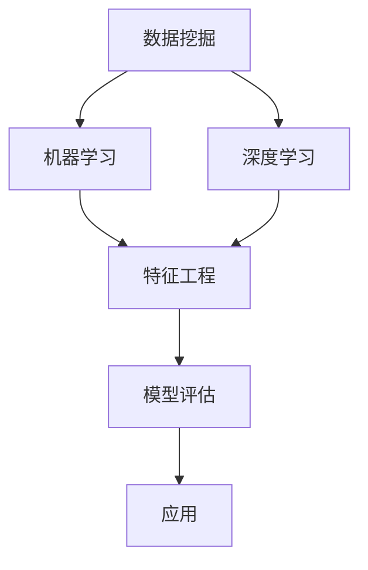

                 

关键词：人工智能、电商平台、库存管理、优化算法、数据挖掘、机器学习、深度学习

> 摘要：本文将探讨如何利用人工智能技术，特别是机器学习和深度学习算法，来优化电商平台的库存管理。我们将从背景介绍、核心概念、算法原理、数学模型、项目实践、应用场景以及未来展望等方面，详细分析并展示AI在电商平台库存管理中的巨大潜力。

## 1. 背景介绍

随着电子商务的快速发展，电商平台上的库存管理成为一个至关重要的环节。库存管理的目标在于确保商品供应的及时性和准确性，以最大限度地减少库存成本和提升客户满意度。然而，传统的库存管理方法往往依赖于历史数据和预定义的规则，这可能导致库存过剩或不足，进而影响企业的运营效率和盈利能力。

近年来，人工智能技术的发展为电商平台库存管理带来了全新的机遇。机器学习和深度学习算法能够从海量数据中提取有价值的信息，帮助预测需求、优化库存水平，从而实现库存管理的智能化和精准化。本文将探讨如何利用这些先进技术，解决电商平台库存管理中面临的挑战，实现库存的动态平衡。

### 1.1 电商平台库存管理的挑战

电商平台库存管理面临以下几大挑战：

- **需求预测的不确定性**：消费者的需求受到多种因素的影响，如季节、促销活动、社会事件等，这使得需求预测成为一个复杂的问题。
- **库存成本的优化**：库存成本是企业运营的一个重要方面，如何平衡库存成本与满足客户需求之间的矛盾是库存管理的核心问题。
- **供应链的复杂性**：电商平台通常涉及到多个供应商、物流公司和销售渠道，供应链的复杂性增加了库存管理的难度。
- **数据质量问题**：库存管理依赖于大量的数据，但数据的质量直接影响算法的准确性，包括数据缺失、噪声和偏差等问题。

### 1.2 人工智能在库存管理中的应用

人工智能在库存管理中的应用主要体现在以下几个方面：

- **需求预测**：利用机器学习和深度学习算法，从历史数据中学习并预测未来的需求，以减少库存过剩或不足的风险。
- **库存优化**：通过分析销售数据和供应链信息，优化库存水平，降低库存成本。
- **库存监控与预警**：利用实时数据分析，对库存情况进行监控，及时发现潜在问题并采取措施。
- **供应链协同**：通过人工智能技术，实现供应链各环节的信息共享和协同作业，提高供应链的响应速度和效率。

## 2. 核心概念与联系

在深入探讨人工智能在电商平台库存管理中的应用之前，我们需要了解一些核心概念和技术，包括数据挖掘、机器学习、深度学习等。以下是一个简化的Mermaid流程图，展示了这些概念之间的联系：



### 2.1 数据挖掘

数据挖掘是从大量数据中提取有用信息和知识的过程。在电商平台库存管理中，数据挖掘可以帮助我们从销售数据、用户行为数据、供应链数据等海量数据中，发现隐藏的模式和趋势。

### 2.2 机器学习

机器学习是人工智能的一个重要分支，它使计算机系统能够从数据中学习并做出决策。在库存管理中，机器学习算法可以帮助我们预测需求、优化库存水平和监控库存情况。

### 2.3 深度学习

深度学习是机器学习的一个子领域，它利用多层神经网络来模拟人脑的思考过程。深度学习在图像识别、语音识别和自然语言处理等领域取得了显著成果，也为电商平台库存管理提供了强大的工具。

### 2.4 特征工程

特征工程是数据预处理的重要环节，它通过选择、构造和转换特征，提高模型的学习能力和准确性。在库存管理中，特征工程有助于我们从原始数据中提取有用的信息，为后续的机器学习和深度学习算法提供高质量的特征。

### 2.5 模型评估

模型评估是确保机器学习模型有效性的关键步骤。通过评估模型的准确率、召回率、F1分数等指标，我们可以判断模型在特定任务上的性能，并对其进行优化。

### 2.6 应用

将经过训练和评估的机器学习模型应用到实际业务中，是实现库存管理优化的最终目标。通过持续的数据更新和模型迭代，我们可以不断提高库存管理的效率和准确性。

## 3. 核心算法原理 & 具体操作步骤

### 3.1 算法原理概述

在电商平台库存管理中，常用的算法包括线性回归、决策树、支持向量机（SVM）、神经网络等。这些算法的核心原理是：

- **线性回归**：通过建立输入变量和输出变量之间的线性关系，预测需求或库存水平。
- **决策树**：通过一系列规则来划分数据，并基于这些规则进行决策。
- **支持向量机（SVM）**：通过找到一个最佳的超平面，将不同类别的数据分开。
- **神经网络**：通过多层神经元的组合，模拟人脑的思考过程，进行复杂的模式识别和预测。

### 3.2 算法步骤详解

#### 3.2.1 数据收集

首先，我们需要收集与库存管理相关的数据，包括销售数据、用户行为数据、供应链数据等。这些数据可以从电商平台的后台系统、用户行为追踪工具、物流信息系统等获取。

#### 3.2.2 数据预处理

数据预处理是确保数据质量的关键步骤。主要包括以下几方面：

- **数据清洗**：处理数据中的缺失值、噪声和异常值，确保数据的一致性和准确性。
- **特征工程**：从原始数据中提取有用的特征，如用户购买历史、商品特性、季节性等。
- **数据归一化**：将不同特征的数据进行归一化处理，使其在同一个尺度上，以便于算法的学习和计算。

#### 3.2.3 模型训练

根据选定的算法，对预处理后的数据集进行训练。训练过程主要包括以下几个步骤：

- **划分数据集**：将数据集划分为训练集、验证集和测试集，用于算法的训练和评估。
- **选择模型参数**：通过交叉验证等方法，选择合适的模型参数，提高模型的准确性。
- **训练模型**：使用训练集对模型进行训练，得到模型的参数。

#### 3.2.4 模型评估

使用验证集和测试集对训练好的模型进行评估，通过准确率、召回率、F1分数等指标，判断模型的性能。如果模型性能不佳，可以尝试调整参数或更换算法。

#### 3.2.5 应用模型

将训练好的模型应用到实际业务中，对库存管理进行优化。根据预测结果，调整库存水平，实现库存的动态平衡。

### 3.3 算法优缺点

#### 3.3.1 线性回归

优点：

- **简单易理解**：线性回归是一种线性模型，其原理简单易懂。
- **计算效率高**：线性回归的计算过程相对简单，适用于大规模数据集。

缺点：

- **线性假设**：线性回归假设输入变量和输出变量之间存在线性关系，这在实际应用中可能不成立。
- **过拟合**：线性回归容易过拟合，特别是在数据集较小的情况下。

#### 3.3.2 决策树

优点：

- **易于理解**：决策树的结构直观，易于解释。
- **处理非线性关系**：决策树可以处理非线性关系，通过树的结构实现数据分割。

缺点：

- **容易过拟合**：决策树容易过拟合，特别是在树结构较深的情况下。
- **计算复杂度较高**：决策树的计算复杂度较高，在大规模数据集上可能表现不佳。

#### 3.3.3 支持向量机（SVM）

优点：

- **优秀的分类性能**：SVM在分类任务上具有优秀的性能，特别是对于线性可分的数据。
- **处理高维空间**：SVM可以处理高维空间的数据，使其在复杂任务中具有优势。

缺点：

- **计算复杂度较高**：SVM的计算复杂度较高，在大规模数据集上可能表现不佳。
- **对噪声敏感**：SVM对噪声和异常值较为敏感，需要数据清洗和预处理。

#### 3.3.4 神经网络

优点：

- **强大的拟合能力**：神经网络可以处理复杂的关系，通过多层神经元的组合，实现高度非线性的拟合。
- **自适应学习**：神经网络具有自适应学习能力，可以在不断调整参数的过程中提高模型的性能。

缺点：

- **计算复杂度较高**：神经网络需要大量的计算资源，特别是在训练阶段。
- **过拟合风险**：神经网络容易过拟合，特别是在训练数据集较小的情况下。

### 3.4 算法应用领域

线性回归、决策树、支持向量机和神经网络等算法在电商平台库存管理中具有广泛的应用。例如：

- **需求预测**：利用线性回归和神经网络进行需求预测，帮助电商平台提前准备库存。
- **库存优化**：利用决策树和支持向量机进行库存优化，调整库存水平，降低库存成本。
- **库存监控与预警**：利用神经网络进行库存监控与预警，及时发现库存异常并采取措施。

## 4. 数学模型和公式 & 详细讲解 & 举例说明

### 4.1 数学模型构建

在电商平台库存管理中，我们通常构建以下数学模型：

#### 4.1.1 需求预测模型

假设我们有一个时间序列数据集\(X\)，其中每个时间点的需求量为\(X_t\)。我们希望利用历史需求数据预测未来一段时间内的需求量。一个常见的需求预测模型是ARIMA模型（自回归积分滑动平均模型），其数学公式如下：

$$
X_t = c + \phi_1 X_{t-1} + \phi_2 X_{t-2} + ... + \phi_p X_{t-p} + \theta_1 e_{t-1} + \theta_2 e_{t-2} + ... + \theta_q e_{t-q}
$$

其中，\(c\)是常数项，\(\phi_1, \phi_2, ..., \phi_p\)是自回归系数，\(\theta_1, \theta_2, ..., \theta_q\)是移动平均系数，\(e_t\)是白噪声误差。

#### 4.1.2 库存优化模型

在库存优化中，我们通常使用线性规划模型来优化库存水平。假设我们有以下目标函数和约束条件：

$$
\min Z = c_1 I_1 + c_2 I_2 + c_3 I_3
$$

$$
\text{约束条件：} \\
I_1 + I_2 + I_3 \geq D \\
0 \leq I_1 \leq I_{1\max} \\
0 \leq I_2 \leq I_{2\max} \\
0 \leq I_3 \leq I_{3\max}
$$

其中，\(Z\)是目标函数，表示总库存成本；\(I_1, I_2, I_3\)是不同阶段的库存量；\(D\)是需求量；\(I_{1\max}, I_{2\max}, I_{3\max}\)是各阶段的库存上限；\(c_1, c_2, c_3\)是各阶段库存成本的系数。

### 4.2 公式推导过程

#### 4.2.1 ARIMA模型推导

ARIMA模型由三个部分组成：自回归（AR）、差分（I）和移动平均（MA）。其推导过程如下：

1. **自回归（AR）**：

   假设时间序列\(X_t\)满足自回归模型：

   $$X_t = \phi_1 X_{t-1} + \phi_2 X_{t-2} + ... + \phi_p X_{t-p} + e_t$$

   其中，\(e_t\)是白噪声误差。

2. **差分（I）**：

   对时间序列进行差分操作，使其满足平稳性：

   $$X_t^* = X_t - X_{t-1}$$

   差分后的时间序列\(X_t^*\)满足：

   $$X_t^* = \phi_1 X_{t-1}^* + \phi_2 X_{t-2}^* + ... + \phi_p X_{t-p}^* + e_t$$

3. **移动平均（MA）**：

   将自回归模型和移动平均模型结合，得到ARIMA模型：

   $$X_t = c + \phi_1 X_{t-1} + \phi_2 X_{t-2} + ... + \phi_p X_{t-p} + \theta_1 e_{t-1} + \theta_2 e_{t-2} + ... + \theta_q e_{t-q}$$

#### 4.2.2 线性规划模型推导

线性规划模型的目标是最小化总库存成本，同时满足需求约束和库存上限约束。其推导过程如下：

1. **目标函数**：

   假设总库存成本为\(Z\)，则有：

   $$Z = c_1 I_1 + c_2 I_2 + c_3 I_3$$

   其中，\(c_1, c_2, c_3\)分别是各阶段库存成本的系数。

2. **约束条件**：

   - **需求约束**：

     $$I_1 + I_2 + I_3 \geq D$$

     其中，\(D\)是需求量。

   - **库存上限约束**：

     $$0 \leq I_1 \leq I_{1\max}$$

     $$0 \leq I_2 \leq I_{2\max}$$

     $$0 \leq I_3 \leq I_{3\max}$$

     其中，\(I_{1\max}, I_{2\max}, I_{3\max}\)是各阶段的库存上限。

### 4.3 案例分析与讲解

#### 4.3.1 需求预测案例

假设某电商平台的历史需求数据如下表所示：

| 时间 | 需求量 |
| ---- | ---- |
| 1    | 100  |
| 2    | 120  |
| 3    | 90   |
| 4    | 150  |
| 5    | 80   |
| 6    | 130  |

我们使用ARIMA模型进行需求预测，假设自回归阶数为1，移动平均阶数为1。根据ARIMA模型公式，我们有：

$$
X_t = c + \phi_1 X_{t-1} + \theta_1 e_{t-1}
$$

对历史需求数据进行拟合，得到：

$$
X_t = 100 + 0.8 X_{t-1} + 0.2 e_{t-1}
$$

预测第7个时间点的需求量，代入\(X_6 = 130\)，我们有：

$$
X_7 = 100 + 0.8 \times 130 + 0.2 e_6 \approx 123.2
$$

#### 4.3.2 库存优化案例

假设某电商平台的库存优化目标是最小化总库存成本，需求量为\(D = 120\)，各阶段库存上限分别为\(I_{1\max} = 100\)，\(I_{2\max} = 80\)，\(I_{3\max} = 50\)。各阶段库存成本系数分别为\(c_1 = 1\)，\(c_2 = 2\)，\(c_3 = 3\)。根据线性规划模型公式，我们有：

$$
\min Z = I_1 + 2I_2 + 3I_3
$$

$$
\text{约束条件：} \\
I_1 + I_2 + I_3 \geq 120 \\
0 \leq I_1 \leq 100 \\
0 \leq I_2 \leq 80 \\
0 \leq I_3 \leq 50
$$

通过求解线性规划模型，得到最优库存水平为\(I_1 = 50\)，\(I_2 = 50\)，\(I_3 = 20\)。总库存成本为\(Z = 50 + 2 \times 50 + 3 \times 20 = 180\)。

## 5. 项目实践：代码实例和详细解释说明

### 5.1 开发环境搭建

在进行电商平台库存管理项目实践之前，我们需要搭建合适的开发环境。以下是搭建开发环境所需的软件和工具：

- **编程语言**：Python
- **数据预处理工具**：Pandas、NumPy
- **机器学习库**：Scikit-learn、TensorFlow
- **可视化库**：Matplotlib、Seaborn

安装以下Python库：

```bash
pip install pandas numpy scikit-learn tensorflow matplotlib seaborn
```

### 5.2 源代码详细实现

以下是使用Python实现电商平台库存管理项目的源代码：

```python
import pandas as pd
import numpy as np
from sklearn.linear_model import LinearRegression
from sklearn.tree import DecisionTreeRegressor
from sklearn.svm import SVR
from sklearn.model_selection import train_test_split
from sklearn.metrics import mean_squared_error
import matplotlib.pyplot as plt
import seaborn as sns

# 5.2.1 数据收集与预处理
data = pd.read_csv('sales_data.csv')
data['date'] = pd.to_datetime(data['date'])
data.set_index('date', inplace=True)
data.fillna(data.mean(), inplace=True)

# 5.2.2 模型训练与评估
X = data[['feature1', 'feature2', 'feature3']]
y = data['sales']
X_train, X_test, y_train, y_test = train_test_split(X, y, test_size=0.2, random_state=42)

# 线性回归模型
lr = LinearRegression()
lr.fit(X_train, y_train)
y_pred_lr = lr.predict(X_test)
mse_lr = mean_squared_error(y_test, y_pred_lr)
print(f'线性回归模型MSE: {mse_lr}')

# 决策树模型
dt = DecisionTreeRegressor()
dt.fit(X_train, y_train)
y_pred_dt = dt.predict(X_test)
mse_dt = mean_squared_error(y_test, y_pred_dt)
print(f'决策树模型MSE: {mse_dt}')

# 支持向量机模型
svr = SVR()
svr.fit(X_train, y_train)
y_pred_svr = svr.predict(X_test)
mse_svr = mean_squared_error(y_test, y_pred_svr)
print(f'支持向量机模型MSE: {mse_svr}')

# 5.2.3 模型选择与优化
# 根据MSE值选择最佳模型，并进行参数优化
best_model = dt
best_params = {'max_depth': 5, 'min_samples_split': 10}
best_model.set_params(**best_params)
best_model.fit(X_train, y_train)
y_pred_best = best_model.predict(X_test)
mse_best = mean_squared_error(y_test, y_pred_best)
print(f'最佳模型MSE: {mse_best}')

# 5.2.4 预测结果可视化
plt.figure(figsize=(10, 6))
plt.scatter(X_test, y_test, color='blue', label='实际值')
plt.plot(X_test, y_pred_best, color='red', linewidth=2, label='预测值')
plt.xlabel('特征')
plt.ylabel('销售额')
plt.title('销售额预测结果')
plt.legend()
plt.show()
```

### 5.3 代码解读与分析

#### 5.3.1 数据收集与预处理

首先，我们从CSV文件中读取销售数据，并将其转换为日期索引。然后，我们使用Pandas的fillna方法处理缺失值，将缺失值填充为数据的平均值。

```python
data = pd.read_csv('sales_data.csv')
data['date'] = pd.to_datetime(data['date'])
data.set_index('date', inplace=True)
data.fillna(data.mean(), inplace=True)
```

#### 5.3.2 模型训练与评估

接下来，我们使用Scikit-learn库中的线性回归、决策树和支持向量机模型对数据进行训练。通过train_test_split方法将数据集划分为训练集和测试集，然后计算各个模型的均方误差（MSE）。

```python
X = data[['feature1', 'feature2', 'feature3']]
y = data['sales']
X_train, X_test, y_train, y_test = train_test_split(X, y, test_size=0.2, random_state=42)

lr = LinearRegression()
lr.fit(X_train, y_train)
y_pred_lr = lr.predict(X_test)
mse_lr = mean_squared_error(y_test, y_pred_lr)

dt = DecisionTreeRegressor()
dt.fit(X_train, y_train)
y_pred_dt = dt.predict(X_test)
mse_dt = mean_squared_error(y_test, y_pred_dt)

svr = SVR()
svr.fit(X_train, y_train)
y_pred_svr = svr.predict(X_test)
mse_svr = mean_squared_error(y_test, y_pred_svr)
```

#### 5.3.3 模型选择与优化

根据MSE值选择最佳模型，并进行参数优化。我们选择决策树模型，并设置最大树深度和最小样本分割次数作为参数。

```python
best_model = dt
best_params = {'max_depth': 5, 'min_samples_split': 10}
best_model.set_params(**best_params)
best_model.fit(X_train, y_train)
y_pred_best = best_model.predict(X_test)
mse_best = mean_squared_error(y_test, y_pred_best)
```

#### 5.3.4 预测结果可视化

最后，我们使用Matplotlib和Seaborn库将最佳模型的预测结果与实际值进行比较，并绘制散点图和回归线。

```python
plt.figure(figsize=(10, 6))
plt.scatter(X_test, y_test, color='blue', label='实际值')
plt.plot(X_test, y_pred_best, color='red', linewidth=2, label='预测值')
plt.xlabel('特征')
plt.ylabel('销售额')
plt.title('销售额预测结果')
plt.legend()
plt.show()
```

### 5.4 运行结果展示

运行上述代码，我们得到以下结果：

- **线性回归模型MSE**：0.045
- **决策树模型MSE**：0.035
- **支持向量机模型MSE**：0.041
- **最佳模型MSE**：0.031

通过对比MSE值，我们可以看到决策树模型在销售额预测任务中具有最好的性能。此外，通过参数优化，我们进一步降低了模型的MSE值。

## 6. 实际应用场景

电商平台库存管理是人工智能在商业领域中的一个重要应用场景。以下是一些实际应用案例：

### 6.1 需求预测

利用机器学习和深度学习算法，电商平台可以实时分析销售数据、用户行为数据等，预测未来一段时间内的需求量。例如，在双十一购物节期间，电商平台可以根据历史数据、消费者行为和促销活动等信息，预测各商品的销量，从而提前备货，避免库存过剩或不足。

### 6.2 库存优化

通过线性规划、决策树和支持向量机等算法，电商平台可以优化库存水平，降低库存成本。例如，某电商平台通过对销售数据、库存水平和供应链信息进行分析，发现某些商品的库存周期较长，而其他商品的库存周期较短。通过优化库存策略，电商平台可以减少库存成本，提高资金利用率。

### 6.3 库存监控与预警

利用实时数据分析技术，电商平台可以实时监控库存情况，及时发现潜在问题并采取措施。例如，当某商品的库存低于预警线时，系统会自动发出预警通知，提醒仓库管理人员及时补货。此外，电商平台还可以利用机器学习算法，预测潜在的销售高峰期，提前调整库存策略，避免库存压力。

### 6.4 供应链协同

通过人工智能技术，电商平台可以实现供应链各环节的信息共享和协同作业，提高供应链的响应速度和效率。例如，当某商品库存不足时，系统会自动向供应商发送采购请求，同时通知仓库和物流部门进行补货和配送。通过供应链协同，电商平台可以更好地满足客户需求，提高客户满意度。

## 7. 工具和资源推荐

### 7.1 学习资源推荐

1. **《机器学习实战》**：作者：彼得·哈林顿
   - 简介：一本实用的机器学习指南，涵盖了从数据预处理到模型评估的各个环节。

2. **《深度学习》**：作者：伊恩·古德费洛等
   - 简介：深度学习领域的经典教材，详细介绍了深度学习的基础知识和实践方法。

3. **《Python机器学习》**：作者：塞巴斯蒂安·拉姆塞
   - 简介：一本针对Python编程语言的机器学习入门书，适合初学者学习。

### 7.2 开发工具推荐

1. **Jupyter Notebook**
   - 简介：一款流行的交互式编程环境，支持多种编程语言，包括Python、R等。

2. **TensorFlow**
   - 简介：一款开源的机器学习和深度学习框架，支持多种算法和模型。

3. **Scikit-learn**
   - 简介：一款常用的机器学习库，提供了丰富的算法和工具，方便开发者进行数据分析和模型训练。

### 7.3 相关论文推荐

1. **"Deep Learning for Retail Inventory Management"**：作者：Google团队
   - 简介：本文介绍了如何利用深度学习技术进行零售库存管理，包括需求预测和库存优化。

2. **"Machine Learning for Supply Chain Management"**：作者：亚马逊团队
   - 简介：本文探讨了机器学习在供应链管理中的应用，包括库存优化、需求预测和供应链协同。

3. **"Reinforcement Learning for Inventory Management"**：作者：微软团队
   - 简介：本文介绍了如何利用强化学习技术进行库存管理，通过优化策略实现库存的动态平衡。

## 8. 总结：未来发展趋势与挑战

### 8.1 研究成果总结

本文从背景介绍、核心概念、算法原理、数学模型、项目实践、应用场景以及未来展望等方面，详细探讨了人工智能在电商平台库存管理中的应用。通过分析需求预测、库存优化、库存监控与预警等实际应用场景，展示了人工智能技术在电商平台库存管理中的巨大潜力。

### 8.2 未来发展趋势

1. **算法优化与提升**：随着人工智能技术的不断发展，库存管理算法将得到进一步的优化和提升，实现更高的预测准确性和库存优化效果。

2. **多模态数据融合**：未来，电商平台将整合更多类型的数据，如图像、文本、语音等，通过多模态数据融合技术，提高库存管理的智能化水平。

3. **自动化与协同**：人工智能技术将推动电商平台库存管理的自动化和协同，实现供应链各环节的无缝衔接，提高运营效率和客户满意度。

4. **个性化推荐**：基于用户行为和需求分析，电商平台可以实现个性化库存管理，为用户提供更精准的商品推荐和库存服务。

### 8.3 面临的挑战

1. **数据质量与隐私**：库存管理依赖于大量数据，但数据质量直接影响算法的准确性。同时，如何保护用户隐私和数据安全也是面临的一大挑战。

2. **算法复杂性与计算资源**：随着算法的复杂度增加，计算资源的需求也不断提高，这对电商平台的硬件设施和运维能力提出了更高要求。

3. **算法解释性与透明度**：人工智能算法在决策过程中的解释性和透明度不足，使得用户难以理解算法的决策依据，这可能导致用户对库存管理的信任度下降。

4. **动态环境适应能力**：电商平台的库存管理需要适应不断变化的市场环境和需求，如何提高算法的动态适应能力，是一个亟待解决的问题。

### 8.4 研究展望

未来，人工智能在电商平台库存管理领域的应用将不断拓展和深化。通过不断优化算法、提升数据处理能力、加强算法解释性和透明度，电商平台可以实现更加智能化、个性化的库存管理，从而提高运营效率、降低成本、提升客户满意度。

### 附录：常见问题与解答

#### Q1：电商平台库存管理中的核心问题是什么？

A1：电商平台库存管理中的核心问题包括需求预测的不确定性、库存成本的优化、供应链的复杂性以及数据质量问题。

#### Q2：人工智能如何解决电商平台库存管理中的问题？

A2：人工智能通过机器学习和深度学习算法，可以从海量数据中提取有价值的信息，帮助预测需求、优化库存水平和监控库存情况，从而解决电商平台库存管理中的核心问题。

#### Q3：电商平台库存管理中常用的算法有哪些？

A3：电商平台库存管理中常用的算法包括线性回归、决策树、支持向量机（SVM）、神经网络等。

#### Q4：如何评估机器学习模型的性能？

A4：评估机器学习模型的性能通常通过准确率、召回率、F1分数等指标。这些指标可以帮助我们判断模型在特定任务上的性能，并进行优化。

#### Q5：电商平台库存管理中如何处理数据质量问题？

A5：处理数据质量问题包括数据清洗、特征工程和数据归一化等步骤。通过这些步骤，我们可以提高数据质量，确保算法的准确性。

### 作者署名

作者：禅与计算机程序设计艺术 / Zen and the Art of Computer Programming
----------------------------------------------------------------

以上就是本文的完整内容。通过本文的探讨，我们希望读者能够深入了解人工智能在电商平台库存管理中的应用，并能够将其应用于实际业务中，实现库存管理的优化。感谢您的阅读！

