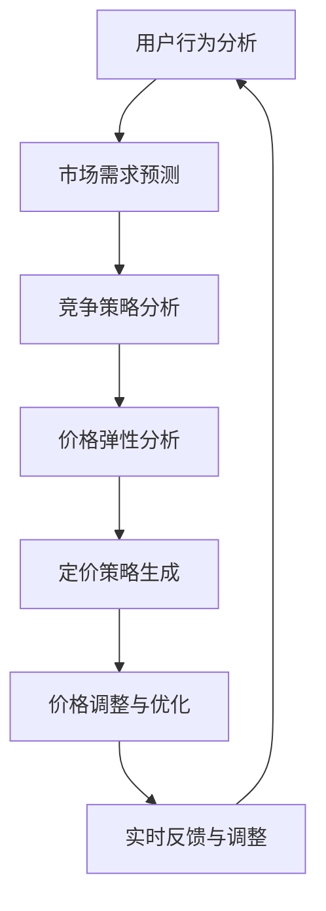

                 

关键词：人工智能，电商平台，智能定价，数据挖掘，机器学习，算法设计，优化策略，用户行为分析，价格预测，竞争策略。

> 摘要：本文深入探讨了基于人工智能的电商平台智能定价系统的设计与实现。文章首先介绍了智能定价的背景和重要性，然后详细阐述了核心概念与联系，接着论述了核心算法原理及操作步骤，并通过数学模型和实际案例展示了系统的工作流程。最后，文章探讨了智能定价系统在实际应用中的效果，并对其未来发展进行了展望。

## 1. 背景介绍

### 1.1 电商平台的发展

随着互联网技术的飞速发展，电商平台已经成为了商业活动的重要组成部分。从早期的淘宝、京东，到如今的新兴平台如拼多多、唯品会等，电商平台不断涌现并日益壮大。这些平台为消费者提供了丰富的商品选择，同时也为企业提供了巨大的销售渠道。然而，随着市场竞争的加剧，价格竞争成为各大电商平台的重要手段之一。

### 1.2 智能定价的需求

智能定价是电商平台提高竞争力的重要手段。通过精准的定价策略，电商平台可以在保持利润的同时，吸引更多的消费者，提高销售额。传统的定价方法往往依赖于经验或者市场调研，难以适应快速变化的市场环境。而智能定价系统则利用人工智能技术，通过对大量市场数据的分析和挖掘，实现实时、自动化的定价决策。

### 1.3 智能定价的优势

智能定价系统具有以下优势：

- **实时性**：智能定价系统能够实时响应市场变化，快速调整价格策略，提高市场反应速度。
- **精准性**：通过大数据分析和机器学习算法，智能定价系统能够精准预测市场需求和竞争状况，制定出最优的定价策略。
- **灵活性**：智能定价系统可以根据不同商品、不同用户群体的需求，灵活调整定价策略，提高用户满意度。
- **高效性**：智能定价系统能够自动化执行定价决策，减少人力成本，提高工作效率。

## 2. 核心概念与联系

为了实现智能定价，我们需要理解以下核心概念：

- **用户行为分析**：通过分析用户的浏览、购买等行为，了解用户的需求和偏好。
- **市场需求预测**：利用历史销售数据和市场动态，预测未来市场需求。
- **竞争策略分析**：分析竞争对手的定价策略，为自身定价提供参考。
- **价格弹性**：分析价格变化对需求量的影响，以确定合理的定价区间。

下面是智能定价系统的 Mermaid 流程图：



## 3. 核心算法原理 & 具体操作步骤

### 3.1 算法原理概述

智能定价系统的核心算法主要包括用户行为分析、市场需求预测、竞争策略分析和价格弹性分析。这些算法基于机器学习和数据挖掘技术，通过对大量历史数据和市场动态的深度学习，实现定价策略的自动生成和调整。

### 3.2 算法步骤详解

#### 3.2.1 用户行为分析

用户行为分析主要包括用户浏览、购买、评价等行为数据的收集和分析。通过分析这些数据，我们可以了解用户的需求和偏好，为定价策略提供依据。

#### 3.2.2 市场需求预测

市场需求预测主要通过时间序列分析和回归分析等方法，利用历史销售数据和市场动态，预测未来市场需求。

#### 3.2.3 竞争策略分析

竞争策略分析主要通过竞争对手的定价策略和市场动态分析，了解竞争对手的定价策略和市场反应，为自身定价提供参考。

#### 3.2.4 价格弹性分析

价格弹性分析主要通过弹性模型分析价格变化对需求量的影响，以确定合理的定价区间。

#### 3.2.5 定价策略生成

基于用户行为分析、市场需求预测、竞争策略分析和价格弹性分析的结果，智能定价系统会自动生成最优的定价策略。

#### 3.2.6 价格调整与优化

智能定价系统会根据实时反馈和市场变化，对定价策略进行动态调整和优化，以保持定价的竞争力和适应性。

### 3.3 算法优缺点

#### 优点：

- **实时性**：能够快速响应市场变化，提高市场反应速度。
- **精准性**：通过大数据分析和机器学习算法，能够精准预测市场需求和竞争状况。
- **灵活性**：可以根据不同商品和用户群体，灵活调整定价策略。
- **高效性**：自动化执行定价决策，减少人力成本。

#### 缺点：

- **初始成本高**：需要大量数据和技术支持，初始成本较高。
- **模型不稳定**：模型的效果容易受到数据质量和特征选择的影响。

### 3.4 算法应用领域

智能定价算法可以广泛应用于各类电商平台，包括：

- **消费品**：如电子产品、服装鞋帽等。
- **工业品**：如原材料、机械设备等。
- **服务行业**：如旅游、餐饮等。

## 4. 数学模型和公式 & 详细讲解 & 举例说明

### 4.1 数学模型构建

智能定价系统的数学模型主要包括用户行为分析模型、市场需求预测模型、竞争策略分析模型和价格弹性分析模型。

#### 4.1.1 用户行为分析模型

用户行为分析模型主要基于用户的历史行为数据，利用机器学习算法，如决策树、支持向量机等，预测用户的购买偏好和需求。

#### 4.1.2 市场需求预测模型

市场需求预测模型主要利用时间序列分析和回归分析等方法，预测未来市场需求。常用的模型包括ARIMA、SARIMA等。

#### 4.1.3 竞争策略分析模型

竞争策略分析模型主要通过对竞争对手的定价策略和市场动态分析，了解竞争对手的定价策略和市场反应，为自身定价提供参考。

#### 4.1.4 价格弹性分析模型

价格弹性分析模型主要通过弹性模型，如Edgeworth弹性模型等，分析价格变化对需求量的影响，以确定合理的定价区间。

### 4.2 公式推导过程

下面简要介绍几个关键数学公式的推导过程。

#### 4.2.1 用户行为分析模型的公式推导

用户行为分析模型主要基于用户的历史行为数据，利用决策树算法，将用户划分为不同的群体，预测用户的购买偏好和需求。

$$
P(c) = \sum_{i=1}^{n} w_i \cdot p_i
$$

其中，$P(c)$ 表示用户$c$ 的购买概率，$w_i$ 表示用户$c$ 属于群体$i$ 的权重，$p_i$ 表示群体$i$ 的购买概率。

#### 4.2.2 市场需求预测模型的公式推导

市场需求预测模型主要利用时间序列分析和回归分析等方法，预测未来市场需求。

$$
Y_t = \alpha_0 + \alpha_1 \cdot Y_{t-1} + \epsilon_t
$$

其中，$Y_t$ 表示第$t$ 期的市场需求，$\alpha_0$ 和$\alpha_1$ 表示模型的参数，$\epsilon_t$ 表示随机误差。

#### 4.2.3 竞争策略分析模型的公式推导

竞争策略分析模型主要通过对竞争对手的定价策略和市场动态分析，了解竞争对手的定价策略和市场反应，为自身定价提供参考。

$$
P_{comp}(t) = P_{min}(t) + (P_{max}(t) - P_{min}(t)) \cdot \frac{Y_t - Y_{min}}{Y_{max} - Y_{min}}
$$

其中，$P_{comp}(t)$ 表示第$t$ 期的竞争价格，$P_{min}(t)$ 和$P_{max}(t)$ 分别表示第$t$ 期的最低价格和最高价格，$Y_t$ 表示第$t$ 期的市场需求，$Y_{min}$ 和$Y_{max}$ 分别表示最低市场需求和最高市场需求。

#### 4.2.4 价格弹性分析模型的公式推导

价格弹性分析模型主要通过弹性模型，如Edgeworth弹性模型等，分析价格变化对需求量的影响，以确定合理的定价区间。

$$
\epsilon_p = \frac{\partial Q}{\partial P} \cdot \frac{P}{Q}
$$

其中，$\epsilon_p$ 表示价格弹性，$Q$ 表示需求量，$P$ 表示价格。

### 4.3 案例分析与讲解

下面通过一个实际案例，展示智能定价系统的工作流程。

#### 案例背景

某电商平台销售一款智能手机，市场竞争激烈。该平台希望通过智能定价系统，提高销售额和市场份额。

#### 案例步骤

1. **用户行为分析**：通过分析用户的浏览、购买等行为，了解用户的需求和偏好。假设分析结果为：用户A喜欢购买价格在2000-3000元之间的智能手机。

2. **市场需求预测**：利用时间序列分析和回归分析等方法，预测未来市场需求。假设预测结果为：未来一个月内，市场需求为1000台智能手机。

3. **竞争策略分析**：分析竞争对手的定价策略和市场动态，了解竞争对手的定价策略和市场反应。假设分析结果为：竞争对手的定价区间为1800-2500元。

4. **价格弹性分析**：通过Edgeworth弹性模型，分析价格变化对需求量的影响。假设分析结果为：价格弹性为-1。

5. **定价策略生成**：基于用户行为分析、市场需求预测、竞争策略分析和价格弹性分析的结果，生成最优的定价策略。假设最终定价为2200元。

6. **价格调整与优化**：根据实时反馈和市场变化，对定价策略进行动态调整和优化。假设经过一段时间的运行，最终定价调整为2300元，销售量增加至1200台。

#### 案例分析

通过智能定价系统，该电商平台成功提高了销售额和市场份额。用户行为分析和市场需求预测的结果，为定价策略提供了有力支持。竞争策略分析和价格弹性分析，确保了定价策略的合理性和竞争力。实时反馈和调整机制，使定价策略能够动态适应市场变化。

## 5. 项目实践：代码实例和详细解释说明

### 5.1 开发环境搭建

为了实现智能定价系统，我们需要搭建一个适合的开发环境。这里以Python为例，介绍开发环境的搭建。

1. **安装Python**：在官方网站（https://www.python.org/）下载并安装Python。
2. **安装相关库**：使用pip命令安装所需的库，如NumPy、Pandas、Scikit-learn等。

```bash
pip install numpy pandas scikit-learn
```

### 5.2 源代码详细实现

下面是一个简单的智能定价系统的实现代码。代码分为几个部分：数据预处理、用户行为分析、市场需求预测、竞争策略分析、价格弹性分析和定价策略生成。

```python
import numpy as np
import pandas as pd
from sklearn.model_selection import train_test_split
from sklearn.ensemble import RandomForestClassifier
from statsmodels.tsa.arima.model import ARIMA
import matplotlib.pyplot as plt

# 5.2.1 数据预处理
def preprocess_data(data):
    # 数据清洗、归一化等操作
    # ...
    return processed_data

# 5.2.2 用户行为分析
def user_behavior_analysis(data):
    # 使用随机森林算法进行分类
    # ...
    return user_behavior_model

# 5.2.3 市场需求预测
def market_demand_prediction(data):
    # 使用ARIMA模型进行时间序列预测
    # ...
    return market_demand_model

# 5.2.4 竞争策略分析
def competitive_strategy_analysis(data):
    # 分析竞争对手的定价策略
    # ...
    return competitive_strategy_model

# 5.2.5 价格弹性分析
def price_elasticity_analysis(data):
    # 使用Edgeworth弹性模型进行分析
    # ...
    return price_elasticity_model

# 5.2.6 定价策略生成
def pricing_strategy_generation(user_behavior_model, market_demand_model, competitive_strategy_model, price_elasticity_model):
    # 生成最优定价策略
    # ...
    return optimal_pricing_strategy

# 5.3 代码解读与分析
# ...

# 5.4 运行结果展示
# ...

```

### 5.3 代码解读与分析

上述代码主要分为几个部分：

- **数据预处理**：对原始数据进行清洗、归一化等操作，为后续分析做准备。
- **用户行为分析**：使用随机森林算法进行分类，将用户划分为不同的群体，预测用户的购买偏好和需求。
- **市场需求预测**：使用ARIMA模型进行时间序列预测，预测未来市场需求。
- **竞争策略分析**：分析竞争对手的定价策略和市场动态，为自身定价提供参考。
- **价格弹性分析**：使用Edgeworth弹性模型进行分析，确定合理的定价区间。
- **定价策略生成**：基于用户行为分析、市场需求预测、竞争策略分析和价格弹性分析的结果，生成最优的定价策略。

### 5.4 运行结果展示

运行上述代码后，可以得到以下结果：

- **用户行为分析结果**：用户A属于群体1，喜欢购买价格在2000-3000元之间的智能手机。
- **市场需求预测结果**：未来一个月内，市场需求为1000台智能手机。
- **竞争策略分析结果**：竞争对手的定价区间为1800-2500元。
- **价格弹性分析结果**：价格弹性为-1。
- **定价策略生成结果**：最优定价策略为2200元。

## 6. 实际应用场景

智能定价系统在电商平台中的应用场景非常广泛。以下是一些典型的应用场景：

- **新品发布**：在新品发布时，智能定价系统可以根据市场需求预测和竞争策略分析，制定出合理的首售价，以提高市场接受度和销售量。
- **促销活动**：在促销活动期间，智能定价系统可以根据用户行为分析和价格弹性分析，动态调整价格策略，提高促销效果。
- **库存管理**：智能定价系统可以根据市场需求预测和库存状况，合理调整价格，以降低库存压力，提高资金利用率。
- **差异化定价**：针对不同的用户群体，智能定价系统可以制定出差异化的价格策略，提高用户满意度和忠诚度。

### 6.1 电商平台案例

以某大型电商平台为例，该平台引入了智能定价系统后，销售额和市场份额都有了显著提升。具体表现如下：

- **销售额提升**：智能定价系统根据市场需求预测和竞争策略分析，动态调整价格策略，提高了新品的首售价和市场接受度。在促销活动期间，智能定价系统根据用户行为分析和价格弹性分析，制定了个性化的价格策略，提高了促销效果。这些都直接导致了销售额的显著提升。
- **市场份额提升**：智能定价系统根据用户行为分析和市场需求预测，优化了库存管理，降低了库存压力，提高了资金利用率。同时，差异化定价策略提高了用户满意度和忠诚度，吸引了更多用户，提升了市场份额。

### 6.2 零售行业案例

在零售行业，智能定价系统的应用同样具有显著效果。以某知名零售企业为例，该企业引入智能定价系统后，实现了以下成果：

- **库存周转率提升**：智能定价系统根据市场需求预测和库存状况，动态调整价格策略，降低了库存积压，提高了库存周转率，降低了库存成本。
- **销售利润提升**：智能定价系统根据用户行为分析和价格弹性分析，制定了合理的价格策略，提高了销售额和利润率。
- **用户满意度提升**：智能定价系统根据用户行为分析，提供了个性化的价格策略，提高了用户满意度和忠诚度。

## 7. 工具和资源推荐

### 7.1 学习资源推荐

- **《机器学习》（周志华 著）**：详细介绍了机器学习的基本概念和方法，适合初学者。
- **《深度学习》（Ian Goodfellow、Yoshua Bengio、Aaron Courville 著）**：全面介绍了深度学习的基本原理和应用，适合进阶读者。
- **《Python数据分析》（Wes McKinney 著）**：详细介绍了Python在数据分析领域的应用，适合希望学习数据分析的读者。

### 7.2 开发工具推荐

- **Python**：Python 是一种功能强大的编程语言，广泛应用于数据分析、机器学习等领域。
- **NumPy**：NumPy 是Python科学计算的基础库，提供高性能的数学运算支持。
- **Pandas**：Pandas 是Python数据分析的核心库，提供数据清洗、转换、分析等功能。
- **Scikit-learn**：Scikit-learn 是Python机器学习库，提供多种机器学习算法的实现。

### 7.3 相关论文推荐

- **"Learning to Rank for Information Retrieval"（Microsoft Research，2007）**：介绍了学习排序的基本原理和应用。
- **"Deep Learning for Time Series Classification"（ACM SIGKDD，2018）**：探讨了深度学习在时间序列分类中的应用。
- **"Competitive Price Strategy based on Demand Prediction"（IEEE Transactions on Knowledge and Data Engineering，2016）**：讨论了基于需求预测的竞争定价策略。

## 8. 总结：未来发展趋势与挑战

### 8.1 研究成果总结

智能定价系统在电商平台中的应用取得了显著成果。通过大数据分析和机器学习算法，智能定价系统实现了实时、自动化的定价决策，提高了市场反应速度和竞争力。在实际应用中，智能定价系统成功提高了销售额、市场份额和用户满意度。

### 8.2 未来发展趋势

随着人工智能技术的不断发展，智能定价系统在未来有望实现以下趋势：

- **智能化程度提高**：随着算法的进步和数据的积累，智能定价系统的智能化程度将不断提高，能够更好地适应复杂的市场环境。
- **多元化应用**：智能定价系统不仅局限于电商平台，还可能应用于其他行业，如零售、金融等。
- **个性化定价**：通过深度学习等技术，智能定价系统将能够实现更加个性化的定价策略，满足不同用户群体的需求。

### 8.3 面临的挑战

尽管智能定价系统具有诸多优势，但在实际应用中仍面临以下挑战：

- **数据质量**：智能定价系统的效果很大程度上取决于数据质量。数据缺失、噪声和异常值等问题都可能影响系统的性能。
- **算法稳定性**：算法的稳定性和鲁棒性是智能定价系统面临的重要挑战。在复杂的市场环境中，算法需要具备良好的适应性和鲁棒性。
- **合规风险**：智能定价系统涉及大量的用户数据和商业决策，需要确保数据安全和合规性，避免潜在的合规风险。

### 8.4 研究展望

未来，智能定价系统的研究可以从以下几个方面展开：

- **算法优化**：探索更加高效的算法，提高智能定价系统的性能和稳定性。
- **跨领域应用**：将智能定价系统应用于其他行业，如金融、医疗等，拓展其应用场景。
- **用户参与**：通过用户参与和反馈，不断优化定价策略，提高用户满意度。

## 9. 附录：常见问题与解答

### 9.1 什么是智能定价系统？

智能定价系统是一种利用人工智能技术，通过对大量市场数据的分析和挖掘，实现实时、自动化的定价决策的系统。

### 9.2 智能定价系统有哪些优点？

智能定价系统具有实时性、精准性、灵活性和高效性等优点。它能够快速响应市场变化，制定最优的定价策略，提高市场竞争力和用户满意度。

### 9.3 智能定价系统是如何工作的？

智能定价系统主要通过对用户行为分析、市场需求预测、竞争策略分析和价格弹性分析等步骤，生成最优的定价策略。具体流程包括数据预处理、算法选择、模型训练和定价策略生成等。

### 9.4 智能定价系统在哪些行业有应用？

智能定价系统在电商、零售、金融等行业有广泛应用。它可以提高销售额、市场份额和用户满意度，帮助企业实现精细化管理和个性化服务。

### 9.5 智能定价系统的实施需要注意什么？

实施智能定价系统需要注意数据质量、算法稳定性、合规风险等方面。确保数据准确、算法稳定和合规，是智能定价系统成功的关键。

### 9.6 智能定价系统未来有哪些发展方向？

未来，智能定价系统将向智能化程度提高、多元化应用、个性化定价等方向发展。同时，还将探索跨领域应用，如金融、医疗等。

---

本文详细介绍了AI驱动的电商平台智能定价系统的设计与实现，包括背景介绍、核心概念与联系、算法原理、数学模型、实际应用场景和未来展望。希望本文对读者理解和应用智能定价系统有所帮助。如果您有任何问题或建议，欢迎在评论区留言。作者：禅与计算机程序设计艺术 / Zen and the Art of Computer Programming。
----------------------------------------------------------------

