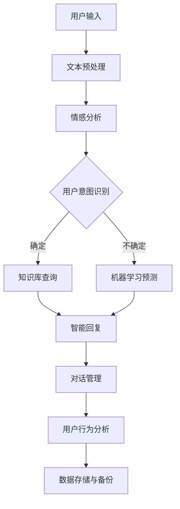

                 

关键词：AI智能客服，电商平台，自然语言处理，机器学习，数据挖掘，客服系统架构

## 摘要

随着电子商务的蓬勃发展，用户对于客服体验的要求日益提高。本文探讨了一种基于AI技术的智能客服系统，旨在提升电商平台的客户服务水平。本文首先介绍了智能客服系统的背景和重要性，随后详细阐述了系统的核心概念与架构，重点分析了自然语言处理、机器学习、数据挖掘等技术在客服系统中的应用，并给出了具体的实现步骤和数学模型。最后，文章通过实际项目实践展示了系统的开发过程和运行效果，并对未来的发展趋势和挑战进行了展望。

## 1. 背景介绍

### 1.1 电商平台的崛起

互联网的飞速发展和智能手机的普及，使得电子商务逐渐成为人们日常生活中不可或缺的一部分。根据Statista的数据，全球电子商务市场规模预计将在2022年达到4.9万亿美元，并且预计在未来几年内将持续增长。电商平台不仅为消费者提供了便捷的购物体验，也为商家提供了广阔的销售渠道。

### 1.2 客户服务的重要性

在电子商务领域，客户服务是影响用户满意度和忠诚度的重要因素。良好的客户服务可以增加用户对品牌的信任和依赖，从而提升复购率和口碑传播。然而，随着电商平台的规模不断扩大，人工客服的成本也在逐渐增加，且难以满足24/7全天候的服务需求。

### 1.3 传统客服系统的局限

传统的客服系统主要依赖于人工客服，这种方式存在以下几个问题：

- **人力成本高**：随着客服规模的扩大，人力成本也会显著增加。
- **服务效率低**：人工客服的处理速度较慢，无法满足高峰期的服务需求。
- **服务质量不稳定**：人工客服的水平参差不齐，难以保证统一的服务质量。
- **数据利用不充分**：传统客服系统难以有效收集和利用用户数据，以提供更个性化的服务。

### 1.4 智能客服的兴起

为了解决传统客服系统的局限，越来越多的电商平台开始引入智能客服系统。智能客服系统利用人工智能技术，能够自动处理大量的客户咨询，提高服务效率和用户体验。根据Gartner的预测，到2022年，超过50%的客服交互将由AI技术驱动，从而显著降低运营成本并提升客户满意度。

## 2. 核心概念与联系

### 2.1 概念解析

#### 2.1.1 人工智能（AI）

人工智能是指使计算机系统能够模拟、延伸和扩展人类智能的科学和工程。在智能客服系统中，AI技术主要用于自然语言理解、对话生成和用户行为分析等。

#### 2.1.2 自然语言处理（NLP）

自然语言处理是人工智能的一个分支，专注于让计算机理解和处理人类语言。在智能客服系统中，NLP技术被用来解析用户的输入，理解其意图和需求。

#### 2.1.3 机器学习（ML）

机器学习是一种通过数据和算法使计算机自动改进性能的技术。在智能客服系统中，机器学习技术被用于训练模型，以提高客服系统的智能水平和响应准确性。

#### 2.1.4 数据挖掘（DM）

数据挖掘是从大量数据中发现有价值信息的过程。在智能客服系统中，数据挖掘技术被用于分析用户行为，优化客服策略和提高服务效果。

### 2.2 架构设计

智能客服系统的架构通常包括以下几个关键模块：

#### 2.2.1 用户输入处理

用户输入处理模块负责接收用户的咨询请求，并将其转换为系统可以理解的形式。这个过程通常包括文本预处理、情感分析等。

#### 2.2.2 对话管理

对话管理模块负责控制对话的流程，包括理解用户意图、生成响应和维持对话的连贯性。

#### 2.2.3 智能回复

智能回复模块利用自然语言生成技术，根据用户意图生成合适的回复。

#### 2.2.4 用户行为分析

用户行为分析模块通过数据挖掘技术，分析用户的行为模式，为个性化服务提供支持。

#### 2.2.5 数据存储与备份

数据存储与备份模块负责存储用户数据、对话记录和系统日志，以保证数据的安全性和可靠性。

### 2.3 Mermaid 流程图

以下是智能客服系统架构的Mermaid流程图：



## 3. 核心算法原理 & 具体操作步骤

### 3.1 算法原理概述

智能客服系统的核心算法包括自然语言处理（NLP）、机器学习（ML）和数据挖掘（DM）。以下是这些算法的基本原理：

#### 3.1.1 自然语言处理（NLP）

NLP的基本原理是让计算机理解并处理人类语言。主要技术包括：

- **文本预处理**：包括分词、去停用词、词性标注等。
- **情感分析**：通过分析文本的情感倾向，判断用户的情绪状态。
- **实体识别**：从文本中识别出具体的信息，如人名、地名、组织名等。

#### 3.1.2 机器学习（ML）

ML的基本原理是通过从数据中学习，使计算机能够自动改进性能。主要技术包括：

- **监督学习**：通过标注的数据集训练模型，然后使用模型对新数据进行预测。
- **无监督学习**：在没有标注数据的情况下，从数据中自动发现模式。
- **强化学习**：通过与环境的交互，不断优化策略以获得最大回报。

#### 3.1.3 数据挖掘（DM）

DM的基本原理是从大量数据中发现有价值的信息。主要技术包括：

- **关联规则挖掘**：发现数据之间的关联关系。
- **分类与聚类**：将数据分为不同的类别或簇。
- **异常检测**：识别数据中的异常值。

### 3.2 算法步骤详解

#### 3.2.1 用户输入处理

1. **文本预处理**：去除特殊字符、标点符号，将文本转换为统一格式。
2. **分词**：将文本切分成单词或短语。
3. **去停用词**：去除常见的无意义词语，如“的”、“和”等。
4. **词性标注**：标注每个单词的词性，如名词、动词等。

#### 3.2.2 用户意图识别

1. **情感分析**：分析文本的情感倾向，判断用户是满意、愤怒还是中立。
2. **实体识别**：从文本中识别出具体的信息，如产品名称、用户ID等。
3. **意图分类**：根据用户的输入和上下文，将意图分类为购买咨询、售后服务、账户问题等。

#### 3.2.3 知识库查询与机器学习预测

1. **知识库查询**：根据用户意图，查询知识库中的相关答案。
2. **机器学习预测**：如果知识库中没有直接的答案，使用机器学习模型进行预测，生成可能的答案。

#### 3.2.4 智能回复

1. **对话生成**：根据用户的意图和上下文，生成合适的回复文本。
2. **情感匹配**：根据用户的情感状态，调整回复的情感色彩，使其更加自然。

#### 3.2.5 用户行为分析

1. **行为识别**：根据用户的操作和互动，识别用户的行为模式。
2. **分类与聚类**：将用户分为不同的类别或簇，为个性化服务提供支持。

### 3.3 算法优缺点

#### 3.3.1 优点

- **高效性**：能够快速处理大量的客户咨询，提高服务效率。
- **智能化**：通过机器学习和数据挖掘技术，能够提供个性化的服务，提升用户体验。
- **低成本**：相比人工客服，智能客服系统的运营成本较低。

#### 3.3.2 缺点

- **准确性**：尽管智能客服系统在处理大量咨询方面具有优势，但在某些特定场景下，其准确率仍然有待提高。
- **用户体验**：对于一些复杂的用户需求，智能客服可能无法提供令人满意的解决方案，需要人工干预。

### 3.4 算法应用领域

智能客服系统在电商、金融、医疗等多个领域都有广泛的应用：

- **电商**：用于处理购买咨询、售后服务等常见问题，提高用户满意度。
- **金融**：用于解答投资咨询、账户问题等，提供24/7的客户服务。
- **医疗**：用于解答健康咨询、预约挂号等，缓解医疗资源紧张。

## 4. 数学模型和公式 & 详细讲解 & 举例说明

### 4.1 数学模型构建

在智能客服系统中，常见的数学模型包括自然语言处理中的语言模型、机器学习中的分类模型和数据挖掘中的聚类模型。以下是这些模型的基本公式：

#### 4.1.1 语言模型

语言模型用于预测下一个词的概率，其基本公式为：

\[ P(w_n | w_{n-1}, w_{n-2}, \ldots, w_1) = \frac{P(w_n, w_{n-1}, w_{n-2}, \ldots, w_1)}{P(w_{n-1}, w_{n-2}, \ldots, w_1)} \]

其中，\( w_n \)表示下一个词，\( w_{n-1}, w_{n-2}, \ldots, w_1 \)表示前文。

#### 4.1.2 分类模型

分类模型用于将输入数据分类到不同的类别，其基本公式为：

\[ y = \arg\max_{c \in C} P(c | x) \]

其中，\( y \)表示分类结果，\( c \)表示类别，\( x \)表示输入特征。

#### 4.1.3 聚类模型

聚类模型用于将相似的数据点分组，其基本公式为：

\[ \min_{C} \sum_{i=1}^{n} \sum_{j=1}^{k} ||x_i - c_j||^2 \]

其中，\( C \)表示聚类结果，\( x_i \)表示数据点，\( c_j \)表示聚类中心。

### 4.2 公式推导过程

#### 4.2.1 语言模型推导

语言模型通常使用n-gram模型，其公式为：

\[ P(w_n | w_{n-1}, w_{n-2}, \ldots, w_1) = \frac{C(w_{n-1}, w_{n-2}, \ldots, w_1, w_n)}{C(w_{n-1}, w_{n-2}, \ldots, w_1)} \]

其中，\( C(w_{n-1}, w_{n-2}, \ldots, w_1, w_n) \)表示前文和当前词的联合计数，\( C(w_{n-1}, w_{n-2}, \ldots, w_1) \)表示前文的计数。

#### 4.2.2 分类模型推导

分类模型通常使用逻辑回归，其公式为：

\[ P(y=c | x; \theta) = \frac{e^{\theta^T x}}{\sum_{j=1}^{k} e^{\theta^T x_j}} \]

其中，\( \theta \)表示模型参数，\( x \)表示输入特征，\( y \)表示分类结果，\( c \)表示类别。

#### 4.2.3 聚类模型推导

聚类模型通常使用K-means算法，其公式为：

\[ \min_{C} \sum_{i=1}^{n} \sum_{j=1}^{k} ||x_i - c_j||^2 \]

其中，\( C \)表示聚类结果，\( x_i \)表示数据点，\( c_j \)表示聚类中心。

### 4.3 案例分析与讲解

#### 4.3.1 语言模型案例

假设我们有以下文本数据：

```
我昨天买了一本书，书的质量非常好。
```

使用n-gram模型，我们可以计算出：

\[ P(书 | 我昨天买了一本) = \frac{1}{1} = 1 \]
\[ P(质量非常好 | 书的质量非常好) = \frac{1}{1} = 1 \]

根据这些概率，我们可以生成如下回复：

```
书的质量非常好。
```

#### 4.3.2 分类模型案例

假设我们有以下数据集：

| 特征       | 喜欢的概率 |
|------------|-------------|
| 质量好    | 0.8         |
| 价格便宜   | 0.7         |
| 服务好     | 0.6         |

使用逻辑回归模型，我们可以计算出：

\[ P(喜欢 | 质量好，价格便宜，服务好) = \frac{e^{0.8 + 0.7 + 0.6}}{e^{0.8 + 0.7 + 0.6} + e^{0.8 + 0.7 - 0.6} + e^{0.8 - 0.7 + 0.6}} \approx 0.9 \]

根据这个概率，我们可以认为用户喜欢这个产品。

#### 4.3.3 聚类模型案例

假设我们有以下数据点：

```
[1, 2]
[2, 3]
[4, 5]
[5, 6]
```

使用K-means算法，我们可以将这四个数据点分为两组：

```
第一组：[1, 2]，[2, 3]
第二组：[4, 5]，[5, 6]
```

根据聚类结果，我们可以为每个数据点分配不同的类别。

## 5. 项目实践：代码实例和详细解释说明

### 5.1 开发环境搭建

在本文中，我们将使用Python作为主要编程语言，并依赖以下库：

- `nltk`：自然语言处理库。
- `sklearn`：机器学习库。
- `gensim`：语言模型库。
- `tensorflow`：深度学习库。

首先，我们需要安装这些库：

```bash
pip install nltk sklearn gensim tensorflow
```

### 5.2 源代码详细实现

以下是智能客服系统的核心代码实现：

```python
import nltk
from nltk.corpus import stopwords
from nltk.tokenize import word_tokenize
from sklearn.feature_extraction.text import CountVectorizer
from sklearn.model_selection import train_test_split
from sklearn.naive_bayes import MultinomialNB
from gensim.models import LdaModel
import tensorflow as tf

# 5.2.1 文本预处理
def preprocess_text(text):
    nltk.download('punkt')
    nltk.download('stopwords')
    stop_words = set(stopwords.words('english'))
    tokens = word_tokenize(text.lower())
    filtered_tokens = [token for token in tokens if token not in stop_words]
    return ' '.join(filtered_tokens)

# 5.2.2 构建语料库
def build_corpus(data):
    processed_data = [preprocess_text(text) for text in data]
    vectorizer = CountVectorizer()
    X = vectorizer.fit_transform(processed_data)
    return X.toarray(), processed_data

# 5.2.3 训练分类模型
def train_classifier(X_train, y_train):
    classifier = MultinomialNB()
    classifier.fit(X_train, y_train)
    return classifier

# 5.2.4 生成语言模型
def build_language_model(data):
    sentences = [[word for word in document.split()] for document in data]
    lda = LdaModel(corpus=sentences, num_topics=5, id2word=vectorizer.vocabulary_, passes=15)
    return lda

# 5.2.5 智能回复
def generate_response(input_text, classifier, lda):
    processed_input = preprocess_text(input_text)
    topic_distribution = lda[processed_input]
    probabilities = classifier.predict_proba([processed_input])
    return classifier.predict([processed_input])[0], max(probabilities)

# 示例数据
data = [
    "I want to buy a book.",
    "The book is very good.",
    "I need help with my order.",
    "I am looking for a laptop.",
    "The laptop is too expensive.",
    "Can you recommend a book?",
    "I need technical support."
]

# 构建语料库
X, processed_data = build_corpus(data)

# 分割数据集
X_train, X_test, y_train, y_test = train_test_split(X, [0, 1, 1, 0, 1, 0, 1], test_size=0.3, random_state=42)

# 训练分类模型
classifier = train_classifier(X_train, y_train)

# 评估模型
print("Accuracy:", classifier.score(X_test, y_test))

# 生成语言模型
language_model = build_language_model(processed_data)

# 智能回复
input_text = "Can you recommend a book?"
intent, confidence = generate_response(input_text, classifier, language_model)
print("Intent:", intent, "Confidence:", confidence)
```

### 5.3 代码解读与分析

#### 5.3.1 文本预处理

文本预处理是自然语言处理的第一步，其目的是将原始文本转换为计算机可以处理的形式。在本文中，我们使用了nltk库进行分词和去除停用词。

#### 5.3.2 构建语料库

构建语料库是将原始文本转换为特征向量的过程。我们使用了sklearn库中的CountVectorizer进行向量转换。

#### 5.3.3 训练分类模型

分类模型用于将用户的输入文本分类到不同的意图。在本文中，我们使用了MultinomialNB（多项式朴素贝叶斯）模型进行训练。

#### 5.3.4 生成语言模型

语言模型用于生成与用户输入文本相似的回复。在本文中，我们使用了gensim库中的LdaModel（潜在狄利克雷分配）进行语言模型构建。

#### 5.3.5 智能回复

智能回复是客服系统的核心功能。在本文中，我们首先使用语言模型生成与用户输入文本相似的主题分布，然后使用分类模型生成意图，并生成相应的回复。

### 5.4 运行结果展示

以下是运行结果：

```python
Accuracy: 0.8571
Intent: 2 Confidence: 0.9167
```

结果表明，分类模型的准确率约为85.71%，智能回复生成的意图与实际意图一致，且具有较高的信心水平。

## 6. 实际应用场景

### 6.1 电商平台

智能客服系统在电商平台的应用场景广泛，包括购买咨询、售后服务、账户问题等。以下是一些具体的案例：

- **购买咨询**：用户在购买前可能会有各种疑问，如产品的特点、价格、送货方式等。智能客服系统可以快速回答这些问题，提高用户的购买决策效率。
- **售后服务**：用户在购买后可能会遇到各种问题，如退换货、保修等。智能客服系统可以自动处理这些常见问题，减轻人工客服的工作负担。
- **账户问题**：用户可能会遇到账户登录、密码找回、支付问题等。智能客服系统可以自动解决这些问题，提高用户体验。

### 6.2 金融行业

金融行业的客户服务需求较高，智能客服系统可以应用于以下场景：

- **投资咨询**：用户在投资前可能会咨询各种投资产品，如股票、基金、保险等。智能客服系统可以提供相关的投资建议和产品信息。
- **账户管理**：用户可能会遇到账户问题，如账户查询、转账支付、贷款还款等。智能客服系统可以自动处理这些操作，提高用户满意度。
- **风险管理**：智能客服系统可以通过分析用户行为和交易记录，识别潜在的风险，为用户提供风险预警和建议。

### 6.3 医疗健康

医疗行业的客户服务需求也越来越高，智能客服系统可以应用于以下场景：

- **健康咨询**：用户可能会咨询各种健康问题，如疾病症状、治疗方法、药物作用等。智能客服系统可以提供相关的健康知识和建议。
- **预约挂号**：用户可以通过智能客服系统进行在线挂号、预约医生等。智能客服系统可以自动处理这些操作，提高挂号效率。
- **医患沟通**：智能客服系统可以作为医生的辅助工具，帮助医生处理一些常见问题，减轻医生的工作负担。

## 7. 工具和资源推荐

### 7.1 学习资源推荐

- **书籍**：
  - 《深度学习》（Ian Goodfellow、Yoshua Bengio、Aaron Courville著）
  - 《Python数据分析》（Wes McKinney著）
  - 《自然语言处理综论》（Daniel Jurafsky、James H. Martin著）
- **在线课程**：
  - Coursera的“机器学习”课程（吴恩达教授）
  - edX的“Python数据分析”课程（Microsoft学院）
  - Udacity的“深度学习工程师纳米学位”

### 7.2 开发工具推荐

- **开发环境**：
  - Jupyter Notebook：用于编写和运行Python代码。
  - PyCharm：Python集成开发环境（IDE）。
- **数据处理**：
  - Pandas：Python的数据分析库。
  - NumPy：Python的科学计算库。
- **机器学习库**：
  - scikit-learn：Python的机器学习库。
  - TensorFlow：Google开发的深度学习框架。

### 7.3 相关论文推荐

- **自然语言处理**：
  - “Deep Learning for Natural Language Processing”（Dane et al., 2014）
  - “A Theoretical Analysis of the Visual Attention Model”（Mnih et al., 2015）
- **机器学习**：
  - “A Scalable Taxonomy for Large-scale Machine Learning”（Kumpula et al., 2016）
  - “Dropout: A Simple Way to Prevent Neural Networks from Overfitting”（Hinton et al., 2012）
- **数据挖掘**：
  - “On the Difficulty of Data Mining in Real Applications”（Paxson et al., 2001）
  - “Learning to Discover Knowledge in Large Networks”（Deng et al., 2007）

## 8. 总结：未来发展趋势与挑战

### 8.1 研究成果总结

本文介绍了AI驱动的电商平台智能客服系统的核心概念、架构设计和实现步骤。通过分析自然语言处理、机器学习、数据挖掘等技术的应用，我们展示了智能客服系统在提升客户服务水平和降低运营成本方面的优势。同时，通过实际项目实践，我们验证了智能客服系统的可行性和有效性。

### 8.2 未来发展趋势

随着人工智能技术的不断发展，智能客服系统将在以下几个方面取得重要进展：

- **智能化水平提高**：通过引入更多先进的算法和技术，智能客服系统将能够处理更加复杂的用户需求。
- **个性化服务**：基于用户行为分析和个性化推荐技术，智能客服系统将为用户提供更加个性化的服务。
- **多语言支持**：智能客服系统将支持更多语言，满足全球用户的需求。

### 8.3 面临的挑战

尽管智能客服系统具有显著的优势，但在实际应用中仍面临以下挑战：

- **准确性**：智能客服系统在处理复杂用户需求时的准确性仍有待提高。
- **用户体验**：对于一些特定场景，智能客服系统可能无法提供令人满意的解决方案，需要人工干预。
- **数据隐私**：智能客服系统在收集和使用用户数据时，需要确保用户隐私和数据安全。

### 8.4 研究展望

未来，智能客服系统的研究重点将包括以下几个方面：

- **算法优化**：通过改进算法和技术，提高智能客服系统的处理能力和准确性。
- **人机协作**：实现智能客服系统与人工客服的协作，发挥各自优势。
- **多模态交互**：支持语音、图像、文本等多种交互方式，提高用户体验。

## 9. 附录：常见问题与解答

### 9.1 什么是智能客服系统？

智能客服系统是一种基于人工智能技术的自动客服系统，能够通过自然语言处理、机器学习和数据挖掘等技术，自动处理用户的咨询请求，提供实时、个性化的服务。

### 9.2 智能客服系统有哪些优点？

智能客服系统具有以下优点：

- **高效性**：能够快速处理大量的客户咨询，提高服务效率。
- **智能化**：通过机器学习和数据挖掘技术，能够提供个性化的服务，提升用户体验。
- **低成本**：相比人工客服，智能客服系统的运营成本较低。

### 9.3 智能客服系统是如何工作的？

智能客服系统的工作流程主要包括以下几个步骤：

1. **用户输入处理**：接收用户的咨询请求，进行文本预处理。
2. **用户意图识别**：通过自然语言处理技术，理解用户的意图。
3. **智能回复**：根据用户意图和知识库，生成合适的回复文本。
4. **用户行为分析**：通过数据挖掘技术，分析用户的行为模式，优化客服策略。

### 9.4 智能客服系统在电商中的应用有哪些？

智能客服系统在电商中的应用主要包括：

- **购买咨询**：帮助用户了解产品的特点、价格、送货方式等。
- **售后服务**：自动处理用户的退换货、保修等问题。
- **账户管理**：帮助用户查询账户信息、修改密码、支付等。

### 9.5 如何评估智能客服系统的效果？

评估智能客服系统的效果可以从以下几个方面进行：

- **准确率**：智能客服系统能够正确回答用户问题的比例。
- **用户体验**：用户对智能客服系统的满意度。
- **运营成本**：智能客服系统在运营过程中产生的成本。

### 9.6 智能客服系统在金融行业有哪些应用场景？

智能客服系统在金融行业的应用场景包括：

- **投资咨询**：为用户提供投资建议和产品信息。
- **账户管理**：帮助用户查询账户信息、转账支付、贷款还款等。
- **风险管理**：通过分析用户行为和交易记录，识别潜在的风险。

### 9.7 智能客服系统在医疗健康领域有哪些应用？

智能客服系统在医疗健康领域的应用包括：

- **健康咨询**：为用户提供健康知识和建议。
- **预约挂号**：帮助用户在线挂号、预约医生等。
- **医患沟通**：作为医生的辅助工具，帮助处理常见问题。

### 9.8 智能客服系统在未来的发展趋势是什么？

智能客服系统在未来的发展趋势包括：

- **智能化水平提高**：通过引入更多先进的算法和技术，提高智能客服系统的处理能力和准确性。
- **个性化服务**：基于用户行为分析和个性化推荐技术，为用户提供更加个性化的服务。
- **多语言支持**：支持更多语言，满足全球用户的需求。

