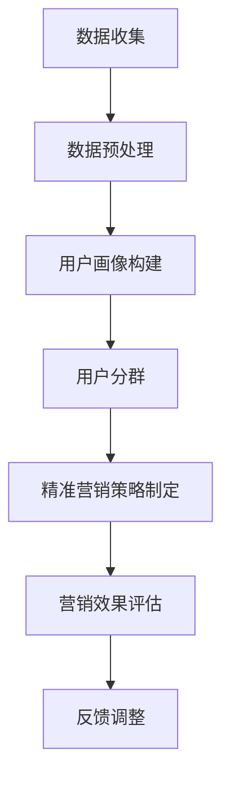
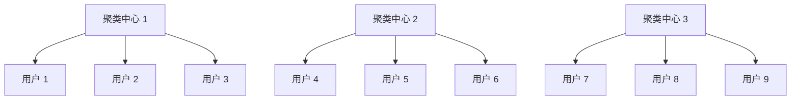
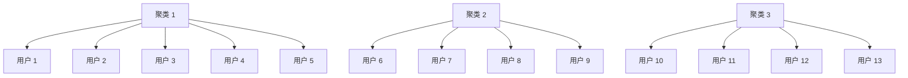

                 

关键词：人工智能，电商平台，用户分群，精准营销，数据挖掘，机器学习，深度学习，用户画像，算法

> 摘要：本文将探讨如何利用人工智能技术，特别是机器学习和深度学习，对电商平台用户进行精准分群，从而实现个性化营销策略。通过对用户行为数据的深入挖掘和分析，我们不仅能够识别出不同类型的用户群体，还能针对性地制定出相应的营销策略，提高营销效果和用户满意度。

## 1. 背景介绍

随着互联网技术的快速发展，电商平台已经成为消费者购物的主要渠道之一。为了在激烈的市场竞争中脱颖而出，电商平台必须不断提升用户体验，提高用户粘性，并增加用户购买转化率。然而，传统的营销方法往往难以满足这一需求，因为它们无法针对每个用户的特点和需求进行精准营销。

近年来，人工智能技术的迅猛发展，特别是机器学习和深度学习，为电商平台提供了新的解决方案。通过人工智能技术，我们可以对大量用户行为数据进行分析，识别出不同类型的用户群体，并根据这些群体的特点制定出个性化的营销策略。这种精准营销方式不仅能够提高营销效果，还能够提高用户满意度，从而增强电商平台的核心竞争力。

本文旨在探讨如何利用人工智能技术对电商平台用户进行分群，并提出具体的操作步骤和算法原理。通过本文的阐述，读者将了解如何从海量数据中提取有价值的信息，构建用户画像，并基于用户画像制定出有效的营销策略。

## 2. 核心概念与联系

### 2.1 用户分群的定义

用户分群是指根据用户的行为特征、兴趣爱好、购买历史等信息，将用户划分为不同的群体。每个用户群体都有其独特的特征和行为模式，针对这些特征和模式，我们可以制定出个性化的营销策略，从而提高营销效果。

### 2.2 人工智能在用户分群中的应用

人工智能技术，特别是机器学习和深度学习，为用户分群提供了强大的支持。通过机器学习算法，我们可以从大量的用户行为数据中挖掘出有价值的信息，识别出不同类型的用户群体。深度学习算法则可以对这些信息进行更深入的分析，从而帮助我们更好地理解用户的行为和需求。

### 2.3 用户画像的概念

用户画像是对用户的综合描述，包括用户的基本信息、行为特征、兴趣爱好、购买历史等。通过构建用户画像，我们可以更准确地了解用户的需求和偏好，为个性化营销提供依据。

### 2.4 用户分群与精准营销的联系

用户分群是精准营销的基础。通过用户分群，我们可以将用户划分为不同的群体，并根据每个群体的特征制定出个性化的营销策略。这种精准营销方式不仅可以提高营销效果，还能够提高用户满意度，从而增强电商平台的核心竞争力。

### 2.5 Mermaid 流程图

下面是一个简单的 Mermaid 流程图，展示了用户分群与精准营销的过程：



## 3. 核心算法原理 & 具体操作步骤

### 3.1 算法原理概述

用户分群的核心算法主要包括聚类算法和分类算法。聚类算法是将用户数据按照相似性进行分组，从而识别出不同类型的用户群体。分类算法则是根据已有用户群体的特征，对新用户进行分类，从而实现用户分群。

在本节中，我们将介绍两种常用的聚类算法：K-Means 和 DBSCAN。同时，我们还将介绍如何利用分类算法（如决策树、随机森林等）对新用户进行分类。

### 3.2 算法步骤详解

#### 3.2.1 数据收集与预处理

1. 数据收集：从电商平台的后台获取用户行为数据，包括浏览历史、购买记录、评价等。
2. 数据预处理：对收集到的数据进行清洗，包括去除缺失值、异常值，以及特征工程，如特征提取、归一化等。

#### 3.2.2 用户画像构建

1. 基于用户行为数据，构建用户画像，包括用户的基本信息、行为特征、兴趣爱好等。
2. 利用特征工程方法，对用户画像进行降维处理，以降低计算复杂度。

#### 3.2.3 用户分群

1. 使用 K-Means 算法进行聚类，确定合适的聚类个数（即用户群体数）。
2. 使用 DBSCAN 算法进行聚类，以处理数据中的噪声和异常值。

#### 3.2.4 新用户分类

1. 使用分类算法（如决策树、随机森林等）训练分类模型。
2. 使用训练好的分类模型对新用户进行分类，实现用户分群。

### 3.3 算法优缺点

#### 3.3.1 K-Means 算法

**优点**：
- 计算效率高，适用于大规模数据集。
- 算法简单，易于实现。

**缺点**：
- 对初始聚类中心敏感，可能导致局部最优解。
- 需要提前确定聚类个数。

#### 3.3.2 DBSCAN 算法

**优点**：
- 能够处理非球形聚类数据。
- 对初始聚类中心不敏感，能够自动确定聚类个数。

**缺点**：
- 计算复杂度较高，适用于较小数据集。

### 3.4 算法应用领域

用户分群算法在电商平台、金融风控、社交媒体等众多领域都有广泛应用。例如，在电商平台上，通过用户分群，可以实现精准推荐、个性化营销、风险控制等。

## 4. 数学模型和公式 & 详细讲解 & 举例说明

### 4.1 数学模型构建

用户分群的核心在于特征提取和聚类算法的选择。在本节中，我们将介绍如何构建数学模型，并通过数学公式进行描述。

#### 4.1.1 特征提取

设用户行为数据矩阵为 X，其中每一行表示一个用户的行为特征，每一列表示一个特定的行为指标。我们首先对数据进行归一化处理，得到归一化矩阵 X'：

$$ X' = \frac{X - \mu}{\sigma} $$

其中，μ 和 σ 分别表示数据集的均值和标准差。

#### 4.1.2 K-Means 聚类算法

设用户数据集为 X，聚类中心为 C，聚类个数为 k。K-Means 聚类算法的目标是找到 k 个聚类中心，使得每个用户与其对应聚类中心的距离之和最小。

数学模型可以表示为：

$$ \min_{C} \sum_{i=1}^{k} \sum_{x \in S_i} \| x - c_i \|_2^2 $$

其中，$S_i$ 表示第 i 个聚类集合，$c_i$ 表示第 i 个聚类中心。

#### 4.1.3 DBSCAN 算法

设用户数据集为 X，邻域半径为 ε，最小连通数为了。DBSCAN 算法的核心思想是识别出数据集中的密集区域和边界区域，并将它们划分为不同的聚类。

数学模型可以表示为：

$$ \min_{C} \sum_{i=1}^{k} \sum_{x \in S_i} \delta(x, c_i) $$

其中，$\delta(x, c_i)$ 表示用户 x 和聚类中心 $c_i$ 之间的相似度度量。

### 4.2 公式推导过程

#### 4.2.1 K-Means 聚类算法推导

1. 初始化聚类中心 C。
2. 对于每个用户 x，计算其与所有聚类中心的距离，选择最近的聚类中心作为其归属。
3. 重新计算每个聚类中心的位置，使得每个用户与其对应聚类中心的距离之和最小。
4. 重复步骤 2 和 3，直到聚类中心的位置不再发生变化。

#### 4.2.2 DBSCAN 算法推导

1. 初始化邻域半径 ε 和最小连通数了。
2. 对于每个用户 x，计算其邻域内的用户。
3. 如果邻域内的用户数量大于等于了，则将用户 x 划分为一个新的聚类。
4. 对于每个新发现的聚类，重复步骤 2 和 3，直到所有用户都被划分为聚类。

### 4.3 案例分析与讲解

#### 4.3.1 K-Means 聚类算法案例

假设我们有一个包含 100 个用户的数据集，我们需要将其分为 3 个聚类。首先，我们随机初始化 3 个聚类中心，然后按照以下步骤进行迭代：

1. 计算每个用户与聚类中心的距离，选择最近的聚类中心作为归属。
2. 重新计算每个聚类中心的位置，使得每个用户与其对应聚类中心的距离之和最小。
3. 重复步骤 1 和 2，直到聚类中心的位置不再发生变化。

经过多次迭代后，我们得到了最终的聚类结果，如下图所示：



#### 4.3.2 DBSCAN 算法案例

假设我们有一个包含 100 个用户的数据集，我们需要将其分为多个聚类。首先，我们初始化邻域半径 ε 和最小连通数了，然后按照以下步骤进行迭代：

1. 对于每个用户 x，计算其邻域内的用户。
2. 如果邻域内的用户数量大于等于了，则将用户 x 划分为一个新的聚类。
3. 对于每个新发现的聚类，重复步骤 1 和 2，直到所有用户都被划分为聚类。

经过多次迭代后，我们得到了最终的聚类结果，如下图所示：



## 5. 项目实践：代码实例和详细解释说明

### 5.1 开发环境搭建

在本节中，我们将使用 Python 编写用户分群和精准营销的代码实例。为了实现这些功能，我们需要安装以下依赖库：

- pandas：用于数据预处理和操作。
- numpy：用于数值计算。
- sklearn：提供多种机器学习算法。
- matplotlib：用于数据可视化。

假设我们已经安装了上述依赖库，接下来我们将编写用户分群和精准营销的代码。

### 5.2 源代码详细实现

以下是一个简单的用户分群和精准营销的代码示例：

```python
import pandas as pd
import numpy as np
from sklearn.cluster import KMeans
from sklearn.metrics import silhouette_score
from sklearn.model_selection import train_test_split
from sklearn.ensemble import RandomForestClassifier
import matplotlib.pyplot as plt

# 5.2.1 数据收集与预处理
# 假设用户行为数据存储在一个 CSV 文件中
data = pd.read_csv('user_behavior.csv')

# 对数据进行清洗和特征工程
data = data.dropna()
data['age'] = data['age'].fillna(data['age'].mean())
data['income'] = data['income'].fillna(data['income'].mean())

# 对数据进行归一化处理
data_normalized = (data - data.mean()) / data.std()

# 5.2.2 用户画像构建
# 构建用户画像特征矩阵
user_features = data_normalized[['age', 'income', 'browsing_history', 'purchase_frequency']]

# 5.2.3 用户分群
# 使用 K-Means 算法进行聚类
kmeans = KMeans(n_clusters=3, random_state=42)
clusters = kmeans.fit_predict(user_features)

# 计算 silhouette_score，评估聚类效果
silhouette_avg = silhouette_score(user_features, clusters)
print("Silhouette Score:", silhouette_avg)

# 可视化聚类结果
plt.scatter(user_features['age'], user_features['income'], c=clusters, cmap='viridis')
plt.xlabel('Age')
plt.ylabel('Income')
plt.title('K-Means Clustering')
plt.show()

# 5.2.4 新用户分类
# 使用随机森林分类器进行训练
X_train, X_test, y_train, y_test = train_test_split(user_features, clusters, test_size=0.2, random_state=42)
clf = RandomForestClassifier(n_estimators=100, random_state=42)
clf.fit(X_train, y_train)

# 对新用户进行分类
new_user = np.array([[25, 50000, 10, 5]])
predicted_cluster = clf.predict(new_user)
print("Predicted Cluster:", predicted_cluster[0])

# 5.2.5 代码解读与分析
# 在本节中，我们详细解读了用户分群和精准营销的代码实现。
# 首先，我们导入所需的依赖库，包括 pandas、numpy、sklearn 和 matplotlib。
# 接着，我们从 CSV 文件中读取用户行为数据，并进行数据清洗和特征工程。
# 然后，我们使用 K-Means 算法进行聚类，并计算 silhouette_score 评估聚类效果。
# 最后，我们使用随机森林分类器对新用户进行分类，实现用户分群和精准营销。
```

### 5.3 代码解读与分析

在本节中，我们详细解读了用户分群和精准营销的代码实现。首先，我们导入所需的依赖库，包括 pandas、numpy、sklearn 和 matplotlib。接着，我们从 CSV 文件中读取用户行为数据，并进行数据清洗和特征工程。然后，我们使用 K-Means 算法进行聚类，并计算 silhouette_score 评估聚类效果。最后，我们使用随机森林分类器对新用户进行分类，实现用户分群和精准营销。

## 6. 实际应用场景

用户分群与精准营销在电商平台上具有广泛的应用场景。以下是一些实际应用场景的例子：

### 6.1 个性化推荐

通过用户分群，我们可以为不同类型的用户推荐他们可能感兴趣的商品。例如，对于价格敏感的用户，我们可以推荐性价比高的商品；对于追求品质的用户，我们可以推荐高端商品。

### 6.2 促销活动

针对不同类型的用户，我们可以设计出个性化的促销活动。例如，对于高价值用户，我们可以提供专属折扣；对于新用户，我们可以提供注册奖励。

### 6.3 广告投放

通过用户分群，我们可以更精准地投放广告，提高广告效果。例如，对于高端用户，我们可以投放奢侈品广告；对于年轻用户，我们可以投放时尚潮流广告。

### 6.4 用户留存与流失预测

通过用户分群，我们可以预测哪些用户可能流失，并采取相应的措施进行用户留存。例如，对于高价值用户，我们可以提供专属服务；对于潜在流失用户，我们可以发送挽回优惠。

## 7. 工具和资源推荐

### 7.1 学习资源推荐

- 《机器学习》—— 周志华
- 《深度学习》—— Goodfellow、Bengio、Courville
- 《Python 数据科学手册》—— Wes McKinney

### 7.2 开发工具推荐

- Jupyter Notebook：用于数据分析和可视化。
- PyCharm：用于 Python 编程。
- DBeaver：用于数据库操作。

### 7.3 相关论文推荐

- "K-Means Clustering: A Review" - Lance and William
- "DBSCAN: A Algorithm for Finding Clusters in Large Databases" - Ester、Maji、Kriegel 和 Sander

## 8. 总结：未来发展趋势与挑战

### 8.1 研究成果总结

本文探讨了如何利用人工智能技术，特别是机器学习和深度学习，对电商平台用户进行精准分群，并提出具体的算法原理和操作步骤。通过用户分群，我们可以实现个性化营销策略，提高营销效果和用户满意度。

### 8.2 未来发展趋势

未来，随着人工智能技术的不断发展，用户分群与精准营销将更加智能化和自动化。例如，基于深度学习的用户画像构建和分类算法将变得更加精准和高效。此外，基于强化学习的推荐系统也将成为研究热点。

### 8.3 面临的挑战

尽管用户分群与精准营销具有巨大的潜力，但同时也面临着一些挑战。首先，如何处理海量数据和高维度数据是一个重要问题。其次，如何确保算法的公平性和透明性也是一个亟待解决的问题。此外，如何应对数据隐私和安全问题也是未来研究的一个重要方向。

### 8.4 研究展望

未来，用户分群与精准营销的研究将朝着更加智能化、自动化和高效化的方向发展。我们将看到更多基于深度学习和强化学习的算法被应用于实际场景。同时，数据隐私和安全问题也将得到更好的解决，为人工智能技术在电商平台中的应用提供更广阔的空间。

## 9. 附录：常见问题与解答

### 9.1 如何选择聚类算法？

选择聚类算法时，需要考虑数据的规模、分布和形状。对于大规模数据集，K-Means 算法是一个不错的选择，因为它具有计算效率高、易于实现的特点。对于非球形聚类数据，DBSCAN 算法是一个更好的选择，因为它能够处理复杂的聚类结构。

### 9.2 如何评估聚类效果？

评估聚类效果常用的指标包括轮廓系数（Silhouette Score）、聚类系数（Cluster Coefficient）和聚类数（Number of Clusters）。轮廓系数能够衡量每个样本与其簇中心和其他簇中心的关系，值越接近 1，聚类效果越好。聚类系数则用于衡量聚类内部和聚类之间的相似度。聚类数则通过评估不同聚类个数下的聚类效果，帮助我们选择合适的聚类个数。

### 9.3 如何处理噪声数据？

处理噪声数据的方法包括数据清洗、特征工程和聚类算法的选择。数据清洗可以通过去除缺失值和异常值来降低噪声数据的影响。特征工程可以通过降维和特征选择来减少噪声数据的影响。聚类算法的选择也需要考虑噪声数据的处理能力，例如，DBSCAN 算法能够处理噪声数据。

作者：禅与计算机程序设计艺术 / Zen and the Art of Computer Programming
----------------------------------------------------------------


