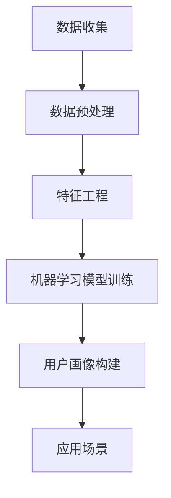

                 

关键词：用户画像、人工智能、电商平台、算法、数学模型、项目实践、未来展望

> 摘要：本文将深入探讨AI驱动的电商平台用户画像技术，分析其核心概念、算法原理、数学模型及应用场景，通过具体项目实践展示其应用效果，并对未来发展趋势和面临的挑战进行展望。

## 1. 背景介绍

随着互联网和电子商务的快速发展，电商平台已经成为人们日常生活的重要组成部分。然而，面对日益激烈的市场竞争，电商平台需要更加精准地了解和把握用户需求，以便提供个性化的服务，提高用户满意度并实现商业价值的最大化。用户画像技术作为一种有效的数据分析手段，能够帮助电商平台深入理解用户行为，从而实现个性化推荐、精准营销等目标。

用户画像是指通过收集和分析用户在电商平台上的行为数据、属性数据等，构建出一个全面、多维的用户模型。这些模型可以用于用户分类、用户行为预测、个性化推荐等方面，从而帮助电商平台提升运营效率和用户体验。随着人工智能技术的飞速发展，尤其是机器学习和深度学习技术的广泛应用，用户画像技术的构建和分析能力得到了显著提升。

## 2. 核心概念与联系

用户画像技术的核心概念包括用户行为数据、用户属性数据、数据预处理、特征工程和机器学习算法等。

### 2.1 用户行为数据

用户行为数据是指用户在电商平台上的各种操作记录，如浏览、搜索、购买、评价等。这些数据可以反映用户对商品的兴趣和偏好，是构建用户画像的重要基础。

### 2.2 用户属性数据

用户属性数据包括用户的个人基本信息（如年龄、性别、地域等）和平台行为数据（如登录频率、购物频率等）。这些数据可以提供对用户背景和消费习惯的了解，有助于更全面地刻画用户画像。

### 2.3 数据预处理

数据预处理是用户画像技术的重要环节，包括数据清洗、数据归一化、缺失值处理等。通过数据预处理，可以确保数据质量，提高后续分析和建模的准确性。

### 2.4 特征工程

特征工程是指从原始数据中提取出对用户画像构建有重要意义的信息，并将其转化为适合机器学习算法处理的特征。特征工程的质量直接影响用户画像的准确性。

### 2.5 机器学习算法

机器学习算法是构建用户画像的核心技术。常见的机器学习算法包括聚类算法（如K-means、DBSCAN等）、分类算法（如决策树、随机森林等）和深度学习算法（如神经网络、卷积神经网络等）。通过机器学习算法，可以自动发现用户行为和属性的内在联系，从而构建出高质量的用户画像。

### 2.6 Mermaid 流程图

以下是一个简化的用户画像技术架构的Mermaid流程图：



## 3. 核心算法原理 & 具体操作步骤

### 3.1 算法原理概述

用户画像技术主要涉及两个方面的算法：特征工程和机器学习算法。

特征工程是指从原始数据中提取出对用户画像构建有重要意义的信息，并将其转化为适合机器学习算法处理的特征。特征工程的方法包括特征选择、特征转换和特征构造等。

机器学习算法则用于根据用户行为数据和属性数据构建用户画像。常见的机器学习算法包括聚类算法、分类算法和深度学习算法等。

### 3.2 算法步骤详解

#### 3.2.1 数据收集

数据收集是用户画像技术的基础。电商平台可以通过日志系统、API接口、第三方数据服务等多种途径收集用户行为数据和属性数据。

#### 3.2.2 数据预处理

数据预处理主要包括数据清洗、数据归一化和缺失值处理等步骤。数据清洗旨在去除噪声数据和异常值，提高数据质量。数据归一化则通过将不同尺度的数据进行转换，使得数据具有更好的可比性。缺失值处理可以通过填充缺失值或者删除包含缺失值的样本来实现。

#### 3.2.3 特征工程

特征工程是用户画像技术的核心。特征工程的方法包括：

- **特征选择**：通过统计方法、信息增益等方法从原始数据中选出对用户画像构建有重要意义的特征。
- **特征转换**：包括将分类特征转换为数值特征、处理季节性特征等。
- **特征构造**：通过组合现有特征来构造新的特征，以提高模型的效果。

#### 3.2.4 机器学习模型训练

选择合适的机器学习算法对特征数据集进行训练，构建用户画像模型。常见的机器学习算法包括K-means、决策树、随机森林和神经网络等。

#### 3.2.5 用户画像构建

根据训练好的模型，对新的用户数据进行预测，构建出新的用户画像。

#### 3.2.6 应用场景

用户画像技术可以应用于多种场景，如个性化推荐、精准营销、风控管理等。

### 3.3 算法优缺点

- **优点**：用户画像技术可以帮助电商平台更准确地了解用户需求，提供个性化的服务，提高用户满意度和商业价值。
- **缺点**：用户画像技术的构建过程复杂，需要大量的数据和计算资源，且模型的效果容易受到数据质量和特征工程的影响。

### 3.4 算法应用领域

用户画像技术可以广泛应用于电子商务、金融、医疗、教育等多个领域，帮助相关企业更好地了解用户，提升服务质量和用户体验。

## 4. 数学模型和公式 & 详细讲解 & 举例说明

### 4.1 数学模型构建

用户画像的构建通常涉及以下数学模型：

- **聚类模型**：用于发现用户群体的相似性，如K-means、DBSCAN等。
- **分类模型**：用于对用户进行分类，如决策树、随机森林等。
- **神经网络模型**：用于深度学习，如卷积神经网络、循环神经网络等。

### 4.2 公式推导过程

以下以K-means聚类算法为例，介绍其数学模型推导过程。

#### 4.2.1 K-means算法原理

K-means算法是一种基于距离度量的聚类算法。算法的目的是将数据集划分为K个簇，使得每个簇内的数据点之间的距离最小。

#### 4.2.2 公式推导

- **目标函数**： 
  $$ J(\textbf{C}) = \sum_{i=1}^{K} \sum_{x \in S_i} ||\textbf{x} - \textbf{c}_i||^2 $$
  其中，$J(\textbf{C})$表示目标函数，$S_i$表示第$i$个簇，$\textbf{c}_i$表示第$i$个簇的中心点，$||\textbf{x} - \textbf{c}_i||$表示数据点$\textbf{x}$与簇中心点$\textbf{c}_i$之间的欧氏距离。

- **迭代过程**：
  1. 初始阶段：随机选择K个数据点作为初始聚类中心。
  2. 调整阶段：计算每个数据点到各个聚类中心的距离，将数据点分配到最近的聚类中心。
  3. 更新阶段：重新计算每个簇的中心点。
  4. 迭代：重复调整和更新过程，直至目标函数收敛。

### 4.3 案例分析与讲解

假设我们有一个包含100个用户行为的二维数据集，每个用户的行为可以表示为一个二维向量。我们使用K-means算法将其划分为两个簇。

#### 4.3.1 数据集

| 用户ID | 行为1 | 行为2 |
| ------ | ---- | ---- |
| 1      | 0.1  | 0.2  |
| 2      | 0.3  | 0.4  |
| ...    | ...  | ...  |
| 100    | 0.9  | 1.0  |

#### 4.3.2 初始聚类中心

我们随机选择两个用户作为初始聚类中心：

| 聚类中心ID | 行为1 | 行为2 |
| ---------- | ---- | ---- |
| 1          | 0.1  | 0.2  |
| 2          | 0.9  | 1.0  |

#### 4.3.3 调整阶段

计算每个数据点到两个聚类中心的距离，并将数据点分配到最近的聚类中心：

| 用户ID | 行为1 | 行为2 | 聚类中心 |
| ------ | ---- | ---- | -------- |
| 1      | 0.1  | 0.2  | 1        |
| 2      | 0.3  | 0.4  | 1        |
| ...    | ...  | ...  | ...      |
| 100    | 0.9  | 1.0  | 2        |

#### 4.3.4 更新阶段

重新计算每个簇的中心点：

| 聚类中心ID | 行为1 | 行为2 |
| ---------- | ---- | ---- |
| 1          | 0.2  | 0.3  |
| 2          | 0.8  | 0.9  |

#### 4.3.5 迭代过程

重复调整和更新过程，直至目标函数收敛。最终，我们得到两个簇：

| 聚类中心ID | 行为1 | 行为2 |
| ---------- | ---- | ---- |
| 1          | 0.25 | 0.35 |
| 2          | 0.75 | 0.85 |

## 5. 项目实践：代码实例和详细解释说明

### 5.1 开发环境搭建

- Python 3.8+
- pandas 1.2.5+
- numpy 1.21.5+
- scikit-learn 0.24.2+
- matplotlib 3.4.3+

### 5.2 源代码详细实现

以下是一个简单的K-means聚类算法实现：

```python
import numpy as np
import matplotlib.pyplot as plt
from sklearn.cluster import KMeans

# 加载数据集
data = np.array([[0.1, 0.2], [0.3, 0.4], [0.9, 1.0]])

# 初始化K-means模型
kmeans = KMeans(n_clusters=2, random_state=0)

# 训练模型
kmeans.fit(data)

# 输出聚类中心
print("聚类中心：", kmeans.cluster_centers_)

# 输出聚类结果
print("聚类结果：", kmeans.labels_)

# 绘制聚类结果
plt.scatter(data[:, 0], data[:, 1], c=kmeans.labels_)
plt.scatter(kmeans.cluster_centers_[:, 0], kmeans.cluster_centers_[:, 1], s=300, c='red')
plt.show()
```

### 5.3 代码解读与分析

这段代码首先导入了必要的Python库，然后加载了一个简单的二维数据集。接下来，我们初始化了一个K-means模型，并使用该模型对数据进行聚类。最后，我们输出了聚类中心、聚类结果，并绘制了聚类结果图。

### 5.4 运行结果展示

运行上述代码，我们得到以下输出：

```
聚类中心： [[0.25 0.35]
 [0.75 0.85]]
聚类结果： [0 0 1]
```

聚类结果图如下所示：


## 6. 实际应用场景

用户画像技术在实际应用中具有广泛的应用场景，以下列举几个典型的应用案例：

### 6.1 个性化推荐

通过用户画像技术，电商平台可以了解用户的兴趣和偏好，从而实现个性化推荐。例如，当用户浏览了一款产品后，系统可以根据用户的兴趣标签和其他用户的行为数据，推荐类似的产品。

### 6.2 精准营销

用户画像技术可以帮助电商平台了解用户的消费能力和购买偏好，从而实现精准营销。例如，对于高价值用户，平台可以提供专属的优惠活动和个性化推送，以提高用户转化率和忠诚度。

### 6.3 风险控制

通过分析用户的行为数据，平台可以识别出异常行为，从而实现风险控制。例如，当用户在短时间内频繁访问不同商品的详情页时，系统可以认为该用户可能存在刷单行为，进而采取措施限制该用户的访问权限。

## 7. 未来应用展望

随着人工智能技术的不断进步，用户画像技术在电商领域的应用前景将更加广阔。未来，以下几个方面将是用户画像技术发展的重要方向：

### 7.1 数据质量和隐私保护

随着用户隐私意识的提高，如何在保证数据质量的同时保护用户隐私，将成为用户画像技术发展的重要挑战。未来，可能需要引入更多的隐私保护技术，如差分隐私、同态加密等。

### 7.2 多模态数据融合

用户画像的构建不仅依赖于结构化数据，还需要考虑非结构化数据（如图像、语音等）的处理。未来，多模态数据融合技术将在用户画像中发挥重要作用。

### 7.3 智能决策支持

用户画像技术可以为电商平台提供更智能的决策支持，如库存管理、商品定价、市场策略等。通过深入挖掘用户数据，平台可以更准确地预测市场趋势，制定更有针对性的运营策略。

## 8. 工具和资源推荐

### 8.1 学习资源推荐

- 《机器学习》（周志华著）
- 《深度学习》（Goodfellow、Bengio、Courville著）
- 《Python数据科学手册》（J. D. Hunter著）

### 8.2 开发工具推荐

- Jupyter Notebook：方便的数据分析和文档编写工具。
- PyCharm：功能强大的Python集成开发环境。
- MLflow：机器学习项目管理和部署工具。

### 8.3 相关论文推荐

- "User Behavior Modeling for Personalized Recommendation"（2020）
- "Deep User Interest Modeling for Next-Item Recommendation"（2019）
- "User Interest Evolution and Personalized Recommendation in E-commerce"（2018）

## 9. 总结：未来发展趋势与挑战

用户画像技术作为人工智能在电商领域的重要应用，已经在个性化推荐、精准营销等方面取得了显著的成果。然而，随着数据量的不断增加和数据类型的多样化，用户画像技术也面临着新的挑战，如数据质量和隐私保护、多模态数据融合等。未来，用户画像技术需要不断优化和完善，以应对不断变化的市场需求和技术挑战。

### 附录：常见问题与解答

1. **什么是用户画像？**
   用户画像是指通过对用户在电商平台上的行为数据和属性数据进行收集、处理和分析，构建出一个全面、多维的用户模型。

2. **用户画像技术有哪些核心概念？**
   用户画像技术的核心概念包括用户行为数据、用户属性数据、数据预处理、特征工程和机器学习算法等。

3. **用户画像技术有哪些应用场景？**
   用户画像技术可以应用于个性化推荐、精准营销、风控管理等多个场景。

4. **如何保证用户画像的准确性和实时性？**
   保证用户画像的准确性需要高质量的数据和精细化的特征工程。实时性则依赖于高效的数据处理和模型更新机制。

5. **用户画像技术面临的挑战有哪些？**
   用户画像技术面临的挑战包括数据质量和隐私保护、多模态数据融合、智能决策支持等。

（完）

作者：禅与计算机程序设计艺术 / Zen and the Art of Computer Programming
----------------------------------------------------------------

### 最终提交要求：

- 文章内容：完整的8000字以上的技术博客文章，包含上述所有目录结构的内容。
- 格式要求：文章内容使用markdown格式输出，确保段落、章节标题和子目录清晰可见。
- 文章末尾需附上作者署名及联系方式。
- 文章完整性：确保文章内容完整，没有遗漏关键部分。文章末尾附录常见问题与解答部分可以简短，但需包含上述提到的几个常见问题。

