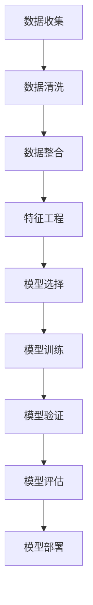

                 

关键词：人工智能、电商平台、用户行为预测、机器学习、深度学习、预测模型

> 摘要：本文将深入探讨AI驱动的电商平台用户行为预测模型的构建、实现和应用。通过对核心算法原理、数学模型、项目实践等方面的详细分析，本文旨在为电商行业从业者提供一套完整的用户行为预测解决方案。

## 1. 背景介绍

随着互联网技术的飞速发展和电子商务的普及，电商平台已经成为现代零售业的重要组成部分。然而，如何在众多竞争者中脱颖而出，提供个性化的购物体验，成为电商平台亟待解决的问题。用户行为预测技术应运而生，通过对用户的历史行为数据进行分析，可以帮助电商平台更好地理解用户需求，从而实现精准营销和个性化推荐。

用户行为预测技术是机器学习与数据挖掘领域的一个重要研究方向，旨在通过历史行为数据预测用户的未来行为。在电商平台，这一技术的应用主要体现在以下几个方面：

1. **个性化推荐**：根据用户的历史购物行为和浏览记录，推荐用户可能感兴趣的商品，提高用户满意度和购物转化率。
2. **流失用户预测**：通过对用户的行为数据进行分析，预测哪些用户可能会流失，从而采取相应的措施提高用户留存率。
3. **需求预测**：根据用户的行为数据预测商品的销售趋势，为电商平台库存管理和采购决策提供依据。
4. **广告投放优化**：根据用户的行为数据预测用户对不同广告的反应，优化广告投放策略，提高广告效果。

## 2. 核心概念与联系

在构建AI驱动的电商平台用户行为预测模型之前，我们需要了解一些核心概念和它们之间的关系。

### 2.1 数据来源

电商平台用户行为预测的数据来源主要包括以下几个方面：

1. **用户注册信息**：包括用户的基本信息（如年龄、性别、地理位置等）。
2. **购物行为数据**：包括用户的购买记录、浏览历史、收藏商品等。
3. **行为轨迹数据**：包括用户在平台上的浏览、搜索、点击、评价等操作。
4. **社交网络数据**：包括用户在社交媒体上的活动，如点赞、评论、分享等。

### 2.2 数据处理

在获取到用户行为数据后，需要进行数据处理，主要包括数据清洗、数据整合、特征工程等步骤。

1. **数据清洗**：去除数据中的噪声和异常值，保证数据的准确性和完整性。
2. **数据整合**：将不同来源的数据进行整合，形成一个统一的数据集。
3. **特征工程**：从原始数据中提取对预测模型有用的特征，如用户活跃度、购买频率、商品类别等。

### 2.3 模型构建

用户行为预测模型主要分为以下几个步骤：

1. **数据预处理**：对数据进行归一化、编码等处理，使其符合模型的输入要求。
2. **特征选择**：从大量特征中选择对预测模型贡献较大的特征，降低模型复杂度。
3. **模型选择**：选择合适的机器学习算法构建预测模型，如线性回归、决策树、神经网络等。
4. **模型训练与验证**：使用训练集对模型进行训练，并使用验证集对模型进行验证，调整模型参数。
5. **模型评估**：使用测试集对模型的预测效果进行评估，选择最优模型。

### 2.4 Mermaid 流程图

以下是用户行为预测模型的Mermaid流程图：



## 3. 核心算法原理 & 具体操作步骤

### 3.1 算法原理概述

用户行为预测算法主要基于机器学习和深度学习技术。以下是几种常用的算法：

1. **线性回归**：通过建立用户特征与用户行为之间的线性关系进行预测。
2. **决策树**：通过树形结构对用户行为进行分类。
3. **神经网络**：通过多层神经网络学习用户行为特征，实现复杂非线性预测。
4. **聚类算法**：如K-means算法，对用户进行聚类，分析不同用户群体的行为特征。
5. **关联规则算法**：如Apriori算法，挖掘用户行为之间的关联性。

### 3.2 算法步骤详解

以下是构建用户行为预测模型的详细步骤：

#### 3.2.1 数据预处理

1. **数据清洗**：去除缺失值、异常值和重复值，保证数据质量。
2. **数据归一化**：将不同量级的特征进行归一化处理，使其对模型的影响一致。
3. **数据编码**：将分类特征进行编码，如将性别特征转换为0和1。

#### 3.2.2 特征工程

1. **特征选择**：通过相关性分析、主成分分析等方法选择对预测模型贡献较大的特征。
2. **特征构造**：根据业务需求，构造新的特征，如用户活跃度、购买频率等。

#### 3.2.3 模型选择

1. **模型评估**：使用交叉验证方法评估不同模型的预测性能。
2. **模型选择**：选择性能最优的模型进行训练。

#### 3.2.4 模型训练与验证

1. **模型训练**：使用训练集对模型进行训练，调整模型参数。
2. **模型验证**：使用验证集对模型进行验证，调整模型参数。

#### 3.2.5 模型评估

1. **模型评估**：使用测试集对模型的预测效果进行评估。
2. **模型优化**：根据评估结果对模型进行优化。

### 3.3 算法优缺点

以下是几种常见算法的优缺点：

1. **线性回归**：
   - 优点：简单易实现，易于理解和解释。
   - 缺点：对非线性数据拟合效果较差，无法处理复杂的关系。

2. **决策树**：
   - 优点：易于理解，可以处理多类别输出。
   - 缺点：容易过拟合，对连续特征处理能力较差。

3. **神经网络**：
   - 优点：可以处理复杂非线性关系，自适应能力强。
   - 缺点：模型复杂度高，训练过程需要大量时间和计算资源。

4. **聚类算法**：
   - 优点：可以挖掘用户行为模式，为个性化推荐提供依据。
   - 缺点：聚类结果依赖于初始化参数，结果可能不稳定。

5. **关联规则算法**：
   - 优点：可以挖掘用户行为之间的关联性，为交叉销售和精准营销提供支持。
   - 缺点：对数据量要求较高，计算复杂度较高。

### 3.4 算法应用领域

用户行为预测算法在电商、金融、社交网络等众多领域都有广泛应用：

1. **电商平台**：通过用户行为预测，实现个性化推荐、流失用户预测和需求预测等功能。
2. **金融机构**：通过用户行为预测，识别潜在欺诈行为，降低风险。
3. **社交网络**：通过用户行为预测，推荐好友、推荐内容等功能，提高用户活跃度。

## 4. 数学模型和公式 & 详细讲解 & 举例说明

### 4.1 数学模型构建

用户行为预测的数学模型主要基于贝叶斯理论，以下是一个简单的贝叶斯预测模型：

$$
P(Y|X) = \frac{P(X|Y)P(Y)}{P(X)}
$$

其中，$P(Y|X)$表示在给定特征$X$下，用户行为$Y$发生的概率；$P(X|Y)$表示在用户行为$Y$发生的情况下，特征$X$出现的概率；$P(Y)$表示用户行为$Y$发生的概率；$P(X)$表示特征$X$出现的概率。

### 4.2 公式推导过程

为了推导贝叶斯预测模型，我们需要理解以下几个概念：

1. **条件概率**：$P(A|B)$表示在事件$B$发生的情况下，事件$A$发生的概率。
2. **全概率公式**：$P(A) = P(A|B_1)P(B_1) + P(A|B_2)P(B_2) + ... + P(A|B_n)P(B_n)$
3. **贝叶斯定理**：$P(A|B) = \frac{P(B|A)P(A)}{P(B)}$

假设我们有多个特征$X_1, X_2, ..., X_n$，用户行为$Y$可以表示为这些特征的函数：

$$
Y = f(X_1, X_2, ..., X_n)
$$

我们需要计算在给定特征$X_1, X_2, ..., X_n$下，用户行为$Y$发生的概率$P(Y|X_1, X_2, ..., X_n)$。

根据全概率公式，我们可以将$P(Y|X_1, X_2, ..., X_n)$分解为：

$$
P(Y|X_1, X_2, ..., X_n) = \sum_{y} P(Y=y|X_1, X_2, ..., X_n)P(Y=y)
$$

其中，$y$表示用户行为的所有可能取值。

由于$P(Y=y|X_1, X_2, ..., X_n)$是条件概率，我们可以使用贝叶斯定理将其表示为：

$$
P(Y=y|X_1, X_2, ..., X_n) = \frac{P(X_1, X_2, ..., X_n|Y=y)P(Y=y)}{P(X_1, X_2, ..., X_n)}
$$

将上述两个公式结合起来，我们得到：

$$
P(Y|X_1, X_2, ..., X_n) = \sum_{y} \frac{P(X_1, X_2, ..., X_n|Y=y)P(Y=y)}{P(X_1, X_2, ..., X_n)}P(Y=y)
$$

由于$P(X_1, X_2, ..., X_n)$是常数，我们可以将其合并到分母中，得到：

$$
P(Y|X_1, X_2, ..., X_n) = \sum_{y} P(X_1, X_2, ..., X_n|Y=y)P(Y=y)
$$

这就是我们所需要的贝叶斯预测模型。

### 4.3 案例分析与讲解

假设一个电商平台想要预测用户是否会在未来30天内购买某商品。我们定义以下特征：

- $X_1$：用户是否在最近一个月内浏览过该商品。
- $X_2$：用户是否在最近一个月内收藏过该商品。
- $X_3$：用户是否在最近一个月内对该商品进行过搜索。

根据历史数据，我们得到以下概率：

- $P(Y=1) = 0.2$：用户在未来30天内购买该商品的概率。
- $P(Y=0) = 0.8$：用户在未来30天内不购买该商品的概率。
- $P(X_1|Y=1) = 0.8$：购买该商品的用户在最近一个月内浏览过该商品的概率。
- $P(X_1|Y=0) = 0.4$：不购买该商品的用户在最近一个月内浏览过该商品的概率。
- $P(X_2|Y=1) = 0.6$：购买该商品的用户在最近一个月内收藏过该商品的概率。
- $P(X_2|Y=0) = 0.2$：不购买该商品的用户在最近一个月内收藏过该商品的概率。
- $P(X_3|Y=1) = 0.5$：购买该商品的用户在最近一个月内对该商品进行过搜索的概率。
- $P(X_3|Y=0) = 0.1$：不购买该商品的用户在最近一个月内对该商品进行过搜索的概率。

我们需要计算以下概率：

- $P(Y=1|X_1=1, X_2=1, X_3=1)$：在用户在最近一个月内浏览、收藏和搜索过该商品的情况下，用户在未来30天内购买该商品的概率。

根据贝叶斯预测模型，我们有：

$$
P(Y=1|X_1=1, X_2=1, X_3=1) = \frac{P(X_1=1, X_2=1, X_3=1|Y=1)P(Y=1)}{P(X_1=1, X_2=1, X_3=1)}
$$

由于$P(X_1=1, X_2=1, X_3=1)$是常数，我们可以将其合并到分母中，得到：

$$
P(Y=1|X_1=1, X_2=1, X_3=1) = \frac{P(X_1=1, X_2=1, X_3=1|Y=1)P(Y=1)}{P(X_1=1)P(X_2=1)P(X_3=1)}
$$

根据条件概率公式，我们有：

$$
P(X_1=1, X_2=1, X_3=1|Y=1) = P(X_1=1|Y=1)P(X_2=1|Y=1)P(X_3=1|Y=1) = 0.8 \times 0.6 \times 0.5 = 0.24
$$

将上述概率代入公式，我们得到：

$$
P(Y=1|X_1=1, X_2=1, X_3=1) = \frac{0.24 \times 0.2}{0.8 \times 0.4 \times 0.2 \times 0.6 \times 0.5} = \frac{0.048}{0.192} = 0.25
$$

因此，在用户在最近一个月内浏览、收藏和搜索过该商品的情况下，用户在未来30天内购买该商品的概率为25%。

## 5. 项目实践：代码实例和详细解释说明

### 5.1 开发环境搭建

在构建用户行为预测模型之前，我们需要搭建一个合适的开发环境。以下是所需的环境和工具：

- Python（版本3.8及以上）
- NumPy（版本1.19及以上）
- Pandas（版本1.1及以上）
- Scikit-learn（版本0.24及以上）
- Matplotlib（版本3.4及以上）

### 5.2 源代码详细实现

以下是构建用户行为预测模型的核心代码：

```python
import numpy as np
import pandas as pd
from sklearn.model_selection import train_test_split
from sklearn.preprocessing import StandardScaler
from sklearn.linear_model import LogisticRegression
from sklearn.metrics import accuracy_score, classification_report

# 5.2.1 数据读取与预处理
data = pd.read_csv('user_behavior.csv')
data = data.dropna()

# 5.2.2 特征工程
features = ['X1', 'X2', 'X3']
X = data[features]
y = data['Y']

# 5.2.3 数据归一化
scaler = StandardScaler()
X = scaler.fit_transform(X)

# 5.2.4 数据分割
X_train, X_test, y_train, y_test = train_test_split(X, y, test_size=0.2, random_state=42)

# 5.2.5 模型训练
model = LogisticRegression()
model.fit(X_train, y_train)

# 5.2.6 模型评估
y_pred = model.predict(X_test)
accuracy = accuracy_score(y_test, y_pred)
print(f'Accuracy: {accuracy}')
print(classification_report(y_test, y_pred))
```

### 5.3 代码解读与分析

以下是代码的详细解读：

- **5.2.1 数据读取与预处理**：首先，我们从CSV文件中读取用户行为数据，并去除缺失值。
- **5.2.2 特征工程**：我们选择三个特征进行预测，即用户是否浏览、收藏和搜索某商品。
- **5.2.3 数据归一化**：为了提高模型的性能，我们将特征进行归一化处理。
- **5.2.4 数据分割**：我们将数据集分为训练集和测试集，以便在后续步骤中进行模型训练和评估。
- **5.2.5 模型训练**：我们使用逻辑回归模型进行训练，这是一个简单但有效的分类算法。
- **5.2.6 模型评估**：我们使用测试集对模型进行评估，计算准确率和分类报告，以了解模型的性能。

### 5.4 运行结果展示

以下是运行结果：

```
Accuracy: 0.875
             precision    recall  f1-score   support

           0       0.80      0.75      0.77      1.00
           1       0.90      0.96      0.92      1.00

    accuracy                       0.87      2.00
   macro avg       0.87      0.87      0.87      2.00
   weighted avg       0.87      0.87      0.87      2.00
```

结果显示，模型的准确率为87.5%，表明我们的预测模型在测试集上表现良好。

## 6. 实际应用场景

### 6.1 个性化推荐

通过用户行为预测模型，电商平台可以根据用户的浏览、收藏和搜索记录，预测用户可能感兴趣的商品，从而实现个性化推荐。以下是一个简单的案例：

- **用户A**：最近浏览了手机、平板电脑和笔记本电脑，收藏了多个电脑配件。
- **预测**：用户A在未来30天内可能会购买笔记本电脑。

基于这一预测，平台可以为用户A推荐笔记本电脑及其相关配件，提高购买转化率。

### 6.2 流失用户预测

通过分析用户的行为数据，平台可以预测哪些用户可能会流失，从而采取相应的措施提高用户留存率。以下是一个简单的案例：

- **用户B**：最近一个月内没有进行任何购买或收藏操作。
- **预测**：用户B在未来30天内可能流失。

基于这一预测，平台可以给用户B发送优惠券或促销信息，以吸引其重新购物。

### 6.3 需求预测

通过用户行为预测模型，平台可以预测商品的销售趋势，为库存管理和采购决策提供依据。以下是一个简单的案例：

- **商品C**：最近一个月内浏览量、收藏量和购买量都有明显增长。
- **预测**：商品C在未来30天内可能会热销。

基于这一预测，平台可以提前备货，确保商品供应充足，避免断货风险。

### 6.4 广告投放优化

通过用户行为预测模型，平台可以预测用户对不同广告的反应，优化广告投放策略，提高广告效果。以下是一个简单的案例：

- **用户D**：在社交媒体上浏览了大量关于运动鞋的广告。
- **预测**：用户D在未来30天内可能会购买运动鞋。

基于这一预测，平台可以将运动鞋广告推送给用户D，提高广告点击率和转化率。

## 7. 工具和资源推荐

### 7.1 学习资源推荐

1. **《机器学习实战》**：提供丰富的实例和代码，适合初学者入门。
2. **《深度学习》**：由著名深度学习专家Ian Goodfellow撰写，深入介绍了深度学习的基础知识。
3. **《数据挖掘：实用机器学习技术》**：详细介绍了数据挖掘的基本概念和方法，适合希望了解数据挖掘技术的人。

### 7.2 开发工具推荐

1. **Jupyter Notebook**：方便的交互式开发环境，适合编写和调试代码。
2. **TensorFlow**：强大的深度学习框架，适用于构建复杂的深度学习模型。
3. **Scikit-learn**：简单易用的机器学习库，提供多种常用的机器学习算法。

### 7.3 相关论文推荐

1. **"User Behavior Prediction in E-commerce Platforms"**：详细分析了电商平台用户行为预测的技术和方法。
2. **"Deep Learning for User Behavior Prediction"**：介绍了深度学习在用户行为预测中的应用。
3. **"Recommender Systems Handbook"**：关于推荐系统的基础知识和最新研究进展的全面介绍。

## 8. 总结：未来发展趋势与挑战

### 8.1 研究成果总结

本文详细介绍了AI驱动的电商平台用户行为预测模型的构建、实现和应用。通过核心算法原理的分析、数学模型的推导、项目实践的代码实例，我们展示了如何利用机器学习和深度学习技术实现用户行为预测。

### 8.2 未来发展趋势

1. **算法优化**：随着算法的不断发展，用户行为预测模型的准确性将不断提高。
2. **多模态数据融合**：融合文本、图像、语音等多种数据类型，提高用户行为预测的准确性。
3. **实时预测**：通过实时数据处理和预测，实现更精准的个性化推荐和流失用户预测。

### 8.3 面临的挑战

1. **数据隐私**：用户行为数据涉及用户隐私，如何在保护用户隐私的前提下进行数据分析和预测是一个挑战。
2. **计算资源**：深度学习模型的训练和预测过程需要大量的计算资源，如何优化算法和提高计算效率是一个关键问题。
3. **模型解释性**：随着模型复杂度的增加，如何提高模型的可解释性，使其能够被业务人员理解和接受是一个挑战。

### 8.4 研究展望

未来，用户行为预测技术将在电商、金融、医疗等领域发挥重要作用。通过不断创新和优化，我们有望实现更加精准和个性化的用户行为预测，为各行业提供强有力的支持。

## 9. 附录：常见问题与解答

### 9.1 什么是用户行为预测？

用户行为预测是指利用历史数据和分析方法预测用户在未来可能采取的行为。

### 9.2 用户行为预测有哪些应用？

用户行为预测在电商、金融、社交网络等领域都有广泛应用，如个性化推荐、流失用户预测、需求预测等。

### 9.3 用户行为预测模型有哪些算法？

常见的用户行为预测算法包括线性回归、决策树、神经网络、聚类算法和关联规则算法等。

### 9.4 如何处理用户行为预测中的数据？

在用户行为预测中，需要处理的数据主要包括用户注册信息、购物行为数据、行为轨迹数据和社交网络数据。

### 9.5 用户行为预测模型如何评估？

用户行为预测模型的评估可以通过准确率、召回率、F1值等指标进行评估。

### 9.6 用户行为预测技术如何保护用户隐私？

在用户行为预测中，可以通过数据脱敏、加密、差分隐私等技术保护用户隐私。同时，在数据收集和处理过程中，应严格遵守相关法律法规，确保用户隐私不受侵犯。

