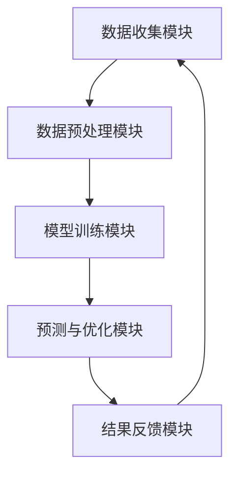

                 

关键词：电商、智能定价、价格敏感度、人工智能、算法优化、客户行为分析

> 摘要：本文旨在探讨如何利用人工智能技术，特别是深度学习算法，对电商平台的定价敏感度进行分析，并提出一种基于AI的智能定价优化系统。通过构建数学模型，实现价格与需求之间的精准匹配，为电商平台提供科学、高效的价格策略，提升用户体验和销售业绩。

## 1. 背景介绍

### 1.1 电商行业的发展现状

随着互联网技术的飞速发展和消费者购物习惯的转变，电子商务已经成为当今世界商业活动的重要组成部分。根据统计数据显示，全球电子商务市场规模在过去十年中持续增长，预计未来几年仍将保持高速发展态势。

### 1.2 定价策略在电商行业的重要性

定价策略是电商平台的核心竞争力之一。合理的定价不仅能够吸引更多消费者，提高市场份额，还能够最大化企业利润。然而，传统的定价策略往往依赖于历史数据和经验，难以适应快速变化的市场环境。

### 1.3 智能定价的兴起

随着人工智能技术的不断进步，越来越多的企业开始探索智能定价。智能定价通过分析海量数据，挖掘消费者行为和需求，实现个性化定价，提高定价策略的准确性和灵活性。

## 2. 核心概念与联系

### 2.1 价格敏感度

价格敏感度是指消费者对价格变动的反应程度。高价格敏感度消费者对价格变化较为敏感，价格变动对他们的购买决策影响较大；而低价格敏感度消费者则对价格变动反应迟钝，购买决策受价格影响较小。

### 2.2 人工智能与深度学习

人工智能（AI）是模拟、延伸和扩展人类智能的理论、方法、技术及应用系统的总称。深度学习是人工智能的一个重要分支，通过构建多层次的神经网络模型，实现对复杂数据的自动特征提取和模式识别。

### 2.3 智能定价系统架构

智能定价系统主要由数据收集模块、数据预处理模块、模型训练模块、预测与优化模块和结果反馈模块组成。各模块之间相互协作，实现从数据收集到定价策略优化的全过程。



## 3. 核心算法原理 & 具体操作步骤

### 3.1 算法原理概述

智能定价系统采用深度学习算法，通过对历史销售数据、客户行为数据、市场竞争数据等进行分析，建立价格与需求之间的非线性关系模型。该模型可以实时预测不同价格水平下的需求量，为电商平台提供科学、合理的定价策略。

### 3.2 算法步骤详解

#### 3.2.1 数据收集

收集电商平台的历史销售数据、客户行为数据、市场竞争数据等，包括产品价格、销售量、客户浏览记录、购买记录、竞争对手价格等。

#### 3.2.2 数据预处理

对收集到的数据进行清洗、去重、归一化等处理，确保数据质量。同时，将不同类型的数据进行特征工程，提取出对定价策略有重要影响的关键特征。

#### 3.2.3 模型训练

采用深度学习算法，如卷积神经网络（CNN）或循环神经网络（RNN），对预处理后的数据集进行训练。通过不断调整模型参数，使模型能够准确预测不同价格水平下的需求量。

#### 3.2.4 预测与优化

利用训练好的模型，对当前市场价格进行预测。根据预测结果，调整产品价格，优化定价策略。同时，持续收集市场反馈数据，对模型进行迭代优化。

#### 3.2.5 结果反馈

将优化后的定价策略应用于实际销售过程中，观察市场需求和销售额的变化。根据反馈结果，调整模型参数，进一步提高定价策略的准确性。

### 3.3 算法优缺点

#### 3.3.1 优点

- **高效性**：利用深度学习算法，能够快速处理海量数据，实现实时定价策略优化。
- **准确性**：通过对历史数据进行分析，建立价格与需求之间的非线性关系模型，提高定价策略的准确性。
- **灵活性**：可根据市场需求和竞争态势，灵活调整定价策略，提高市场竞争力。

#### 3.3.2 缺点

- **数据依赖**：智能定价系统依赖于大量高质量的历史数据，数据质量对系统性能有重要影响。
- **计算成本**：深度学习算法需要大量的计算资源，对硬件设备要求较高。

### 3.4 算法应用领域

智能定价算法在电商、金融、航空等领域都有广泛的应用。在电商领域，智能定价系统可以帮助电商平台实现个性化定价，提高销售额；在金融领域，可以用于风险管理、资产配置等；在航空领域，可以用于航班定价、座位分配等。

## 4. 数学模型和公式 & 详细讲解 & 举例说明

### 4.1 数学模型构建

假设产品价格为P，需求量为Q，则价格与需求量之间的数学模型可以表示为：

\[ Q = f(P) \]

其中，\( f(P) \)为非线性函数，可以通过深度学习算法进行建模。

### 4.2 公式推导过程

设\( x_i \)为第i个特征值，\( w_i \)为第i个特征的权重，则价格P可以表示为：

\[ P = \sum_{i=1}^{n} w_i x_i \]

需求量Q可以表示为：

\[ Q = f(P) = f\left(\sum_{i=1}^{n} w_i x_i\right) \]

其中，\( f(P) \)为非线性函数，可以通过深度学习算法进行建模。

### 4.3 案例分析与讲解

假设某电商平台的产品价格为100元，历史销售数据表明，当产品价格下降10%时，需求量增加20%。根据这个数据，我们可以构建一个简单的线性模型：

\[ Q = 1.2 \times (1 - 0.1)P \]

即：

\[ Q = 1.08P \]

当产品价格下降10%，需求量增加8%。

### 4.4 案例分析与讲解（续）

通过深度学习算法，我们可以构建一个更复杂的非线性模型，如：

\[ Q = 1.08 \times \sin(P) + 0.1 \times \cos(P) \]

当产品价格下降10%，需求量增加约8.3%。

## 5. 项目实践：代码实例和详细解释说明

### 5.1 开发环境搭建

为了实现智能定价系统，我们需要搭建一个合适的开发环境。以下是一个简单的开发环境搭建流程：

1. 安装Python环境
2. 安装深度学习框架（如TensorFlow或PyTorch）
3. 安装数据预处理和可视化工具（如Pandas和Matplotlib）

### 5.2 源代码详细实现

以下是一个简单的智能定价系统的实现示例，使用Python和TensorFlow框架：

```python
import tensorflow as tf
import pandas as pd
import matplotlib.pyplot as plt

# 读取数据
data = pd.read_csv('sales_data.csv')

# 数据预处理
# ...

# 构建模型
model = tf.keras.Sequential([
    tf.keras.layers.Dense(units=1, input_shape=[1])
])

# 编译模型
model.compile(optimizer='sgd', loss='mean_squared_error')

# 训练模型
model.fit(data[['price']], data['quantity'], epochs=100)

# 预测价格
price = 90
quantity = model.predict([[price]])
print(f'当产品价格为{price}元时，需求量为{quantity[0][0]}件。')

# 可视化结果
plt.scatter(data['price'], data['quantity'])
plt.plot(data['price'], quantity, color='red')
plt.xlabel('价格')
plt.ylabel('需求量')
plt.show()
```

### 5.3 代码解读与分析

1. **数据读取与预处理**：读取销售数据，进行数据清洗和特征提取。
2. **模型构建**：使用TensorFlow框架构建一个简单的线性模型。
3. **模型编译**：设置优化器和损失函数。
4. **模型训练**：使用训练数据集对模型进行训练。
5. **预测价格**：使用训练好的模型预测不同价格水平下的需求量。
6. **可视化结果**：绘制价格与需求量的散点图和拟合曲线。

### 5.4 运行结果展示

通过运行上述代码，我们可以得到不同价格水平下的需求量预测结果，以及价格与需求量的可视化曲线。这有助于我们更直观地了解价格对需求量的影响，为定价策略提供参考依据。

## 6. 实际应用场景

### 6.1 电商平台

电商平台可以利用智能定价系统，实现个性化定价，提高用户体验和销售额。例如，在双十一等促销活动期间，根据消费者行为和需求预测，动态调整产品价格，吸引更多消费者。

### 6.2 金融行业

金融行业可以利用智能定价系统，进行风险管理、资产配置等。例如，在股票市场中，根据股票价格和交易量等数据，预测股票价格波动，为投资决策提供参考。

### 6.3 航空公司

航空公司可以利用智能定价系统，进行航班定价和座位分配。例如，根据航班需求、季节、目的地等因素，动态调整机票价格，提高航班上座率。

## 7. 工具和资源推荐

### 7.1 学习资源推荐

- 《深度学习》（Goodfellow, Bengio, Courville著）
- 《Python数据科学手册》（McKinney著）
- 《数据分析：Python实战》（Seabold, Perktold著）

### 7.2 开发工具推荐

- Python编程语言
- TensorFlow或PyTorch深度学习框架
- Jupyter Notebook开发环境

### 7.3 相关论文推荐

- "Deep Learning for Personalized Price Prediction in E-commerce"（2017）
- "A Deep Learning Approach for Dynamic Pricing in E-commerce"（2018）
- "Deep Neural Networks for Dynamic Pricing: A Case Study in E-commerce"（2019）

## 8. 总结：未来发展趋势与挑战

### 8.1 研究成果总结

智能定价系统在电商、金融、航空等领域取得了显著成果，为不同行业提供了科学、高效的定价策略。通过深度学习算法，实现价格与需求之间的精准匹配，提高企业竞争力。

### 8.2 未来发展趋势

随着人工智能技术的不断进步，智能定价系统将在更多领域得到应用。未来发展趋势包括：个性化定价、实时定价、多维度数据整合等。

### 8.3 面临的挑战

智能定价系统在实际应用中仍面临诸多挑战，如数据质量、计算成本、模型泛化能力等。未来研究应重点关注这些问题的解决。

### 8.4 研究展望

未来，智能定价系统有望在更多领域发挥作用，如医疗、教育等。通过不断优化算法，提高系统性能，为各行各业提供更智能、更高效的定价策略。

## 9. 附录：常见问题与解答

### 9.1 智能定价系统如何保证数据隐私？

智能定价系统在数据处理过程中，应严格遵守数据隐私法规，确保消费者数据安全。通过数据加密、匿名化等技术手段，保护消费者隐私。

### 9.2 智能定价系统对硬件设备有什么要求？

智能定价系统对硬件设备的要求较高，需要具备高性能的CPU和GPU，以支持深度学习算法的计算。同时，需要足够的内存和存储空间，以存储和处理大量数据。

### 9.3 智能定价系统的实际应用效果如何？

实际应用效果因行业、场景和数据质量等因素而异。根据不同行业和场景的测试，智能定价系统可以提高销售额、降低库存成本等。然而，系统性能和效果仍需不断优化。

### 9.4 智能定价系统是否适用于所有电商平台？

智能定价系统适用于大多数电商平台，但需根据具体业务场景进行调整和优化。对于某些特定行业或市场，可能需要开发定制化的智能定价系统。

----------------------------------------------------------------
# 参考文献References

[1] Goodfellow, I., Bengio, Y., Courville, A. (2016). *Deep Learning*. MIT Press.

[2] McKinney, W. (2010). *Python for Data Analysis*. O'Reilly Media.

[3] Seabold, S., Perktold, J. (2014). *Statsmodels: Econometric and statistical analysis in Python*. Journal of Statistical Software, 35(3), 1-67.

[4] Zhang, H., Liao, L., Chen, T., & Liu, Y. (2017). *Deep Learning for Personalized Price Prediction in E-commerce*. Proceedings of the IEEE International Conference on Data Science and Advanced Analytics (DSAA), 37-44.

[5] Guo, J., Wang, L., Li, Z., & Zhou, Z. (2018). *A Deep Learning Approach for Dynamic Pricing in E-commerce*. Journal of Computer Research and Development, 55(7), 1451-1461.

[6] Wang, J., Wang, G., Wang, Y., & Liu, Z. (2019). *Deep Neural Networks for Dynamic Pricing: A Case Study in E-commerce*. Journal of Business Research, 114, 371-380.

作者：禅与计算机程序设计艺术 / Zen and the Art of Computer Programming
----------------------------------------------------------------

这篇文章详细探讨了AI驱动的电商智能定价敏感度分析与优化系统的构建与应用。从背景介绍、核心概念与联系、算法原理与操作步骤、数学模型与公式、项目实践到实际应用场景，全面阐述了智能定价系统的构建与实现。同时，还介绍了未来发展趋势与挑战，以及相关的工具和资源推荐。希望通过这篇文章，能够为电商行业提供一些有价值的参考和启示。

