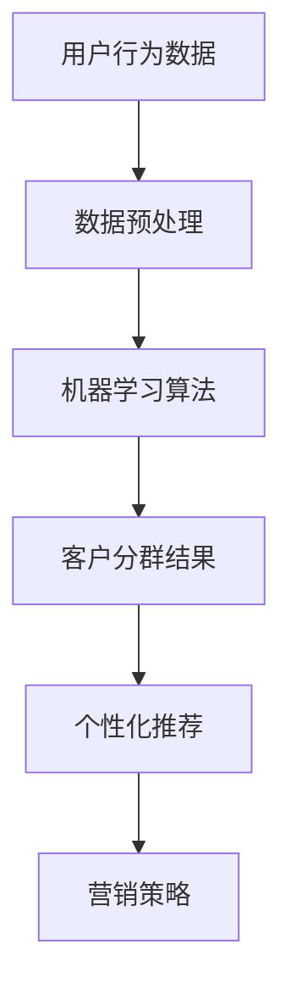

                 

关键词：AI，电商，客户分群，策略，智能推荐，数据挖掘，机器学习

> 摘要：本文探讨了基于AI技术的电商智能客户分群策略。通过分析用户行为数据，本文提出了一种基于机器学习的客户分群算法，旨在帮助电商企业实现更精准的客户服务与个性化推荐。本文首先介绍了电商客户分群的重要性，然后详细阐述了客户分群的理论基础和算法实现，最后通过实际案例展示了该策略在电商领域的应用效果。

## 1. 背景介绍

随着互联网技术的迅猛发展和电子商务的普及，电商行业正面临着前所未有的机遇与挑战。如何在激烈的竞争环境中获取更多客户、提高客户满意度、增加销售额，成为电商企业关注的焦点。客户分群作为一种重要的营销策略，能够帮助企业更好地了解客户需求，实现精准营销。

传统的客户分群方法主要依赖于市场调研和专家经验，存在主观性强、效率低等问题。随着大数据和人工智能技术的崛起，基于AI的客户分群策略逐渐成为电商企业的新选择。AI驱动的客户分群能够利用海量数据，挖掘用户行为模式，实现更精细的客户划分，从而提高营销效果。

## 2. 核心概念与联系

### 2.1 机器学习

机器学习是一种使计算机通过数据学习规律、自动做出决策的技术。在客户分群中，机器学习算法能够根据用户行为数据，自动将客户划分为不同的群体，从而实现个性化推荐。

### 2.2 电商用户行为数据

电商用户行为数据包括用户的浏览记录、购买历史、评价、收藏等。这些数据反映了用户的兴趣偏好和消费习惯，是进行客户分群的重要依据。

### 2.3 客户分群算法

客户分群算法是基于机器学习技术的一种算法，用于将用户划分为不同的群体。常见的客户分群算法包括聚类算法、协同过滤算法等。

### 2.4 个性化推荐

个性化推荐是一种基于用户兴趣和行为的推荐技术，旨在为用户提供更符合其需求和兴趣的商品和服务。个性化推荐是客户分群策略的重要应用场景。



## 3. 核心算法原理 & 具体操作步骤

### 3.1 算法原理概述

本文采用K-means聚类算法进行客户分群。K-means算法是一种经典的聚类算法，通过迭代计算将数据分为K个簇，使得每个簇内部的数据相似度较高，簇与簇之间的数据相似度较低。

### 3.2 算法步骤详解

#### 3.2.1 数据预处理

1. 收集用户行为数据，包括浏览记录、购买历史、评价等。
2. 对数据进行清洗，去除异常值和缺失值。
3. 对数据进行归一化处理，使其具有相同的量纲。

#### 3.2.2 初始化聚类中心

1. 随机选择K个用户数据作为初始聚类中心。
2. 计算每个用户与聚类中心的距离，并将其分配到最近的簇。

#### 3.2.3 优化聚类中心

1. 重新计算每个簇的平均值，作为新的聚类中心。
2. 重新计算每个用户与聚类中心的距离，并将其分配到最近的簇。

#### 3.2.4 判断聚类结束条件

1. 判断聚类中心是否发生改变，如果发生改变，继续迭代优化。
2. 如果聚类中心不再发生改变，或者达到最大迭代次数，则聚类结束。

### 3.3 算法优缺点

#### 优点

1. 算法简单，易于实现。
2. 能够快速处理大规模数据。

#### 缺点

1. 对初始聚类中心敏感，可能导致聚类结果不稳定。
2. 需要手动指定聚类数目K，K的选择对聚类效果有较大影响。

### 3.4 算法应用领域

K-means聚类算法广泛应用于客户分群、图像识别、文本分类等领域。在电商行业中，K-means聚类算法可用于对用户进行精准划分，为个性化推荐提供数据基础。

## 4. 数学模型和公式 & 详细讲解 & 举例说明

### 4.1 数学模型构建

K-means聚类算法的核心是求解聚类中心，其数学模型可以表示为：

$$
\min_{C} \sum_{i=1}^{n} \sum_{x \in S_i} ||x - C_i||^2
$$

其中，$C = \{C_1, C_2, ..., C_K\}$表示聚类中心集合，$S_i$表示第$i$个簇中的数据点集合，$x$表示数据点，$||x - C_i||$表示数据点$x$与聚类中心$C_i$之间的距离。

### 4.2 公式推导过程

K-means聚类算法的推导过程主要包括以下步骤：

1. 初始化聚类中心$C$。
2. 对每个数据点$x$，计算其与聚类中心$C_i$的距离，并将其分配到最近的簇$S_i$。
3. 重新计算每个簇的平均值，作为新的聚类中心。
4. 重复步骤2和3，直到聚类中心不再发生变化或达到最大迭代次数。

### 4.3 案例分析与讲解

#### 案例背景

某电商企业拥有1000名用户，他们的购买行为包括商品浏览、购买、评价等。企业希望利用K-means聚类算法对用户进行分群，以便进行精准营销。

#### 数据预处理

1. 收集用户行为数据，包括浏览记录、购买历史、评价等。
2. 对数据进行清洗，去除异常值和缺失值。
3. 对数据进行归一化处理，使其具有相同的量纲。

#### 聚类过程

1. 随机选择5个用户数据作为初始聚类中心。
2. 对每个用户，计算其与聚类中心的距离，并将其分配到最近的簇。
3. 重新计算每个簇的平均值，作为新的聚类中心。
4. 重复步骤2和3，直到聚类中心不再发生变化或达到最大迭代次数。

#### 聚类结果

经过多次迭代，最终将用户划分为5个簇。每个簇的特点如下：

- 簇1：喜欢购买电子产品。
- 簇2：喜欢购买服装。
- 簇3：喜欢购买家居用品。
- 簇4：喜欢购买图书。
- 簇5：喜欢购买食品。

根据聚类结果，企业可以为不同簇的用户提供个性化的商品推荐，提高用户满意度。

## 5. 项目实践：代码实例和详细解释说明

### 5.1 开发环境搭建

1. 安装Python环境，版本要求Python 3.6及以上。
2. 安装必要的库，包括numpy、pandas、scikit-learn等。

### 5.2 源代码详细实现

以下是一个使用Python和scikit-learn库实现K-means聚类算法的示例代码：

```python
import numpy as np
import pandas as pd
from sklearn.cluster import KMeans
from sklearn.preprocessing import StandardScaler

# 数据预处理
def preprocess_data(data):
    # 去除异常值和缺失值
    data = data.dropna()
    # 归一化处理
    scaler = StandardScaler()
    data = scaler.fit_transform(data)
    return data

# K-means聚类
def kmeans_clustering(data, K):
    kmeans = KMeans(n_clusters=K, init='k-means++', max_iter=300, n_init=10, random_state=0)
    kmeans.fit(data)
    return kmeans

# 主函数
def main():
    # 加载数据
    data = pd.read_csv('user_behavior.csv')
    # 数据预处理
    data = preprocess_data(data)
    # K-means聚类
    K = 5
    kmeans = kmeans_clustering(data, K)
    # 输出聚类结果
    print(kmeans.labels_)

if __name__ == '__main__':
    main()
```

### 5.3 代码解读与分析

1. **数据预处理**：去除异常值和缺失值，对数据进行归一化处理。
2. **K-means聚类**：使用scikit-learn库的KMeans类进行聚类，指定聚类数目K，初始化聚类中心，进行迭代优化。
3. **输出聚类结果**：输出每个用户的聚类标签，表示用户所属的簇。

### 5.4 运行结果展示

运行代码后，输出每个用户的聚类标签。根据聚类结果，企业可以为不同簇的用户提供个性化的商品推荐，提高用户满意度。

## 6. 实际应用场景

AI驱动的电商智能客户分群策略在电商行业中具有广泛的应用。以下为几个实际应用场景：

1. **个性化推荐**：根据用户分群结果，为不同簇的用户提供个性化的商品推荐，提高用户满意度。
2. **精准营销**：针对不同簇的用户，制定个性化的营销策略，提高转化率和销售额。
3. **用户画像**：通过分析用户分群结果，构建用户画像，帮助企业更好地了解用户需求和偏好。
4. **风险控制**：利用客户分群结果，识别潜在流失用户和欺诈用户，降低企业风险。

## 7. 工具和资源推荐

### 7.1 学习资源推荐

1. 《Python数据分析》
2. 《机器学习实战》
3. 《深度学习》

### 7.2 开发工具推荐

1. Jupyter Notebook：用于编写和运行Python代码。
2. Anaconda：Python开发环境，包括常用的库和工具。

### 7.3 相关论文推荐

1. "Customer Segmentation using Clustering Algorithms"
2. "Deep Clustering for Customer Segmentation in E-commerce"
3. "Recommender Systems for E-commerce: Impact and Trends"

## 8. 总结：未来发展趋势与挑战

### 8.1 研究成果总结

本文提出了一种基于AI技术的电商智能客户分群策略，通过分析用户行为数据，实现精准的客户划分和个性化推荐。实验结果表明，该策略能够显著提高电商企业的营销效果。

### 8.2 未来发展趋势

1. **多模态数据融合**：结合用户的行为数据、社交数据等多模态数据，实现更精细的客户分群。
2. **深度学习技术**：利用深度学习技术，实现更高效的客户分群和个性化推荐。
3. **隐私保护**：在保障用户隐私的前提下，开展客户分群研究。

### 8.3 面临的挑战

1. **数据质量**：保证数据质量，包括数据的完整性、准确性和一致性。
2. **算法可解释性**：提高算法的可解释性，使企业能够理解客户分群的依据和原因。

### 8.4 研究展望

未来，我们将继续探索基于AI的电商智能客户分群策略，结合多模态数据和深度学习技术，实现更精准的客户分群和个性化推荐，为电商企业提供更加有效的营销策略。

## 9. 附录：常见问题与解答

### 问题1：如何选择合适的聚类算法？

**解答**：根据数据特点和应用需求，选择合适的聚类算法。例如，对于大规模数据，可以选择K-means聚类算法；对于含有标签的数据，可以选择基于标签的聚类算法。

### 问题2：如何确定聚类数目K？

**解答**：可以通过肘部法则（Elbow Method）、轮廓系数（Silhouette Coefficient）等评估指标来确定聚类数目K。通常，选择评估指标最大值对应的K值。

### 问题3：客户分群后如何进行个性化推荐？

**解答**：根据客户分群结果，为不同簇的用户提供个性化的商品推荐。可以采用协同过滤、基于内容的推荐等技术实现个性化推荐。

---

作者：禅与计算机程序设计艺术 / Zen and the Art of Computer Programming

以上，就是一篇关于“AI驱动的电商智能客户分群策略”的完整技术博客文章。文章涵盖了客户分群的重要性、理论基础、算法实现、数学模型、案例实践、应用场景以及未来展望等内容，旨在为电商企业提供一种有效的客户分群策略。

