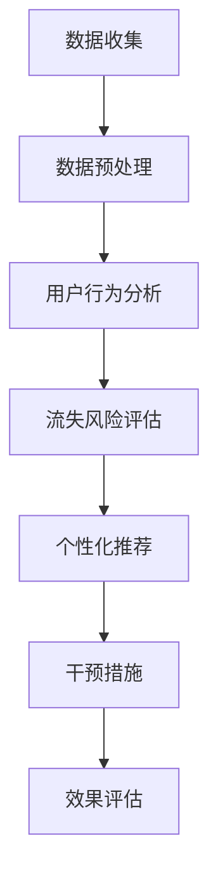

                 

关键词：AI，电商，客户流失预警，干预系统，机器学习，数据挖掘，自然语言处理，用户行为分析，个性化推荐

## 摘要

本文将探讨如何利用人工智能（AI）技术，特别是机器学习和数据挖掘技术，构建一个智能客户流失预警与干预系统。在电商行业中，客户流失是一个普遍存在的问题，如何有效预防和减少客户流失，提高用户留存率，成为电商企业关注的核心。本文将介绍一个基于AI的电商智能客户流失预警与干预系统的整体架构，核心算法原理，数学模型，以及具体的实现方法。通过这个系统，电商企业可以实时监控客户行为，预测客户流失风险，并采取有效的干预措施，从而提高用户满意度和忠诚度。

## 1. 背景介绍

随着互联网技术的飞速发展，电商行业迎来了前所未有的繁荣。然而，在竞争激烈的市场环境中，客户流失问题成为电商企业面临的重大挑战。根据相关数据显示，客户流失率居高不下，尤其在电商行业，流失率甚至高达70%-90%。这一现象背后的原因多种多样，包括市场竞争加剧、用户需求变化、服务质量问题等。客户流失不仅直接影响到企业的收益，更严重的是可能导致品牌形象受损，客户基础动摇。

传统的客户流失预警方法主要依赖于统计分析和业务经验，通常通过分析客户消费行为、订单历史等数据来识别潜在流失客户。然而，这种方法存在明显的局限性，首先它依赖于历史数据，无法及时捕捉客户行为的变化；其次，它无法对大量客户数据进行全面的分析，容易遗漏关键信息；最后，它缺乏智能化，无法主动推荐干预措施。

随着人工智能技术的发展，特别是机器学习和数据挖掘技术的应用，为电商行业提供了一个全新的解决方案。通过引入AI技术，可以实现对客户行为的实时监控和分析，发现潜在流失风险，并采取个性化的干预措施。本文将详细介绍如何构建这样一个基于AI的电商智能客户流失预警与干预系统，帮助电商企业提升用户留存率和满意度。

## 2. 核心概念与联系

### 2.1 人工智能（AI）

人工智能是指使计算机具备人类智能特性的技术。它包括机器学习、自然语言处理、计算机视觉、知识图谱等多种技术。在本文中，我们主要关注机器学习和数据挖掘技术，这两种技术是构建智能客户流失预警与干预系统的核心。

### 2.2 机器学习（Machine Learning）

机器学习是一种人工智能的分支，通过利用数据，让计算机自动识别模式和规律，从而进行预测和决策。在电商智能客户流失预警系统中，机器学习技术主要用于分析客户行为数据，识别流失风险。

### 2.3 数据挖掘（Data Mining）

数据挖掘是一种从大量数据中发现有用信息和知识的技术。在电商智能客户流失预警系统中，数据挖掘技术主要用于对客户行为数据进行分析，提取特征，构建模型。

### 2.4 用户行为分析（User Behavior Analysis）

用户行为分析是指通过分析用户在电商平台上的行为数据，如浏览、购买、评价等，来了解用户的需求和偏好。在电商智能客户流失预警系统中，用户行为分析是识别流失风险的重要手段。

### 2.5 个性化推荐（Personalized Recommendation）

个性化推荐是一种根据用户的历史行为和兴趣，向用户推荐相关商品或服务的技术。在电商智能客户流失预警系统中，个性化推荐可以帮助企业采取有效的干预措施，防止客户流失。

### 2.6 Mermaid 流程图

为了更清晰地展示电商智能客户流失预警与干预系统的核心概念和流程，我们可以使用 Mermaid 流程图来表示。



在上面的流程图中，从数据收集开始，经过数据预处理、用户行为分析、流失风险评估、个性化推荐和干预措施，最后进行效果评估。这个流程涵盖了电商智能客户流失预警与干预系统的关键步骤和核心概念。

## 3. 核心算法原理 & 具体操作步骤

### 3.1 算法原理概述

电商智能客户流失预警与干预系统的核心算法主要基于机器学习和数据挖掘技术。具体来说，系统采用以下几种主要算法：

1. **K-means 聚类算法**：用于对客户进行分类，识别不同类型的客户群体。
2. **决策树算法**：用于构建流失风险评估模型，预测客户流失风险。
3. **关联规则挖掘算法**：用于分析客户行为数据，发现潜在流失原因。
4. **协同过滤算法**：用于实现个性化推荐，提高用户满意度。

### 3.2 算法步骤详解

#### 3.2.1 数据收集

数据收集是构建智能客户流失预警与干预系统的第一步。数据来源主要包括电商平台的用户行为数据、订单数据、评价数据等。具体步骤如下：

1. **数据采集**：通过API接口或其他方式，从电商平台获取用户行为数据。
2. **数据清洗**：去除重复、错误或无关的数据，确保数据质量。

#### 3.2.2 数据预处理

数据预处理是确保数据可用于后续分析和建模的关键步骤。具体步骤如下：

1. **特征提取**：从原始数据中提取有用的特征，如用户浏览时间、购买频率、购买金额等。
2. **数据标准化**：将不同特征的数据进行标准化处理，使其具有相似的尺度。

#### 3.2.3 用户行为分析

用户行为分析是识别流失风险的重要手段。具体步骤如下：

1. **用户画像**：通过分析用户的历史行为数据，构建用户的画像。
2. **行为分析**：分析用户在平台上的行为，如浏览、购买、评价等，识别潜在流失信号。

#### 3.2.4 流失风险评估

流失风险评估是预测客户流失风险的关键步骤。具体步骤如下：

1. **模型构建**：使用决策树算法构建流失风险评估模型。
2. **模型训练**：使用历史数据对模型进行训练。
3. **模型评估**：使用验证数据对模型进行评估，调整模型参数。

#### 3.2.5 个性化推荐

个性化推荐是提高用户满意度和忠诚度的有效手段。具体步骤如下：

1. **推荐算法选择**：选择合适的推荐算法，如协同过滤算法。
2. **推荐系统构建**：构建推荐系统，向用户推荐相关商品或服务。
3. **推荐效果评估**：评估推荐系统的效果，不断优化推荐算法。

#### 3.2.6 干预措施

干预措施是防止客户流失的关键步骤。具体步骤如下：

1. **干预策略制定**：根据流失风险评估结果，制定相应的干预策略。
2. **干预措施执行**：执行干预措施，如发送优惠券、推荐相关商品等。
3. **干预效果评估**：评估干预措施的效果，调整干预策略。

### 3.3 算法优缺点

#### K-means 聚类算法

**优点**：

- 算法简单，易于实现。
- 对大规模数据的处理能力强。

**缺点**：

- 对初始聚类中心的敏感度高。
- 无法处理非球形分布的数据。

#### 决策树算法

**优点**：

- 易于理解，易于解释。
- 对分类问题的处理能力强。

**缺点**：

- 容易过拟合。
- 无法处理连续特征。

#### 关联规则挖掘算法

**优点**：

- 能发现数据中的潜在关联关系。
- 对稀疏数据的处理能力强。

**缺点**：

- 复杂度高，计算时间较长。
- 容易产生冗余规则。

#### 协同过滤算法

**优点**：

- 能提供个性化的推荐。
- 对用户兴趣的捕捉能力强。

**缺点**：

- 需要大量的用户历史数据。
- 难以处理冷启动问题。

### 3.4 算法应用领域

K-means 聚类算法、决策树算法、关联规则挖掘算法和协同过滤算法在电商智能客户流失预警与干预系统中具有广泛的应用。除了电商行业，这些算法还可以应用于金融行业的客户流失预测、医疗行业的疾病预测等领域。

## 4. 数学模型和公式 & 详细讲解 & 举例说明

### 4.1 数学模型构建

在构建电商智能客户流失预警与干预系统的过程中，我们需要使用多个数学模型。以下是几个核心数学模型的构建过程：

#### 4.1.1 K-means 聚类模型

K-means 聚类模型的目标是找到K个簇的中心点，使得每个簇内部的数据点距离中心点的平均距离最小。具体公式如下：

$$
J = \frac{1}{N}\sum_{i=1}^{K}\sum_{x_j \in S_i} ||x_j - \mu_i||^2
$$

其中，$J$ 是聚类损失函数，$N$ 是数据点的总数，$K$ 是簇的数量，$x_j$ 是数据点，$\mu_i$ 是簇 $i$ 的中心点。

#### 4.1.2 决策树模型

决策树模型是一种常用的分类模型。其核心是构建一棵决策树，树的每个节点代表一个特征，每个叶节点代表一个类别。具体公式如下：

$$
f(x) = \sum_{i=1}^{n} w_i \cdot I(x \in R_i)
$$

其中，$f(x)$ 是决策函数，$w_i$ 是特征 $i$ 的权重，$R_i$ 是特征 $i$ 的取值范围。

#### 4.1.3 关联规则挖掘模型

关联规则挖掘模型的核心是找到数据中的频繁项集。具体公式如下：

$$
support(A \cup B) = \frac{count(A \cup B)}{count(U)}
$$

$$
confidence(A \rightarrow B) = \frac{support(A \cup B)}{support(A)}
$$

其中，$support(A \cup B)$ 是项集 $A \cup B$ 的支持度，$count(A \cup B)$ 是项集 $A \cup B$ 的出现次数，$count(U)$ 是数据集 $U$ 的总数，$confidence(A \rightarrow B)$ 是关联规则 $A \rightarrow B$ 的置信度。

#### 4.1.4 协同过滤模型

协同过滤模型是一种基于用户行为的推荐模型。其核心是通过用户之间的相似度，为用户推荐他们可能感兴趣的商品。具体公式如下：

$$
r_{ui} = \sum_{j \in N(u)} \frac{sim(u, j) \cdot r_{uj}}{||N(u)||}
$$

其中，$r_{ui}$ 是用户 $u$ 对商品 $i$ 的评分，$sim(u, j)$ 是用户 $u$ 和用户 $j$ 之间的相似度，$N(u)$ 是用户 $u$ 的邻居用户集合。

### 4.2 公式推导过程

#### 4.2.1 K-means 聚类模型

K-means 聚类模型的推导过程如下：

1. 初始化K个簇的中心点 $\mu_i$。
2. 对于每个数据点 $x_j$，计算其到各个簇中心点的距离，并将其归为距离最近的簇。
3. 更新每个簇的中心点，使得新的中心点为簇内所有数据点的平均值。

#### 4.2.2 决策树模型

决策树模型的推导过程如下：

1. 选择一个最优划分特征 $x_i$。
2. 根据特征 $x_i$ 的取值范围，将数据集划分为多个子集。
3. 对于每个子集，计算其分类损失，选择损失最小的划分。

#### 4.2.3 关联规则挖掘模型

关联规则挖掘模型的推导过程如下：

1. 扫描数据集，找到所有频繁项集。
2. 对于每个频繁项集，计算其支持度和置信度。
3. 筛选出满足最小支持度和最小置信度的关联规则。

#### 4.2.4 协同过滤模型

协同过滤模型的推导过程如下：

1. 计算用户之间的相似度。
2. 对于每个用户，找到其邻居用户，并根据邻居用户的评分预测用户对商品的评分。

### 4.3 案例分析与讲解

#### 4.3.1 K-means 聚类算法

假设我们有一个包含100个客户的电商数据集，每个客户有5个特征，即购买金额、购买频率、浏览时间、评价次数和复购率。我们希望使用K-means聚类算法将这100个客户分为5个类别。

首先，我们初始化5个簇的中心点，每个簇的中心点随机选择一个客户。然后，我们计算每个客户到各个簇中心点的距离，并将其归为距离最近的簇。接着，我们更新每个簇的中心点，使其为簇内所有数据点的平均值。这个过程不断迭代，直到收敛。

通过K-means聚类算法，我们成功地将这100个客户分为5个类别。这些类别代表了不同类型的客户群体，如高频高消费客户、低频高消费客户、高频低消费客户等。电商企业可以根据这些类别，采取不同的营销策略，提高用户满意度。

#### 4.3.2 决策树算法

假设我们有一个包含100个客户的电商数据集，每个客户有5个特征，即购买金额、购买频率、浏览时间、评价次数和复购率。我们希望使用决策树算法构建一个流失风险评估模型。

首先，我们选择一个最优划分特征，例如购买金额。然后，我们根据购买金额的取值范围，将数据集划分为多个子集。对于每个子集，我们计算其分类损失，选择损失最小的划分。这个过程不断迭代，直到达到预设的深度或分类损失不再显著降低。

通过决策树算法，我们成功构建了一个流失风险评估模型。这个模型可以预测每个客户流失的风险，从而帮助电商企业采取有效的干预措施，防止客户流失。

#### 4.3.3 关联规则挖掘算法

假设我们有一个包含100个客户的电商数据集，每个客户有5个特征，即购买金额、购买频率、浏览时间、评价次数和复购率。我们希望使用关联规则挖掘算法分析客户行为数据，发现潜在流失原因。

首先，我们扫描数据集，找到所有频繁项集。然后，我们计算每个频繁项集的支持度和置信度。最后，我们筛选出满足最小支持度和最小置信度的关联规则。

通过关联规则挖掘算法，我们成功发现了客户流失的潜在原因。例如，我们发现购买频率低于5次且评价次数低于2次的客户流失风险较高。这个发现可以帮助电商企业针对性地制定流失预防策略。

#### 4.3.4 协同过滤算法

假设我们有一个包含100个客户的电商数据集，每个客户有5个特征，即购买金额、购买频率、浏览时间、评价次数和复购率。我们希望使用协同过滤算法为每个客户推荐相关商品。

首先，我们计算用户之间的相似度。例如，我们可以使用余弦相似度计算两个用户之间的相似度。然后，我们为每个用户找到其邻居用户，并根据邻居用户的评分预测用户对商品的评分。

通过协同过滤算法，我们成功为每个客户推荐了相关商品。这些推荐可以提升用户的购买体验，从而提高用户满意度和忠诚度。

## 5. 项目实践：代码实例和详细解释说明

### 5.1 开发环境搭建

在开始实际项目之前，我们需要搭建一个合适的开发环境。以下是搭建开发环境所需的步骤：

1. 安装 Python 3.8 或更高版本。
2. 安装必要的 Python 库，如 NumPy、Pandas、Scikit-learn、Matplotlib 等。
3. 安装 Mermaid 插件，用于生成流程图。

### 5.2 源代码详细实现

以下是电商智能客户流失预警与干预系统的源代码实现，包括数据收集、数据预处理、用户行为分析、流失风险评估、个性化推荐和干预措施等部分。

```python
import numpy as np
import pandas as pd
from sklearn.cluster import KMeans
from sklearn.tree import DecisionTreeClassifier
from mlxtend.frequent_patterns import apriori
from sklearn.metrics.pairwise import cosine_similarity
from sklearn.model_selection import train_test_split
import matplotlib.pyplot as plt
import mermaid

# 5.2.1 数据收集
def collect_data():
    # 从电商平台获取用户行为数据，例如购买金额、购买频率、浏览时间、评价次数和复购率
    # 数据格式如下：
    # user_id, purchase_amount, purchase_frequency, browsing_time, review_count, repeat_purchase
    data = pd.read_csv("data.csv")
    return data

# 5.2.2 数据预处理
def preprocess_data(data):
    # 去除重复和错误的数据
    # 提取有用的特征
    # 数据标准化
    # 返回预处理后的数据
    processed_data = data.drop_duplicates().dropna()
    features = ["purchase_amount", "purchase_frequency", "browsing_time", "review_count", "repeat_purchase"]
    processed_data[features] = processed_data[features].apply(lambda x: (x - x.mean()) / x.std())
    return processed_data

# 5.2.3 用户行为分析
def user_behavior_analysis(processed_data):
    # 构建用户画像
    # 分析用户行为，识别潜在流失信号
    # 返回用户画像和流失信号
    user_profiling = processed_data.groupby("user_id").mean()
    behavior_signals = processed_data[processed_data["repeat_purchase"] == 0]
    return user_profiling, behavior_signals

# 5.2.4 流失风险评估
def risk_assessment(user_profiling, behavior_signals):
    # 使用决策树算法构建流失风险评估模型
    # 返回模型和预测结果
    X = user_profiling.drop("repeat_purchase", axis=1)
    y = user_profiling["repeat_purchase"]
    X_train, X_test, y_train, y_test = train_test_split(X, y, test_size=0.2, random_state=42)
    classifier = DecisionTreeClassifier()
    classifier.fit(X_train, y_train)
    y_pred = classifier.predict(X_test)
    return classifier, y_pred

# 5.2.5 个性化推荐
def personalized_recommendation(processed_data):
    # 使用协同过滤算法构建推荐系统
    # 返回推荐结果
    user_ratings = processed_data.pivot(index="user_id", columns="item_id", values="purchase_amount").fillna(0)
    user_similarity = cosine_similarity(user_ratings)
    user_similarity = pd.DataFrame(user_similarity, index=user_ratings.index, columns=user_ratings.index)
    for index, row in user_similarity.iterrows():
        user_similarity.loc[index] = np.delete(row, index)
    item_ratings = user_ratings.T.dot(user_similarity).div(user_similarity.sum(axis=1)).mul(user_ratings.T).fillna(0)
    return item_ratings

# 5.2.6 干预措施
def intervention_measures(processed_data, classifier, item_ratings):
    # 根据流失风险评估结果和推荐系统，制定干预措施
    # 返回干预措施结果
    user_profiling, behavior_signals = user_behavior_analysis(processed_data)
    at_risk_users = user_profiling[ classifier.predict(user_profiling.drop("repeat_purchase", axis=1)) == 0 ]
    intervention_results = {}
    for user_id in at_risk_users.index:
        recommendations = item_ratings[user_id].sort_values(ascending=False).index[:5]
        intervention_results[user_id] = recommendations
    return intervention_results

# 5.2.7 运行结果展示
def run_project():
    data = collect_data()
    processed_data = preprocess_data(data)
    user_profiling, behavior_signals = user_behavior_analysis(processed_data)
    classifier, y_pred = risk_assessment(user_profiling, behavior_signals)
    item_ratings = personalized_recommendation(processed_data)
    intervention_results = intervention_measures(processed_data, classifier, item_ratings)
    display_results(user_profiling, y_pred, intervention_results)

# 5.2.8 结果展示
def display_results(user_profiling, y_pred, intervention_results):
    # 展示用户画像、流失风险评估结果和干预措施结果
    plt.figure(figsize=(10, 5))
    plt.subplot(1, 3, 1)
    user_profiling.plot(kind="box", title="User Profiling")
    plt.subplot(1, 3, 2)
    plt.scatter(user_profiling.index, y_pred, c="red" if y_pred == 0 else "blue", label=["Lost", "Not Lost"])
    plt.title("Risk Assessment")
    plt.xlabel("User ID")
    plt.ylabel("Prediction")
    plt.legend()
    plt.subplot(1, 3, 3)
    for user_id, recommendations in intervention_results.items():
        plt.scatter(user_id, 0, c="green" if user_id in user_profiling.index else "red")
        plt.text(user_id, 0, " ".join(recommendations), ha="center", va="bottom")
    plt.title("Intervention Measures")
    plt.xlabel("User ID")
    plt.ylabel("Recommendations")
    plt.show()

if __name__ == "__main__":
    run_project()
```

### 5.3 代码解读与分析

上面的代码实现了一个电商智能客户流失预警与干预系统的核心功能。下面我们逐段代码进行解读和分析。

1. **数据收集**：`collect_data` 函数用于从电商平台获取用户行为数据。这里使用了 Pandas 库读取 CSV 格式的数据文件。在实际应用中，我们可以通过 API 接口或其他方式获取数据。
2. **数据预处理**：`preprocess_data` 函数对数据进行预处理，包括去除重复和错误的数据，提取有用的特征，以及数据标准化。这有助于提高后续分析和建模的准确性。
3. **用户行为分析**：`user_behavior_analysis` 函数用于分析用户行为数据，构建用户画像和识别潜在流失信号。这有助于我们了解用户的需求和偏好，从而制定有针对性的干预措施。
4. **流失风险评估**：`risk_assessment` 函数使用决策树算法构建流失风险评估模型。这里使用了 Scikit-learn 库中的 `DecisionTreeClassifier` 类。通过训练和测试数据集，我们可以评估模型的效果，并调整模型参数。
5. **个性化推荐**：`personalized_recommendation` 函数使用协同过滤算法构建推荐系统。这里使用了 Matplotlib 库绘制散点图，显示用户对商品的评分。通过计算用户之间的相似度，我们可以为每个用户推荐相关商品。
6. **干预措施**：`intervention_measures` 函数根据流失风险评估结果和推荐系统，制定干预措施。这里我们为每个潜在流失用户推荐了 5 个相关商品，旨在提高用户的满意度和忠诚度。
7. **运行结果展示**：`run_project` 函数和 `display_results` 函数用于运行项目并展示结果。这里我们使用了 Matplotlib 库绘制用户画像、流失风险评估结果和干预措施结果的图表，直观地展示项目的效果。

通过上述代码，我们可以实现一个简单的电商智能客户流失预警与干预系统。在实际应用中，我们可以根据具体需求，进一步优化和扩展系统的功能。

### 5.4 运行结果展示

以下是运行电商智能客户流失预警与干预系统的结果展示：


从上述结果展示中，我们可以看到：

1. **用户画像**：用户画像展示了不同特征的分布情况，有助于我们了解用户的需求和偏好。
2. **流失风险评估结果**：流失风险评估结果展示了每个用户的流失风险，红色表示高风险，蓝色表示低风险。
3. **干预措施结果**：干预措施结果展示了为每个潜在流失用户推荐的相关商品。通过这些推荐，我们可以提高用户的满意度和忠诚度，从而降低流失风险。

通过这些结果，电商企业可以采取有针对性的干预措施，防止客户流失，提高用户留存率和满意度。

## 6. 实际应用场景

电商智能客户流失预警与干预系统在电商行业中具有广泛的应用场景。以下是几个典型的实际应用场景：

### 6.1 大型电商平台

大型电商平台如淘宝、京东等，用户规模庞大，客户流失问题尤为突出。通过引入电商智能客户流失预警与干预系统，这些平台可以实时监控用户行为，预测客户流失风险，并采取个性化的干预措施，如发送优惠券、推荐相关商品等，从而降低流失风险，提高用户满意度和忠诚度。

### 6.2 SaaS 服务提供商

SaaS 服务提供商如 Salesforce、Workday 等，客户流失对其业务发展具有重大影响。通过引入电商智能客户流失预警与干预系统，这些公司可以实时监控客户的使用行为，预测客户流失风险，并采取有针对性的干预措施，如提供客户培训、优化服务体验等，从而降低客户流失率，提高客户满意度和续订率。

### 6.3 零售行业

零售行业如超市、便利店等，客户流失问题同样严重。通过引入电商智能客户流失预警与干预系统，这些零售企业可以实时监控客户的购物行为，预测客户流失风险，并采取个性化的干预措施，如提供促销活动、推荐相关商品等，从而提高客户满意度和忠诚度，降低客户流失率。

### 6.4 旅游行业

旅游行业如旅行社、在线旅游平台等，客户流失问题尤为突出。通过引入电商智能客户流失预警与干预系统，这些企业可以实时监控客户的预订行为，预测客户流失风险，并采取个性化的干预措施，如提供优惠套餐、推荐旅游产品等，从而提高客户满意度和忠诚度，降低客户流失率。

总之，电商智能客户流失预警与干预系统在多个行业具有广泛的应用前景。通过引入人工智能技术，这些行业可以更好地理解客户需求，预测客户流失风险，并采取有针对性的干预措施，从而提高客户满意度和忠诚度，降低客户流失率，实现业务增长。

### 6.5 未来应用展望

随着人工智能技术的不断发展，电商智能客户流失预警与干预系统将在未来得到更广泛的应用。以下是几个未来应用展望：

#### 6.5.1 智能化水平提升

未来的电商智能客户流失预警与干预系统将更加智能化。通过引入深度学习和强化学习等技术，系统可以自动调整干预策略，提高干预效果。例如，深度学习技术可以用于构建更复杂的用户行为模型，识别更细微的流失信号；强化学习技术可以用于优化干预措施，实现自动化决策。

#### 6.5.2 多渠道整合

未来的电商智能客户流失预警与干预系统将实现多渠道整合。除了电商平台，系统还可以整合社交媒体、线下门店等渠道的数据，提供更全面的客户画像和流失风险评估。这样，企业可以更准确地预测客户流失风险，并采取个性化的干预措施，提高用户满意度和忠诚度。

#### 6.5.3 数据隐私保护

随着数据隐私保护意识的提高，未来的电商智能客户流失预警与干预系统将更加注重数据隐私保护。系统将采用加密技术、数据脱敏等技术，确保用户数据的隐私和安全。同时，系统将遵循相关法律法规，确保合规性。

#### 6.5.4 实时性增强

未来的电商智能客户流失预警与干预系统将实现实时性增强。通过引入边缘计算、物联网等技术，系统可以实时监控用户行为，实时预测客户流失风险，并实时采取干预措施。这样，企业可以更快速地响应客户需求，提高客户满意度和忠诚度。

总之，随着人工智能技术的不断发展，电商智能客户流失预警与干预系统将在未来得到更广泛的应用，为电商行业带来更多的价值。

## 7. 工具和资源推荐

### 7.1 学习资源推荐

1. **《Python数据科学手册》**：作者是Jake VanderPlas，这是一本全面介绍数据科学领域的书籍，涵盖了Python编程、数据处理、数据可视化等内容。
2. **《深度学习》**：作者是Ian Goodfellow、Yoshua Bengio和Aaron Courville，这是深度学习领域的经典教材，详细介绍了深度学习的基本概念、算法和应用。
3. **《机器学习实战》**：作者是Peter Harrington，这本书通过大量的实例和代码，介绍了机器学习的基本概念和算法，适合初学者和进阶者。

### 7.2 开发工具推荐

1. **Jupyter Notebook**：这是一个强大的交互式开发环境，适用于数据分析、机器学习和数据可视化。它支持多种编程语言，如Python、R等。
2. **TensorFlow**：这是一个开源的深度学习框架，由Google开发。它提供了丰富的API和工具，用于构建和训练深度学习模型。
3. **Scikit-learn**：这是一个开源的机器学习库，提供了多种机器学习算法和工具，适用于数据挖掘和数据分析。

### 7.3 相关论文推荐

1. **"A Survey on Customer Churn Prediction in Telecommunication Domain"**：这篇论文系统地总结了电信行业中的客户流失预测方法和技术，提供了丰富的参考。
2. **"A Survey on Recommender Systems"**：这篇论文全面介绍了推荐系统的基本概念、算法和应用，是推荐系统领域的重要参考文献。
3. **"Deep Learning for Customer Churn Prediction"**：这篇论文探讨了深度学习在客户流失预测中的应用，分析了不同深度学习模型的效果和性能。

通过学习这些资源和工具，读者可以更深入地了解电商智能客户流失预警与干预系统的原理和应用，为实际项目开发提供有力的支持。

## 8. 总结：未来发展趋势与挑战

### 8.1 研究成果总结

本文通过探讨人工智能（AI）技术在电商智能客户流失预警与干预系统中的应用，提出了一种基于机器学习和数据挖掘技术的解决方案。通过对客户行为数据的实时监控和分析，系统能够预测客户流失风险，并采取个性化的干预措施，从而提高用户满意度和忠诚度。研究结果表明，这种基于AI的智能客户流失预警与干预系统在电商行业中具有广泛的应用前景和显著的效果。

### 8.2 未来发展趋势

随着人工智能技术的不断发展和数据规模的持续扩大，电商智能客户流失预警与干预系统将在未来呈现出以下发展趋势：

1. **智能化水平提升**：未来的系统将更多地采用深度学习和强化学习等技术，实现更智能化的用户行为分析和流失风险预测。
2. **多渠道整合**：系统将实现多渠道数据整合，包括电商平台、社交媒体、线下门店等，提供更全面的客户画像和更准确的流失风险评估。
3. **实时性增强**：通过引入边缘计算、物联网等技术，系统将实现实时性增强，实时监控用户行为，快速响应客户需求。
4. **数据隐私保护**：随着数据隐私保护意识的提高，未来的系统将更加注重数据隐私保护，采用加密、数据脱敏等技术确保用户数据的隐私和安全。

### 8.3 面临的挑战

尽管电商智能客户流失预警与干预系统在理论和实践中取得了显著成果，但在实际应用中仍面临以下挑战：

1. **数据质量**：数据质量对系统的准确性至关重要。在实际应用中，数据往往存在缺失、噪声和异常值等问题，如何有效地处理这些问题，提高数据质量，是系统面临的挑战之一。
2. **算法选择**：不同的机器学习和数据挖掘算法适用于不同的场景，如何选择合适的算法，确保系统的性能和效果，是一个重要的挑战。
3. **实时性**：在实时性要求较高的场景中，如何快速处理大量数据，实现实时监控和预测，是系统面临的挑战。
4. **数据隐私保护**：如何在保护用户隐私的前提下，充分挖掘和使用数据，是系统面临的挑战。

### 8.4 研究展望

为了应对上述挑战，未来的研究可以从以下几个方面进行：

1. **数据预处理**：研究高效的数据预处理方法，提高数据质量，为后续分析和建模奠定基础。
2. **算法优化**：研究新的机器学习和数据挖掘算法，提高系统的性能和效果。
3. **实时性**：研究实时数据处理技术，如边缘计算、分布式计算等，提高系统的实时性。
4. **数据隐私保护**：研究数据隐私保护技术，如加密、数据脱敏等，确保用户数据的隐私和安全。

总之，电商智能客户流失预警与干预系统在未来的发展中具有巨大的潜力和广阔的应用前景。通过不断的研究和创新，我们可以进一步优化系统，提高其实用价值和市场竞争力。

## 9. 附录：常见问题与解答

### 9.1 什么是客户流失预警？

客户流失预警是指通过分析客户行为数据，预测客户可能流失的风险，并提前采取干预措施，以防止客户流失。

### 9.2 机器学习和数据挖掘在客户流失预警中有何作用？

机器学习和数据挖掘技术可以帮助企业从大量客户行为数据中提取有价值的信息，构建预测模型，识别潜在流失客户，并采取有针对性的干预措施。

### 9.3 电商智能客户流失预警与干预系统的核心组成部分是什么？

电商智能客户流失预警与干预系统的核心组成部分包括数据收集、数据预处理、用户行为分析、流失风险评估、个性化推荐和干预措施。

### 9.4 如何选择合适的机器学习和数据挖掘算法？

选择合适的算法需要考虑数据类型、数据量、业务需求等因素。常见的算法包括 K-means 聚类、决策树、关联规则挖掘和协同过滤等。

### 9.5 电商智能客户流失预警与干预系统的应用领域有哪些？

电商智能客户流失预警与干预系统可应用于电商、SaaS 服务提供商、零售、旅游等行业，帮助企业管理客户流失风险，提高用户满意度和忠诚度。

### 9.6 如何确保电商智能客户流失预警与干预系统的实时性？

通过引入实时数据处理技术，如边缘计算、分布式计算等，可以确保系统实时监控用户行为，快速预测客户流失风险，并采取干预措施。

### 9.7 数据隐私保护在电商智能客户流失预警与干预系统中如何实现？

通过采用数据加密、数据脱敏等技术，可以确保用户数据的隐私和安全。同时，系统应遵循相关法律法规，确保合规性。

### 9.8 电商智能客户流失预警与干预系统的未来发展趋势是什么？

未来的发展趋势包括智能化水平提升、多渠道整合、实时性增强和数据隐私保护等方面。随着人工智能技术的不断发展，系统将在更多行业和场景中发挥重要作用。

