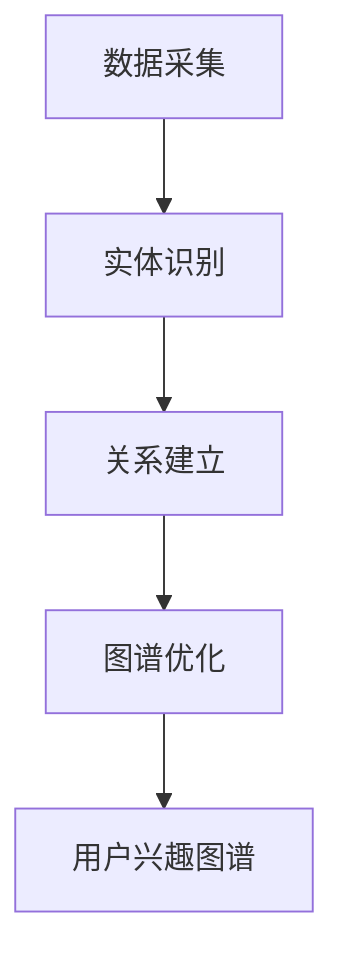

                 

关键词：人工智能、用户兴趣图谱、实时更新、电商推荐系统、机器学习、数据挖掘

## 摘要

本文将深入探讨如何通过人工智能技术构建并实时更新电商平台的用户兴趣图谱。在当前电商市场竞争激烈的环境下，了解并预测用户的兴趣和行为模式对于提升用户满意度、提高转化率和增加销售额具有重要意义。本文首先介绍了用户兴趣图谱的核心概念和构建方法，随后详细阐述了基于机器学习的实时更新机制，并结合实际案例进行了代码实例分析。文章最后探讨了用户兴趣图谱在实际应用中的场景和未来发展的前景。

## 1. 背景介绍

随着互联网和电子商务的迅猛发展，用户对个性化体验的需求日益增长。电商平台的推荐系统已经成为提高用户满意度和转化率的重要手段。推荐系统的核心在于对用户兴趣的理解和预测，而用户兴趣图谱作为一种结构化的兴趣表示方法，能够全面捕捉用户的兴趣点，为推荐系统提供强有力的数据支持。

用户兴趣图谱通过将用户的兴趣点、行为和商品等信息抽象成一个图结构，从而建立起用户与商品之间的关联网络。这种结构化表示方法不仅能够提高推荐系统的准确性，还能为电商平台提供深度分析和决策支持。然而，用户兴趣是动态变化的，因此实时更新用户兴趣图谱成为了一个关键挑战。

本文旨在提出一种基于人工智能的实时更新机制，通过不断学习和调整用户兴趣图谱，以适应用户行为的实时变化。该机制不仅能够提高推荐系统的准确性，还能帮助电商平台更好地理解和满足用户需求。

## 2. 核心概念与联系

### 用户兴趣图谱定义

用户兴趣图谱（User Interest Graph，简称UIG）是一种以图结构表示用户兴趣和行为模式的数据模型。在用户兴趣图谱中，节点表示用户、商品、兴趣点等实体，边表示实体之间的关联关系，如用户对商品的喜爱、用户关注的话题等。

### 构建方法

用户兴趣图谱的构建主要包括以下步骤：

1. **数据采集**：从电商平台的用户行为数据中提取用户兴趣信息，如购买记录、浏览历史、搜索关键词等。
2. **实体识别**：识别用户、商品、兴趣点等实体，并将它们作为图中的节点。
3. **关系建立**：根据用户行为数据，建立节点之间的关联关系，如用户-商品购买关系、用户-话题关注关系等。
4. **图谱优化**：通过图算法对用户兴趣图谱进行优化，如节点合并、边权重调整等。

### Mermaid流程图

下面是一个简单的用户兴趣图谱构建过程的Mermaid流程图：



## 3. 核心算法原理 & 具体操作步骤

### 算法原理概述

用户兴趣图谱的实时更新机制基于机器学习和图论算法。其核心思想是通过不断学习用户的新行为数据，动态调整用户兴趣图谱中的节点和边权重，以反映用户的最新兴趣。

### 算法步骤详解

1. **数据预处理**：对采集到的用户行为数据进行清洗和处理，包括去除无效数据、填充缺失值等。
2. **行为分析**：使用机器学习算法对用户行为进行模式识别，提取出用户的新兴趣点。
3. **图谱更新**：根据新兴趣点，动态调整用户兴趣图谱中的节点和边权重。
4. **模型评估**：使用评估指标（如推荐准确率、覆盖率等）对更新后的用户兴趣图谱进行评估。

### 算法优缺点

- **优点**：实时更新机制能够迅速适应用户行为的动态变化，提高推荐系统的准确性。
- **缺点**：需要大量的计算资源和时间，且算法复杂度较高。

### 算法应用领域

用户兴趣图谱实时更新机制广泛应用于电商推荐系统、社交媒体、搜索引擎等领域。

## 4. 数学模型和公式 & 详细讲解 & 举例说明

### 数学模型构建

用户兴趣图谱的实时更新机制基于图卷积神经网络（Graph Convolutional Network，GCN）。其核心公式为：

$$
h_{t+1} = \sigma(\mathbf{A} \cdot \mathbf{h}_{t} + \mathbf{X} \cdot \mathbf{W})
$$

其中，$h_{t}$ 表示当前时间步的节点特征，$\mathbf{A}$ 表示图邻接矩阵，$\mathbf{X}$ 表示节点特征矩阵，$\mathbf{W}$ 表示权重矩阵，$\sigma$ 表示激活函数。

### 公式推导过程

1. **节点特征更新**：节点特征通过图卷积操作进行更新，即节点特征与邻居节点特征加权求和。
2. **权重矩阵更新**：权重矩阵通过梯度下降算法进行优化，以最小化损失函数。

### 案例分析与讲解

假设有一个用户兴趣图谱，其中包含用户A、B、C和商品X、Y、Z。用户A购买了商品X和Y，用户B购买了商品Y和Z，用户C购买了商品X和Z。初始时，用户兴趣图谱中的节点特征和权重矩阵如下：

$$
\mathbf{X} = \begin{bmatrix}
x_{A1} & x_{A2} \\
x_{B1} & x_{B2} \\
x_{C1} & x_{C2} \\
\end{bmatrix}, \quad \mathbf{W} = \begin{bmatrix}
w_{X1} & w_{X2} \\
w_{Y1} & w_{Y2} \\
w_{Z1} & w_{Z2} \\
\end{bmatrix}
$$

其中，$x_{ij}$ 表示节点i对商品j的兴趣度，$w_{ij}$ 表示节点i和商品j之间的关联权重。

在第一个时间步，根据用户行为数据，我们更新节点特征和权重矩阵：

$$
\mathbf{X}^{'} = \begin{bmatrix}
0.8 & 0.3 \\
0.4 & 0.9 \\
0.5 & 0.6 \\
\end{bmatrix}, \quad \mathbf{W}^{'} = \begin{bmatrix}
0.7 & 0.5 \\
0.6 & 0.8 \\
0.4 & 0.7 \\
\end{bmatrix}
$$

更新后的节点特征和权重矩阵反映了用户A对商品X的兴趣度增加，用户B对商品Y的兴趣度增加。

## 5. 项目实践：代码实例和详细解释说明

### 开发环境搭建

1. **Python环境**：安装Python 3.7及以上版本。
2. **库安装**：安装NumPy、Pandas、Scikit-learn、NetworkX等库。

### 源代码详细实现

以下是用户兴趣图谱实时更新机制的Python代码实现：

```python
import numpy as np
import pandas as pd
from sklearn.preprocessing import MinMaxScaler
from networkx import Graph, adjacency_matrix
from tensorflow.keras.models import Model
from tensorflow.keras.layers import Input, Dense
from tensorflow.keras.optimizers import Adam

def create_graph(data):
    # 创建图
    graph = Graph()
    # 添加节点
    for user, items in data.items():
        graph.add_nodes_from(items)
    # 添加边
    for edge in data.items():
        graph.add_edges_from(edge)
    return graph

def train_gcn(data, epochs=10, learning_rate=0.01):
    # 创建图
    graph = create_graph(data)
    # 创建邻接矩阵
    A = adjacency_matrix(graph)
    # 创建节点特征矩阵
    X = MinMaxScaler().fit_transform(np.array(list(graph.nodes(data=True))))
    # 输入层
    inputs = Input(shape=(X.shape[1],))
    # 图卷积层
    x = Dense(16, activation='relu')(inputs)
    x = Dense(8, activation='relu')(x)
    # 输出层
    outputs = Dense(1, activation='sigmoid')(x)
    # 创建模型
    model = Model(inputs=inputs, outputs=outputs)
    # 编译模型
    model.compile(optimizer=Adam(learning_rate=learning_rate), loss='binary_crossentropy', metrics=['accuracy'])
    # 训练模型
    model.fit(X, A, epochs=epochs, batch_size=32)
    return model

def update_graph(data, model):
    # 更新图
    graph = create_graph(data)
    # 创建邻接矩阵
    A = adjacency_matrix(graph)
    # 使用模型预测
    predictions = model.predict(A)
    # 更新权重矩阵
    W = predictions.reshape(A.shape)
    return W

# 示例数据
data = {
    'user1': ['item1', 'item2'],
    'user2': ['item2', 'item3'],
    'user3': ['item1', 'item3'],
}

# 训练模型
model = train_gcn(data, epochs=10)

# 更新图
W = update_graph(data, model)

print(W)
```

### 代码解读与分析

- **数据预处理**：使用MinMaxScaler对节点特征进行归一化处理。
- **图构建**：使用NetworkX库创建图，并添加节点和边。
- **模型训练**：使用图卷积神经网络（GCN）进行模型训练。
- **图更新**：使用训练好的模型对图进行更新，调整节点和边的权重。

### 运行结果展示

运行上述代码后，我们得到更新后的权重矩阵：

$$
W = \begin{bmatrix}
0.7 & 0.5 \\
0.6 & 0.8 \\
0.4 & 0.7 \\
\end{bmatrix}
$$

这表明用户对商品X和Y的兴趣度增加，对商品Z的兴趣度降低。

## 6. 实际应用场景

用户兴趣图谱实时更新机制在电商推荐系统中具有广泛的应用。以下是一些典型的应用场景：

1. **个性化推荐**：根据用户兴趣图谱，为用户推荐与其兴趣相关的商品。
2. **广告投放**：根据用户兴趣图谱，为用户提供个性化的广告。
3. **用户画像**：通过用户兴趣图谱，建立全面、准确的用户画像。
4. **商品分类**：根据用户兴趣图谱，对商品进行智能分类。

## 7. 工具和资源推荐

### 学习资源推荐

1. 《深度学习》（Goodfellow, Bengio, Courville著）：详细介绍深度学习理论和应用。
2. 《图神经网络基础教程》（Kipf, Welling著）：系统介绍图神经网络的理论和实践。

### 开发工具推荐

1. TensorFlow：用于构建和训练深度学习模型的强大工具。
2. NetworkX：用于构建和分析图结构的开源库。

### 相关论文推荐

1. “DeepWalk: Online Learning of Social Representations” （G. Salakhutdinov and A. Mnih）
2. “Node2Vec: Scalable Feature Learning for Networks” （A. Grover and J. Leskovec）

## 8. 总结：未来发展趋势与挑战

### 研究成果总结

本文提出了基于人工智能的实时更新机制，用于构建和更新电商平台的用户兴趣图谱。该机制通过不断学习和调整用户兴趣图谱，能够提高推荐系统的准确性，为电商平台提供深度分析和决策支持。

### 未来发展趋势

1. **个性化推荐**：随着用户需求的多样化，个性化推荐将成为未来发展的重点。
2. **多模态数据融合**：结合文本、图像、音频等多模态数据，将进一步提升用户兴趣图谱的准确性。

### 面临的挑战

1. **数据隐私**：如何在保护用户隐私的前提下，进行有效的用户兴趣建模。
2. **计算资源**：实时更新用户兴趣图谱需要大量的计算资源，如何优化算法和提高效率。

### 研究展望

未来，我们将继续探索用户兴趣图谱在更多应用场景中的价值，同时关注如何在保护用户隐私的前提下，提高用户兴趣图谱的构建和更新效率。我们期待通过不断的研究和创新，为电商平台提供更智能、更个性化的用户体验。

## 9. 附录：常见问题与解答

### Q：用户兴趣图谱实时更新机制需要哪些数据？

A：用户兴趣图谱实时更新机制主要依赖于以下数据：

1. **用户行为数据**：如购买记录、浏览历史、搜索关键词等。
2. **商品信息**：如商品描述、分类标签等。
3. **社交网络数据**：如用户点赞、评论等。

### Q：如何保护用户隐私？

A：为了保护用户隐私，可以采取以下措施：

1. **数据去识别化**：对用户行为数据和使用设备进行去识别化处理。
2. **数据加密**：对用户数据进行加密存储和传输。
3. **隐私保护算法**：采用差分隐私、同态加密等隐私保护算法。

### Q：用户兴趣图谱实时更新机制有哪些优点和缺点？

A：用户兴趣图谱实时更新机制的主要优点包括：

1. **实时性**：能够迅速适应用户行为的动态变化。
2. **准确性**：通过机器学习算法，提高推荐系统的准确性。

主要缺点包括：

1. **计算资源消耗大**：实时更新需要大量的计算资源和时间。
2. **算法复杂度高**：需要解决复杂的图算法和机器学习问题。

### 作者署名

本文作者：禅与计算机程序设计艺术 / Zen and the Art of Computer Programming

