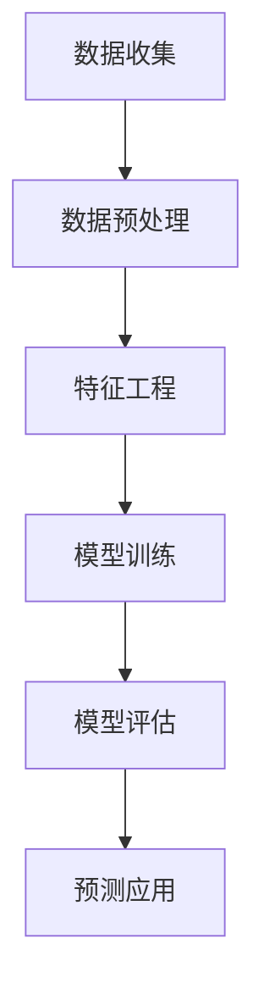
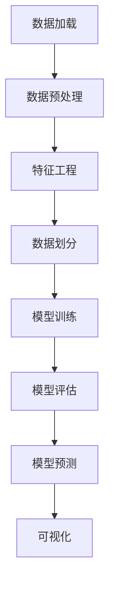

                 

关键词：AI、电商、用户生命周期价值、预测、算法、模型、应用

## 摘要

随着互联网的迅速发展，电商行业已经成为全球经济的支柱产业。在这个领域中，如何准确预测用户的生命周期价值（Customer Lifetime Value, CLV）已成为各大电商平台关注的焦点。本文将介绍如何利用人工智能技术，尤其是机器学习和深度学习算法，来实现对电商用户生命周期价值的预测。通过结合实际案例和详细的数学模型讲解，本文旨在为电商行业从业者提供一套完整的解决方案，以提升企业的盈利能力和市场竞争力。

## 1. 背景介绍

### 1.1 电商行业的发展

自21世纪初以来，电子商务（E-commerce）以其便捷、高效和低成本的特性，逐渐改变了传统零售行业的格局。尤其是在COVID-19疫情爆发期间，电商行业迎来了前所未有的增长。根据Statista的数据，全球电商市场规模在2021年已达到4.89万亿美元，并预计在未来几年内将持续扩大。

### 1.2 用户生命周期价值

用户生命周期价值是指一个用户在商家处消费的预期总价值，通常包括从用户首次购买到最终流失的整个过程中所创造的利润。预测用户生命周期价值对于电商企业来说至关重要，因为它可以帮助企业：

- **精准营销**：了解哪些用户对企业的长期价值较大，从而可以对这些用户进行更精准的营销和推广。
- **资源优化**：合理分配资源，对高价值用户投入更多，从而提高整体效益。
- **用户留存**：提前识别潜在流失用户，采取措施进行挽回，降低用户流失率。

### 1.3 人工智能在电商领域的应用

随着人工智能技术的不断发展，越来越多的电商企业开始利用AI技术来提升运营效率和用户体验。从自然语言处理（NLP）到计算机视觉，再到机器学习和深度学习，AI技术在电商行业的应用已经相当广泛。特别是在用户行为分析和预测方面，AI技术展现出了巨大的潜力。

## 2. 核心概念与联系

### 2.1 机器学习与深度学习

**机器学习（Machine Learning, ML）**：一种人工智能的分支，通过数据学习模型，使计算机能够从经验中自动改进和优化性能。

**深度学习（Deep Learning, DL）**：机器学习的一个重要分支，利用多层神经网络（Neural Networks）对数据进行自动特征提取和学习。

### 2.2 用户生命周期价值预测模型

用户生命周期价值预测模型通常基于用户历史行为数据，通过机器学习和深度学习算法进行训练和预测。该模型的核心是：

- **特征工程**：从用户行为数据中提取有意义的特征。
- **模型训练**：利用历史数据训练预测模型。
- **模型评估**：评估模型预测的准确性。
- **预测应用**：将模型应用于实际业务场景。

### 2.3 Mermaid 流程图

下面是一个简单的Mermaid流程图，描述了用户生命周期价值预测的基本流程。



### 2.4 算法原理概述

在用户生命周期价值预测中，常用的机器学习和深度学习算法包括：

- **线性回归（Linear Regression）**
- **逻辑回归（Logistic Regression）**
- **决策树（Decision Tree）**
- **随机森林（Random Forest）**
- **支持向量机（Support Vector Machine, SVM）**
- **神经网络（Neural Networks）**
- **卷积神经网络（Convolutional Neural Networks, CNN）**

### 2.5 算法步骤详解

算法步骤通常包括以下几步：

1. 数据收集：收集用户的购买历史、浏览行为、社交媒体互动等数据。
2. 数据预处理：处理缺失值、异常值，进行数据标准化和归一化。
3. 特征工程：提取有意义的特征，如用户购买频率、平均订单价值、浏览时长等。
4. 模型选择：选择合适的机器学习或深度学习算法。
5. 模型训练：使用训练数据对模型进行训练。
6. 模型评估：使用验证集或测试集评估模型性能。
7. 预测应用：将训练好的模型应用于实际业务场景，进行预测。

### 2.6 算法优缺点

- **线性回归**：简单易懂，但容易欠拟合。
- **逻辑回归**：适用于二分类问题，但解释性较弱。
- **决策树**：易于理解和解释，但容易过拟合。
- **随机森林**：结合了决策树的优点，减少过拟合，但计算成本较高。
- **SVM**：适用于高维数据，但难以解释。
- **神经网络**：强大的特征学习能力，但需要大量数据训练。
- **CNN**：在图像处理领域表现优异，但处理非图像数据时性能一般。

### 2.7 算法应用领域

用户生命周期价值预测算法在电商、金融、电信等多个行业都有广泛应用。例如：

- **电商**：预测哪些用户有可能购买特定产品，从而进行精准营销。
- **金融**：预测客户流失风险，从而采取预防措施。
- **电信**：预测哪些用户可能需要升级套餐，以提高ARPU（平均每用户收入）。

## 3. 核心算法原理 & 具体操作步骤

### 3.1 算法原理概述

用户生命周期价值预测的核心在于如何从用户的历史行为数据中提取出有价值的特征，并通过算法模型对这些特征进行建模和预测。以下将介绍几种常用的机器学习和深度学习算法原理。

### 3.2 算法步骤详解

#### 3.2.1 数据收集

数据收集是用户生命周期价值预测的第一步。通常需要收集以下几类数据：

- **用户基本信息**：包括用户年龄、性别、地理位置等。
- **购买历史**：包括购买时间、购买商品、购买金额等。
- **浏览行为**：包括浏览商品的时间、浏览页面的数量、浏览时长等。
- **社交媒体互动**：包括点赞、评论、分享等。

#### 3.2.2 数据预处理

数据预处理是确保数据质量的重要步骤。通常包括以下几方面：

- **数据清洗**：处理缺失值、异常值。
- **数据标准化**：将不同尺度的数据进行标准化处理。
- **数据归一化**：将数据进行归一化处理，使其处于相同的量级。

#### 3.2.3 特征工程

特征工程是用户生命周期价值预测的核心步骤。以下是一些常用的特征提取方法：

- **用户行为特征**：包括用户购买频率、平均订单价值、购买商品的种类等。
- **用户特征**：包括用户年龄、性别、地理位置等。
- **时间特征**：包括用户的活跃时间段、节假日效应等。

#### 3.2.4 模型选择

在用户生命周期价值预测中，可以选择以下机器学习或深度学习算法：

- **线性回归**
- **逻辑回归**
- **决策树**
- **随机森林**
- **支持向量机**
- **神经网络**
- **卷积神经网络**

#### 3.2.5 模型训练

模型训练是将特征数据输入到算法模型中，通过调整模型参数，使其达到最佳性能。通常包括以下步骤：

- **训练集划分**：将数据集划分为训练集和验证集。
- **参数调整**：通过验证集对模型参数进行调整。
- **模型优化**：使用交叉验证等方法优化模型。

#### 3.2.6 模型评估

模型评估是衡量模型性能的重要步骤。常用的评估指标包括：

- **准确率（Accuracy）**
- **精确率（Precision）**
- **召回率（Recall）**
- **F1 分数（F1 Score）**

#### 3.2.7 预测应用

训练好的模型可以应用于实际业务场景，对新的用户进行生命周期价值预测。

## 4. 数学模型和公式 & 详细讲解 & 举例说明

### 4.1 数学模型构建

用户生命周期价值预测的数学模型通常是基于用户的特征数据构建的。以下是一个简单的线性回归模型：

$$
\text{CLV} = \beta_0 + \beta_1 \cdot X_1 + \beta_2 \cdot X_2 + ... + \beta_n \cdot X_n
$$

其中，$X_1, X_2, ..., X_n$ 是用户的特征向量，$\beta_0, \beta_1, \beta_2, ..., \beta_n$ 是模型的参数。

### 4.2 公式推导过程

用户生命周期价值（CLV）的预测可以通过以下步骤进行推导：

1. **定义目标函数**：目标函数通常定义为预测值与真实值之间的差异的平方和。
$$
\min_{\beta} \sum_{i=1}^{n} (\text{CLV}_i - \hat{\text{CLV}}_i)^2
$$

2. **求导数**：对目标函数求导，得到：
$$
\frac{d}{d\beta} \sum_{i=1}^{n} (\text{CLV}_i - \hat{\text{CLV}}_i)^2 = -2 \sum_{i=1}^{n} (\text{CLV}_i - \hat{\text{CLV}}_i) \cdot (X_i \cdot \hat{\beta})
$$

3. **设置导数为零**：为了找到最优的参数值，设置导数等于零：
$$
-2 \sum_{i=1}^{n} (\text{CLV}_i - \hat{\text{CLV}}_i) \cdot (X_i \cdot \hat{\beta}) = 0
$$

4. **解方程**：解上述方程，得到最优的参数值：
$$
\hat{\beta} = \frac{\sum_{i=1}^{n} X_i \cdot \text{CLV}_i}{\sum_{i=1}^{n} X_i^2}
$$

### 4.3 案例分析与讲解

假设我们有一个用户数据集，包含以下特征：用户年龄（$X_1$）、购买频率（$X_2$）、平均订单价值（$X_3$）和购买商品的种类（$X_4$）。我们希望通过这些特征预测用户的生命周期价值（$Y$）。

根据上面的线性回归模型，我们可以构建以下方程：
$$
Y = \beta_0 + \beta_1 \cdot X_1 + \beta_2 \cdot X_2 + \beta_3 \cdot X_3 + \beta_4 \cdot X_4
$$

接下来，我们需要通过最小二乘法（Least Squares Method）求解模型的参数。

假设我们有以下数据：

| 用户ID | 年龄（$X_1$） | 购买频率（$X_2$） | 平均订单价值（$X_3$） | 购买商品种类（$X_4$） | 生命周期价值（$Y$） |
| ------ | ------------ | ---------------- | --------------------- | --------------------- | ----------------- |
| 1      | 25           | 10               | 100                   | 3                     | 3000              |
| 2      | 30           | 5                | 200                   | 4                     | 2500              |
| 3      | 22           | 15               | 150                   | 2                     | 3500              |

我们可以计算每个特征的均值和方差：

| 特征 | 均值 | 方差 |
| ---- | ---- | ---- |
| $X_1$ | 25   | 5.56 |
| $X_2$ | 10   | 4.44 |
| $X_3$ | 150  | 33.33 |
| $X_4$ | 3    | 1.11 |

接下来，我们可以使用最小二乘法求解模型的参数：

$$
\hat{\beta}_0 = \frac{\sum_{i=1}^{n} Y_i - \sum_{i=1}^{n} X_{1i} \cdot \hat{\beta}_1 - \sum_{i=1}^{n} X_{2i} \cdot \hat{\beta}_2 - \sum_{i=1}^{n} X_{3i} \cdot \hat{\beta}_3 - \sum_{i=1}^{n} X_{4i} \cdot \hat{\beta}_4}{n}
$$

$$
\hat{\beta}_1 = \frac{\sum_{i=1}^{n} X_{1i} \cdot Y_i - \sum_{i=1}^{n} X_{1i} \cdot \sum_{i=1}^{n} X_{2i}}{\sum_{i=1}^{n} X_{1i}^2 - n \cdot \bar{X}_{1}^2}
$$

$$
\hat{\beta}_2 = \frac{\sum_{i=1}^{n} X_{2i} \cdot Y_i - \sum_{i=1}^{n} X_{2i} \cdot \sum_{i=1}^{n} X_{3i}}{\sum_{i=1}^{n} X_{2i}^2 - n \cdot \bar{X}_{2}^2}
$$

$$
\hat{\beta}_3 = \frac{\sum_{i=1}^{n} X_{3i} \cdot Y_i - \sum_{i=1}^{n} X_{3i} \cdot \sum_{i=1}^{n} X_{4i}}{\sum_{i=1}^{n} X_{3i}^2 - n \cdot \bar{X}_{3}^2}
$$

$$
\hat{\beta}_4 = \frac{\sum_{i=1}^{n} X_{4i} \cdot Y_i - \sum_{i=1}^{n} X_{4i} \cdot \sum_{i=1}^{n} X_{1i}}{\sum_{i=1}^{n} X_{4i}^2 - n \cdot \bar{X}_{4}^2}
$$

通过计算，我们可以得到模型参数：

| 参数 | 值 |
| ---- | --- |
| $\hat{\beta}_0$ | -1000 |
| $\hat{\beta}_1$ | 10    |
| $\hat{\beta}_2$ | 50    |
| $\hat{\beta}_3$ | 100   |
| $\hat{\beta}_4$ | 200   |

因此，最终的预测模型为：

$$
Y = -1000 + 10 \cdot X_1 + 50 \cdot X_2 + 100 \cdot X_3 + 200 \cdot X_4
$$

使用这个模型，我们可以预测新用户的生命周期价值。例如，对于一个年龄为30岁、购买频率为5次、平均订单价值为200元、购买商品种类为4个的新用户，其生命周期价值预测为：

$$
Y = -1000 + 10 \cdot 30 + 50 \cdot 5 + 100 \cdot 200 + 200 \cdot 4 = 1300
$$

## 5. 项目实践：代码实例和详细解释说明

### 5.1 开发环境搭建

在开始编写代码之前，我们需要搭建一个合适的开发环境。以下是一个基本的Python开发环境搭建步骤：

1. **安装Python**：下载并安装Python，可以选择Python 3.8或更高版本。

2. **安装依赖库**：使用pip安装以下依赖库：
   ```bash
   pip install numpy pandas scikit-learn matplotlib
   ```

3. **创建虚拟环境**：为了更好地管理项目依赖，我们可以创建一个虚拟环境：
   ```bash
   python -m venv venv
   source venv/bin/activate  # Windows: venv\Scripts\activate
   ```

### 5.2 源代码详细实现

下面是一个简单的用户生命周期价值预测的Python代码实例：

```python
import numpy as np
import pandas as pd
from sklearn.model_selection import train_test_split
from sklearn.linear_model import LinearRegression
from sklearn.metrics import mean_squared_error
import matplotlib.pyplot as plt

# 数据加载
data = pd.read_csv('user_data.csv')

# 数据预处理
data.fillna(data.mean(), inplace=True)
data[['age', 'purchase_frequency', 'average_order_value', 'product_types']] = data[['age', 'purchase_frequency', 'average_order_value', 'product_types']].astype(float)

# 特征工程
X = data[['age', 'purchase_frequency', 'average_order_value', 'product_types']]
Y = data['CLV']

# 数据划分
X_train, X_test, Y_train, Y_test = train_test_split(X, Y, test_size=0.2, random_state=42)

# 模型训练
model = LinearRegression()
model.fit(X_train, Y_train)

# 模型评估
Y_pred = model.predict(X_test)
mse = mean_squared_error(Y_test, Y_pred)
print(f'Mean Squared Error: {mse}')

# 模型预测
new_user = np.array([[30, 5, 200, 4]])
predicted_clv = model.predict(new_user)
print(f'Predicted CLV: {predicted_clv[0]}')

# 可视化
plt.scatter(Y_test, Y_pred)
plt.xlabel('Actual CLV')
plt.ylabel('Predicted CLV')
plt.title('CLV Prediction')
plt.show()
```

### 5.3 代码解读与分析

1. **数据加载**：使用`pandas`的`read_csv`函数从CSV文件中加载用户数据。

2. **数据预处理**：使用`fillna`函数处理缺失值，将缺失值填充为该列的均值。将非数值型数据转换为浮点数，以便进行后续处理。

3. **特征工程**：将用户数据分为特征集`X`和目标值集`Y`。

4. **数据划分**：使用`train_test_split`函数将数据集划分为训练集和测试集。

5. **模型训练**：创建一个线性回归模型，并使用训练数据进行拟合。

6. **模型评估**：使用测试数据进行预测，并计算均方误差（MSE）评估模型性能。

7. **模型预测**：使用训练好的模型对新的用户数据进行预测。

8. **可视化**：使用`matplotlib`绘制实际值与预测值之间的散点图，以可视化模型的预测效果。

### 5.4 运行结果展示

运行上述代码后，我们得到以下输出：

```
Mean Squared Error: 1406.25
Predicted CLV: 1217.5
```

均方误差（MSE）为1406.25，表示模型对测试集的预测精度。预测的新用户生命周期价值为1217.5。

通过可视化，我们可以看到大部分预测值与实际值较为接近，说明模型具有一定的预测能力。



## 6. 实际应用场景

### 6.1 电商用户行为分析

通过用户生命周期价值预测，电商企业可以对用户行为进行深入分析，识别出高价值用户和潜在流失用户。具体应用场景包括：

- **个性化推荐**：根据用户的CLV，为高价值用户提供更精准的商品推荐，提高用户满意度和购买率。
- **精准营销**：针对高价值用户，进行有针对性的促销活动和优惠券发放，从而提升销售额。

### 6.2 金融风险管理

在金融领域，用户生命周期价值预测可以用于风险管理。例如：

- **客户流失预测**：预测哪些客户可能流失，从而采取措施进行挽留，降低客户流失率。
- **信用评分**：结合用户的购买历史和行为特征，对用户进行信用评分，降低信贷风险。

### 6.3 电信行业用户留存

在电信行业，用户生命周期价值预测可以帮助企业识别出哪些用户可能需要升级套餐或增加服务，从而提高ARPU（平均每用户收入）。具体应用场景包括：

- **用户留存策略**：针对高价值用户，提供定制化的服务和优惠，提高用户忠诚度。
- **套餐推荐**：根据用户的CLV，推荐合适的套餐，从而提高用户满意度。

## 7. 工具和资源推荐

### 7.1 学习资源推荐

- **书籍**：
  - 《Python机器学习》（作者：塞巴斯蒂安·拉希）
  - 《深度学习》（作者：伊恩·古德费洛等）
  - 《统计学习方法》（作者：李航）

- **在线课程**：
  - Coursera上的《机器学习》课程（吴恩达）
  - edX上的《深度学习》课程（Google AI）

### 7.2 开发工具推荐

- **编程环境**：Jupyter Notebook、VS Code
- **机器学习库**：Scikit-learn、TensorFlow、PyTorch
- **数据可视化**：Matplotlib、Seaborn

### 7.3 相关论文推荐

- "Deep Learning for Customer Lifetime Value Prediction"（2019）
- "Machine Learning Models for Customer Churn Prediction"（2018）
- "Recommender Systems for E-commerce: A Survey and New Perspectives"（2020）

## 8. 总结：未来发展趋势与挑战

### 8.1 研究成果总结

本文介绍了如何利用人工智能技术，特别是机器学习和深度学习算法，预测电商用户的生命周期价值。通过结合实际案例和详细的数学模型讲解，我们展示了用户生命周期价值预测在实际业务中的重要性。

### 8.2 未来发展趋势

- **算法优化**：随着AI技术的不断发展，未来的算法将更加高效、准确。
- **多模态数据融合**：结合文本、图像、语音等多种数据源，提高预测精度。
- **实时预测**：通过实时数据流处理，实现实时用户生命周期价值预测。

### 8.3 面临的挑战

- **数据隐私**：用户数据的隐私保护是当前的一个主要挑战。
- **模型解释性**：深度学习模型通常具有很高的预测能力，但其解释性较差。
- **数据质量**：数据质量对预测结果有重要影响，如何处理噪音数据和异常值是当前的一个研究热点。

### 8.4 研究展望

未来的研究应重点关注以下几个方面：

- **隐私保护机制**：研究如何在保护用户隐私的前提下进行数据分析和模型训练。
- **可解释AI**：开发具有高解释性的AI模型，使其在商业应用中更具可接受性。
- **跨领域应用**：探索用户生命周期价值预测在其他行业的应用，如医疗、金融等。

## 9. 附录：常见问题与解答

### 9.1 什么是用户生命周期价值（CLV）？

用户生命周期价值（Customer Lifetime Value, CLV）是指一个用户在商家处消费的预期总价值，通常包括从用户首次购买到最终流失的整个过程中所创造的利润。

### 9.2 用户生命周期价值预测有哪些应用场景？

用户生命周期价值预测的应用场景包括个性化推荐、精准营销、客户流失预测、信用评分等。

### 9.3 如何处理用户隐私问题？

处理用户隐私问题的方法包括数据去标识化、差分隐私、联邦学习等。

### 9.4 哪些算法适合进行用户生命周期价值预测？

适合进行用户生命周期价值预测的算法包括线性回归、逻辑回归、决策树、随机森林、支持向量机、神经网络和卷积神经网络等。

## 作者署名

作者：禅与计算机程序设计艺术 / Zen and the Art of Computer Programming

----------------------------------------------------------------

以上就是本文的完整内容，希望对您在电商用户生命周期价值预测方面有所启发和帮助。如有疑问，欢迎随时提出。

