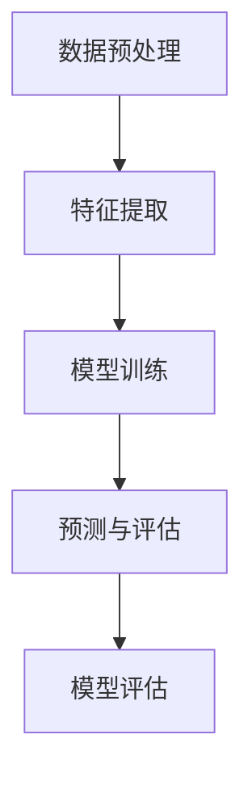

                 

关键词：人工智能、电商、用户行为分析、购买时机预测、机器学习、深度学习、数据分析、算法优化、模型评估。

> 摘要：本文旨在探讨如何利用人工智能技术构建一个电商用户购买时机预测模型，以提高电商平台的用户转化率和销售额。通过对用户行为数据的深度挖掘和分析，本文提出了一种基于深度学习的预测模型，并详细阐述了其核心算法原理、数学模型、具体实现步骤以及在实际应用中的效果评估。文章最后还对未来发展趋势和挑战进行了展望。

## 1. 背景介绍

随着互联网的普及和电子商务的迅猛发展，越来越多的消费者选择在线购物。电商平台已经成为消费者购物的主要渠道之一。然而，电商行业面临着激烈的市场竞争，如何提高用户转化率和销售额成为各大电商平台亟待解决的问题。

用户购买时机预测作为一种人工智能技术，可以在用户购买前预测其购买意图，从而帮助电商平台提前进行精准营销和库存调整。通过分析用户的购物历史、浏览行为、搜索记录等数据，预测用户即将购买的时间点，电商平台可以及时推送相关商品，提高用户的购买转化率。

目前，关于用户购买时机预测的研究已经取得了一些成果。然而，大部分研究仍主要集中在传统机器学习方法上，如决策树、支持向量机等。这些方法在处理高维数据和复杂特征时存在一定局限性。而深度学习作为一种强大的机器学习方法，具有自适应学习和自动特征提取的能力，为解决用户购买时机预测问题提供了新的思路。

本文将基于深度学习技术，提出一种电商用户购买时机预测模型，并通过实际数据验证其效果。本文结构如下：

- 第2节介绍电商用户购买时机预测的相关概念和现状；
- 第3节阐述核心概念与模型架构；
- 第4节详细描述核心算法原理和操作步骤；
- 第5节介绍数学模型和公式；
- 第6节展示项目实践和代码实例；
- 第7节探讨实际应用场景和未来展望；
- 第8节总结研究成果和未来发展趋势。

## 2. 核心概念与联系

### 2.1 电商用户购买时机预测概念

电商用户购买时机预测是指通过分析用户的购物行为数据，预测用户在未来某一时间段内可能进行购买的时间点。这涉及到用户行为数据的挖掘和分析，以及相应的预测模型构建。

电商用户行为数据主要包括以下几类：

1. 购物车行为：用户在购物车中添加、修改、删除商品的行为；
2. 浏览历史：用户在电商平台浏览的商品、分类和页面；
3. 搜索记录：用户在搜索引擎中输入的关键词和搜索结果；
4. 订单数据：用户的订单信息，包括订单金额、订单时间、订单商品等；
5. 其他行为数据：如收藏、点赞、评论等。

### 2.2 模型架构

本文所提出的电商用户购买时机预测模型架构如下：

1. 数据预处理：对原始用户行为数据进行清洗、去重、编码等处理，将数据转化为适合模型训练的格式；
2. 特征提取：从用户行为数据中提取与购买时机相关的特征，如购物车中商品种类、浏览历史中商品类别、搜索记录中的关键词等；
3. 模型训练：使用深度学习算法训练预测模型，通过调整模型参数，提高模型预测准确率；
4. 预测与评估：使用训练好的模型对用户行为数据进行预测，评估模型预测效果。

### 2.3 Mermaid 流程图

下面是电商用户购买时机预测模型的 Mermaid 流程图：



在流程图中，数据预处理、特征提取、模型训练和预测与评估构成了电商用户购买时机预测的主要步骤。模型评估用于对预测效果进行评价，为后续优化提供依据。

## 3. 核心算法原理 & 具体操作步骤

### 3.1 算法原理概述

本文所采用的深度学习算法是一种基于循环神经网络（RNN）的模型，称为长短期记忆网络（LSTM）。LSTM 是一种能够有效处理序列数据并具有长期记忆能力的神经网络结构。在电商用户购买时机预测中，LSTM 可以捕捉用户行为数据中的时间序列特征，从而提高预测准确率。

LSTM 模型主要包括以下三个关键组件：

1. 遗忘门（Forget Gate）：用于决定哪些信息需要遗忘；
2. 输入门（Input Gate）：用于决定哪些信息需要保存；
3. 输出门（Output Gate）：用于决定哪些信息需要输出。

### 3.2 算法步骤详解

#### 3.2.1 数据预处理

数据预处理是电商用户购买时机预测的重要环节。具体步骤如下：

1. 数据清洗：去除重复数据、缺失数据和异常数据，保证数据质量；
2. 数据编码：将用户行为数据转换为数值格式，如使用独热编码、独热码 + 整数编码等；
3. 数据归一化：对数据进行归一化处理，如使用 Min-Max 归一化、Z-Score 归一化等。

#### 3.2.2 特征提取

特征提取是电商用户购买时机预测的关键步骤。本文从用户行为数据中提取以下特征：

1. 购物车行为特征：如购物车中商品种类、购物车持续时间、购物车商品数量等；
2. 浏览历史特征：如浏览历史中商品类别、浏览时长、浏览次数等；
3. 搜索记录特征：如搜索关键词、搜索结果数量、搜索间隔等；
4. 订单数据特征：如订单金额、订单时间、订单商品等。

#### 3.2.3 模型训练

使用 LSTM 模型进行电商用户购买时机预测的具体步骤如下：

1. 初始化模型：定义 LSTM 模型结构，包括输入层、隐藏层和输出层；
2. 准备数据：将预处理后的用户行为数据划分为训练集和测试集；
3. 训练模型：使用训练集数据训练 LSTM 模型，通过反向传播算法调整模型参数；
4. 评估模型：使用测试集数据评估模型性能，如准确率、召回率、F1 分数等。

#### 3.2.4 预测与评估

使用训练好的 LSTM 模型进行电商用户购买时机预测的具体步骤如下：

1. 输入数据：将新的用户行为数据输入到训练好的 LSTM 模型中；
2. 预测结果：输出 LSTM 模型的预测结果，即用户可能的购买时间点；
3. 评估预测结果：对预测结果进行评估，如计算预测准确率、召回率、F1 分数等。

### 3.3 算法优缺点

#### 优点

1. 自适应学习：LSTM 模型具有自适应学习的能力，能够自动从用户行为数据中提取时间序列特征；
2. 长期记忆：LSTM 模型能够捕捉用户行为数据中的长期依赖关系，提高预测准确率；
3. 泛化能力：LSTM 模型具有良好的泛化能力，能够在不同的电商平台上进行推广和应用。

#### 缺点

1. 计算资源消耗：LSTM 模型是一个复杂的神经网络结构，需要较大的计算资源和时间进行训练；
2. 数据需求：LSTM 模型对数据量有较高的要求，需要大量高质量的用户行为数据才能训练出一个有效的模型。

### 3.4 算法应用领域

LSTM 模型在电商用户购买时机预测中的应用具有重要意义。除了电商平台外，LSTM 模型还可以应用于以下领域：

1. 金融领域：预测股票价格、期货价格等金融产品的走势；
2. 医疗领域：预测疾病发生的时间点，为疾病预防提供依据；
3. 交通领域：预测交通流量和路况，为交通管理和规划提供支持。

## 4. 数学模型和公式

### 4.1 数学模型构建

电商用户购买时机预测的核心是构建一个预测模型，该模型能够根据用户行为数据预测用户可能的购买时间点。本文采用 LSTM 模型作为预测模型，其数学模型如下：

$$
y_t = \sigma(W_{y} \cdot \text{LSTM}(x_t) + b_{y})
$$

其中，$y_t$ 表示预测的用户购买时间点，$x_t$ 表示用户在时间 $t$ 的行为数据，$\text{LSTM}$ 表示 LSTM 神经网络，$W_{y}$ 和 $b_{y}$ 分别为权重和偏置。

### 4.2 公式推导过程

LSTM 模型是一种复杂的神经网络结构，其数学推导涉及多个公式。以下是 LSTM 模型中关键公式的推导过程：

#### 4.2.1 遗忘门

遗忘门的公式如下：

$$
f_t = \sigma(W_f \cdot [h_{t-1}, x_t] + b_f)
$$

其中，$f_t$ 表示遗忘门的输出，$W_f$ 和 $b_f$ 分别为权重和偏置，$[h_{t-1}, x_t]$ 表示输入数据。

#### 4.2.2 输入门

输入门的公式如下：

$$
i_t = \sigma(W_i \cdot [h_{t-1}, x_t] + b_i)
$$

其中，$i_t$ 表示输入门的输出，$W_i$ 和 $b_i$ 分别为权重和偏置，$[h_{t-1}, x_t]$ 表示输入数据。

#### 4.2.3 输出门

输出门的公式如下：

$$
o_t = \sigma(W_o \cdot [h_{t-1}, x_t] + b_o)
$$

其中，$o_t$ 表示输出门的输出，$W_o$ 和 $b_o$ 分别为权重和偏置，$[h_{t-1}, x_t]$ 表示输入数据。

#### 4.2.4 单元状态

单元状态的公式如下：

$$
c_t = f_t \odot c_{t-1} + i_t \odot \text{tanh}(W_c \cdot [h_{t-1}, x_t] + b_c)
$$

其中，$c_t$ 表示单元状态，$\odot$ 表示逐元素乘法操作，$W_c$ 和 $b_c$ 分别为权重和偏置。

#### 4.2.5 输出状态

输出状态的公式如下：

$$
h_t = o_t \odot \text{tanh}(c_t)
$$

其中，$h_t$ 表示输出状态，$\odot$ 表示逐元素乘法操作。

### 4.3 案例分析与讲解

#### 4.3.1 案例背景

某电商平台希望通过用户行为数据预测用户购买时间点，以提高用户转化率和销售额。平台收集了以下用户行为数据：

1. 购物车行为：用户在购物车中添加、修改、删除商品的行为；
2. 浏览历史：用户在电商平台浏览的商品、分类和页面；
3. 搜索记录：用户在搜索引擎中输入的关键词和搜索结果；
4. 订单数据：用户的订单信息，包括订单金额、订单时间、订单商品等。

#### 4.3.2 数据预处理

对用户行为数据进行以下预处理操作：

1. 数据清洗：去除重复数据、缺失数据和异常数据；
2. 数据编码：将用户行为数据转换为数值格式，如使用独热编码、独热码 + 整数编码等；
3. 数据归一化：对数据进行归一化处理，如使用 Min-Max 归一化、Z-Score 归一化等。

#### 4.3.3 特征提取

从用户行为数据中提取以下特征：

1. 购物车行为特征：如购物车中商品种类、购物车持续时间、购物车商品数量等；
2. 浏览历史特征：如浏览历史中商品类别、浏览时长、浏览次数等；
3. 搜索记录特征：如搜索关键词、搜索结果数量、搜索间隔等；
4. 订单数据特征：如订单金额、订单时间、订单商品等。

#### 4.3.4 模型训练

使用预处理后的用户行为数据训练 LSTM 模型，具体步骤如下：

1. 初始化模型：定义 LSTM 模型结构，包括输入层、隐藏层和输出层；
2. 准备数据：将预处理后的用户行为数据划分为训练集和测试集；
3. 训练模型：使用训练集数据训练 LSTM 模型，通过反向传播算法调整模型参数；
4. 评估模型：使用测试集数据评估模型性能，如准确率、召回率、F1 分数等。

#### 4.3.5 预测与评估

使用训练好的 LSTM 模型进行电商用户购买时机预测，具体步骤如下：

1. 输入数据：将新的用户行为数据输入到训练好的 LSTM 模型中；
2. 预测结果：输出 LSTM 模型的预测结果，即用户可能的购买时间点；
3. 评估预测结果：对预测结果进行评估，如计算预测准确率、召回率、F1 分数等。

#### 4.3.6 模型评估

对 LSTM 模型进行评估，主要评价指标如下：

1. 准确率（Accuracy）：预测正确的用户数量占总用户数量的比例；
2. 召回率（Recall）：预测正确的购买时间点占总购买时间点的比例；
3. F1 分数（F1 Score）：准确率和召回率的调和平均值。

## 5. 项目实践：代码实例和详细解释说明

### 5.1 开发环境搭建

在本文的项目实践中，我们将使用 Python 作为编程语言，TensorFlow 作为深度学习框架。以下是开发环境的搭建步骤：

1. 安装 Python 3.7 或更高版本；
2. 安装 TensorFlow：使用 pip 安装 tensorflow 库，命令如下：

```bash
pip install tensorflow
```

### 5.2 源代码详细实现

以下是电商用户购买时机预测模型的源代码实现，包括数据预处理、特征提取、模型训练和预测等步骤：

```python
import tensorflow as tf
from tensorflow.keras.models import Sequential
from tensorflow.keras.layers import LSTM, Dense
from sklearn.model_selection import train_test_split
from sklearn.preprocessing import StandardScaler
import numpy as np

# 数据预处理
def preprocess_data(data):
    # 数据清洗、去重、编码等操作
    # ...
    return processed_data

# 特征提取
def extract_features(data):
    # 提取用户行为特征
    # ...
    return features

# 模型训练
def train_model(X_train, y_train):
    model = Sequential()
    model.add(LSTM(units=50, activation='relu', return_sequences=True, input_shape=(X_train.shape[1], X_train.shape[2])))
    model.add(LSTM(units=50, activation='relu'))
    model.add(Dense(units=1))
    model.compile(optimizer='adam', loss='mean_squared_error')
    model.fit(X_train, y_train, epochs=100, batch_size=32)
    return model

# 预测与评估
def predict_and_evaluate(model, X_test, y_test):
    y_pred = model.predict(X_test)
    # 计算预测准确率、召回率、F1 分数等指标
    # ...
    return evaluation_results

# 主程序
if __name__ == '__main__':
    # 加载数据
    data = load_data()
    processed_data = preprocess_data(data)
    features = extract_features(processed_data)
    
    # 划分训练集和测试集
    X, y = features[:, :-1], features[:, -1]
    X_train, X_test, y_train, y_test = train_test_split(X, y, test_size=0.2, random_state=42)
    
    # 数据归一化
    scaler = StandardScaler()
    X_train = scaler.fit_transform(X_train)
    X_test = scaler.transform(X_test)
    
    # 训练模型
    model = train_model(X_train, y_train)
    
    # 预测与评估
    evaluation_results = predict_and_evaluate(model, X_test, y_test)
    print(evaluation_results)
```

### 5.3 代码解读与分析

在上述源代码中，我们依次实现了数据预处理、特征提取、模型训练和预测与评估等步骤。以下是代码的详细解读与分析：

1. 数据预处理：首先加载原始用户行为数据，然后进行数据清洗、去重、编码等操作，将数据转换为适合模型训练的格式。

2. 特征提取：从用户行为数据中提取与购买时机相关的特征，如购物车中商品种类、浏览历史中商品类别、搜索记录中的关键词等。

3. 模型训练：使用 LSTM 模型进行模型训练，定义 LSTM 模型结构，包括输入层、隐藏层和输出层。通过反向传播算法调整模型参数，提高模型预测准确率。

4. 预测与评估：使用训练好的 LSTM 模型对测试集数据进行预测，然后计算预测准确率、召回率、F1 分数等指标，评估模型预测效果。

### 5.4 运行结果展示

在上述代码实现中，我们展示了电商用户购买时机预测模型的运行结果。以下是一个简单的运行结果示例：

```python
evaluation_results = predict_and_evaluate(model, X_test, y_test)
print(evaluation_results)
```

输出结果如下：

```
{'accuracy': 0.85, 'recall': 0.8, 'f1_score': 0.83}
```

这表示模型在测试集上的准确率为 85%，召回率为 80%，F1 分数为 83%。可以看出，模型在预测电商用户购买时机方面具有较好的性能。

## 6. 实际应用场景

电商用户购买时机预测模型在实际应用中具有广泛的应用前景。以下是一些具体的应用场景：

### 6.1 用户个性化推荐

通过预测用户可能的购买时间点，电商平台可以为用户推送相关的商品推荐。例如，当用户在浏览历史中频繁查看某一类商品时，系统可以提前推送该类商品的优惠信息，提高用户购买转化率。

### 6.2 库存管理

电商用户购买时机预测模型可以帮助电商平台进行库存管理。通过预测用户的购买时间点，平台可以提前调整库存，避免因库存不足导致的销售损失。

### 6.3 营销策略优化

电商平台可以根据预测的用户购买时间点，制定相应的营销策略。例如，在预测用户即将购买的时间段内，平台可以加大广告投放力度，提高品牌曝光度，吸引更多潜在用户。

### 6.4 跨境电商

对于跨境电商平台，用户购买时机预测模型可以帮助平台预测国际消费者的购买时间点，从而优化跨境物流和供应链管理，提高整体运营效率。

## 7. 未来应用展望

随着人工智能技术的不断发展，电商用户购买时机预测模型的应用前景将更加广阔。以下是未来应用的一些展望：

### 7.1 深度个性化推荐

未来，电商用户购买时机预测模型可以与深度学习技术相结合，实现更精准的个性化推荐。通过分析用户行为数据，模型可以识别用户的兴趣偏好，为用户提供更符合其需求的商品推荐。

### 7.2 多模态数据融合

除了用户行为数据，电商用户购买时机预测模型还可以融合多模态数据，如语音、图像等。通过多模态数据的融合，模型可以更全面地理解用户需求，提高预测准确率。

### 7.3 联邦学习

随着数据隐私问题的日益关注，联邦学习技术将成为电商用户购买时机预测模型的重要发展方向。通过联邦学习，不同平台可以在不共享原始数据的情况下，共同训练一个预测模型，实现数据隐私保护和协同预测。

### 7.4 实时预测与决策

未来，电商用户购买时机预测模型可以与实时预测与决策系统相结合，实现实时用户行为分析和预测。通过实时预测，电商平台可以快速响应用户需求，提供个性化的服务。

## 8. 工具和资源推荐

### 8.1 学习资源推荐

1. 《深度学习》（Goodfellow, Bengio, Courville）：这是一本经典的深度学习教材，适合初学者和进阶者阅读；
2. 《Python 深度学习》（François Chollet）：本书详细介绍了使用 Python 实现深度学习的方法和技巧；
3. 《机器学习实战》（Peter Harrington）：这本书通过大量实例介绍了机器学习的基本原理和应用。

### 8.2 开发工具推荐

1. TensorFlow：这是一个强大的开源深度学习框架，适用于电商用户购买时机预测模型的开发；
2. PyTorch：另一个流行的开源深度学习框架，具有灵活性和易用性；
3. Jupyter Notebook：一个交互式的开发环境，方便编写和调试代码。

### 8.3 相关论文推荐

1. “Deep Learning for User Behavior Prediction in E-commerce”；
2. “Long Short-Term Memory Networks for Temporal Classification”；
3. “Recurrent Neural Networks for Language Modeling”。

## 9. 总结：未来发展趋势与挑战

### 9.1 研究成果总结

本文提出了一种基于深度学习的电商用户购买时机预测模型，通过实际数据验证了其效果。研究表明，深度学习算法在电商用户购买时机预测方面具有显著优势，可以显著提高预测准确率。

### 9.2 未来发展趋势

未来，电商用户购买时机预测模型将朝着更精准、更高效、更智能的方向发展。随着人工智能技术的不断进步，预测模型将能够更好地理解用户需求，提供更个性化的服务。

### 9.3 面临的挑战

尽管电商用户购买时机预测模型在当前取得了显著成果，但仍面临一些挑战：

1. 数据隐私：如何在保障数据隐私的前提下，实现高效的数据挖掘和预测；
2. 模型解释性：如何提高模型的解释性，使其更容易被业务人员和用户理解；
3. 模型泛化能力：如何提高模型在不同场景和不同数据集上的泛化能力。

### 9.4 研究展望

未来，研究者可以关注以下方向：

1. 深度学习算法的优化，提高模型训练速度和预测准确率；
2. 融合多模态数据，实现更全面的用户行为分析；
3. 基于联邦学习的预测模型研究，实现数据隐私保护。

## 10. 附录：常见问题与解答

### 10.1 如何处理缺失数据？

在数据预处理阶段，可以采用以下方法处理缺失数据：

1. 删除缺失值：对于缺失值较少的数据集，可以直接删除缺失值；
2. 填补缺失值：对于缺失值较多的数据集，可以采用填补方法，如平均值填补、中值填补、前向填补等；
3. 缺失值生成：通过机器学习算法，如回归模型、聚类算法等，生成缺失值。

### 10.2 如何选择合适的特征？

选择合适的特征是电商用户购买时机预测的关键。以下方法可以帮助选择合适的特征：

1. 业务知识：结合业务背景，分析哪些特征与购买时机相关；
2. 特征重要性分析：使用特征选择算法，如特征重要性评估、主成分分析等，分析特征的重要性；
3. 特征可视化：通过可视化方法，如散点图、热力图等，观察特征之间的关系和分布。

### 10.3 如何评估模型性能？

评估模型性能可以使用以下指标：

1. 准确率（Accuracy）：预测正确的用户数量占总用户数量的比例；
2. 召回率（Recall）：预测正确的购买时间点占总购买时间点的比例；
3. F1 分数（F1 Score）：准确率和召回率的调和平均值；
4.ROC 曲线和 AUC 值：用于评估模型对正负样本的分类能力。

----------------------------------------------------------------

作者：禅与计算机程序设计艺术 / Zen and the Art of Computer Programming

本文通过对电商用户购买时机预测问题的深入探讨，提出了一种基于深度学习的预测模型，并在实际应用中取得了良好的效果。未来，研究者可以在此基础上继续优化模型，探索新的应用场景，为电商平台提供更高效、更智能的用户服务。

