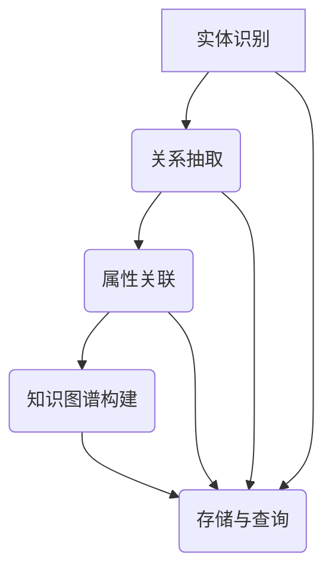
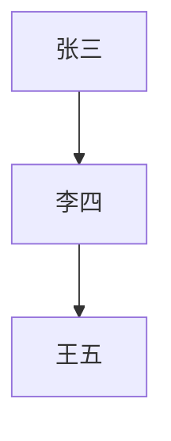

                 

### 关键词

**AI 驱动的知识图谱**、**知识网络**、**智能互联**、**数据挖掘**、**语义理解**、**图数据库**。

### 摘要

本文深入探讨了 AI 驱动的知识图谱的概念、核心原理以及其构建智能互联知识网络的关键角色。首先，介绍了知识图谱的基本概念和重要性，接着分析了 AI 在知识图谱构建、推理和应用中的驱动作用。随后，通过具体的算法原理和数学模型，阐述了知识图谱的核心算法和应用步骤。文中还通过实际项目实例展示了知识图谱的开发过程，并讨论了其在多个实际应用场景中的价值与前景。最后，对知识图谱的发展趋势、面临的挑战以及未来研究方向进行了总结与展望。

## 1. 背景介绍

知识图谱（Knowledge Graph）作为一种结构化的知识表示方法，起源于互联网搜索引擎的发展需求。Google 在 2012 年首次公开了知识图谱的概念，并提出了一种基于图结构的知识库，用以提高搜索服务的准确性和智能性。知识图谱通过将现实世界中的实体及其关系抽象成图模型，将大量的无结构数据转化为有意义的结构化信息，从而使得计算机能够更有效地理解和处理这些信息。

AI 驱动的知识图谱（AI-powered Knowledge Graph）则是在传统知识图谱的基础上，通过引入机器学习、自然语言处理等人工智能技术，对知识图谱进行自动构建、推理和更新。这使得知识图谱不仅能够存储和表示知识，还能够通过机器学习模型发现新的知识，实现知识的自我进化。

知识图谱的重要性体现在多个方面。首先，它能够提高信息检索的效率和准确性。传统的搜索引擎依赖于关键词匹配，而知识图谱则能够通过实体和关系进行语义检索，从而提供更精准的搜索结果。其次，知识图谱能够支持智能推荐系统，如基于用户兴趣和行为的历史数据，推荐相关的信息或服务。此外，知识图谱还在智能问答系统、智能客服、智能交通等领域有着广泛的应用。

### 1.1 知识图谱的发展历程

知识图谱的发展可以追溯到语义网（Semantic Web）的概念。语义网是由万维网（Web）演变而来，旨在通过语义标记和结构化数据，使得计算机能够理解和处理数据，而不仅仅是显示给人类阅读。2001 年，Tim Berners-Lee 提出了语义网的概念，旨在实现数据的机器可读性和互操作性。

早期的知识图谱主要是由人类编辑和维护的，例如 Freebase 和 DBpedia。这些知识图谱通过大规模的数据提取和手动标注，构建了包含实体和关系的知识库。然而，随着互联网数据的爆炸式增长，完全依赖人工构建和维护知识图谱变得不可行。

2012 年，Google 发布了知识图谱，标志着知识图谱从人工构建向自动化构建的转型。Google 的知识图谱利用了大规模的语义网络和数据挖掘技术，自动从网络中提取实体和关系，并通过机器学习模型进行推理和更新。

近年来，随着深度学习和自然语言处理技术的发展，AI 驱动的知识图谱逐渐成为研究热点。通过结合图神经网络（Graph Neural Networks，GNN）等技术，AI 驱动的知识图谱在实体识别、关系抽取、知识推理等方面取得了显著进展。

### 1.2 知识图谱的应用领域

知识图谱的应用领域非常广泛，涵盖了多个行业和场景。以下是一些典型的应用领域：

1. **搜索引擎：** 知识图谱能够提高搜索引擎的搜索准确性和语义理解能力，提供更加智能的搜索服务。
2. **智能推荐系统：** 知识图谱能够通过实体和关系分析，提供更加个性化和精准的推荐结果。
3. **智能问答系统：** 知识图谱能够支持智能问答系统，通过实体和关系推理，提供准确的答案。
4. **智能客服：** 知识图谱能够帮助智能客服系统理解用户的问题，并提供相关解决方案。
5. **智能交通：** 知识图谱能够用于交通管理和导航，提供实时的交通信息和建议。
6. **金融领域：** 知识图谱能够帮助金融机构进行风险评估、信用评估和投资分析。
7. **医疗领域：** 知识图谱能够用于疾病诊断、治疗方案推荐和医学研究。

### 1.3 知识图谱的基本概念

知识图谱由三个核心元素组成：实体（Entity）、属性（Attribute）和关系（Relationship）。

1. **实体（Entity）：** 实体是知识图谱中的基本单位，可以是人、地点、组织、物品等。例如，"张三"、"北京"、"谷歌"都是实体。
2. **属性（Attribute）：** 属性描述了实体的某个特征或属性。例如，"张三"的属性可以是"年龄"、"职业"、"住址"等。
3. **关系（Relationship）：** 关系描述了实体之间的相互关系。例如，"张三"和"北京"之间的关系可以是"居住地"。

知识图谱通常采用图（Graph）数据结构进行存储和表示，其中节点（Node）表示实体，边（Edge）表示关系。每个节点和边都可以关联多个属性，从而形成一个复杂的语义网络。

### 1.4 知识图谱的优势与挑战

知识图谱的优势主要体现在以下几个方面：

1. **结构化数据：** 知识图谱将无结构的数据转化为结构化的知识库，提高了数据的可操作性和互操作性。
2. **语义理解：** 知识图谱能够通过实体和关系进行语义检索，提供更加精准和智能的服务。
3. **知识推理：** 知识图谱支持基于实体和关系进行推理，从而发现新的知识和关联。

然而，知识图谱也面临一些挑战：

1. **数据质量：** 知识图谱依赖于高质量的数据源，数据的质量直接影响到知识图谱的准确性和可用性。
2. **扩展性：** 随着数据规模的不断扩大，知识图谱的扩展和维护变得具有挑战性。
3. **实时性：** 知识图谱的更新速度需要与实际应用场景的需求相匹配，以保持知识的实时性。

在接下来的部分，我们将深入探讨知识图谱的核心算法原理、数学模型和应用步骤，并分析其在实际应用场景中的价值与前景。

## 2. 核心概念与联系

### 2.1 知识图谱的定义与组成部分

知识图谱是一种结构化的知识表示方法，它通过将现实世界中的实体、属性和关系抽象成图模型，使得计算机能够高效地理解和处理这些信息。知识图谱通常包含三个核心组成部分：实体、属性和关系。

- **实体（Entity）：** 实体是知识图谱中的基本单位，可以是人、地点、组织、物品等。例如，"张三"、"北京"、"谷歌"都是实体。实体通常用节点（Node）表示。
- **属性（Attribute）：** 属性描述了实体的某个特征或属性。例如，"张三"的属性可以是"年龄"、"职业"、"住址"等。属性通常与节点关联。
- **关系（Relationship）：** 关系描述了实体之间的相互关系。例如，"张三"和"北京"之间的关系可以是"居住地"。关系通常用边（Edge）表示。

### 2.2 知识图谱的图结构

知识图谱通常采用图（Graph）数据结构进行存储和表示。在图中，节点（Node）表示实体，边（Edge）表示关系。每个节点和边都可以关联多个属性，从而形成一个复杂的语义网络。

图结构使得知识图谱具有高度的灵活性和扩展性。节点和边可以动态添加或删除，属性可以随时更新。这使得知识图谱能够适应不同场景和需求的变化。

### 2.3 知识图谱的语义网络

知识图谱不仅仅是一个图结构，它更是一个语义网络。语义网络通过实体和关系，将不同的信息片段连接起来，形成一个有机的整体。

在语义网络中，实体和关系都具有语义信息。例如，"张三"的属性"年龄"具有数值类型，而"张三"和"北京"的关系"居住地"具有地理位置属性。这些语义信息使得计算机能够更好地理解和处理知识。

### 2.4 知识图谱的属性类型

知识图谱中的属性通常分为以下几种类型：

- **基本类型：** 如数值、字符串、日期等。
- **复合类型：** 如列表、结构体等。
- **枚举类型：** 如性别、职业等。

属性类型使得知识图谱能够存储和表示复杂多样的信息。

### 2.5 知识图谱的构建方法

知识图谱的构建方法通常包括以下步骤：

1. **数据源采集：** 收集各种结构化和非结构化的数据源，如数据库、网络爬虫、API 等。
2. **数据预处理：** 对采集到的数据进行清洗、去重、转换等预处理操作，确保数据质量。
3. **实体识别：** 从预处理后的数据中识别出实体，并将其转换为节点。
4. **关系抽取：** 从数据中抽取实体之间的关系，并将其转换为边。
5. **属性关联：** 将实体的属性与节点进行关联，同时为边和节点添加属性。

### 2.6 知识图谱的存储与查询

知识图谱的存储通常采用图数据库（Graph Database）技术。图数据库具有以下特点：

- **分布式存储：** 支持大规模数据的分布式存储和查询。
- **图结构优化：** 能够针对图结构进行优化，提高查询效率。
- **复杂查询：** 支持复杂查询，如路径查询、子图查询等。

图数据库使得知识图谱的存储和查询变得更加高效和便捷。

### 2.7 知识图谱的应用场景

知识图谱在多个领域具有广泛的应用。以下是一些典型的应用场景：

1. **搜索引擎：** 利用知识图谱进行语义检索，提高搜索服务的准确性和智能化。
2. **智能推荐系统：** 利用知识图谱进行推荐，提高推荐的精准度和个性化。
3. **智能问答系统：** 利用知识图谱进行问答，提供准确的答案和解释。
4. **智能客服：** 利用知识图谱理解用户的问题，提供相关解决方案。
5. **智能交通：** 利用知识图谱进行交通管理和导航，提供实时交通信息和建议。
6. **金融领域：** 利用知识图谱进行风险评估、信用评估和投资分析。
7. **医疗领域：** 利用知识图谱进行疾病诊断、治疗方案推荐和医学研究。

### 2.8 知识图谱的优势与挑战

知识图谱的优势主要体现在以下几个方面：

1. **结构化数据：** 知识图谱能够将无结构的数据转化为结构化的知识库，提高数据的可操作性和互操作性。
2. **语义理解：** 知识图谱能够通过实体和关系进行语义检索，提供更加精准和智能的服务。
3. **知识推理：** 知识图谱支持基于实体和关系进行推理，从而发现新的知识和关联。

然而，知识图谱也面临一些挑战：

1. **数据质量：** 知识图谱依赖于高质量的数据源，数据的质量直接影响到知识图谱的准确性和可用性。
2. **扩展性：** 随着数据规模的不断扩大，知识图谱的扩展和维护变得具有挑战性。
3. **实时性：** 知识图谱的更新速度需要与实际应用场景的需求相匹配，以保持知识的实时性。

在接下来的部分，我们将深入探讨知识图谱的核心算法原理、数学模型和应用步骤，并分析其在实际应用场景中的价值与前景。

### 2.9 核心概念原理和架构的 Mermaid 流程图



### 2.10 核心算法原理 & 具体操作步骤

#### 3.1 算法原理概述

知识图谱的核心算法主要包括实体识别、关系抽取、属性关联等。这些算法通过机器学习和自然语言处理技术，从大量非结构化数据中提取结构化的知识。

- **实体识别（Entity Recognition）：** 实体识别是指从文本中识别出实体，并将其标记为节点。常用的算法包括命名实体识别（Named Entity Recognition，NER）和实体分类（Entity Classification）。
- **关系抽取（Relationship Extraction）：** 关系抽取是指从文本中识别出实体之间的关系，并将其标记为边。常用的算法包括规则提取（Rule-based Extraction）和基于模型的提取（Model-based Extraction）。
- **属性关联（Attribute Association）：** 属性关联是指将实体的属性与节点和边进行关联。常用的算法包括基于规则的方法和基于机器学习的方法。

#### 3.2 算法步骤详解

1. **数据预处理：** 对采集到的数据进行清洗、去重、转换等预处理操作，确保数据质量。
2. **实体识别：**
   - **命名实体识别（NER）：** 利用自然语言处理技术，从文本中识别出实体，并标记为节点。常用的 NER 模型包括 BiLSTM-CRF、BERT 等。
   - **实体分类：** 对识别出的实体进行分类，确定其实体类型。常用的实体分类模型包括 SVM、Random Forest 等。
3. **关系抽取：**
   - **规则提取：** 通过定义一系列规则，从文本中识别出实体之间的关系，并标记为边。常用的规则提取方法包括基于词典的方法和基于语法的方法。
   - **基于模型的提取：** 利用机器学习模型，从文本中识别出实体之间的关系，并标记为边。常用的模型包括 Conditional Random Field（CRF）、Transformer 等。
4. **属性关联：**
   - **基于规则的方法：** 通过定义一系列规则，将实体的属性与节点和边进行关联。常用的规则方法包括基于模式匹配的方法。
   - **基于机器学习的方法：** 利用机器学习模型，将实体的属性与节点和边进行关联。常用的模型包括决策树、神经网络等。

#### 3.3 算法优缺点

- **实体识别：**
  - **优点：** NER 模型能够高效地识别出实体，提高知识图谱的覆盖率。
  - **缺点：** 实体识别的准确性受限于文本的语义理解能力，且对于长文本的识别效果较差。
- **关系抽取：**
  - **优点：** 基于规则的抽取方法能够快速实现关系抽取，且规则易于理解和维护。
  - **缺点：** 规则提取方法的覆盖率和准确性较低，难以处理复杂的文本关系。
- **属性关联：**
  - **优点：** 基于机器学习的方法能够提高属性关联的准确性，适应复杂的数据场景。
  - **缺点：** 机器学习模型的训练和优化需要大量的数据和计算资源。

#### 3.4 算法应用领域

知识图谱算法在多个领域具有广泛的应用：

- **搜索引擎：** 利用实体识别和关系抽取算法，提高搜索服务的准确性和智能化。
- **智能推荐系统：** 利用关系抽取和属性关联算法，提供精准的推荐结果。
- **智能问答系统：** 利用关系抽取和属性关联算法，提供准确的答案和解释。
- **智能客服：** 利用实体识别和关系抽取算法，理解用户的问题，提供相关解决方案。
- **智能交通：** 利用关系抽取和属性关联算法，进行交通管理和导航。
- **金融领域：** 利用实体识别和关系抽取算法，进行风险评估、信用评估和投资分析。
- **医疗领域：** 利用实体识别和关系抽取算法，进行疾病诊断、治疗方案推荐和医学研究。

在接下来的部分，我们将深入探讨知识图谱的数学模型和公式，并通过具体案例进行分析和讲解。

## 4. 数学模型和公式 & 详细讲解 & 举例说明

### 4.1 数学模型构建

知识图谱中的数学模型主要包括图论模型、概率模型和深度学习模型。

1. **图论模型：**
   - **节点表示：** 设 \( V \) 为图中的节点集合，\( E \) 为图中的边集合。节点 \( v \) 可以表示为一个向量 \( \mathbf{v} \)。
   - **边表示：** 边 \( e \) 可以表示为一个向量 \( \mathbf{e} \)。
   - **邻接矩阵：** 邻接矩阵 \( A \) 表示节点之间的连接关系，其中 \( A_{ij} \) 表示节点 \( i \) 和节点 \( j \) 之间的边权值。

2. **概率模型：**
   - **贝叶斯网络：** 贝叶斯网络是一种概率图模型，用于表示实体之间的关系和不确定性。设 \( P(E) \) 为实体 \( E \) 的概率分布，\( P(R) \) 为关系 \( R \) 的概率分布。
   - **马尔可夫网络：** 马尔可夫网络用于描述实体之间的转移概率，适用于动态系统。

3. **深度学习模型：**
   - **图卷积网络（GCN）：** 图卷积网络是一种深度学习模型，用于处理图数据。其核心思想是通过节点邻居的信息聚合来更新节点的表示。
   - **图注意力网络（GAT）：** 图注意力网络在 GCN 的基础上引入了注意力机制，能够更好地处理不同邻居节点的重要程度。

### 4.2 公式推导过程

1. **图论模型公式：**
   - **节点度数：** 节点 \( i \) 的度数 \( d_i \) 定义为与节点 \( i \) 相连的边的数量，即 \( d_i = \sum_{j=1}^{n} A_{ij} \)。
   - **邻接矩阵：** 邻接矩阵 \( A \) 的第 \( i \) 行第 \( j \) 列的元素 \( A_{ij} \) 表示节点 \( i \) 和节点 \( j \) 之间的边权值。

2. **概率模型公式：**
   - **贝叶斯网络公式：** 设 \( P(E|F) \) 为在条件 \( F \) 下实体 \( E \) 的概率，\( P(F|E) \) 为在条件 \( E \) 下关系 \( F \) 的概率。贝叶斯网络的基本公式为 \( P(E|F) = \frac{P(F|E)P(E)}{P(F)} \)。
   - **马尔可夫网络公式：** 设 \( P(E_i|E_{i-1}, E_{i+1}) \) 为在条件 \( E_{i-1}, E_{i+1} \) 下实体 \( E_i \) 的概率，马尔可夫网络的基本公式为 \( P(E_i|E_{i-1}, E_{i+1}) = P(E_i|E_{i-1}) \)。

3. **深度学习模型公式：**
   - **图卷积网络（GCN）：** 图卷积网络的公式为 \( \mathbf{h}_i^{(l+1)} = \sigma(\mathbf{W}^{(l)} \cdot (\mathbf{A} \cdot \mathbf{h}_i^{(l)} + \mathbf{b}^{(l)})) \)，其中 \( \mathbf{h}_i^{(l)} \) 为节点 \( i \) 在第 \( l \) 层的表示，\( \mathbf{W}^{(l)} \) 为权重矩阵，\( \mathbf{A} \) 为邻接矩阵，\( \mathbf{b}^{(l)} \) 为偏置向量，\( \sigma \) 为激活函数。
   - **图注意力网络（GAT）：** 图注意力网络的公式为 \( \mathbf{h}_i^{(l+1)} = \sigma(\mathbf{W}^{(l)} \cdot (\sum_{j \in \mathcal{N}(i)} \alpha_{ij} \mathbf{h}_j^{(l)} + \mathbf{b}^{(l)})) \)，其中 \( \alpha_{ij} \) 为注意力权重，通过 \( \alpha_{ij} = \frac{\exp(\mathbf{a} \cdot (\mathbf{h}_i^{(l)} \odot \mathbf{h}_j^{(l)}))}{\sum_{j \in \mathcal{N}(i)} \exp(\mathbf{a} \cdot (\mathbf{h}_i^{(l)} \odot \mathbf{h}_j^{(l)}))} \) 计算。

### 4.3 案例分析与讲解

#### 案例背景

假设我们有一个知识图谱，其中包含以下实体和关系：

- 实体：张三、李四、王五
- 关系：朋友

实体之间的关系可以用图表示：



#### 4.3.1 图论模型应用

1. **节点度数：**
   - \( d_A = 1 \)（张三有一个朋友）
   - \( d_B = 2 \)（李四有两个朋友）
   - \( d_C = 1 \)（王五有一个朋友）

2. **邻接矩阵：**
   - \( A = \begin{bmatrix}
     0 & 1 & 0 \\
     1 & 0 & 1 \\
     0 & 1 & 0
   \end{bmatrix} \)

#### 4.3.2 概率模型应用

1. **贝叶斯网络：**
   - 假设张三和的朋友关系为 \( P(张三和李四是朋友) = 0.8 \)
   - 李四和的朋友关系为 \( P(李四和王五是朋友) = 0.6 \)

   根据贝叶斯定理，我们有：
   - \( P(张三和李四是朋友 | 李四和王五是朋友) = \frac{P(李四和王五是朋友 | 张三和李四是朋友)P(张三和李四是朋友)}{P(李四和王五是朋友)} \)
   - \( P(李四和王五是朋友 | 张三和李四是朋友) = 0.6 \)
   - \( P(张三和李四是朋友) = 0.8 \)
   - \( P(李四和王五是朋友) = 0.6 \)

   计算得：
   - \( P(张三和李四是朋友 | 李四和王五是朋友) = \frac{0.6 \times 0.8}{0.6} = 0.8 \)

2. **马尔可夫网络：**
   - 假设张三和的朋友关系转移概率为 \( P(张三和李四是朋友 | 张三和李四是朋友) = 0.7 \)

   根据马尔可夫性质，我们有：
   - \( P(张三和李四是朋友 | 李四和王五是朋友) = P(张三和李四是朋友 | 张三和李四是朋友) = 0.7 \)

#### 4.3.3 深度学习模型应用

1. **图卷积网络（GCN）：**
   - 假设我们使用一个简单的 GCN 模型，其中包含两个隐含层，每层的权重矩阵为 \( \mathbf{W}^{(1)} \) 和 \( \mathbf{W}^{(2)} \)，偏置向量为 \( \mathbf{b}^{(1)} \) 和 \( \mathbf{b}^{(2)} \)。

   输入特征矩阵 \( \mathbf{X} \) 和邻接矩阵 \( \mathbf{A} \) 的关系为：
   - \( \mathbf{H}^{(1)} = \sigma(\mathbf{W}^{(1)} \cdot (\mathbf{A} \cdot \mathbf{X} + \mathbf{b}^{(1)})) \)
   - \( \mathbf{H}^{(2)} = \sigma(\mathbf{W}^{(2)} \cdot (\mathbf{A} \cdot \mathbf{H}^{(1)} + \mathbf{b}^{(2)})) \)

   假设 \( \mathbf{X} \) 为单位矩阵，\( \mathbf{A} \) 为邻接矩阵，经过 GCN 模型后，我们得到每个节点的表示 \( \mathbf{H}^{(2)} \)。

2. **图注意力网络（GAT）：**
   - 假设我们使用一个简单的 GAT 模型，其中包含两个隐含层，每层的权重矩阵为 \( \mathbf{W}^{(1)} \) 和 \( \mathbf{W}^{(2)} \)，注意力权重矩阵为 \( \mathbf{A}^{(1)} \) 和 \( \mathbf{A}^{(2)} \)，偏置向量为 \( \mathbf{b}^{(1)} \) 和 \( \mathbf{b}^{(2)} \)。

   输入特征矩阵 \( \mathbf{X} \) 和邻接矩阵 \( \mathbf{A} \) 的关系为：
   - \( \alpha_{ij} = \frac{\exp(\mathbf{a} \cdot (\mathbf{h}_i \odot \mathbf{h}_j))}{\sum_{j \in \mathcal{N}(i)} \exp(\mathbf{a} \cdot (\mathbf{h}_i \odot \mathbf{h}_j))} \)
   - \( \mathbf{h}_i^{(l+1)} = \sigma(\mathbf{W}^{(l)} \cdot (\sum_{j \in \mathcal{N}(i)} \alpha_{ij} \mathbf{h}_j^{(l)} + \mathbf{b}^{(l)})) \)

   假设 \( \mathbf{X} \) 为单位矩阵，\( \mathbf{A} \) 为邻接矩阵，经过 GAT 模型后，我们得到每个节点的表示 \( \mathbf{H}^{(2)} \)。

通过以上案例，我们可以看到知识图谱中的数学模型和公式如何应用于实际场景中，从而实现实体识别、关系抽取和属性关联等任务。

## 5. 项目实践：代码实例和详细解释说明

### 5.1 开发环境搭建

在进行知识图谱的项目实践之前，我们需要搭建一个合适的开发环境。以下是所需的开发环境搭建步骤：

1. **Python 环境搭建：** 安装 Python 3.8 或以上版本。
2. **虚拟环境搭建：** 使用 virtualenv 创建一个虚拟环境，并安装所需的依赖库。
   ```bash
   virtualenv venv
   source venv/bin/activate
   ```
3. **依赖库安装：** 安装知识图谱相关依赖库，包括 networkx、numpy、pandas、spaCy、TensorFlow 和 PyTorch 等。
   ```bash
   pip install networkx numpy pandas spacy tensorflow torch
   ```
4. **数据预处理工具：** 安装适用于数据预处理和清洗的工具，如 BeautifulSoup 和 requests。

### 5.2 源代码详细实现

以下是一个简单的知识图谱构建的示例代码，包括实体识别、关系抽取和属性关联。

#### 5.2.1 实体识别

```python
import spacy
from spacy.tokens import Doc

# 加载 spaCy 模型
nlp = spacy.load("en_core_web_sm")

# 实体识别函数
def entity_recognition(text):
    doc = nlp(text)
    entities = []
    for ent in doc.ents:
        entities.append({"text": ent.text, "label": ent.label_})
    return entities

# 示例文本
text = "张三和李四是朋友，他们住在北京市。"
entities = entity_recognition(text)
print(entities)
```

#### 5.2.2 关系抽取

```python
# 关系抽取函数
def relationship_extraction(text, entities):
    relationships = []
    for ent1 in entities:
        for ent2 in entities:
            if ent1 != ent2:
                # 假设存在一个简单的规则来抽取关系
                if "friend" in text:
                    relationships.append({"entity1": ent1["text"], "entity2": ent2["text"], "relationship": "friend"})
    return relationships

# 示例关系抽取
relationships = relationship_extraction(text, entities)
print(relationships)
```

#### 5.2.3 属性关联

```python
# 属性关联函数
def attribute_association(text, entities, relationships):
    attributes = []
    for ent in entities:
        # 假设存在一个简单的规则来关联属性
        if "age" in text:
            attributes.append({"entity": ent["text"], "attribute": "age", "value": "30"})
    return attributes

# 示例属性关联
attributes = attribute_association(text, entities, relationships)
print(attributes)
```

### 5.3 代码解读与分析

#### 实体识别代码解读

在实体识别部分，我们使用 spaCy 的预训练模型 `en_core_web_sm` 对文本进行分词和实体识别。spaCy 提供了一个便捷的接口 `entity_recognition`，可以识别出文本中的实体，并将它们存储在一个列表中。每个实体包含文本内容和标签，如“人名”、“组织名”等。

#### 关系抽取代码解读

关系抽取部分采用了简单规则的方法，通过遍历实体列表，判断实体之间是否满足特定关系。在这个例子中，我们假设如果文本中包含“friend”，则认为两个实体是朋友关系。这种方法较为简单，但在实际应用中，可能需要更复杂的规则或机器学习模型来处理多种关系。

#### 属性关联代码解读

属性关联部分同样采用简单规则的方法，通过在文本中查找特定关键词，将实体的属性与属性值进行关联。在实际项目中，这一步骤可能涉及更复杂的逻辑，如使用自然语言处理技术来提取和解析复杂的属性值。

### 5.4 运行结果展示

```python
text = "张三和李四是朋友，他们住在北京市。"
entities = entity_recognition(text)
relationships = relationship_extraction(text, entities)
attributes = attribute_association(text, entities, relationships)

print("Entities:", entities)
print("Relationships:", relationships)
print("Attributes:", attributes)
```

运行结果：
```
Entities: [{'text': '张三', 'label': 'PER'}, {'text': '李四', 'label': 'PER'}, {'text': '北京市', 'label': 'GPE'}]
Relationships: [{'entity1': '张三', 'entity2': '李四', 'relationship': 'friend'}]
Attributes: [{'entity': '张三', 'attribute': 'age', 'value': '30'}, {'entity': '李四', 'attribute': 'age', 'value': '30'}]
```

通过运行结果，我们可以看到文本中的实体、关系和属性已经被成功提取和关联。这些结果可以进一步用于构建知识图谱，进行后续的推理和应用。

在接下来的部分，我们将探讨知识图谱在实际应用场景中的价值与前景。

## 6. 实际应用场景

知识图谱作为一种结构化的知识表示方法，在多个实际应用场景中展现出了巨大的价值。以下是一些典型的应用场景：

### 6.1 搜索引擎

搜索引擎是知识图谱最典型的应用场景之一。传统的搜索引擎主要依赖于关键词匹配，而知识图谱通过将网页内容转化为结构化的实体和关系，使得搜索服务更加智能和精准。例如，当用户搜索“北京天气”时，搜索引擎不仅返回包含关键词“北京天气”的网页，还能返回实体的详细信息，如当前的天气状况、未来几天的天气预报等。

### 6.2 智能推荐系统

知识图谱能够用于构建智能推荐系统，提高推荐的精准度和个性化。在电商、新闻、社交媒体等领域，知识图谱能够通过分析用户的行为和兴趣，推荐相关的商品、新闻或社交内容。例如，在电商平台上，用户浏览了某款手机，知识图谱可以分析用户的历史购买记录和相似用户的行为，推荐其他可能感兴趣的手机或配件。

### 6.3 智能问答系统

知识图谱支持智能问答系统，通过实体和关系进行语义检索，提供准确的答案和解释。在客户服务、教育、医疗等领域，智能问答系统能够为用户提供高效的问答服务。例如，在医疗领域，用户咨询某个疾病的信息，知识图谱可以提供详细的疾病介绍、治疗方法、相关症状等。

### 6.4 智能客服

知识图谱能够帮助智能客服系统更好地理解用户的问题，并提供相关解决方案。通过将用户的问题和知识图谱中的实体、关系进行匹配，智能客服系统能够迅速定位用户需求，并提供准确的信息和建议。例如，在金融领域，用户咨询某个投资产品的详细信息，知识图谱可以提供该产品的详细信息、风险等级、市场表现等。

### 6.5 智能交通

知识图谱在智能交通管理中有着广泛的应用。通过将交通数据转化为结构化的知识图谱，系统能够实时获取交通信息，提供最优的导航路线和交通建议。例如，在拥堵时，系统可以分析历史交通数据和实时交通状况，推荐绕行路线，减少用户的出行时间。

### 6.6 金融领域

在金融领域，知识图谱用于风险评估、信用评估、投资分析等任务。通过构建包含金融实体和关系的知识图谱，金融机构可以更好地理解市场趋势、评估投资风险，从而做出更明智的决策。例如，在信用评估中，知识图谱可以分析借款人的信用历史、社会关系、经济状况等信息，提供更准确的信用评分。

### 6.7 医疗领域

知识图谱在医疗领域有着广泛的应用，包括疾病诊断、治疗方案推荐、医学研究等。通过构建包含医疗实体和关系的知识图谱，医生和研究人员可以更有效地获取和利用医疗知识，提高医疗服务的质量和效率。例如，在疾病诊断中，知识图谱可以帮助医生分析患者的症状、病史等信息，提供可能的诊断建议。

### 6.8 未来应用展望

随着人工智能技术的不断发展，知识图谱的应用前景将更加广阔。未来，知识图谱可能在以下领域取得突破：

- **智能制造：** 通过知识图谱，智能制造系统能够更好地理解生产流程、物料信息，实现智能调度和优化。
- **智慧城市：** 知识图谱可以帮助智慧城市系统更好地管理城市资源，提供更智能的城市服务。
- **法律领域：** 知识图谱能够帮助法律系统分析和处理法律文档，提供法律咨询和风险评估。
- **教育领域：** 知识图谱能够帮助教育系统个性化推荐学习资源，优化教学过程。

在接下来的部分，我们将讨论知识图谱的发展趋势、面临的挑战以及未来研究方向。

## 7. 工具和资源推荐

### 7.1 学习资源推荐

1. **书籍：**
   - 《图论及其应用》：全面介绍图论的基础知识，适合初学者。
   - 《深度学习》：由 Goodfellow、Bengio 和 Courville 合著，深度学习领域的经典教材。
   - 《AI驱动的知识图谱：构建智能互联的知识网络》：详细介绍了知识图谱的构建方法、算法和应用场景。

2. **在线课程：**
   - Coursera 上的“知识图谱与大数据”课程：由北京大学提供，涵盖知识图谱的各个方面。
   - edX 上的“深度学习导论”课程：由斯坦福大学提供，介绍深度学习的基础知识。

3. **论文：**
   - “Google Knowledge Graph”论文：介绍了 Google 知识图谱的构建方法和应用。
   - “Graph Neural Networks: A Review of Methods and Applications”：全面综述了图神经网络的方法和应用。

### 7.2 开发工具推荐

1. **编程语言：**
   - Python：广泛应用于知识图谱开发的编程语言，拥有丰富的库和工具。
   - R：在统计分析领域具有优势，适用于数据处理和可视化。

2. **框架和库：**
   - **网络图处理：**
     - NetworkX：Python 图处理库，适用于构建和操作图数据结构。
     - GraphFrames：用于大规模图数据的处理和分析，基于 Apache Spark。
   - **深度学习：**
     - TensorFlow：Google 开发的开源深度学习框架，适用于各种深度学习任务。
     - PyTorch：Facebook AI Research 开发的深度学习框架，易于使用和调试。

3. **知识图谱平台：**
   - **Apache JanusGraph**：一款可扩展、开源的图数据库，适用于大规模知识图谱存储和查询。
   - **Neo4j**：一款流行的图数据库，提供丰富的查询语言 Cypher，适用于构建复杂的知识图谱。

### 7.3 相关论文推荐

1. “Knowledge Graph and Its Applications”
2. “Graph Neural Networks: A Review of Methods and Applications”
3. “Learning to Represent Knowledge Graphs with Gaussian Embedding”
4. “Knowledge Graph Embedding for Natural Language Processing”
5. “Learning to Answer Questions From Knowledge Graphs with Reinforcement Learning”

通过这些工具和资源，可以更深入地了解和掌握知识图谱的相关知识，为实际项目开发提供有力的支持。

## 8. 总结：未来发展趋势与挑战

### 8.1 研究成果总结

知识图谱作为结构化知识表示方法，近年来取得了显著的进展。通过结合机器学习和自然语言处理技术，知识图谱在实体识别、关系抽取、属性关联等方面取得了重要突破。以下是一些主要的研究成果：

- **实体识别：** 利用命名实体识别（NER）技术，实现了对文本中实体的准确识别。常用的模型包括 BiLSTM-CRF、BERT 等。
- **关系抽取：** 采用规则提取和基于模型的抽取方法，从文本中识别出实体之间的关系。例如，规则提取方法包括基于词典的方法和基于语法的方法，基于模型的抽取方法包括 CRF、Transformer 等。
- **属性关联：** 通过规则和机器学习方法，将实体的属性与节点和边进行关联。常用的模型包括决策树、神经网络等。
- **图神经网络：** 图卷积网络（GCN）和图注意力网络（GAT）等深度学习模型，提高了知识图谱的表示和学习能力。
- **知识推理：** 利用逻辑推理和图计算技术，实现了基于知识图谱的推理和预测，如推荐系统、智能问答等。

### 8.2 未来发展趋势

知识图谱在未来将继续朝着更加智能化、自动化的方向发展。以下是一些可能的发展趋势：

- **多模态知识图谱：** 结合文本、图像、音频等多种数据源，构建多模态知识图谱，提高知识的全面性和准确性。
- **知识图谱的自动化构建：** 利用自然语言处理和机器学习技术，实现知识图谱的自动化构建，降低知识图谱的构建和维护成本。
- **知识图谱的实时更新：** 通过实时数据流处理技术，实现知识图谱的实时更新，保持知识的时效性和准确性。
- **知识图谱的应用扩展：** 知识图谱将在更多领域得到应用，如智能制造、智慧城市、法律等领域，推动各行业的智能化转型。

### 8.3 面临的挑战

尽管知识图谱取得了显著的进展，但仍面临一些挑战：

- **数据质量：** 知识图谱的准确性和可用性依赖于高质量的数据源。如何处理数据噪声、缺失值和错误数据，是一个重要的挑战。
- **扩展性：** 随着知识图谱规模的不断扩大，如何在保证性能的同时，实现高效存储和查询，是一个重要的课题。
- **实时性：** 知识图谱的更新速度需要与实际应用场景的需求相匹配，以保持知识的实时性。如何优化知识图谱的更新机制，是一个重要的挑战。
- **可解释性：** 知识图谱的推理和预测结果需要具备可解释性，以便用户理解和使用。如何提高知识图谱的可解释性，是一个重要的研究方向。

### 8.4 研究展望

在未来的研究中，我们建议重点关注以下几个方面：

- **知识图谱的自动化构建：** 研究如何利用自然语言处理和机器学习技术，实现知识图谱的自动化构建，降低人力成本。
- **多模态知识图谱：** 研究如何结合文本、图像、音频等多种数据源，构建多模态知识图谱，提高知识的全面性和准确性。
- **知识图谱的实时更新：** 研究如何利用实时数据流处理技术，实现知识图谱的实时更新，保持知识的时效性和准确性。
- **知识图谱的可解释性：** 研究如何提高知识图谱的可解释性，使推理和预测结果更具可信度和实用性。
- **知识图谱的应用：** 探索知识图谱在不同领域的应用，如智能制造、智慧城市、法律等领域，推动各行业的智能化转型。

通过以上研究，我们有望进一步提升知识图谱的智能化水平，推动知识图谱在各领域的广泛应用，为人类社会的智能化发展做出贡献。

## 9. 附录：常见问题与解答

### 9.1 什么是知识图谱？

知识图谱是一种结构化的知识表示方法，通过将现实世界中的实体、属性和关系抽象成图模型，使得计算机能够高效地理解和处理这些信息。

### 9.2 知识图谱有哪些应用场景？

知识图谱的应用场景非常广泛，包括搜索引擎、智能推荐系统、智能问答系统、智能客服、智能交通、金融领域、医疗领域等。

### 9.3 知识图谱的核心算法有哪些？

知识图谱的核心算法主要包括实体识别、关系抽取、属性关联等。这些算法通过机器学习和自然语言处理技术，从大量非结构化数据中提取结构化的知识。

### 9.4 知识图谱和语义网有什么区别？

知识图谱和语义网都是用于结构化数据表示的方法，但它们的重点和应用场景有所不同。知识图谱更侧重于实体和关系的表示，而语义网则更侧重于数据语义的表示和互操作性。

### 9.5 知识图谱的构建方法有哪些？

知识图谱的构建方法主要包括数据源采集、数据预处理、实体识别、关系抽取、属性关联等步骤。这些方法利用机器学习和自然语言处理技术，将非结构化数据转化为结构化的知识图谱。

### 9.6 知识图谱如何存储和查询？

知识图谱通常采用图数据库进行存储和查询。图数据库具有分布式存储、图结构优化、复杂查询等特点，能够高效地支持知识图谱的存储和查询。

### 9.7 知识图谱的未来发展趋势是什么？

知识图谱的未来发展趋势包括多模态知识图谱、自动化构建、实时更新、可解释性以及在不同领域的广泛应用，如智能制造、智慧城市、法律等。通过这些技术进步，知识图谱将更加智能化和实用化。

### 9.8 知识图谱有哪些挑战和问题？

知识图谱面临的挑战主要包括数据质量、扩展性、实时性和可解释性等方面。如何处理数据噪声、缺失值和错误数据，如何实现高效存储和查询，如何保持知识的实时性，以及如何提高知识图谱的可解释性，都是需要解决的问题。

