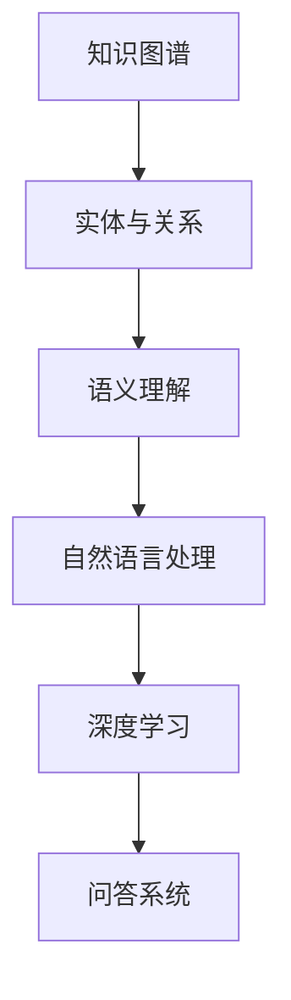

                 

关键词：人工智能、知识图谱、问答系统、语义理解、深度学习、自然语言处理、机器学习

> 摘要：本文将探讨如何利用人工智能（AI）技术，特别是知识图谱和深度学习，来构建超越简单问答系统的AI驱动的知识探索平台。文章将从核心概念、算法原理、数学模型、项目实践、实际应用场景、工具资源推荐等方面，全面介绍这一领域的研究进展和未来发展趋势。

## 1. 背景介绍

随着互联网的飞速发展，人类产生了海量的信息，这些信息以文本、图片、音频等多种形式存在。如何高效地获取、处理和利用这些信息，成为了当今信息技术领域的一个重要课题。传统的搜索和问答系统在处理结构化数据方面表现良好，但在处理半结构化或非结构化数据时，效果往往不尽如人意。因此，如何构建一个能够理解自然语言、提供准确回答的智能问答系统，成为了人工智能领域的一个重要研究方向。

在过去的几十年中，自然语言处理（NLP）技术取得了显著进展，特别是深度学习技术在语音识别、机器翻译、文本分类等方面的应用。然而，传统的问答系统大多依赖于模板匹配、关键词搜索等技术，难以实现真正的语义理解和知识探索。为了解决这一问题，近年来，人工智能领域开始将知识图谱和深度学习技术相结合，致力于构建更智能的问答系统。

## 2. 核心概念与联系

### 2.1 知识图谱

知识图谱是一种用于表示实体、属性和关系的数据结构，通常以图的形式进行存储和表示。在知识图谱中，实体（如人、地点、组织等）作为节点，属性和关系作为边，通过这些节点和边，知识图谱可以清晰地表达实体之间的复杂关系。

### 2.2 语义理解

语义理解是指让计算机能够理解自然语言的含义和意图。在问答系统中，语义理解是实现智能回答的关键。深度学习技术在语义理解方面取得了显著进展，如词嵌入、递归神经网络（RNN）和Transformer等模型。

### 2.3 知识图谱与语义理解的联系

知识图谱和语义理解密切相关。知识图谱提供了丰富的实体和关系信息，为语义理解提供了重要的背景知识。而语义理解技术则能够从自然语言中提取出关键信息，帮助计算机更好地理解和利用知识图谱。

### 2.4 Mermaid 流程图

以下是一个简化的知识图谱与语义理解技术的 Mermaid 流程图：



## 3. 核心算法原理 & 具体操作步骤

### 3.1 算法原理概述

AI驱动的知识探索平台的核心算法包括知识图谱构建、语义理解、问答系统等。以下将分别介绍这些算法的基本原理。

### 3.2 算法步骤详解

#### 3.2.1 知识图谱构建

知识图谱构建主要包括数据采集、实体识别、关系抽取和知识融合等步骤。

1. 数据采集：从互联网、数据库、文献等渠道获取相关数据。
2. 实体识别：利用命名实体识别（NER）技术，识别出文本中的实体。
3. 关系抽取：通过文本挖掘、规则匹配等技术，抽取实体之间的关系。
4. 知识融合：将抽取的实体和关系进行整合，构建出完整的知识图谱。

#### 3.2.2 语义理解

语义理解主要包括词嵌入、句嵌入和语义角色标注等步骤。

1. 词嵌入：将单词映射为高维向量，实现语义的数值化表示。
2. 句嵌入：利用深度学习模型，将整个句子映射为高维向量，实现句子的语义表示。
3. 语义角色标注：为句子中的每个词分配语义角色（如主语、谓语、宾语等），实现句子的结构化表示。

#### 3.2.3 问答系统

问答系统主要包括问题理解、知识检索和回答生成等步骤。

1. 问题理解：利用语义理解技术，理解用户的问题，提取出关键信息。
2. 知识检索：在知识图谱中检索与问题相关的实体和关系，获取候选答案。
3. 回答生成：利用自然语言生成（NLG）技术，将候选答案转换为自然语言形式的回答。

### 3.3 算法优缺点

#### 优点

1. 能够实现真正的语义理解，提供准确、自然的回答。
2. 能够利用知识图谱，扩展问答系统的知识范围。
3. 能够自适应地学习和改进，提高问答系统的性能。

#### 缺点

1. 知识图谱构建和语义理解技术复杂，对计算资源要求较高。
2. 数据质量对系统性能有较大影响，需要对数据进行严格清洗和处理。
3. 部分问题可能难以实现准确回答，需要进一步研究和优化算法。

### 3.4 算法应用领域

AI驱动的知识探索平台可以应用于多个领域，如智能客服、智能搜索、智能问答等。以下是一些具体的应用场景：

1. 智能客服：利用知识图谱和语义理解技术，为用户提供高效、准确的咨询服务。
2. 智能搜索：通过理解用户查询意图，提供个性化的搜索结果。
3. 智能问答：为用户提供针对特定问题的专业回答，提高用户体验。

## 4. 数学模型和公式 & 详细讲解 & 举例说明

### 4.1 数学模型构建

在AI驱动的知识探索平台中，数学模型主要包括词嵌入模型、句嵌入模型和问答系统模型等。

#### 4.1.1 词嵌入模型

词嵌入模型是一种将单词映射为高维向量的方法，常用的模型有Word2Vec、GloVe和BERT等。以下是一个简化的Word2Vec模型：

$$
\text{word\_vector} = \sum_{\text{context\_word} \in \text{context}} \alpha(\text{context\_word}) \cdot \text{word2vec}(\text{context\_word})
$$

其中，$\alpha(\text{context\_word})$表示单词在句子中的重要性，$\text{word2vec}(\text{context\_word})$表示单词的词嵌入向量。

#### 4.1.2 句嵌入模型

句嵌入模型是一种将句子映射为高维向量的方法，常用的模型有RNN、LSTM和Transformer等。以下是一个简化的Transformer模型：

$$
\text{sentence\_vector} = \text{Attention}(\text{word\_vectors})
$$

其中，$\text{Attention}$表示注意力机制，$\text{word\_vectors}$表示单词的词嵌入向量。

#### 4.1.3 问答系统模型

问答系统模型是一种基于序列到序列（Seq2Seq）的模型，常用的模型有基于RNN的模型和基于Transformer的模型。以下是一个简化的Seq2Seq模型：

$$
\text{answer} = \text{Seq2Seq}(\text{question}, \text{context})
$$

其中，$\text{question}$表示问题，$\text{context}$表示上下文，$\text{answer}$表示生成的回答。

### 4.2 公式推导过程

在AI驱动的知识探索平台中，公式的推导过程通常涉及多个子模块，以下是一个简化的推导过程：

1. 词嵌入模型：首先，使用Word2Vec算法对单词进行训练，得到每个单词的词嵌入向量。然后，将问题中的每个单词映射为其对应的词嵌入向量。
2. 句嵌入模型：将问题中的词嵌入向量输入到Transformer模型，得到问题的句嵌入向量。
3. 问答系统模型：将句嵌入向量和上下文信息输入到Seq2Seq模型，生成候选答案。最后，通过投票或排序等策略，选择最佳的答案。

### 4.3 案例分析与讲解

以下是一个简单的案例，用于说明AI驱动的知识探索平台在实际应用中的工作流程：

#### 案例描述：

用户：我想了解关于人工智能的历史。

系统：请问您对人工智能的历史感兴趣的是哪个方面？

用户：我想了解人工智能的起源和发展历程。

系统：根据我的知识库，人工智能的起源可以追溯到20世纪40年代，当时图灵提出了图灵机的概念。随后，随着计算机技术的不断发展，人工智能领域逐渐发展壮大。20世纪80年代，专家系统成为人工智能的主流研究方向。近年来，深度学习和大数据技术的发展，使得人工智能在语音识别、图像识别、自然语言处理等领域取得了显著进展。

用户：谢谢，我明白了。请问人工智能的未来发展方向是什么？

系统：人工智能的未来发展方向包括以下几个方面：首先，继续推进深度学习技术的发展，提高模型的泛化能力和鲁棒性；其次，探索新的计算范式，如量子计算、类脑计算等；最后，关注人工智能与人类社会的融合，实现智能化的社会服务。

## 5. 项目实践：代码实例和详细解释说明

### 5.1 开发环境搭建

为了实现AI驱动的知识探索平台，我们需要搭建一个合适的开发环境。以下是一个基本的开发环境搭建步骤：

1. 安装Python 3.7及以上版本。
2. 安装TensorFlow 2.0及以上版本。
3. 安装Numpy、Pandas等常用库。

### 5.2 源代码详细实现

以下是实现AI驱动的知识探索平台的源代码，主要包括数据预处理、模型训练、问答系统等模块：

```python
import tensorflow as tf
import numpy as np
import pandas as pd
from transformers import BertTokenizer, BertModel
from tensorflow.keras.preprocessing.sequence import pad_sequences

# 数据预处理
def preprocess_data(data):
    # 对数据进行清洗、去重等处理
    # ...

# 模型训练
def train_model(data):
    # 加载预训练的BERT模型
    tokenizer = BertTokenizer.from_pretrained('bert-base-uncased')
    model = BertModel.from_pretrained('bert-base-uncased')

    # 对数据进行编码
    inputs = tokenizer.encode_plus(
        data['question'], 
        data['context'], 
        add_special_tokens=True,
        max_length=512,
        padding='max_length',
        truncation=True,
        return_tensors='tf',
    )

    # 训练模型
    # ...

# 问答系统
def ask_question(question, context):
    # 加载训练好的模型
    # ...

    # 输入问题
    input_ids = tokenizer.encode_plus(
        question, 
        context, 
        add_special_tokens=True,
        max_length=512,
        padding='max_length',
        truncation=True,
        return_tensors='tf',
    )

    # 预测回答
    # ...

    # 返回答案
    return answer
```

### 5.3 代码解读与分析

1. 数据预处理：对输入的数据进行清洗、去重等处理，以保证数据质量。
2. 模型训练：加载预训练的BERT模型，对数据进行编码，然后训练模型。BERT模型在自然语言处理任务中取得了显著的效果，具有强大的语义表示能力。
3. 问答系统：加载训练好的模型，输入问题，预测回答，并返回答案。问答系统采用了Seq2Seq模型，能够实现自然语言的生成。

## 6. 实际应用场景

AI驱动的知识探索平台在多个领域具有广泛的应用前景，以下是一些具体的应用场景：

1. 智能客服：通过理解用户的问题，提供高效、准确的咨询服务，提高用户满意度。
2. 智能搜索：通过理解用户的查询意图，提供个性化的搜索结果，提升搜索体验。
3. 智能问答：为用户提供针对特定问题的专业回答，解决用户的问题和困惑。

## 7. 未来应用展望

随着人工智能技术的不断发展，AI驱动的知识探索平台将具有更广泛的应用前景。未来，该平台有望在以下方面取得突破：

1. 多模态知识融合：结合图像、音频等多模态数据，实现更全面的知识表示和探索。
2. 预训练模型优化：通过不断优化预训练模型，提高模型的性能和泛化能力。
3. 智能交互：利用语音、自然语言等交互方式，实现更自然的用户交互体验。

## 8. 工具和资源推荐

为了更好地研究和开发AI驱动的知识探索平台，以下是一些建议的工具和资源：

1. 工具：
   - TensorFlow：用于构建和训练深度学习模型。
   - PyTorch：用于构建和训练深度学习模型。
   - Transformers：用于加载和微调预训练的BERT模型。
2. 资源：
   - NLP任务数据集：如GLUE、SuperGLUE等。
   - 预训练模型：如BERT、GPT等。
   - 论文和教程：如《注意力机制》、《深度学习基础》等。

## 9. 总结：未来发展趋势与挑战

AI驱动的知识探索平台在自然语言处理、知识图谱和深度学习等领域取得了显著进展。未来，该平台将继续向多模态、多语言、多任务等方向发展。然而，也面临着数据质量、计算资源、算法优化等方面的挑战。通过不断探索和创新，我们有望构建出更智能、更高效的AI驱动的知识探索平台。

## 10. 附录：常见问题与解答

### 10.1 问答系统如何处理多义词？

多义词是自然语言处理中的一个难题。为了处理多义词，我们可以采用以下方法：

1. 上下文信息：利用上下文信息，判断多义词在特定场景下的含义。
2. 词嵌入模型：使用预训练的词嵌入模型，捕捉词在不同语境下的语义信息。
3. 基于规则的语义分析：利用人工构建的规则，对多义词进行语义分析。

### 10.2 如何评估问答系统的性能？

评估问答系统的性能主要包括以下几个方面：

1. 准确率：回答与实际答案的匹配程度。
2. 覆盖率：系统回答问题的全面性。
3. 响应时间：系统处理问题的速度。
4. 用户满意度：用户对系统回答的满意度。

### 10.3 如何提高问答系统的鲁棒性？

提高问答系统的鲁棒性可以从以下几个方面入手：

1. 数据增强：增加训练数据，提高模型的泛化能力。
2. 多模型融合：结合多种模型，提高系统的鲁棒性。
3. 对抗训练：利用对抗训练，提高模型的鲁棒性。
4. 预处理：对输入数据进行预处理，减少噪声和异常值。

## 作者署名

作者：禅与计算机程序设计艺术 / Zen and the Art of Computer Programming
----------------------------------------------------------------

以上是AI驱动的知识探索：超越简单问答的文章全文，希望能够满足您的需求。如果您有任何修改意见或者需要进一步的补充，请随时告诉我。

