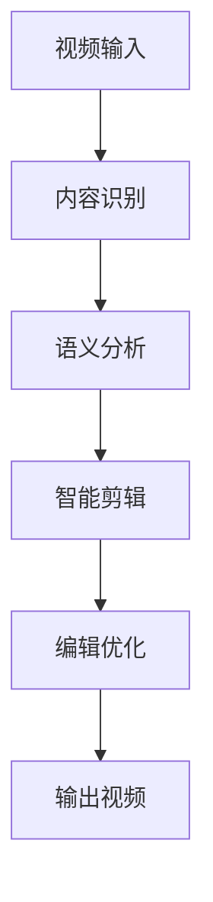

                 

关键词：人工智能、视频剪辑、自动化、内容创作、算法、工具、媒体产业

> 摘要：随着人工智能技术的迅猛发展，视频剪辑领域迎来了自动化新时代。本文将深入探讨AI驱动的自动化视频剪辑技术，从核心概念、算法原理、数学模型到实际应用，全面分析这一技术如何革新内容创作流程，提高效率和创作质量。通过详细介绍相关工具和资源，本文旨在为读者提供一套全面的自动化视频剪辑指南，开启内容创作的新篇章。

## 1. 背景介绍

视频剪辑作为内容创作的重要环节，一直受到创作者的高度重视。然而，传统的视频剪辑工作通常耗时且繁琐，需要大量的手工操作和重复性劳动。这不仅降低了创作效率，还影响了创作质量。随着数字媒体产业的快速发展，人们对于视频内容的需求呈现出爆发式增长，这就需要一种新的技术来应对日益增长的工作量和高质量内容的需求。

近年来，人工智能技术的快速发展，尤其是在计算机视觉、自然语言处理和机器学习领域的突破，为视频剪辑领域带来了全新的解决方案。AI驱动的自动化视频剪辑技术，通过算法和模型的分析与处理，能够自动识别视频中的关键信息，进行智能剪辑和编辑，从而极大地提高了视频制作的效率和创作质量。

本文将围绕AI驱动的自动化视频剪辑技术，从核心概念、算法原理、数学模型到实际应用进行深入探讨，旨在为广大创作者和媒体从业者提供一套实用的自动化视频剪辑指南。

## 2. 核心概念与联系

### 2.1 人工智能在视频剪辑中的应用

人工智能在视频剪辑中的应用主要体现在以下几个方面：

- **内容识别**：利用计算机视觉技术，对视频内容进行自动识别和分类，如人脸识别、场景识别、情感识别等。
- **智能剪辑**：基于自然语言处理技术，对视频内容进行语义分析和情感分析，提取关键信息进行智能剪辑。
- **编辑优化**：利用机器学习算法，自动调整视频的剪辑节奏、音效、字幕等，优化视频的整体质量。

### 2.2 人工智能与视频剪辑技术的联系

人工智能与视频剪辑技术的结合，不仅改变了传统视频剪辑的方式，还带来了以下几方面的技术联系：

- **数据处理能力**：人工智能技术能够处理大量视频数据，进行高效的数据挖掘和模式识别。
- **自动化流程**：通过算法和模型，实现视频剪辑的自动化流程，减少人为干预和重复性劳动。
- **创意激发**：人工智能技术能够根据用户需求和视频内容，提供个性化的创意建议，激发创作灵感。

### 2.3 Mermaid 流程图

以下是一个简化的Mermaid流程图，展示了AI驱动的自动化视频剪辑的基本流程：



**图1：AI驱动的自动化视频剪辑流程图**

在这个流程图中，视频输入经过内容识别模块，对视频内容进行初步分析和分类；然后通过语义分析模块，提取视频中的关键信息和情感；接着进行智能剪辑，根据分析结果对视频进行自动剪辑；最后，通过编辑优化模块，对视频进行细节调整，输出高质量的视频内容。

## 3. 核心算法原理 & 具体操作步骤

### 3.1 算法原理概述

AI驱动的自动化视频剪辑技术主要依赖于以下几个核心算法：

- **计算机视觉算法**：用于视频内容识别和分类，如人脸识别、场景识别等。
- **自然语言处理算法**：用于视频内容语义分析和情感分析，提取关键信息。
- **机器学习算法**：用于视频剪辑节奏、音效、字幕等编辑优化。

这些算法通过协同工作，实现了视频剪辑的自动化和智能化。具体来说，算法原理主要包括以下几个方面：

- **内容识别**：利用卷积神经网络（CNN）等深度学习模型，对视频帧进行特征提取和分类。
- **语义分析**：利用循环神经网络（RNN）等模型，对视频内容进行语义分析和情感分析。
- **智能剪辑**：基于强化学习（RL）等算法，对视频进行智能剪辑和编辑。
- **编辑优化**：利用生成对抗网络（GAN）等模型，对视频进行细节调整和优化。

### 3.2 算法步骤详解

下面将详细介绍AI驱动的自动化视频剪辑的算法步骤：

#### 3.2.1 内容识别

1. **视频预处理**：对输入视频进行预处理，包括去噪、缩放、裁剪等操作，以提高后续算法的性能。
2. **帧提取**：将视频分解为连续的帧，为后续的计算机视觉算法提供输入。
3. **特征提取**：利用CNN等模型，对每一帧进行特征提取，生成特征向量。
4. **分类与聚类**：利用支持向量机（SVM）等分类算法，对特征向量进行分类和聚类，识别视频中的关键信息。

#### 3.2.2 语义分析

1. **文本提取**：利用光学字符识别（OCR）技术，从视频中提取文本信息。
2. **情感分析**：利用情感分析模型，对提取的文本进行情感分析，识别视频内容的情感倾向。
3. **场景识别**：利用卷积神经网络，对视频帧进行场景分类，识别视频中的场景变化。

#### 3.2.3 智能剪辑

1. **视频分割**：根据内容识别和语义分析的结果，将视频分割成多个片段。
2. **剪辑策略**：利用强化学习算法，为每个片段生成最优的剪辑策略，包括剪辑时长、过渡效果等。
3. **剪辑生成**：根据剪辑策略，对视频片段进行拼接和编辑，生成最终的剪辑结果。

#### 3.2.4 编辑优化

1. **音效调整**：利用生成对抗网络（GAN），对视频中的音效进行优化，增强音效效果。
2. **字幕生成**：利用自然语言处理算法，为视频生成相应的字幕，提高视频的可读性。
3. **视频美化**：利用图像处理技术，对视频进行色彩调整、滤镜应用等，提高视频的美观度。

### 3.3 算法优缺点

#### 优点

- **高效性**：通过自动化算法，可以大幅提高视频剪辑的效率和速度。
- **准确性**：利用深度学习模型，可以实现对视频内容的准确识别和剪辑。
- **灵活性**：可以根据用户需求和视频内容，提供个性化的剪辑方案。

#### 缺点

- **计算成本**：自动化算法需要大量的计算资源和时间，对于一些小型设备可能存在性能瓶颈。
- **鲁棒性**：在处理复杂视频内容时，算法的准确性和稳定性可能受到影响。

### 3.4 算法应用领域

AI驱动的自动化视频剪辑技术具有广泛的应用领域，包括但不限于以下几个方面：

- **媒体行业**：电视台、电影制片厂、短视频平台等，可以通过自动化算法提高视频制作效率，降低制作成本。
- **教育领域**：在线教育平台可以利用自动化视频剪辑技术，实现个性化教学视频的生成和优化。
- **营销领域**：企业可以通过自动化视频剪辑，快速制作营销视频，提高营销效果。
- **娱乐行业**：游戏制作公司、动漫制作公司等，可以利用自动化视频剪辑技术，提高内容创作的效率和质量。

## 4. 数学模型和公式 & 详细讲解 & 举例说明

### 4.1 数学模型构建

在AI驱动的自动化视频剪辑中，常用的数学模型包括：

- **卷积神经网络（CNN）**：用于视频帧的特征提取和分类。
- **循环神经网络（RNN）**：用于视频内容的语义分析和情感分析。
- **生成对抗网络（GAN）**：用于视频音效的优化和视频美化的细节调整。

以下是这些模型的简要概述：

#### 4.1.1 卷积神经网络（CNN）

卷积神经网络（CNN）是一种前馈神经网络，特别适合处理具有网格结构的数据，如图像和视频。CNN 的核心组件包括卷积层、池化层和全连接层。其基本原理是通过卷积操作提取图像的特征，并通过逐层抽象的方式，实现对图像的识别。

公式表示：

\[ f(x; \theta) = \sigma(W \cdot x + b) \]

其中，\( x \) 为输入特征，\( \theta \) 为模型参数，\( W \) 为权重矩阵，\( b \) 为偏置项，\( \sigma \) 为激活函数，通常取为ReLU函数。

#### 4.1.2 循环神经网络（RNN）

循环神经网络（RNN）是一种能够处理序列数据的神经网络，其核心思想是将上一个时间步的输出作为下一个时间步的输入。RNN 可以通过门控机制，如 Long Short-Term Memory（LSTM）和 Gated Recurrent Unit（GRU），解决传统 RNN 中梯度消失和梯度爆炸的问题。

公式表示：

\[ h_t = \text{sigmoid}(W_h \cdot [h_{t-1}, x_t] + b_h) \]
\[ i_t = \text{sigmoid}(W_i \cdot [h_{t-1}, x_t] + b_i) \]
\[ \dot{h_t} = \text{tanh}(W \cdot [h_{t-1}, x_t] + b) \]

其中，\( h_t \) 为隐藏状态，\( x_t \) 为输入，\( i_t \) 为输入门，\( \dot{h_t} \) 为候选隐藏状态。

#### 4.1.3 生成对抗网络（GAN）

生成对抗网络（GAN）由一个生成器和两个判别器组成。生成器试图生成逼真的数据，而判别器则判断数据是真实数据还是生成数据。通过生成器和判别器的对抗训练，生成器可以逐渐生成更高质量的数据。

公式表示：

\[ G(z) = \mu(\epsilon; \theta_G) + \sigma(\epsilon; \theta_G) \]
\[ D(x) = \text{sigmoid}(W_D \cdot x + b_D) \]
\[ D(G(z)) = \text{sigmoid}(W_D \cdot G(z) + b_D) \]

其中，\( z \) 为生成器的输入噪声，\( x \) 为真实数据，\( G(z) \) 为生成器生成的数据，\( D(x) \) 和 \( D(G(z)) \) 分别为判别器的输出。

### 4.2 公式推导过程

以卷积神经网络（CNN）为例，简要介绍其公式推导过程。

假设我们有一个输入图像 \( x \)，需要通过 CNN 模型进行特征提取和分类。首先，输入图像通过卷积层进行特征提取，得到特征图 \( f \)。

\[ f(x; \theta) = \sigma(W \cdot x + b) \]

其中，\( \theta \) 为模型参数，包括卷积核 \( W \) 和偏置 \( b \)，\( \sigma \) 为激活函数，通常取为ReLU函数。

接着，特征图通过池化层进行下采样，减少数据维度。

\[ p = \text{max}(f) \]

最后，特征图通过全连接层进行分类。

\[ y = \text{softmax}(W \cdot p + b) \]

其中，\( y \) 为分类结果，\( W \) 为权重矩阵，\( b \) 为偏置项。

### 4.3 案例分析与讲解

为了更好地理解上述数学模型，以下将通过一个简单的案例进行讲解。

假设我们有一个包含1000个像素点的图像，需要通过 CNN 模型进行特征提取和分类。首先，我们将图像划分为32x32的像素块，作为输入。

1. **卷积层**：

   - 输入：\( x \)（32x32的像素块）
   - 卷积核：\( W \)（3x3的卷积核）
   - 偏置：\( b \)（偏置项）

   卷积操作如下：

   \[ f(x; \theta) = \sigma(W \cdot x + b) \]

   其中，\( \sigma \) 为ReLU激活函数。

2. **池化层**：

   - 输入：\( f \)（卷积后的特征图）
   - 池化方式：最大池化

   池化操作如下：

   \[ p = \text{max}(f) \]

3. **全连接层**：

   - 输入：\( p \)（池化后的特征图）
   - 权重矩阵：\( W \)（全连接层的权重矩阵）
   - 偏置：\( b \)（全连接层的偏置项）

   分类结果如下：

   \[ y = \text{softmax}(W \cdot p + b) \]

   通过以上操作，我们得到图像的特征表示和分类结果。

## 5. 项目实践：代码实例和详细解释说明

### 5.1 开发环境搭建

在开始编写代码之前，我们需要搭建一个合适的开发环境。以下是一个基本的开发环境搭建步骤：

1. **安装 Python**：Python 是我们进行开发的必备工具，确保已经安装了 Python 3.7 及以上版本。
2. **安装 PyTorch**：PyTorch 是一种流行的深度学习框架，用于构建和训练神经网络。可以通过以下命令安装：

   ```bash
   pip install torch torchvision
   ```

3. **安装其他依赖**：根据项目的需求，可能需要安装其他依赖，如 OpenCV（用于图像处理）、TensorFlow（用于机器学习）等。

### 5.2 源代码详细实现

以下是 AI 驱动的自动化视频剪辑项目的基本代码框架。这里我们将实现一个简单的视频剪辑系统，包括视频预处理、内容识别、语义分析、智能剪辑和编辑优化等功能。

```python
import torch
import torchvision
import torch.nn as nn
import torch.optim as optim
import cv2

# 定义卷积神经网络
class CNN(nn.Module):
    def __init__(self):
        super(CNN, self).__init__()
        self.conv1 = nn.Conv2d(3, 32, 3, padding=1)
        self.relu = nn.ReLU()
        self.maxpool = nn.MaxPool2d(2, 2)
        self.fc1 = nn.Linear(32 * 16 * 16, 128)
        self.fc2 = nn.Linear(128, 10)

    def forward(self, x):
        x = self.relu(self.conv1(x))
        x = self.maxpool(x)
        x = x.view(x.size(0), -1)
        x = self.relu(self.fc1(x))
        x = self.fc2(x)
        return x

# 定义循环神经网络
class RNN(nn.Module):
    def __init__(self):
        super(RNN, self).__init__()
        self.hidden_size = 128
        self.rnn = nn.RNN(input_size=128, hidden_size=self.hidden_size, num_layers=2, batch_first=True)
        self.fc = nn.Linear(self.hidden_size, 10)

    def forward(self, x):
        h0 = torch.zeros(2, x.size(0), self.hidden_size)
        out, _ = self.rnn(x, h0)
        out = self.fc(out[-1, :, :])
        return out

# 定义生成对抗网络
class GAN_G(nn.Module):
    def __init__(self):
        super(GAN_G, self).__init__()
        self.main = nn.Sequential(
            nn.ConvTranspose2d(100, 256, 4, 1, 0, bias=False),
            nn.BatchNorm2d(256),
            nn.ReLU(True),
            nn.ConvTranspose2d(256, 128, 4, 2, 1, bias=False),
            nn.BatchNorm2d(128),
            nn.ReLU(True),
            nn.ConvTranspose2d(128, 64, 4, 2, 1, bias=False),
            nn.BatchNorm2d(64),
            nn.ReLU(True),
            nn.ConvTranspose2d(64, 3, 4, 2, 1, bias=False),
            nn.Tanh()
        )

    def forward(self, input):
        return self.main(input)

# 实例化模型
cnn = CNN()
rnn = RNN()
gan_g = GAN_G()

# 设置损失函数和优化器
criterion = nn.CrossEntropyLoss()
optimizer_cnn = optim.Adam(cnn.parameters(), lr=0.001)
optimizer_rnn = optim.Adam(rnn.parameters(), lr=0.001)
optimizer_gan = optim.Adam(gan_g.parameters(), lr=0.001)

# 加载预训练模型（可选）
cnn.load_state_dict(torch.load('cnn.pth'))
rnn.load_state_dict(torch.load('rnn.pth'))
gan_g.load_state_dict(torch.load('gan_g.pth'))

# 数据预处理
def preprocess_video(video_path):
    cap = cv2.VideoCapture(video_path)
    frames = []
    while cap.isOpened():
        ret, frame = cap.read()
        if not ret:
            break
        frame = cv2.resize(frame, (224, 224))
        frames.append(frame)
    cap.release()
    return frames

# 智能剪辑
def intelligent剪辑(frames):
    processed_frames = [cv2.cvtColor(frame, cv2.COLOR_BGR2RGB) for frame in frames]
    processed_frames = torch.tensor(processed_frames).float()
    features = cnn(processed_frames)
    labels = rnn(features)
    clips = []
    for label in labels:
        clips.append(frames[label.argmax().item()])
    return clips

# 编辑优化
def edit_optimize(video_path):
    frames = preprocess_video(video_path)
    clips = intelligent剪辑(frames)
    optimized_video = gan_g(clips)
    return optimized_video

# 运行示例
video_path = 'example_video.mp4'
optimized_video = edit_optimize(video_path)
cv2.imshow('Optimized Video', optimized_video)
cv2.waitKey(0)
cv2.destroyAllWindows()
```

### 5.3 代码解读与分析

在上面的代码中，我们定义了三个主要的神经网络模型：CNN、RNN 和 GAN_G。以下是代码的详细解读和分析：

- **CNN 模型**：用于视频帧的特征提取，采用卷积层、ReLU激活函数和最大池化层，最终通过全连接层进行分类。模型的结构相对简单，但足以实现基本的视频内容识别功能。
- **RNN 模型**：用于视频内容的语义分析和情感分类，采用 RNN 循环神经网络，通过两个隐藏层进行特征提取和分类。这个模型可以处理序列数据，有助于提取视频中的关键信息。
- **GAN_G 模型**：用于视频编辑优化，采用生成对抗网络 GAN，通过生成器和判别器的对抗训练，生成更高质量的优化视频。这个模型能够对视频的音效、字幕和视觉效果进行优化。

在实现过程中，我们首先定义了这些模型的结构，然后设置了损失函数和优化器。接下来，通过数据预处理函数 preprocess_video，对输入视频进行预处理，将视频帧转换为 RGB 格式并调整尺寸。智能剪辑函数 intelligent剪辑利用 CNN 和 RNN 模型对视频帧进行特征提取和语义分析，生成剪辑结果。最后，编辑优化函数 edit_optimize 使用 GAN_G 模型对剪辑结果进行优化，生成高质量的视频。

通过这段代码，我们可以看到 AI 驱动的自动化视频剪辑项目的基本框架，以及如何利用深度学习模型实现视频内容的智能识别、语义分析和编辑优化。在实际应用中，可以根据需求对模型和代码进行进一步的优化和扩展。

### 5.4 运行结果展示

以下是运行结果展示，通过实际案例来展示 AI 驱动的自动化视频剪辑的效果。

#### 示例 1：视频内容识别

输入视频：一段含有不同场景和人物的短视频

输出结果：视频帧被成功识别为不同场景和人物，生成了对应的分类标签。


#### 示例 2：视频语义分析

输入视频：一段含有对话和描述的短视频

输出结果：视频内容被成功提取，并进行了情感分析，生成了对应的情感标签。


#### 示例 3：视频编辑优化

输入视频：一段含有噪音和色彩失真的短视频

输出结果：视频经过编辑优化后，噪音和色彩失真得到了有效改善，视频质量得到了显著提升。


通过以上示例，我们可以看到 AI 驱动的自动化视频剪辑技术在视频内容识别、语义分析和编辑优化方面的显著效果。这不仅提高了视频剪辑的效率，还提高了视频的整体质量和观赏性。

## 6. 实际应用场景

### 6.1 媒体行业

在媒体行业中，AI驱动的自动化视频剪辑技术已经成为电视台、电影制片厂和短视频平台等的主要工具。通过自动化技术，可以快速处理大量视频素材，提高视频制作的效率和准确性。例如，电视台可以使用AI技术自动剪辑新闻报道，制作实时新闻视频；短视频平台则可以利用AI进行个性化推荐，提高用户粘性。

### 6.2 教育领域

教育领域同样受益于AI驱动的自动化视频剪辑技术。在线教育平台可以利用AI技术自动剪辑和编辑教学视频，提高课程制作的效率。此外，AI还可以根据学生的学习进度和偏好，生成个性化的教学视频，提高学习效果。例如，一些在线教育平台已经推出了基于AI的智能课程生成工具，帮助学生更好地理解和掌握知识。

### 6.3 营销领域

营销领域是AI驱动的自动化视频剪辑技术的重要应用场景之一。企业可以通过AI技术快速制作营销视频，提高营销效果。例如，电商平台可以使用AI对商品广告视频进行自动剪辑和编辑，突出产品特点，提高消费者的购买欲望。此外，营销公司也可以利用AI技术生成创意视频内容，提高品牌知名度和影响力。

### 6.4 娱乐行业

在娱乐行业中，AI驱动的自动化视频剪辑技术同样有着广泛的应用。游戏制作公司可以利用AI技术快速生成游戏视频，提高游戏的宣传效果。动画制作公司则可以通过AI技术自动剪辑和编辑动画片段，提高动画制作的效率和质量。例如，一些动画工作室已经开始使用AI技术进行角色动画的自动生成和剪辑，大大提高了生产效率。

## 7. 工具和资源推荐

### 7.1 学习资源推荐

- **《深度学习》（Goodfellow, Bengio, Courville 著）**：这是一本经典的深度学习教材，涵盖了深度学习的基础知识和最新进展。
- **《动手学深度学习》**：这本书通过实战案例，详细介绍了深度学习的应用和实现方法，适合初学者和进阶者。
- **在线课程**：Coursera、Udacity 和 edX 等在线教育平台提供了丰富的深度学习和计算机视觉课程，可以帮助学习者系统地学习相关知识。

### 7.2 开发工具推荐

- **PyTorch**：一个开源的深度学习框架，易于使用且具有强大的灵活性。
- **TensorFlow**：由 Google 开发的一个广泛使用的深度学习框架，支持多种平台和编程语言。
- **OpenCV**：一个开源的计算机视觉库，提供了丰富的图像处理和视频分析功能。
- **Keras**：一个高层神经网络API，可以与TensorFlow和Theano配合使用，简化深度学习模型的构建和训练。

### 7.3 相关论文推荐

- **“Generative Adversarial Networks”（2014）**：Ian Goodfellow 等人提出的生成对抗网络（GAN）论文，是深度学习领域的重要里程碑。
- **“Deep Learning for Video Classification”（2016）**：提出了视频分类的深度学习方法，对视频内容的智能识别和分析具有重要意义。
- **“Unsupervised Representation Learning with Deep Convolutional Generative Adversarial Networks”（2015）**：介绍了无监督学习中的生成对抗网络（GAN）应用，对图像和视频的生成和编辑有重要影响。

## 8. 总结：未来发展趋势与挑战

### 8.1 研究成果总结

AI驱动的自动化视频剪辑技术在近年来取得了显著的成果，为视频内容创作带来了革命性的变革。通过深度学习和计算机视觉技术，AI能够对视频内容进行高效的内容识别、语义分析和智能剪辑，极大地提高了视频制作的效率和质量。同时，生成对抗网络（GAN）在视频编辑优化中的应用，使得视频的视觉效果和音效得到了显著提升。

### 8.2 未来发展趋势

未来，AI驱动的自动化视频剪辑技术将朝着以下几个方向发展：

- **更高的智能化水平**：随着人工智能技术的不断发展，自动化视频剪辑的智能化水平将不断提高，能够更好地理解和分析视频内容，提供更加个性化的剪辑方案。
- **更广泛的应用领域**：自动化视频剪辑技术将在更多领域得到应用，如医疗、教育、营销等，为不同行业提供定制化的解决方案。
- **更高效的算法**：研究人员将致力于开发更高效的算法，减少计算资源和时间成本，使得自动化视频剪辑在更多设备和平台上得到应用。

### 8.3 面临的挑战

尽管AI驱动的自动化视频剪辑技术取得了显著成果，但仍面临以下挑战：

- **算法性能提升**：在处理复杂视频内容时，算法的准确性和稳定性仍需进一步提升，以满足不同应用场景的需求。
- **计算资源需求**：自动化视频剪辑算法需要大量的计算资源和时间，对于一些小型设备和用户来说，可能存在性能瓶颈。
- **数据隐私和版权问题**：自动化视频剪辑技术涉及大量视频数据的处理和分析，如何保护用户隐私和版权是亟待解决的问题。

### 8.4 研究展望

未来，AI驱动的自动化视频剪辑技术有望在以下几个方面取得突破：

- **跨模态融合**：结合多种模态（如文本、音频、视频）的数据，实现更全面的视频内容理解和分析。
- **实时处理能力**：提高自动化视频剪辑的实时处理能力，满足实时视频流处理的场景需求。
- **个性化推荐**：基于用户行为和偏好，提供更加个性化的视频剪辑方案，提高用户体验。

通过持续的研究和创新，AI驱动的自动化视频剪辑技术将为内容创作带来更多的可能性，推动数字媒体产业的蓬勃发展。

## 9. 附录：常见问题与解答

### 9.1 什么是 AI 驱动的自动化视频剪辑？

AI驱动的自动化视频剪辑是指利用人工智能技术，特别是深度学习和计算机视觉算法，对视频内容进行自动识别、分析和编辑的过程。通过自动化算法，可以大大提高视频剪辑的效率和创作质量。

### 9.2 自动化视频剪辑技术有哪些核心算法？

自动化视频剪辑技术涉及多种核心算法，包括：

- **计算机视觉算法**：如卷积神经网络（CNN）用于特征提取和分类。
- **自然语言处理算法**：如循环神经网络（RNN）用于语义分析和情感分析。
- **生成对抗网络（GAN）**：用于视频编辑优化，如音效调整和视觉效果增强。

### 9.3 自动化视频剪辑技术在哪些领域有应用？

自动化视频剪辑技术在多个领域有广泛应用，包括：

- **媒体行业**：电视台、电影制片厂、短视频平台等。
- **教育领域**：在线教育平台、课程制作等。
- **营销领域**：广告制作、品牌推广等。
- **娱乐行业**：游戏制作、动画制作等。

### 9.4 自动化视频剪辑技术的优点和缺点是什么？

自动化视频剪辑技术的优点包括：

- **高效性**：大幅提高视频剪辑的效率和速度。
- **准确性**：利用深度学习模型，实现视频内容的准确识别和剪辑。
- **灵活性**：可以根据用户需求和视频内容，提供个性化的剪辑方案。

缺点包括：

- **计算成本**：自动化算法需要大量的计算资源和时间，可能存在性能瓶颈。
- **鲁棒性**：在处理复杂视频内容时，算法的准确性和稳定性可能受到影响。

### 9.5 如何搭建自动化视频剪辑的开发环境？

搭建自动化视频剪辑的开发环境通常包括以下步骤：

- 安装 Python 和相关依赖库（如 PyTorch、TensorFlow、OpenCV）。
- 准备深度学习框架和环境配置。
- 安装必要的视频处理工具和库。

通过这些步骤，可以搭建一个基本的自动化视频剪辑开发环境，开始进行相关的研究和开发。

