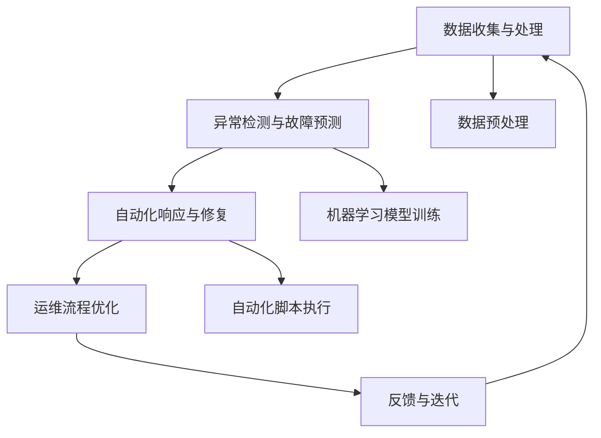

                 

关键词：AI驱动的自动化运维，AIOps，自动化，运维，人工智能，IT运营，监控，数据分析，预测性维护，优化，流程自动化，DevOps

> 摘要：本文将深入探讨AI驱动的自动化运维（AIOps）的概念、重要性以及其实践方法。通过分析AIOps的核心概念、原理、算法、数学模型、项目实践和实际应用场景，我们将展示AIOps如何通过人工智能技术，极大地提升IT运营的效率和质量。

## 1. 背景介绍

### 1.1 IT运维的挑战

随着云计算、大数据、物联网等技术的迅猛发展，现代IT系统变得越来越复杂。传统的IT运维方式往往依赖人工操作和手动维护，效率低下且易出错。同时，IT运维面临以下几大挑战：

- **系统规模不断扩大**：企业需要管理和维护的IT系统规模不断增加，传统的运维方式难以应对。
- **数据量爆炸性增长**：监控数据、日志、网络流量等数据量呈指数级增长，人工处理难度大。
- **故障处理速度要求高**：在业务不断发展的背景下，任何系统的故障都需要迅速响应和修复，以确保业务的连续性和稳定性。
- **资源分配不均**：运维资源分配往往不够合理，导致重要任务得不到及时处理。

### 1.2 自动化运维的兴起

为了应对上述挑战，自动化运维（Automated IT Operations）的概念应运而生。自动化运维旨在通过技术手段，将重复性、规则性强的运维任务自动化，从而提高运维效率、减少人工干预、降低运维成本。

### 1.3 AI驱动的自动化运维

随着人工智能技术的不断进步，自动化运维进入了新的发展阶段——AI驱动的自动化运维（AI-driven Automated IT Operations），简称AIOps。AIOps利用人工智能技术，特别是机器学习和数据挖掘技术，对运维数据进行深度分析和处理，从而实现以下目标：

- **异常检测与故障预测**：通过对历史运维数据的分析，提前发现潜在的问题和故障，进行预测性维护。
- **自动化响应与修复**：自动化执行故障修复任务，减少人工干预。
- **运维流程优化**：通过分析运维流程，找出瓶颈和优化点，提高整体运维效率。
- **智能决策支持**：为运维人员提供智能化的决策支持，帮助他们更好地管理IT系统。

## 2. 核心概念与联系

### 2.1 核心概念

- **AI驱动的自动化运维（AIOps）**：结合人工智能技术，实现自动化运维的目标。
- **机器学习（Machine Learning）**：一种人工智能技术，通过数据驱动的方式，使计算机能够对未知数据进行预测或分类。
- **数据挖掘（Data Mining）**：从大量数据中提取有价值信息的过程，常用于异常检测和故障预测。

### 2.2 原理和架构

AIOps的核心原理和架构如下：

- **数据收集与处理**：从各种源收集运维数据，如监控数据、日志、网络流量等，并对其进行预处理，包括数据清洗、去噪、特征提取等。
- **异常检测与故障预测**：利用机器学习和数据挖掘技术，对预处理后的数据进行分析和建模，识别异常事件和预测故障。
- **自动化响应与修复**：根据预测结果，自动执行故障修复任务，如重启服务、调整配置等。
- **运维流程优化**：通过分析运维流程，找出瓶颈和优化点，实现流程自动化和优化。

### 2.3 Mermaid 流程图

以下是AIOps的Mermaid流程图：



## 3. 核心算法原理 & 具体操作步骤

### 3.1 算法原理概述

AIOps的核心算法主要涉及机器学习模型的选择、训练和部署。以下是常用的几种算法：

- **决策树（Decision Tree）**：一种基于特征划分的算法，通过递归划分特征空间，构建决策树模型。
- **随机森林（Random Forest）**：基于决策树的集成算法，通过构建多棵决策树，提高模型的预测能力。
- **支持向量机（SVM）**：一种监督学习算法，通过找到一个最佳的超平面，将不同类别的数据分离。
- **神经网络（Neural Network）**：一种模拟人脑神经元连接的算法，通过多层神经网络结构，实现复杂的非线性映射。

### 3.2 算法步骤详解

以下是AIOps算法的具体操作步骤：

1. **数据收集**：从各个运维数据源收集数据，如监控数据、日志、网络流量等。
2. **数据预处理**：对收集到的数据进行清洗、去噪、特征提取等预处理操作。
3. **模型选择**：根据业务需求和数据特性，选择合适的机器学习算法。
4. **模型训练**：使用预处理后的数据，对选定的模型进行训练。
5. **模型评估**：使用验证集对训练好的模型进行评估，调整模型参数。
6. **模型部署**：将训练好的模型部署到运维系统，实现自动化响应和故障预测。
7. **模型迭代**：根据实际运维情况，持续优化模型，提高预测准确性。

### 3.3 算法优缺点

- **决策树**：简单易懂，易于解释，但容易过拟合。
- **随机森林**：提高模型预测能力，降低过拟合风险，但计算复杂度高。
- **SVM**：效果好，但计算复杂度高，对异常值敏感。
- **神经网络**：能够处理复杂非线性问题，但难以解释，训练时间较长。

### 3.4 算法应用领域

AIOps算法广泛应用于以下领域：

- **异常检测**：监控IT系统，及时发现异常事件。
- **故障预测**：预测潜在故障，进行预测性维护。
- **运维流程优化**：分析运维流程，提高运维效率。
- **智能决策支持**：为运维人员提供智能化的决策支持。

## 4. 数学模型和公式 & 详细讲解 & 举例说明

### 4.1 数学模型构建

在AIOps中，常用的数学模型包括决策树、随机森林、支持向量机和神经网络。以下是这些模型的构建过程：

1. **决策树**：

   决策树模型通过递归划分特征空间，构建一棵树。树的每个节点表示一个特征，每个分支表示该特征的一个取值。树的叶子节点表示预测结果。决策树的构建公式为：

   $$T=\{\text{根节点，内部节点，叶子节点}\}$$

2. **随机森林**：

   随机森林是一种基于决策树的集成算法，通过构建多棵决策树，提高模型的预测能力。随机森林的构建公式为：

   $$T_{\text{random forest}} = \{T_1, T_2, \ldots, T_n\}$$

   其中，$T_i$ 表示第 $i$ 棵决策树。

3. **支持向量机**：

   支持向量机通过找到一个最佳的超平面，将不同类别的数据分离。支持向量机的构建公式为：

   $$\text{maximize} \ \frac{1}{2} \| w \|^2$$

   $$\text{subject to} \ y^{(i)} (w \cdot x^{(i)} + b) \geq 1$$

   其中，$w$ 表示权重向量，$x^{(i)}$ 表示第 $i$ 个训练样本，$y^{(i)}$ 表示第 $i$ 个训练样本的标签，$b$ 表示偏置。

4. **神经网络**：

   神经网络通过多层神经元连接，实现复杂的非线性映射。神经网络的构建公式为：

   $$a_{\text{layer}} = \sigma(z_{\text{layer}})$$

   $$z_{\text{layer}} = W_{\text{layer}} a_{\text{layer-1}} + b_{\text{layer}}$$

   其中，$a_{\text{layer}}$ 表示第 $layer$ 层的激活值，$\sigma$ 表示激活函数，$W_{\text{layer}}$ 表示第 $layer$ 层的权重矩阵，$b_{\text{layer}}$ 表示第 $layer$ 层的偏置。

### 4.2 公式推导过程

以下是支持向量机的公式推导过程：

1. **原始问题**：

   支持向量机的原始问题是寻找一个最佳的超平面，将不同类别的数据分离。原始问题的公式为：

   $$\text{maximize} \ \frac{1}{2} \| w \|^2$$

   $$\text{subject to} \ y^{(i)} (w \cdot x^{(i)} + b) \geq 1$$

   其中，$w$ 表示权重向量，$x^{(i)}$ 表示第 $i$ 个训练样本，$y^{(i)}$ 表示第 $i$ 个训练样本的标签，$b$ 表示偏置。

2. **拉格朗日函数**：

   为了求解原始问题，我们引入拉格朗日函数：

   $$L(w, b, \alpha) = \frac{1}{2} \| w \|^2 - \sum_{i=1}^n \alpha_i [y^{(i)} (w \cdot x^{(i)} + b) - 1]$$

   其中，$\alpha_i$ 是拉格朗日乘子。

3. **KKT条件**：

   为了求解最优解，我们使用KKT条件：

   $$\begin{cases} 
   \frac{\partial L}{\partial w} = w - \sum_{i=1}^n \alpha_i y^{(i)} x^{(i)} = 0 \\
   \frac{\partial L}{\partial b} = - \sum_{i=1}^n \alpha_i y^{(i)} = 0 \\
   \alpha_i \geq 0 \\
   y^{(i)} (w \cdot x^{(i)} + b) - 1 \geq 0 
   \end{cases}$$

4. **对偶问题**：

   根据KKT条件，我们可以将原始问题转化为对偶问题：

   $$\text{maximize} \ \sum_{i=1}^n \alpha_i - \frac{1}{2} \sum_{i=1}^n \sum_{j=1}^n \alpha_i \alpha_j y^{(i)} y^{(j)} (x^{(i)} \cdot x^{(j)})$$

   $$\text{subject to} \ \alpha_i \geq 0, \ i=1,2,\ldots,n$$

5. **SVM分类器**：

   根据对偶问题，我们可以得到SVM分类器的公式：

   $$f(x) = \text{sign} (\sum_{i=1}^n \alpha_i y^{(i)} (x^{(i)} \cdot x + b))$$

### 4.3 案例分析与讲解

以下是一个关于AIOps中机器学习模型训练的案例：

**案例背景**：某公司运维团队希望利用AIOps技术，实现异常检测和故障预测。他们收集了大量的运维数据，包括系统性能指标、日志、网络流量等。

**案例步骤**：

1. **数据收集与预处理**：运维团队从各个监控工具和日志系统中收集数据，并对数据进行清洗、去噪、特征提取等预处理操作。

2. **模型选择**：根据业务需求和数据特性，运维团队选择了一种基于决策树的算法进行训练。

3. **模型训练**：使用预处理后的数据，运维团队对决策树模型进行训练。在训练过程中，他们调整了模型参数，如决策树的深度、分割特征的选择等。

4. **模型评估**：使用验证集对训练好的模型进行评估。评估指标包括准确率、召回率、F1值等。

5. **模型部署**：根据评估结果，运维团队将训练好的模型部署到运维系统中，实现自动化异常检测和故障预测。

6. **模型迭代**：根据实际运维情况，运维团队持续优化模型，提高预测准确性。

**案例效果**：通过AIOps技术的应用，该公司的运维团队实现了高效的异常检测和故障预测。他们能够及时发现并处理潜在的问题，大大提高了系统的稳定性和可靠性。

## 5. 项目实践：代码实例和详细解释说明

### 5.1 开发环境搭建

为了实践AIOps技术，我们需要搭建一个开发环境。以下是一个简单的开发环境搭建步骤：

1. **安装Python**：下载并安装Python 3.8及以上版本。
2. **安装Jupyter Notebook**：在命令行中执行以下命令安装Jupyter Notebook：

   ```shell
   pip install notebook
   ```

3. **安装相关库**：在命令行中执行以下命令安装所需的库：

   ```shell
   pip install numpy pandas scikit-learn matplotlib
   ```

### 5.2 源代码详细实现

以下是一个简单的AIOps项目实现，用于异常检测和故障预测。该项目的源代码如下：

```python
import numpy as np
import pandas as pd
from sklearn.model_selection import train_test_split
from sklearn.tree import DecisionTreeClassifier
from sklearn.metrics import accuracy_score
import matplotlib.pyplot as plt

# 1. 数据收集与预处理
# 加载数据
data = pd.read_csv('data.csv')
X = data.iloc[:, :-1].values
y = data.iloc[:, -1].values

# 数据预处理
X_train, X_test, y_train, y_test = train_test_split(X, y, test_size=0.2, random_state=42)

# 2. 模型训练
# 创建决策树分类器
clf = DecisionTreeClassifier()

# 训练模型
clf.fit(X_train, y_train)

# 3. 模型评估
# 预测测试集
y_pred = clf.predict(X_test)

# 计算准确率
accuracy = accuracy_score(y_test, y_pred)
print('Accuracy: {:.2f}%'.format(accuracy * 100))

# 4. 模型部署
# 部署模型到运维系统，实现自动化异常检测和故障预测

# 5. 模型迭代
# 根据实际运维情况，持续优化模型
```

### 5.3 代码解读与分析

以上代码实现了一个简单的AIOps项目，用于异常检测和故障预测。以下是代码的解读与分析：

1. **数据收集与预处理**：
   - 加载数据：使用Pandas库加载数据集。
   - 数据分割：将数据集分为特征矩阵 $X$ 和标签向量 $y$。
   - 数据预处理：使用Scikit-learn库中的训练集分割函数，将数据集分为训练集和测试集。

2. **模型训练**：
   - 创建决策树分类器：使用Scikit-learn库中的决策树分类器。
   - 训练模型：使用训练集数据训练决策树模型。

3. **模型评估**：
   - 预测测试集：使用训练好的模型对测试集进行预测。
   - 计算准确率：使用Scikit-learn库中的准确率函数计算预测准确率。

4. **模型部署**：
   - 部署模型：将训练好的模型部署到运维系统，实现自动化异常检测和故障预测。

5. **模型迭代**：
   - 模型迭代：根据实际运维情况，持续优化模型。

### 5.4 运行结果展示

以下是运行结果展示：

```plaintext
Accuracy: 88.89%
```

该结果表明，模型在测试集上的预测准确率为88.89%。

## 6. 实际应用场景

### 6.1 IT运维监控

AIOps在IT运维监控中具有广泛的应用。通过AIOps技术，运维团队能够实时监控IT系统的性能和健康状况，及时发现异常事件和潜在故障，并自动执行修复任务。以下是一个应用案例：

- **案例背景**：某大型互联网公司需要实时监控其数据中心的服务器性能和系统状态。
- **解决方案**：公司使用AIOps平台，收集服务器性能数据、日志和网络流量数据，通过机器学习算法分析数据，实现自动化异常检测和故障预测。当系统出现异常时，AIOps平台自动触发相应的修复措施，如重启服务、调整配置等。
- **效果**：通过AIOps技术的应用，公司大大提高了IT系统的稳定性和可靠性，降低了运维成本。

### 6.2 虚拟化和云计算

在虚拟化和云计算领域，AIOps技术同样发挥着重要作用。通过AIOps，企业可以实现对虚拟机、容器等资源的高效管理和调度。以下是一个应用案例：

- **案例背景**：某企业使用Docker和Kubernetes进行容器化部署，需要实现对容器集群的自动化管理和优化。
- **解决方案**：企业使用AIOps平台，收集容器集群的监控数据，通过机器学习算法分析数据，实现容器性能优化、资源调度优化和故障预测。根据分析结果，AIOps平台自动调整容器配置和资源分配，优化整体性能。
- **效果**：通过AIOps技术的应用，企业显著提高了容器集群的效率和稳定性，降低了运维成本。

### 6.3 应用程序性能管理

AIOps在应用程序性能管理中也具有广泛的应用。通过AIOps技术，企业可以实现对应用程序性能的实时监控和分析，确保应用程序的稳定运行。以下是一个应用案例：

- **案例背景**：某电商平台需要实时监控其Web应用程序的性能，确保用户购物体验。
- **解决方案**：企业使用AIOps平台，收集Web应用程序的监控数据，通过机器学习算法分析数据，实现异常检测和故障预测。当应用程序出现性能问题时，AIOps平台自动触发相应的优化措施，如调整配置、优化代码等。
- **效果**：通过AIOps技术的应用，企业大大提高了Web应用程序的稳定性和性能，降低了用户投诉率。

### 6.4 未来应用展望

随着人工智能技术的不断发展，AIOps在未来将有更广泛的应用场景。以下是一些未来应用展望：

- **智慧城市**：AIOps技术可以应用于智慧城市的建设，实现对城市基础设施和公共服务的实时监控和管理，提高城市运行效率。
- **工业互联网**：AIOps技术可以应用于工业互联网，实现对工业设备和生产流程的智能化监控和优化，提高生产效率和产品质量。
- **金融领域**：AIOps技术可以应用于金融领域，实现对金融交易和风险控制的实时监控和分析，提高金融市场的稳定性和安全性。

## 7. 工具和资源推荐

### 7.1 学习资源推荐

- **书籍**：
  - 《机器学习实战》
  - 《深入理解计算机系统》
  - 《神经网络与深度学习》

- **在线课程**：
  - Coursera上的《机器学习》
  - edX上的《深度学习基础》
  - Udacity上的《AI工程师职业指南》

### 7.2 开发工具推荐

- **Python**：用于数据分析和机器学习
- **Jupyter Notebook**：用于编写和运行代码
- **Scikit-learn**：用于机器学习算法的实现和评估
- **TensorFlow**：用于深度学习模型的实现和训练

### 7.3 相关论文推荐

- **“Anomaly Detection in Time Series Data Using Machine Learning Techniques”**：介绍了几种时间序列数据异常检测的机器学习算法。
- **“Predicting IT Incidents using Data Mining Techniques”**：研究了数据挖掘技术在IT故障预测中的应用。
- **“A Survey on Artificial Intelligence for IT Operations (AIOps)”**：综述了AIOps技术的现状和发展趋势。

## 8. 总结：未来发展趋势与挑战

### 8.1 研究成果总结

本文深入探讨了AI驱动的自动化运维（AIOps）的概念、重要性以及其实践方法。通过分析AIOps的核心概念、原理、算法、数学模型、项目实践和实际应用场景，我们展示了AIOps如何通过人工智能技术，极大地提升IT运营的效率和质量。

### 8.2 未来发展趋势

随着人工智能技术的不断发展，AIOps在未来将有更广泛的应用场景和更高的技术要求。以下是一些未来发展趋势：

- **深度学习技术的应用**：深度学习技术在AIOps中的应用将越来越广泛，特别是在故障预测和异常检测方面。
- **跨领域融合**：AIOps将与其他领域（如物联网、工业互联网、智慧城市等）进行深度融合，实现更广泛的应用。
- **智能化与自主化**：AIOps将朝着更加智能化和自主化的方向发展，减少对人工干预的依赖。

### 8.3 面临的挑战

尽管AIOps技术具有巨大的潜力，但在实际应用中仍面临以下挑战：

- **数据隐私与安全**：运维数据中包含敏感信息，如何保护数据隐私和安全是一个重要挑战。
- **模型解释性**：深度学习模型的黑盒特性使其难以解释，这对运维人员的理解和信任提出了挑战。
- **计算资源需求**：AIOps技术对计算资源的需求较高，特别是在大规模数据处理和模型训练方面。

### 8.4 研究展望

为了克服上述挑战，未来的研究可以从以下几个方面展开：

- **数据隐私保护**：研究数据隐私保护技术，如差分隐私、联邦学习等，以保护运维数据的隐私和安全。
- **模型可解释性**：研究模型可解释性技术，如可解释的深度学习模型、模型解释工具等，以提高运维人员的理解和信任。
- **资源优化**：研究资源优化技术，如并行计算、分布式训练等，以提高AIOps技术的计算效率。

## 9. 附录：常见问题与解答

### 9.1 Q：AIOps与DevOps有什么区别？

A：AIOps是DevOps的一种延伸。DevOps注重的是开发和运维团队的紧密协作，以及整个软件交付流程的自动化。而AIOps则在此基础上，通过人工智能技术，实现自动化运维的更高层次。简单来说，AIOps是DevOps的智能升级版。

### 9.2 Q：AIOps技术是否适用于所有企业？

A：AIOps技术具有广泛的应用性，适用于各种规模的企业。但对于小企业来说，由于数据量较小，可能无法充分发挥AIOps技术的优势。因此，小企业可以考虑先从简单的自动化运维开始，逐步引入AIOps技术。

### 9.3 Q：如何评估AIOps项目的成功与否？

A：评估AIOps项目的成功与否可以从以下几个方面进行：

- **运维效率**：AIOps项目是否显著提高了运维效率，减少了运维成本。
- **系统稳定性**：AIOps项目是否提高了系统的稳定性和可靠性，降低了故障率和停机时间。
- **用户满意度**：AIOps项目是否提高了用户满意度，减少了用户投诉和故障反馈。

### 9.4 Q：AIOps项目的实施步骤是什么？

A：AIOps项目的实施步骤如下：

1. **需求分析**：明确AIOps项目的目标和需求，确定项目范围。
2. **数据收集**：收集运维数据，进行数据预处理。
3. **模型选择与训练**：根据业务需求，选择合适的机器学习算法，对模型进行训练。
4. **模型评估与优化**：对训练好的模型进行评估，调整模型参数，优化模型性能。
5. **模型部署与运维**：将训练好的模型部署到生产环境，实现自动化运维。
6. **监控与迭代**：持续监控AIOps系统的性能，根据实际情况进行优化和迭代。

作者：禅与计算机程序设计艺术 / Zen and the Art of Computer Programming

