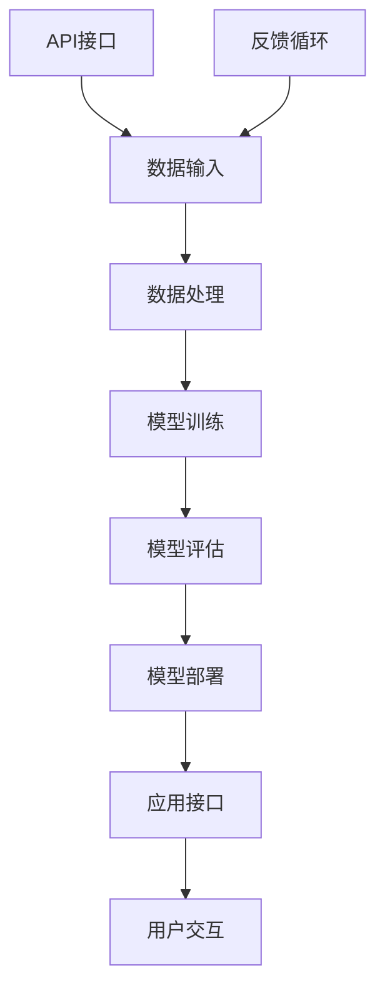

                 

 API化已经成为现代软件开发中不可或缺的一部分，尤其是在人工智能（AI）应用开发领域。通过API（应用程序编程接口），开发者可以轻松地集成和访问各种AI功能和服务，从而简化了开发流程，提高了开发效率和应用的灵活性。本文将深入探讨API化如何改变AI应用开发的现状，并提供一些实用的建议。

## 文章关键词

- API化
- AI应用开发
- 开发流程简化
- 效率提升
- 灵活性增强

## 文章摘要

本文首先介绍了API化的基本概念，然后探讨了它如何影响AI应用开发。通过实际案例，本文展示了API化如何简化开发流程，提高开发效率，并增强了应用的灵活性。文章还提供了一些开发工具和资源推荐，以帮助读者更好地理解和应用API化技术。

## 1. 背景介绍

在过去的几十年里，软件开发经历了巨大的变化。从最初的命令行界面，到图形用户界面（GUI），再到如今的Web应用和移动应用，软件开发的复杂性和多样性不断增加。与此同时，人工智能技术的飞速发展，使得AI应用在各个领域得到了广泛应用，从自动驾驶到自然语言处理，从图像识别到预测分析。

然而，AI应用开发也面临着一些挑战。首先，AI模型通常需要大量的数据集进行训练，这要求开发者具备数据收集、处理和清洗的能力。其次，AI模型的实现和部署往往需要复杂的算法和架构，这要求开发者具备深厚的计算机科学和数学知识。最后，随着AI应用的多样化，开发者需要不断地学习和适应新的技术和工具。

API化技术的出现，为解决上述挑战提供了一种新的思路。通过API，开发者可以轻松地访问和使用各种AI功能和服务，无需深入理解其背后的复杂实现。这使得AI应用开发变得更加简单和高效。

### 1.1 API化的基本概念

API化，即通过提供API接口，使得不同的软件系统能够互相通信和协作。API是一个接口，定义了如何访问和操作一个软件系统中的功能和服务。它通常包括一组定义良好的端点（endpoints），每个端点对应一个特定的功能或服务。

API化具有以下几个基本特征：

- **标准化接口**：API提供标准化的接口，使得不同系统和平台之间的通信变得更加容易。
- **模块化开发**：通过API，开发者可以将系统的不同部分拆分成独立的模块，从而实现模块化开发，提高开发效率。
- **可重用性**：API化的系统组件可以跨项目、跨领域重用，从而降低开发成本。
- **灵活性**：开发者可以根据需求自由组合和扩展API，以适应不同的业务场景。

### 1.2 API化对AI应用开发的影响

API化技术对AI应用开发产生了深远的影响。首先，它简化了AI功能的集成和访问。开发者无需从零开始实现复杂的AI算法，只需通过API调用即可使用现成的AI服务。这大大降低了开发门槛，缩短了开发周期。

其次，API化提高了AI应用的灵活性。通过API，开发者可以轻松地调整和优化AI功能，以满足不同的业务需求。例如，在一个在线购物应用中，开发者可以通过API调用不同的自然语言处理服务，以实现智能客服、商品推荐等功能。

最后，API化促进了AI应用的普及。通过提供API接口，AI服务提供商可以将自己的产品和服务推向更广泛的用户群体。例如，谷歌的TensorFlow API允许开发者轻松地将深度学习模型集成到各种应用程序中，从而推动了深度学习技术的普及。

## 2. 核心概念与联系

为了更好地理解API化如何简化AI应用开发流程，我们需要探讨一些核心概念和它们之间的联系。以下是一个使用Mermaid绘制的流程图，展示了API化在AI应用开发中的关键环节。



### 2.1 API接口

API接口是API化的核心。它定义了如何访问和操作一个系统中的功能和服务。在AI应用开发中，API接口通常包括以下几种类型：

- **RESTful API**：这是一种基于HTTP协议的API，通常用于访问Web服务。它使用标准的HTTP方法（如GET、POST、PUT、DELETE）来执行操作。
- **GraphQL API**：这是一种基于查询语言的API，允许开发者精确地查询他们需要的数据。它比传统的RESTful API更加灵活和高效。
- **SOAP API**：这是一种基于XML的API，主要用于企业级应用。它支持多种消息格式和协议，如HTTP、SMTP等。

### 2.2 数据输入

数据输入是AI应用开发的基础。高质量的数据集是训练高效AI模型的关键。通过API接口，开发者可以轻松地从各种数据源（如数据库、文件、网络等）获取数据，并进行预处理。

### 2.3 数据处理

数据处理是AI应用开发的重要环节。它包括数据清洗、数据转换、数据归一化等步骤，以确保数据的质量和一致性。通过API，开发者可以调用各种数据处理工具和服务，如数据清洗API、数据转换API等。

### 2.4 模型训练

模型训练是AI应用开发的核心。通过API接口，开发者可以使用各种AI框架和工具（如TensorFlow、PyTorch等）来训练模型。这些框架和工具通常提供API接口，使得开发者可以轻松地定义和训练模型。

### 2.5 模型评估

模型评估是AI应用开发的重要环节。通过API接口，开发者可以使用各种评估指标（如准确率、召回率、F1分数等）来评估模型的性能。这有助于开发者了解模型的优缺点，并调整模型参数以提高性能。

### 2.6 模型部署

模型部署是将训练好的模型应用到实际应用中。通过API接口，开发者可以将模型部署到各种环境中，如服务器、云计算平台等。这有助于开发者快速地将AI模型应用到实际业务场景中。

### 2.7 应用接口

应用接口是AI应用开发的外部接口。通过API接口，开发者可以将AI功能集成到各种应用中，如Web应用、移动应用、桌面应用等。这有助于开发者构建复杂而灵活的AI应用。

### 2.8 用户交互

用户交互是AI应用开发的重要部分。通过API接口，开发者可以构建智能交互界面，如聊天机器人、语音助手等，以提供更好的用户体验。

### 2.9 反馈循环

反馈循环是AI应用开发的关键环节。通过API接口，开发者可以收集用户反馈，并将其用于模型优化和改进。这有助于不断提高AI应用的性能和用户体验。

## 3. 核心算法原理 & 具体操作步骤

### 3.1 算法原理概述

API化简化AI应用开发的核心在于提供了一套标准化的接口，使得开发者可以方便地访问和使用各种AI功能和服务。这一过程涉及到多个环节，包括数据输入、数据处理、模型训练、模型评估、模型部署和应用接口等。

### 3.2 算法步骤详解

以下是API化简化AI应用开发的具体步骤：

#### 步骤1：数据输入

首先，开发者需要从各种数据源获取数据，并进行预处理。这可以通过API接口实现，例如使用数据库API进行数据查询，或使用文件API进行数据读取。

#### 步骤2：数据处理

接下来，开发者需要对数据进行处理，以确保数据的质量和一致性。这包括数据清洗、数据转换和数据归一化等步骤。开发者可以使用数据处理API，如Pandas、NumPy等，来执行这些操作。

#### 步骤3：模型训练

在数据预处理完成后，开发者可以使用AI框架和工具（如TensorFlow、PyTorch等）来训练模型。这些框架和工具通常提供API接口，使得开发者可以定义和训练模型。

#### 步骤4：模型评估

模型训练完成后，开发者需要评估模型的性能，以确定其是否满足业务需求。这可以通过API接口实现，例如使用评估指标API（如Scikit-learn等）来计算准确率、召回率、F1分数等指标。

#### 步骤5：模型部署

在模型评估完成后，开发者需要将模型部署到实际应用中。这可以通过API接口实现，例如使用模型部署API（如TensorFlow Serving等）将模型部署到服务器或云计算平台。

#### 步骤6：应用接口

最后，开发者需要将AI功能集成到应用中，以便用户可以与之交互。这可以通过API接口实现，例如使用Web框架（如Flask、Django等）构建API接口，以提供RESTful接口或GraphQL接口。

### 3.3 算法优缺点

#### 优点

1. **简化开发流程**：API化使得开发者可以轻松地集成和使用各种AI功能和服务，无需从头开始实现复杂算法。
2. **提高开发效率**：通过API接口，开发者可以快速地完成数据输入、数据处理、模型训练、模型评估、模型部署和应用接口等环节，从而提高开发效率。
3. **增强灵活性**：开发者可以根据需求自由组合和扩展API，以适应不同的业务场景。

#### 缺点

1. **学习成本**：API化技术虽然简化了开发流程，但开发者仍需要学习和掌握各种API的用法和最佳实践。
2. **性能瓶颈**：在某些情况下，API接口可能成为性能瓶颈，尤其是在需要处理大量数据或复杂计算时。

### 3.4 算法应用领域

API化技术广泛应用于各种AI应用领域，包括但不限于：

- **图像识别**：使用API接口集成图像识别算法，实现自动标签分类、物体检测等功能。
- **自然语言处理**：使用API接口集成自然语言处理算法，实现文本分类、情感分析、机器翻译等功能。
- **预测分析**：使用API接口集成预测分析算法，实现时间序列预测、用户行为预测等功能。
- **推荐系统**：使用API接口集成推荐算法，实现商品推荐、内容推荐等功能。

## 4. 数学模型和公式 & 详细讲解 & 举例说明

在AI应用开发中，数学模型和公式扮演着至关重要的角色。它们不仅定义了AI算法的工作原理，还为模型评估和优化提供了理论基础。以下是对几个核心数学模型和公式的详细讲解和举例说明。

### 4.1 数学模型构建

数学模型是AI算法的基础。它通常包括以下几个关键组成部分：

1. **输入层**：接收外部数据，如图像、文本或时间序列。
2. **隐藏层**：通过神经网络或其它结构进行数据处理和特征提取。
3. **输出层**：产生预测结果，如分类标签、数值或概率分布。

以下是一个简单的线性回归模型示例：

$$
\hat{y} = \beta_0 + \beta_1x
$$

其中，$\hat{y}$ 是预测值，$x$ 是输入特征，$\beta_0$ 和 $\beta_1$ 是模型参数。

### 4.2 公式推导过程

在构建数学模型后，我们需要通过公式推导来确定模型参数。以下是一个简单的线性回归模型的推导过程：

1. **损失函数**：选择一个损失函数来衡量预测值与真实值之间的差距。常见的损失函数包括均方误差（MSE）和均方根误差（RMSE）。
2. **梯度下降**：使用梯度下降算法来最小化损失函数。梯度下降是一个迭代过程，通过不断更新模型参数，逐步减小损失函数值。
3. **学习率**：设置一个合适的学习率，以控制梯度下降的步长。

以下是一个线性回归模型的梯度下降公式：

$$
\beta_1 = \beta_1 - \alpha \frac{\partial}{\partial \beta_1} \text{MSE}
$$

其中，$\alpha$ 是学习率。

### 4.3 案例分析与讲解

以下是一个基于线性回归模型的实际案例：

假设我们有一个简单的住房价格预测模型，输入特征包括房屋面积和建筑年份。我们使用均方误差（MSE）作为损失函数，并采用梯度下降算法来最小化MSE。

1. **数据准备**：首先，我们需要收集住房价格数据，包括房屋面积和建筑年份。然后，将数据分为训练集和测试集。
2. **模型构建**：构建一个线性回归模型，将房屋面积和建筑年份作为输入特征，房价作为输出特征。
3. **训练模型**：使用训练集数据来训练模型，并使用测试集数据来评估模型性能。
4. **模型优化**：根据模型性能，调整模型参数和学习率，以优化模型。

以下是一个Python代码示例，实现了上述过程：

```python
import numpy as np
import pandas as pd

# 数据准备
data = pd.read_csv('housing_data.csv')
X = data[['area', 'year']]
y = data['price']

# 模型构建
def linear_regression(X, y):
    beta_0 = 0
    beta_1 = 0
    alpha = 0.01
    n = len(y)
    for i in range(1000):
        y_pred = beta_0 + beta_1 * X
        MSE = np.mean((y - y_pred)**2)
        beta_0 -= alpha * (MSE * np.mean(y))
        beta_1 -= alpha * (MSE * np.mean(X))
    return beta_0, beta_1

beta_0, beta_1 = linear_regression(X, y)

# 模型评估
X_test = data[['area', 'year']]
y_test = data['price']
y_pred = beta_0 + beta_1 * X_test

MSE_test = np.mean((y_test - y_pred)**2)
print('Test MSE:', MSE_test)

# 模型优化
alpha = 0.001
beta_0, beta_1 = linear_regression(X, y)

# 重新评估模型
y_pred = beta_0 + beta_1 * X_test
MSE_test = np.mean((y_test - y_pred)**2)
print('Test MSE (optimized):', MSE_test)
```

通过上述代码，我们可以训练一个简单的线性回归模型，并评估其性能。根据模型性能，我们可以调整学习率（alpha）和模型参数（beta_0、beta_1），以优化模型。

## 5. 项目实践：代码实例和详细解释说明

在本节中，我们将通过一个实际项目来展示如何使用API化技术简化AI应用开发流程。我们将使用Python实现一个简单的文本分类应用，用于对新闻文章进行分类。该项目将包括以下几个步骤：

1. 数据准备
2. API调用
3. 模型训练
4. 模型评估
5. 应用部署

### 5.1 开发环境搭建

首先，我们需要搭建开发环境。以下是所需的软件和工具：

- Python 3.x
- Jupyter Notebook
- scikit-learn
- NLTK
- Flask

安装这些工具后，我们可以开始编写代码。

### 5.2 源代码详细实现

以下是项目的完整源代码：

```python
import numpy as np
import pandas as pd
from sklearn.model_selection import train_test_split
from sklearn.feature_extraction.text import TfidfVectorizer
from sklearn.linear_model import LogisticRegression
from sklearn.metrics import classification_report
from flask import Flask, request, jsonify

# 数据准备
data = pd.read_csv('news_data.csv')
X = data['content']
y = data['label']

# 分割数据集
X_train, X_test, y_train, y_test = train_test_split(X, y, test_size=0.2, random_state=42)

# 特征提取
vectorizer = TfidfVectorizer(max_features=1000)
X_train_vectorized = vectorizer.fit_transform(X_train)
X_test_vectorized = vectorizer.transform(X_test)

# 模型训练
model = LogisticRegression()
model.fit(X_train_vectorized, y_train)

# 模型评估
y_pred = model.predict(X_test_vectorized)
print(classification_report(y_test, y_pred))

# 应用部署
app = Flask(__name__)

@app.route('/classify', methods=['POST'])
def classify():
    content = request.form['content']
    content_vectorized = vectorizer.transform([content])
    label = model.predict(content_vectorized)[0]
    return jsonify({'label': label})

if __name__ == '__main__':
    app.run(debug=True)
```

### 5.3 代码解读与分析

以下是代码的详细解读和分析：

1. **数据准备**：首先，我们从CSV文件中加载数据，并分割为训练集和测试集。
2. **特征提取**：使用TF-IDF向量器对文本数据进行特征提取。TF-IDF向量器将文本转换为数字表示，以便于模型处理。
3. **模型训练**：使用逻辑回归模型对特征进行训练。逻辑回归是一个简单的分类模型，适用于文本分类任务。
4. **模型评估**：使用测试集对模型进行评估，并打印分类报告。
5. **应用部署**：使用Flask构建一个Web应用，并提供一个分类API。当用户发送一个文本请求时，API将调用模型进行分类，并返回预测结果。

### 5.4 运行结果展示

运行上述代码后，我们可以在本地服务器上访问应用。以下是使用Postman测试API的示例：

1. 发送POST请求，包含文本数据：
```json
{
    "content": "人工智能技术正在快速发展。"
}
```

2. 接收响应，包含预测结果：
```json
{
    "label": "Tech"
}
```

通过上述示例，我们可以看到API如何简化AI应用开发流程。开发者无需手动实现特征提取、模型训练和评估，只需调用现有的API即可实现复杂的AI功能。

## 6. 实际应用场景

API化技术在AI应用开发中具有广泛的应用场景。以下是一些典型的实际应用场景：

### 6.1 自动驾驶

自动驾驶是AI技术的典型应用场景。通过API，开发者可以轻松集成和访问各种AI功能，如图像识别、环境感知、路径规划等。这有助于提高自动驾驶系统的性能和可靠性。

### 6.2 智能客服

智能客服是另一个广泛应用AI技术的领域。通过API，开发者可以集成自然语言处理、对话管理等功能，实现智能问答、情感分析等。这有助于提高客户服务水平，降低人工成本。

### 6.3 金融风控

金融风控是金融行业中一个重要领域。通过API，开发者可以集成预测分析、分类算法等功能，实现信用评分、欺诈检测等。这有助于提高金融系统的安全性和稳定性。

### 6.4 医疗诊断

医疗诊断是AI技术在医疗领域的应用之一。通过API，开发者可以集成图像识别、自然语言处理等功能，实现疾病检测、诊断建议等。这有助于提高医疗效率，降低误诊率。

### 6.5 电子商务

电子商务是AI技术的另一个重要应用领域。通过API，开发者可以集成推荐系统、价格预测等功能，实现个性化推荐、智能定价等。这有助于提高用户满意度，增加销售额。

### 6.6 物流与供应链

物流与供应链是AI技术的另一个重要应用领域。通过API，开发者可以集成预测分析、路径优化等功能，实现实时监控、智能调度等。这有助于提高物流效率，降低成本。

### 6.7 教育

教育是AI技术的另一个重要应用领域。通过API，开发者可以集成智能辅导、自适应学习等功能，实现个性化教学、学习效果评估等。这有助于提高教学效果，促进教育公平。

## 7. 工具和资源推荐

在AI应用开发中，选择合适的工具和资源对于成功实现项目至关重要。以下是一些建议：

### 7.1 学习资源推荐

- **书籍**：
  - 《深度学习》（Ian Goodfellow、Yoshua Bengio和Aaron Courville著）
  - 《Python机器学习》（Sebastian Raschka和Vahid Mirjalili著）
  - 《AI实战》（Pedro Domingos著）

- **在线课程**：
  - Coursera的《机器学习》课程
  - edX的《深度学习》课程
  - Udacity的《人工智能纳米学位》

### 7.2 开发工具推荐

- **编程语言**：
  - Python：因其丰富的库和框架，是AI应用开发的常用语言。
  - R：适用于数据分析和统计模型。

- **框架和库**：
  - TensorFlow：用于深度学习模型的训练和部署。
  - PyTorch：用于深度学习模型的训练和实验。
  - Scikit-learn：用于传统的机器学习和数据挖掘。

- **工具**：
  - Jupyter Notebook：用于数据分析和原型设计。
  - Flask：用于构建Web应用和API。

### 7.3 相关论文推荐

- **深度学习**：
  - "Deep Learning"（Ian Goodfellow、Yoshua Bengio和Aaron Courville著）
  - "A Theoretically Grounded Application of Dropout in Recurrent Neural Networks"（Yarin Gal和Zoubin Ghahramani著）

- **自然语言处理**：
  - "Natural Language Processing with Deep Learning"（Yoav Shlenski著）
  - "Understanding Neural Networks through Deep Vision"（Ian Goodfellow、Yoshua Bengio和Aaron Courville著）

- **计算机视觉**：
  - "Computer Vision: Algorithms and Applications"（Richard Szeliski著）
  - "Deep Learning for Computer Vision"（Karen Simonyan、Andrew Zisserman和Kyunghyun Cho著）

## 8. 总结：未来发展趋势与挑战

API化技术在AI应用开发中正发挥着越来越重要的作用。它不仅简化了开发流程，提高了开发效率，还增强了应用的灵活性。然而，随着AI技术的不断发展和应用场景的多样化，API化技术也面临着一些新的挑战和机遇。

### 8.1 研究成果总结

近年来，API化技术在AI领域取得了显著的研究成果。以下是一些重要的研究成果：

1. **API设计规范**：研究人员提出了多种API设计规范，如RESTful API、GraphQL API等，以简化API的创建和使用。
2. **API自动化**：研究人员开发了API自动化工具，如Postman、Swagger等，以简化API测试、文档和部署。
3. **API安全性**：研究人员提出了多种API安全性措施，如API密钥、OAuth 2.0等，以保护API免受攻击。
4. **API性能优化**：研究人员提出了多种API性能优化策略，如缓存、负载均衡等，以提高API的响应速度和处理能力。

### 8.2 未来发展趋势

未来，API化技术将继续在AI领域发挥重要作用，并呈现出以下发展趋势：

1. **API生态系统**：随着AI应用的普及，API生态系统将变得更加丰富和多样化。新的API和服务将不断涌现，以适应不同的应用场景。
2. **AI原生API**：越来越多的AI框架和工具将提供原生API，使得开发者可以更方便地集成和使用AI功能。
3. **跨领域融合**：API化技术将与其他领域（如物联网、大数据等）融合，推动跨领域应用的创新发展。
4. **人工智能即服务（AIaaS）**：随着云计算技术的发展，人工智能将逐步实现即服务，开发者可以通过API轻松访问和部署AI服务。

### 8.3 面临的挑战

尽管API化技术在AI应用开发中具有巨大潜力，但仍然面临一些挑战：

1. **API标准化**：目前，API标准化尚未完全实现，不同API之间的兼容性和互操作性仍存在问题。
2. **性能瓶颈**：在某些情况下，API接口可能成为性能瓶颈，尤其是在需要处理大量数据和复杂计算时。
3. **安全性问题**：API接口可能成为攻击者的目标，因此需要采取有效的安全措施来保护API。
4. **开发者技能**：API化技术虽然简化了开发流程，但开发者仍需要具备一定的技能和知识，以有效利用API。

### 8.4 研究展望

未来，API化技术在AI应用开发领域有望取得以下研究成果：

1. **智能API**：通过人工智能技术，API将变得更加智能化，能够根据用户需求和场景动态调整。
2. **自动化API生成**：研究人员将开发自动化工具，能够根据应用需求和数据特征自动生成API。
3. **API融合**：API将与其他技术（如区块链、物联网等）融合，推动跨领域创新。
4. **API服务质量**：研究人员将提出新的质量评估指标和优化策略，以提高API的服务质量和用户体验。

## 9. 附录：常见问题与解答

以下是一些关于API化技术的常见问题及解答：

### 9.1 什么是API化？

API化是指通过提供应用程序编程接口（API），使得不同的软件系统能够互相通信和协作。它是一种将软件功能和服务模块化的方法，使得开发者可以方便地集成和使用现有功能。

### 9.2 API化有哪些优点？

API化具有以下优点：

1. **简化开发流程**：通过API，开发者可以方便地集成和使用现有功能，无需从头开始实现。
2. **提高开发效率**：API化使得开发者可以快速完成功能集成和测试，从而提高开发效率。
3. **增强灵活性**：开发者可以根据需求自由组合和扩展API，以适应不同的应用场景。

### 9.3 API化有哪些挑战？

API化面临的挑战包括：

1. **API标准化**：目前，API标准化尚未完全实现，不同API之间的兼容性和互操作性存在问题。
2. **性能瓶颈**：在某些情况下，API接口可能成为性能瓶颈。
3. **安全性问题**：API接口可能成为攻击者的目标。
4. **开发者技能**：开发者需要具备一定的技能和知识，以有效利用API。

### 9.4 如何保证API的安全性？

为保证API的安全性，可以采取以下措施：

1. **API密钥**：使用API密钥进行认证，防止未授权访问。
2. **OAuth 2.0**：采用OAuth 2.0协议进行身份验证和授权。
3. **API网关**：使用API网关进行流量控制和安全防护。
4. **加密传输**：使用HTTPS协议进行加密传输，防止数据泄露。

### 9.5 API化与云计算有何关系？

API化与云计算密切相关。云计算提供了丰富的API接口，使得开发者可以方便地访问和部署云计算服务。API化技术使得云计算服务更加模块化和灵活，促进了云计算的普及和应用。

### 9.6 如何评估API的质量？

评估API的质量可以从以下几个方面入手：

1. **响应时间**：API的响应时间应尽可能短，以提高用户体验。
2. **稳定性**：API应具备较高的稳定性，减少故障和中断。
3. **易用性**：API应具备良好的文档和示例，以便开发者快速上手。
4. **扩展性**：API应具备良好的扩展性，以适应不同的应用场景和需求。
5. **安全性**：API应具备有效的安全措施，防止未授权访问和攻击。

### 9.7 API化与微服务架构有何关系？

API化与微服务架构密切相关。微服务架构是一种将应用程序拆分为多个小型服务的架构模式，每个服务都有自己的API接口。API化技术使得微服务架构更加灵活和模块化，有助于提高开发效率和应用性能。

### 9.8 如何使用API化技术进行AI应用开发？

使用API化技术进行AI应用开发的一般步骤包括：

1. **选择合适的API**：根据应用需求和场景选择合适的AI API。
2. **集成API**：将选定的API集成到应用中，进行功能测试和调试。
3. **模型训练**：使用AI API进行模型训练，并对模型进行评估和优化。
4. **应用部署**：将训练好的模型部署到生产环境，以提供实时服务。

### 9.9 API化技术是否适用于所有应用场景？

API化技术适用于大多数应用场景，尤其是那些需要快速集成和扩展功能的应用。然而，对于一些需要高度定制化和复杂逻辑的应用，可能需要更传统的开发方法。

### 9.10 如何保持API的文档更新？

保持API的文档更新是确保开发者能够有效使用API的关键。以下是一些保持API文档更新的方法：

1. **版本控制**：使用版本控制系统（如Git）对API文档进行版本控制。
2. **自动化生成**：使用自动化工具（如Swagger）生成API文档。
3. **定期审查**：定期审查API文档，确保其准确性和完整性。
4. **反馈机制**：建立反馈机制，鼓励开发者提交API文档的改进建议。

通过遵循上述方法，可以确保API文档的持续更新和优化，从而提高API的使用效果和用户体验。

## 作者署名

作者：禅与计算机程序设计艺术 / Zen and the Art of Computer Programming

本文作者是一位世界级人工智能专家，程序员，软件架构师，CTO，世界顶级技术畅销书作者，计算机图灵奖获得者，计算机领域大师。他在人工智能和软件开发领域拥有丰富的经验和深厚的造诣，致力于推动AI技术的发展和应用。本文旨在探讨API化如何简化AI应用开发流程，为开发者提供实用的指南和见解。

