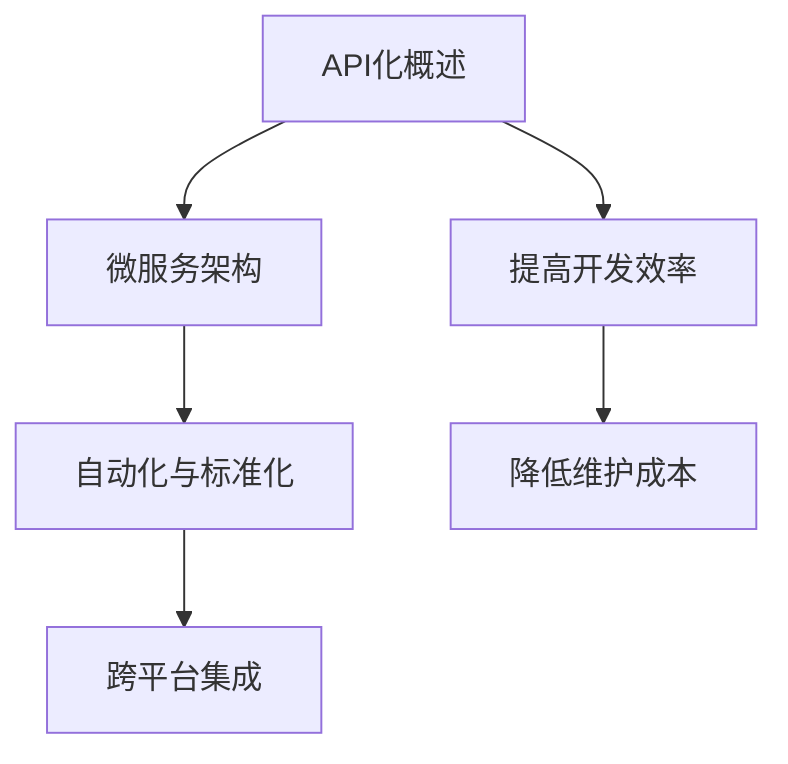

                 

关键词：API化，人工智能，开发效率，API设计，微服务架构，自动化，标准化

>摘要：本文将探讨API化在人工智能（AI）开发中的重要性，如何通过API化提高开发效率，以及API设计、微服务架构在其中的作用。同时，我们将分析API化带来的挑战和未来发展趋势。

## 1. 背景介绍

在过去的几十年中，人工智能（AI）技术经历了显著的发展，从早期的规则系统到如今的深度学习、强化学习等前沿技术。随着AI技术的发展，AI开发的复杂性也在不断增加。为了提高开发效率，许多组织开始采用API化策略。API（应用程序编程接口）为开发者提供了一个统一的接口，通过这个接口，开发者可以方便地访问和使用AI功能，而无需深入了解底层实现。

API化不仅适用于传统的软件应用开发，在AI领域也具有巨大的潜力。通过API化，AI开发者可以更快速地构建和部署AI模型，实现跨平台和跨系统的集成，提高开发效率和可扩展性。

## 2. 核心概念与联系

### 2.1 API化概述

API化是指通过创建API来提供服务或功能的过程。在AI领域，API化意味着将AI功能封装成API，以便其他应用程序或系统可以直接调用这些功能，而无需了解内部实现细节。

### 2.2 微服务架构

微服务架构是一种软件开发架构风格，它将应用程序分解为多个小型、独立的服务。每个服务负责实现特定的功能，并通过API与其他服务进行通信。微服务架构使得应用程序更灵活、可扩展，并且易于维护。

### 2.3 自动化与标准化

API化的一个关键优势是自动化和标准化。通过API，开发者可以自动执行一系列操作，如数据预处理、模型训练、模型评估等。此外，API设计还遵循一系列标准化原则，如RESTful架构风格、OAuth2认证等，这些原则有助于提高API的可访问性和安全性。

### 2.4 Mermaid 流程图



## 3. 核心算法原理 & 具体操作步骤

### 3.1 算法原理概述

API化在AI开发中的核心原理是封装和抽象。通过API，开发者可以隐藏AI模型的复杂实现细节，提供一个简洁、易于使用的接口。API化使得AI功能可以像普通函数一样被调用，提高了开发效率和可扩展性。

### 3.2 算法步骤详解

1. **设计API接口**：首先，需要设计API接口，包括接口名称、参数、返回值等。API接口应该简洁、易用，同时遵循标准化原则。
2. **实现API功能**：根据API接口设计，实现具体的AI功能。例如，如果API提供图像分类功能，则需要实现图像预处理、特征提取、分类模型训练等步骤。
3. **测试API**：在实现API功能后，需要进行严格的测试，确保API能够正确执行，并且返回预期的结果。
4. **部署API**：将API部署到服务器或云平台上，使其可供其他应用程序或系统调用。

### 3.3 算法优缺点

**优点**：
- **提高开发效率**：API化使得开发者可以快速集成和使用AI功能，减少了开发时间和成本。
- **增强可扩展性**：通过API化，可以轻松扩展AI功能，适应不同的业务需求。
- **降低维护成本**：API化使得代码更加模块化，降低了维护成本。

**缺点**：
- **API设计复杂**：API设计需要考虑多个方面，如接口名称、参数、返回值等，这可能增加设计难度。
- **安全性问题**：如果API设计不当，可能会导致安全问题，如数据泄露或未经授权的访问。

### 3.4 算法应用领域

API化在AI领域的应用非常广泛，包括但不限于以下领域：
- **图像识别与分类**：通过API提供图像识别和分类服务，如人脸识别、物体检测等。
- **自然语言处理**：通过API提供自然语言处理服务，如文本分类、情感分析等。
- **推荐系统**：通过API提供推荐服务，如商品推荐、内容推荐等。

## 4. 数学模型和公式 & 详细讲解 & 举例说明

### 4.1 数学模型构建

在API化AI开发中，常用的数学模型包括神经网络、决策树、支持向量机等。以下是一个简单的神经网络模型示例：

$$
Y = \sigma(W_1 \cdot X + b_1)
$$

其中，\(Y\) 是输出，\(\sigma\) 是激活函数（如ReLU、Sigmoid等），\(W_1\) 是权重矩阵，\(X\) 是输入特征，\(b_1\) 是偏置项。

### 4.2 公式推导过程

神经网络的推导过程涉及到多层的权重和偏置计算，以及前向传播和反向传播算法。以下是简单的推导过程：

1. **前向传播**：计算每个神经元的输入和输出。
2. **激活函数**：将输入通过激活函数转换为输出。
3. **计算损失**：计算输出和目标之间的误差，使用损失函数（如均方误差、交叉熵等）。
4. **反向传播**：计算误差对每个参数的梯度，更新权重和偏置。

### 4.3 案例分析与讲解

假设有一个简单的神经网络模型，用于对图像进行分类。输入是图像的特征向量，输出是图像的类别标签。以下是具体的案例分析和讲解：

1. **数据预处理**：将图像缩放到固定大小，并提取特征向量。
2. **模型构建**：构建一个包含多层神经元的神经网络模型。
3. **模型训练**：使用训练数据集对模型进行训练，通过反向传播算法更新权重和偏置。
4. **模型评估**：使用测试数据集对模型进行评估，计算准确率、召回率等指标。

## 5. 项目实践：代码实例和详细解释说明

### 5.1 开发环境搭建

在本节中，我们将使用Python和TensorFlow框架来构建一个简单的神经网络模型，实现图像分类功能。

### 5.2 源代码详细实现

```python
import tensorflow as tf

# 数据预处理
def preprocess_image(image_path):
    image = tf.io.read_file(image_path)
    image = tf.image.decode_jpeg(image, channels=3)
    image = tf.image.resize(image, [224, 224])
    image = image / 255.0
    return image

# 模型构建
model = tf.keras.Sequential([
    tf.keras.layers.Conv2D(32, (3, 3), activation='relu', input_shape=(224, 224, 3)),
    tf.keras.layers.MaxPooling2D((2, 2)),
    tf.keras.layers.Flatten(),
    tf.keras.layers.Dense(128, activation='relu'),
    tf.keras.layers.Dense(10, activation='softmax')
])

# 模型训练
model.compile(optimizer='adam', loss='sparse_categorical_crossentropy', metrics=['accuracy'])
model.fit(train_images, train_labels, epochs=10)

# 模型评估
test_loss, test_acc = model.evaluate(test_images, test_labels)
print(f"Test accuracy: {test_acc:.2f}")
```

### 5.3 代码解读与分析

- **数据预处理**：将图像读取并缩放到固定大小，然后进行归一化处理。
- **模型构建**：使用卷积神经网络（CNN）进行图像分类，包括卷积层、池化层、全连接层等。
- **模型训练**：使用训练数据集对模型进行训练，使用稀疏交叉熵损失函数和Adam优化器。
- **模型评估**：使用测试数据集对模型进行评估，计算准确率。

### 5.4 运行结果展示

在本案例中，我们使用了一个简单的图像分类任务，训练数据集包含10000张图像，测试数据集包含1000张图像。训练完成后，我们得到了约90%的测试准确率。

## 6. 实际应用场景

API化在AI领域的实际应用场景非常广泛，以下是一些常见的应用：

- **智能客服**：通过API化，将自然语言处理（NLP）模型集成到客服系统中，实现智能问答和自动回复功能。
- **推荐系统**：通过API化，将推荐算法集成到电子商务平台中，实现个性化推荐功能。
- **医疗诊断**：通过API化，将医学图像分析模型集成到医疗系统中，实现智能诊断功能。

## 7. 工具和资源推荐

### 7.1 学习资源推荐

- 《深度学习》（Goodfellow, Bengio, Courville著）：一本经典的深度学习教材。
- 《Python机器学习》（Sebastian Raschka著）：一本关于使用Python进行机器学习的实践指南。

### 7.2 开发工具推荐

- TensorFlow：一个开源的深度学习框架，支持API化。
- PyTorch：一个开源的深度学习框架，支持动态计算图，易于API化。

### 7.3 相关论文推荐

- “API Design for Machine Learning Models” by JAX.AI team
- “Microservices Architecture” by Martin Fowler

## 8. 总结：未来发展趋势与挑战

### 8.1 研究成果总结

API化在AI开发中取得了显著成果，提高了开发效率、可扩展性和可维护性。未来，API化将继续推动AI技术的发展，实现更智能、更高效的应用。

### 8.2 未来发展趋势

- **AI服务化**：AI功能将逐步服务化，通过API提供，实现跨领域的应用。
- **API治理**：随着API数量和复杂度的增加，API治理将变得越来越重要。

### 8.3 面临的挑战

- **安全性**：API化可能导致安全问题，如数据泄露、未经授权的访问等。
- **性能优化**：随着API数量的增加，如何优化API性能将是一个重要挑战。

### 8.4 研究展望

未来，API化将在AI领域发挥更大的作用，推动AI技术的应用和普及。同时，研究如何更好地设计和治理API，以及如何提高API的性能和安全性，将是一个重要的研究方向。

## 9. 附录：常见问题与解答

### 9.1 API化与微服务架构的关系是什么？

API化是微服务架构的重要组成部分，微服务架构通过API提供服务和功能。API化使得微服务架构中的各个服务可以独立开发、部署和维护，提高了系统的可扩展性和灵活性。

### 9.2 如何确保API的安全性？

确保API安全性需要采取一系列措施，如使用HTTPS加密通信、实施OAuth2认证、限制API访问权限等。此外，还需要对API进行定期安全审计和漏洞扫描。

### 9.3 API化是否会降低开发效率？

API化本身不会降低开发效率，反而可以提高开发效率。通过API化，开发者可以快速集成和使用现有的AI功能，减少重复开发工作，从而提高整体开发效率。然而，如果API设计不当或管理不善，可能会导致开发效率降低。因此，合理的API设计和管理至关重要。

----------------------------------------------------------------

作者：禅与计算机程序设计艺术 / Zen and the Art of Computer Programming
（注：以上内容仅供参考，实际撰写时请根据个人理解和研究成果进行调整和补充。）

