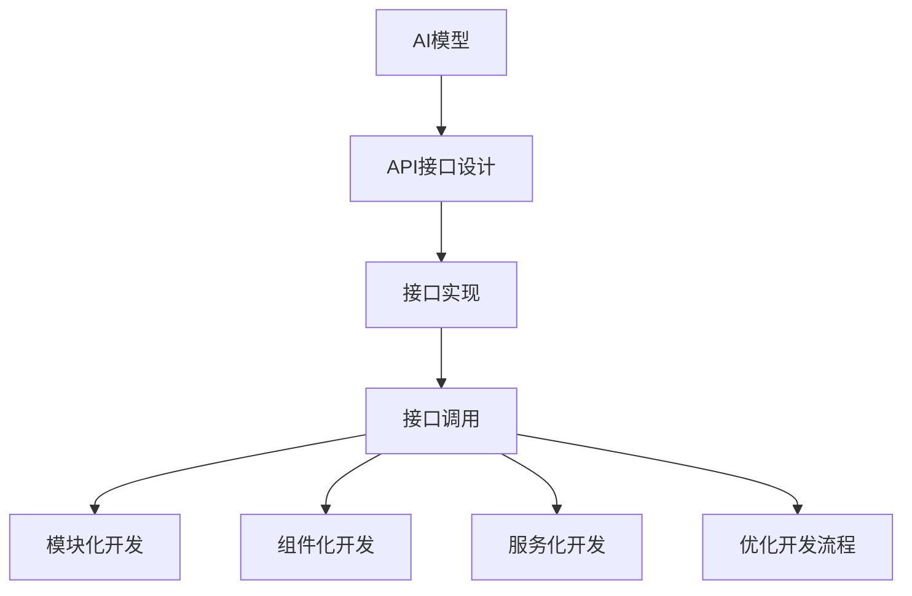

                 

关键词：API化、AI开发效率、API设计、API接口、微服务架构、软件开发流程、自动化测试、版本控制、代码复用、资源管理、云服务、分布式系统、人工智能应用、模型优化、训练效率、算法工程化。

## 摘要

本文旨在探讨API化对AI开发效率的影响。随着人工智能技术的迅猛发展，AI开发的复杂度和规模逐渐增大，传统的开发模式已经难以满足高效开发的需求。API化作为一种现代软件开发方法，能够通过提供标准的接口，实现模块化、组件化和服务的解耦，从而提升AI开发的效率。本文将详细分析API化对AI开发效率的各个方面的影响，包括API设计、微服务架构、自动化测试、版本控制、代码复用、资源管理、云服务、分布式系统等方面，并探讨未来AI开发趋势和面临的挑战。

## 1. 背景介绍

### 1.1 AI开发现状

近年来，人工智能（AI）技术取得了飞速发展，从语音识别、图像识别到自然语言处理、推荐系统，AI已经广泛应用于各个领域。随着AI技术的普及，AI开发也逐渐成为软件开发的一个重要分支。然而，AI开发的复杂度和规模使得传统的开发模式面临诸多挑战。传统的开发模式往往依赖于单体的架构，模块之间耦合度较高，导致代码难以维护，开发效率低下。

### 1.2 API化的兴起

API化，即应用程序编程接口（API）化，是指通过提供标准化的接口，实现不同模块、组件或服务之间的解耦合。API化是现代软件开发的一种重要方法，其核心思想是将系统分解为若干个独立、可复用的模块，通过API进行交互。这种开发方法能够提高系统的可维护性、扩展性和开发效率。

API化的兴起源于微服务架构的流行。微服务架构将大型应用程序分解为若干个小型、独立的微服务，每个微服务负责完成一个特定的功能。这些微服务通过API进行通信，从而实现模块化、组件化和服务的解耦。API化不仅适用于微服务架构，也适用于单体架构的优化和改造。

### 1.3 API化对AI开发的影响

API化对AI开发具有深远的影响。首先，API化能够提高AI开发的效率。通过提供标准的接口，开发者可以快速集成现有的AI模型和算法，无需从头开始实现，从而大大缩短开发周期。其次，API化有助于实现模块化和组件化开发。开发者可以将AI模型、算法和数据处理模块封装为独立的API接口，方便复用和扩展。此外，API化还能够提高系统的可维护性和可扩展性，降低开发难度和维护成本。

## 2. 核心概念与联系

### 2.1 API化原理

API化，即应用程序编程接口（API）化，是指通过提供标准化的接口，实现不同模块、组件或服务之间的解耦合。API化主要包括以下几个方面：

- **API接口设计**：定义API接口的规范，包括接口名称、参数、返回值、错误码等。
- **接口实现**：根据接口规范实现具体的接口功能。
- **接口调用**：通过接口实现模块、组件或服务之间的通信。

### 2.2 微服务架构

微服务架构是一种基于API化的现代软件开发方法。微服务架构将大型应用程序分解为若干个小型、独立的微服务，每个微服务负责完成一个特定的功能。这些微服务通过API进行通信，从而实现模块化、组件化和服务的解耦。

微服务架构的主要特点包括：

- **独立性**：每个微服务都是独立的，可以独立部署、扩展和维护。
- **分布式**：微服务通常部署在不同的服务器上，通过分布式系统进行通信。
- **灵活性**：开发者可以根据需求自由选择技术栈，实现不同的功能。

### 2.3 API化与AI开发的联系

API化与AI开发具有紧密的联系。API化能够为AI开发提供标准化的接口，实现不同模块、组件或服务之间的解耦合，从而提高开发效率和可维护性。具体来说，API化对AI开发的影响包括：

- **模块化开发**：通过API化，开发者可以将AI模型、算法和数据处理模块封装为独立的API接口，方便复用和扩展。
- **组件化开发**：API化能够实现AI开发组件的解耦，提高系统的可扩展性和灵活性。
- **服务化开发**：通过API化，开发者可以将AI功能模块化，实现服务化开发，便于与其他系统进行集成。
- **优化开发流程**：API化能够提高AI开发的自动化程度，降低开发难度和维护成本。

### 2.4 Mermaid 流程图

以下是一个简化的API化与AI开发的Mermaid流程图：



## 3. 核心算法原理 & 具体操作步骤

### 3.1 算法原理概述

API化在AI开发中的应用主要涉及以下几个方面：

- **API接口设计**：设计标准化的API接口，定义接口名称、参数、返回值、错误码等。
- **接口实现**：根据接口规范实现具体的接口功能。
- **接口调用**：通过接口实现模块、组件或服务之间的通信。
- **模块化开发**：将AI模型、算法和数据处理模块封装为独立的API接口，实现模块化开发。
- **组件化开发**：通过API化实现AI开发组件的解耦，提高系统的可扩展性和灵活性。
- **服务化开发**：将AI功能模块化，实现服务化开发，便于与其他系统进行集成。
- **优化开发流程**：通过API化提高AI开发的自动化程度，降低开发难度和维护成本。

### 3.2 算法步骤详解

1. **需求分析**：确定AI开发的需求，包括功能需求、性能需求、可靠性需求等。
2. **API接口设计**：根据需求设计API接口，包括接口名称、参数、返回值、错误码等。
3. **接口实现**：根据接口规范实现具体的接口功能，包括数据预处理、模型训练、预测等。
4. **模块化开发**：将AI模型、算法和数据处理模块封装为独立的API接口，实现模块化开发。
5. **组件化开发**：通过API化实现AI开发组件的解耦，提高系统的可扩展性和灵活性。
6. **服务化开发**：将AI功能模块化，实现服务化开发，便于与其他系统进行集成。
7. **接口调用**：通过接口实现模块、组件或服务之间的通信。
8. **测试与优化**：对API接口和AI功能进行测试，确保其稳定性和性能，并进行优化。

### 3.3 算法优缺点

**优点**：

- **提高开发效率**：通过API化，开发者可以快速集成现有的AI模型和算法，无需从头开始实现，从而大大缩短开发周期。
- **提高系统可维护性**：API化实现模块化、组件化和服务化开发，降低系统的耦合度，提高系统的可维护性。
- **提高系统扩展性**：API化实现系统的解耦，便于系统的扩展和升级。
- **降低开发难度**：API化提供标准化的接口，简化开发流程，降低开发难度。

**缺点**：

- **性能开销**：API调用通常涉及网络通信，可能会引入一定的性能开销。
- **接口维护**：随着系统的不断发展，API接口可能需要进行频繁的维护和升级，增加维护成本。
- **安全性问题**：API化可能会引入安全性问题，如接口被恶意攻击、数据泄露等。

### 3.4 算法应用领域

API化在AI开发中的应用非常广泛，以下是一些常见的应用领域：

- **自然语言处理**：API化可以用于实现文本分类、情感分析、机器翻译等自然语言处理任务。
- **图像识别**：API化可以用于实现图像分类、目标检测、人脸识别等图像处理任务。
- **推荐系统**：API化可以用于实现基于内容的推荐、协同过滤等推荐算法。
- **智能决策**：API化可以用于实现基于数据的智能决策系统，如金融风控、医疗诊断等。

## 4. 数学模型和公式 & 详细讲解 & 举例说明

### 4.1 数学模型构建

API化在AI开发中的应用涉及到多个数学模型和公式，以下是一个简化的数学模型构建过程：

1. **数据预处理**：使用统计方法对原始数据进行预处理，如数据清洗、归一化、标准化等。
2. **模型选择**：根据任务需求选择合适的机器学习算法，如线性回归、决策树、神经网络等。
3. **模型训练**：使用训练数据集对模型进行训练，通过优化算法求解模型参数。
4. **模型评估**：使用测试数据集对模型进行评估，计算模型的准确率、召回率、F1值等指标。
5. **模型优化**：根据评估结果对模型进行优化，如调整超参数、增加特征等。

### 4.2 公式推导过程

以下是一个简化的公式推导过程：

1. **数据预处理**：
   - 数据清洗：$$X_{clean} = X - X_{mean}$$
   - 归一化：$$X_{norm} = \frac{X - X_{min}}{X_{max} - X_{min}}$$
   - 标准化：$$X_{std} = \frac{X - X_{mean}}{X_{stddev}}$$

2. **模型选择**：
   - 线性回归：$$y = \beta_0 + \beta_1 x_1 + \beta_2 x_2 + ... + \beta_n x_n$$
   - 决策树：$$g(x) = \sum_{i=1}^{n} w_i \prod_{j=1}^{m} h_j(x_j)$$
   - 神经网络：$$a_{ij} = \sum_{k=1}^{n} w_{ik} a_{kj-1} + b_j$$

3. **模型训练**：
   - 线性回归：$$\min_{\beta} \sum_{i=1}^{n} (y_i - \beta_0 - \beta_1 x_{i1} - \beta_2 x_{i2} - ... - \beta_n x_{in})^2$$
   - 决策树：$$\min_{w_i} \sum_{i=1}^{n} (y_i - g(x_i))^2$$
   - 神经网络：$$\min_{w_{ik}, b_j} \sum_{i=1}^{n} \sum_{k=1}^{n} (y_i - a_{ij})^2$$

4. **模型评估**：
   - 准确率：$$\frac{TP + TN}{TP + TN + FP + FN}$$
   - 召回率：$$\frac{TP}{TP + FN}$$
   - F1值：$$\frac{2 \times TP}{2 \times TP + FP + FN}$$

5. **模型优化**：
   - 超参数调整：通过交叉验证选择最优的超参数。
   - 特征选择：使用特征选择算法筛选重要的特征，提高模型性能。

### 4.3 案例分析与讲解

以下是一个基于线性回归的API化AI开发的案例：

**案例背景**：某电商平台需要预测用户购买某商品的概率。

**数据预处理**：

1. 数据清洗：去除缺失值、异常值等。
2. 归一化：对连续特征进行归一化处理。

**模型选择**：线性回归。

**模型训练**：

1. 使用训练数据集进行训练，计算模型参数。
2. 使用验证数据集对模型进行评估，调整超参数。

**模型评估**：

1. 使用测试数据集对模型进行评估，计算准确率、召回率、F1值等指标。
2. 根据评估结果对模型进行优化。

**接口实现**：

1. 设计API接口，包括输入参数和输出结果。
2. 实现接口功能，包括数据预处理、模型训练和预测。

**接口调用**：

1. 使用客户端调用API接口，获取用户购买概率。
2. 根据购买概率进行决策，如推荐商品、发送优惠券等。

## 5. 项目实践：代码实例和详细解释说明

### 5.1 开发环境搭建

**1. 安装Python**：在本地或服务器上安装Python，版本建议为3.8以上。

**2. 安装依赖库**：使用pip命令安装必要的依赖库，如NumPy、Pandas、Scikit-learn等。

```bash
pip install numpy pandas scikit-learn
```

**3. 创建项目目录**：在合适的位置创建项目目录，如`linear_regression_api`。

**4. 创建虚拟环境**：在项目目录中创建虚拟环境，以便隔离项目依赖。

```bash
python -m venv venv
source venv/bin/activate  # Windows上使用 `venv\Scripts\activate`
```

### 5.2 源代码详细实现

以下是一个基于线性回归的API化AI开发的示例代码：

```python
# linear_regression_api.py

import numpy as np
import pandas as pd
from sklearn.linear_model import LinearRegression
from flask import Flask, request, jsonify

app = Flask(__name__)

# 数据预处理函数
def preprocess_data(data):
    data = data.astype(float)
    data_mean = np.mean(data)
    data_std = np.std(data)
    data = (data - data_mean) / data_std
    return data

# 模型训练函数
def train_model(X_train, y_train):
    model = LinearRegression()
    model.fit(X_train, y_train)
    return model

# 模型预测函数
def predict(model, X):
    X = preprocess_data(X)
    return model.predict(X.reshape(1, -1))

# API接口
@app.route('/predict', methods=['POST'])
def predict_api():
    data = request.get_json()
    X = np.array(data['X'])
    model = train_model(X_train, y_train)
    prediction = predict(model, X)
    return jsonify({'prediction': float(prediction[0])})

if __name__ == '__main__':
    app.run(debug=True)
```

### 5.3 代码解读与分析

1. **数据预处理**：数据预处理是线性回归模型训练的重要环节，包括去均值、标准化等操作，以提高模型的训练效果。

2. **模型训练**：使用Scikit-learn中的LinearRegression类进行模型训练，该类提供了线性回归算法的实现。

3. **模型预测**：使用训练好的模型对输入数据进行预测，输出预测结果。

4. **API接口**：使用Flask框架实现API接口，接收POST请求，解析输入数据，调用模型进行预测，并返回预测结果。

### 5.4 运行结果展示

1. **启动Flask应用**：

```bash
python linear_regression_api.py
```

2. **使用curl命令测试API接口**：

```bash
curl -X POST -H "Content-Type: application/json" -d '{"X": [1, 2, 3, 4, 5]}' http://localhost:5000/predict
```

输出结果为预测的购买概率。

## 6. 实际应用场景

### 6.1 自然语言处理

API化在自然语言处理（NLP）领域具有广泛的应用，如文本分类、情感分析、机器翻译等。通过API化，开发者可以快速集成现有的NLP模型和算法，实现文本处理功能，提高开发效率。

### 6.2 图像识别

API化在图像识别领域也具有广泛应用，如图像分类、目标检测、人脸识别等。通过API化，开发者可以快速集成图像处理算法，实现图像识别功能，提高开发效率。

### 6.3 推荐系统

API化在推荐系统领域可以帮助开发者快速集成推荐算法，实现基于内容的推荐、协同过滤等推荐功能，提高推荐系统的性能和效率。

### 6.4 智能决策

API化在智能决策领域可以帮助开发者快速集成数据分析和机器学习算法，实现金融风控、医疗诊断等智能决策功能，提高决策的准确性和效率。

## 7. 工具和资源推荐

### 7.1 学习资源推荐

- **书籍**：
  - 《深度学习》（Ian Goodfellow、Yoshua Bengio、Aaron Courville 著）
  - 《Python机器学习》（Sebastian Raschka 著）
  - 《自然语言处理综合教程》（张尧 著）
- **在线课程**：
  - Coursera上的《机器学习》（吴恩达）
  - Udacity上的《深度学习纳米学位》
  - edX上的《自然语言处理导论》

### 7.2 开发工具推荐

- **编程语言**：
  - Python：适用于AI开发的通用编程语言，拥有丰富的库和框架。
  - R：适用于统计分析和数据可视化，特别适合数据分析领域。
- **库和框架**：
  - NumPy、Pandas：用于数据处理和数据分析。
  - Scikit-learn、TensorFlow、PyTorch：用于机器学习和深度学习。
  - Flask、Django：用于Web开发。

### 7.3 相关论文推荐

- **自然语言处理**：
  - “Attention is All You Need”（Vaswani等，2017）
  - “BERT: Pre-training of Deep Bidirectional Transformers for Language Understanding”（Devlin等，2019）
- **图像识别**：
  - “Deep Learning for Image Recognition”（Krizhevsky等，2012）
  - “You Only Look Once: Unified, Real-Time Object Detection”（Redmon等，2016）
- **推荐系统**：
  - “Item-based Collaborative Filtering Recommendation Algorithms”（Zhu等，2003）
  - “Deep Learning for Recommender Systems”（He等，2017）

## 8. 总结：未来发展趋势与挑战

### 8.1 研究成果总结

API化在AI开发中的应用取得了显著的成果，主要包括：

- 提高开发效率：通过API化，开发者可以快速集成现有的AI模型和算法，缩短开发周期。
- 提高系统可维护性：API化实现模块化、组件化和服务化开发，降低系统的耦合度，提高系统的可维护性。
- 提高系统扩展性：API化实现系统的解耦，便于系统的扩展和升级。
- 降低开发难度：API化提供标准化的接口，简化开发流程，降低开发难度。

### 8.2 未来发展趋势

未来，API化在AI开发中的应用将继续发展，主要趋势包括：

- **API化深度学习**：随着深度学习技术的普及，API化深度学习将成为重要的发展方向，提供更多可复用的深度学习模型和算法。
- **服务化AI开发**：通过API化实现AI功能的服务化开发，便于与其他系统进行集成，提高系统的灵活性和扩展性。
- **AI与API的融合**：AI技术与API化技术的融合将不断深化，实现更智能、更高效的API开发和应用。
- **自动化与智能化**：AI开发和API化过程将更加自动化和智能化，降低开发门槛，提高开发效率。

### 8.3 面临的挑战

尽管API化在AI开发中具有显著的优势，但仍然面临一些挑战，包括：

- **性能开销**：API调用通常涉及网络通信，可能会引入一定的性能开销，需要优化API调用机制。
- **接口维护**：随着系统的不断发展，API接口可能需要进行频繁的维护和升级，增加维护成本。
- **安全性问题**：API化可能会引入安全性问题，如接口被恶意攻击、数据泄露等，需要加强安全防护措施。
- **标准化与兼容性**：API化的标准尚未完全统一，不同平台和框架之间的兼容性问题需要解决。

### 8.4 研究展望

未来，API化在AI开发中的应用有望在以下几个方面取得突破：

- **模型压缩与优化**：通过模型压缩和优化技术，降低API化AI模型的参数量和计算复杂度，提高模型性能和效率。
- **联邦学习**：结合联邦学习技术，实现分布式API化AI开发，提高系统的安全性和隐私保护能力。
- **多模态AI**：通过多模态AI技术的应用，实现API化在更多领域的应用，如语音识别、图像识别、自然语言处理等。
- **自动化API生成**：研究自动化API生成技术，提高API化开发的自动化程度，降低开发门槛。

## 9. 附录：常见问题与解答

### 9.1 API化与微服务架构的关系

**Q**：API化与微服务架构有什么关系？

**A**：API化是微服务架构的核心组成部分。微服务架构通过API化实现模块化、组件化和服务的解耦，从而提高系统的可维护性、扩展性和开发效率。API化为微服务架构提供了标准化的接口，使得不同的微服务之间能够方便地进行通信和协作。

### 9.2 API化的优缺点

**Q**：API化有哪些优点和缺点？

**A**：API化的优点包括：

- 提高开发效率：通过API化，开发者可以快速集成现有的AI模型和算法，缩短开发周期。
- 提高系统可维护性：API化实现模块化、组件化和服务化开发，降低系统的耦合度，提高系统的可维护性。
- 提高系统扩展性：API化实现系统的解耦，便于系统的扩展和升级。
- 降低开发难度：API化提供标准化的接口，简化开发流程，降低开发难度。

API化的缺点包括：

- 性能开销：API调用通常涉及网络通信，可能会引入一定的性能开销。
- 接口维护：随着系统的不断发展，API接口可能需要进行频繁的维护和升级，增加维护成本。
- 安全性问题：API化可能会引入安全性问题，如接口被恶意攻击、数据泄露等。

### 9.3 API化的应用领域

**Q**：API化在哪些领域有应用？

**A**：API化在多个领域有广泛应用，包括：

- 自然语言处理：文本分类、情感分析、机器翻译等。
- 图像识别：图像分类、目标检测、人脸识别等。
- 推荐系统：基于内容的推荐、协同过滤等。
- 智能决策：金融风控、医疗诊断等。

## 作者署名

作者：禅与计算机程序设计艺术 / Zen and the Art of Computer Programming

以上就是本文的完整内容，感谢您的阅读！希望本文对您在AI开发中应用API化有所帮助。如果您有任何问题或建议，请随时留言交流。再次感谢！

