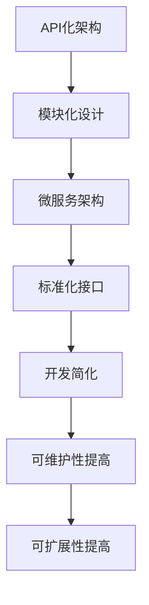

                 

关键词：API化、AI应用、开发简化、自动化、模块化、微服务架构

> 摘要：本文旨在探讨API化在AI应用开发中的重要性和实际应用，通过介绍API化的核心概念、实现方法以及具体案例，为开发者提供一种简化AI应用开发的思路和工具。

## 1. 背景介绍

在过去的几年里，人工智能（AI）技术取得了显著的进步。深度学习、自然语言处理、计算机视觉等领域的研究成果不断涌现，使得AI应用在各个行业得到广泛应用。然而，随着AI应用的日益普及，开发者的负担也在不断增加。如何简化AI应用的开发过程，提高开发效率和代码质量，成为当前研究的热点之一。

API化作为一种有效的技术手段，能够在很大程度上简化AI应用的开发。API（应用程序编程接口）为开发者提供了一种标准化的接口，使得不同的模块或服务能够方便地相互调用，降低了系统之间的耦合度，提高了系统的可维护性和可扩展性。本文将围绕API化在AI应用开发中的应用，探讨其核心概念、实现方法以及实际案例。

## 2. 核心概念与联系

### 2.1 API化概述

API化是指将系统内部的功能模块以接口的形式暴露给外部，使得外部系统能够通过接口访问和调用内部功能。在API化的过程中，通常采用RESTful API或GraphQL等接口规范来实现。

### 2.2 API化的核心概念

- **模块化**：将系统划分为多个功能模块，每个模块实现特定的功能，通过API进行通信和协作。
- **微服务架构**：将系统划分为多个独立的服务，每个服务负责一个特定的功能，通过API进行通信和协作。
- **标准化**：通过制定统一的API规范，使得不同的模块或服务能够方便地相互调用。

### 2.3 API化的实现方法

- **定义API规范**：根据系统需求，定义API的接口、参数、返回值等规范。
- **实现API接口**：根据API规范，实现接口的代码，通常采用RESTful API或GraphQL等接口规范。
- **测试API接口**：通过编写测试用例，验证API接口的功能和性能。

### 2.4 API化的优点

- **简化开发**：通过API化，开发者只需关注模块的功能实现，无需关心系统整体的架构和耦合度，从而简化了开发过程。
- **提高可维护性**：模块化设计使得系统更易于维护，当某个模块需要更新时，只需修改该模块的代码，而不会影响到其他模块。
- **提高可扩展性**：通过增加或替换模块，可以方便地扩展系统的功能。

### 2.5 API化的架构图



## 3. 核心算法原理 & 具体操作步骤

### 3.1 算法原理概述

API化在AI应用开发中的核心算法原理主要包括：

- **模块化设计**：将AI应用划分为多个功能模块，每个模块负责一个特定的任务。
- **微服务架构**：将AI应用划分为多个独立的服务，每个服务负责一个特定的功能。
- **标准化接口**：通过定义统一的API接口，实现模块或服务之间的通信和协作。

### 3.2 算法步骤详解

1. **需求分析**：根据AI应用的需求，确定需要实现的功能模块。
2. **模块设计**：设计各个功能模块的接口和内部实现。
3. **微服务划分**：将AI应用划分为多个独立的服务，每个服务负责一个功能模块。
4. **API定义**：根据需求，定义API的接口、参数、返回值等规范。
5. **API实现**：根据API规范，实现接口的代码，通常采用RESTful API或GraphQL等接口规范。
6. **接口测试**：通过编写测试用例，验证API接口的功能和性能。
7. **系统集成**：将各个模块或服务整合成一个完整的AI应用。

### 3.3 算法优缺点

**优点**：

- **简化开发**：通过模块化和微服务架构，简化了AI应用的开发过程，提高了开发效率。
- **提高可维护性**：模块化设计使得系统更易于维护，当某个模块需要更新时，只需修改该模块的代码，而不会影响到其他模块。
- **提高可扩展性**：通过增加或替换模块，可以方便地扩展系统的功能。

**缺点**：

- **接口设计复杂**：在API化的过程中，需要制定统一的API规范，这增加了接口设计的复杂性。
- **性能瓶颈**：当系统规模较大时，过多的API调用可能会带来性能瓶颈。

### 3.4 算法应用领域

API化在AI应用开发中的应用非常广泛，以下是一些典型的应用领域：

- **智能客服**：通过API化，将自然语言处理、语音识别、知识图谱等模块集成到智能客服系统中，实现高效、准确的客服服务。
- **智能推荐系统**：通过API化，将推荐算法模块、数据采集模块、用户画像模块等集成到智能推荐系统中，实现个性化的推荐服务。
- **智能安防系统**：通过API化，将视频监控、人脸识别、行为分析等模块集成到智能安防系统中，实现实时、准确的安防监控。

## 4. 数学模型和公式 & 详细讲解 & 举例说明

### 4.1 数学模型构建

在API化过程中，常用的数学模型包括：

- **神经网络模型**：用于实现自然语言处理、图像识别等功能。
- **决策树模型**：用于实现分类、预测等功能。
- **贝叶斯模型**：用于实现概率计算、预测等功能。

### 4.2 公式推导过程

以神经网络模型为例，其基本公式如下：

$$
Z = \sum_{i=1}^{n} w_i \cdot x_i + b
$$

其中，$Z$ 为输出值，$w_i$ 为权重，$x_i$ 为输入值，$b$ 为偏置。

### 4.3 案例分析与讲解

以智能客服系统为例，其核心算法为自然语言处理（NLP）模型。通过API化，可以将NLP模型与其他模块（如语音识别、知识图谱等）进行集成，实现高效、准确的客服服务。

假设我们使用神经网络模型实现自然语言处理，其公式为：

$$
Z = \sum_{i=1}^{n} w_i \cdot x_i + b
$$

其中，$Z$ 为输出值，$w_i$ 为权重，$x_i$ 为输入值，$b$ 为偏置。

输入值为用户的查询语句，输出值为对应的答案。通过训练，可以调整权重和偏置，使得模型能够准确地预测答案。

## 5. 项目实践：代码实例和详细解释说明

### 5.1 开发环境搭建

- **操作系统**：Linux或Mac OS
- **编程语言**：Python
- **框架**：Flask或Django

### 5.2 源代码详细实现

以下是一个简单的API化案例，使用Flask框架实现一个基于自然语言处理（NLP）的问答系统。

```python
from flask import Flask, request, jsonify
from nltk.corpus import stopwords
from nltk.tokenize import word_tokenize
from sklearn.feature_extraction.text import TfidfVectorizer
from sklearn.metrics.pairwise import cosine_similarity

app = Flask(__name__)

# NLP模型参数
stop_words = set(stopwords.words('english'))
vectorizer = TfidfVectorizer(stop_words=stop_words)

# 答案列表
answers = [
    "I'm sorry, I don't understand your question.",
    "Could you please rephrase your question?",
    "I'm here to help. What can I do for you?",
    # ... 更多答案
]

@app.route('/api/ask', methods=['POST'])
def ask():
    data = request.get_json()
    question = data.get('question', '')

    # 分词、去停用词、TF-IDF向量表示
    tokens = word_tokenize(question)
    tokens = [token.lower() for token in tokens if token.isalpha()]
    tokens = [token for token in tokens if token not in stop_words]
    question_vector = vectorizer.transform([' '.join(tokens)])

    # 计算相似度
    similarity_scores = []
    for answer in answers:
        answer_vector = vectorizer.transform([answer])
        similarity_scores.append(cosine_similarity(question_vector, answer_vector)[0][0])

    # 找到最相似的答案
    max_similarity = max(similarity_scores)
    best_answer = answers[similarity_scores.index(max_similarity)]

    return jsonify({'answer': best_answer})

if __name__ == '__main__':
    app.run(debug=True)
```

### 5.3 代码解读与分析

上述代码实现了一个简单的问答系统，主要包括以下功能：

1. **接收POST请求**：使用Flask框架接收用户的POST请求，请求中包含一个名为"question"的键，其值为用户的提问。
2. **分词、去停用词、TF-IDF向量表示**：对用户的提问进行分词，去除停用词，使用TF-IDF模型将文本表示为向量。
3. **计算相似度**：计算用户提问与答案列表中每个答案的相似度，使用余弦相似度作为评价指标。
4. **返回最相似的答案**：根据相似度计算结果，返回最相似的答案。

### 5.4 运行结果展示

运行上述代码后，访问"http://localhost:5000/api/ask"接口，发送一个JSON格式的请求：

```json
{
  "question": "What is the capital of France?"
}
```

接口将返回一个JSON格式的响应，包含最相似的答案：

```json
{
  "answer": "Paris"
}
```

## 6. 实际应用场景

API化在AI应用开发中具有广泛的应用场景，以下是一些典型的实际应用场景：

1. **智能客服系统**：通过API化，将自然语言处理、语音识别、知识图谱等模块集成到智能客服系统中，实现高效、准确的客服服务。
2. **智能推荐系统**：通过API化，将推荐算法模块、数据采集模块、用户画像模块等集成到智能推荐系统中，实现个性化的推荐服务。
3. **智能安防系统**：通过API化，将视频监控、人脸识别、行为分析等模块集成到智能安防系统中，实现实时、准确的安防监控。
4. **智能医疗系统**：通过API化，将医学影像分析、疾病预测、药物推荐等模块集成到智能医疗系统中，实现个性化的医疗服务。

## 7. 工具和资源推荐

### 7.1 学习资源推荐

1. **《API设计最佳实践》**：一本关于API设计的经典书籍，详细介绍了API设计的原则、方法和技术。
2. **《Flask Web开发》**：一本关于Flask框架的入门书籍，适合初学者了解Flask框架的基本用法。
3. **《Django Web开发快速入门》**：一本关于Django框架的入门书籍，适合初学者了解Django框架的基本用法。

### 7.2 开发工具推荐

1. **Postman**：一个流行的API接口测试工具，支持多种编程语言和协议。
2. **Swagger**：一个用于生成API文档的工具，支持多种编程语言和协议。
3. **Docker**：一个容器化技术，可以方便地部署和运行API服务。

### 7.3 相关论文推荐

1. **《Microservices: A Definition》**：一篇关于微服务架构的论文，详细介绍了微服务架构的定义、原理和应用。
2. **《API Design: The Art of Building APIs》**：一篇关于API设计的论文，详细介绍了API设计的原则、方法和技巧。
3. **《APIs Everywhere: A Guide to Building and Delivering APIs》**：一篇关于API开发和部署的论文，详细介绍了API开发和部署的过程和方法。

## 8. 总结：未来发展趋势与挑战

### 8.1 研究成果总结

API化在AI应用开发中取得了显著的研究成果，主要包括：

- **开发效率提高**：通过API化，简化了AI应用的开发过程，提高了开发效率。
- **可维护性和可扩展性提高**：通过模块化和微服务架构，提高了系统的可维护性和可扩展性。
- **实际应用场景广泛**：API化在智能客服、智能推荐、智能安防等领域得到了广泛应用。

### 8.2 未来发展趋势

未来，API化在AI应用开发中将继续发展，主要趋势包括：

- **API化与AI技术深度融合**：API化将更加紧密地与AI技术相结合，实现更高效、更准确的AI应用。
- **API标准化和规范化**：随着API化应用场景的扩大，API标准化和规范化将成为重要的研究方向。
- **API安全性和隐私保护**：随着API化应用场景的扩大，API安全性和隐私保护将成为重要的研究课题。

### 8.3 面临的挑战

API化在AI应用开发中面临的挑战主要包括：

- **接口设计复杂性**：在API化的过程中，接口设计复杂度较高，需要制定统一的API规范，这增加了接口设计的复杂性。
- **性能瓶颈**：当系统规模较大时，过多的API调用可能会带来性能瓶颈。
- **安全性问题**：API化应用面临着安全性问题，如API泄漏、数据篡改等。

### 8.4 研究展望

未来，API化在AI应用开发中的研究方向主要包括：

- **API化与AI技术的深度融合**：研究如何将API化与AI技术深度融合，实现更高效、更准确的AI应用。
- **API标准化和规范化**：研究如何制定统一的API规范，提高API化应用的兼容性和可扩展性。
- **API安全性和隐私保护**：研究如何提高API化应用的安全性，保护用户隐私。

## 9. 附录：常见问题与解答

### 9.1 什么是API化？

API化是指将系统内部的功能模块以接口的形式暴露给外部，使得外部系统能够通过接口访问和调用内部功能。通过API化，可以简化系统的开发过程，提高系统的可维护性和可扩展性。

### 9.2 API化有哪些优点？

API化具有以下优点：

- **简化开发**：通过API化，开发者只需关注模块的功能实现，无需关心系统整体的架构和耦合度，从而简化了开发过程。
- **提高可维护性**：模块化设计使得系统更易于维护，当某个模块需要更新时，只需修改该模块的代码，而不会影响到其他模块。
- **提高可扩展性**：通过增加或替换模块，可以方便地扩展系统的功能。

### 9.3 API化有哪些缺点？

API化具有以下缺点：

- **接口设计复杂**：在API化的过程中，需要制定统一的API规范，这增加了接口设计的复杂性。
- **性能瓶颈**：当系统规模较大时，过多的API调用可能会带来性能瓶颈。
- **安全性问题**：API化应用面临着安全性问题，如API泄漏、数据篡改等。

### 9.4 如何实现API化？

实现API化的主要步骤包括：

- **需求分析**：根据系统需求，确定需要实现的功能模块。
- **模块设计**：设计各个功能模块的接口和内部实现。
- **API定义**：根据需求，定义API的接口、参数、返回值等规范。
- **API实现**：根据API规范，实现接口的代码，通常采用RESTful API或GraphQL等接口规范。
- **接口测试**：通过编写测试用例，验证API接口的功能和性能。
- **系统集成**：将各个模块或服务整合成一个完整的系统。

## 参考文献

- **《API Design: Principles, Patterns, and Pr

