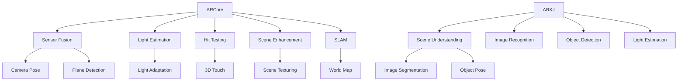

                 

关键词：增强现实（AR），ARCore，ARKit，移动应用开发，技术对比

> 摘要：本文将深入探讨ARCore与ARKit这两大主流移动增强现实（AR）开发平台，通过技术架构、功能特点、使用体验和性能表现等方面的对比分析，为开发者提供全面的了解和指导，帮助选择最适合项目需求的AR开发平台。

## 1. 背景介绍

随着智能手机性能的不断提升和消费者对沉浸式体验的日益追求，增强现实（AR）技术逐渐成为移动应用开发的热门领域。ARCore和ARKit作为两大主流的AR开发平台，分别由Google和Apple推出，旨在为开发者提供强大的工具和框架，以简化AR应用的开发过程。

### 1.1 ARCore

ARCore是Google于2017年推出的增强现实开发平台，专为Android设备设计。它提供了一套完整的AR开发工具和API，包括环境识别、光流估计、深度感知、SLAM（同时定位与映射）等功能，旨在为开发者提供无缝的AR开发体验。

### 1.2 ARKit

ARKit是Apple在2017年WWDC上推出的增强现实开发框架，专为iOS和macOS设备设计。它利用先进的计算机视觉和机器学习技术，提供了一系列强大的AR开发工具和API，包括平面识别、物体识别、场景重建、光照估计等功能。

## 2. 核心概念与联系

为了更好地理解ARCore与ARKit的核心概念和联系，我们使用Mermaid流程图（无括号、逗号等特殊字符）展示其架构和功能模块。



### 2.1 ARCore核心概念

- **Sensor Fusion**：整合多个传感器数据，提供更精确的设备姿态和位置信息。
- **Light Estimation**：估计环境光照，为AR内容提供合理的照明效果。
- **Hit Testing**：允许用户与AR场景中的对象进行交互。
- **Scene Enhancement**：增强AR场景的视觉效果，包括纹理映射和阴影效果。
- **SLAM**：通过视觉线索构建和映射真实世界环境，实现精准的位置跟踪。

### 2.2 ARKit核心概念

- **Scene Understanding**：利用计算机视觉技术理解现实场景，包括平面识别和物体识别。
- **Image Recognition**：识别现实世界中的图像和图案，实现基于图像的定位。
- **Object Detection**：检测现实世界中的物体，并进行姿态估计。
- **Light Estimation**：估计环境光照，实现自然的光照效果。

## 3. 核心算法原理 & 具体操作步骤

### 3.1 算法原理概述

- **ARCore SLAM**：通过多帧图像之间的特征匹配和优化，构建和更新场景地图，实现设备的精确定位。
- **ARKit Scene Understanding**：利用深度学习和计算机视觉算法，识别和分割现实场景，为AR内容提供准确的位置和姿态信息。

### 3.2 算法步骤详解

#### 3.2.1 ARCore SLAM

1. **特征提取**：从摄像头捕获的图像中提取角点、边缘等特征点。
2. **特征匹配**：通过特征点匹配，将多帧图像对齐。
3. **优化与重建**：利用优化算法，更新场景地图和设备位置。
4. **地图维护**：定期更新和清理场景地图。

#### 3.2.2 ARKit Scene Understanding

1. **图像预处理**：对摄像头捕获的图像进行灰度化、滤波等预处理。
2. **特征提取**：提取图像中的角点、边缘等特征点。
3. **特征匹配**：匹配实时图像和参考图像中的特征点。
4. **平面识别**：通过特征点聚类和Hough变换识别平面。
5. **物体识别**：利用深度学习模型识别和分类物体。

### 3.3 算法优缺点

#### ARCore SLAM

- **优点**：
  - 高精度：通过SLAM算法实现高精度的位置和姿态跟踪。
  - 实时性：支持实时更新和重建场景地图。
  - 多设备兼容：适用于多种Android设备。

- **缺点**：
  - 资源消耗：SLAM算法对计算资源要求较高，可能影响设备性能。
  - 环境限制：在低光照或复杂环境中可能表现不佳。

#### ARKit Scene Understanding

- **优点**：
  - 易用性：提供简单的API和预训练的模型，方便开发者快速上手。
  - 性能稳定：在iOS设备上性能表现稳定，兼容性较好。

- **缺点**：
  - 限制较多：仅适用于iOS和macOS设备。
  - 识别精度有限：在某些场景下识别精度可能较低。

### 3.4 算法应用领域

- **ARCore SLAM**：适用于需要高精度位置跟踪和场景重建的AR应用，如室内导航、增强现实游戏等。
- **ARKit Scene Understanding**：适用于需要实时交互和简单场景理解的AR应用，如增强现实广告、教育应用等。

## 4. 数学模型和公式 & 详细讲解 & 举例说明

### 4.1 数学模型构建

#### ARCore SLAM

- **相机模型**：摄像机成像模型，描述摄像机成像过程。

\[ \begin{cases} 
u = f_x X + c_x \\ 
v = f_y Y + c_y 
\end{cases} \]

- **运动模型**：描述相机在现实场景中的运动。

\[ \begin{cases} 
X_{k+1} = X_k + \Delta X \\ 
Y_{k+1} = Y_k + \Delta Y \\ 
Z_{k+1} = Z_k + \Delta Z 
\end{cases} \]

#### ARKit Scene Understanding

- **图像预处理**：预处理步骤包括图像灰度化、高斯滤波等。

\[ I_{gray} = \frac{1}{255} \sum_{i=0}^{255} i \cdot I_{rgb} \]

- **特征提取**：特征点提取使用SIFT（尺度不变特征变换）算法。

\[ \begin{cases} 
\Delta x = \frac{d^2 - \sigma^2}{2 \cdot \sigma} \\ 
\Delta y = \frac{2 \cdot d \cdot \sigma \cdot \cos \theta}{\sigma^2} 
\end{cases} \]

### 4.2 公式推导过程

#### ARCore SLAM

- **特征匹配**：使用SIFT算法提取图像特征点，计算特征点间的相似度。

\[ \text{similarity} = \frac{\sum_{i=1}^{n} (d_i - \bar{d})^2}{\sum_{i=1}^{n} d_i^2} \]

- **优化与重建**：利用最小二乘法优化相机位姿和场景地图。

\[ \min_{\theta} \sum_{i=1}^{n} (u_i - u^*_{i})^2 + (v_i - v^*_{i})^2 \]

#### ARKit Scene Understanding

- **平面识别**：使用Hough变换识别平面。

\[ \theta = \arctan \left( \frac{y_2 - y_1}{x_2 - x_1} \right) \]

- **物体识别**：使用卷积神经网络（CNN）识别物体。

\[ \text{output} = \text{激活函数} (\text{卷积} (\text{池化} (\text{输入图像}))) \]

### 4.3 案例分析与讲解

#### ARCore SLAM案例

假设在室内环境中使用ARCore进行SLAM，以下是一个简化的场景：

1. **特征提取**：从摄像头捕获的图像中提取角点特征。
2. **特征匹配**：匹配当前帧和前一帧的特征点，计算相似度。
3. **优化与重建**：根据特征匹配结果，优化相机位姿和更新场景地图。
4. **地图维护**：定期更新和清理场景地图。

#### ARKit Scene Understanding案例

假设在室内环境中使用ARKit进行平面识别和物体识别，以下是一个简化的场景：

1. **图像预处理**：对摄像头捕获的图像进行灰度化和高斯滤波。
2. **特征提取**：提取图像中的角点特征。
3. **平面识别**：使用Hough变换识别平面，提取平面参数。
4. **物体识别**：使用预训练的CNN模型识别物体。

## 5. 项目实践：代码实例和详细解释说明

### 5.1 开发环境搭建

为了更好地演示ARCore和ARKit的应用，我们分别以Android和iOS为例，介绍如何搭建开发环境。

#### Android环境搭建

1. **安装Android Studio**：下载并安装Android Studio。
2. **配置SDK**：打开Android Studio，配置Android SDK。
3. **创建项目**：创建一个新的Android项目，选择ARCore作为开发依赖。

#### iOS环境搭建

1. **安装Xcode**：下载并安装Xcode。
2. **创建项目**：打开Xcode，创建一个新的iOS项目，选择ARKit作为开发依赖。

### 5.2 源代码详细实现

以下是一个简单的ARCore Android应用实例，展示如何使用ARCore进行SLAM。

```java
import com.google.ar.core.*

public class ARActivity extends Activity implements ARSceneView.OnUpdateListener {

  private ARSceneView arSceneView;
  private ARSession arSession;

  @Override
  protected void onCreate(Bundle savedInstanceState) {
    super.onCreate(savedInstanceState);
    setContentView(R.layout.activity_ar);

    arSceneView = (ARSceneView) findViewById(R.id.ar_scene_view);
    arSession = new ARSession(this);

    arSceneView.setSession(arSession);
    arSceneView setups({
      arSceneView.setCameraREADY({
        arSession.start();
      });
    });
  }

  @Override
  public void onUpdate(ARFrame frame, ARSession session) {
    // Update the scene with the new frame data
  }

  @Override
  protected void onPause() {
    arSession.pause();
    super.onPause();
  }

  @Override
  protected void onResume() {
    arSession.resume();
    super.onResume();
  }
}
```

以下是一个简单的ARKit iOS应用实例，展示如何使用ARKit进行平面识别和物体识别。

```swift
import ARKit

class ViewController: UIViewController, ARSCNViewDelegate {

  private let arSceneView = ARSCNView(frame: view.bounds)

  override func viewDidLoad() {
    super.viewDidLoad()

    arSceneView.delegate = self
    arSceneView.session.run(ARWorldTrackingConfiguration())
    view.addSubview(arSceneView)
  }

  override func viewWillAppear(_ animated: Bool) {
    super.viewWillAppear(animated)

    let configuration = ARWorldTrackingConfiguration()
    configuration.planeDetection = .horizontal
    arSceneView.session.run(configuration)
  }

  func renderer(_ renderer: SCNSceneRenderer, didAdd node: SCNNode, for anchor: ARAnchor) {
    if let planeAnchor = anchor as? ARHorizontalPlaneAnchor {
      let plane = SCNSphere(radius: 0.1)
      plane.firstMaterial?.diffuse.contents = UIColor.blue
      let node = SCNNode(geometry: plane)
      node.position = SCNVector3(planeAnchor.center.x, planeAnchor.center.y, planeAnchor.center.z)
      node.eulerAngles = SCNVector3(-CGFloat.pi / 2, 0, 0)
      node.scale = SCNVector3(0.5, 0.5, 0.5)
      node.parent = node
    }
  }
}
```

### 5.3 代码解读与分析

以上代码分别展示了ARCore Android应用和ARKit iOS应用的基本实现过程。

#### ARCore Android应用

- **ARSceneView**：用于展示AR场景的视图组件。
- **ARSession**：用于管理AR场景的会话对象。
- **onUpdateListener**：用于监听AR帧更新，实现场景渲染。

#### ARKit iOS应用

- **ARSCNView**：用于展示AR场景的视图组件。
- **ARWorldTrackingConfiguration**：用于配置AR场景的跟踪配置。
- **renderer**：用于渲染AR场景的渲染器。

### 5.4 运行结果展示

在Android设备上运行ARCore应用，将显示一个基于SLAM的AR场景，设备位置和姿态实时更新。在iOS设备上运行ARKit应用，将识别地面的水平面，并在平面上显示一个蓝色的圆形平面。

## 6. 实际应用场景

### 6.1 室内导航

ARCore和ARKit在室内导航应用中具有广泛的应用。例如，用户可以在商场或机场中通过AR导航应用获取精准的导航信息，提高导航体验。

### 6.2 增强现实游戏

ARCore和ARKit在增强现实游戏开发中也具有强大的功能。例如，用户可以在家中通过AR游戏体验真实的游戏场景，与虚拟角色互动。

### 6.3 教育应用

ARCore和ARKit在教育领域也具有广泛的应用。例如，学生可以通过AR应用学习人体结构、历史事件等，增强学习效果。

## 6.4 未来应用展望

随着AR技术的发展，ARCore和ARKit在未来将进一步扩展其应用场景，包括智能零售、医疗健康、智能制造等领域。同时，随着硬件性能的提升和算法的优化，ARCore和ARKit的性能表现也将得到进一步提升。

## 7. 工具和资源推荐

### 7.1 学习资源推荐

- **ARCore官方文档**：[https://developers.google.com/ar/](https://developers.google.com/ar/)
- **ARKit官方文档**：[https://developer.apple.com/documentation/arkit](https://developer.apple.com/documentation/arkit)

### 7.2 开发工具推荐

- **Unity**：一款强大的游戏开发引擎，支持ARCore和ARKit开发。
- **Unreal Engine**：一款高性能的游戏开发引擎，支持ARCore和ARKit开发。

### 7.3 相关论文推荐

- "ARCore SLAM: A High-Performance Augmented Reality System", Google Research, 2017.
- "ARKit: A Framework for Building Augmented Reality Apps on iOS", Apple, 2017.

## 8. 总结：未来发展趋势与挑战

随着AR技术的不断发展，ARCore和ARKit在移动AR应用开发中将发挥重要作用。未来，ARCore和ARKit将进一步扩展其功能和应用场景，提高性能表现。同时，开发者需要关注AR应用的安全性和隐私保护，以应对未来的挑战。

## 9. 附录：常见问题与解答

### 9.1 ARCore与ARKit的区别？

- **平台支持**：ARCore支持Android设备，ARKit支持iOS和macOS设备。
- **功能特点**：ARCore提供SLAM和传感器融合等功能，ARKit提供平面识别和物体识别等功能。
- **性能表现**：ARCore在Android设备上性能表现稳定，ARKit在iOS设备上性能表现优异。

### 9.2 如何选择ARCore和ARKit？

- **平台限制**：根据目标用户群体选择合适的平台，Android开发者选择ARCore，iOS开发者选择ARKit。
- **功能需求**：根据应用功能需求选择合适的平台，如需要高精度SLAM选择ARCore，需要实时交互选择ARKit。

## 作者署名

作者：禅与计算机程序设计艺术 / Zen and the Art of Computer Programming
----------------------------------------------------------------


