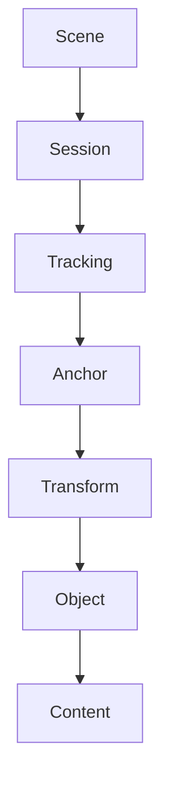

                 

关键词：ARKit，增强现实，iOS，开发，应用

> 摘要：本文将深入探讨 ARKit，苹果公司为 iOS 开发者提供的一套强大且易用的增强现实开发框架。我们将了解 ARKit 的核心概念、功能特点，并通过具体的算法原理、数学模型、项目实践等方面，展示如何使用 ARKit 在 iOS 上创建令人惊叹的 AR 体验。

## 1. 背景介绍

随着智能手机和移动设备的普及，增强现实（AR）技术逐渐成为开发者和用户关注的焦点。AR 技术能够将数字内容与现实世界无缝融合，为用户提供更加沉浸式的体验。苹果公司在 iOS 平台上引入了 ARKit，为开发者提供了丰富的工具和功能，以简化 AR 应用程序的创建。

ARKit 是苹果公司于 2017 年推出的一款开发框架，它基于 Core ML 和 Metal 技术，提供了丰富的功能，包括场景理解、图像识别、物体追踪等。通过 ARKit，开发者可以轻松地在 iOS 设备上实现强大的 AR 功能，为用户提供丰富且互动的 AR 体验。

## 2. 核心概念与联系

为了更好地理解 ARKit 的核心概念和架构，我们首先需要了解 ARKit 的主要组件及其相互关系。以下是 ARKit 的核心组件和它们之间的联系：



- **Scene**：表示 AR 场景的容器，是 ARKit 的核心。场景中包含了所有的锚点、对象和内容。
- **Session**：表示 AR 会话，负责控制 AR 场景的开始、暂停和恢复等。
- **Tracking**：负责实时的场景理解，包括平移、旋转和缩放等。
- **Anchor**：代表在场景中的虚拟锚点，可以是平面锚点或物体锚点。
- **Transform**：表示锚点或对象的位置和方向。
- **Object**：表示在场景中的虚拟对象，可以是图片、模型等。
- **Content**：表示与对象相关联的数字内容，可以是图像、视频或 3D 模型等。

## 3. 核心算法原理 & 具体操作步骤

### 3.1 算法原理概述

ARKit 使用了一系列先进的计算机视觉和机器学习技术来实现 AR 功能。以下是 ARKit 的核心算法原理：

- **图像识别**：ARKit 通过计算机视觉算法识别并标记现实世界中的图像。
- **平面检测**：ARKit 使用深度相机和计算机视觉算法来检测平面，以便在上面放置虚拟对象。
- **物体追踪**：ARKit 使用机器学习算法来跟踪现实世界中的物体，以保持虚拟对象与真实物体的位置关系。

### 3.2 算法步骤详解

1. **初始化 ARKit**：创建一个 ARSession 对象，并设置合适的配置选项。
2. **配置相机**：设置相机模式、分辨率、帧率等参数，以便获得最佳的 AR 体验。
3. **创建锚点**：根据用户的操作或系统检测到的特征，创建锚点并添加到场景中。
4. **添加对象**：创建虚拟对象，并将其关联到锚点，以在场景中显示。
5. **更新场景**：在每次相机帧更新时，更新锚点和对象的位置和方向，以保持虚拟对象与现实世界的同步。

### 3.3 算法优缺点

- **优点**：
  - **易用性**：ARKit 提供了丰富的功能和简单易用的接口，使开发者能够快速创建 AR 应用。
  - **性能**：ARKit 使用了优化的计算机视觉和机器学习算法，能够在移动设备上实现高效的 AR 功能。
  - **兼容性**：ARKit 支持 iOS 上的多种设备，包括 iPhone 和 iPad，为开发者提供了广泛的平台支持。

- **缺点**：
  - **精度限制**：由于硬件限制，ARKit 的精度可能不如专业的 AR 系统高。
  - **性能消耗**：运行 ARKit 可能会消耗较多的 CPU 和 GPU 资源，影响设备的性能。

### 3.4 算法应用领域

ARKit 在多个领域都有广泛的应用，包括：

- **零售**：通过 AR 技术为用户提供虚拟试衣和产品展示。
- **教育**：通过 AR 技术为学生提供更加生动和互动的学习体验。
- **游戏**：通过 AR 技术为玩家提供独特的游戏体验。

## 4. 数学模型和公式 & 详细讲解 & 举例说明

### 4.1 数学模型构建

ARKit 使用了多个数学模型来实现其功能，以下是其中两个核心模型：

- **相机投影矩阵**：用于将 3D 场景投影到 2D 图形缓冲区中。
- **姿态矩阵**：用于表示 ARSession 的旋转、平移和缩放等变换。

### 4.2 公式推导过程

- **相机投影矩阵**：

  $$ P = \begin{bmatrix} P_x & P_y & P_z & P_w \end{bmatrix} $$

  其中，$P_x$、$P_y$、$P_z$ 和 $P_w$ 分别表示相机在不同方向上的投影参数。

- **姿态矩阵**：

  $$ T = \begin{bmatrix} R_x & R_y & R_z & T_x \\ R_x & R_y & R_z & T_y \\ R_x & R_y & R_z & T_z \\ 0 & 0 & 0 & 1 \end{bmatrix} $$

  其中，$R_x$、$R_y$、$R_z$ 和 $T_x$、$T_y$、$T_z$ 分别表示旋转矩阵和平移向量。

### 4.3 案例分析与讲解

假设我们想要在 AR 场景中放置一个虚拟立方体，以下是一个简单的例子：

1. **创建相机投影矩阵**：

   $$ P = \begin{bmatrix} 1 & 0 & 0 & 0 \\ 0 & 1 & 0 & 0 \\ 0 & 0 & 1 & 0 \\ 0 & 0 & 0 & 1 \end{bmatrix} $$

2. **创建姿态矩阵**：

   $$ T = \begin{bmatrix} 1 & 0 & 0 & 0 \\ 0 & 1 & 0 & 0 \\ 0 & 0 & 1 & 0 \\ 0 & 0 & 0 & 1 \end{bmatrix} $$

3. **将虚拟立方体添加到场景中**：

   在 ARSession 中创建一个虚拟立方体，并将其关联到当前 ARSession 的根锚点。

4. **更新姿态矩阵**：

   在每次相机帧更新时，更新虚拟立方体的位置和方向，以保持与现实世界的同步。

## 5. 项目实践：代码实例和详细解释说明

### 5.1 开发环境搭建

1. **安装 Xcode**：在 Mac 上安装 Xcode，它是开发 iOS 应用的必备工具。
2. **创建新项目**：打开 Xcode，创建一个新项目，选择 ARKit 应用模板。

### 5.2 源代码详细实现

以下是使用 ARKit 创建一个简单 AR 应用的示例代码：

```swift
import UIKit
import ARKit

class ViewController: UIViewController, ARSCNViewDelegate {

    @IBOutlet var sceneView: ARSCNView!

    override func viewDidLoad() {
        super.viewDidLoad()
        
        // 设置 ARSCNView 的代理
        sceneView.delegate = self
        
        // 配置 ARSession
        let configuration = ARWorldTrackingConfiguration()
        sceneView.session.run(configuration)
    }

    func renderer(_ renderer: SCNSceneRenderer, nodeFor anchor: ARAnchor) -> SCNNode? {
        // 创建一个虚拟立方体
        let boxGeometry = SCNBox(width: 0.1, height: 0.1, length: 0.1, chamferRadius: 0)
        let boxMaterial = SCNMaterial()
        boxMaterial.diffuse.contents = UIColor.blue
        let boxNode = SCNNode(geometry: boxGeometry)
        boxNode.geometry?.material = boxMaterial
        
        // 将立方体添加到锚点
        let anchorNode = SCNNode()
        anchorNode.position = SCNVector3(0, 0, 0)
        anchorNode.addChildNode(boxNode)
        
        return anchorNode
    }
}
```

### 5.3 代码解读与分析

- **初始化 ARSCNView**：创建一个 ARSCNView，并设置其代理。
- **配置 ARSession**：创建一个 ARWorldTrackingConfiguration 对象，并运行 ARSession。
- **渲染虚拟立方体**：在 `renderer(_:nodeFor:)` 方法中，创建一个虚拟立方体，并将其添加到锚点。

### 5.4 运行结果展示

运行应用后，您将在屏幕上看到虚拟立方体。当您移动设备时，立方体将跟随设备的移动。

## 6. 实际应用场景

ARKit 在多个领域都有广泛的应用，以下是一些常见的应用场景：

- **零售**：通过 AR 技术为用户提供虚拟试衣、产品展示等。
- **教育**：通过 AR 技术为学生提供更加生动和互动的学习体验。
- **游戏**：通过 AR 技术为玩家提供独特的游戏体验。

## 7. 工具和资源推荐

### 7.1 学习资源推荐

- **官方文档**：阅读 ARKit 的官方文档，了解其功能、API 和最佳实践。
- **教程和博客**：查阅在线教程和博客，学习如何使用 ARKit 开发实际项目。
- **示例代码**：查看开源项目中的 ARKit 代码示例，了解其实现细节。

### 7.2 开发工具推荐

- **Xcode**：苹果公司的集成开发环境，用于开发 iOS 应用。
- **ARKit Studio**：一款用于设计和测试 ARKit 应用的工具。

### 7.3 相关论文推荐

- **"Augmented Reality on Apple Devices: ARKit and Beyond"**：一篇关于 ARKit 的介绍性论文。
- **"Real-Time Scene Understanding with ARKit"**：一篇关于 ARKit 场景理解的论文。

## 8. 总结：未来发展趋势与挑战

### 8.1 研究成果总结

ARKit 的推出为 iOS 开发者提供了一个强大且易用的 AR 开发框架。通过 ARKit，开发者可以轻松地创建各种 AR 应用，为用户提供丰富且互动的 AR 体验。

### 8.2 未来发展趋势

- **性能提升**：随着硬件技术的进步，ARKit 的性能将得到进一步提升，为开发者提供更加流畅和逼真的 AR 体验。
- **更广泛的应用场景**：ARKit 将在更多领域得到应用，如医疗、建筑、旅游等。

### 8.3 面临的挑战

- **精度和可靠性**：如何在有限的硬件资源下实现高精度的 AR 功能，是一个亟待解决的挑战。
- **用户体验**：如何提供一致且高质量的 AR 体验，避免用户出现晕动等不适反应。

### 8.4 研究展望

未来，ARKit 有望在人工智能和机器学习的支持下，实现更加智能化和自动化的 AR 功能。同时，ARKit 也将在跨平台开发中发挥重要作用，为开发者提供更多可能性。

## 9. 附录：常见问题与解答

### 9.1 ARKit 与 ARCore 有何区别？

ARKit 和 ARCore 都是用于 AR 开发的框架，但它们分别适用于不同的操作系统。ARKit 是苹果公司为 iOS 开发者提供的框架，而 ARCore 是谷歌为 Android 开发者提供的框架。两者在功能、性能和API方面有所不同，但都致力于简化 AR 应用的开发。

### 9.2 ARKit 支持哪些设备？

ARKit 支持 iOS 11 及以上版本的设备，包括 iPhone 和 iPad。不同设备在性能和功能方面有所差异，开发者应根据目标设备进行优化。

### 9.3 如何优化 AR 应用性能？

优化 AR 应用性能的关键在于减少渲染负载和计算复杂度。开发者可以通过以下方法进行优化：

- **减少对象数量**：避免在场景中添加过多的对象，以减少渲染负载。
- **使用离线渲染**：使用离线渲染技术，如预渲染的 3D 模型，以减少实时渲染的计算复杂度。
- **优化着色器**：优化着色器代码，减少 GPU 的负载。

---

作者：禅与计算机程序设计艺术 / Zen and the Art of Computer Programming
------------------------------------------------------------------------

