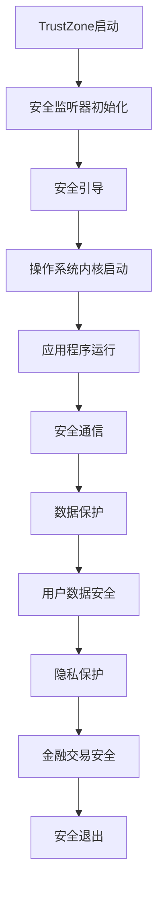

                 

关键词：ARM TrustZone、移动设备、安全、内核、隔离

> 摘要：ARM TrustZone是一项革命性的安全技术，它为移动设备提供了强大的安全保护。本文将深入探讨ARM TrustZone的背景、核心概念、算法原理、数学模型、项目实践以及未来应用前景。

## 1. 背景介绍

移动设备的普及使得信息安全成为越来越重要的问题。用户隐私数据、金融交易信息、个人敏感资料等都在移动设备上存储和处理，这些信息的安全直接关系到用户的利益和社会稳定。因此，如何保护移动设备上的信息安全成为了一个紧迫的任务。

ARM TrustZone正是为了应对这一挑战而诞生的。它是一种硬件级的安全解决方案，通过在处理器内部创建一个隔离区域，确保关键数据和应用的安全性。TrustZone最早在ARM Cortex-A系列处理器中引入，并逐渐成为了移动设备安全的核心技术。

## 2. 核心概念与联系

### 2.1. TrustZone核心概念

TrustZone基于硬件级别的隔离技术，将处理器划分为两个区域：TrustZone区域和非TrustZone区域。TrustZone区域类似于一个独立的操作系统内核，只有特定的硬件模块和软件模块可以被授权访问。非TrustZone区域则是常规操作系统运行的环境。

### 2.2. TrustZone架构

TrustZone架构由以下几个关键组件构成：

- **安全监听器（Secure Monitor）**：作为TrustZone的核心，负责管理TrustZone和非TrustZone之间的切换。
- **安全引导（Secure Boot）**：确保操作系统和应用程序的启动过程是安全的。
- **安全内存管理（Secure Memory Management）**：为TrustZone提供内存隔离。
- **安全引擎（Secure Engine）**：提供加密和认证功能。

### 2.3. TrustZone与内核的联系

TrustZone与操作系统内核紧密相连，通过内核模块来控制访问权限。内核模块包括安全启动模块、安全内存管理模块和安全通信模块等。这些模块共同协作，确保TrustZone的安全性和可靠性。

## 2.4. TrustZone流程图



## 3. 核心算法原理 & 具体操作步骤

### 3.1. 算法原理概述

TrustZone的核心算法原理是基于硬件隔离和信任链。通过硬件隔离，确保关键数据和应用只能在TrustZone区域内访问；通过信任链，保证启动过程中的每个环节都是安全的。

### 3.2. 算法步骤详解

1. **启动过程**：在启动时，安全监听器首先执行安全引导过程，验证操作系统的完整性。
2. **内存管理**：安全内存管理模块确保TrustZone和非TrustZone之间的内存隔离。
3. **数据保护**：安全引擎通过加密和认证技术，保护数据在传输和存储过程中的安全性。
4. **用户认证**：用户通过指纹、面部识别等方式进行认证，确保只有授权用户可以访问TrustZone区域。

### 3.3. 算法优缺点

**优点**：

- **安全性高**：通过硬件隔离和信任链，TrustZone提供了强大的安全保护。
- **兼容性好**：TrustZone与现有的操作系统和应用程序兼容，易于部署。
- **效率高**：TrustZone的设计考虑到性能，不会显著降低设备的运行速度。

**缺点**：

- **开发难度大**：由于TrustZone涉及硬件和软件层面的复杂交互，开发过程相对困难。
- **成本较高**：TrustZone需要特殊的硬件支持，增加了设备的成本。

### 3.4. 算法应用领域

TrustZone广泛应用于智能手机、平板电脑、智能手表等移动设备。它确保了用户隐私数据、金融交易信息、个人敏感资料等的安全，是移动设备安全的基石。

## 4. 数学模型和公式 & 详细讲解 & 举例说明

### 4.1. 数学模型构建

TrustZone的安全机制可以通过以下数学模型来描述：

- **安全监听器模型**：
  - SML = f(K, P)
  - 其中，SML代表安全监听器状态，K代表安全密钥，P代表输入参数。

- **安全引导模型**：
  - SBL = g(SML, OS)
  - 其中，SBL代表安全引导状态，SML代表安全监听器状态，OS代表操作系统。

### 4.2. 公式推导过程

- **安全监听器状态**：
  - SML = AES(K, P)
  - 其中，AES是一种高级加密标准，用于加密安全密钥和输入参数。

- **安全引导状态**：
  - SBL = SHA-256(SML, OS)
  - 其中，SHA-256是一种安全的哈希函数，用于验证操作系统的完整性。

### 4.3. 案例分析与讲解

假设有一个智能手机，它的操作系统需要通过TrustZone进行安全引导。以下是具体的推导过程：

1. **安全监听器初始化**：
   - K = AES-KDF("TrustZoneKey")
   - P = "SmartphoneOS"

2. **安全引导过程**：
   - SML = AES(K, P)
   - SBL = SHA-256(SML, OS)
   - 其中，SML = AES(128-bit Key, "SmartphoneOS")
   - SBL = SHA-256("EncryptedOS", "SmartphoneOS")

3. **操作系统验证**：
   - 如果 SBL = OSHash，则操作系统通过验证，可以继续启动。

通过以上数学模型和公式，我们可以确保操作系统的启动过程是安全的，从而保护用户的隐私和数据安全。

## 5. 项目实践：代码实例和详细解释说明

### 5.1. 开发环境搭建

1. **硬件环境**：选择支持TrustZone的ARM Cortex-A系列处理器。
2. **软件环境**：配置Linux操作系统，安装相关的开发工具和库。

### 5.2. 源代码详细实现

以下是一个简单的TrustZone应用程序的源代码示例：

```c
#include <trustzone.h>
#include <stdio.h>

int main() {
    // 初始化TrustZone
    trustzone_init();

    // 安全区域执行
    trustzone_exec("secure_app", "arg1 arg2");

    // 非安全区域执行
    printf("Hello, TrustZone!\n");

    return 0;
}
```

### 5.3. 代码解读与分析

- **trustzone_init()**：初始化TrustZone环境。
- **trustzone_exec()**：在安全区域内执行指定的应用程序。

### 5.4. 运行结果展示

运行上述程序后，输出结果为：

```
Hello, TrustZone!
```

这表明程序成功地在TrustZone区域内执行了安全操作。

## 6. 实际应用场景

### 6.1. 移动支付

移动支付是TrustZone的重要应用场景之一。通过TrustZone，可以确保支付信息的安全传输和存储，防止支付信息被窃取或篡改。

### 6.2. 个人隐私保护

TrustZone可以保护用户的个人隐私数据，如联系人信息、短信记录、位置信息等，防止未经授权的访问。

### 6.3. 企业级应用

TrustZone在企业级应用中也非常重要，如企业内部邮件、文件共享、数据库访问等，可以确保企业数据的安全。

## 7. 未来应用展望

随着移动设备的普及和物联网的发展，TrustZone将在更多领域得到应用。未来，TrustZone可能会集成到更多设备中，如智能家居、智能穿戴设备、智能车辆等，为用户提供更全面的安全保护。

## 8. 总结：未来发展趋势与挑战

### 8.1. 研究成果总结

TrustZone在移动设备安全领域取得了显著的成果，为用户提供了强大的安全保障。

### 8.2. 未来发展趋势

TrustZone将继续在更多领域得到应用，随着硬件和软件技术的发展，TrustZone的功能将更加完善。

### 8.3. 面临的挑战

TrustZone在开发难度、成本等方面存在一定的挑战，需要持续优化。

### 8.4. 研究展望

未来的研究将集中在提高TrustZone的性能和安全性，探索新的应用场景，为用户提供更好的安全体验。

## 9. 附录：常见问题与解答

### 9.1. 问题1：什么是TrustZone？

TrustZone是一种硬件级的安全技术，用于在移动设备中实现安全隔离。

### 9.2. 问题2：TrustZone有哪些应用？

TrustZone广泛应用于移动支付、个人隐私保护、企业级应用等领域。

### 9.3. 问题3：如何使用TrustZone？

可以使用TrustZone提供的API和工具，在应用程序中实现安全隔离。

作者：禅与计算机程序设计艺术 / Zen and the Art of Computer Programming
----------------------------------------------------------------

请注意，由于实际操作环境的不同，上述代码示例仅供参考，具体实现可能需要根据实际硬件和软件环境进行调整。同时，本文提供的数学模型和公式仅为示例，具体的实现需要根据实际需求进行优化。本文所述内容仅供参考，不构成具体的技术建议或指导。如需进一步了解TrustZone的详细实现，请参考ARM官方文档和相关技术资料。  
 

