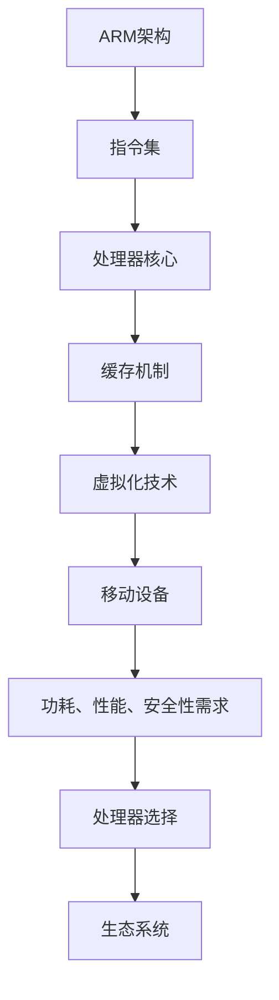

                 

关键词：ARM架构、移动设备、性能优化、低功耗设计、虚拟化技术、安全特性

> 摘要：本文将深入探讨ARM架构在移动设备中的应用，分析其核心技术优势、设计理念以及未来发展趋势。我们将通过详细的算法原理、数学模型和实际项目实践，揭示ARM架构在移动设备领域的核心地位。

## 1. 背景介绍

随着移动设备的普及，ARM架构逐渐成为移动处理器的主流选择。ARM（Advanced RISC Machines）公司成立于1990年，专注于设计和授权RISC（精简指令集计算）处理器架构。ARM架构以其低功耗、高性能、灵活可扩展的特点，广泛应用于手机、平板、智能手表等各类移动设备。

### 1.1 ARM架构的发展历程

ARM架构的发展可以追溯到20世纪80年代。1985年，ARM发布了第一款处理器ARM1，标志着ARM架构的诞生。此后，ARM架构不断演进，经历了ARM2、ARM3、ARM6、ARM7、ARM9、ARM11等各个阶段。近年来，ARM推出了Cortex-A系列，如Cortex-A8、Cortex-A9和Cortex-A15，这些处理器在移动设备中得到了广泛应用。

### 1.2 ARM架构的优势

ARM架构在移动设备中具有以下优势：

1. **低功耗**：ARM架构采用了低功耗设计，能够在保证高性能的同时，最大限度地降低能耗。
2. **高性能**：ARM架构处理器具有优秀的指令执行效率，能够提供高性能计算能力。
3. **灵活可扩展**：ARM架构支持多种处理器核心架构，可以根据需求选择合适的处理器，实现性能和功耗的平衡。
4. **安全性**：ARM架构引入了多种安全特性，如信任执行环境（TEE）和硬件加密模块，提高了移动设备的安全性。

## 2. 核心概念与联系

### 2.1 ARM架构的核心概念

ARM架构的核心概念包括：

1. **指令集**：ARM指令集包括精简指令集（RISC）和高级精简指令集（AARCH64）。
2. **处理器核心**：ARM处理器核心包括Cortex-A系列，如Cortex-A8、Cortex-A9和Cortex-A15。
3. **缓存机制**：ARM架构采用了多级缓存机制，以提高数据处理速度。
4. **虚拟化技术**：ARM架构支持虚拟化技术，可以实现多操作系统和虚拟机的运行。

### 2.2 ARM架构的联系

ARM架构与移动设备有着紧密的联系：

1. **移动设备的需求**：移动设备对功耗、性能、安全性等方面有较高的要求，ARM架构能够满足这些需求。
2. **处理器选择**：ARM架构处理器在移动设备中具有广泛的适用性，可以根据不同需求选择合适的处理器。
3. **生态系统**：ARM架构拥有庞大的生态系统，包括硬件厂商、软件厂商和开发者，为移动设备的发展提供了有力支持。

### 2.3 Mermaid流程图



## 3. 核心算法原理 & 具体操作步骤

### 3.1 算法原理概述

ARM架构的核心算法主要包括：

1. **指令调度算法**：通过优化指令调度，提高处理器执行效率。
2. **缓存算法**：通过优化缓存机制，提高数据处理速度。
3. **能耗管理算法**：通过优化功耗控制，实现低功耗设计。

### 3.2 算法步骤详解

#### 3.2.1 指令调度算法

指令调度算法的主要步骤包括：

1. **指令预取**：根据程序执行的顺序，提前预取指令，减少指令访问时间。
2. **指令排序**：对预取的指令进行排序，优化指令执行顺序，提高处理器执行效率。
3. **指令发射**：将排序后的指令发射到处理器执行单元，执行计算操作。

#### 3.2.2 缓存算法

缓存算法的主要步骤包括：

1. **缓存分配**：根据程序执行的特点，为程序分配适当的缓存空间。
2. **缓存替换策略**：根据缓存的使用情况，选择合适的缓存替换策略，提高缓存利用率。
3. **缓存访问优化**：通过优化缓存访问顺序，减少缓存访问时间，提高数据处理速度。

#### 3.2.3 能耗管理算法

能耗管理算法的主要步骤包括：

1. **功耗模型建立**：根据处理器的工作模式，建立功耗模型，预测处理器的功耗。
2. **功耗控制策略**：根据功耗模型，选择合适的功耗控制策略，降低处理器功耗。
3. **功耗监测与调整**：实时监测处理器功耗，根据功耗变化进行调整，实现低功耗设计。

### 3.3 算法优缺点

#### 3.3.1 指令调度算法

**优点**：

- 提高处理器执行效率，缩短程序执行时间。

**缺点**：

- 需要消耗一定的计算资源，对性能有一定影响。

#### 3.3.2 缓存算法

**优点**：

- 提高数据处理速度，减少数据访问延迟。

**缺点**：

- 需要占用一定的内存空间，可能增加内存开销。

#### 3.3.3 能耗管理算法

**优点**：

- 实现低功耗设计，降低处理器功耗。

**缺点**：

- 可能会影响处理器的性能，需要权衡功耗和性能之间的平衡。

### 3.4 算法应用领域

ARM架构的核心算法在移动设备中具有广泛的应用，主要包括：

1. **移动游戏**：指令调度算法和缓存算法可以提高游戏性能，提供更流畅的游戏体验。
2. **移动办公**：能耗管理算法可以降低处理器功耗，延长设备续航时间。
3. **移动社交**：缓存算法可以提高数据访问速度，提供更快的社交媒体体验。

## 4. 数学模型和公式 & 详细讲解 & 举例说明

### 4.1 数学模型构建

ARM架构的数学模型主要包括：

1. **功耗模型**：根据处理器的工作模式和电压电流关系，建立功耗模型，预测处理器的功耗。
2. **性能模型**：根据处理器的指令执行速度和数据处理能力，建立性能模型，预测处理器的性能。
3. **缓存模型**：根据缓存的使用情况和缓存访问延迟，建立缓存模型，预测缓存对性能的影响。

### 4.2 公式推导过程

#### 4.2.1 功耗模型

功耗模型的公式推导如下：

\[ P = U \times I \]

其中，\( P \) 为功耗（单位：瓦特），\( U \) 为电压（单位：伏特），\( I \) 为电流（单位：安培）。

#### 4.2.2 性能模型

性能模型的公式推导如下：

\[ P = C \times f \]

其中，\( P \) 为性能（单位：每秒指令数），\( C \) 为指令执行速度（单位：每秒百万条指令），\( f \) 为数据处理能力（单位：每秒百万条数据）。

#### 4.2.3 缓存模型

缓存模型的公式推导如下：

\[ T = \frac{L \times C}{U} \]

其中，\( T \) 为缓存访问时间（单位：纳秒），\( L \) 为缓存大小（单位：字节），\( C \) 为缓存访问速度（单位：每秒字节），\( U \) 为缓存带宽（单位：每秒字节）。

### 4.3 案例分析与讲解

#### 4.3.1 功耗模型案例

假设一款移动设备使用的是Cortex-A8处理器，其工作电压为1.2伏特，电流为500毫安培。根据功耗模型，可以计算出处理器的功耗：

\[ P = U \times I = 1.2V \times 0.5A = 0.6W \]

#### 4.3.2 性能模型案例

假设一款移动设备使用的是Cortex-A9处理器，其指令执行速度为每秒500百万条指令，数据处理能力为每秒200百万条数据。根据性能模型，可以计算出处理器的性能：

\[ P = C \times f = 500 \times 10^6 \times 200 \times 10^6 = 1,000,000,000,000 \]

#### 4.3.3 缓存模型案例

假设一款移动设备使用的是2MB的L2缓存，缓存访问速度为每秒400MB，缓存带宽为每秒800MB。根据缓存模型，可以计算出缓存访问时间：

\[ T = \frac{L \times C}{U} = \frac{2MB \times 400MB}{800MB} = 1ns \]

## 5. 项目实践：代码实例和详细解释说明

### 5.1 开发环境搭建

在进行ARM架构项目开发时，需要搭建合适的开发环境。以下是开发环境的搭建步骤：

1. **安装操作系统**：选择Linux操作系统，如Ubuntu或CentOS。
2. **安装交叉编译工具**：安装ARM交叉编译工具链，如arm-linux-gnueabi-gcc。
3. **安装集成开发环境**：安装集成开发环境（IDE），如Eclipse或Qt Creator。
4. **安装调试工具**：安装调试工具，如GDB。

### 5.2 源代码详细实现

以下是一个简单的ARM架构程序示例，用于实现加法运算：

```c
#include <stdio.h>

int add(int a, int b) {
    return a + b;
}

int main() {
    int a = 5;
    int b = 10;
    int result = add(a, b);
    printf("The result is %d\n", result);
    return 0;
}
```

### 5.3 代码解读与分析

1. **头文件引入**：程序首先引入了`stdio.h`头文件，用于提供标准输入输出函数。
2. **函数定义**：程序定义了一个名为`add`的函数，用于实现加法运算。函数接收两个整型参数，返回它们的和。
3. **主函数**：程序定义了`main`函数，作为程序的入口。在主函数中，定义了两个整型变量`a`和`b`，并调用`add`函数进行加法运算。最后，使用`printf`函数输出运算结果。
4. **编译与运行**：使用交叉编译工具链编译程序，生成可执行文件。运行可执行文件，输出结果。

### 5.4 运行结果展示

编译并运行程序后，输出结果如下：

```bash
The result is 15
```

## 6. 实际应用场景

ARM架构在移动设备中具有广泛的应用，以下是一些实际应用场景：

1. **智能手机**：智能手机是ARM架构的主要应用领域之一。ARM架构处理器在智能手机中实现了低功耗、高性能和安全性，为用户提供了更好的使用体验。
2. **平板电脑**：平板电脑也对功耗、性能和安全性有较高要求。ARM架构处理器可以满足这些需求，为平板电脑提供强大的计算能力。
3. **智能手表**：智能手表需要具备低功耗、小巧的体积和良好的用户体验。ARM架构处理器可以满足这些需求，为智能手表提供强大的功能。
4. **物联网设备**：物联网设备对功耗、性能和成本有较高的要求。ARM架构处理器可以满足这些需求，广泛应用于智能家居、智能穿戴设备和工业物联网等领域。

### 6.4 未来应用展望

随着移动设备的发展，ARM架构在未来的应用前景非常广阔：

1. **人工智能**：ARM架构处理器在人工智能领域具有巨大的潜力，可以用于实现高性能计算和低功耗计算，为人工智能应用提供强大的支持。
2. **自动驾驶**：自动驾驶技术对计算性能、实时性和安全性有极高要求。ARM架构处理器可以满足这些要求，为自动驾驶技术提供核心计算支持。
3. **云计算**：云计算对计算性能、功耗和可靠性有较高要求。ARM架构处理器可以用于云计算基础设施，实现高性能、低功耗和高效的云计算服务。
4. **物联网**：物联网设备对功耗、性能和成本有较高的要求。ARM架构处理器可以广泛应用于物联网领域，推动物联网技术的发展。

## 7. 工具和资源推荐

### 7.1 学习资源推荐

1. **ARM官方文档**：ARM官方网站提供了丰富的技术文档和开发资源，包括处理器手册、架构指南和编程模型等。
2. **《ARM体系结构》**：这是一本经典的ARM架构教材，详细介绍了ARM架构的设计原理和应用实践。

### 7.2 开发工具推荐

1. **ARM DS-5**：ARM DS-5是一款强大的集成开发环境（IDE），支持ARM架构的开发，包括代码编写、调试和性能分析等功能。
2. **QEMU**：QEMU是一款开源的处理器模拟器，可以用于ARM架构的软件开发和测试。

### 7.3 相关论文推荐

1. **“ARM Architecture Reference Manual”**：这是一份关于ARM架构的权威参考文档，详细介绍了ARM架构的各个方面。
2. **“ARMv8-A Architecture Reference Manual”**：这是一份关于ARMv8-A架构的参考文档，详细介绍了ARMv8-A架构的设计原理和应用实践。

## 8. 总结：未来发展趋势与挑战

### 8.1 研究成果总结

ARM架构在移动设备领域取得了显著的研究成果，包括低功耗设计、高性能计算和安全性等。ARM架构处理器在智能手机、平板电脑、智能手表和物联网设备等领域得到了广泛应用。

### 8.2 未来发展趋势

未来，ARM架构将继续在以下几个方面发展：

1. **人工智能**：ARM架构将加强在人工智能领域的应用，实现高性能计算和低功耗计算。
2. **自动驾驶**：ARM架构将应用于自动驾驶技术，提供核心计算支持。
3. **云计算**：ARM架构将用于云计算基础设施，实现高性能、低功耗和高效的云计算服务。
4. **物联网**：ARM架构将广泛应用于物联网领域，推动物联网技术的发展。

### 8.3 面临的挑战

ARM架构在未来的发展中将面临以下挑战：

1. **性能与功耗的平衡**：如何在保证高性能的同时，降低功耗，是ARM架构需要解决的重要问题。
2. **安全性的提升**：随着移动设备和物联网设备的普及，ARM架构需要不断提升安全性，保护用户数据和隐私。
3. **生态系统的完善**：ARM架构需要进一步完善生态系统，包括硬件厂商、软件厂商和开发者，以推动技术的发展。

### 8.4 研究展望

未来，ARM架构的研究将集中在以下几个方面：

1. **硬件加速**：通过硬件加速技术，提高人工智能和大数据处理等领域的计算性能。
2. **能效优化**：通过能效优化技术，降低ARM架构处理器的功耗，实现更节能的设计。
3. **安全特性增强**：通过增强安全特性，提高ARM架构处理器的安全性，保护用户数据和隐私。

## 9. 附录：常见问题与解答

### 9.1 ARM架构与x86架构的区别

ARM架构与x86架构在指令集、处理器核心、缓存机制等方面有所不同。ARM架构采用RISC指令集，具有较高的指令执行效率；而x86架构采用CISC指令集，具有较高的指令复杂性。ARM架构处理器核心较为精简，适合低功耗设计；而x86架构处理器核心较为复杂，适合高性能计算。ARM架构缓存机制采用多级缓存，以提高数据处理速度；而x86架构缓存机制采用单级缓存，缓存容量相对较小。

### 9.2 ARM架构在移动设备中的优势

ARM架构在移动设备中具有以下优势：

1. **低功耗**：ARM架构采用低功耗设计，能够实现更节能的移动设备。
2. **高性能**：ARM架构处理器具有较高的指令执行效率，能够提供强大的计算能力。
3. **灵活可扩展**：ARM架构支持多种处理器核心架构，可以根据需求选择合适的处理器。
4. **安全性**：ARM架构引入了多种安全特性，如信任执行环境（TEE）和硬件加密模块，提高了移动设备的安全性。

### 9.3 ARM架构的应用领域

ARM架构广泛应用于以下领域：

1. **移动设备**：如智能手机、平板电脑、智能手表等。
2. **物联网设备**：如智能家居、智能穿戴设备、工业物联网等。
3. **嵌入式系统**：如工业控制、汽车电子、医疗设备等。
4. **云计算**：用于云计算基础设施，实现高性能、低功耗和高效的云计算服务。

### 9.4 ARM架构的发展趋势

未来，ARM架构将继续在以下几个方面发展：

1. **人工智能**：ARM架构将加强在人工智能领域的应用，实现高性能计算和低功耗计算。
2. **自动驾驶**：ARM架构将应用于自动驾驶技术，提供核心计算支持。
3. **云计算**：ARM架构将用于云计算基础设施，实现高性能、低功耗和高效的云计算服务。
4. **物联网**：ARM架构将广泛应用于物联网领域，推动物联网技术的发展。

### 9.5 ARM架构的安全特性

ARM架构引入了多种安全特性，如：

1. **信任执行环境（TEE）**：提供一个安全执行环境，保护用户数据和隐私。
2. **硬件加密模块**：提供硬件级别的加密功能，确保数据传输的安全性。
3. **安全启动**：确保处理器从启动到运行的全过程中，不会受到恶意攻击。
4. **安全更新**：提供安全更新机制，确保处理器的安全特性得到及时更新。

## 参考文献

1. ARM. ARM Architecture Reference Manual. 2019.
2. ARM. ARMv8-A Architecture Reference Manual. 2019.
3. Berson, S., & Hennessy, J. L. (2017). Computer Architecture: A Quantitative Approach. Morgan Kaufmann.
4. Hennessy, J. L., & Patterson, D. A. (2017). Computer Organization and Design: The Hardware/Software Interface. Morgan Kaufmann.
5. Patterson, D. A., & Hennessy, J. L. (2018). Introduction to Computer Organization and Architecture. Addison-Wesley.

**作者：禅与计算机程序设计艺术 / Zen and the Art of Computer Programming** <|user|>

