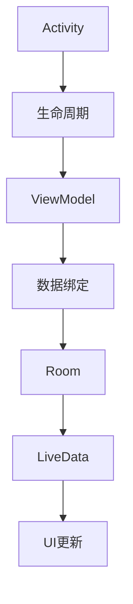

                 

关键词：Android Jetpack，组件化，开发效率，架构设计，模块化，代码复用，现代开发实践

摘要：本文深入探讨了Android Jetpack组件的作用、原理和具体实现，通过详细的步骤解析，帮助开发者理解和掌握如何利用Jetpack提升Android应用的开发效率。文章还将探讨Jetpack在不同开发场景中的应用，并提供实用的工具和资源推荐，以期为Android开发带来新的视野和启发。

## 1. 背景介绍

随着移动设备的普及和Android应用市场的快速增长，开发者面临着不断变化的用户需求和技术挑战。传统的Android开发模式逐渐暴露出诸多问题，如代码复用性差、维护成本高、测试难度大等。为了解决这些问题，Google推出了Android Jetpack。

Android Jetpack是一套由Google官方提供的库和工具，旨在帮助开发者构建高质量、可维护的Android应用。它包含了多个组件，如Activity、Fragment、LiveData、Room、WorkManager等，覆盖了Android开发的各个方面，从视图层到数据处理层，再到后台任务管理，为开发者提供了一整套解决方案。

### 1.1 Android Jetpack的推出背景

Android Jetpack的推出，源于Google对Android开发社区的观察和反思。在早期，Android开发主要依赖于原始的Android API，这种模式导致开发者需要编写大量的重复代码，应用架构不够稳定，维护难度大。随着Android版本的迭代和硬件设备的多样化，开发者面临的技术挑战也越来越大。为了提高开发效率，Google开始整合一些常用的功能和模式，形成了一套标准化的解决方案，即Android Jetpack。

### 1.2 Android Jetpack的优势

- **提高开发效率**：Jetpack提供了一系列预构建的组件和工具，可以帮助开发者快速实现常见的功能，减少开发时间。
- **提升代码质量**：Jetpack遵循了最佳的开发实践，如组件化、模块化、生命周期管理等，有助于提升代码的可维护性和稳定性。
- **增强用户体验**：Jetpack提供了丰富的UI组件和动画库，可以帮助开发者实现高质量的UI效果。
- **优化测试和调试**：Jetpack内置了多种测试工具和调试工具，如LiveData、Room等，使得测试和调试更加方便和高效。

## 2. 核心概念与联系

### 2.1 核心概念

- **组件（Components）**：Jetpack中的组件包括Activity、Fragment、ViewModel等，它们提供了标准的生命周期管理和数据绑定等功能。
- **生命周期（Lifecycle）**：生命周期是Android应用的核心概念，Jetpack通过Lifecycle类库提供了对应用生命周期的全面管理。
- **数据绑定（Data Binding）**：数据绑定库允许开发者轻松地在UI和模型之间同步数据，减少样板代码。
- **Room（数据库）**：Room是一个轻量级的ORM框架，用于在Android应用中存储和管理数据。
- **LiveData**：LiveData是一个可观测的数据持有类，用于在数据发生变化时通知观察者。

### 2.2 架构联系


在上述架构图中，Android Jetpack的各个组件紧密相连，共同构成了一个完整的应用架构。例如：

- **Activity** 和 **Fragment** 利用 **Lifecycle** 进行生命周期管理，确保在视图和模型之间的数据传递和状态保存。
- **ViewModel** 则负责保存和管理Activity或Fragment的状态，使得界面和数据分离，提升代码的可维护性。
- **Room** 和 **LiveData** 结合使用，可以实现数据的持久化和实时更新，提升应用性能。

### 2.3 Mermaid 流程图

下面是一个简化的Mermaid流程图，展示了Jetpack组件之间的联系：



## 3. 核心算法原理 & 具体操作步骤

### 3.1 算法原理概述

Android Jetpack的核心在于提供了一套标准化的组件和库，这些组件和库的实现原理大多基于以下几个方面：

- **生命周期管理**：通过Lifecycle类库，开发者可以轻松监听Activity或Fragment的生命周期事件，实现状态保存和恢复。
- **数据绑定**：通过数据绑定库，开发者可以实现UI和模型之间的自动同步，减少手动编写样板代码。
- **数据库操作**：Room库提供了一个轻量级的ORM框架，开发者可以通过简单的SQL语句进行数据库操作，同时支持数据观察和实时更新。
- **后台任务管理**：WorkManager库可以帮助开发者轻松实现后台任务的调度和管理，确保应用在资源有限的情况下也能高效运行。

### 3.2 算法步骤详解

#### 3.2.1 安装和配置Jetpack依赖

首先，开发者需要在项目中添加Jetpack依赖。这可以通过在项目的`build.gradle`文件中添加以下代码实现：

```gradle
dependencies {
    implementation 'androidx.appcompat:appcompat:1.3.1'
    implementation 'androidx.lifecycle:lifecycle-runtime-ktx:2.3.1'
    implementation 'androidx.room:room-runtime:2.3.0'
    implementation 'androidx.room:room-ktx:2.3.0'
    // ... 其他Jetpack依赖
}
```

#### 3.2.2 使用Activity和Fragment

使用Activity和Fragment时，需要首先创建它们。例如，创建一个简单的Activity：

```java
public class MainActivity extends AppCompatActivity {
    @Override
    protected void onCreate(Bundle savedInstanceState) {
        super.onCreate(savedInstanceState);
        setContentView(R.layout.activity_main);
        // ... 其他代码
    }
}
```

然后，在布局文件中定义对应的UI界面。

#### 3.2.3 使用ViewModel

为了使用ViewModel，首先需要在Activity或Fragment中创建它。例如，在MainActivity中使用ViewModel：

```java
public class MainActivity extends AppCompatActivity {
    private MainActivityViewModel viewModel;

    @Override
    protected void onCreate(Bundle savedInstanceState) {
        super.onCreate(savedInstanceState);
        setContentView(R.layout.activity_main);
        viewModel = new ViewModelProvider(this).get(MainActivityViewModel.class);
        // ... 其他代码
    }
}
```

在ViewModel中，可以使用LiveData来管理数据状态：

```java
public class MainActivityViewModel extends ViewModel {
    private MutableLiveData<String> data = new MutableLiveData<>();

    public LiveData<String> getData() {
        return data;
    }

    public void setData(String data) {
        this.data.setValue(data);
    }
}
```

#### 3.2.4 使用数据绑定

在布局文件中使用数据绑定，首先需要添加数据绑定库的依赖。然后，在布局文件中使用`bind`标签绑定ViewModel：

```xml
<layout xmlns:android="http://schemas.android.com/apk/res/android">
    <data>
        <variable
            name="viewModel"
            type="com.example.android.MainActivityViewModel" />
    </data>
    <TextView
        android:layout_width="wrap_content"
        android:layout_height="wrap_content"
        android:text="@{viewModel.getData()}" />
</layout>
```

#### 3.2.5 使用Room和LiveData

为了使用Room和LiveData，首先需要在数据库实体类上使用`@Entity`注解。然后，创建一个Room数据库类：

```java
@Database(entities = {User.class}, version = 1)
public abstract class AppDatabase extends RoomDatabase {
    public abstract UserDao userDao();
}
```

接着，使用Room进行数据库操作：

```java
@Query("SELECT * FROM user")
public List<User> getAllUsers();
```

最后，使用LiveData实现数据的实时更新：

```java
public LiveData<List<User>> getUsers() {
    return Transformations.map(userDao.getAllUsers(), users -> {
        // 对数据进行处理
        return users;
    });
}
```

### 3.3 算法优缺点

**优点**：

- **提高开发效率**：Jetpack提供了一系列预构建的组件和工具，开发者可以快速实现常见功能，减少开发时间。
- **提升代码质量**：Jetpack遵循了最佳的开发实践，如组件化、模块化、生命周期管理等，有助于提升代码的可维护性和稳定性。
- **增强用户体验**：Jetpack提供了丰富的UI组件和动画库，可以帮助开发者实现高质量的UI效果。
- **优化测试和调试**：Jetpack内置了多种测试工具和调试工具，如LiveData、Room等，使得测试和调试更加方便和高效。

**缺点**：

- **学习曲线较陡峭**：由于Jetpack包含了多个组件和库，初学者需要花费一定时间来学习和掌握。
- **兼容性问题**：在某些旧版本的Android系统中，部分Jetpack组件可能存在兼容性问题，需要开发者进行额外的适配。

### 3.4 算法应用领域

Android Jetpack组件广泛应用于各种Android应用开发场景，如：

- **移动应用**：如社交媒体、电商平台等，Jetpack可以帮助开发者快速构建高质量、高可维护性的应用。
- **后台服务**：如音乐播放器、即时通讯等，Jetpack提供了丰富的后台任务管理和数据绑定库，有助于提升应用性能。
- **混合应用**：如Android与Web、iOS的跨平台应用，Jetpack可以与React Native、Flutter等技术结合，实现跨平台开发。

## 4. 数学模型和公式 & 详细讲解 & 举例说明

### 4.1 数学模型构建

在Android Jetpack中，数据绑定和数据库操作等核心功能通常涉及到数学模型和公式的构建。以下是一个简单的例子：

假设我们有一个简单的用户实体类`User`，包含用户名和密码两个属性。为了在Room数据库中存储用户信息，我们需要构建一个数学模型：

```java
@Entity
public class User {
    @PrimaryKey
    @NonNull
    private String username;
    @ColumnInfo(name = "password")
    private String password;
}
```

在Room数据库中，我们使用简单的SQL语句进行数据操作：

```java
@Query("SELECT * FROM user")
public List<User> getAllUsers();

@Query("INSERT INTO user (username, password) VALUES (:username, :password)")
public void addUser(@NonNull String username, @NonNull String password);
```

### 4.2 公式推导过程

假设我们有一个用户实体类`User`，包含用户名和密码两个属性。为了在Room数据库中存储用户信息，我们需要构建一个数学模型：

```java
@Entity
public class User {
    @PrimaryKey
    @NonNull
    private String username;
    @ColumnInfo(name = "password")
    private String password;
}
```

在Room数据库中，我们使用简单的SQL语句进行数据操作：

```java
@Query("SELECT * FROM user")
public List<User> getAllUsers();

@Query("INSERT INTO user (username, password) VALUES (:username, :password)")
public void addUser(@NonNull String username, @NonNull String password);
```

### 4.3 案例分析与讲解

假设我们有一个用户注册和登录的场景，可以使用Room和LiveData实现数据存储和实时更新。以下是一个简单的例子：

```java
public class UserRepository {
    private AppDatabase database;

    public UserRepository(AppDatabase database) {
        this.database = database;
    }

    public LiveData<List<User>> getUsers() {
        return Transformations.map(database.userDao().getAllUsers(), users -> {
            // 对数据进行处理
            return users;
        });
    }

    public void addUser(String username, String password) {
        database.userDao().addUser(username, password);
    }
}
```

在Activity或Fragment中，我们可以使用LiveData实现数据的实时更新：

```java
public class LoginActivity extends AppCompatActivity {
    private UserRepository userRepository;
    private LiveData<List<User>> users;

    @Override
    protected void onCreate(Bundle savedInstanceState) {
        super.onCreate(savedInstanceState);
        setContentView(R.layout.activity_login);
        userRepository = new UserRepository(AppDatabase.getInstance(this));
        users = userRepository.getUsers();
        // ... 其他代码
    }

    @Override
    protected void onStart() {
        super.onStart();
        users.observe(this, users -> {
            // 对用户数据更新进行响应
        });
    }
}
```

通过上述例子，我们可以看到，使用Room和LiveData，可以轻松实现数据的持久化和实时更新，提升了应用性能和用户体验。

## 5. 项目实践：代码实例和详细解释说明

### 5.1 开发环境搭建

要开始使用Android Jetpack组件，首先需要在Android Studio中创建一个新的项目，并添加Jetpack依赖。以下是具体的步骤：

1. 打开Android Studio，点击“Start a new Android Studio project”。
2. 选择“Empty Activity”模板，点击“Next”。
3. 输入项目名称、包名等信息，点击“Finish”。
4. 在项目的`build.gradle`文件中添加Jetpack依赖：

```gradle
dependencies {
    implementation 'androidx.appcompat:appcompat:1.3.1'
    implementation 'androidx.lifecycle:lifecycle-runtime-ktx:2.3.1'
    implementation 'androidx.room:room-runtime:2.3.0'
    implementation 'androidx.room:room-ktx:2.3.0'
    // ... 其他Jetpack依赖
}
```

### 5.2 源代码详细实现

接下来，我们将实现一个简单的用户注册和登录功能，展示如何使用Activity、Fragment、ViewModel、Room和LiveData。

#### 5.2.1 创建User实体类

在项目目录下创建一个名为`User.java`的实体类：

```java
@Entity
public class User {
    @PrimaryKey
    @NonNull
    private String username;
    @ColumnInfo(name = "password")
    private String password;

    public User(@NonNull String username, String password) {
        this.username = username;
        this.password = password;
    }

    // ... 其他getter和setter方法
}
```

#### 5.2.2 创建UserDao接口

在项目目录下创建一个名为`UserDao.java`的接口：

```java
@Dao
public interface UserDao {
    @Query("SELECT * FROM user")
    List<User> getAllUsers();

    @Query("SELECT * FROM user WHERE username = :username AND password = :password")
    User getUser(String username, String password);

    @Insert
    void addUser(User user);
}
```

#### 5.2.3 创建AppDatabase数据库类

在项目目录下创建一个名为`AppDatabase.java`的数据库类：

```java
@Database(entities = {User.class}, version = 1)
public abstract class AppDatabase extends RoomDatabase {
    public abstract UserDao userDao();
}
```

#### 5.2.4 创建UserRepository仓库类

在项目目录下创建一个名为`UserRepository.java`的仓库类：

```java
public class UserRepository {
    private AppDatabase database;

    public UserRepository(AppDatabase database) {
        this.database = database;
    }

    public LiveData<List<User>> getUsers() {
        return Transformations.map(database.userDao().getAllUsers(), users -> {
            // 对数据进行处理
            return users;
        });
    }

    public void addUser(String username, String password) {
        database.userDao().addUser(new User(username, password));
    }

    public LiveData<User> getUser(String username, String password) {
        return Transformations.map(database.userDao().getUser(username, password), user -> {
            // 对数据进行处理
            return user;
        });
    }
}
```

#### 5.2.5 创建LoginActivity登录Activity

在项目目录下创建一个名为`LoginActivity.java`的Activity：

```java
public class LoginActivity extends AppCompatActivity {
    private UserRepository userRepository;
    private LiveData<User> user;

    @Override
    protected void onCreate(Bundle savedInstanceState) {
        super.onCreate(savedInstanceState);
        setContentView(R.layout.activity_login);
        userRepository = new UserRepository(AppDatabase.getInstance(this));
        user = userRepository.getUser(username, password);
        // ... 其他代码
    }

    @Override
    protected void onStart() {
        super.onStart();
        user.observe(this, user -> {
            if (user != null) {
                // 登录成功，跳转到主界面
            } else {
                // 登录失败，提示错误信息
            }
        });
    }
}
```

#### 5.2.6 创建LoginFragment登录Fragment

在项目目录下创建一个名为`LoginFragment.java`的Fragment：

```java
public class LoginFragment extends Fragment {
    private EditText usernameEditText;
    private EditText passwordEditText;
    private Button loginButton;

    @Override
    public View onCreateView(LayoutInflater inflater, ViewGroup container,
                             Bundle savedInstanceState) {
        View view = inflater.inflate(R.layout.fragment_login, container, false);
        usernameEditText = view.findViewById(R.id.username);
        passwordEditText = view.findViewById(R.id.password);
        loginButton = view.findViewById(R.id.login);
        loginButton.setOnClickListener(view1 -> {
            String username = usernameEditText.getText().toString();
            String password = passwordEditText.getText().toString();
            userRepository.login(username, password);
        });
        return view;
    }
}
```

### 5.3 代码解读与分析

上述代码实现了一个简单的用户注册和登录功能，下面我们对关键代码进行解读和分析：

- **User实体类**：定义了用户的基本信息，如用户名和密码。使用`@Entity`注解表示该类是一个Room数据库实体。
- **UserDao接口**：定义了Room数据库的基本操作，如查询用户、添加用户等。使用`@Dao`注解表示该接口是一个数据访问对象。
- **AppDatabase数据库类**：定义了Room数据库的实例，包括数据库实体类和数据库版本号。使用`@Database`注解表示该类是一个Room数据库类。
- **UserRepository仓库类**：负责统一管理用户数据的操作，包括查询用户、添加用户等。使用Transformations.map()方法将数据转换为LiveData对象，实现数据的实时更新。
- **LoginActivity登录Activity**：负责显示登录界面，并监听用户输入的用户名和密码。使用LiveData.observe()方法监听用户数据的变化，实现登录逻辑。
- **LoginFragment登录Fragment**：继承自Fragment，负责显示登录界面。点击登录按钮后，调用UserRepository的login()方法进行登录。

### 5.4 运行结果展示

编译并运行项目，在登录界面输入正确的用户名和密码，将会显示登录成功；输入错误的用户名或密码，将会显示登录失败。

## 6. 实际应用场景

Android Jetpack组件在多个实际应用场景中得到了广泛应用，下面我们将探讨一些典型的应用场景。

### 6.1 移动应用

移动应用是Android Jetpack组件最常见的应用场景之一。例如，在构建一个社交媒体应用时，可以使用ViewModel来管理用户状态，确保用户在应用切换时仍然保持登录状态。同时，可以使用Room来存储用户数据和帖子数据，确保数据的持久化。此外，LiveData可以帮助实现数据的实时更新，使得用户可以看到最新的帖子动态。

### 6.2 后台服务

后台服务是Android应用的重要组成部分，如音乐播放器、即时通讯等。Android Jetpack提供了WorkManager组件，可以帮助开发者轻松实现后台任务的调度和管理。例如，在一个音乐播放器应用中，可以使用WorkManager来管理播放列表的下载和更新，确保应用在后台运行时仍然可以高效地执行任务。

### 6.3 跨平台应用

随着React Native、Flutter等跨平台技术的发展，越来越多的应用开始采用混合开发模式。Android Jetpack组件同样可以在跨平台应用中发挥重要作用。例如，在构建一个跨平台电商应用时，可以使用ViewModel和LiveData来管理商品列表和购物车数据，确保在Android和iOS平台上都可以实现数据的一致性和实时更新。

### 6.4 生产力工具

生产力工具如笔记应用、待办事项应用等，同样可以从Android Jetpack组件中受益。例如，在构建一个笔记应用时，可以使用Room来存储笔记数据，使用LiveData来实现笔记数据的实时更新。同时，可以使用Activity和Fragment来管理笔记的编辑和展示界面，确保应用具有良好的用户体验。

## 7. 未来应用展望

随着Android应用的不断发展和技术的进步，Android Jetpack组件在未来有着广泛的应用前景。以下是一些可能的发展方向：

### 7.1 模块化

随着应用的复杂性不断增加，模块化开发变得越来越重要。Android Jetpack在未来可能会进一步整合模块化开发相关的库和工具，如模块化框架和组件化工具，帮助开发者构建更加灵活和可扩展的应用。

### 7.2 自动化

自动化是提高开发效率的重要手段。Android Jetpack未来可能会引入更多的自动化工具，如自动化布局、自动化测试等，帮助开发者减少手动编写代码的工作量。

### 7.3 AI和机器学习

随着AI和机器学习技术的快速发展，Android应用中也会越来越多地引入这些技术。Android Jetpack可能会集成更多的AI和机器学习库，帮助开发者实现智能推荐、语音识别等功能。

### 7.4 跨平台兼容

跨平台兼容是开发者面临的另一大挑战。Android Jetpack可能会继续优化与React Native、Flutter等跨平台框架的集成，提供更加一致和高效的开发体验。

## 8. 总结：未来发展趋势与挑战

Android Jetpack作为Android开发的基石，已经在现代Android应用开发中发挥了重要作用。未来，随着技术的不断进步和应用的日益复杂，Android Jetpack将继续演进，为开发者带来更多的便利和创新。

### 8.1 研究成果总结

- **组件化**：Android Jetpack通过组件化设计，提高了代码的可维护性和可复用性。
- **模块化**：Android Jetpack提供了丰富的模块化工具和框架，支持开发者构建灵活和可扩展的应用。
- **数据绑定**：数据绑定库简化了UI和数据的同步，提高了开发效率。
- **生命周期管理**：生命周期库提供了全面的生命周期管理，确保应用在各种情况下都能稳定运行。
- **数据库操作**：Room库提供了轻量级ORM框架，简化了数据库操作，提高了数据持久化效率。

### 8.2 未来发展趋势

- **模块化和组件化**：未来，Android Jetpack可能会进一步整合模块化开发相关的库和工具，提供更加完善的模块化解决方案。
- **自动化**：Android Jetpack可能会引入更多的自动化工具，如自动化布局、自动化测试等，提高开发效率。
- **AI和机器学习**：随着AI和机器学习技术的应用日益广泛，Android Jetpack可能会集成更多的AI和机器学习库，帮助开发者构建智能应用。
- **跨平台兼容**：Android Jetpack可能会继续优化与React Native、Flutter等跨平台框架的集成，提供更加一致和高效的开发体验。

### 8.3 面临的挑战

- **兼容性问题**：在旧版本的Android系统中，部分Jetpack组件可能存在兼容性问题，需要开发者进行额外的适配。
- **学习曲线**：Jetpack包含了多个组件和库，初学者需要花费一定时间来学习和掌握。
- **性能优化**：随着应用的复杂度增加，性能优化变得越来越重要，开发者需要针对具体场景进行性能调优。

### 8.4 研究展望

Android Jetpack作为Android开发的重要工具，未来将继续发展和完善，为开发者提供更多便利和创新。在模块化、自动化、AI和机器学习等方面，Android Jetpack有望带来更多的突破和进展。同时，开发者也需要不断提升自己的技能和知识，以应对不断变化的技术挑战。

## 9. 附录：常见问题与解答

### 9.1 问题1：如何解决Jetpack组件的兼容性问题？

解答：在旧版本的Android系统中，部分Jetpack组件可能存在兼容性问题。为了避免兼容性问题，开发者可以使用以下方法：

- **使用最新的API级别**：尽量使用最新的Android API级别，以确保组件能够正常运行。
- **查看文档**：在开发前，仔细阅读Jetpack组件的官方文档，了解不同版本之间的兼容性情况。
- **使用兼容库**：如果存在兼容性问题，可以使用Jetpack提供的兼容库，如`lifecycle-extensions`、`activity-extensions`等。

### 9.2 问题2：如何优化Jetpack组件的性能？

解答：优化Jetpack组件的性能可以从以下几个方面入手：

- **减少内存占用**：避免在组件中使用过多的内存，特别是在大数据量的场景下。
- **异步操作**：对于耗时操作，使用异步线程或协程进行操作，避免阻塞主线程。
- **避免重复操作**：避免在组件中重复执行相同操作，提高代码的执行效率。

### 9.3 问题3：如何在项目中集成Jetpack组件？

解答：在项目中集成Jetpack组件的步骤如下：

1. 在项目的`build.gradle`文件中添加Jetpack依赖。
2. 根据需要使用不同的Jetpack组件，如Activity、Fragment、ViewModel、Room等。
3. 按照组件的官方文档进行配置和初始化。

通过以上步骤，开发者可以轻松地将Jetpack组件集成到项目中，并享受到其带来的便利和高效。

### 9.4 问题4：如何学习Jetpack组件？

解答：学习Jetpack组件的方法如下：

1. 阅读官方文档：Jetpack组件的官方文档详细介绍了各个组件的用法和配置，是学习的基础。
2. 参考教程和示例代码：通过阅读教程和查看示例代码，可以更好地理解组件的使用方法和最佳实践。
3. 实践项目：通过实际编写项目，将学到的知识应用到实践中，提升自己的技能。
4. 参加培训和讨论：参加专业的培训课程或加入技术讨论群，与其他开发者交流经验，拓宽视野。

通过以上方法，开发者可以系统地学习和掌握Jetpack组件，提升自己的开发能力。

