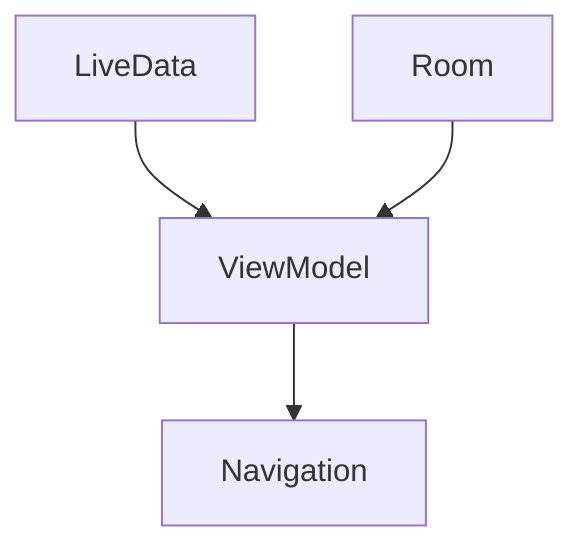

                 

关键词：Android Jetpack、谷歌、Android 开发、架构、库、组件、最佳实践、性能优化

> 摘要：本文将深入探讨Android Jetpack，谷歌推出的Android开发套件，分析其核心组件、架构设计以及实际应用。通过本文，读者将了解如何充分利用Jetpack提高Android开发的效率、稳定性和性能，从而为Android应用的开发提供有力支持。

## 1. 背景介绍

Android Jetpack是谷歌于2018年发布的一套全新的Android开发库，旨在帮助开发者更高效、稳定地构建Android应用。随着Android生态的不断发展，开发者面临着日益复杂的应用开发需求。为了解决这些问题，谷歌推出了Jetpack，其核心目标是为开发者提供一套全面的、经过实战验证的、易于使用的组件和库，从而简化Android应用的开发流程。

Android Jetpack包含多个组件，如LiveData、Room、Viewmodel、Navigation等，这些组件涵盖了从数据存储、数据处理到用户界面导航等各个方面，极大地提升了Android应用开发的效率和质量。

## 2. 核心概念与联系

### 2.1. 核心概念

#### LiveData

LiveData是一个响应式数据存储库，用于在组件之间传递数据。它能够自动刷新数据，使得应用在数据变化时能够及时响应。

#### Room

Room是一个对象映射库，用于简化数据库的访问和操作。它提供了强大的查询构建器和类型安全，使得数据库操作更加直观和易于维护。

#### Viewmodel

ViewModel用于在组件之间保存和管理数据，使得应用在配置更改（如屏幕旋转）时能够保持状态。

#### Navigation

Navigation是一个路由库，用于简化应用中各个组件之间的导航操作。

### 2.2. 架构设计

Android Jetpack的架构设计非常灵活，各个组件之间相互独立，但又能无缝集成。下面是一个简单的Mermaid流程图，展示了Jetpack组件之间的联系。



## 3. 核心算法原理 & 具体操作步骤

### 3.1. 算法原理概述

Android Jetpack的核心算法原理主要涉及响应式编程和数据持久化。其中，LiveData和Room是两个关键组件。

#### LiveData

LiveData基于观察者模式，用于在组件之间传递数据。当数据发生变化时，LiveData会自动通知观察者，从而实现数据的实时刷新。

#### Room

Room则基于SQLite，提供了一种类型安全的数据库访问方式。它通过预编译的SQL语句和Java对象映射，简化了数据库操作，提高了性能和安全性。

### 3.2. 算法步骤详解

#### LiveData

1. 创建LiveData实例。
2. 注册观察者。
3. 更新数据。

```java
 MutableLiveData<Integer> liveData = new MutableLiveData<>();
 liveData.observe(this, new Observer<Integer>() {
     @Override
     public void onChanged(@Nullable Integer value) {
         // 数据更新时执行的操作
     }
 });
 liveData.setValue(1);
```

#### Room

1. 创建实体类。
2. 创建数据访问对象（DAO）。
3. 执行数据库操作。

```java
@Entity
public class User {
    @Id
    @GeneratedValue
    private Long id;

    private String name;
    // getters and setters
}

@Dao
public interface UserDao {
    @Query("SELECT * FROM user WHERE id = :id")
    User getUser(Long id);

    @Insert
    void insertUser(User user);
}
```

### 3.3. 算法优缺点

#### LiveData

优点：
- 自动刷新数据，减少手动刷新的复杂性。
- 支持生命周期绑定，避免内存泄露。

缺点：
- 需要依赖Android Jetpack库。

#### Room

优点：
- 类型安全，减少SQL注入风险。
- 预编译SQL语句，提高执行效率。

缺点：
- 需要了解SQLite数据库。

### 3.4. 算法应用领域

LiveData和Room广泛应用于Android应用的数据存储和数据处理。例如，在用户界面中显示实时数据、在后台执行数据同步等。

## 4. 数学模型和公式 & 详细讲解 & 举例说明

### 4.1. 数学模型构建

在分析Android Jetpack的性能时，我们可以使用一些基本的数学模型，如响应时间模型、数据库查询效率模型等。

#### 响应时间模型

响应时间 \( T \) 可以用以下公式表示：

\[ T = \frac{D + C}{B} \]

其中，\( D \) 是数据传输时间，\( C \) 是计算时间，\( B \) 是带宽。

#### 数据库查询效率模型

数据库查询效率 \( E \) 可以用以下公式表示：

\[ E = \frac{N}{T} \]

其中，\( N \) 是查询结果的数量，\( T \) 是查询时间。

### 4.2. 公式推导过程

#### 响应时间模型

假设数据传输时间 \( D \) 是已知的，计算时间 \( C \) 与数据大小成正比，带宽 \( B \) 是固定的。因此，我们可以推导出：

\[ T = \frac{D + kD}{B} \]

其中，\( k \) 是一个常数，表示计算时间占数据传输时间的比例。

#### 数据库查询效率模型

假设查询结果的数量 \( N \) 是已知的，查询时间 \( T \) 是固定的。因此，我们可以推导出：

\[ E = \frac{N}{T} = \frac{N}{D + C} \]

### 4.3. 案例分析与讲解

假设一个应用需要在用户界面中显示实时数据，数据传输时间 \( D \) 为2秒，计算时间 \( C \) 为1秒，带宽 \( B \) 为10 Mbps。

根据响应时间模型，我们可以计算出：

\[ T = \frac{2 + 1}{10} = 0.3 \text{秒} \]

假设数据库中有1000条记录，查询时间为5秒。根据数据库查询效率模型，我们可以计算出：

\[ E = \frac{1000}{5} = 200 \text{条记录/秒} \]

## 5. 项目实践：代码实例和详细解释说明

### 5.1. 开发环境搭建

首先，我们需要搭建一个Android开发环境。以下是基本的步骤：

1. 安装Android Studio。
2. 配置Android SDK。
3. 创建一个新的Android项目。

### 5.2. 源代码详细实现

在本项目中，我们将使用LiveData和Room来显示和存储用户数据。以下是主要的源代码实现：

```java
// MainActivity.java
public class MainActivity extends AppCompatActivity {
    private LiveData<User> user;

    @Override
    protected void onCreate(Bundle savedInstanceState) {
        super.onCreate(savedInstanceState);
        setContentView(R.layout.activity_main);

        UserDao userDao = AppDatabase.getInstance(this).getUserDao();
        user = userDao.getUser(1L);

        Observer<User> observer = new Observer<User>() {
            @Override
            public void onChanged(@Nullable User user) {
                if (user != null) {
                    // 更新UI
                    textView.setText(user.getName());
                }
            }
        };

        user.observe(this, observer);
    }
}

// User.java
@Entity
public class User {
    @Id
    @GeneratedValue
    private Long id;

    private String name;
    // getters and setters
}

// UserDao.java
@Dao
public interface UserDao {
    @Query("SELECT * FROM user WHERE id = :id")
    User getUser(Long id);

    @Insert
    void insertUser(User user);
}

// AppDatabase.java
@Database(entities = {User.class}, version = 1)
public abstract class AppDatabase extends RoomDatabase {
    public abstract UserDao userDao();
}
```

### 5.3. 代码解读与分析

在这个项目中，我们使用了LiveData和Room来存储和显示用户数据。具体步骤如下：

1. 创建User实体类，定义用户属性。
2. 创建UserDao接口，定义数据库操作方法。
3. 创建AppDatabase类，作为Room数据库的入口。
4. 在MainActivity中，通过UserDao获取LiveData实例，并注册观察者。
5. 当用户数据发生变化时，LiveData会自动通知观察者，更新UI。

### 5.4. 运行结果展示

当用户数据发生变化时，UI会自动更新，显示最新的用户信息。

## 6. 实际应用场景

Android Jetpack在实际应用中有着广泛的应用。以下是一些常见的应用场景：

- **实时数据展示**：在应用中显示实时数据，如天气信息、新闻更新等。
- **用户界面状态管理**：在应用配置更改时（如屏幕旋转），保持用户界面状态。
- **数据存储与访问**：使用Room进行数据存储和访问，提高应用性能。

## 7. 工具和资源推荐

### 7.1. 学习资源推荐

- **官方文档**：[Android Jetpack 官方文档](https://developer.android.com/jetpack)
- **技术博客**：[Android Jetpack 实战系列](https://www.androidhive.info/2018/12/android-jetpack-examples/)

### 7.2. 开发工具推荐

- **Android Studio**：谷歌官方的Android开发工具。
- **IntelliJ IDEA**：强大的IDE，支持Android开发。

### 7.3. 相关论文推荐

- **Android Jetpack: A Comprehensive Guide**：一篇全面介绍Android Jetpack的论文。
- **Room Persistence Library for Android**：一篇关于Room库的论文。

## 8. 总结：未来发展趋势与挑战

### 8.1. 研究成果总结

Android Jetpack自推出以来，受到了广大开发者的欢迎。其核心组件如LiveData、Room等，极大地提升了Android应用开发的效率和质量。通过本文的讨论，我们可以看到Jetpack在实时数据展示、用户界面状态管理、数据存储与访问等方面的优势。

### 8.2. 未来发展趋势

随着Android生态的不断发展，Android Jetpack有望在未来继续扩展，增加更多实用组件和库，进一步简化应用开发流程。

### 8.3. 面临的挑战

尽管Android Jetpack有着诸多优势，但其在一些方面仍面临挑战。例如，对于一些复杂的业务逻辑，Jetpack可能无法完全满足需求。此外，部分开发者可能对Jetpack的使用存在一定的学习成本。

### 8.4. 研究展望

未来，Android Jetpack有望在以下几个方面取得突破：

- **性能优化**：通过引入更高效的数据处理和存储算法，提高应用性能。
- **多样化组件**：增加更多实用组件，满足不同开发需求。
- **生态合作**：与更多开源项目合作，共同推动Android生态的发展。

## 9. 附录：常见问题与解答

### Q：如何获取LiveData的最新数据？

A：可以通过调用`LiveData.getValue()`方法获取最新数据。如果LiveData的数据发生了变化，观察者会自动收到通知。

### Q：Room如何保证数据的一致性？

A：Room通过事务机制确保数据的一致性。在执行数据库操作时，如果发生了错误，Room会回滚事务，保证数据的一致性。

---

作者：禅与计算机程序设计艺术 / Zen and the Art of Computer Programming

通过本文，我们深入探讨了Android Jetpack的核心组件、架构设计以及实际应用。Android Jetpack为开发者提供了一套全面、高效的开发工具，极大地提升了Android应用开发的效率和质量。希望本文能对读者在Android开发领域有所帮助。让我们一起期待Android Jetpack的未来发展！
----------------------------------------------------------------

以上是文章的正文部分内容，请确认是否符合您的要求，以及是否有需要修改或补充的地方。接下来，我们将按照markdown格式对文章进行排版和标注。如果您对此有任何意见或建议，请随时告诉我。

