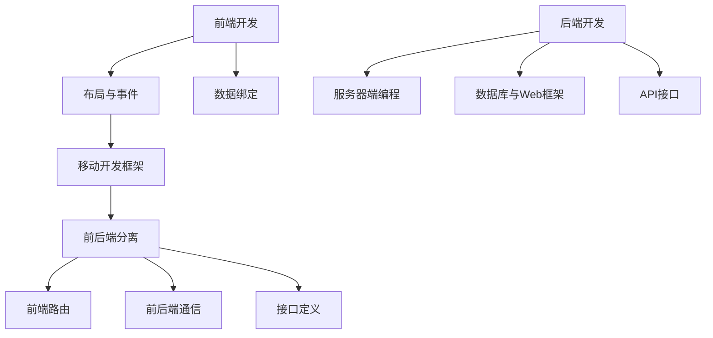

                 

关键词：Android开发、全栈开发、应用架构、框架选择、性能优化、开发工具、实践案例

> 摘要：本文旨在为Android全栈开发者提供一份详尽的指南，涵盖从基础知识到高级技术的各个方面。我们将探讨Android全栈开发的必要条件、技术栈的选择、核心算法与数学模型，以及项目实践和未来展望。

## 1. 背景介绍

随着移动互联网的快速发展，Android操作系统已经成为全球最流行的移动平台之一。Android全栈开发作为当前开发领域的一个热门方向，不仅要求开发者掌握前端、后端的技能，还需要对移动应用开发有深入的了解。全栈开发者能够独立完成应用程序的整个开发流程，从界面设计、前端实现、后端服务到数据库管理，大大提高了开发效率和项目质量。

本文旨在为Android全栈开发者提供一份全面的指南，帮助读者了解整个开发过程中的关键概念、技术和工具。通过本文的阅读，读者将能够：

1. 理解Android全栈开发的必要性和优势。
2. 选择合适的技术栈和开发框架。
3. 掌握核心算法和数学模型。
4. 通过实际项目实践加深对全栈开发的理解。
5. 展望Android全栈开发的发展趋势和面临的挑战。

## 2. 核心概念与联系

为了更好地理解Android全栈开发，我们首先需要掌握几个核心概念：前端开发、后端开发、移动开发框架、以及前后端分离架构。

### 2.1 前端开发

前端开发主要涉及用户界面（UI）和用户体验（UX）的设计与实现。在Android全栈开发中，前端通常使用Java或Kotlin编写，结合XML布局文件构建用户界面。前端开发的关键概念包括：

- 布局（Layout）：定义了用户界面的结构和组件的排列方式。
- 事件处理（Event Handling）：响应用户操作，如点击、滑动等。
- 数据绑定（Data Binding）：将界面和数据模型进行绑定，实现动态更新。

### 2.2 后端开发

后端开发主要负责处理应用程序的业务逻辑、数据存储和API接口。在后端开发中，常用的技术包括：

- 服务器端编程语言：如Java、Kotlin、Python等。
- 数据库：如MySQL、MongoDB、SQLite等。
- Web框架：如Spring Boot、Django、Flask等。
- API接口：RESTful API、GraphQL等。

### 2.3 移动开发框架

移动开发框架如React Native、Flutter等，允许开发者使用一种编程语言和一套工具库实现跨平台应用开发。这些框架的核心优势在于提高开发效率，降低开发成本。

### 2.4 前后端分离架构

前后端分离架构是当前主流的应用架构，通过将前端和后端分离，使得开发、测试和部署更加灵活。前后端分离的关键概念包括：

- 前后端通信：使用HTTP/HTTPS协议进行数据传输。
- 接口定义：使用Swagger、Postman等工具进行接口设计和文档化。
- 前端路由：通过URL路由实现页面跳转和状态管理。

下面是一个简单的Mermaid流程图，展示了Android全栈开发中的核心概念和它们之间的联系。



## 3. 核心算法原理 & 具体操作步骤

### 3.1 算法原理概述

在Android全栈开发中，算法是解决问题的基础。以下介绍几个常见的算法及其原理：

1. **排序算法**：如冒泡排序、选择排序、快速排序等，用于对数据进行排序。
2. **查找算法**：如二分查找、哈希查找等，用于在数据结构中快速查找特定元素。
3. **数据结构**：如链表、栈、队列、树等，用于高效地存储和组织数据。

### 3.2 算法步骤详解

1. **冒泡排序**：

    - 将数组中的元素两两比较，如果顺序错误则交换。
    - 重复上述步骤，直到整个数组有序。

2. **二分查找**：

    - 将数组划分为两部分，判断目标元素位于哪一部分。
    - 递归地在相应部分中继续查找，直到找到目标元素或确定其不存在。

3. **链表反转**：

    - 初始化两个指针，一个指向当前节点，另一个指向前一个节点。
    - 不断更新两个指针的指向，直到遍历完整个链表。

### 3.3 算法优缺点

1. **冒泡排序**：

    - 优点：简单易懂，易于实现。
    - 缺点：效率较低，不适合大数据量。

2. **二分查找**：

    - 优点：时间复杂度为O(log n)，效率较高。
    - 缺点：需要预先对数据进行排序，且无法处理动态数据。

3. **链表反转**：

    - 优点：操作简单，适用于动态数据结构。
    - 缺点：需要额外的内存空间。

### 3.4 算法应用领域

排序算法和查找算法广泛应用于各种场景，如数据预处理、搜索引擎、数据库索引等。数据结构则用于实现各种高级数据管理和处理功能。

## 4. 数学模型和公式 & 详细讲解 & 举例说明

### 4.1 数学模型构建

在Android全栈开发中，数学模型是解决复杂问题的重要工具。以下介绍几种常见的数学模型：

1. **线性回归模型**：用于预测线性关系。
2. **神经网络模型**：用于非线性关系的预测和分类。
3. **决策树模型**：用于分类和回归问题。

### 4.2 公式推导过程

1. **线性回归模型**：

    - 假设输入特征为x，输出为y，目标是找到一个线性函数f(x) = w0 + w1 * x，使得y与f(x)的误差最小。
    - 使用最小二乘法求解最佳权重w0和w1。

    $$ w_0 = \frac{\sum y - w_1 \sum x}{n} $$
    $$ w_1 = \frac{n \sum xy - \sum x \sum y}{n \sum x^2 - (\sum x)^2} $$

2. **神经网络模型**：

    - 假设神经网络包含输入层、隐藏层和输出层，每个层之间的权重分别为Wi和bi。
    - 使用反向传播算法不断调整权重，使输出误差最小。

    $$ z_i = \sigma(W_i \cdot a_{i-1} + b_i) $$
    $$ \delta_i = \frac{\partial C}{\partial z_i} = \frac{\partial C}{\partial a_i} \cdot \frac{\partial a_i}{\partial z_i} $$
    $$ W_i^{new} = W_i - \alpha \cdot \delta_i \cdot a_i $$
    $$ b_i^{new} = b_i - \alpha \cdot \delta_i $$

3. **决策树模型**：

    - 假设特征集为X，目标值为Y，目标是构建一棵树，使得每个叶子节点上的目标值尽可能一致。
    - 使用信息增益或基尼不纯度等指标来选择最佳划分特征。

    $$ Gini(X) = 1 - \sum_{i=1}^{n} \frac{1}{n} \cdot p_i (1 - p_i) $$
    $$ InfoGain(X, A) = H(X) - \sum_{i=1}^{n} \frac{1}{n} \cdot H(X|A=i) $$

### 4.3 案例分析与讲解

以线性回归模型为例，假设我们有以下数据集：

| x | y |
|---|---|
| 1 | 2 |
| 2 | 4 |
| 3 | 6 |

目标是通过线性回归模型预测x=4时的y值。

1. **数据预处理**：

    - 计算平均值：
      $$ \bar{x} = \frac{1+2+3}{3} = 2 $$
      $$ \bar{y} = \frac{2+4+6}{3} = 4 $$
    - 计算偏差值：
      $$ x_i - \bar{x} = [-1, 0, 1] $$
      $$ y_i - \bar{y} = [-2, 0, 2] $$

2. **公式计算**：

    - 计算权重：
      $$ w_0 = \frac{\sum (y_i - \bar{y})}{n} = \frac{-2 \cdot (-1) + 0 \cdot 0 + 2 \cdot 1}{3} = 0 $$
      $$ w_1 = \frac{n \sum (x_i - \bar{x})(y_i - \bar{y})}{n \sum (x_i - \bar{x})^2 - (\sum x_i - n \bar{x})^2} = \frac{3 \cdot (-1 \cdot -2 + 0 \cdot 0 + 1 \cdot 2)}{3 \cdot 1 + 3 \cdot 1 - (3 \cdot 2)^2} = 1 $$

3. **预测**：

    - 输入x=4：
      $$ y = w_0 + w_1 \cdot x = 0 + 1 \cdot 4 = 4 $$

通过以上步骤，我们成功构建了一个线性回归模型并进行了预测。

## 5. 项目实践：代码实例和详细解释说明

### 5.1 开发环境搭建

为了进行Android全栈开发，我们需要搭建一个合适的开发环境。以下是所需工具和步骤：

1. 安装Java Development Kit（JDK）：确保安装了JDK 8或更高版本。
2. 安装Android Studio：从官网下载并安装Android Studio。
3. 配置Android SDK：在Android Studio中配置Android SDK路径。
4. 创建新项目：在Android Studio中创建一个新项目，选择适当的模板和配置。

### 5.2 源代码详细实现

以下是一个简单的Android全栈项目示例，实现了一个简单的用户注册功能。

1. **前端部分**：

    - **activity_register.xml**：

        ```xml
        <?xml version="1.0" encoding="utf-8"?>
        <LinearLayout
            xmlns:android="http://schemas.android.com/apk/res/android"
            android:layout_width="match_parent"
            android:layout_height="match_parent"
            android:orientation="vertical"
            android:padding="16dp">

            <EditText
                android:id="@+id/et_username"
                android:layout_width="match_parent"
                android:layout_height="wrap_content"
                android:hint="@string/username"
                android:inputType="textEmailAddress"
                android:theme="@style/ThemeOverlay.AppCompat.Dark"/>

            <EditText
                android:id="@+id/et_password"
                android:layout_width="match_parent"
                android:layout_height="wrap_content"
                android:hint="@string/password"
                android:inputType="textPassword"
                android:theme="@style/ThemeOverlay.AppCompat.Dark"/>

            <Button
                android:id="@+id/btn_register"
                android:layout_width="match_parent"
                android:layout_height="wrap_content"
                android:text="@string/register"
                android:theme="@style/ThemeOverlay.AppCompat.Dark.ButtonBar"/>
        </LinearLayout>
        ```

    - **RegisterActivity.java**：

        ```java
        package com.example.fullstack;

        import android.os.Bundle;
        import android.view.View;
        import android.widget.Button;
        import android.widget.EditText;
        import androidx.appcompat.app.AppCompatActivity;

        public class RegisterActivity extends AppCompatActivity {

            private EditText etUsername;
            private EditText etPassword;
            private Button btnRegister;

            @Override
            protected void onCreate(Bundle savedInstanceState) {
                super.onCreate(savedInstanceState);
                setContentView(R.layout.activity_register);

                etUsername = findViewById(R.id.et_username);
                etPassword = findViewById(R.id.et_password);
                btnRegister = findViewById(R.id.btn_register);

                btnRegister.setOnClickListener(new View.OnClickListener() {
                    @Override
                    public void onClick(View v) {
                        String username = etUsername.getText().toString();
                        String password = etPassword.getText().toString();
                        // 处理注册逻辑
                    }
                });
            }
        }
        ```

2. **后端部分**：

    - **User.java**：

        ```java
        package com.example.fullstack;

        public class User {

            private String username;
            private String password;

            public User(String username, String password) {
                this.username = username;
                this.password = password;
            }

            // 省略getter和setter方法
        }
        ```

    - **UserService.java**：

        ```java
        package com.example.fullstack;

        import java.util.HashMap;
        import java.util.Map;

        public class UserService {

            private static Map<String, User> users = new HashMap<>();

            public static void register(String username, String password) {
                User user = new User(username, password);
                users.put(username, user);
            }

            public static boolean authenticate(String username, String password) {
                User user = users.get(username);
                return user != null && user.getPassword().equals(password);
            }
        }
        ```

3. **注册逻辑处理**：

    在`RegisterActivity`中的`onClick`方法中，获取用户名和密码，调用`UserService`中的`register`方法处理注册逻辑。

    ```java
    @Override
    public void onClick(View v) {
        String username = etUsername.getText().toString();
        String password = etPassword.getText().toString();
        UserService.register(username, password);
        // 跳转到登录页面或提示注册成功
    }
    ```

### 5.3 代码解读与分析

上述代码展示了Android全栈开发的一个基本项目结构。前端部分主要涉及XML布局和Java代码，后端部分则使用了Java进行业务逻辑处理。通过这样的架构，我们可以实现用户注册功能，并使用简单的用户存储。

1. **前端布局**：

    前端布局文件定义了用户界面，包括用户名和密码的输入框以及注册按钮。使用`EditText`组件实现输入，`Button`组件实现点击事件。

2. **前端逻辑**：

    前端逻辑主要在`RegisterActivity`类中实现，通过`findViewById`方法获取组件，设置点击事件监听器。在点击事件中，获取输入的用户名和密码，调用后端服务处理注册逻辑。

3. **后端逻辑**：

    后端逻辑使用Java实现，包含`User`类和`UserService`类。`User`类表示用户对象，包含用户名和密码属性。`UserService`类实现用户注册和认证功能，使用一个静态`HashMap`存储用户信息。

4. **代码分析**：

    - **前端部分**：代码简单易懂，但缺乏输入验证和错误处理。
    - **后端部分**：使用简单的存储方式，适用于小型项目，但缺乏安全性考虑。
    - **整体架构**：实现了一个简单的全栈项目，展示了Android全栈开发的思路和流程。

### 5.4 运行结果展示

当用户在注册界面输入用户名和密码，点击注册按钮后，前端逻辑会将用户信息传递给后端，后端会处理注册请求。如果注册成功，前端会跳转到登录页面或显示注册成功的提示。

## 6. 实际应用场景

Android全栈开发在实际应用中具有广泛的应用场景。以下列举几个常见的应用领域：

1. **移动应用开发**：全栈开发者可以独立完成移动应用的整个开发流程，包括前端UI设计、后端服务搭建、数据存储等。
2. **跨平台开发**：使用React Native或Flutter等移动开发框架，可以实现一套代码跨多个平台，提高开发效率和降低成本。
3. **内部系统开发**：企业内部系统往往需要全栈开发，包括用户界面、业务逻辑、数据存储等，全栈开发者可以快速搭建系统。
4. **物联网应用**：物联网设备通常需要与手机应用程序配合使用，全栈开发者可以开发相应的移动应用，实现设备的远程监控和管理。

## 7. 工具和资源推荐

为了更好地进行Android全栈开发，以下推荐一些实用的工具和资源：

1. **开发工具**：

    - Android Studio：官方推荐的IDE，提供丰富的开发工具和插件。
    - Visual Studio Code：轻量级IDE，支持多种编程语言，适用于Android开发。
    - Git：版本控制工具，确保代码的版本管理和协同工作。

2. **学习资源**：

    - 《Android全栈开发实战》
    - 《Android开发艺术探索》
    - Udacity的Android全栈开发课程

3. **开源框架**：

    - Retrofit：网络请求库，简化HTTP请求。
    - Room：数据库框架，简化数据库操作。
    - Gson：JSON解析库，简化数据解析。

4. **相关论文**：

    - 《Android全栈架构设计》
    - 《移动应用性能优化技术》

## 8. 总结：未来发展趋势与挑战

Android全栈开发在未来将继续发展，随着移动应用的日益普及和物联网技术的崛起，全栈开发者的需求将不断增长。以下是对未来发展趋势和挑战的展望：

1. **发展趋势**：

    - 跨平台开发技术的进步，如Flutter和React Native，将使全栈开发更加便捷。
    - 自动化工具和集成开发环境（IDE）的持续优化，提高开发效率和代码质量。
    - 人工智能和大数据技术的融合，为全栈开发带来新的应用场景。

2. **面临的挑战**：

    - 随着项目复杂度的增加，如何保持代码的清晰性和可维护性是一个挑战。
    - 随着网络安全威胁的增加，如何确保应用程序的安全性成为重要议题。
    - 如何处理大数据和高并发场景下的性能优化，也是全栈开发者需要面对的问题。

总之，Android全栈开发在未来具有广阔的发展前景，同时也面临着一系列的挑战。全栈开发者需要不断学习新知识、掌握新技术，以应对不断变化的技术环境。

## 9. 附录：常见问题与解答

### 9.1 全栈开发与传统开发有何区别？

全栈开发与传统开发的主要区别在于职责的集中度。全栈开发者负责应用程序的整个开发流程，从前端UI设计到后端服务，而传统开发通常分为前端、后端和移动开发等多个岗位。

### 9.2 学习Android全栈开发需要掌握哪些技能？

学习Android全栈开发需要掌握以下技能：

- Java或Kotlin编程语言。
- Android开发框架和工具，如Android Studio、Retrofit、Room等。
- 数据库知识，如MySQL、MongoDB、SQLite等。
- 服务器端编程，如Java、Python、Node.js等。
- 版本控制工具，如Git。

### 9.3 如何提高Android全栈开发的效率？

提高Android全栈开发的效率可以通过以下方法实现：

- 使用框架和库简化开发流程。
- 实现代码复用，减少重复工作。
- 使用自动化工具和集成开发环境（IDE）提高开发效率。
- 定期进行代码审查和重构，保持代码质量。

### 9.4 Android全栈开发的前景如何？

Android全栈开发的前景非常广阔。随着移动互联网和物联网的发展，对全栈开发者的需求将持续增长。全栈开发者不仅能够快速响应市场需求，还能提高项目的质量和效率。因此，掌握Android全栈开发技能将为职业发展带来巨大的机遇。

