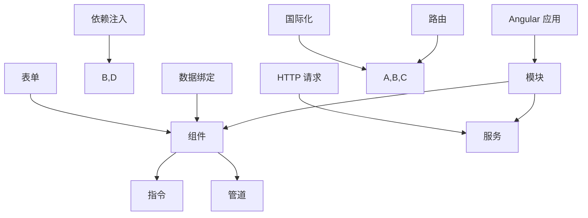

                 

关键词：Angular，前端开发，MVW 框架，Google，Web 应用

> 摘要：本文将深入探讨 Angular 框架的基础知识，包括其核心概念、原理、应用以及未来的发展趋势。我们将通过详细的讲解和实例演示，帮助读者全面了解和掌握 Angular 的使用。

## 1. 背景介绍

Angular 是 Google 开发的一款高效、灵活的前端开发框架，旨在帮助开发者构建动态、响应式和功能丰富的 Web 应用。自 2016 年以来，Angular 已成为全球最受欢迎的前端框架之一，广泛应用于各种规模的项目中。

### 1.1 Angular 的起源

Angular 的前身是 Google 于 2009 年推出的 AngularJS，它是一款基于 JavaScript 的框架，为开发者提供了一套完整的工具和组件，帮助简化 Web 开发过程。然而，随着时间的推移，AngularJS 的功能和性能逐渐不能满足开发者的需求，因此 Google 在 2016 年推出了全新的 Angular 框架。

### 1.2 Angular 的特点

- **声明式 UI 编程**：Angular 允许开发者使用声明式语法编写 UI，从而简化了界面开发过程，提高了开发效率。
- **双向数据绑定**：Angular 的双向数据绑定功能使得数据模型和视图之间能够自动同步，减少了手动操作，提高了开发效率。
- **模块化设计**：Angular 采用模块化设计，使得项目结构更加清晰，便于维护和扩展。
- **响应式编程**：Angular 提供了响应式编程模型，能够快速响应用户操作，提升用户体验。

## 2. 核心概念与联系

为了更好地理解 Angular 的核心概念和原理，我们将使用 Mermaid 流程图展示其架构和关键组件。



### 2.1 模块

模块是 Angular 应用的核心组件，用于组织代码和定义应用的功能。每个模块都包含一组组件、指令、管道和服务。

### 2.2 组件

组件是 Angular 应用的最小可复用单元，用于构建用户界面。每个组件都有自己的模板、样式和逻辑代码。

### 2.3 服务

服务是 Angular 应用的共享功能单元，用于处理数据、逻辑和业务逻辑。服务可以通过依赖注入机制注入到组件中。

### 2.4 指令

指令是 Angular 的核心特性之一，用于扩展 HTML 语言。指令可以分为结构指令、属性指令和内置指令。

### 2.5 管道

管道是 Angular 的另一个核心特性，用于对数据进行转换和格式化。管道可以通过管道符 (`|`) 应用于模板中的数据绑定。

### 2.6 依赖注入

依赖注入是 Angular 的重要特性之一，用于自动管理和传递组件之间的依赖关系。依赖注入通过服务容器实现。

### 2.7 数据绑定

数据绑定是 Angular 的核心特性之一，用于在数据和视图之间建立关联。Angular 提供了单向和双向数据绑定两种方式。

### 2.8 HTTP 请求

Angular 提供了一个强大的 HTTP 请求库，用于与后端服务器进行通信。HTTP 请求通常用于获取和发送数据。

### 2.9 路由

路由是 Angular 的另一个核心特性，用于控制应用的导航和页面切换。Angular 提供了强大的路由功能，包括嵌套路由、重定向和懒加载等。

### 2.10 表单

Angular 提供了强大的表单处理功能，包括表单验证、表单控件和表单状态管理。表单是构建用户交互的重要部分。

### 2.11 国际化

国际化是 Angular 的重要特性之一，用于支持多语言和多地区应用。Angular 提供了强大的国际化支持，包括翻译、本地化和日期格式化等。

## 3. 核心算法原理 & 具体操作步骤

### 3.1 算法原理概述

Angular 的核心算法原理主要包括：

- **声明式 UI 编程**：Angular 使用声明式 UI 编程模型，使得开发者能够通过编写声明式代码来构建 UI，从而简化开发过程。
- **响应式编程**：Angular 提供了响应式编程模型，使得数据模型和视图之间能够自动同步，提高了开发效率。
- **双向数据绑定**：Angular 的双向数据绑定功能使得数据模型和视图之间能够自动同步，减少了手动操作。
- **依赖注入**：Angular 使用依赖注入机制来管理和传递组件之间的依赖关系，提高了代码的可维护性和可扩展性。

### 3.2 算法步骤详解

1. **创建模块**：使用 Angular CLI 创建一个新的模块，定义模块的元数据。
2. **创建组件**：在模块中创建组件，定义组件的模板、样式和逻辑代码。
3. **数据绑定**：在组件的模板中使用数据绑定语法，将数据模型与视图关联起来。
4. **依赖注入**：使用依赖注入机制将服务注入到组件中，实现组件之间的依赖管理。
5. **路由配置**：配置应用的路由，实现页面的导航和切换。
6. **表单处理**：使用 Angular 的表单处理功能，实现表单验证和表单状态管理。

### 3.3 算法优缺点

- **优点**：
  - 简化了开发过程，提高了开发效率。
  - 强大的组件化和模块化设计，便于维护和扩展。
  - 支持响应式编程和双向数据绑定，提高了数据同步的效率。
  - 提供了丰富的内置功能和工具，如 HTTP 请求、路由、表单处理等。

- **缺点**：
  - 学习曲线较陡峭，需要掌握一定的编程基础。
  - 需要一定的配置和管理，对于初学者可能有一定的难度。
  - 对于大型项目，可能会出现性能问题。

### 3.4 算法应用领域

Angular 主要应用于构建单页面应用程序（SPA）、动态网站和 Web 应用。以下是一些常见的应用领域：

- **电子商务网站**：如在线购物网站、电商平台等。
- **内容管理系统**：如博客平台、新闻网站等。
- **企业级应用**：如企业资源计划（ERP）系统、客户关系管理（CRM）系统等。
- **移动应用**：通过 Angular Mobile SDK，可以构建跨平台的移动应用。

## 4. 数学模型和公式 & 详细讲解 & 举例说明

### 4.1 数学模型构建

在 Angular 中，数据绑定是基于双向数据流的数学模型。该模型可以表示为以下公式：

\[ \text{model} \rightarrow \text{view} \]
\[ \text{view} \leftarrow \text{model} \]

其中，`model` 表示数据模型，`view` 表示视图。

### 4.2 公式推导过程

在 Angular 的双向数据绑定中，数据模型和视图之间的同步是通过以下过程实现的：

1. 数据模型发生变化时，Angular 会检测到变化，并更新视图。
2. 视图发生变化时，Angular 会检测到变化，并更新数据模型。

这个过程中，Angular 使用了脏检查机制来检测数据模型和视图的变化。脏检查机制通过以下公式表示：

\[ \text{dirty-check} = \text{model} \neq \text{previous-model} \]
\[ \text{dirty-check} = \text{view} \neq \text{previous-view} \]

其中，`previous-model` 和 `previous-view` 表示上一次的数据模型和视图。

### 4.3 案例分析与讲解

假设我们有一个简单的表单，用户可以在文本框中输入姓名，并在提交表单时显示输入的姓名。以下是一个简单的示例：

```html
<form (ngSubmit)="onSubmit()">
  <input type="text" [(ngModel)]="name" placeholder="输入姓名">
  <button type="submit">提交</button>
</form>

<div *ngIf="name">{{ name }}</div>
```

在这个示例中，`[(ngModel)]="name"` 表示双向数据绑定，将输入框的值绑定到数据模型 `name`。当用户在输入框中输入姓名并提交表单时，Angular 会自动更新视图，显示输入的姓名。

## 5. 项目实践：代码实例和详细解释说明

### 5.1 开发环境搭建

在开始使用 Angular 搭建项目之前，我们需要安装 Node.js 和 Angular CLI。以下是安装步骤：

1. 安装 Node.js：从 Node.js 官网下载并安装 Node.js。
2. 安装 Angular CLI：在命令行中执行以下命令：

```bash
npm install -g @angular/cli
```

### 5.2 源代码详细实现

以下是一个简单的 Angular 应用的源代码实现，用于显示一个带有搜索功能的列表：

```typescript
// app.module.ts
import { NgModule } from '@angular/core';
import { BrowserModule } from '@angular/platform-browser';
import { FormsModule } from '@angular/forms';
import { AppComponent } from './app.component';

@NgModule({
  declarations: [
    AppComponent
  ],
  imports: [
    BrowserModule,
    FormsModule
  ],
  providers: [],
  bootstrap: [AppComponent]
})
export class AppModule { }

// app.component.ts
import { Component } from '@angular/core';

@Component({
  selector: 'app-root',
  templateUrl: './app.component.html',
  styleUrls: ['./app.component.css']
})
export class AppComponent {
  title = 'Angular 搜索示例';
  searchPhrase: string = '';
  items = ['苹果', '香蕉', '橙子', '草莓'];

  onSubmit() {
    if (this.searchPhrase) {
      this.items = this.items.filter(item => item.includes(this.searchPhrase));
    } else {
      this.items = ['苹果', '香蕉', '橙子', '草莓'];
    }
  }
}

// app.component.html
<h1>{{ title }}</h1>
<form (ngSubmit)="onSubmit()">
  <input type="text" [(ngModel)]="searchPhrase" placeholder="输入搜索词">
  <button type="submit">搜索</button>
</form>
<ul>
  <li *ngFor="let item of items">{{ item }}</li>
</ul>
```

### 5.3 代码解读与分析

- **app.module.ts**：这是应用的根模块，定义了应用的元数据，包括组件、模块和提供者。
- **app.component.ts**：这是应用的根组件，定义了应用的模板、样式和逻辑代码。
- **app.component.html**：这是应用的根组件的模板文件，定义了应用的界面和交互。

在这个示例中，我们使用了 Angular 的双向数据绑定和表单处理功能。当用户在搜索框中输入搜索词并提交表单时，Angular 会自动更新列表，显示与搜索词匹配的项。

### 5.4 运行结果展示

运行这个简单的 Angular 应用，我们将在浏览器中看到一个带有搜索功能的列表。当我们在搜索框中输入搜索词并提交表单时，列表会自动更新，显示与搜索词匹配的项。

## 6. 实际应用场景

### 6.1 电子商务网站

电子商务网站通常需要处理大量的数据和用户交互，如商品展示、购物车、订单管理等。Angular 提供了强大的数据绑定、表单处理和路由功能，可以有效地支持电子商务网站的开发。

### 6.2 内容管理系统

内容管理系统（CMS）如博客平台、新闻网站等，需要处理大量的内容和用户交互。Angular 的模块化和组件化设计使得 CMS 应用的开发和维护变得更加简单和高效。

### 6.3 企业级应用

企业级应用如企业资源计划（ERP）系统、客户关系管理（CRM）系统等，通常具有复杂的业务逻辑和数据管理需求。Angular 的响应式编程和双向数据绑定功能可以提高企业级应用的开发效率。

### 6.4 移动应用

通过 Angular Mobile SDK，我们可以使用 Angular 框架开发跨平台的移动应用。Angular Mobile SDK 提供了丰富的组件和工具，使得移动应用的开发变得更加简单和高效。

## 7. 工具和资源推荐

### 7.1 学习资源推荐

- **Angular 官方文档**：https://angular.io/docs
- **Angular 实战教程**：https://www.angular.cn/start
- **Angular 组件库**：https://ng-alain.com/

### 7.2 开发工具推荐

- **Visual Studio Code**：一款强大的代码编辑器，支持 Angular 插件。
- **Angular CLI**：用于创建、构建和运行 Angular 应用。

### 7.3 相关论文推荐

- **Angular: A Retrospective**：https://pdfs.semanticscholar.org/583d/9c4bca7c97d25d0a0c85a47c7401b29c65a6.pdf
- **AngularJS: Up and Running**：https://www.amazon.com/AngularJS-Running-Stephen-Greif/dp/1449319486

## 8. 总结：未来发展趋势与挑战

### 8.1 研究成果总结

- Angular 框架在声明式 UI 编程、双向数据绑定和模块化设计等方面具有明显优势，为前端开发提供了强大的支持。
- Angular 在实际应用场景中表现出色，广泛应用于电子商务、内容管理系统、企业级应用和移动应用等领域。

### 8.2 未来发展趋势

- **性能优化**：随着 Web 应用的复杂度增加，Angular 的性能优化将成为一个重要的研究方向。
- **TypeScript 支持**：TypeScript 是 Angular 的主要编程语言，未来将继续加强 TypeScript 的支持和功能。
- **Web Component 集成**：Angular 可能会进一步集成 Web Component 标准，提高组件的可复用性和兼容性。

### 8.3 面临的挑战

- **学习曲线**：Angular 的学习曲线较陡峭，对于初学者可能有一定的难度。
- **大型项目性能**：对于大型项目，Angular 的性能可能成为瓶颈，需要进行优化。

### 8.4 研究展望

- **微前端架构**：将 Angular 应用于微前端架构，可以提高大型项目的开发效率和维护性。
- **跨平台应用开发**：通过进一步优化和集成，Angular 可以为移动应用开发提供更好的支持。

## 9. 附录：常见问题与解答

### 9.1 如何创建一个新的 Angular 应用？

在命令行中执行以下命令：

```bash
ng new my-app
```

这将创建一个新的 Angular 应用，命名为 `my-app`。

### 9.2 如何创建一个组件？

在命令行中执行以下命令：

```bash
ng generate component my-component
```

这将创建一个新的组件，命名为 `my-component`。

### 9.3 如何在组件中使用双向数据绑定？

在组件的模板中，使用以下语法：

```html
<input type="text" [(ngModel)]="modelValue" />
```

这将创建一个双向数据绑定，将输入框的值绑定到 `modelValue` 数据模型。

### 9.4 如何在组件中使用路由？

在组件的模板中，使用以下语法：

```html
<a [routerLink]="['/path']">链接</a>
```

这将创建一个路由链接，导航到 `/path` 路径。

## 作者署名

作者：禅与计算机程序设计艺术 / Zen and the Art of Computer Programming

