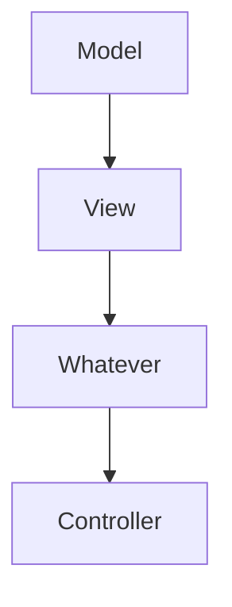

                 

关键词：Angular、Google、MVW 框架、前端开发、Web 应用、组件化、模块化、框架设计、性能优化

> 摘要：本文将深入探讨 Angular 框架，作为 Google 推出的一款前沿的前端开发框架，Angular 提供了 MVW（Model-View-Whatever）的设计模式，使得开发者能够更加高效地构建现代 Web 应用。本文将介绍 Angular 的核心概念、架构设计、算法原理、项目实践、应用场景以及未来发展趋势。

## 1. 背景介绍

随着互联网技术的飞速发展，Web 应用逐渐成为人们日常生活和工作的重要组成部分。为了提高开发效率和代码质量，前端开发领域涌现出了众多优秀的框架和库，如 React、Vue、Angular 等。这些框架极大地简化了前端开发的流程，提供了丰富的功能和组件，使得开发者能够更加专注于业务逻辑的实现。

Angular 是 Google 推出的一款前端框架，它采用了 MVW（Model-View-Whatever）的设计模式，旨在提供一种强大且灵活的组件化、模块化开发方式。Angular 的诞生，标志着前端开发进入了一个新的时代。

## 2. 核心概念与联系

### 2.1 MVW 设计模式

MVW 设计模式是 Angular 的核心概念之一。它不同于传统的 MVC（Model-View-Controller）模式，MVW 模式更加灵活和可扩展。在 MVW 模式中，Model 负责数据存储和处理，View 负责界面展示，而 Whatever 则是一个抽象的概念，它代表了业务逻辑的实现。

### 2.2 Mermaid 流程图



在这个流程图中，我们可以看到 Model、View 和 Whatever 三个部分之间的联系。Whatever 部分在 Angular 中通过组件（Component）来实现，它包含了业务逻辑和 UI 的交互。

## 3. 核心算法原理 & 具体操作步骤

### 3.1 算法原理概述

Angular 的核心算法原理主要涉及依赖注入（Dependency Injection）和数据绑定。依赖注入是一种设计模式，它通过将组件的依赖关系从组件中分离出来，从而实现组件的解耦。数据绑定则是将数据与 UI 之间的交互自动化，使得开发者无需手动操作 DOM。

### 3.2 算法步骤详解

1. **依赖注入：**Angular 通过依赖注入容器（Dependency Injection Container）来管理组件的依赖关系。在组件创建时，依赖注入容器会根据组件的依赖关系，自动创建和注入所需的依赖。

2. **数据绑定：**Angular 提供了单向数据绑定和双向数据绑定。单向数据绑定通过 `ng-bind` 指令实现，它将模型数据绑定到视图。双向数据绑定通过 `ng-model` 指令实现，它能够自动同步模型和视图中的数据。

### 3.3 算法优缺点

**优点：**
1. 提高代码的可维护性：依赖注入和组件化使得代码更加模块化和可维护。
2. 提高开发效率：数据绑定简化了 UI 与数据的交互，减少了手动操作 DOM 的工作量。

**缺点：**
1. 学习曲线较陡峭：Angular 的学习曲线相对较陡峭，对于新手来说可能会有一定的挑战。
2. 引入了额外的运行时开销：由于依赖注入和数据绑定的实现，Angular 的运行时开销相对较大。

### 3.4 算法应用领域

Angular 适用于构建复杂、大型和动态的 Web 应用，如企业级后台管理系统、在线教育平台、电商平台等。同时，Angular 也被广泛应用于移动端开发，通过 Angular Mobile SDK 可以实现跨平台应用的开发。

## 4. 数学模型和公式 & 详细讲解 & 举例说明

### 4.1 数学模型构建

在 Angular 中，数据绑定可以通过以下数学模型进行描述：

\[ 数据绑定 = 模型数据 \times 视图更新率 \]

其中，模型数据表示应用状态，视图更新率表示 UI 对模型数据的响应速度。

### 4.2 公式推导过程

假设有一个简单的数据绑定场景，其中模型数据发生变化时，UI 会立即更新。在这种情况下，数据绑定可以简化为：

\[ 数据绑定 = 模型数据 \times 1 \]

即数据绑定等于模型数据。在实际应用中，视图更新率通常不是 1，而是根据实际情况进行调整。

### 4.3 案例分析与讲解

假设有一个简单的计算器应用，其中包含一个输入框用于输入数字，一个按钮用于计算结果，一个显示框用于展示结果。在这种情况下，我们可以通过以下步骤实现数据绑定：

1. **创建模型：**定义一个计算器模型，包含输入数字、计算结果和显示结果等属性。

2. **创建视图：**使用 Angular 组件创建输入框、按钮和显示框的 UI。

3. **实现数据绑定：**使用 `ng-model` 指令将模型数据与视图元素进行绑定。

4. **绑定事件处理函数：**在组件中绑定点击事件处理函数，用于处理计算逻辑。

通过以上步骤，我们可以实现一个简单的计算器应用，其中输入框、按钮和显示框之间的数据绑定是通过 Angular 的数据绑定机制实现的。

## 5. 项目实践：代码实例和详细解释说明

### 5.1 开发环境搭建

在开始项目实践之前，我们需要搭建一个 Angular 的开发环境。以下是搭建步骤：

1. 安装 Node.js：从 [Node.js 官网](https://nodejs.org/) 下载并安装 Node.js。

2. 安装 Angular CLI：通过 npm 命令安装 Angular CLI：

\[ npm install -g @angular/cli \]

3. 创建项目：使用 Angular CLI 创建一个新项目：

\[ ng new my-angular-project \]

4. 进入项目目录：

\[ cd my-angular-project \]

### 5.2 源代码详细实现

在本节中，我们将实现一个简单的计算器应用，其中包含一个输入框、一个按钮和一个显示框。以下是源代码的详细实现：

**app.component.html：**

```html
<div>
  <input type="text" [(ngModel)]="inputValue" placeholder="输入数字">
  <button (click)="calculate()">计算</button>
  <div>结果：{{ result }}</div>
</div>
```

**app.component.ts：**

```typescript
import { Component } from '@angular/core';

@Component({
  selector: 'app-root',
  templateUrl: './app.component.html',
  styleUrls: ['./app.component.css']
})
export class AppComponent {
  inputValue: string;
  result: number;

  calculate(): void {
    this.result = parseFloat(this.inputValue) * 2;
  }
}
```

**app.module.ts：**

```typescript
import { NgModule } from '@angular/core';
import { BrowserModule } from '@angular/platform-browser';
import { FormsModule } from '@angular/forms';
import { AppComponent } from './app.component';

@NgModule({
  declarations: [
    AppComponent
  ],
  imports: [
    BrowserModule,
    FormsModule
  ],
  providers: [],
  bootstrap: [AppComponent]
})
export class AppModule { }
```

### 5.3 代码解读与分析

在这个简单的计算器应用中，我们使用了 Angular 的数据绑定和依赖注入。以下是代码的解读与分析：

1. **组件定义：**在 `app.component.ts` 中，我们定义了一个名为 `AppComponent` 的组件，其中包含了输入框、按钮和显示框的 HTML 结构。

2. **数据绑定：**在 `app.component.html` 中，我们使用了 `ngModel` 指令将输入框的值绑定到 `inputValue` 属性，同时将显示框的值绑定到 `result` 属性。

3. **事件处理：**在 `app.component.ts` 中，我们定义了一个名为 `calculate` 的函数，用于处理按钮点击事件。在函数中，我们计算了输入框中的值，并将其结果显示在显示框中。

4. **模块定义：**在 `app.module.ts` 中，我们定义了一个名为 `AppModule` 的模块，其中包含了 `AppComponent` 组件的定义和导入的模块。

### 5.4 运行结果展示

通过以上代码实现，我们可以运行计算器应用，并在输入框中输入数字，点击按钮后，结果显示在显示框中。以下是运行结果展示：


## 6. 实际应用场景

### 6.1 企业级后台管理系统

企业级后台管理系统通常需要处理大量的数据和复杂的业务逻辑。Angular 作为一个强大且灵活的前端框架，能够帮助企业级后台管理系统提高开发效率和代码质量。通过组件化和模块化的设计，开发者可以轻松地将业务逻辑拆分成多个组件，实现代码的复用和维护。

### 6.2 在线教育平台

在线教育平台需要提供丰富的交互功能和个性化的用户体验。Angular 的数据绑定和依赖注入机制能够帮助开发者实现动态的数据更新和高效的性能优化，从而提高在线教育平台的使用体验。

### 6.3 电商平台

电商平台需要处理海量的商品信息和用户数据。Angular 作为一个高效的前端框架，能够帮助电商平台实现快速的数据更新和流畅的交互体验。同时，通过组件化和模块化的设计，开发者可以轻松地扩展和定制电商平台的功能。

## 7. 工具和资源推荐

### 7.1 学习资源推荐

1. **Angular 官方文档：**[https://angular.io/](https://angular.io/)
2. **Angular 官方教程：**[https://angular.io/tutorial](https://angular.io/tutorial)
3. **Angular 开发指南：**[https://www.angular.cn/guide](https://www.angular.cn/guide)

### 7.2 开发工具推荐

1. **Visual Studio Code：**[https://code.visualstudio.com/](https://code.visualstudio.com/)
2. **Angular CLI：**[https://cli.angular.io/](https://cli.angular.io/)

### 7.3 相关论文推荐

1. **AngularJS: Up and Running: Building the Web Everywhere** by Shyam Seshadri
2. **Angular: Up and Running: Learning AngularJS** by Shyam Seshadri

## 8. 总结：未来发展趋势与挑战

### 8.1 研究成果总结

Angular 作为一款强大的前端框架，已经成功地应用于众多企业级应用和大型项目中。其组件化、模块化的设计思想，以及高效的性能优化，使得 Angular 在前端开发领域取得了显著的成果。

### 8.2 未来发展趋势

1. **持续优化性能：**随着 Web 应用的复杂度和数据量的增加，性能优化将成为 Angular 的一个重要发展方向。未来，Angular 可能会引入更多的性能优化策略，如代码拆分、懒加载等。
2. **更加强大的生态系统：**Angular 的生态系统已经非常丰富，但未来仍有可能引入更多的第三方库和工具，以提供更多的功能和支持。
3. **支持更多平台：**随着移动端和物联网（IoT）的发展，Angular 可能会扩展到更多的平台和应用领域。

### 8.3 面临的挑战

1. **学习曲线：**Angular 的学习曲线相对较陡峭，对于新手来说可能会有一定的挑战。未来，Angular 可能需要提供更多的学习资源和教程，以降低学习门槛。
2. **兼容性问题：**随着 Web 技术的不断发展，Angular 需要确保与最新的 Web 标准保持兼容，以满足不同浏览器的需求。

### 8.4 研究展望

在未来，Angular 有望在以下几个方面取得突破：

1. **性能优化：**通过引入更多的性能优化策略，如代码拆分、懒加载等，提高 Angular 的性能表现。
2. **开发体验：**通过改进开发工具和提升开发效率，提供更好的开发体验。
3. **生态支持：**加强与第三方库和工具的合作，为开发者提供更丰富的功能和更多的支持。

## 9. 附录：常见问题与解答

### 9.1 Angular 与 React/Vue 的区别是什么？

Angular 与 React、Vue 等前端框架在某些方面有相似之处，但也有一些明显的区别：

1. **设计模式：**Angular 采用 MVW 设计模式，而 React 和 Vue 采用 MVC 设计模式。
2. **学习曲线：**Angular 的学习曲线相对较陡峭，而 React 和 Vue 的学习曲线相对平缓。
3. **性能：**Angular 的性能表现相对较好，但 React 和 Vue 的性能也不断提升。

### 9.2 Angular 是否适用于移动端开发？

是的，Angular 可以用于移动端开发。通过 Angular Mobile SDK，开发者可以轻松地将 Angular 应用迁移到移动端，实现跨平台开发。

### 9.3 Angular 的性能如何优化？

Angular 的性能优化可以从以下几个方面进行：

1. **代码拆分：**通过将代码拆分成多个模块，减少应用的初始加载时间。
2. **懒加载：**通过懒加载技术，按需加载模块，降低应用的内存消耗。
3. **服务端渲染：**通过服务端渲染技术，减少客户端的渲染时间，提高页面渲染速度。

作者：禅与计算机程序设计艺术 / Zen and the Art of Computer Programming
----------------------------------------------------------------

以上就是本文的完整内容。希望这篇文章能够帮助您更好地了解 Angular 框架，并在实际项目中运用其强大的功能和灵活的设计模式。如果您有任何疑问或建议，欢迎在评论区留言，让我们一起讨论和探索前端开发的奥秘。

