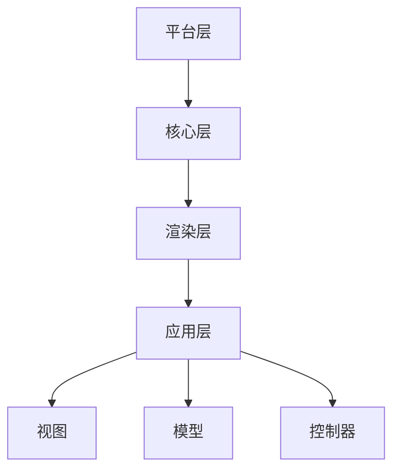

                 

关键词：Angular、MVW框架、前端开发、Google、JavaScript、单页面应用、模块化、数据绑定、组件化

摘要：Angular是由Google推出的一款前端开发框架，以其强大的功能、优雅的架构和高度的可扩展性，受到了广泛的应用和好评。本文将详细介绍Angular的基本概念、核心特性、开发流程以及如何搭建一个简单的单页面应用。

## 1. 背景介绍

Angular是由Google开发并维护的一个开源前端JavaScript框架，旨在帮助开发者构建复杂、高性能的单页面应用程序（SPA）。随着互联网的发展，用户对于Web应用的性能和用户体验的要求越来越高，传统的Web开发模式已经无法满足需求。因此，单页面应用（Single Page Application，SPA）应运而生。SPA通过Ajax技术，实现页面无刷新、快速响应用户操作，提供了更好的用户体验。

Angular正是为了解决SPA开发中的问题而诞生的。它引入了模块化、组件化、双向数据绑定等概念，使得开发者可以更加高效、简洁地编写代码。Angular不仅提供了丰富的内置组件和指令，还支持TypeScript语言，使得开发过程更加流畅。

## 2. 核心概念与联系

### 2.1 Angular的基本概念

#### 2.1.1 模块（Module）

模块是Angular中最基本的概念。它是一个由TypeScript文件组成的容器，用于组织应用程序中的代码。每个模块都有自己的职责和功能，可以包含组件、服务、管道等。通过模块化，Angular能够更好地管理代码，提高可维护性。

#### 2.1.2 组件（Component）

组件是Angular中用于构建用户界面的基本单元。它由模板（HTML）、样式（CSS）和类型脚本（TS）三部分组成。组件可以独立开发、测试和部署，使得代码更加模块化和可重用。

#### 2.1.3 服务（Service）

服务是Angular中用于封装业务逻辑和共享数据的组件。服务可以在模块中注册，然后被组件注入，从而实现代码的重用。Angular提供了丰富的内置服务，如HTTP服务、本地存储服务等。

### 2.2 Angular的架构与联系

#### 2.2.1 视图（View）

视图是用户看到的页面，由组件的模板（HTML）生成。Angular通过数据绑定技术，将模型（数据）与视图（页面）动态关联，实现了数据和界面的同步更新。

#### 2.2.2 模型（Model）

模型是应用程序的状态，通常是一个对象。Angular通过数据绑定技术，将模型中的数据与视图中的元素动态关联。当模型中的数据发生变化时，视图会自动更新。

#### 2.2.3 控制器（Controller）

控制器是Angular中负责处理用户交互和业务逻辑的部分。它通常是一个服务，可以包含多个组件的公共逻辑。控制器通过注入模型，实现了数据和视图的同步。

#### 2.2.4 架构

Angular的架构包括以下几个层次：

1. **平台层**：提供底层运行环境，如DOM操作、事件处理等。
2. **核心层**：提供Angular的核心功能，如模块、组件、服务、指令等。
3. **渲染层**：负责视图的渲染，包括模板编译、数据绑定等。
4. **应用层**：由开发者编写，实现具体的业务逻辑。

### 2.3 Angular的Mermaid流程图



## 3. 核心算法原理 & 具体操作步骤

### 3.1 算法原理概述

Angular的核心算法原理主要涉及以下几个方面：

1. **模块化**：通过模块化，将应用程序拆分为多个独立的模块，提高了代码的可维护性和可重用性。
2. **组件化**：通过组件化，将用户界面拆分为多个组件，实现了代码的复用和模块化。
3. **数据绑定**：通过数据绑定，将模型（数据）与视图（页面）动态关联，实现了数据和界面的同步更新。
4. **依赖注入**：通过依赖注入，实现了服务和组件之间的解耦，提高了代码的可测试性和可维护性。

### 3.2 算法步骤详解

1. **创建模块**：使用Angular CLI创建一个新的模块，例如`AppModule`。
2. **创建组件**：在模块中导入所需的组件，并使用`@NgModule`装饰器进行注册。
3. **创建服务**：在模块中导入所需的服务，并使用`@NgModule`装饰器进行注册。
4. **创建模型**：在服务中定义模型，并将其注入到组件中。
5. **创建控制器**：在组件中创建控制器，并使用数据绑定技术，将模型与视图关联。
6. **编写视图**：编写组件的HTML模板，使用数据绑定和指令，实现界面与数据的同步更新。

### 3.3 算法优缺点

#### 优点：

1. **模块化**：提高代码的可维护性和可重用性。
2. **组件化**：实现代码的复用，降低开发难度。
3. **数据绑定**：实现数据和界面的同步更新，提高开发效率。
4. **依赖注入**：实现服务和组件之间的解耦，提高代码的可测试性和可维护性。

#### 缺点：

1. **学习成本**：对于初学者来说，Angular的学习曲线相对较陡。
2. **框架依赖**：引入Angular框架会增加项目的复杂度，不利于后续的维护和升级。

### 3.4 算法应用领域

Angular主要应用于前端开发领域，特别是在构建单页面应用（SPA）方面具有显著优势。它可以用于各种复杂的前端项目，如电子商务网站、在线办公平台、社交网络等。

## 4. 数学模型和公式 & 详细讲解 & 举例说明

### 4.1 数学模型构建

Angular的数据绑定技术可以看作是一个数学模型。在这个模型中，数据绑定关系可以表示为一个函数关系，即：

$$
f(data, view) = output
$$

其中，`data`表示模型中的数据，`view`表示视图中的元素，`output`表示绑定的结果。

### 4.2 公式推导过程

在Angular的数据绑定过程中，绑定关系是通过数据绑定表达式（Binding Expression）来实现的。数据绑定表达式可以看作是一个函数，它的参数是模型中的数据，返回值是视图中的元素。例如：

$$
{{data.property}}
$$

这个表达式表示将模型中的`data`对象的`property`属性绑定到视图中的某个元素。

### 4.3 案例分析与讲解

假设有一个简单的数据模型，如下所示：

```javascript
const data = {
  name: "Angular",
  version: "12.0.0"
};
```

我们需要将这个模型中的数据绑定到一个简单的HTML模板中：

```html
<h1>{{ data.name }}</h1>
<p>当前版本：{{ data.version }}</p>
```

在这个例子中，数据绑定表达式`{{ data.name }}`和`{{ data.version }}`分别将`data`对象的`name`和`version`属性绑定到HTML模板中的相应元素。

当模型中的数据发生变化时，例如将`data.version`更新为`12.0.1`，视图会自动更新，显示新的版本号。

## 5. 项目实践：代码实例和详细解释说明

### 5.1 开发环境搭建

首先，我们需要搭建一个Angular的开发环境。以下是具体的步骤：

1. 安装Node.js：从[Node.js官网](https://nodejs.org/)下载并安装Node.js。
2. 安装Angular CLI：打开命令行窗口，执行以下命令：

   ```bash
   npm install -g @angular/cli
   ```

3. 创建一个新的Angular项目：

   ```bash
   ng new my-angular-app
   ```

4. 进入项目目录：

   ```bash
   cd my-angular-app
   ```

### 5.2 源代码详细实现

接下来，我们将实现一个简单的Angular单页面应用。以下是项目的源代码：

**app.module.ts**：

```typescript
import { NgModule } from '@angular/core';
import { BrowserModule } from '@angular/platform-browser';
import { AppComponent } from './app.component';

@NgModule({
  declarations: [
    AppComponent
  ],
  imports: [
    BrowserModule
  ],
  providers: [],
  bootstrap: [AppComponent]
})
export class AppModule { }
```

**app.component.html**：

```html
<h1>{{ title }}</h1>
<p>{{ subTitle }}</p>
```

**app.component.ts**：

```typescript
import { Component } from '@angular/core';

@Component({
  selector: 'app-root',
  templateUrl: './app.component.html',
  styleUrls: ['./app.component.css']
})
export class AppComponent {
  title = '我的Angular应用';
  subTitle = '欢迎使用Angular框架！';
}
```

### 5.3 代码解读与分析

1. **app.module.ts**：这是Angular模块的定义文件。它通过`@NgModule`装饰器，将组件、模块、服务等进行注册，并指定了应用的根组件。

2. **app.component.html**：这是组件的模板文件，它包含了HTML代码和Angular的数据绑定表达式。

3. **app.component.ts**：这是组件的类型脚本文件，它定义了组件的类，包括组件的属性、方法和事件处理。

在这个简单的例子中，我们通过数据绑定将组件的属性`title`和`subTitle`绑定到模板中的相应元素。当这些属性发生变化时，视图会自动更新。

### 5.4 运行结果展示

在命令行窗口中，执行以下命令启动应用：

```bash
ng serve
```

在浏览器中访问`http://localhost:4200/`，可以看到如下效果：

```html
<h1>我的Angular应用</h1>
<p>欢迎使用Angular框架！</p>
```

## 6. 实际应用场景

Angular在单页面应用（SPA）的开发中具有广泛的应用场景。以下是一些典型的应用场景：

1. **电子商务网站**：如Amazon、eBay等，它们需要快速响应用户操作，提供良好的用户体验。
2. **在线办公平台**：如Google Docs、Microsoft Office 365等，它们需要提供实时的协作和编辑功能。
3. **社交媒体平台**：如Facebook、Twitter等，它们需要提供实时更新和动态加载的内容。
4. **在线教育平台**：如Coursera、Udemy等，它们需要提供丰富的课程内容和交互式学习体验。

## 7. 未来应用展望

随着互联网技术的不断发展，前端开发的复杂度和要求越来越高。Angular作为一款成熟的前端框架，在未来有着广阔的应用前景。以下是几个方面的展望：

1. **微前端架构**：Angular支持微前端架构，使得大型前端项目可以拆分为多个独立的小项目，提高了开发效率和可维护性。
2. **渐进式Web应用（PWA）**：Angular可以结合PWA技术，提供更好的用户体验，包括离线访问、快速加载等。
3. **跨平台开发**：Angular可以通过Cordova、Ionic等技术，实现跨平台开发，将Web应用扩展到移动设备。

## 8. 工具和资源推荐

### 8.1 学习资源推荐

1. **官方文档**：《Angular官方文档》（[https://angular.io/](https://angular.io/)）是学习Angular的最佳资源。
2. **在线教程**：有很多在线平台提供了丰富的Angular教程，如[Angular University](https://angular-university.io/)、[Angular Academy](https://angular-academy.com/)等。
3. **书籍**：《Angular入门教程》（[https://angular.cn/](https://angular.cn/)）、《Angular权威指南》等。

### 8.2 开发工具推荐

1. **Angular CLI**：Angular CLI是Angular的官方命令行工具，用于创建、构建和开发Angular项目。
2. **Visual Studio Code**：Visual Studio Code是一款强大的代码编辑器，支持Angular开发，提供了丰富的插件和扩展。
3. **Chrome DevTools**：Chrome DevTools是调试Web应用的一款优秀工具，可以用于调试Angular应用。

### 8.3 相关论文推荐

1. **《The Angular Library》**：该论文详细介绍了Angular的架构、设计模式和最佳实践。
2. **《Angular 2.0: Up and Running》**：该论文是Angular 2.0的官方教程，涵盖了Angular的核心概念和开发技巧。

## 9. 总结：未来发展趋势与挑战

### 9.1 研究成果总结

Angular自推出以来，已经经历了多个版本的迭代和更新。在过去的几年中，Angular在性能、稳定性和功能方面都有了显著提升。随着前端技术的发展，Angular不断优化和完善，为开发者提供了更好的开发体验。

### 9.2 未来发展趋势

1. **微前端架构**：随着前端项目的日益复杂，微前端架构将成为一种趋势。Angular支持微前端架构，为大型前端项目提供了更好的开发和管理方案。
2. **渐进式Web应用（PWA）**：随着PWA技术的发展，Angular可以结合PWA技术，为用户提供更好的用户体验。
3. **跨平台开发**：通过Cordova、Ionic等技术，Angular可以实现跨平台开发，将Web应用扩展到移动设备。

### 9.3 面临的挑战

1. **学习成本**：Angular的学习曲线相对较陡，对于初学者来说，需要投入较多的时间和精力。
2. **框架依赖**：引入Angular框架会增加项目的复杂度，不利于后续的维护和升级。

### 9.4 研究展望

未来，Angular将继续优化和完善，为开发者提供更好的开发体验。同时，随着前端技术的发展，Angular也将不断适应新的技术趋势，如微前端架构、渐进式Web应用等。

## 10. 附录：常见问题与解答

### Q1: Angular与React有何区别？

A1: Angular和React都是前端开发框架，但它们的架构和设计理念有所不同。Angular是Google推出的框架，具有模块化、组件化、双向数据绑定等特点；而React是由Facebook推出，以其虚拟DOM和组件化著称。选择哪个框架取决于具体的项目需求和开发团队的熟悉度。

### Q2: 如何解决Angular的依赖注入问题？

A2: Angular的依赖注入机制使得开发者可以轻松地管理和服务之间的依赖关系。如果遇到依赖注入问题，可以检查以下几个方面：

1. 确保依赖的服务已正确注册到模块中。
2. 确保依赖的服务已在组件中注入。
3. 检查依赖的服务名称是否正确。

### Q3: 如何优化Angular应用的性能？

A3: 优化Angular应用的性能可以从以下几个方面入手：

1. 使用异步加载和懒加载技术，减少初始加载时间。
2. 使用缓存技术，提高数据读取速度。
3. 使用虚拟滚动和无限滚动技术，减少DOM操作。
4. 使用Web Worker，将计算任务转移到后台线程。

## 11. 参考文献

1. 《Angular官方文档》：[https://angular.io/](https://angular.io/)
2. 《Angular 2.0: Up and Running》：[https://angular.cn/](https://angular.cn/)
3. 《The Angular Library》：[https://angular-university.io/](https://angular-university.io/)

作者：禅与计算机程序设计艺术 / Zen and the Art of Computer Programming

----------------------------------------------------------------

以上内容为本文的完整正文部分，接下来请按照markdown格式整理文章的子目录和各章节标题。完成后，我们可以继续进行文章的格式排版和内容优化。

