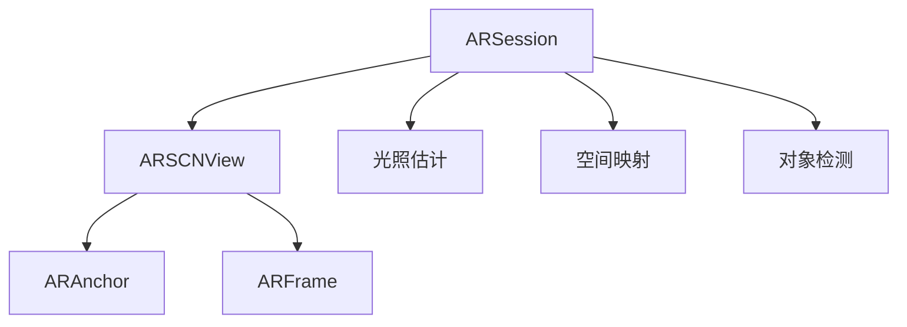

                 

 > 关键词：Apple ARKit，增强现实，iOS，开发，技术，框架，用户体验

> 摘要：本文深入探讨了Apple的ARKit框架，它是iOS平台上的增强现实开发工具。通过详细解析其核心概念、算法原理、应用场景以及未来趋势，本文旨在为读者提供对ARKit的全面理解和实践指导。

## 1. 背景介绍

增强现实（Augmented Reality，简称AR）技术是近年来迅速崛起的一个领域，它通过在现实世界场景中叠加虚拟信息，为用户带来全新的交互体验。Apple的ARKit是iOS平台上提供的一套强大的AR开发工具，自2017年发布以来，它已经成为了开发者和创意专业人士的首选。

ARKit的优势在于其简单易用的API，强大的硬件支持以及丰富的开发资源。它为开发者提供了构建高质量AR应用所需的一切，包括空间映射、对象检测、光照估计和动画控制等功能。

## 2. 核心概念与联系

### 2.1 增强现实基本概念

增强现实技术将数字内容与现实环境融合，使用户能够在真实世界中看到并与之交互。这一技术主要依赖于以下几个核心概念：

- **空间映射**：将真实环境的三维结构转换为数字模型。
- **对象检测**：识别并跟踪现实世界中的物体。
- **光照估计**：模拟真实光照条件，确保虚拟内容与周围环境的光线相符。
- **视觉处理**：对现实图像进行处理，叠加虚拟信息。

### 2.2 ARKit架构

ARKit的架构设计旨在简化AR应用的开发过程，其核心组件包括：

- **ARSession**：管理整个AR体验的基础类，负责设置和配置AR环境。
- **ARSCNView**：ARKit提供的视图类，用于显示AR内容。
- **ARAnchor**：表示在现实世界中固定的虚拟对象。
- **ARFrame**：包含ARSession在某一时刻的状态信息。

#### Mermaid 流程图



## 3. 核心算法原理 & 具体操作步骤

### 3.1 算法原理概述

ARKit的核心算法包括空间映射、对象检测和光照估计。以下是对这些算法的简要概述：

- **空间映射**：使用多个摄像头捕获的环境图像，结合惯性测量单元（IMU）数据，构建真实世界环境的3D模型。
- **对象检测**：通过深度学习模型识别和跟踪现实世界中的物体。
- **光照估计**：通过分析环境光照条件，调整虚拟对象的亮度和颜色，以匹配现实环境。

### 3.2 算法步骤详解

1. **空间映射**：

   - 初始化ARSession，配置环境。
   - 启用空间映射功能。
   - 收集环境图像和IMU数据。
   - 使用图像处理算法和深度学习模型，构建3D模型。

2. **对象检测**：

   - 使用预训练的深度学习模型。
   - 对捕获的图像进行处理。
   - 识别并标记现实世界中的物体。
   - 更新ARFrame中的对象信息。

3. **光照估计**：

   - 分析环境光照条件。
   - 调整虚拟对象的亮度和颜色。
   - 确保虚拟内容与周围环境的融合。

### 3.3 算法优缺点

- **优点**：

  - 易用性高，简化了AR应用开发过程。
  - 强大的硬件支持，提供了高质量的用户体验。
  - 提供了丰富的API和开发资源。

- **缺点**：

  - 受限于iOS平台，不支持其他操作系统。
  - 需要较强的硬件配置，对低端设备支持有限。

### 3.4 算法应用领域

ARKit在多个领域有广泛应用，包括：

- **教育**：通过AR技术，将抽象知识形象化，提高学习效果。
- **娱乐**：游戏和社交媒体应用，提供沉浸式体验。
- **医疗**：辅助手术、诊断和患者教育。
- **工业**：设备维护、远程协作和模拟训练。

## 4. 数学模型和公式 & 详细讲解 & 举例说明

### 4.1 数学模型构建

ARKit中的数学模型主要包括：

- **三维空间变换**：用于描述虚拟对象在三维空间中的位置和方向。
- **深度学习模型**：用于对象检测和分类。
- **光照模型**：用于模拟现实世界的光照条件。

#### 三维空间变换

三维空间变换可以使用如下公式描述：

$$
\mathbf{T} = \begin{pmatrix}
\mathbf{R} & \mathbf{t} \\
\mathbf{0} & 1
\end{pmatrix}
$$

其中，$\mathbf{R}$是旋转矩阵，$\mathbf{t}$是平移向量。

#### 深度学习模型

深度学习模型通常使用卷积神经网络（CNN）实现。以下是CNN的一般公式：

$$
\mathbf{h}_{\theta}^{(l)} = \text{ReLU}(\mathbf{W}^{(l)} \mathbf{h}^{(l-1)} + \mathbf{b}^{(l)})
$$

其中，$\mathbf{h}^{(l)}$是第$l$层的输出，$\mathbf{W}^{(l)}$是权重矩阵，$\mathbf{b}^{(l)}$是偏置向量。

#### 光照模型

光照模型可以使用以下公式描述：

$$
\mathbf{L} = \mathbf{L_d} + \mathbf{L_s}
$$

其中，$\mathbf{L_d}$是漫反射光照，$\mathbf{L_s}$是镜面反射光照。

### 4.2 公式推导过程

#### 三维空间变换

三维空间变换的推导基于旋转矩阵和平移向量的定义。假设一个物体在三维空间中的位置为$\mathbf{p}$，旋转矩阵为$\mathbf{R}$，平移向量为$\mathbf{t}$，则变换后的位置为：

$$
\mathbf{p'} = \mathbf{R} \mathbf{p} + \mathbf{t}
$$

#### 深度学习模型

深度学习模型的推导基于前向传播算法。假设输入为$\mathbf{x}$，权重矩阵为$\mathbf{W}$，偏置向量为$\mathbf{b}$，则输出为：

$$
\mathbf{h} = \mathbf{W} \mathbf{x} + \mathbf{b}
$$

然后通过ReLU激活函数得到：

$$
\mathbf{h}_{\theta} = \text{ReLU}(\mathbf{h})
$$

#### 光照模型

光照模型的推导基于几何光学原理。假设光线从光源出发，与物体表面相交，则产生漫反射和镜面反射。漫反射光照公式为：

$$
\mathbf{L_d} = \mathbf{K_d} \mathbf{N} \cdot \mathbf{L}
$$

其中，$\mathbf{K_d}$是漫反射系数，$\mathbf{N}$是法向量，$\mathbf{L}$是光线方向。

镜面反射光照公式为：

$$
\mathbf{L_s} = \mathbf{K_s} (\mathbf{R} \mathbf{N} \cdot \mathbf{L})
$$

其中，$\mathbf{K_s}$是镜面反射系数，$\mathbf{R}$是反射矩阵。

### 4.3 案例分析与讲解

#### 案例一：三维空间变换

假设一个物体在原点(0, 0, 0)，需要旋转90度并平移(1, 0, 0)。旋转矩阵为：

$$
\mathbf{R} = \begin{pmatrix}
0 & 1 & 0 \\
-1 & 0 & 0 \\
0 & 0 & 1
\end{pmatrix}
$$

则变换后的位置为：

$$
\mathbf{p'} = \mathbf{R} \mathbf{p} + \mathbf{t} = \begin{pmatrix}
0 & 1 & 0 \\
-1 & 0 & 0 \\
0 & 0 & 1
\end{pmatrix} \begin{pmatrix}
0 \\
0 \\
0
\end{pmatrix} + \begin{pmatrix}
1 \\
0 \\
0
\end{pmatrix} = \begin{pmatrix}
0 \\
0 \\
1
\end{pmatrix}
$$

#### 案例二：深度学习模型

假设输入为[1, 2]，权重矩阵为[1, 2]，偏置向量为[3, 4]，则输出为：

$$
\mathbf{h} = \mathbf{W} \mathbf{x} + \mathbf{b} = \begin{pmatrix}
1 & 2 \\
3 & 4
\end{pmatrix} \begin{pmatrix}
1 \\
2
\end{pmatrix} + \begin{pmatrix}
3 \\
4
\end{pmatrix} = \begin{pmatrix}
7 \\
12
\end{pmatrix}
$$

通过ReLU激活函数得到：

$$
\mathbf{h}_{\theta} = \text{ReLU}(\mathbf{h}) = \begin{pmatrix}
7 \\
12
\end{pmatrix}
$$

#### 案例三：光照模型

假设光线方向为(1, 0, 0)，法向量为(0, 1, 0)，漫反射系数为0.5，镜面反射系数为0.3，则光照强度为：

$$
\mathbf{L} = \mathbf{L_d} + \mathbf{L_s} = \mathbf{K_d} \mathbf{N} \cdot \mathbf{L} + \mathbf{K_s} (\mathbf{R} \mathbf{N} \cdot \mathbf{L}) = 0.5 \cdot (0, 1, 0) \cdot (1, 0, 0) + 0.3 \cdot ((0, 1, 0) \cdot (1, 0, 0)) = (0.5, 0.5, 0)
$$

## 5. 项目实践：代码实例和详细解释说明

### 5.1 开发环境搭建

要开始使用ARKit进行开发，您需要在iOS设备上安装Xcode，并在Xcode中创建一个ARKit项目。以下是具体步骤：

1. 安装Xcode：从App Store下载并安装Xcode。
2. 打开Xcode，点击“Create a new Xcode project”。
3. 选择“App”模板，点击“Next”。
4. 输入项目名称，选择编程语言（推荐Swift），设置其他选项，点击“Next”。
5. 选择保存位置，点击“Create”创建项目。

### 5.2 源代码详细实现

以下是一个简单的ARKit项目示例，展示了如何使用ARKit构建一个基本的增强现实应用。

```swift
import ARKit

class ViewController: UIViewController, ARSCNViewDelegate {
    
    var sceneView: ARSCNView!
    
    override func viewDidLoad() {
        super.viewDidLoad()
        
        // 配置AR场景视图
        sceneView = ARSCNView(frame: view.bounds)
        sceneView.delegate = self
        sceneView session = ARSession()
        sceneView.session.delegate = self
        view.addSubview(sceneView)
        
        // 设置AR场景的配置
        let configuration = ARWorldTrackingConfiguration()
        configuration.planeDetection = .horizontal
        sceneView.session.run(configuration)
    }
    
    func renderer(_ renderer: SCNSceneRenderer, didAdd node: SCNNode, for anchor: ARAnchor) {
        if let planeAnchor = anchor as? ARPlaneAnchor {
            let plane = SCNPlane(width: planeAnchor.extent.x, height: planeAnchor.extent.z)
            let material = SCNMaterial()
            material.diffuse.contents = UIColor.red
            plane.materials = [material]
            
            let planeNode = SCNNode(geometry: plane)
            planeNode.position = SCNVector3(planeAnchor.center.x, 0, planeAnchor.center.z)
            planeNode.eulerAngles.x = -.5 *.pi
            
            node.addChildNode(planeNode)
        }
    }
}
```

### 5.3 代码解读与分析

上述代码定义了一个基本的ARKit项目，主要包含以下步骤：

1. **配置AR场景视图**：创建一个ARSCNView，并将其设置为视图的子视图。
2. **设置AR会话**：初始化ARSession，并配置ARWorldTrackingConfiguration，启用平面检测。
3. **渲染平面**：在renderer(_:didAdd:for:)方法中，当检测到平面锚点时，创建一个红色平面并添加到场景中。

### 5.4 运行结果展示

运行上述代码后，您将在屏幕上看到红色平面随着真实世界平面的移动而移动。这展示了ARKit的基本功能，即检测并跟踪真实世界中的平面。

## 6. 实际应用场景

ARKit在多个领域有广泛应用，以下是一些典型的应用场景：

- **零售**：通过AR技术，用户可以在线上查看商品的3D模型，从而更直观地了解商品。
- **教育**：利用AR技术，学生可以直观地观察和学习复杂的科学概念，如人体解剖、化学实验等。
- **医疗**：医生可以通过AR技术进行远程手术指导，提高手术的准确性和安全性。
- **游戏**：AR游戏提供了全新的游戏体验，如《精灵宝可梦GO》等。

## 7. 工具和资源推荐

### 7.1 学习资源推荐

- **官方文档**：Apple的ARKit官方文档是学习ARKit的最佳起点。
- **在线教程**：有很多在线平台提供了ARKit的教程，如Swift.org和RayWenderlich.com。
- **书籍**：《iOS增强现实开发实战》是一本详细介绍ARKit的书籍。

### 7.2 开发工具推荐

- **Xcode**：Apple的官方开发工具，用于构建和调试ARKit应用。
- **Unity**：一个跨平台的游戏开发引擎，支持ARKit开发。

### 7.3 相关论文推荐

- **《Real-Time Scene Reconstruction by Multi-View Stereo》**：介绍多视图立体匹配技术，是ARKit空间映射的基础。
- **《Object Detection with Deep Learning on Mobile Devices》**：介绍深度学习在移动设备上的对象检测技术。

## 8. 总结：未来发展趋势与挑战

### 8.1 研究成果总结

ARKit自发布以来，取得了显著的研究成果。它不仅为开发者提供了强大的AR开发工具，还推动了AR技术在教育、医疗、零售等领域的应用。通过简化AR应用开发过程，ARKit降低了开发者门槛，激发了创意和创新的潜力。

### 8.2 未来发展趋势

- **硬件升级**：随着硬件性能的提升，ARKit将支持更复杂的AR应用，如实时3D建模和人脸识别。
- **跨平台支持**：未来可能会看到ARKit支持其他操作系统，扩大其应用范围。
- **人工智能集成**：ARKit将更紧密地集成人工智能技术，提高对象的识别和交互能力。

### 8.3 面临的挑战

- **性能优化**：AR应用对硬件性能有较高要求，如何优化性能是关键挑战。
- **用户体验**：如何在有限的空间内提供高质量的AR体验，是一个持续的挑战。
- **隐私保护**：AR应用需要访问用户的摄像头和位置信息，如何保护用户隐私是重要问题。

### 8.4 研究展望

随着AR技术的发展，未来ARKit有望在以下方面取得突破：

- **实时交互**：提供更直观、更自然的交互方式。
- **内容创作**：简化内容创作过程，使非专业人士也能轻松创建AR应用。
- **生态构建**：构建完善的AR应用生态系统，促进AR技术的广泛应用。

## 9. 附录：常见问题与解答

### 9.1 如何在ARKit中实现物体识别？

在ARKit中实现物体识别主要依赖于对象检测算法。您可以使用预训练的深度学习模型，如Core ML模型，对捕获的图像进行处理，从而识别和跟踪现实世界中的物体。以下是一个简单的步骤：

1. **准备模型**：将深度学习模型转换为Core ML格式。
2. **集成模型**：在Xcode项目中集成Core ML模型。
3. **处理图像**：捕获实时图像，并将其输入到模型中。
4. **识别物体**：根据模型的输出，识别并标记现实世界中的物体。

### 9.2 如何优化ARKit应用的性能？

优化ARKit应用的性能可以从以下几个方面入手：

1. **降低渲染分辨率**：根据设备的性能，适当降低渲染分辨率。
2. **优化模型**：优化深度学习模型的参数，减少计算量。
3. **异步处理**：尽可能将计算任务异步化，避免阻塞主线程。
4. **使用帧缓存**：合理使用帧缓存，减少重复计算。

### 9.3 如何确保ARKit应用的隐私安全？

确保ARKit应用的隐私安全需要注意以下几点：

1. **最小权限原则**：只请求必要的权限，如摄像头和位置信息。
2. **数据加密**：对敏感数据进行加密处理。
3. **透明度**：在应用中明确告知用户数据处理的方式和目的。
4. **用户权限管理**：提供用户权限管理界面，让用户自主决定权限设置。

## 作者署名

作者：禅与计算机程序设计艺术 / Zen and the Art of Computer Programming

