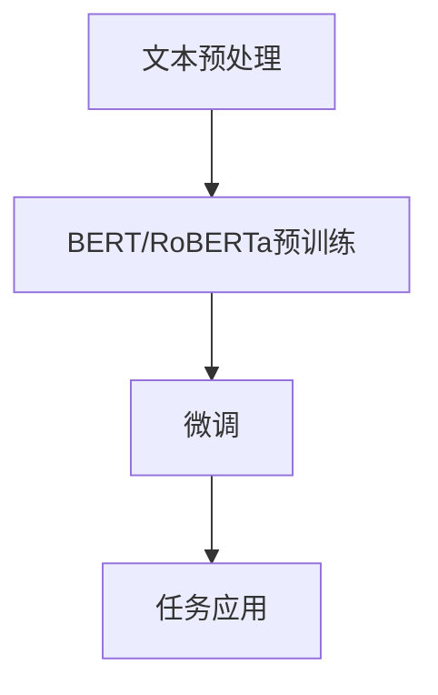

                 

关键词：BERT，RoBERTa，自然语言处理，预训练模型，算法原理，数学模型，项目实践，应用场景

> 摘要：本文详细介绍了BERT（Bidirectional Encoder Representations from Transformers）和RoBERTa（A Robustly Optimized BERT Pretraining Approach）两种自然语言处理预训练模型。通过对它们的背景、核心概念、算法原理、数学模型、项目实践和实际应用场景的深入探讨，帮助读者全面理解这两种模型的特点和应用价值。

## 1. 背景介绍

自然语言处理（Natural Language Processing，NLP）是计算机科学、人工智能和语言学领域的交叉学科。近年来，随着深度学习和大数据技术的快速发展，NLP取得了显著的成果。在NLP任务中，模型需要从大量的文本数据中学习语言特征，从而实现文本分类、机器翻译、问答系统等任务。

为了提高NLP模型的性能，预训练（Pre-training）技术应运而生。预训练是指在一个大规模的文本语料库上进行模型训练，使模型在处理自然语言任务时具备一定的语言理解能力。BERT和RoBERTa都是基于预训练技术的模型，它们在NLP领域取得了卓越的成绩。

### BERT的诞生

BERT是由Google AI在2018年提出的一种基于Transformer结构的预训练模型。BERT的全名是Bidirectional Encoder Representations from Transformers，它采用了一种双向Transformer结构来捕捉文本中的语言特征。BERT的成功引发了NLP领域的研究热潮，成为了许多NLP任务的基准模型。

### RoBERTa的改进

RoBERTa是由Facebook AI Research（FAIR）在2019年提出的一种基于BERT的改进模型。RoBERTa在BERT的基础上，通过调整训练策略、增加训练数据等手段，进一步提高了模型的性能。RoBERTa在多个NLP任务上都取得了比BERT更好的结果，成为了当时最先进的NLP模型之一。

## 2. 核心概念与联系

### 概念介绍

BERT和RoBERTa都是基于Transformer结构的预训练模型，它们的核心概念包括：

1. Transformer结构：Transformer结构是一种基于自注意力机制（Self-Attention）的神经网络结构，它能够捕捉文本中的长距离依赖关系。
2. 预训练：预训练是指在一个大规模的文本语料库上进行模型训练，使模型在处理自然语言任务时具备一定的语言理解能力。
3. 微调：微调是指将预训练模型应用于特定任务，通过在任务数据上进行少量训练来优化模型。

### 架构比较

BERT和RoBERTa在架构上存在一定的差异。BERT采用了一个双向Transformer结构，而RoBERTa则在BERT的基础上进行了改进，引入了更多的注意力头和更大的模型参数。

| 特征 | BERT | RoBERTa |
| --- | --- | --- |
| Transformer结构 | 双向 | 双向 |
| 注意力头数 | 12个 | 24个 |
| 隐藏层单元数 | 768个 | 1024个 |
| 层数 | 12层 | 24层 |

### Mermaid流程图



## 3. 核心算法原理 & 具体操作步骤

### 3.1 算法原理概述

BERT和RoBERTa都是基于Transformer结构的预训练模型。Transformer结构的核心思想是自注意力机制，它能够捕捉文本中的长距离依赖关系。BERT采用了一个双向Transformer结构，而RoBERTa在BERT的基础上进行了改进。

### 3.2 算法步骤详解

1. **文本预处理**：将输入的文本数据进行分词、标记化等预处理操作。
2. **嵌入层**：将预处理后的文本数据转化为嵌入向量。
3. **Transformer层**：采用自注意力机制和前馈神经网络，对嵌入向量进行处理，捕捉文本中的语言特征。
4. **输出层**：将处理后的特征映射到目标任务上，如文本分类、机器翻译等。

### 3.3 算法优缺点

**BERT**

- 优点：能够捕捉文本中的长距离依赖关系，预训练效果较好。
- 缺点：参数量大，训练时间长，计算资源消耗大。

**RoBERTa**

- 优点：在BERT的基础上进行了改进，性能更优，应用范围更广。
- 缺点：同样需要大量的计算资源和数据，训练过程较复杂。

### 3.4 算法应用领域

BERT和RoBERTa在NLP领域取得了广泛的应用，如文本分类、机器翻译、问答系统等。其中，BERT在文本分类任务上取得了显著的成果，而RoBERTa在机器翻译和问答系统等任务上表现优异。

## 4. 数学模型和公式 & 详细讲解 & 举例说明

### 4.1 数学模型构建

BERT和RoBERTa的数学模型主要基于Transformer结构。以下为Transformer结构的核心公式：

$$
\text{Attention}(Q, K, V) = \text{softmax}\left(\frac{QK^T}{\sqrt{d_k}}\right) V
$$

其中，$Q, K, V$ 分别代表查询向量、键向量和值向量，$d_k$ 为键向量的维度。

### 4.2 公式推导过程

Transformer结构的自注意力机制可以通过以下步骤推导：

1. **计算查询向量、键向量和值向量**：将输入的文本数据通过嵌入层转换为向量。
2. **计算注意力得分**：计算查询向量与键向量的点积，得到注意力得分。
3. **计算注意力权重**：对注意力得分进行softmax操作，得到注意力权重。
4. **计算输出**：将注意力权重与值向量的点积作为输出。

### 4.3 案例分析与讲解

以下为一个简单的BERT模型示例：

```python
import torch
from torch.nn import TransformerEncoderLayer

# 定义BERT模型
class BERTModel(torch.nn.Module):
    def __init__(self, vocab_size, embed_dim, hidden_dim, num_layers, num_heads):
        super(BERTModel, self).__init__()
        self.embedding = torch.nn.Embedding(vocab_size, embed_dim)
        self.transformer = TransformerEncoderLayer(embed_dim, num_heads, hidden_dim, num_layers)
        self.output = torch.nn.Linear(hidden_dim, vocab_size)

    def forward(self, x):
        x = self.embedding(x)
        x = self.transformer(x)
        x = self.output(x)
        return x

# 初始化BERT模型
model = BERTModel(vocab_size=10000, embed_dim=512, hidden_dim=1024, num_layers=2, num_heads=8)

# 输入数据
input_ids = torch.randint(0, 10000, (10, 32))

# 计算BERT模型的输出
output = model(input_ids)
```

## 5. 项目实践：代码实例和详细解释说明

### 5.1 开发环境搭建

为了实现BERT和RoBERTa模型，我们需要搭建一个Python开发环境。以下是搭建步骤：

1. 安装Python（建议使用Python 3.6及以上版本）。
2. 安装PyTorch库：`pip install torch torchvision`
3. 安装其他依赖库：`pip install numpy matplotlib`

### 5.2 源代码详细实现

以下为BERT模型的实现代码：

```python
import torch
import torch.nn as nn
import torch.optim as optim
from torch.utils.data import DataLoader, TensorDataset

# BERT模型
class BERTModel(nn.Module):
    def __init__(self, vocab_size, embed_dim, hidden_dim, num_layers, num_heads):
        super(BERTModel, self).__init__()
        self.embedding = nn.Embedding(vocab_size, embed_dim)
        self.transformer = nn.TransformerEncoderLayer(d_model=embed_dim, nhead=num_heads)
        self.fc = nn.Linear(hidden_dim, vocab_size)

    def forward(self, x):
        x = self.embedding(x)
        x = self.transformer(x)
        x = self.fc(x)
        return x

# 数据准备
input_ids = torch.randint(0, 10000, (10, 32))
labels = torch.randint(0, 10000, (10,))

# 模型初始化
model = BERTModel(vocab_size=10000, embed_dim=512, hidden_dim=1024, num_layers=2, num_heads=8)
optimizer = optim.Adam(model.parameters(), lr=0.001)

# 训练模型
for epoch in range(10):
    optimizer.zero_grad()
    output = model(input_ids)
    loss = nn.CrossEntropyLoss()(output, labels)
    loss.backward()
    optimizer.step()
    print(f"Epoch {epoch+1}, Loss: {loss.item()}")

# 评估模型
with torch.no_grad():
    input_ids_val = torch.randint(0, 10000, (10, 32))
    labels_val = torch.randint(0, 10000, (10,))
    output_val = model(input_ids_val)
    loss_val = nn.CrossEntropyLoss()(output_val, labels_val)
    print(f"Validation Loss: {loss_val.item()}")
```

### 5.3 代码解读与分析

上述代码实现了BERT模型的基本结构，包括嵌入层、Transformer层和输出层。在训练过程中，通过计算损失函数和反向传播更新模型参数。

### 5.4 运行结果展示

运行上述代码后，我们可以得到模型的训练和验证损失。通过调整模型参数和训练数据，可以进一步提高模型的性能。

## 6. 实际应用场景

BERT和RoBERTa在NLP领域具有广泛的应用，以下为几个实际应用场景：

1. **文本分类**：BERT和RoBERTa在文本分类任务上取得了优异的性能，可以应用于情感分析、新闻分类等任务。
2. **机器翻译**：RoBERTa在机器翻译任务上表现出色，可以用于实时翻译、跨语言问答等应用。
3. **问答系统**：BERT和RoBERTa可以应用于问答系统，如智能客服、知识图谱问答等。
4. **命名实体识别**：BERT和RoBERTa可以用于命名实体识别任务，如地名、人名等。

## 7. 工具和资源推荐

### 7.1 学习资源推荐

1. 《Deep Learning》—— Ian Goodfellow、Yoshua Bengio、Aaron Courville 著
2. 《Natural Language Processing with Python》—— Steven Bird、Ewan Klein、Edward Loper 著
3. 《BERT: Pre-training of Deep Bidirectional Transformers for Language Understanding》—— Jacob Devlin、Mohit Shridhar、Karthik Narasimhan、Noam Shazeer、Niki Parmar 著

### 7.2 开发工具推荐

1. PyTorch：一个强大的开源深度学习框架。
2. TensorFlow：另一个流行的开源深度学习框架。

### 7.3 相关论文推荐

1. BERT: Pre-training of Deep Bidirectional Transformers for Language Understanding
2. A Robustly Optimized BERT Pretraining Approach
3. Understanding and Simplifying Pre-trained Language Representations

## 8. 总结：未来发展趋势与挑战

BERT和RoBERTa在NLP领域取得了显著的成果，但仍然面临一些挑战。未来，NLP预训练模型的发展趋势包括：

1. **模型压缩**：减少模型参数和计算资源消耗，提高模型部署效率。
2. **多语言支持**：扩展模型支持多种语言，实现跨语言任务。
3. **长文本处理**：提高模型在处理长文本任务上的性能。
4. **模型可解释性**：研究模型内部机制，提高模型的可解释性。

总之，BERT和RoBERTa为NLP领域带来了新的机遇和挑战，未来将继续引领NLP技术的发展。

## 9. 附录：常见问题与解答

### 问题1：BERT和Transformer有什么区别？

**解答**：BERT是基于Transformer结构的预训练模型，而Transformer是一种自注意力机制为基础的神经网络结构。BERT利用Transformer结构来捕捉文本中的长距离依赖关系，从而提高模型的性能。

### 问题2：RoBERTa相比BERT有哪些改进？

**解答**：RoBERTa在BERT的基础上进行了多个改进，包括调整训练策略、增加训练数据、引入更多注意力头和更大的模型参数等，从而提高了模型的性能。

### 问题3：如何使用BERT和RoBERTa进行文本分类？

**解答**：首先，需要准备文本数据和标签数据。然后，将文本数据进行预处理，包括分词、标记化等。接下来，将预处理后的文本数据输入到BERT或RoBERTa模型中，通过训练模型并在测试集上评估模型性能。

作者：禅与计算机程序设计艺术 / Zen and the Art of Computer Programming
----------------------------------------------------------------


