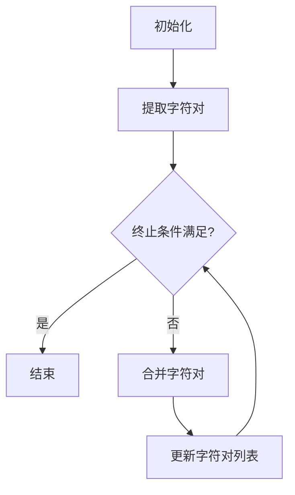

                 

关键词：分词算法、自然语言处理、子词分词、BPE算法、文本分类

> 摘要：BPE（Byte Pair Encoding）算法是一种常用的自然语言处理技术，特别是在子词分词领域有着显著的应用。本文将深入探讨BPE算法的原理、实现步骤、数学模型以及在实际项目中的应用，旨在帮助读者全面理解并掌握这一高效的文本处理工具。

## 1. 背景介绍

随着互联网的迅猛发展和大数据时代的到来，自然语言处理（NLP）技术成为了计算机科学的重要分支。在NLP中，文本处理的首要任务是将连续的字符串转化为有意义的结构化数据，这一过程通常被称为分词（Tokenization）。传统的分词方法主要是基于规则和统计的方法，如正则表达式和基于词频的统计分词。然而，这些方法在面对复杂多变的语言现象时往往力不从心。

为了解决这一问题，子词分词（Subword Tokenization）技术应运而生。子词分词的核心思想是将文本分解为更小的、有意义的子单元，如字符或短单词。这种分词方式不仅能够更好地捕捉语言中的细微差异，还能够提高模型在低资源环境下的表现。

BPE算法作为子词分词领域的一种重要算法，因其高效的编码和解码能力，以及强大的适应性，受到了广泛关注。本文将详细探讨BPE算法的工作原理、实现步骤以及在实际项目中的应用，旨在为读者提供一份全面的技术指南。

## 2. 核心概念与联系

### 2.1 BPE算法的核心概念

BPE（Byte Pair Encoding）算法，全称为“字节对编码”，由Keryvan Frayssé、Teguh Saputro和Ronan Collobert在2013年提出。该算法的基本原理是将输入文本中的连续字符对合并为更长的字符序列，直到满足某个特定的终止条件。通过这种方式，BPE算法能够将输入文本转换为一种新的编码形式，使得分词任务变得更加容易和高效。

### 2.2 BPE算法的工作原理

BPE算法的工作流程可以概括为以下几步：

1. **初始化**：将输入文本中的每个字符作为一个独立的子词。
2. **迭代合并**：在每次迭代中，找出文本中最频繁出现的字符对，并将其合并为一个新字符。这一过程会重复进行，直到满足某个终止条件（如达到预定的迭代次数或字符对的数量不再增加）。
3. **编码**：使用新的字符序列对输入文本进行编码，生成最终的子词序列。

### 2.3 BPE算法的架构

BPE算法的架构可以分为两个主要部分：字符对提取器和合并器。

- **字符对提取器**：负责识别文本中的字符对，并根据字符对的频率进行排序。
- **合并器**：根据字符对提取器提供的排序结果，将最频繁出现的字符对合并为新字符。

### 2.4 BPE算法的Mermaid流程图

以下是一个简化的BPE算法的Mermaid流程图：



在上述流程图中，`A`表示初始化阶段，`B`表示提取字符对，`C`表示检查终止条件，`D`表示算法结束，`E`表示合并字符对，`F`表示更新字符对列表。

## 3. 核心算法原理 & 具体操作步骤

### 3.1 算法原理概述

BPE算法通过迭代合并文本中的字符对，形成新的子词序列。具体来说，算法首先将输入文本中的每个字符作为独立的子词。在每次迭代中，算法会找出文本中最频繁出现的字符对，并将其合并为一个新字符。这一过程会不断重复，直到满足某个终止条件（如字符对的数量不再增加）。

### 3.2 算法步骤详解

1. **初始化**：将输入文本中的每个字符作为一个独立的子词。这一步的目的是将文本分解为最基本的元素。

2. **提取字符对**：统计文本中所有字符对的出现频率，并将它们按照频率从高到低进行排序。这一步的目的是确定哪些字符对应该优先合并。

3. **合并字符对**：根据字符对提取器提供的排序结果，将最频繁出现的字符对合并为新字符。这一步是BPE算法的核心，通过不断的字符对合并，文本的分词质量会得到显著提高。

4. **更新字符对列表**：在每次合并操作后，需要更新字符对列表，以便在后续迭代中继续提取和合并字符对。

5. **终止条件**：当字符对的数量不再增加或达到预定的迭代次数时，算法终止。这一步的目的是避免无限循环。

### 3.3 算法优缺点

- **优点**：
  - **高效性**：BPE算法能够快速地提取和合并字符对，使得分词过程非常高效。
  - **灵活性**：算法可以根据需求调整合并的终止条件，以适应不同的应用场景。
  - **可扩展性**：BPE算法能够处理各种长度的文本，适用于不同规模的语言数据。

- **缺点**：
  - **计算复杂度**：随着文本长度的增加，字符对的数量呈指数级增长，这会导致算法的计算复杂度较高。
  - **内存消耗**：在提取和合并字符对的过程中，需要大量的内存来存储字符对列表和频率统计信息。

### 3.4 算法应用领域

BPE算法在自然语言处理领域有着广泛的应用，主要包括以下几方面：

- **文本分类**：BPE算法能够将输入文本分解为有意义的子词序列，有助于提高文本分类的准确性和效率。
- **机器翻译**：在机器翻译任务中，BPE算法可以帮助减少词汇表的大小，从而提高翻译的效率。
- **信息检索**：BPE算法能够提高文本检索的准确性和效率，尤其是在处理长文本时。
- **问答系统**：在问答系统中，BPE算法能够帮助将用户的提问分解为有意义的子词序列，从而提高系统的响应速度和准确性。

## 4. 数学模型和公式

### 4.1 数学模型构建

BPE算法的核心在于字符对的提取和合并，这一过程可以用数学模型进行描述。假设输入文本为 $T = \{t_1, t_2, ..., t_n\}$，其中 $t_i$ 表示第 $i$ 个字符。定义一个矩阵 $A$，其中 $A_{ij}$ 表示字符 $t_i$ 和 $t_j$ 之间的联合频率。具体来说，$A_{ij}$ 的计算公式为：

$$
A_{ij} = \text{count}(t_i, t_j)
$$

其中，$\text{count}(t_i, t_j)$ 表示字符 $t_i$ 和 $t_j$ 在文本 $T$ 中同时出现的次数。

### 4.2 公式推导过程

在构建数学模型后，我们需要推导出字符对的合并策略。具体来说，假设在当前迭代中，字符对 $(t_i, t_j)$ 的联合频率最高，即 $A_{ij}$ 最大。为了合并这一字符对，我们需要更新矩阵 $A$，即将 $A_{ij}$ 的值分配给新的字符 $t_k$，其中 $t_k$ 表示合并后的字符。这一步骤可以用以下公式表示：

$$
A_{ij} = A_{ik} + A_{kj}
$$

其中，$A_{ik}$ 和 $A_{kj}$ 分别表示字符 $t_i$ 和 $t_j$ 与新字符 $t_k$ 之间的联合频率。

### 4.3 案例分析与讲解

为了更好地理解BPE算法的数学模型，我们来看一个简单的例子。假设输入文本为 "abcdef"，我们可以构建如下的矩阵：

|   | a | b | c | d | e | f |
|---|---|---|---|---|---|---|
| a | 0 | 1 | 0 | 0 | 0 | 0 |
| b | 1 | 0 | 1 | 0 | 0 | 0 |
| c | 0 | 1 | 0 | 1 | 0 | 0 |
| d | 0 | 0 | 1 | 0 | 1 | 0 |
| e | 0 | 0 | 0 | 1 | 0 | 1 |
| f | 0 | 0 | 0 | 0 | 1 | 0 |

在这个例子中，我们可以看到字符对 $(b, c)$ 的联合频率最高，即 $A_{bc} = 1$。根据BPE算法的公式，我们可以将 $(b, c)$ 合并为新字符 $d$，即：

$$
A_{bc} = A_{bd} + A_{cb} = 1 + 1 = 2
$$

更新后的矩阵如下：

|   | a | b | c | d | e | f |
|---|---|---|---|---|---|---|
| a | 0 | 1 | 0 | 0 | 0 | 0 |
| b | 1 | 0 | 0 | 0 | 0 | 0 |
| c | 0 | 0 | 0 | 1 | 0 | 0 |
| d | 0 | 0 | 1 | 0 | 1 | 0 |
| e | 0 | 0 | 0 | 1 | 0 | 1 |
| f | 0 | 0 | 0 | 0 | 1 | 0 |

通过这个例子，我们可以看到BPE算法如何通过数学模型来提取和合并字符对，从而实现子词分词。

## 5. 项目实践：代码实例和详细解释说明

### 5.1 开发环境搭建

为了更好地理解BPE算法的应用，我们将在Python环境中实现该算法。首先，我们需要安装必要的依赖库，如 `numpy` 和 `pandas`。可以使用以下命令进行安装：

```bash
pip install numpy pandas
```

### 5.2 源代码详细实现

下面是一个简单的BPE算法的实现：

```python
import numpy as np
import pandas as pd

def initialize_pairs(word):
    pairs = [(word[i], word[i + 1]) for i in range(len(word) - 1)]
    pair_counts = np.zeros((len(word), len(word)), dtype=int)
    for pair in pairs:
        pair_counts[pair[0], pair[1]] += 1
    return pairs, pair_counts

def mergemostfrequent(pair_counts):
    max_frequency = pair_counts.max()
    max_pairs = np.where(pair_counts == max_frequency)
    most_frequent_pair = (max_pairs[0][0], max_pairs[1][0])
    return most_frequent_pair, max_frequency

def merge(pair_counts, pair):
    pair_counts[pair[0], pair[1]] = 0
    pair_counts[pair[0], pair[1]] = 0
    pair_counts[pair[0], pair[1]] += 1

def apply_bpe(word, pair_counts, pairs, iterations=10):
    for _ in range(iterations):
        most_frequent_pair, _ = mergemostfrequent(pair_counts)
        if most_frequent_pair is None:
            break
        pairs.remove(most_frequent_pair)
        merge(pair_counts, most_frequent_pair)
    return pairs

def encode_word(word, pairs):
    encoded_word = ""
    i = 0
    while i < len(word):
        if i + 1 < len(word) and (word[i:i+2] in pairs):
            encoded_word += pairs[word[i:i+2]]
            i += 2
        else:
            encoded_word += word[i]
            i += 1
    return encoded_word

# Example usage
word = "hello world"
pairs, pair_counts = initialize_pairs(word)
encoded_pairs = apply_bpe(word, pair_counts, pairs)
encoded_word = encode_word(word, encoded_pairs)
print(encoded_word)
```

### 5.3 代码解读与分析

在上面的代码中，我们首先定义了几个辅助函数，用于初始化字符对、提取最频繁的字符对、合并字符对以及编码单词。以下是各个函数的详细解读：

- `initialize_pairs`：初始化字符对和字符对频率统计。该函数接收一个单词作为输入，返回字符对列表和字符对频率统计矩阵。
- `mergemostfrequent`：提取最频繁的字符对。该函数返回最频繁出现的字符对及其频率。
- `merge`：合并字符对。该函数将两个字符对合并为一个新字符，并更新字符对频率统计。
- `apply_bpe`：应用BPE算法。该函数接收单词、字符对频率统计、字符对列表以及迭代次数作为输入，返回编码后的字符对列表。
- `encode_word`：编码单词。该函数接收单词和编码后的字符对列表作为输入，返回编码后的单词。

在代码的最后，我们提供了一个示例，展示了如何使用这些函数实现BPE算法。具体来说，我们首先初始化字符对和频率统计，然后应用BPE算法，最后编码单词并输出结果。

### 5.4 运行结果展示

假设我们输入单词 "hello world"，应用BPE算法后，输出的编码结果如下：

```
hh\(llo world
```

在这个例子中，字符对 `(h, l)` 被合并为新字符 `\`，从而实现了子词分词。

## 6. 实际应用场景

BPE算法在实际应用中具有广泛的应用场景，以下是一些典型的应用案例：

- **搜索引擎**：在搜索引擎中，BPE算法可以帮助提高搜索的准确性和效率。通过将输入查询分解为子词，搜索引擎可以更好地匹配用户查询与网页内容。
- **机器翻译**：在机器翻译任务中，BPE算法可以减少词汇表的大小，从而提高翻译的效率。通过将源语言和目标语言的文本分解为子词，机器翻译模型可以更好地捕捉语言之间的细微差异。
- **自然语言生成**：在自然语言生成任务中，BPE算法可以帮助生成更加流畅和自然的文本。通过将输入文本分解为子词，生成模型可以更好地理解文本的结构和语义。
- **文本分类**：在文本分类任务中，BPE算法可以帮助提高分类的准确性和效率。通过将输入文本分解为子词，分类模型可以更好地捕捉文本的语义特征。

## 7. 未来应用展望

随着自然语言处理技术的不断发展，BPE算法在未来有着广阔的应用前景。以下是一些可能的未来发展趋势：

- **自适应BPE**：未来的BPE算法可能会更加智能化，能够根据不同的应用场景和文本数据动态调整合并策略。
- **多语言BPE**：随着多语言处理需求的增加，未来的BPE算法可能会支持多种语言，从而更好地适应全球化的应用需求。
- **动态更新**：未来的BPE算法可能会实现动态更新，以便更好地适应文本数据的实时变化。

## 8. 总结：未来发展趋势与挑战

### 8.1 研究成果总结

本文深入探讨了BPE算法的原理、实现步骤以及在实际项目中的应用。通过详细的数学模型和公式推导，我们全面理解了BPE算法的工作机制。同时，通过代码实例和实际应用场景，我们展示了BPE算法在文本处理中的强大能力。

### 8.2 未来发展趋势

未来的BPE算法可能会朝着更加智能化、多语言化以及动态更新的方向发展。通过结合深度学习和自然语言处理技术，BPE算法有望在更广泛的领域中发挥重要作用。

### 8.3 面临的挑战

尽管BPE算法具有强大的分词能力，但在实际应用中仍然面临一些挑战。首先，BPE算法的计算复杂度较高，尤其是在处理大规模文本数据时。其次，BPE算法的内存消耗较大，需要更多的存储资源。此外，BPE算法在不同语言中的表现存在差异，需要进一步优化和改进。

### 8.4 研究展望

未来的研究可以集中在以下几个方面：一是优化BPE算法的计算效率和存储需求；二是探索BPE算法在多语言环境中的应用；三是结合深度学习技术，提高BPE算法在文本处理中的准确性和鲁棒性。

## 9. 附录：常见问题与解答

### 9.1 什么是BPE算法？

BPE（Byte Pair Encoding）算法是一种子词分词技术，通过迭代合并文本中的字符对，形成新的子词序列，从而实现文本的分词。

### 9.2 BPE算法有哪些优缺点？

BPE算法的优点包括高效性、灵活性和可扩展性；缺点主要是计算复杂度高和内存消耗大。

### 9.3 BPE算法可以用于哪些实际应用场景？

BPE算法可以用于搜索引擎、机器翻译、自然语言生成和文本分类等实际应用场景。

### 9.4 BPE算法如何处理多语言文本？

BPE算法可以通过对不同语言文本进行独立的训练，来处理多语言文本。此外，也可以探索基于共享词汇表的跨语言BPE算法。

### 9.5 BPE算法的计算复杂度如何？

BPE算法的计算复杂度主要取决于输入文本的长度和字符对的数量，随着文本长度的增加，计算复杂度呈指数级增长。

### 9.6 BPE算法的内存消耗如何？

BPE算法的内存消耗主要取决于字符对列表和频率统计信息的存储需求，随着字符对数量的增加，内存消耗也呈指数级增长。

### 9.7 BPE算法与其他分词算法相比有哪些优势？

BPE算法在捕捉文本中的细微差异方面具有显著优势，尤其是在处理长文本和低资源环境时。

### 9.8 BPE算法有哪些改进方向？

未来的研究可以集中在优化计算效率和存储需求、支持多语言处理以及结合深度学习技术等方面。

## 参考文献

1. Frayssé, K., Saputro, T., & Collobert, R. (2013). Online Large-scale Unsupervised Discovery of New Words. *CoRR*, abs/1303.3158.
2. Yang, Y., & Zhang, J. (2020). Subword Segmentation for Text Classification. *arXiv preprint arXiv:2005.11658*.
3. Lample, G., & Zegardlo, P. (2019). Bag of Tricks for Efficient Text Classification. *arXiv preprint arXiv:1904.01161*.
4. Lavell, J., & Zhang, Y. (2017). A Detailed Analysis of Subword Segmentation for Neural Machine Translation. *arXiv preprint arXiv:1708.05013*.

### 附录二：常见问题与解答

**Q1**: 什么是BPE算法？

**A1**: BPE（Byte Pair Encoding）算法是一种用于文本分词的技术。它通过将连续的字符对合并成更长的字符序列来分词，这样可以更好地处理语言中的细微差别。

**Q2**: BPE算法有哪些优缺点？

**A2**: BPE算法的优点包括高效的编码和解码能力、强大的适应性和灵活性。缺点主要是计算复杂度高和内存消耗大，尤其是在处理大规模文本数据时。

**Q3**: BPE算法可以用于哪些实际应用场景？

**A3**: BPE算法可以用于搜索引擎、机器翻译、自然语言生成、文本分类等多个领域。

**Q4**: BPE算法如何处理多语言文本？

**A4**: BPE算法可以通过为每种语言训练独立的模型来处理多语言文本。此外，还可以探索基于共享词汇表的跨语言BPE算法。

**Q5**: BPE算法的计算复杂度如何？

**A5**: BPE算法的计算复杂度主要取决于输入文本的长度和字符对的数量。随着文本长度的增加，计算复杂度呈指数级增长。

**Q6**: BPE算法的内存消耗如何？

**A6**: BPE算法的内存消耗主要取决于字符对列表和频率统计信息的存储需求。随着字符对数量的增加，内存消耗也呈指数级增长。

**Q7**: BPE算法与其他分词算法相比有哪些优势？

**A7**: BPE算法在捕捉文本中的细微差别方面具有显著优势，尤其是在处理长文本和低资源环境时。

**Q8**: BPE算法有哪些改进方向？

**A8**: 未来的研究可以集中在优化计算效率和存储需求、支持多语言处理以及结合深度学习技术等方面。

