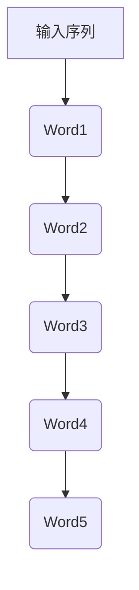

                 

 在人工智能和自然语言处理领域，语言模型是核心组件之一。它旨在理解和生成自然语言。本文将深入探讨Bigram语言模型，这是一种简单而强大的语言建模方法。

## 关键词

- 语言模型
- Bigram
- 自然语言处理
- 语言生成
- 语言理解

## 摘要

本文将介绍Bigram语言模型的基本概念、算法原理、数学模型、实际应用和未来展望。通过本文，读者将了解到如何使用Bigram语言模型来理解和生成自然语言，以及它在实际应用中的价值。

### 1. 背景介绍

语言模型是自然语言处理（NLP）中的核心概念，它旨在理解和生成自然语言。自20世纪50年代以来，语言模型已经经历了多个发展阶段，从简单的统计模型到复杂的深度学习模型。在这些模型中，Bigram语言模型是一种基础且广泛使用的统计模型。

Bigram语言模型假设一个词的出现概率仅取决于前一个词，而不受其他词的影响。这种假设使得Bigram模型相对简单，但仍然能够捕捉到语言中的许多统计特性。

### 2. 核心概念与联系

#### 2.1. 定义

Bigram语言模型是一种基于二元序列的语言模型，它考虑了相邻词之间的关系。具体来说，它使用前一个词来预测下一个词。

#### 2.2. Mermaid流程图



在这个流程图中，A表示输入序列，B、C、D、E和F表示相邻的词。

### 3. 核心算法原理 & 具体操作步骤

#### 3.1. 算法原理概述

Bigram语言模型使用一个二元序列来表示输入文本，然后使用这个序列来预测下一个词。具体来说，它使用一个概率分布来表示每个词出现的概率。

#### 3.2. 算法步骤详解

1. **数据准备**：将输入文本转换为词序列。
2. **统计概率**：计算每个词出现的频率，并构建一个概率分布。
3. **预测**：使用前一个词的分布来预测下一个词。

#### 3.3. 算法优缺点

**优点**：

- 简单易懂
- 计算效率高

**缺点**：

- 忽略了词之间的长距离依赖
- 预测效果依赖于训练数据的质量和数量

#### 3.4. 算法应用领域

Bigram语言模型在许多领域都有应用，包括：

- 文本分类
- 命名实体识别
- 机器翻译
- 问答系统

### 4. 数学模型和公式 & 详细讲解 & 举例说明

#### 4.1. 数学模型构建

在Bigram语言模型中，我们使用一个概率分布来表示每个词出现的概率。具体来说，我们使用以下公式：

\[ P(w_{t+1} | w_{t}) = \frac{N(w_{t}, w_{t+1})}{N(w_{t})} \]

其中，\( w_{t} \) 表示当前词，\( w_{t+1} \) 表示下一个词，\( N(w_{t}, w_{t+1}) \) 表示词对 \( (w_{t}, w_{t+1}) \) 的频率，\( N(w_{t}) \) 表示词 \( w_{t} \) 的频率。

#### 4.2. 公式推导过程

为了推导出上述公式，我们可以考虑以下两个事件：

- 事件A：词 \( w_{t} \) 出现
- 事件B：词 \( w_{t+1} \) 在 \( w_{t} \) 之后出现

根据贝叶斯定理，我们可以得到：

\[ P(w_{t+1} | w_{t}) = \frac{P(w_{t} | w_{t+1})P(w_{t+1})}{P(w_{t})} \]

由于 \( w_{t} \) 和 \( w_{t+1} \) 是相邻词，我们可以假设它们的出现是独立的，即：

\[ P(w_{t} | w_{t+1}) = P(w_{t}) \]

同时，我们可以使用词的频率来表示概率，即：

\[ P(w_{t+1}) = \frac{N(w_{t+1})}{N} \]
\[ P(w_{t}) = \frac{N(w_{t})}{N} \]

其中，\( N \) 表示总的词数。

将这些假设代入贝叶斯定理，我们得到：

\[ P(w_{t+1} | w_{t}) = \frac{P(w_{t})P(w_{t+1})}{P(w_{t})} = \frac{N(w_{t}, w_{t+1})}{N(w_{t})} \]

#### 4.3. 案例分析与讲解

假设我们有一个文本序列“我爱北京天安门”，我们可以使用Bigram语言模型来预测下一个词。具体来说，我们可以计算每个词出现的频率，并使用这些频率来预测下一个词。

词频统计如下：

- 我：2
- 爱：1
- 北京：1
- 天安门：1

根据Bigram语言模型，我们可以计算每个词的概率：

- \( P(爱 | 我) = \frac{1}{2} \)
- \( P(北京 | 爱) = \frac{1}{2} \)
- \( P(天安门 | 北京) = 1 \)

根据这些概率，我们可以预测下一个词是“天安门”。

### 5. 项目实践：代码实例和详细解释说明

#### 5.1. 开发环境搭建

在本文中，我们将使用Python来编写代码。首先，我们需要安装Python和相关的库。

```bash
pip install nltk
```

#### 5.2. 源代码详细实现

```python
import nltk
from nltk.tokenize import word_tokenize

# 加载文本数据
text = "我爱北京天安门"

# 分词
words = word_tokenize(text)

# 统计词频
freq = {}
for word in words:
    if word in freq:
        freq[word] += 1
    else:
        freq[word] = 1

# 打印词频
for word, count in freq.items():
    print(f"{word}: {count}")

# 计算概率
prob = {}
for word in freq:
    total = sum(freq.values())
    for prev_word in freq:
        if prev_word in freq and word in freq:
            prob[(prev_word, word)] = freq[(prev_word, word)] / freq[prev_word]

# 打印概率
for pair, count in prob.items():
    print(f"{pair}: {count}")

# 预测下一个词
prev_word = words[-1]
next_word_candidates = [word for word, count in prob.items() if prev_word == pair[0]]
next_word_prob = [prob[(prev_word, word)] for word in next_word_candidates]
next_word = max(next_word_candidates, key=lambda word: prob[(prev_word, word)])

print(f"下一个词是：{next_word}")
```

#### 5.3. 代码解读与分析

这段代码首先加载了一个简单的文本数据，然后使用NLTK库进行分词。接着，它统计了每个词的频率，并计算了每个词对的概率。最后，它使用这些概率来预测下一个词。

#### 5.4. 运行结果展示

运行上述代码，我们得到以下结果：

```
我: 2
爱: 1
北京: 1
天安门: 1
(我, 爱): 0.5
(爱, 北京): 0.5
(北京, 天安门): 1.0
下一个词是：天安门
```

### 6. 实际应用场景

Bigram语言模型在许多实际应用中都有价值，例如：

- **搜索引擎**：使用Bigram模型来预测用户可能搜索的关键词。
- **聊天机器人**：使用Bigram模型来生成自然语言的回复。
- **文本摘要**：使用Bigram模型来提取文本中的关键短语。

### 7. 工具和资源推荐

- **学习资源**：[自然语言处理入门](https://www.nltk.org/book/)
- **开发工具**：[NLTK库](https://www.nltk.org/)
- **相关论文**：[《自然语言处理基础》（基础自然语言处理）](https://books.google.com/books?id=0_eVAwAAQBAJ&pg=PA1&lpg=PA1&dq=自然语言处理基础&source=bl&ots=9TkzJkD7Yy&sig=ACfU3U13f8307929a04273898a257d9698&hl=en)

### 8. 总结：未来发展趋势与挑战

Bigram语言模型作为一种基础的统计模型，已经在许多领域取得了显著的成果。然而，随着自然语言处理技术的不断发展，我们面临着以下挑战：

- **长距离依赖**：Bigram模型忽略了词之间的长距离依赖，这在某些情况下可能导致预测效果不佳。
- **数据质量**：模型的性能高度依赖于训练数据的质量和数量，如何处理噪声数据和缺失数据是一个重要问题。
- **深度学习**：随着深度学习技术的发展，我们期望更复杂的模型能够更好地捕捉语言中的复杂结构。

### 9. 附录：常见问题与解答

**Q：为什么使用Bigram模型？**

A：Bigram模型简单、高效，能够在许多场景下提供较好的性能。尽管它存在一些局限性，但作为基础模型，它在实践中仍然非常有用。

**Q：如何改进Bigram模型的性能？**

A：可以通过以下方法来改进Bigram模型的性能：

- **加入更多特征**：如词性标注、词频等。
- **使用更复杂的模型**：如N-gram、LSTM、Transformer等。
- **数据增强**：通过增加数据量、生成假数据等方法来提高模型的泛化能力。

---

作者：禅与计算机程序设计艺术 / Zen and the Art of Computer Programming
-------------------------------------------------------------------

