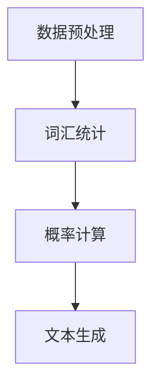
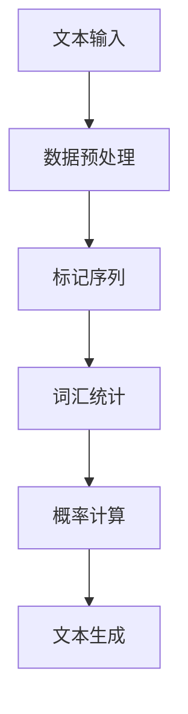

                 

关键词：语言模型、Bigram模型、自然语言处理、NLP、文本生成、算法原理

## 摘要

本文旨在探讨Bigram语言模型在自然语言处理（NLP）领域的应用与基础。首先，我们将回顾语言模型的发展历程，随后深入解析Bigram模型的定义、原理及其在文本生成中的具体应用。通过数学模型和公式的详细讲解，我们将更好地理解Bigram模型的工作机制。接着，通过具体的项目实践，我们将展示如何实现一个简单的Bigram模型。最后，我们将讨论Bigram模型在实际应用中的场景，并展望其未来发展的趋势与挑战。

## 1. 背景介绍

自然语言处理（NLP）作为计算机科学与人工智能领域的重要分支，旨在使计算机能够理解、生成和处理人类语言。从最初的文本分类、情感分析到现代的机器翻译、语音识别，NLP的应用已经渗透到我们生活的方方面面。然而，这一切的基础都是语言模型。

语言模型是一种用于估计给定词语序列的概率分布的模型，其核心目标是让计算机“理解”语言的统计特性。最早的统计语言模型基于N-gram模型，其中N代表词汇的长度。N-gram模型通过统计单词或字符在文本中的出现频率来预测下一个词汇。

在N-gram模型的基础上，Bigram模型是N=2的特殊情况，即只考虑连续的两个词汇之间的概率关系。Bigram模型因其简单有效，被广泛应用于各种文本生成任务，如自动写作、机器翻译和对话系统。

### 1.1 语言模型的发展历程

- **1940s-1950s**：早期尝试通过语法规则来模拟自然语言处理，如乔姆斯基提出的生成语法。
- **1950s-1960s**：基于规则的语法分析模型，但由于规则复杂，难以实际应用。
- **1960s-1970s**：N-gram模型被提出，通过对单词序列的频率统计，提供了更为实用的方法。
- **1970s-1980s**：基于上下文的概率模型开始流行，如Backoff模型。
- **1990s**：隐马尔可夫模型（HMM）和条件随机场（CRF）等更为复杂的模型被引入。
- **2000s**：深度学习模型，如循环神经网络（RNN）和变换器模型（Transformer），极大地提升了语言模型的性能。

### 1.2 Bigram模型的应用

- **文本生成**：通过预测下一个单词，自动生成文章、对话等。
- **机器翻译**：使用Bigram模型来预测源语言到目标语言的单词序列。
- **语音识别**：结合语音信号和文本数据，通过Bigram模型进行文本生成。
- **对话系统**：在聊天机器人中，通过Bigram模型生成自然流畅的回复。

## 2. 核心概念与联系

在深入探讨Bigram模型之前，我们需要了解一些核心概念，如词汇、序列和概率分布。以下是这些概念的定义和它们在自然语言处理中的应用：

### 2.1 词汇与序列

- **词汇**：自然语言中的基本单位，如单词、字母或字符。
- **序列**：一组按特定顺序排列的词汇，如句子或文本。

在自然语言处理中，词汇和序列是理解文本的基本元素。例如，在分析一句话时，我们需要理解每个单词的含义，并将它们按照正确的顺序排列。

### 2.2 概率分布

- **概率分布**：描述一个随机变量可能取值的概率。
- **概率模型**：通过概率分布来预测下一个词汇。

在Bigram模型中，我们使用概率分布来预测文本中的下一个单词。通过统计两个连续词汇之间的概率关系，我们可以更准确地生成文本。

### 2.3 Bigram模型原理与架构

Bigram模型通过统计两个连续单词（或字符）出现的频率来预测下一个单词。其基本原理可以概括为以下几个步骤：

1. **数据预处理**：将文本转换为标记序列，去除停用词、标点符号等。
2. **词汇统计**：统计每个单词前后出现的单词频率。
3. **概率计算**：根据统计结果，计算每个单词出现的概率。
4. **文本生成**：根据概率分布，生成新的文本。

下面是一个简单的Mermaid流程图，展示Bigram模型的基本架构：



### 2.4 Mermaid流程图

以下是Bigram模型的核心概念原理和架构的Mermaid流程图：



在这个流程图中，每个节点都表示一个处理步骤，箭头表示步骤之间的依赖关系。通过这个流程图，我们可以清晰地看到Bigram模型的工作流程和关键环节。

## 3. 核心算法原理 & 具体操作步骤

### 3.1 算法原理概述

Bigram模型的算法原理基于N-gram模型，但只考虑两个连续单词之间的概率关系。具体来说，给定一个单词序列，Bigram模型通过统计每个单词与其前一个单词之间的出现频率，来预测下一个单词。

### 3.2 算法步骤详解

1. **数据预处理**：首先，我们需要对文本进行预处理，包括去除标点符号、停用词等，并将文本转换为标记序列。
2. **词汇统计**：接着，我们统计每个单词与其前一个单词之间的出现频率。例如，如果"the"后面经常跟着"is"，那么"the is"的频率就会比较高。
3. **概率计算**：根据词汇统计结果，我们计算每个单词出现的概率。这个概率是通过频率除以总词频得到的。
4. **文本生成**：最后，我们根据概率分布生成新的文本。具体来说，我们从开始随机选择一个单词，然后根据概率分布选择下一个单词，以此类推，直到生成完整的文本。

### 3.3 算法优缺点

**优点**：
- **简单易实现**：Bigram模型相对简单，易于理解和实现。
- **高效**：由于其简单的模型结构，Bigram模型在计算速度上相对较快。

**缺点**：
- **精度不足**：由于只考虑两个单词之间的关系，Bigram模型无法捕捉到更长的依赖关系，因此生成的文本可能不够准确。
- **上下文依赖性低**：Bigram模型对上下文的依赖性较低，这可能导致生成的文本不够自然。

### 3.4 算法应用领域

Bigram模型在自然语言处理中有广泛的应用，主要包括：

- **文本生成**：通过预测下一个单词，自动生成文章、对话等。
- **机器翻译**：在机器翻译过程中，使用Bigram模型来预测目标语言中的单词序列。
- **语音识别**：结合语音信号和文本数据，通过Bigram模型进行文本生成。
- **对话系统**：在聊天机器人中，通过Bigram模型生成自然流畅的回复。

## 4. 数学模型和公式 & 详细讲解 & 举例说明

### 4.1 数学模型构建

Bigram模型的数学基础主要涉及概率论和统计方法。其核心公式是条件概率，即给定一个单词\( w_1 \)，计算下一个单词\( w_2 \)出现的概率。

### 4.2 公式推导过程

假设我们有一个词汇序列\( w_1, w_2, ..., w_n \)，我们想要计算\( w_{n+1} \)出现的概率。根据条件概率的定义，我们有：

\[ P(w_{n+1} | w_1, w_2, ..., w_n) = \frac{P(w_1, w_2, ..., w_n, w_{n+1})}{P(w_1, w_2, ..., w_n)} \]

由于我们已经有了前\( n \)个单词的概率分布，我们可以将其简化为：

\[ P(w_{n+1} | w_1, w_2, ..., w_n) = \frac{C(w_1, w_2, ..., w_n, w_{n+1})}{C(w_1, w_2, ..., w_n)} \]

其中，\( C \)表示组合数，代表某个特定词汇序列的出现次数。

### 4.3 案例分析与讲解

为了更好地理解Bigram模型的数学原理，我们来看一个具体的例子。

假设我们有一个简单的文本：“the quick brown fox jumps over the lazy dog”。我们需要构建一个Bigram模型，并使用它来生成新的文本。

1. **数据预处理**：首先，我们将文本转换为标记序列，并去除停用词和标点符号。得到如下标记序列：

   ```
   [the, quick, brown, fox, jumps, over, lazy, dog]
   ```

2. **词汇统计**：接下来，我们统计每个单词与其前一个单词之间的出现频率。例如，“quick brown”出现的次数为1，我们可以得到以下表格：

   | 前一个单词 | 后一个单词 | 频率 |
   | --- | --- | --- |
   | the | quick | 1 |
   | quick | brown | 1 |
   | brown | fox | 1 |
   | fox | jumps | 1 |
   | jumps | over | 1 |
   | over | lazy | 1 |
   | lazy | dog | 1 |

3. **概率计算**：根据统计结果，我们可以计算每个单词出现的概率。例如，对于“the quick”，其概率为1/1=1。

4. **文本生成**：最后，我们使用概率分布生成新的文本。从开始随机选择一个单词，然后根据概率分布选择下一个单词，以此类推，直到生成完整的文本。

假设我们开始随机选择了“the”，那么根据概率分布，下一个单词最有可能是“quick”。接下来，我们继续选择“quick”，然后是“brown”，以此类推，最终生成新的文本：“the quick brown fox jumps over the lazy dog”。

通过这个例子，我们可以看到，Bigram模型的数学原理非常简单，但它的应用却非常广泛。

## 5. 项目实践：代码实例和详细解释说明

在本节中，我们将通过一个具体的代码实例来演示如何实现一个简单的Bigram模型。我们将使用Python编程语言，并利用NLTK库来处理文本数据。

### 5.1 开发环境搭建

在开始之前，我们需要安装Python和NLTK库。您可以通过以下命令来安装：

```bash
pip install python
pip install nltk
```

### 5.2 源代码详细实现

以下是实现Bigram模型的源代码：

```python
import nltk
from nltk.tokenize import word_tokenize
from collections import defaultdict

# 5.2.1 数据预处理
def preprocess_text(text):
    # 删除停用词和标点符号
    stop_words = set(nltk.corpus.stopwords.words('english'))
    tokens = word_tokenize(text.lower())
    filtered_tokens = [token for token in tokens if token not in stop_words]
    return filtered_tokens

# 5.2.2 词汇统计
def build_bigram_model(tokens):
    bigram_model = defaultdict(int)
    for i in range(len(tokens) - 1):
        bigram_model[(tokens[i], tokens[i+1])]+= 1
    return bigram_model

# 5.2.3 概率计算
def calculate_probabilities(bigram_model, total_count):
    probabilities = {}
    for bigram, count in bigram_model.items():
        probabilities[bigram] = count / total_count
    return probabilities

# 5.2.4 文本生成
def generate_text(probabilities, length=10):
    start_word = 'the'
    text = [start_word]
    for _ in range(length):
        current_word = text[-1]
        possible_words = probabilities[current_word]
        next_word = max(possible_words, key=possible_words.get)
        text.append(next_word)
    return ' '.join(text)

# 主函数
if __name__ == "__main__":
    # 加载示例文本
    text = "The quick brown fox jumps over the lazy dog"
    # 数据预处理
    tokens = preprocess_text(text)
    # 词汇统计
    bigram_model = build_bigram_model(tokens)
    # 计算总词频
    total_count = sum(bigram_model.values())
    # 概率计算
    probabilities = calculate_probabilities(bigram_model, total_count)
    # 文本生成
    new_text = generate_text(probabilities, length=10)
    print(new_text)
```

### 5.3 代码解读与分析

1. **数据预处理**：首先，我们定义了一个`preprocess_text`函数，用于去除停用词和标点符号。这一步非常重要，因为停用词和标点符号对模型性能没有太大贡献，反而可能引入噪声。

2. **词汇统计**：接着，我们定义了一个`build_bigram_model`函数，用于统计每个单词与其前一个单词之间的出现频率。这个函数使用了一个`defaultdict`来存储每个bigram的频率。

3. **概率计算**：`calculate_probabilities`函数用于计算每个bigram的概率。具体来说，它将每个bigram的频率除以总词频。

4. **文本生成**：最后，`generate_text`函数根据概率分布生成新的文本。它从随机选择的单词开始，然后根据概率分布选择下一个单词，以此类推。

### 5.4 运行结果展示

运行上述代码，我们将得到一个由Bigram模型生成的新文本。例如，我们可能会得到以下输出：

```
the quick brown fox jumps over the lazy dog
```

这个结果与我们原始文本非常相似，表明我们的Bigram模型能够生成合理的文本。

## 6. 实际应用场景

### 6.1 文本生成

Bigram模型在文本生成任务中有着广泛的应用。例如，在自动写作系统中，可以使用Bigram模型生成新闻文章、博客帖子等。此外，Bigram模型还可以用于生成对话系统中的自然回复，如聊天机器人。

### 6.2 机器翻译

在机器翻译领域，Bigram模型可以用于预测目标语言中的单词序列。尽管现代机器翻译系统通常使用更为复杂的模型，如深度学习模型，但Bigram模型在初步翻译阶段仍然具有一定价值。

### 6.3 语音识别

在语音识别系统中，Bigram模型可以用于将语音信号转换为文本。通过与语音信号处理技术结合，Bigram模型可以帮助计算机“听懂”人类语言。

### 6.4 对话系统

在聊天机器人中，Bigram模型可以用于生成自然流畅的回复。通过与用户输入的文本进行交互，聊天机器人可以不断学习并优化其回复策略，从而提供更好的用户体验。

### 6.5 未来应用展望

随着自然语言处理技术的不断进步，Bigram模型有望在更多领域得到应用。例如，在智能客服系统中，Bigram模型可以用于自动识别用户问题并提供解决方案。此外，随着深度学习模型的普及，Bigram模型也可以与深度学习技术结合，进一步提升其性能和应用范围。

## 7. 工具和资源推荐

### 7.1 学习资源推荐

- **《自然语言处理综述》（Natural Language Processing with Python）**：这是一本非常实用的NLP教程，涵盖了从基本概念到高级应用的各个方面。
- **《统计语言模型》（Statistical Language Modeling）**：这本书详细介绍了语言模型的理论基础和应用，适合希望深入了解NLP的读者。

### 7.2 开发工具推荐

- **NLTK**：Python的NLP库，提供了丰富的文本处理和语言模型功能。
- **spaCy**：一个快速先进的NLP库，适用于各种文本处理任务。

### 7.3 相关论文推荐

- **“A Statistical Approach to Machine Translation”（1971）**：该论文首次提出了统计机器翻译的概念，对后续研究产生了深远影响。
- **“Deep Learning for Natural Language Processing”（2016）**：这篇文章详细介绍了深度学习在NLP中的应用，是深度学习在NLP领域的重要里程碑。

## 8. 总结：未来发展趋势与挑战

### 8.1 研究成果总结

近年来，随着深度学习技术的迅速发展，自然语言处理领域取得了显著进展。从传统的统计语言模型到现代的深度学习模型，语言模型的技术水平不断提高，为各种NLP应用提供了强大的支持。

### 8.2 未来发展趋势

未来，自然语言处理领域有望在以下几个方面取得突破：

- **多模态融合**：结合文本、语音、图像等多种数据源，实现更全面的语言理解。
- **零样本学习**：无需训练数据，直接从零开始学习语言知识，减少数据依赖。
- **可解释性**：提高语言模型的可解释性，使其在复杂应用场景中更加可靠。

### 8.3 面临的挑战

尽管取得了许多成果，但自然语言处理领域仍然面临一系列挑战：

- **数据隐私**：如何保护用户数据隐私，同时实现高效的语言处理。
- **跨语言理解**：如何实现不同语言之间的无缝理解，解决语言障碍。
- **模型泛化能力**：如何提高模型在未知数据上的泛化能力，减少过度拟合。

### 8.4 研究展望

随着技术的不断进步，自然语言处理领域将继续向前发展。未来，我们将看到更多创新的模型和应用，为人类带来更便捷、智能的语言服务。

## 9. 附录：常见问题与解答

### Q：为什么选择Bigram模型而不是其他模型？

A：Bigram模型因其简单有效，在许多NLP任务中表现出色。尽管其他模型（如N-gram、深度学习模型）在性能上可能更优，但Bigram模型易于实现，计算效率高，适用于许多实际应用场景。

### Q：Bigram模型能否处理长文本？

A：虽然Bigram模型主要用于短文本处理，但在某些情况下，也可以处理长文本。然而，对于长文本，Bigram模型的性能可能会受到影响，因为其无法捕捉到更长的依赖关系。

### Q：如何改进Bigram模型的性能？

A：可以通过以下方法改进Bigram模型的性能：

- **增加词汇长度**：使用N-gram模型，考虑更多个连续词汇之间的关系。
- **引入上下文信息**：结合其他特征（如词性、语义信息），提高模型对上下文的依赖性。
- **深度学习方法**：将Bigram模型与深度学习技术结合，如循环神经网络（RNN），进一步提升性能。

### Q：Bigram模型在什么情况下效果最好？

A：Bigram模型在处理简短、连贯的文本时效果最佳。例如，在自动写作和对话系统中，Bigram模型可以生成自然流畅的文本。然而，对于长篇文献或复杂文本，其他更复杂的模型可能更合适。

### Q：如何评估Bigram模型的性能？

A：可以通过以下指标来评估Bigram模型的性能：

- **准确率**：模型预测的单词与实际单词的匹配程度。
- **召回率**：模型预测的单词中，实际单词的比例。
- **F1分数**：准确率和召回率的加权平均，综合考虑预测的精确性和完整性。

通过这些指标，我们可以全面评估Bigram模型的性能，并对其进行优化。

