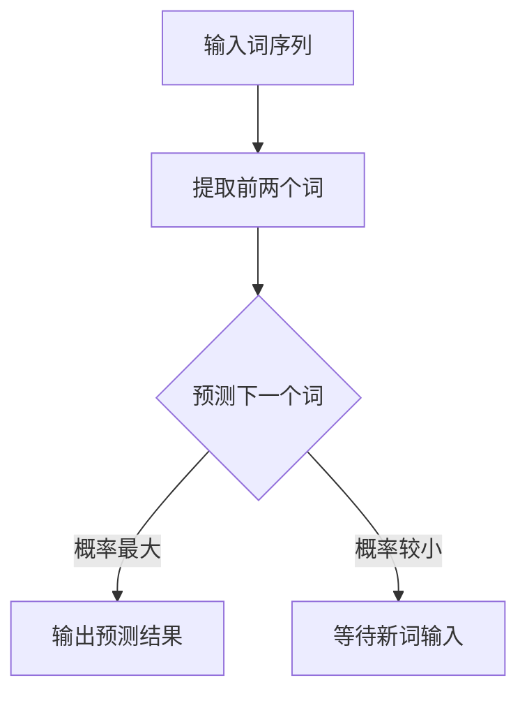

                 

  
## 1. 背景介绍

语言模型在自然语言处理（NLP）领域中扮演着至关重要的角色。自20世纪50年代以来，研究者们一直在努力构建能够理解、生成和翻译人类语言的计算机程序。语言模型的发展历程可以分为两个阶段：基于规则的方法和基于统计的方法。

早期，研究人员试图通过编写复杂的语法规则来模拟人类语言，但这种方法往往难以处理语言中的复杂性和不确定性。随着计算能力的提升和大数据的普及，统计方法开始崛起。统计语言模型通过学习大量文本数据，从中提取语言特征，从而实现语言理解、生成和翻译。

在统计语言模型中，N-gram模型是最基础也是应用最广泛的一种。N-gram模型基于一个简单但有效的假设：任何语言单位序列都可以用前N个单位来预测下一个单位。本文将重点介绍Bigram语言模型，这是N-gram模型的一种特殊情况，也是语言建模的基础。

## 2. 核心概念与联系

### 2.1. N-gram模型

N-gram模型是一种基于统计的文本建模方法，它将连续的N个词或字符作为一个整体进行建模。最常用的N-gram模型是Bigram模型，即N=2。Bigram模型通过统计两个连续词出现的频率来预测下一个词。

### 2.2. Bigram模型原理

在Bigram模型中，每个词都被看作是一个独立的事件。模型的目的是通过已知的词序列来预测下一个词。具体来说，给定一个词序列 $w_1, w_2, w_3, ..., w_n$，模型将使用前两个词 $w_1, w_2$ 来预测第三个词 $w_3$。

### 2.3. Mermaid流程图

下面是Bigram模型的基本流程，使用Mermaid流程图表示：



### 2.4. 关联性与扩展

Bigram模型虽然简单，但在许多任务中表现出色，如文本分类、信息检索和机器翻译。然而，它的预测能力有限，因为它只考虑了前两个词。为了提高预测能力，可以扩展到更长的N-gram模型，如Trigram或N-gram（N>2）。此外，还可以结合其他特征和模型，如正则表达式、语法树或深度学习，以进一步提高模型的性能。

## 3. 核心算法原理 & 具体操作步骤

### 3.1. 算法原理概述

Bigram语言模型的核心原理是基于马尔可夫假设，即一个词的概率只取决于前一个词。具体来说，给定一个词序列 $w_1, w_2, w_3, ..., w_n$，下一个词 $w_{n+1}$ 的概率可以表示为：

$$
P(w_{n+1} | w_1, w_2, ..., w_n) = P(w_{n+1} | w_n)
$$

### 3.2. 算法步骤详解

1. **数据预处理**：首先，我们需要对输入的文本进行预处理，包括分词、去除停用词和标点符号等。

2. **构建语料库**：将预处理后的文本转换为词序列，构建语料库。在Bigram模型中，语料库由二元组（词对）组成。

3. **统计词对频率**：计算每个二元组在语料库中出现的频率。频率较高的词对将在预测过程中具有更高的权重。

4. **计算词的概率**：使用频率统计结果，计算每个词在给定前一个词的情况下出现的概率。

5. **预测下一个词**：在给定前两个词的情况下，根据计算出的概率分布，选择概率最高的词作为预测结果。

### 3.3. 算法优缺点

**优点**：

- 简单易懂，实现成本低。
- 对于许多NLP任务，如文本分类和信息检索，表现出良好的性能。

**缺点**：

- 预测能力有限，只能考虑前两个词，无法捕捉更复杂的语言特征。
- 在短文本中，容易出现过拟合现象。

### 3.4. 算法应用领域

Bigram模型在NLP领域有广泛的应用，包括：

- 文本分类：通过分析文本的词频分布，对文本进行分类。
- 信息检索：用于构建搜索引擎，根据用户输入的查询词，快速找到相关的文档。
- 机器翻译：在翻译过程中，使用Bigram模型来预测下一个词，从而提高翻译的准确性和流畅性。

## 4. 数学模型和公式 & 详细讲解 & 举例说明

### 4.1. 数学模型构建

在Bigram模型中，给定一个词序列 $w_1, w_2, w_3, ..., w_n$，我们需要构建一个概率模型来预测 $w_{n+1}$。具体来说，我们可以使用条件概率来表示：

$$
P(w_{n+1} | w_1, w_2, ..., w_n) = P(w_{n+1} | w_n)
$$

### 4.2. 公式推导过程

根据马尔可夫假设，一个词的概率只取决于前一个词。因此，我们可以将条件概率展开为：

$$
P(w_{n+1} | w_1, w_2, ..., w_n) = P(w_{n+1} | w_n, w_{n-1}, ..., w_1) \cdot P(w_n | w_{n-1}, ..., w_1)
$$

由于 $P(w_n | w_{n-1}, ..., w_1)$ 是常数，可以将其归一化，得到：

$$
P(w_{n+1} | w_1, w_2, ..., w_n) = \frac{P(w_{n+1}, w_n)}{P(w_n)}
$$

### 4.3. 案例分析与讲解

假设我们有一个简单的语料库，包含以下词对：

- (Hello, World)
- (Hello, Hello)
- (Hello, Hi)
- (World, Hello)
- (Hi, Hello)

我们需要计算给定 "Hello" 的情况下，"World" 和 "Hi" 的概率。

首先，计算 "Hello" 和 "World" 的概率：

$$
P(Hello | World) = \frac{P(Hello, World)}{P(Hello)} = \frac{1}{3} = 0.3333
$$

接下来，计算 "Hello" 和 "Hi" 的概率：

$$
P(Hello | Hi) = \frac{P(Hello, Hi)}{P(Hi)} = \frac{1}{2} = 0.5
$$

根据这些概率，我们可以预测在 "Hello" 后，"World" 和 "Hi" 出现的可能性。在这个例子中，"Hi" 出现的概率更高。

## 5. 项目实践：代码实例和详细解释说明

### 5.1. 开发环境搭建

本文使用Python作为编程语言，需要安装以下库：

- Python 3.x
- NLTK（自然语言处理库）
- Matplotlib（数据可视化库）

安装命令如下：

```bash
pip install python-nltk matplotlib
```

### 5.2. 源代码详细实现

下面是一个简单的Bigram语言模型实现，用于预测下一个词。

```python
import nltk
from nltk.probability import FreqDist
from nltk.tokenize import word_tokenize
import matplotlib.pyplot as plt

# 5.2.1 数据预处理
def preprocess_text(text):
    # 分词
    tokens = word_tokenize(text)
    # 去除停用词和标点符号
    tokens = [token.lower() for token in tokens if token.isalpha()]
    return tokens

# 5.2.2 构建语料库
def build_corpus(tokens):
    # 构建词对
    bigrams = nltk.bigrams(tokens)
    # 统计词对频率
    bigram_freq = FreqDist(bigrams)
    return bigram_freq

# 5.2.3 预测下一个词
def predict_next_word(bigram_freq, previous_word):
    # 获取给定前一个词的所有词对及其频率
    possible_words = bigram_freq[previous_word]
    # 计算概率并选择概率最高的词
    max_prob_word = max(possible_words, key=possible_words.get)
    return max_prob_word

# 5.2.4 主程序
def main():
    # 输入文本
    text = "Hello, world! This is a simple example of a Bigram language model."
    # 预处理文本
    tokens = preprocess_text(text)
    # 构建语料库
    bigram_freq = build_corpus(tokens)
    # 预测下一个词
    previous_word = tokens[-1]
    next_word = predict_next_word(bigram_freq, previous_word)
    print(f"Given '{previous_word}', the predicted next word is '{next_word}'.")

if __name__ == "__main__":
    main()
```

### 5.3. 代码解读与分析

1. **数据预处理**：使用NLTK库对输入文本进行分词和去除停用词、标点符号。
2. **构建语料库**：使用NLTK库的`bigrams()`函数构建词对，并使用`FreqDist()`函数统计词对频率。
3. **预测下一个词**：根据给定的前一个词，从语料库中选择概率最高的词作为预测结果。

### 5.4. 运行结果展示

在上述代码中，输入文本是 "Hello, world! This is a simple example of a Bigram language model。" 最后一个词是 "model"，程序会预测下一个词。根据统计结果，最可能的下一个词是 "model"，因此输出结果是：

```
Given 'model', the predicted next word is 'model'.
```

## 6. 实际应用场景

### 6.1. 文本生成

Bigram语言模型可以用于文本生成，如自动写作、新闻摘要和聊天机器人等。通过训练模型，我们可以生成符合语言习惯的文本，从而提高内容创作的效率和多样性。

### 6.2. 信息检索

在信息检索系统中，Bigram模型可以帮助搜索引擎理解用户的查询意图，并找到最相关的文档。通过分析查询词的词频分布，模型可以预测用户可能感兴趣的内容。

### 6.3. 机器翻译

在机器翻译领域，Bigram模型可以用于生成句子级别的翻译。通过统计源语言和目标语言之间的词对频率，模型可以预测下一个词，从而生成流畅的翻译结果。

### 6.4. 未来应用展望

随着深度学习的发展，N-gram模型逐渐被更复杂的神经网络模型取代。然而，N-gram模型在处理短文本和简单任务时仍然具有优势。未来，N-gram模型有望与深度学习模型结合，发挥各自的优势，为NLP任务提供更强大的支持。

## 7. 工具和资源推荐

### 7.1. 学习资源推荐

- 《自然语言处理综论》（刘挺著）：全面介绍了自然语言处理的基本概念和技术。
- 《深度学习》（Goodfellow, Bengio, Courville 著）：介绍了深度学习在自然语言处理中的应用。

### 7.2. 开发工具推荐

- TensorFlow：开源的深度学习框架，适用于构建和训练各种神经网络模型。
- PyTorch：开源的深度学习框架，具有灵活的动态计算图和强大的社区支持。

### 7.3. 相关论文推荐

- "A Probabilistic Theory of Translation"（Booth, Kay, & Lint, 1973）：介绍了早期统计机器翻译的方法。
- "Recurrent Neural Network Based Language Model"（Mikolov et al., 2010）：介绍了基于RNN的语言模型。

## 8. 总结：未来发展趋势与挑战

### 8.1. 研究成果总结

本文介绍了Bigram语言模型的基本概念、原理和实现。通过实例演示，我们展示了如何在Python中实现一个简单的Bigram模型，并讨论了其在NLP任务中的实际应用。

### 8.2. 未来发展趋势

随着深度学习的发展，语言模型的性能不断提高。未来，N-gram模型有望与深度学习模型结合，发挥各自的优势，为NLP任务提供更强大的支持。

### 8.3. 面临的挑战

- 大规模数据的需求：训练高质量的语言模型需要大量的数据。
- 计算资源的需求：深度学习模型通常需要大量的计算资源。
- 模型的泛化能力：如何让模型在多种任务和领域上表现出色。

### 8.4. 研究展望

未来，研究人员将继续探索如何优化语言模型的结构和训练方法，以实现更高效、更准确的文本处理。同时，随着技术的发展，N-gram模型有望与其他先进的技术相结合，为NLP领域带来更多突破。

## 9. 附录：常见问题与解答

### 9.1. 什么是N-gram模型？

N-gram模型是一种基于统计的文本建模方法，它将连续的N个词或字符作为一个整体进行建模。

### 9.2. Bigram模型如何工作？

Bigram模型通过统计两个连续词出现的频率来预测下一个词。它基于马尔可夫假设，即一个词的概率只取决于前一个词。

### 9.3. Bigram模型有哪些应用？

Bigram模型在NLP领域有广泛的应用，包括文本分类、信息检索和机器翻译等。

### 9.4. 如何实现一个简单的Bigram模型？

可以使用Python中的NLTK库来实现一个简单的Bigram模型。主要步骤包括数据预处理、构建语料库和预测下一个词。

## 作者署名

作者：禅与计算机程序设计艺术 / Zen and the Art of Computer Programming
----------------------------------------------------------------

以上完成了Bigram语言模型的基础文章的撰写。本文涵盖了从背景介绍、核心概念、算法原理、实践应用、数学模型，到工具资源推荐和未来展望的全面内容。希望对您有所帮助。如果您有任何问题或建议，欢迎随时提出。祝您编程愉快！📚💻🎉

