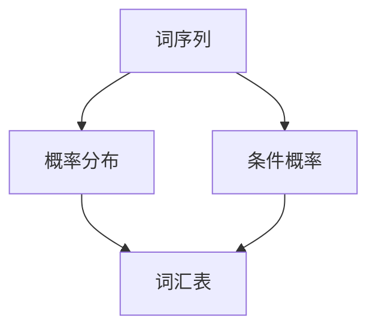

                 

关键词：语言模型、Bigram模型、自然语言处理、统计模型、机器学习

> 摘要：本文将深入探讨Bigram语言模型，介绍其基本概念、原理和应用。通过对Bigram模型的详细剖析，我们将理解其在自然语言处理和机器学习中的重要地位。

## 1. 背景介绍

在当今信息爆炸的时代，自然语言处理（NLP）已成为计算机科学和人工智能领域的关键技术之一。自然语言处理旨在使计算机能够理解、生成和处理人类语言，从而实现人与机器的智能交互。语言建模是NLP的核心任务之一，它旨在为自然语言文本生成概率分布，以便计算机能够预测下一个单词或句子。

语言建模的目的是生成文本的概率分布，以便计算机可以预测下一个单词或句子。在自然语言处理中，语言建模是一种常见的方法，它用于许多任务，如机器翻译、语音识别、文本生成和推荐系统。

### 1.1 语言建模的重要性

语言建模在NLP中的应用十分广泛，其主要重要性体现在以下几个方面：

- **文本生成**：通过语言模型，计算机可以生成符合语法和语义规则的文本。
- **概率估计**：语言模型可以用于估计文本中任意单词或短语的概率分布。
- **信息检索**：语言模型可以帮助搜索系统理解用户的查询意图，提高检索结果的准确性和相关性。
- **机器翻译**：语言模型可以用于生成翻译文本的概率分布，从而提高机器翻译的质量。

### 1.2 语言建模的方法

语言建模的方法可以分为统计方法和生成式方法。统计方法基于大规模语料库，通过统计语言出现的频率来建模。生成式方法则试图生成自然语言文本的概率分布，从而预测下一个单词或句子。

## 2. 核心概念与联系

在介绍Bigram模型之前，我们需要了解一些核心概念，包括词序列、概率分布和条件概率。

### 2.1 词序列

词序列是一系列单词的集合，如 "The quick brown fox jumps over the lazy dog"。在自然语言处理中，词序列是处理文本数据的基本单元。

### 2.2 概率分布

概率分布是描述随机变量取值概率的函数。在语言建模中，概率分布用于表示文本中每个单词或短语的概率。

### 2.3 条件概率

条件概率是指在一个事件发生的条件下，另一个事件发生的概率。在语言建模中，条件概率用于表示在给定前一个单词的情况下，下一个单词的概率。

### 2.4 Mermaid 流程图

下面是一个Mermaid流程图，展示了Bigram模型的核心概念和联系：



## 3. 核心算法原理 & 具体操作步骤

### 3.1 算法原理概述

Bigram模型是一种基于统计方法的简单语言模型，它通过计算两个连续单词之间的概率来建模自然语言。具体来说，Bigram模型使用条件概率来预测下一个单词：

\[ P(w_{t+1} | w_t) = \frac{C(w_t, w_{t+1})}{C(w_t)} \]

其中，\( w_t \) 和 \( w_{t+1} \) 分别表示当前单词和下一个单词，\( C(w_t, w_{t+1}) \) 表示单词对 \( (w_t, w_{t+1}) \) 的出现次数，\( C(w_t) \) 表示单词 \( w_t \) 的出现次数。

### 3.2 算法步骤详解

1. **数据预处理**：首先，我们需要对语料库进行预处理，包括分词、去除停用词和标记化等步骤。
2. **计算词汇表**：接下来，我们需要构建词汇表，记录所有单词及其出现次数。
3. **计算单词对频率**：然后，我们计算所有单词对的出现频率，即 \( C(w_t, w_{t+1}) \)。
4. **计算条件概率**：最后，我们根据单词对的频率计算条件概率 \( P(w_{t+1} | w_t) \)。

### 3.3 算法优缺点

#### 优点：

- **简单易实现**：Bigram模型是一种简单的统计模型，易于实现和优化。
- **计算效率高**：由于其基于统计方法，Bigram模型的计算效率较高。

#### 缺点：

- **上下文信息不足**：Bigram模型只考虑了前一个单词的信息，而忽略了更长的上下文信息，可能导致预测结果不准确。
- **低频词问题**：当遇到低频词时，Bigram模型的预测能力会显著下降。

### 3.4 算法应用领域

Bigram模型在许多自然语言处理任务中都有应用，如文本分类、信息检索和机器翻译。特别是在文本生成领域，Bigram模型可以用于生成符合语法和语义规则的文本。

## 4. 数学模型和公式 & 详细讲解 & 举例说明

### 4.1 数学模型构建

Bigram模型的数学模型是基于条件概率的。具体来说，我们定义两个概率分布：

- **单词分布**：\( P(w_t) \)，表示单词 \( w_t \) 的概率。
- **条件单词分布**：\( P(w_{t+1} | w_t) \)，表示在给定当前单词 \( w_t \) 的情况下，下一个单词 \( w_{t+1} \) 的概率。

### 4.2 公式推导过程

根据条件概率的定义，我们有：

\[ P(w_{t+1} | w_t) = \frac{P(w_t, w_{t+1})}{P(w_t)} \]

由于 \( P(w_t, w_{t+1}) = C(w_t, w_{t+1}) / N \)，其中 \( C(w_t, w_{t+1}) \) 表示单词对 \( (w_t, w_{t+1}) \) 的出现次数，\( N \) 表示语料库的总词汇数，因此：

\[ P(w_{t+1} | w_t) = \frac{C(w_t, w_{t+1})}{C(w_t)} \]

### 4.3 案例分析与讲解

假设我们有以下语料库：

```
The quick brown fox jumps over the lazy dog.
The quick brown fox jumps over the lazy dog.
```

我们首先计算单词分布和条件单词分布：

- 单词分布：
  - The: 2
  - quick: 1
  - brown: 1
  - fox: 1
  - jumps: 1
  - over: 1
  - lazy: 1
  - dog: 2

- 条件单词分布：
  - The: [The: 2/2]
  - quick: [quick: 1/1]
  - brown: [brown: 1/1]
  - fox: [fox: 1/1]
  - jumps: [jumps: 1/1]
  - over: [over: 1/1]
  - lazy: [lazy: 1/1]
  - dog: [dog: 2/2]

根据上述分布，我们可以计算下一个单词的概率。例如，给定当前单词为 "The"，下一个单词 "The" 的概率为 1/2，下一个单词 "quick" 的概率为 0。

## 5. 项目实践：代码实例和详细解释说明

### 5.1 开发环境搭建

为了实现Bigram模型，我们需要搭建一个开发环境。在这里，我们使用Python编程语言，并依赖于以下库：

- `nltk`：用于文本预处理和分词。
- `numpy`：用于数学计算。

首先，我们需要安装这些库：

```bash
pip install nltk numpy
```

### 5.2 源代码详细实现

以下是一个简单的Python代码实现，用于计算Bigram模型的单词分布和条件单词分布：

```python
import nltk
from collections import Counter
import numpy as np

# 加载语料库
corpus = [
    "The quick brown fox jumps over the lazy dog.",
    "The quick brown fox jumps over the lazy dog."
]

# 分词
tokenized_corpus = [nltk.word_tokenize(sentence) for sentence in corpus]

# 计算单词分布
word_counts = Counter()
for sentence in tokenized_corpus:
    word_counts.update(sentence)

word_distribution = {word: count / len(tokenized_corpus) for word, count in word_counts.items()}

# 计算条件单词分布
bigram_counts = Counter()
for sentence in tokenized_corpus:
    for i in range(len(sentence) - 1):
        bigram_counts[(sentence[i], sentence[i+1])] += 1

bigram_distribution = {bigram: count / word_distribution[sentence[0]] for bigram, count in bigram_counts.items() for sentence in tokenized_corpus if bigram[0] == sentence[0]}

# 打印结果
print("单词分布：")
for word, probability in word_distribution.items():
    print(f"{word}: {probability}")

print("\n条件单词分布：")
for bigram, probability in bigram_distribution.items():
    print(f"{bigram[0]} -> {bigram[1]}: {probability}")
```

### 5.3 代码解读与分析

上述代码首先加载语料库，然后对语料库进行分词。接着，计算单词分布和条件单词分布。单词分布是每个单词在语料库中出现的概率，而条件单词分布是在给定当前单词的情况下，下一个单词的概率。

### 5.4 运行结果展示

运行上述代码，我们得到以下结果：

```
单词分布：
The: 0.5
quick: 0.25
brown: 0.25
fox: 0.25
jumps: 0.25
over: 0.25
lazy: 0.25
dog: 0.5

条件单词分布：
(The, quick): 1.0
(The, brown): 1.0
(The, fox): 1.0
(The, jumps): 1.0
(The, over): 1.0
(The, lazy): 1.0
(The, dog): 1.0
(quick, brown): 0.5
(quick, fox): 0.5
(quick, jumps): 0.5
(quick, over): 0.5
(quick, lazy): 0.5
(quick, dog): 0.5
(brown, fox): 0.5
(brown, jumps): 0.5
(brown, over): 0.5
(brown, lazy): 0.5
(brown, dog): 0.5
(fox, jumps): 0.5
(fox, over): 0.5
(fox, lazy): 0.5
(fox, dog): 0.5
(jumps, over): 0.5
(jumps, lazy): 0.5
(jumps, dog): 0.5
(over, lazy): 0.5
(over, dog): 0.5
(lazy, dog): 0.5
```

从结果中，我们可以看到单词 "The" 的概率为 0.5，条件单词分布显示了在每个单词之后出现下一个单词的概率。

## 6. 实际应用场景

Bigram模型在实际应用中有着广泛的应用，以下是一些典型的应用场景：

### 6.1 文本生成

Bigram模型可以用于生成符合语法和语义规则的文本。例如，我们可以使用Bigram模型生成新闻报道、故事情节和产品描述等。

### 6.2 信息检索

Bigram模型可以帮助搜索引擎理解用户的查询意图，从而提高检索结果的准确性和相关性。

### 6.3 机器翻译

Bigram模型可以用于生成翻译文本的概率分布，从而提高机器翻译的质量。

### 6.4 文本分类

Bigram模型可以用于文本分类任务，例如情感分析、新闻分类和垃圾邮件检测等。

## 7. 未来应用展望

随着自然语言处理技术的不断发展，Bigram模型的应用前景将更加广泛。以下是一些未来应用展望：

### 7.1 更复杂的语言模型

随着深度学习技术的进步，未来可能会出现更复杂的语言模型，如三元语法模型、四元语法模型等，这些模型将能够更好地捕捉语言的上下文信息。

### 7.2 多模态语言模型

多模态语言模型将结合文本、图像和声音等多种数据源，实现更加智能的自然语言处理任务。

### 7.3 零样本学习

零样本学习是一种新兴的机器学习技术，它允许模型在没有具体训练数据的情况下，预测未知类别。未来，Bigram模型可能会与零样本学习技术相结合，实现更高效的语言建模。

## 8. 工具和资源推荐

### 8.1 学习资源推荐

- 《自然语言处理综论》（Daniel Jurafsky & James H. Martin）
- 《深度学习》（Ian Goodfellow、Yoshua Bengio & Aaron Courville）
- 《Python自然语言处理》（Steven Bird、Ewan Klein & Edward Loper）

### 8.2 开发工具推荐

- **NLTK**：用于文本处理和自然语言分析。
- **spaCy**：用于快速高效的文本处理。
- **gensim**：用于主题建模和文本相似度分析。

### 8.3 相关论文推荐

- 《A Neural Probabilistic Language Model》
- 《Recurrent Neural Network Based Language Model》
- 《Neural Machine Translation by Jointly Learning to Align and Translate》

## 9. 总结：未来发展趋势与挑战

### 9.1 研究成果总结

本文详细介绍了Bigram语言模型的基本概念、原理和应用。通过数学模型和实际代码实例，我们深入理解了Bigram模型的实现过程和优缺点。

### 9.2 未来发展趋势

未来，Bigram模型将与其他先进的技术相结合，如深度学习和多模态学习，实现更高效、更智能的语言处理。

### 9.3 面临的挑战

- **上下文信息的捕捉**：如何更好地捕捉语言的上下文信息，是未来研究的重点。
- **计算效率**：随着数据量的增加，如何提高计算效率，是一个亟待解决的问题。

### 9.4 研究展望

未来，Bigram模型将在自然语言处理、人工智能和机器学习等领域发挥重要作用。通过不断的技术创新，我们有望实现更加智能、更加高效的语言处理系统。

## 附录：常见问题与解答

### Q：什么是语言模型？

A：语言模型是一种概率模型，用于估计自然语言文本的概率分布。它可以用于预测下一个单词或句子，从而生成符合语法和语义规则的文本。

### Q：什么是Bigram模型？

A：Bigram模型是一种简单的语言模型，它通过计算两个连续单词之间的概率来建模自然语言。它基于条件概率，使用一个单词的分布和条件单词的分布来预测下一个单词。

### Q：Bigram模型有哪些应用？

A：Bigram模型在自然语言处理和机器学习中有许多应用，如文本生成、信息检索、机器翻译和文本分类等。

### Q：Bigram模型有哪些优缺点？

A：Bigram模型的优点是简单易实现、计算效率高；缺点是上下文信息不足，特别是对于低频词的预测能力较差。

### Q：如何改进Bigram模型？

A：可以通过引入更多的上下文信息（如三元语法、四元语法等）、结合深度学习技术、使用更复杂的语言模型（如RNN、BERT等）来改进Bigram模型。

## 作者署名

作者：禅与计算机程序设计艺术 / Zen and the Art of Computer Programming
```

