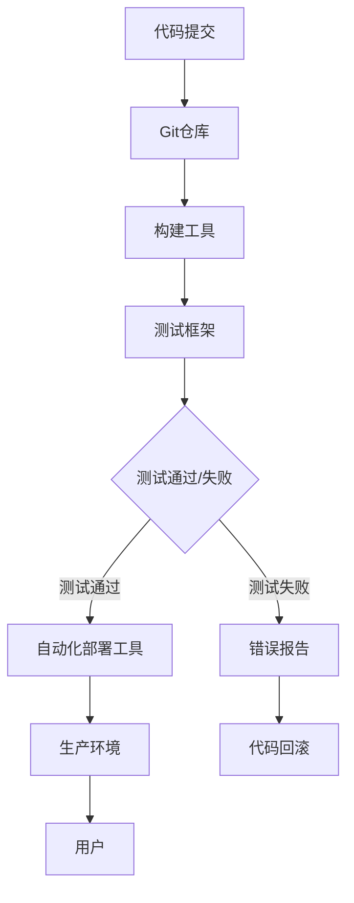

                 

关键词：持续集成、持续部署、自动化、软件交付、DevOps、敏捷开发、CI工具、CD工具

## 摘要

本文将深入探讨CI/CD管道，即持续集成（Continuous Integration）和持续部署（Continuous Deployment）的概念、原理、实施步骤及其在当今软件开发中的应用。我们将从背景介绍开始，逐步阐述核心概念与联系，详细解析核心算法原理和操作步骤，展示数学模型和公式，提供项目实践实例，分析实际应用场景，并展望未来发展趋势与挑战。

## 1. 背景介绍

随着软件开发的复杂性和项目规模的不断扩大，传统的软件开发流程已难以满足快速迭代的现代软件开发需求。为此，持续集成（CI）和持续部署（CD）的概念应运而生。CI/CD管道是一种自动化软件交付流程，旨在通过持续集成和持续部署来提高软件开发的效率和质量。

### 1.1 持续集成（CI）

持续集成是一种软件开发实践，旨在通过频繁地将代码集成到一个共享的主分支中，以减少集成时的错误和提高代码质量。在CI流程中，每次代码提交都会触发自动化测试，确保新代码与现有代码兼容，并及时发现和修复问题。

### 1.2 持续部署（CD）

持续部署是一种自动化软件交付流程，旨在通过持续地发布和部署新代码，实现快速、可靠地交付软件。在CD流程中，自动化工具负责构建、测试和部署代码，从而大大减少了人工干预和错误的可能性。

## 2. 核心概念与联系

为了更好地理解CI/CD管道，我们需要先了解一些核心概念，并使用Mermaid流程图展示其原理和架构。

### 2.1 核心概念

- **版本控制系统**：如Git，用于管理代码的版本和控制代码的变更。
- **构建工具**：如Maven、Gradle，用于自动化构建和打包代码。
- **测试框架**：如JUnit、Selenium，用于编写和执行自动化测试。
- **自动化部署工具**：如Jenkins、Travis CI，用于自动化部署和发布代码。

### 2.2 Mermaid流程图



在上面的流程图中，代码提交到Git仓库后，通过构建工具进行构建，然后使用测试框架执行自动化测试。如果测试通过，代码将被自动化部署到生产环境；如果测试失败，则生成错误报告，并可能需要回滚到上一个稳定版本。

## 3. 核心算法原理 & 具体操作步骤

### 3.1 算法原理概述

CI/CD管道的核心算法原理是基于自动化和持续反馈。通过自动化工具，我们可以实现以下步骤：

1. **代码提交**：开发人员将代码提交到版本控制系统。
2. **构建**：构建工具自动化构建代码，生成可执行文件或应用包。
3. **测试**：测试框架自动化执行测试用例，验证代码的稳定性和功能。
4. **部署**：自动化部署工具将代码部署到测试或生产环境。

### 3.2 算法步骤详解

1. **代码提交**：
   - 开发人员使用Git等版本控制系统提交代码。
   - 提交信息应包含必要的上下文，如提交的目的和影响范围。

2. **构建**：
   - 构建工具如Maven或Gradle读取项目配置文件，自动化构建代码。
   - 构建过程包括编译代码、运行单元测试和生成文档等。

3. **测试**：
   - 测试框架如JUnit或Selenium编写并执行自动化测试用例。
   - 测试用例覆盖功能、性能和安全性等方面。

4. **部署**：
   - 自动化部署工具如Jenkins或Travis CI根据测试结果执行部署。
   - 部署过程可能涉及环境配置、数据库迁移和应用更新。

### 3.3 算法优缺点

**优点**：

- **提高效率**：自动化工具可以大幅减少手动操作，提高开发效率。
- **降低风险**：频繁的测试和部署可以及时发现问题，降低软件发布风险。
- **提升质量**：持续集成和部署有助于保持代码质量，减少缺陷。

**缺点**：

- **初期投入**：构建和部署自动化需要一定的时间和资源投入。
- **学习曲线**：对于新团队或新手，学习和使用CI/CD工具可能有一定难度。

### 3.4 算法应用领域

CI/CD管道适用于以下领域：

- **Web应用开发**：通过持续集成和部署，快速构建和发布Web应用。
- **移动应用开发**：自动化测试和部署有助于提高移动应用的稳定性和兼容性。
- **云计算和大数据**：CI/CD管道适用于云计算和大数据项目的持续交付。

## 4. 数学模型和公式

在CI/CD管道中，我们可以使用一些数学模型和公式来衡量其效果和性能。以下是一个简单的示例。

### 4.1 数学模型构建

假设我们有一个软件开发项目，其开发周期为T，代码提交次数为N，每次提交的平均测试时间为T\_test，每次部署的平均时间为T\_deploy。我们可以使用以下公式来计算项目的平均构建时间：

$$
T_{build} = T \times N + T_{test} \times N + T_{deploy} \times N
$$

### 4.2 公式推导过程

- \( T \times N \)：开发周期乘以提交次数，表示代码的总开发时间。
- \( T_{test} \times N \)：每次提交的平均测试时间乘以提交次数，表示总测试时间。
- \( T_{deploy} \times N \)：每次部署的平均时间乘以提交次数，表示总部署时间。

### 4.3 案例分析与讲解

假设我们有一个开发周期为2周的项目，每周提交10次代码，每次提交的测试时间为1天，每次部署时间为半天。根据上述公式，我们可以计算出项目的平均构建时间为：

$$
T_{build} = 2 \times 10 + 1 \times 10 + 0.5 \times 10 = 25 \text{天}
$$

这意味着，该项目每个月的构建时间大约为25天。通过优化测试和部署过程，我们可以进一步减少构建时间，提高开发效率。

## 5. 项目实践：代码实例和详细解释说明

### 5.1 开发环境搭建

为了实践CI/CD管道，我们首先需要搭建一个开发环境。以下是一个简单的步骤：

1. 安装Git：从[Git官网](https://git-scm.com/)下载并安装Git。
2. 安装Java：从[Java官网](https://www.java.com/)下载并安装Java。
3. 安装Maven：从[Maven官网](https://maven.apache.org/)下载并安装Maven。
4. 安装JUnit：从[JUnit官网](https://junit.org/junit5/)下载并安装JUnit。

### 5.2 源代码详细实现

接下来，我们将创建一个简单的Java项目，并实现一个简单的计算器功能。

1. **项目结构**：

   ```
   calculator/
   ├── pom.xml
   ├── src/
   │   ├── main/
   │   │   ├── java/
   │   │   │   └── Calculator.java
   │   └── test/
   │       ├── java/
   │       │   └── CalculatorTest.java
   └── README.md
   ```

2. **源代码实现**：

   **Calculator.java**：

   ```java
   public class Calculator {
       public int add(int a, int b) {
           return a + b;
       }
   }
   ```

   **CalculatorTest.java**：

   ```java
   import org.junit.jupiter.api.Test;
   import static org.junit.jupiter.api.Assertions.assertEquals;

   public class CalculatorTest {
       @Test
       public void testAdd() {
           Calculator calculator = new Calculator();
           int result = calculator.add(1, 2);
           assertEquals(3, result);
       }
   }
   ```

### 5.3 代码解读与分析

在这个简单的例子中，我们创建了一个`Calculator`类，实现了`add`方法用于计算两个整数的和。我们还编写了一个测试类`CalculatorTest`，使用JUnit框架来测试`add`方法。

### 5.4 运行结果展示

1. 使用Maven构建项目：

   ```shell
   mvn clean install
   ```

   如果构建成功，Maven将生成一个可执行的JAR文件。

2. 运行测试：

   ```shell
   mvn test
   ```

   如果所有测试用例都通过，我们将看到类似以下的结果：

   ```
   [INFO] Results:
   [INFO] 
   [INFO] Tests run: 1, Failures: 0, Errors: 0, Skipped: 0
   [INFO] 
   [INFO] ------------------------------------------------------------------------
   [INFO] BUILD SUCCESS
   [INFO] ------------------------------------------------------------------------
   ```

## 6. 实际应用场景

### 6.1 Web应用开发

持续集成和部署在Web应用开发中发挥着重要作用。通过CI/CD管道，我们可以快速构建、测试和部署Web应用，提高开发效率。例如，使用Jenkins作为CI工具，自动化构建和测试Web应用，并在通过测试后自动部署到生产环境。

### 6.2 移动应用开发

在移动应用开发中，CI/CD管道可以帮助我们自动化测试和部署移动应用。通过使用工具如AppCenter或Fastlane，我们可以快速构建、测试和发布Android和iOS应用。例如，我们可以将Android应用的构建和测试过程集成到Jenkins中，确保每次提交都会触发自动化测试，并通过成功测试后自动发布到Google Play商店。

### 6.3 云计算和大数据

在云计算和大数据项目中，CI/CD管道可以帮助我们自动化部署和管理容器化应用。通过使用工具如Kubernetes和Docker，我们可以实现自动化构建、测试和部署容器化应用。例如，我们可以在Kubernetes集群中自动化部署大数据应用，确保每次代码变更都会触发测试和部署，从而确保应用的稳定性和可靠性。

## 7. 工具和资源推荐

### 7.1 学习资源推荐

- 《持续交付：加速产品从概念到生产》
- 《Jenkins实战》
- 《Git权威指南》

### 7.2 开发工具推荐

- **版本控制系统**：Git、SVN
- **构建工具**：Maven、Gradle
- **测试框架**：JUnit、Selenium
- **自动化部署工具**：Jenkins、Travis CI

### 7.3 相关论文推荐

- 《持续集成：软件开发的最佳实践》
- 《DevOps实践指南》
- 《持续交付：从代码到产品》

## 8. 总结：未来发展趋势与挑战

### 8.1 研究成果总结

持续集成和持续部署在软件开发中取得了显著成果。通过自动化工具和流程，我们可以大幅提高开发效率、降低风险、提升代码质量。研究表明，CI/CD管道已经成为现代软件开发不可或缺的一部分。

### 8.2 未来发展趋势

未来，CI/CD管道将继续朝着更加自动化、智能化和高效化的方向发展。例如，机器学习和人工智能将应用于自动化测试和部署，进一步提升软件交付的效率和可靠性。

### 8.3 面临的挑战

尽管CI/CD管道带来了许多好处，但也面临着一些挑战。例如，如何确保自动化工具的稳定性和可靠性，如何处理复杂的部署场景等。未来，我们需要不断创新和优化，以应对这些挑战。

### 8.4 研究展望

随着软件开发的不断演进，CI/CD管道将在未来发挥更加重要的作用。我们期待看到更多创新技术和应用，推动软件交付的持续进步。

## 9. 附录：常见问题与解答

### 9.1 什么是持续集成（CI）？

持续集成是一种软件开发实践，通过频繁地将代码集成到一个共享的主分支中，以减少集成时的错误和提高代码质量。

### 9.2 什么是持续部署（CD）？

持续部署是一种自动化软件交付流程，通过持续地发布和部署新代码，实现快速、可靠地交付软件。

### 9.3 CI/CD管道需要哪些工具？

CI/CD管道需要一系列工具，包括版本控制系统（如Git）、构建工具（如Maven、Gradle）、测试框架（如JUnit、Selenium）和自动化部署工具（如Jenkins、Travis CI）。

### 9.4 如何实现CI/CD管道？

实现CI/CD管道需要以下步骤：

1. **规划**：确定项目需求和技术栈。
2. **搭建环境**：安装和配置版本控制系统、构建工具、测试框架和自动化部署工具。
3. **编写脚本**：编写自动化构建、测试和部署脚本。
4. **集成**：将所有工具和脚本集成到一个CI/CD流程中。
5. **测试**：验证CI/CD流程的正确性和可靠性。
6. **优化**：根据测试结果和反馈不断优化流程。

## 作者署名

作者：禅与计算机程序设计艺术 / Zen and the Art of Computer Programming
```

