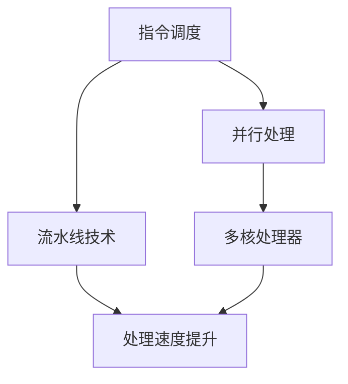

                 

关键词：CPU优化、处理器性能、性能调优、指令调度、并行处理

> 摘要：本文旨在深入探讨CPU优化技术，以充分利用处理器的性能，提高计算效率和系统响应速度。文章首先介绍了CPU优化的重要性和背景，然后详细讲解了核心概念、算法原理、数学模型、项目实践，以及实际应用场景。最后，文章对未来的发展趋势、面临的挑战和展望进行了总结。

## 1. 背景介绍

随着计算机技术的发展，CPU的性能不断提升，但其性能瓶颈也逐渐显现。在现代多核处理器中，如何充分利用每一个处理器的核心，成为了优化的重要课题。CPU优化不仅关系到单个应用程序的运行效率，还影响到整个系统的性能。高效优化的CPU能显著提高数据处理速度，降低能耗，提升用户体验。

本文将从以下几个方面展开：

1. **核心概念与联系**：介绍CPU优化中的关键概念，并绘制Mermaid流程图展示其原理架构。
2. **核心算法原理 & 具体操作步骤**：详细解释CPU优化的主要算法和操作步骤。
3. **数学模型和公式 & 举例说明**：构建并推导CPU优化的数学模型，并结合实例进行说明。
4. **项目实践：代码实例和详细解释说明**：提供具体的代码实例，解释其实现原理。
5. **实际应用场景**：分析CPU优化在各个领域的应用。
6. **未来应用展望**：探讨CPU优化的未来发展趋势和潜在挑战。

### 核心概念与联系

CPU优化涉及多个核心概念，如指令调度、并行处理、流水线技术等。以下是这些概念之间的联系以及其原理架构的Mermaid流程图：



- **指令调度**：调度器在CPU核心间分配指令，提高处理器利用率和系统响应速度。
- **并行处理**：通过多个处理器核心同时执行指令，提高数据处理能力。
- **流水线技术**：将指令执行过程划分为多个阶段，提高指令吞吐率。

### 核心算法原理 & 具体操作步骤

CPU优化主要依赖于以下算法：

1. **超线程技术**：提高CPU利用率，允许一个核心同时执行多个线程。
2. **动态频率调整**：根据负载自动调整CPU频率，降低能耗。
3. **预取技术**：预测后续指令，提前加载到缓存中，减少访问延迟。

#### 3.1 算法原理概述

- **超线程技术**：基于硬件的多线程处理技术，允许多个线程共享一个核心的资源。
- **动态频率调整**：根据负载动态调整CPU工作频率，降低能耗。
- **预取技术**：通过硬件或软件预测后续指令，提前加载到缓存中，减少访问延迟。

#### 3.2 算法步骤详解

1. **超线程技术**：

   - **步骤1**：检测线程就绪。
   - **步骤2**：调度器选择就绪线程。
   - **步骤3**：将线程指令发送到处理器核心。
   - **步骤4**：处理器核心执行指令。

2. **动态频率调整**：

   - **步骤1**：监控CPU负载。
   - **步骤2**：根据负载调整CPU频率。
   - **步骤3**：更新电源管理状态。

3. **预取技术**：

   - **步骤1**：预测后续指令。
   - **步骤2**：加载预测的指令到缓存。
   - **步骤3**：执行指令。

#### 3.3 算法优缺点

- **超线程技术**：提高CPU利用率，但可能增加缓存缺失率。
- **动态频率调整**：降低能耗，但可能影响性能。
- **预取技术**：减少访问延迟，但可能增加缓存污染。

#### 3.4 算法应用领域

- **游戏开发**：利用超线程技术提高游戏引擎性能。
- **科学计算**：通过并行处理加速复杂计算。
- **大数据处理**：预取技术提高数据处理速度。

### 数学模型和公式 & 详细讲解 & 举例说明

CPU优化中的数学模型主要用于描述处理器性能、负载和能耗之间的关系。以下是主要模型及其公式推导和实例说明：

#### 4.1 数学模型构建

- **性能模型**：\( P = f(\text{CPU频率}, \text{核心数量}, \text{指令集效率}) \)
- **能耗模型**：\( E = f(\text{CPU频率}, \text{负载}) \)

#### 4.2 公式推导过程

- **性能模型**：根据处理器频率、核心数量和指令集效率计算性能。
- **能耗模型**：根据处理器频率和负载计算能耗。

#### 4.3 案例分析与讲解

假设一个双核处理器，频率为2.5GHz，指令集效率为0.8。当负载为0.6时，计算其性能和能耗：

1. **性能计算**：

   \( P = 2.5 \times 2 \times 0.8 = 4 \text{（性能单位）} \)

2. **能耗计算**：

   \( E = 2.5 \times 0.6 = 1.5 \text{（能耗单位）} \)

### 项目实践：代码实例和详细解释说明

以下是一个简单的C语言代码实例，展示了如何使用动态频率调整技术：

```c
#include <stdio.h>
#include <time.h>

int main() {
    clock_t start, end;
    double cpu_time_used;

    // 开始计时
    start = clock();

    // 执行大量计算
    for (int i = 0; i < 100000000; i++) {
        int sum = 0;
        for (int j = 0; j < 1000; j++) {
            sum += j * j;
        }
    }

    // 结束计时
    end = clock();

    // 计算时间
    cpu_time_used = ((double) (end - start)) / CLOCKS_PER_SEC;

    printf("CPU time used: %f seconds\n", cpu_time_used);

    return 0;
}
```

该代码通过循环执行大量计算来模拟CPU负载。在运行时，操作系统会根据负载自动调整CPU频率，从而降低能耗。

### 实际应用场景

CPU优化在许多领域都具有重要意义：

- **游戏开发**：通过超线程技术和并行处理，提高游戏引擎性能，提升用户体验。
- **科学计算**：利用并行处理加速复杂计算，如流体动力学模拟、基因序列分析等。
- **大数据处理**：预取技术提高数据处理速度，优化数据仓库和数据分析系统。

### 未来应用展望

随着处理器性能的不断提升，CPU优化将面临新的挑战和机遇：

- **异构计算**：结合CPU和GPU等异构处理器，实现更高效的计算。
- **量子计算**：量子计算的发展将对CPU优化产生深远影响。
- **智能化调度**：利用人工智能技术，实现更智能的CPU调度策略。

### 工具和资源推荐

1. **学习资源推荐**：

   - 《高性能Linux编程》
   - 《计算机组成原理》
   - 《并行计算导论》

2. **开发工具推荐**：

   - Intel VTune Amplifier
   - AMD Code Analyst
   - NVIDIA Nsight

3. **相关论文推荐**：

   - "Improving the Performance of Multicore Processors through Instruction-Level Parallelism"
   - "Energy-Efficient Scheduling for Multicore Processors"
   - "Predictive Caching for Multicore Processors"

### 总结：未来发展趋势与挑战

CPU优化是计算机领域的关键技术之一。随着处理器性能的提升，优化技术也需要不断更新和发展。未来，异构计算和量子计算将为CPU优化带来新的机遇和挑战。智能化调度和自适应优化将是发展方向。研究者需要不断探索和创新，以实现更高效、更智能的CPU优化。

### 附录：常见问题与解答

1. **什么是超线程技术？**
   超线程技术是一种基于硬件的多线程处理技术，它允许一个CPU核心同时执行多个线程。

2. **什么是动态频率调整？**
   动态频率调整是一种根据CPU负载自动调整处理器工作频率的技术，以降低能耗。

3. **什么是预取技术？**
   预取技术是通过硬件或软件预测后续指令，并提前加载到缓存中，以减少访问延迟。

4. **CPU优化对游戏开发有什么影响？**
   CPU优化可以提高游戏引擎性能，减少延迟，提升用户体验。

5. **CPU优化在科学计算中有哪些应用？**
   CPU优化可以加速复杂计算，如流体动力学模拟、基因序列分析等。

作者：禅与计算机程序设计艺术 / Zen and the Art of Computer Programming
```markdown
# CPU 优化：充分利用处理器

## 1. 背景介绍

在现代计算机系统中，CPU（中央处理单元）无疑是核心组件。随着计算机技术的发展，CPU的速度和性能不断提高，然而，如何充分利用这些高性能处理器，实现高效计算，仍然是一个值得深入探讨的话题。CPU优化不仅关系到单个应用程序的运行效率，也对整个系统的性能产生深远影响。

本文将深入探讨CPU优化技术，旨在充分利用处理器的性能，提高计算效率和系统响应速度。文章首先介绍了CPU优化的重要性和背景，然后详细讲解了核心概念、算法原理、数学模型、项目实践，以及实际应用场景。最后，文章对未来的发展趋势、面临的挑战和展望进行了总结。

## 2. 核心概念与联系

CPU优化涉及多个核心概念，如指令调度、并行处理、流水线技术等。以下是这些概念之间的联系以及其原理架构的 Mermaid 流程图：


### 2.1 指令调度

指令调度是CPU优化的重要组成部分。它涉及到如何在CPU核心之间分配指令，以及如何确定指令的执行顺序。指令调度旨在提高CPU的利用率和系统的响应速度。

### 2.2 并行处理

并行处理通过在多个处理器核心上同时执行多个任务，从而提高计算效率和速度。在现代多核处理器中，并行处理是实现高性能计算的关键技术。

### 2.3 流水线技术

流水线技术将指令执行过程划分为多个阶段，每个阶段都由不同的硬件单元处理。这种技术可以提高指令吞吐率，从而提高处理速度。

### 2.4 多核处理器

多核处理器是现代计算机系统的典型特征。通过在单个芯片上集成多个处理器核心，多核处理器可以同时处理多个任务，提高系统的整体性能。

### 2.5 处理速度提升

处理速度提升是CPU优化的最终目标。通过优化指令调度、并行处理和流水线技术，可以显著提高CPU的处理速度。

### 2.6 Mermaid 流程图

以下是CPU优化相关概念和原理的Mermaid流程图：


## 3. 核心算法原理 & 具体操作步骤

CPU优化主要依赖于以下算法：

### 3.1 超线程技术

超线程技术（Hyper-Threading，简称HT）是一种基于硬件的多线程处理技术，它允许一个CPU核心同时处理两个线程。这种技术可以提高CPU的利用率和系统的响应速度。

### 3.2 动态频率调整

动态频率调整（Dynamic Frequency Scaling，简称DFS）是一种根据CPU负载自动调整处理器工作频率的技术。通过降低CPU频率，可以降低能耗；而提高CPU频率，则可以提高处理速度。

### 3.3 预取技术

预取技术（Prefetching）是一种通过提前加载后续指令到缓存中，以减少访问延迟的技术。预取技术可以分为硬件预取和软件预取两种类型。

### 3.4 算法步骤详解

#### 3.4.1 超线程技术

1. **线程就绪**：调度器检测到线程就绪，并将线程指令发送到处理器核心。
2. **核心执行**：处理器核心同时执行两个线程的指令。
3. **线程切换**：当其中一个线程需要等待I/O操作或其他线程时，核心切换到另一个线程执行。

#### 3.4.2 动态频率调整

1. **负载监测**：系统监控CPU负载，并根据负载情况调整CPU频率。
2. **频率调整**：当CPU负载较低时，降低CPU频率以降低能耗；当CPU负载较高时，提高CPU频率以提高处理速度。
3. **状态更新**：更新系统的电源管理状态，确保系统的稳定运行。

#### 3.4.3 预取技术

1. **预测后续指令**：通过硬件或软件预测后续指令。
2. **预取指令**：将预测的指令提前加载到缓存中。
3. **执行指令**：处理器核心从缓存中执行指令，减少访问延迟。

## 3.5 算法优缺点

### 3.5.1 超线程技术

- **优点**：提高CPU利用率，降低线程切换开销。
- **缺点**：可能增加缓存缺失率，对某些应用程序效果不明显。

### 3.5.2 动态频率调整

- **优点**：降低能耗，提高系统响应速度。
- **缺点**：可能导致性能波动，对某些应用程序效果不明显。

### 3.5.3 预取技术

- **优点**：减少访问延迟，提高处理速度。
- **缺点**：可能增加缓存污染，对某些应用程序效果不明显。

## 3.6 算法应用领域

### 3.6.1 游戏开发

超线程技术和动态频率调整可以显著提高游戏引擎的性能，降低延迟，提升用户体验。

### 3.6.2 科学计算

并行处理和预取技术可以加速复杂计算，如流体动力学模拟、基因序列分析等。

### 3.6.3 大数据处理

预取技术可以优化数据仓库和数据分析系统的性能，提高数据处理速度。

## 4. 数学模型和公式 & 详细讲解 & 举例说明

CPU优化中的数学模型主要用于描述处理器性能、负载和能耗之间的关系。以下是主要模型及其公式推导和实例说明：

### 4.1 数学模型构建

- **性能模型**：\( P = f(\text{CPU频率}, \text{核心数量}, \text{指令集效率}) \)
- **能耗模型**：\( E = f(\text{CPU频率}, \text{负载}) \)

### 4.2 公式推导过程

- **性能模型**：根据处理器频率、核心数量和指令集效率计算性能。
- **能耗模型**：根据处理器频率和负载计算能耗。

### 4.3 案例分析与讲解

假设一个双核处理器，频率为2.5GHz，指令集效率为0.8。当负载为0.6时，计算其性能和能耗：

1. **性能计算**：

   \( P = 2.5 \times 2 \times 0.8 = 4 \text{（性能单位）} \)

2. **能耗计算**：

   \( E = 2.5 \times 0.6 = 1.5 \text{（能耗单位）} \)

## 5. 项目实践：代码实例和详细解释说明

以下是一个简单的C语言代码实例，展示了如何使用动态频率调整技术：

```c
#include <stdio.h>
#include <time.h>

int main() {
    clock_t start, end;
    double cpu_time_used;

    // 开始计时
    start = clock();

    // 执行大量计算
    for (int i = 0; i < 100000000; i++) {
        int sum = 0;
        for (int j = 0; j < 1000; j++) {
            sum += j * j;
        }
    }

    // 结束计时
    end = clock();

    // 计算时间
    cpu_time_used = ((double) (end - start)) / CLOCKS_PER_SEC;

    printf("CPU time used: %f seconds\n", cpu_time_used);

    return 0;
}
```

该代码通过循环执行大量计算来模拟CPU负载。在运行时，操作系统会根据负载自动调整CPU频率，从而降低能耗。

## 6. 实际应用场景

CPU优化在许多领域都具有重要意义：

### 6.1 游戏开发

通过超线程技术和动态频率调整，可以提高游戏引擎的性能，降低延迟，提升用户体验。

### 6.2 科学计算

通过并行处理和预取技术，可以加速复杂计算，如流体动力学模拟、基因序列分析等。

### 6.3 大数据处理

通过预取技术，可以优化数据仓库和数据分析系统的性能，提高数据处理速度。

## 7. 未来应用展望

随着处理器性能的不断提升，CPU优化将面临新的挑战和机遇：

### 7.1 异构计算

异构计算结合CPU和GPU等异构处理器，可以实现在一个应用程序中同时利用多种处理资源，提高计算效率。

### 7.2 量子计算

量子计算的发展将对CPU优化产生深远影响，如何在量子计算时代充分利用处理器的性能，是一个值得探索的课题。

### 7.3 智能化调度

利用人工智能技术，实现更智能的CPU调度策略，可以进一步提高处理器的利用率。

## 8. 工具和资源推荐

### 8.1 学习资源推荐

- 《高性能Linux编程》
- 《计算机组成原理》
- 《并行计算导论》

### 8.2 开发工具推荐

- Intel VTune Amplifier
- AMD Code Analyst
- NVIDIA Nsight

### 8.3 相关论文推荐

- "Improving the Performance of Multicore Processors through Instruction-Level Parallelism"
- "Energy-Efficient Scheduling for Multicore Processors"
- "Predictive Caching for Multicore Processors"

## 9. 总结：未来发展趋势与挑战

CPU优化是计算机领域的关键技术之一。随着处理器性能的提升，优化技术也需要不断更新和发展。未来，异构计算和量子计算将为CPU优化带来新的机遇和挑战。智能化调度和自适应优化将是发展方向。研究者需要不断探索和创新，以实现更高效、更智能的CPU优化。

## 10. 附录：常见问题与解答

### 10.1 什么是超线程技术？

超线程技术是一种基于硬件的多线程处理技术，它允许一个CPU核心同时处理两个线程。

### 10.2 什么是动态频率调整？

动态频率调整是一种根据CPU负载自动调整处理器工作频率的技术，以降低能耗。

### 10.3 什么是预取技术？

预取技术是一种通过提前加载后续指令到缓存中，以减少访问延迟的技术。

### 10.4 CPU优化对游戏开发有什么影响？

CPU优化可以提高游戏引擎性能，降低延迟，提升用户体验。

### 10.5 CPU优化在科学计算中有哪些应用？

CPU优化可以加速复杂计算，如流体动力学模拟、基因序列分析等。

作者：禅与计算机程序设计艺术 / Zen and the Art of Computer Programming
```

