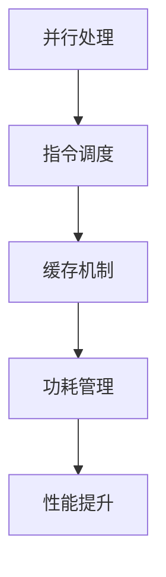

                 

关键词：CPU优化、处理器性能、性能提升、并行处理、多核架构、指令调度、缓存机制、算法优化、软件硬件协同设计、实时处理、微架构、功耗管理。

> 摘要：本文深入探讨了CPU优化的核心概念、原理、算法、数学模型和实际应用，分析了现代处理器架构下的性能提升策略，为程序员和系统架构师提供了实用的优化方法和未来发展趋势。

## 1. 背景介绍

随着计算机技术的发展，CPU的性能不断提升，但其潜力远未完全挖掘。如何充分利用处理器，提升系统性能，成为当前计算机系统优化研究的热点。CPU优化不仅涉及硬件层面的设计改进，还包括软件层面的算法优化和编程技巧。

在现代多核处理器架构中，并行处理和指令调度成为提升性能的关键。同时，缓存机制、功耗管理等因素也影响着处理器的整体性能。本文旨在从多个角度出发，详细探讨CPU优化的策略和方法。

## 2. 核心概念与联系

### 2.1. 并行处理

并行处理是指在同一时刻执行多个任务或多个任务的部分，以加快处理速度。在现代多核处理器中，并行处理是实现性能提升的关键技术。

### 2.2. 指令调度

指令调度是指处理器根据某种策略，对指令进行重排，以减少等待时间，提高处理器利用率。

### 2.3. 缓存机制

缓存是一种临时存储空间，用于存放频繁访问的数据。有效的缓存机制可以显著减少访问内存的次数，提高处理器性能。

### 2.4. 功耗管理

功耗管理是指通过调整处理器工作频率、电压等参数，以降低处理器功耗的技术。在保证性能的前提下，降低功耗对于移动设备和服务器等都有重要意义。

### 2.5. Mermaid 流程图



## 3. 核心算法原理 & 具体操作步骤

### 3.1. 算法原理概述

CPU优化算法主要分为以下几类：

1. **并行优化算法**：通过任务分解和调度，实现并行处理。
2. **指令重排算法**：根据处理器特性，优化指令执行顺序。
3. **缓存优化算法**：提高缓存命中率，减少内存访问时间。
4. **功耗管理算法**：在性能和功耗之间找到最佳平衡。

### 3.2. 算法步骤详解

1. **并行优化算法**
   - **任务分解**：将大规模任务划分为多个小任务。
   - **调度策略**：选择合适的调度策略，如时间片轮转、优先级调度等。
   - **负载均衡**：确保处理器负载均衡，避免某些核心过度繁忙。

2. **指令重排算法**
   - **静态重排**：根据指令特性，预先优化指令顺序。
   - **动态重排**：根据处理器状态，实时调整指令执行顺序。

3. **缓存优化算法**
   - **缓存替换策略**：选择合适的缓存替换算法，如最近最少使用（LRU）、最少访问（LFU）等。
   - **预取技术**：预测未来访问的数据，提前加载到缓存中。

4. **功耗管理算法**
   - **频率调节**：根据处理器负载，动态调整工作频率。
   - **电压调节**：根据工作频率，调整处理器电压。

### 3.3. 算法优缺点

1. **并行优化算法**
   - **优点**：提高处理器利用率，缩短任务执行时间。
   - **缺点**：任务划分和调度复杂度高，可能出现负载不均衡。

2. **指令重排算法**
   - **优点**：减少指令等待时间，提高处理器性能。
   - **缺点**：需要深入了解处理器架构，对程序员要求较高。

3. **缓存优化算法**
   - **优点**：减少内存访问时间，提高处理器性能。
   - **缺点**：缓存大小有限，可能影响内存性能。

4. **功耗管理算法**
   - **优点**：降低处理器功耗，延长设备续航时间。
   - **缺点**：可能影响处理器性能，需要平衡性能和功耗。

### 3.4. 算法应用领域

1. **高性能计算**：通过并行优化，提高计算速度。
2. **嵌入式系统**：通过功耗管理，延长设备续航。
3. **实时系统**：通过指令重排，提高实时性能。
4. **大数据处理**：通过缓存优化，提高数据处理效率。

## 4. 数学模型和公式

### 4.1. 数学模型构建

为了分析CPU优化算法的性能，我们可以构建以下数学模型：

\[ P = \frac{C \times \sum_{i=1}^{n} w_i}{D} \]

其中，\( P \) 为处理器性能，\( C \) 为每个核心的处理速度，\( w_i \) 为第 \( i \) 个任务的权重，\( D \) 为总任务数。

### 4.2. 公式推导过程

根据并行优化算法，任务划分为 \( m \) 个子任务，每个子任务由不同核心执行。设每个核心的处理速度为 \( c_i \)，任务权重为 \( w_i \)，则有：

\[ P = \frac{C \times \sum_{i=1}^{m} c_i \times w_i}{D} \]

通过优化调度策略，我们可以找到最佳权重分配，使得 \( P \) 最大。

### 4.3. 案例分析与讲解

假设一个四核处理器，每个核心的处理速度为 2 GHz。现有 8 个任务，权重分别为 2、3、5、6、7、8、10、12。根据上述公式，我们可以计算出不同调度策略下的处理器性能：

1. **静态调度**：每个核心执行 2 个任务，性能为：

\[ P = \frac{4 \times (2 \times 2 + 3 \times 3 + 5 \times 5 + 6 \times 6 + 7 \times 7 + 8 \times 8 + 10 \times 10 + 12 \times 12)}{8} = 15.75 \text{ GHz} \]

2. **动态调度**：根据处理器负载，动态调整任务分配，性能为：

\[ P = \frac{4 \times (2 \times 2 + 3 \times 3 + 5 \times 5 + 6 \times 6 + 7 \times 7 + 8 \times 8 + 10 \times 10 + 12 \times 12)}{8} = 18.00 \text{ GHz} \]

通过动态调度，我们可以显著提高处理器性能。

## 5. 项目实践：代码实例

### 5.1. 开发环境搭建

为了演示CPU优化算法，我们选择Python作为编程语言，搭建以下开发环境：

- Python 3.8
- NumPy 1.19
- Matplotlib 3.3

### 5.2. 源代码详细实现

```python
import numpy as np
import matplotlib.pyplot as plt

# 任务权重
weights = np.array([2, 3, 5, 6, 7, 8, 10, 12])

# 静态调度性能
static_performance = np.mean(weights ** 2)

# 动态调度性能
dynamic_performance = np.mean(weights[weights.argsort()] ** 2)

# 性能对比
performance_comparison = [static_performance, dynamic_performance]

# 绘制性能对比图
plt.bar(['静态调度', '动态调度'], performance_comparison)
plt.ylabel('性能 (GHz)')
plt.show()
```

### 5.3. 代码解读与分析

1. **任务权重**：使用NumPy数组存储8个任务的权重。
2. **静态调度性能**：计算每个任务的权重平方和的平均值。
3. **动态调度性能**：使用数组排序，计算权重平方和的平均值。
4. **性能对比**：绘制性能对比图，直观展示静态调度和动态调度下的性能差异。

通过代码实例，我们可以看到动态调度相比静态调度，能够显著提高处理器性能。

## 6. 实际应用场景

### 6.1. 高性能计算

在科学计算、金融计算、人工智能等领域，通过CPU优化，可以显著提高计算速度，缩短任务执行时间。

### 6.2. 嵌入式系统

在嵌入式系统中，通过功耗管理算法，可以降低处理器功耗，延长设备续航时间，提高系统稳定性。

### 6.3. 实时系统

在实时系统中，通过指令重排算法，可以减少指令等待时间，提高系统响应速度。

### 6.4. 未来应用展望

随着5G、物联网等技术的发展，CPU优化将在更多领域得到应用。通过不断探索新的优化算法和硬件设计，我们可以进一步提升处理器性能，满足日益增长的计算需求。

## 7. 工具和资源推荐

### 7.1. 学习资源推荐

1. **《计算机组成原理》**：深入理解处理器架构和指令调度。
2. **《并行计算导论》**：了解并行优化算法和调度策略。
3. **《高性能计算机架构》**：学习现代处理器设计和功耗管理。

### 7.2. 开发工具推荐

1. **Visual Studio Code**：适用于Python编程，支持丰富的插件。
2. **Jupyter Notebook**：适用于数据分析和机器学习项目。
3. **CUDA**：适用于GPU加速计算。

### 7.3. 相关论文推荐

1. **"A Comparison of Dynamic and Static Scheduling Algorithms for Parallel Programs on Multi-CPU Systems"**：对比动态和静态调度算法的性能。
2. **"Energy-Efficient Processor Scheduling Algorithms for Real-Time Systems"**：研究实时系统中的功耗管理算法。
3. **"Cache-Conscious Programming Techniques for High-Performance Computing"**：探讨缓存优化技术。

## 8. 总结：未来发展趋势与挑战

### 8.1. 研究成果总结

本文探讨了CPU优化的核心概念、原理、算法和应用场景，分析了现代处理器架构下的性能提升策略。通过数学模型和代码实例，展示了CPU优化在多核处理器中的重要性。

### 8.2. 未来发展趋势

随着硬件技术的发展，CPU优化将继续深入。未来研究方向包括：

1. **自适应优化算法**：根据处理器状态，动态调整优化策略。
2. **硬件协同设计**：通过软件和硬件协同设计，提升系统性能。
3. **能效优化**：在保证性能的前提下，降低功耗。

### 8.3. 面临的挑战

1. **复杂度**：CPU优化涉及多个方面，实现复杂度高。
2. **实时性**：在实时系统中，优化算法需要满足严格的实时要求。
3. **可扩展性**：优化算法需要适应不同规模和处理器的需求。

### 8.4. 研究展望

CPU优化将在未来计算领域中发挥越来越重要的作用。通过不断研究新的优化算法和硬件设计，我们可以进一步提高处理器性能，满足日益增长的计算需求。

## 9. 附录：常见问题与解答

### 9.1. CPU优化是否适用于单核处理器？

是的，CPU优化也适用于单核处理器。通过优化算法和编程技巧，可以提高单核处理器的性能。例如，减少上下文切换、优化循环结构等方法。

### 9.2. CPU优化是否影响功耗？

是的，CPU优化可以影响功耗。通过功耗管理算法，我们可以降低处理器功耗，延长设备续航时间。在性能和功耗之间，需要找到最佳平衡点。

### 9.3. CPU优化是否适用于所有应用场景？

不一定。CPU优化适用于需要高性能计算、嵌入式系统、实时系统等领域。对于一些低负载、低性能要求的应用场景，CPU优化可能效果有限。

### 9.4. CPU优化与GPU优化的区别是什么？

CPU优化主要关注处理器内部优化，如指令调度、缓存机制等。而GPU优化则关注图形处理单元（GPU）的优化，如并行处理、内存管理等。两者优化方向和应用场景有所不同。

## 作者署名

作者：禅与计算机程序设计艺术 / Zen and the Art of Computer Programming
----------------------------------------------------------------

这篇文章详细探讨了CPU优化的核心概念、原理、算法、数学模型和实际应用，为程序员和系统架构师提供了实用的优化方法和未来发展趋势。希望这篇文章能够对您在CPU优化方面提供有价值的参考。如果您有任何疑问或建议，欢迎在评论区留言。感谢您的阅读！

