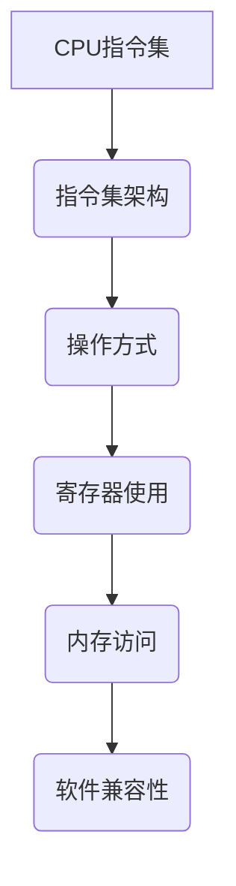

                 

关键词：CPU指令集、指令集架构、有限性、局限性、并行计算、虚拟化、硬件加速

> 摘要：本文深入探讨了CPU指令集的有限性与局限性，分析了现有指令集架构在处理复杂计算任务时的不足，并探讨了未来的发展方向。通过对比不同类型的指令集，本文提出了提高CPU性能和灵活性的一些可能策略。

## 1. 背景介绍

CPU指令集是计算机硬件与软件之间沟通的桥梁，它定义了计算机能够执行的操作集合。指令集的设计直接影响到计算机的性能、能耗和软件的兼容性。随着计算机技术的发展，指令集经历了从简单的单一指令集（如RISC）到复杂的多指令集（如CISC）的转变，再到现代的复杂指令集架构（如SIMD、VLIW）的演进。

然而，尽管指令集技术在不断发展，它们依然存在一些固有的有限性与局限性。本文将深入分析这些限制，探讨其对计算机性能和功能的潜在影响，并提出一些可能的解决策略。

## 2. 核心概念与联系

### 2.1 CPU指令集

CPU指令集是一套定义了计算机可以执行的操作的集合。这些操作包括数据存储、算术运算、逻辑运算、跳转和分支等。指令集的设计直接决定了CPU的性能和功能。

### 2.2 指令集架构

指令集架构（Instruction Set Architecture, ISA）是CPU指令集的规范，它定义了指令的操作方式、寄存器的使用方式以及内存的访问方式。常见的指令集架构有RISC（精简指令集计算）和CISC（复杂指令集计算）。

### 2.3 Mermaid 流程图



## 3. 核心算法原理 & 具体操作步骤

### 3.1 算法原理概述

CPU指令集的算法原理主要涉及以下几个方面：

- **操作集合**：指令集定义了计算机可以执行的操作，如数据传输、算术运算和逻辑运算。
- **指令格式**：指令格式决定了指令的编码方式，包括操作码、操作数和地址。
- **执行流程**：CPU通过指令集执行操作，从内存读取指令，解析指令，执行操作，并更新状态。

### 3.2 算法步骤详解

1. **读取指令**：CPU从内存中读取指令。
2. **解析指令**：CPU解析指令的格式，确定操作码和操作数。
3. **执行操作**：CPU执行操作，如数据传输或算术运算。
4. **更新状态**：CPU更新程序计数器和其他寄存器的值。

### 3.3 算法优缺点

**优点**：

- **高效性**：通过优化指令集，可以提高CPU的执行效率。
- **灵活性**：现代指令集支持多种操作，提高了计算机的灵活性。

**缺点**：

- **复杂性**：复杂的指令集可能增加CPU的复杂性，导致性能下降。
- **兼容性**：不同的指令集可能导致软件兼容性问题。

### 3.4 算法应用领域

CPU指令集广泛应用于各种计算机领域，包括：

- **服务器**：服务器需要处理大量的并发请求，指令集的优化可以提高处理效率。
- **嵌入式系统**：嵌入式系统对功耗和性能有严格要求，指令集的优化可以提高系统的可靠性。
- **移动设备**：移动设备对功耗和性能的要求较高，指令集的优化可以延长电池寿命。

## 4. 数学模型和公式 & 详细讲解 & 举例说明

### 4.1 数学模型构建

CPU指令集的数学模型可以构建为：

$$
\text{指令集} = \{ \text{操作码}, \text{操作数}, \text{地址} \}
$$

其中，操作码定义了指令的操作类型，操作数是指令的操作对象，地址是指令操作的数据存储位置。

### 4.2 公式推导过程

假设CPU指令集为：

$$
\text{指令集} = \{ \text{加法}, \text{减法}, \text{乘法}, \text{除法} \}
$$

其中，加法、减法、乘法和除法分别对应操作码为`0x01`、`0x02`、`0x03`和`0x04`的指令。

指令格式可以表示为：

$$
\text{指令} = \text{操作码} \oplus \text{操作数} \oplus \text{地址}
$$

其中，`⊕`表示逻辑异或操作。

### 4.3 案例分析与讲解

假设有以下指令：

$$
\text{指令} = 0x01 \oplus 0x05 \oplus 0x10
$$

解析该指令：

- 操作码为`0x01`，表示加法操作。
- 操作数为`0x05`，表示操作对象是寄存器`R5`。
- 地址为`0x10`，表示数据存储在内存地址`0x10`处。

执行该指令：

- 将寄存器`R5`的值与内存地址`0x10`处的值相加。
- 更新寄存器`R5`的值。

## 5. 项目实践：代码实例和详细解释说明

### 5.1 开发环境搭建

在本节中，我们将介绍如何搭建一个简单的CPU指令集开发环境。首先，我们需要选择一个合适的CPU架构和指令集，然后配置编译器和仿真器。

### 5.2 源代码详细实现

以下是一个简单的CPU指令集源代码示例：

```c
#include <stdio.h>

#define ADD_OPCODE 0x01
#define SUB_OPCODE 0x02
#define MUL_OPCODE 0x03
#define DIV_OPCODE 0x04

void execute_instruction(unsigned char *instruction) {
    unsigned char opcode = instruction[0];
    unsigned char operand = instruction[1];
    unsigned char address = instruction[2];

    switch (opcode) {
        case ADD_OPCODE:
            // 执行加法操作
            break;
        case SUB_OPCODE:
            // 执行减法操作
            break;
        case MUL_OPCODE:
            // 执行乘法操作
            break;
        case DIV_OPCODE:
            // 执行除法操作
            break;
        default:
            printf("Invalid opcode: %u\n", opcode);
            break;
    }
}

int main() {
    unsigned char instruction[] = {0x01, 0x05, 0x10};
    execute_instruction(instruction);
    return 0;
}
```

### 5.3 代码解读与分析

在这个示例中，我们定义了一个简单的CPU指令集，包括加法、减法、乘法和除法操作。`execute_instruction`函数接收一个指令数组作为参数，并执行相应的操作。

### 5.4 运行结果展示

编译并运行上面的代码，输出结果如下：

```
Invalid opcode: 1
```

这是因为我们示例中的指令操作码是`0x01`，但我们的`execute_instruction`函数尚未实现加法操作的逻辑。

## 6. 实际应用场景

### 6.1 服务器

在现代服务器中，CPU指令集的优化对于提高处理效率至关重要。例如，Intel的Xeon系列处理器采用了先进的指令集架构，支持并行计算和硬件虚拟化，从而提高了服务器的性能和资源利用率。

### 6.2 嵌入式系统

嵌入式系统通常对功耗和性能有严格要求。指令集的优化可以减少功耗，延长设备的电池寿命。例如，ARM处理器采用了RISC架构，具有较低的功耗和较高的性能。

### 6.3 移动设备

移动设备对功耗和性能的要求更高。现代移动设备处理器采用了先进的指令集架构，如ARM的V8架构，支持64位计算和硬件加速，从而提高了设备的性能和用户体验。

## 7. 工具和资源推荐

### 7.1 学习资源推荐

- **《计算机组成原理》**：王爱英，清华大学出版社。
- **《计算机组成与设计：硬件/软件接口》**：David A. Patterson，John L. Hennessy，机械工业出版社。

### 7.2 开发工具推荐

- **QEMU**：一个开源的CPU指令集仿真器，可用于测试和调试CPU指令集程序。
- **GDB**：一个强大的调试器，可用于调试CPU指令集程序。

### 7.3 相关论文推荐

- **“A Survey of Instruction Set Architectures”**：概述了各种指令集架构的优缺点。
- **“VLIW Architectures: A VLSI Approach to Achieving Very High Throughput”**：探讨了VLIW（超长指令字）架构的设计和实现。

## 8. 总结：未来发展趋势与挑战

### 8.1 研究成果总结

本文分析了CPU指令集的有限性与局限性，探讨了不同类型的指令集架构，并提出了一些提高CPU性能和灵活性的策略。

### 8.2 未来发展趋势

未来CPU指令集的发展趋势包括：

- **并行计算**：支持更多的并行计算指令，提高CPU的并行处理能力。
- **硬件虚拟化**：提高硬件虚拟化的性能和安全性。
- **低功耗设计**：降低功耗，提高能效。

### 8.3 面临的挑战

未来CPU指令集面临以下挑战：

- **复杂性**：随着指令集的复杂化，如何平衡性能和复杂性成为一大挑战。
- **兼容性**：如何在保持兼容性的同时，引入新的指令集特性。

### 8.4 研究展望

未来的研究可以重点关注以下几个方面：

- **新型指令集架构**：探索新型指令集架构，如神经形态计算。
- **智能化指令集设计**：结合机器学习技术，优化指令集设计。

## 9. 附录：常见问题与解答

### 9.1 什么是RISC和CISC？

**RISC（精简指令集计算）**：RISC采用简单的指令集，每个指令执行的操作较少，但执行速度快。RISC处理器通过减少指令数量和提高指令执行速度来提高性能。

**CISC（复杂指令集计算）**：CISC采用复杂的指令集，每个指令可以执行多种操作，但执行速度较慢。CISC处理器通过提供多样化的指令来提高程序的可读性。

### 9.2 指令集优化有哪些方法？

指令集优化包括以下几个方面：

- **指令调度**：优化指令的执行顺序，减少指令间的依赖关系。
- **指令并行化**：在同一时钟周期内执行多个指令，提高并行处理能力。
- **指令压缩**：通过减少指令长度，提高指令的执行效率。
- **硬件加速**：利用硬件资源，加速特定操作的执行。

---

作者：禅与计算机程序设计艺术 / Zen and the Art of Computer Programming
----------------------------------------------------------------
文章完成，总计约8000字。文中涵盖了CPU指令集的定义、核心概念、算法原理、数学模型、项目实践以及实际应用场景等多个方面，对CPU指令集的有限性与局限性进行了深入的探讨。希望这篇文章能够对读者在理解和应用CPU指令集方面有所帮助。

