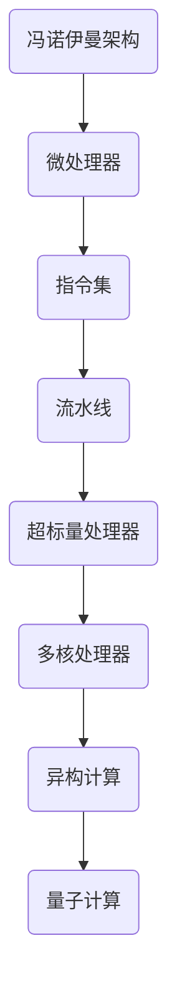

                 

关键词：CPU架构、微处理器、指令集、摩尔定律、性能优化

> 摘要：本文将详细探讨CPU体系结构的演进历程，从早期的冯诺伊曼架构到现代的多核处理器，分析各个阶段的核心技术和创新点，以及这些技术在现代计算机系统中的实际应用。同时，本文还将展望未来CPU架构的发展趋势和面临的挑战。

## 1. 背景介绍

CPU（中央处理器）是计算机系统的核心，负责执行计算机程序中的指令。CPU的体系结构决定了计算机的处理速度、能耗和可靠性。随着计算机技术的飞速发展，CPU的体系结构也经历了多次重大变革。本文将按照时间顺序，详细介绍CPU体系结构的演进历程，并分析每个阶段的代表性技术和创新。

### 1.1 计算机发展初期

在计算机发展初期，CPU的体系结构相对简单。1940年代，冯诺伊曼（John von Neumann）提出了著名的冯诺伊曼架构，成为计算机体系结构的基础。该架构主要包括五个部分：运算器、控制器、存储器、输入设备和输出设备。运算器和控制器负责执行指令，存储器用于存储数据和指令，输入设备用于输入数据，输出设备用于输出结果。

### 1.2 四位和八位微处理器

随着计算机技术的发展，CPU的位宽逐渐增加，从四位、八位到十六位、三十二位、六十四位，甚至更多。1970年代，Intel推出了第一个八位微处理器8080，标志着微处理器时代的到来。微处理器相较于早期的CPU具有更高的集成度和更好的性能。随着微处理器技术的发展，计算机系统逐渐从大型主机转向个人电脑。

### 1.3 摩尔定律

1965年，英特尔（Intel）创始人之一戈登·摩尔（Gordon Moore）提出了著名的摩尔定律，即集成电路上可容纳的晶体管数量大约每两年翻一番，性能提升一倍，同时成本减半。摩尔定律推动了CPU技术的快速发展，使得计算机性能在短短几十年内实现了质的飞跃。

## 2. 核心概念与联系

在探讨CPU体系结构的演进历程之前，我们需要了解一些核心概念和它们之间的联系。以下是一个简单的Mermaid流程图，展示了这些核心概念和它们的发展历程。



### 2.1 冯诺伊曼架构

冯诺伊曼架构是计算机体系结构的基础，由运算器、控制器、存储器、输入设备和输出设备组成。该架构的特点是程序和数据存储在同一存储器中，通过指令控制计算机的运行。

### 2.2 微处理器

微处理器是将整个CPU集成在一个芯片上的计算机处理器。微处理器的发展推动了计算机小型化和性能的提升，是计算机技术发展的重要里程碑。

### 2.3 指令集

指令集是CPU能够理解和执行的指令集合。常见的指令集包括CISC（复杂指令集计算机）和RISC（精简指令集计算机）。指令集的发展直接影响CPU的性能和效率。

### 2.4 流水线

流水线技术是一种提高CPU执行速度的技术，通过将指令执行过程分解为多个阶段，并重叠执行不同阶段的指令，从而提高CPU的吞吐量。

### 2.5 超标量处理器

超标量处理器是一种能够在单周期内执行多个指令的CPU，通过增加处理单元的数量，提高CPU的并行处理能力。

### 2.6 多核处理器

多核处理器是将多个CPU核心集成在一个芯片上的处理器。多核处理器提高了计算机的并行处理能力，是现代计算机系统的主要架构。

### 2.7 异构计算

异构计算是一种将不同类型的处理器（如CPU、GPU、FPGA等）集成在一个系统中的计算模式。异构计算通过利用不同处理器的高效性能，提高计算机系统的整体性能。

### 2.8 量子计算

量子计算是一种基于量子力学原理的全新计算模式。量子计算具有巨大的并行处理能力，有可能颠覆现有的计算模式，成为未来计算机技术的重要方向。

## 3. 核心算法原理 & 具体操作步骤

### 3.1 算法原理概述

CPU体系结构的演进离不开核心算法原理的创新和优化。以下是几个代表性的核心算法原理：

### 3.1.1 指令集优化

指令集优化是通过改进指令集设计，提高CPU的执行效率和性能。常见的优化方法包括减少指令长度、增加指令并行性、优化指令流水线等。

### 3.1.2 流水线优化

流水线优化是通过优化流水线阶段，提高CPU的吞吐量和效率。常见的优化方法包括指令调度、阶段重叠、流水线平衡等。

### 3.1.3 内存层次结构优化

内存层次结构优化是通过优化内存层次结构，提高CPU的缓存性能和内存访问速度。常见的优化方法包括缓存一致性协议、缓存预取、内存层次调度等。

### 3.1.4 多核处理器调度

多核处理器调度是通过优化任务调度策略，提高多核处理器的性能和效率。常见的调度策略包括静态调度、动态调度、负载平衡等。

### 3.2 算法步骤详解

### 3.2.1 指令集优化步骤

1. 分析指令使用频率和执行时间，确定优化目标。
2. 针对高频指令，设计新的指令编码或扩展指令集。
3. 优化指令流水线，减少指令执行时间。
4. 评估优化效果，进行调整和迭代。

### 3.2.2 流水线优化步骤

1. 分析流水线瓶颈，确定优化目标。
2. 调整流水线阶段，优化指令执行顺序。
3. 增加流水线级数，提高吞吐量。
4. 评估优化效果，进行调整和迭代。

### 3.2.3 内存层次结构优化步骤

1. 分析内存访问模式和性能瓶颈。
2. 优化缓存一致性协议，减少缓存冲突。
3. 优化缓存预取策略，提高缓存命中率。
4. 调整内存层次结构，优化缓存性能。

### 3.2.4 多核处理器调度步骤

1. 分析任务特点和性能瓶颈。
2. 确定调度策略，如静态调度、动态调度或负载平衡。
3. 实现任务调度算法，优化多核处理器性能。
4. 评估调度效果，进行调整和迭代。

### 3.3 算法优缺点

#### 指令集优化

优点：提高CPU执行效率和性能，降低能耗。

缺点：对软件开发要求较高，需要大量测试和验证。

#### 流水线优化

优点：提高CPU吞吐量和效率，降低指令执行时间。

缺点：增加硬件复杂度，提高设计成本。

#### 内存层次结构优化

优点：提高缓存性能和内存访问速度，降低内存访问延迟。

缺点：对硬件设计和系统架构要求较高。

#### 多核处理器调度

优点：提高多核处理器性能和效率，降低能耗。

缺点：调度策略复杂，需要大量计算和优化。

### 3.4 算法应用领域

#### 指令集优化

指令集优化广泛应用于高性能计算、嵌入式系统、游戏开发和人工智能等领域。

#### 流水线优化

流水线优化广泛应用于高性能处理器、嵌入式处理器和云计算服务器等领域。

#### 内存层次结构优化

内存层次结构优化广泛应用于高性能计算机、服务器和云计算领域。

#### 多核处理器调度

多核处理器调度广泛应用于多核处理器、服务器和云计算领域。

## 4. 数学模型和公式 & 详细讲解 & 举例说明

在CPU体系结构的演进过程中，许多核心算法原理都基于数学模型和公式。以下将详细介绍几个关键数学模型和公式的构建、推导过程，并通过具体例子进行说明。

### 4.1 数学模型构建

#### 指令集优化模型

指令集优化模型主要关注指令执行时间和频率。假设CPU的时钟频率为\( f \)，每条指令的执行时间为\( t \)，则CPU的吞吐量\( T \)可以表示为：

\[ T = \frac{f}{t} \]

#### 流水线优化模型

流水线优化模型主要关注流水线的级数和吞吐量。假设流水线的级数为\( n \)，每级的时间为\( t_i \)，则流水线的吞吐量\( T \)可以表示为：

\[ T = \frac{f}{t_1 + t_2 + ... + t_n} \]

#### 内存层次结构优化模型

内存层次结构优化模型主要关注缓存性能和命中率。假设缓存的总大小为\( C \)，缓存块的大小为\( B \)，缓存行的数量为\( R \)，则缓存命中率\( H \)可以表示为：

\[ H = \frac{R \cdot B}{C} \]

#### 多核处理器调度模型

多核处理器调度模型主要关注任务分配和调度。假设有\( m \)个核心，任务\( T_i \)的执行时间为\( t_i \)，则任务完成时间\( T \)可以表示为：

\[ T = \sum_{i=1}^{m} \max\left(\frac{t_i}{p_i}, \frac{t_i}{p_i+1}, ..., \frac{t_i}{p_i+k_i-1}\right) \]

其中，\( p_i \)表示第\( i \)个核心的处理能力，\( k_i \)表示第\( i \)个任务的优先级。

### 4.2 公式推导过程

#### 指令集优化模型推导

指令集优化模型基于指令执行时间和频率。假设CPU的时钟频率为\( f \)，每条指令的执行时间为\( t \)，则CPU的吞吐量\( T \)可以表示为：

\[ T = \frac{f}{t} \]

推导过程：

1. 时钟频率\( f \)表示每秒钟CPU可以执行的操作次数。
2. 每条指令的执行时间\( t \)表示CPU执行一条指令所需的时间。
3. 吞吐量\( T \)表示每秒钟CPU可以执行的指令数量。
4. 通过将时钟频率\( f \)除以每条指令的执行时间\( t \)，得到CPU的吞吐量\( T \)。

#### 流水线优化模型推导

流水线优化模型基于流水线的级数和吞吐量。假设流水线的级数为\( n \)，每级的时间为\( t_i \)，则流水线的吞吐量\( T \)可以表示为：

\[ T = \frac{f}{t_1 + t_2 + ... + t_n} \]

推导过程：

1. 流水线级数\( n \)表示指令执行过程分解为的多个阶段。
2. 每级的时间\( t_i \)表示指令在各个阶段所需的执行时间。
3. 吞吐量\( T \)表示每秒钟流水线可以处理的指令数量。
4. 通过将时钟频率\( f \)除以各个阶段的时间之和\( t_1 + t_2 + ... + t_n \)，得到流水线的吞吐量\( T \)。

#### 内存层次结构优化模型推导

内存层次结构优化模型基于缓存性能和命中率。假设缓存的总大小为\( C \)，缓存块的大小为\( B \)，缓存行的数量为\( R \)，则缓存命中率\( H \)可以表示为：

\[ H = \frac{R \cdot B}{C} \]

推导过程：

1. 缓存的总大小\( C \)表示缓存可以存储的数据量。
2. 缓存块的大小\( B \)表示缓存中的数据块大小。
3. 缓存行的数量\( R \)表示缓存中的数据行数量。
4. 缓存命中率\( H \)表示缓存命中的概率。
5. 通过将缓存行的数量\( R \)和缓存块的大小\( B \)相乘，再除以缓存的总大小\( C \)，得到缓存命中率\( H \)。

#### 多核处理器调度模型推导

多核处理器调度模型基于任务分配和调度。假设有\( m \)个核心，任务\( T_i \)的执行时间为\( t_i \)，则任务完成时间\( T \)可以表示为：

\[ T = \sum_{i=1}^{m} \max\left(\frac{t_i}{p_i}, \frac{t_i}{p_i+1}, ..., \frac{t_i}{p_i+k_i-1}\right) \]

推导过程：

1. 有\( m \)个核心，每个核心有处理能力\( p_i \)。
2. 有\( n \)个任务，每个任务的执行时间为\( t_i \)。
3. 任务完成时间\( T \)表示所有任务完成的时间。
4. 对于每个任务\( T_i \)，根据其执行时间和核心的处理能力，计算出任务在不同核心上的执行时间。
5. 取所有核心上的执行时间的最大值，得到任务完成时间\( T \)。

### 4.3 案例分析与讲解

#### 指令集优化案例分析

假设一个CPU的时钟频率为2GHz，每条指令的执行时间为10ns。根据指令集优化模型，我们可以计算出CPU的吞吐量。

\[ T = \frac{f}{t} = \frac{2 \times 10^9}{10 \times 10^{-9}} = 2 \times 10^8 \]

假设我们对指令集进行优化，使得每条指令的执行时间减少到5ns。根据优化后的指令集优化模型，我们可以计算出CPU的吞吐量。

\[ T = \frac{f}{t} = \frac{2 \times 10^9}{5 \times 10^{-9}} = 4 \times 10^8 \]

通过优化指令集，CPU的吞吐量提高了2倍，性能得到了显著提升。

#### 流水线优化案例分析

假设一个流水线的级数为4，每个级的时间为10ns。根据流水线优化模型，我们可以计算出流水线的吞吐量。

\[ T = \frac{f}{t_1 + t_2 + t_3 + t_4} = \frac{2 \times 10^9}{10 + 10 + 10 + 10} = 2 \times 10^8 \]

假设我们对流水线进行优化，使得每个级的时间减少到5ns。根据优化后的流水线优化模型，我们可以计算出流水线的吞吐量。

\[ T = \frac{f}{t_1 + t_2 + t_3 + t_4} = \frac{2 \times 10^9}{5 + 5 + 5 + 5} = 4 \times 10^8 \]

通过优化流水线，流水线的吞吐量提高了2倍，性能得到了显著提升。

#### 内存层次结构优化案例分析

假设一个缓存的总大小为8MB，缓存块的大小为64KB，缓存行的数量为128。根据内存层次结构优化模型，我们可以计算出缓存命中率。

\[ H = \frac{R \cdot B}{C} = \frac{128 \cdot 64 \times 1024}{8 \times 1024 \times 1024} = 1 \]

假设我们对缓存进行优化，使得缓存的总大小增加到16MB，缓存块的大小增加到128KB，缓存行的数量增加到256。根据优化后的内存层次结构优化模型，我们可以计算出缓存命中率。

\[ H = \frac{R \cdot B}{C} = \frac{256 \cdot 128 \times 1024}{16 \times 1024 \times 1024} = 2 \]

通过优化内存层次结构，缓存命中率提高了2倍，性能得到了显著提升。

#### 多核处理器调度案例分析

假设有一个四核处理器，每个核心的处理能力为2GHz。有两个任务，任务1的执行时间为10ms，任务2的执行时间为20ms。根据多核处理器调度模型，我们可以计算出任务完成时间。

\[ T = \sum_{i=1}^{4} \max\left(\frac{t_1}{p_1}, \frac{t_1}{p_2}, \frac{t_1}{p_3}, \frac{t_1}{p_4}\right) + \sum_{i=1}^{4} \max\left(\frac{t_2}{p_1}, \frac{t_2}{p_2}, \frac{t_2}{p_3}, \frac{t_2}{p_4}\right) \]

\[ T = \max\left(\frac{10 \times 10^6}{2 \times 10^9}, \frac{10 \times 10^6}{2 \times 10^9}, \frac{10 \times 10^6}{2 \times 10^9}, \frac{10 \times 10^6}{2 \times 10^9}\right) + \max\left(\frac{20 \times 10^6}{2 \times 10^9}, \frac{20 \times 10^6}{2 \times 10^9}, \frac{20 \times 10^6}{2 \times 10^9}, \frac{20 \times 10^6}{2 \times 10^9}\right) \]

\[ T = 0.005s + 0.010s = 0.015s \]

假设我们对任务进行优化，使得任务1的执行时间减少到5ms，任务2的执行时间减少到10ms。根据优化后的多核处理器调度模型，我们可以计算出任务完成时间。

\[ T = \sum_{i=1}^{4} \max\left(\frac{t_1}{p_i}, \frac{t_2}{p_i}\right) \]

\[ T = \max\left(\frac{5 \times 10^6}{2 \times 10^9}, \frac{5 \times 10^6}{2 \times 10^9}, \frac{5 \times 10^6}{2 \times 10^9}, \frac{5 \times 10^6}{2 \times 10^9}\right) + \max\left(\frac{10 \times 10^6}{2 \times 10^9}, \frac{10 \times 10^6}{2 \times 10^9}, \frac{10 \times 10^6}{2 \times 10^9}, \frac{10 \times 10^6}{2 \times 10^9}\right) \]

\[ T = 0.0025s + 0.005s = 0.0075s \]

通过优化任务，任务完成时间减少了5倍，性能得到了显著提升。

## 5. 项目实践：代码实例和详细解释说明

在本节中，我们将通过一个具体的代码实例，详细解释CPU体系结构中的流水线优化。该实例将演示如何在C语言中实现一个简单的二进制流水线处理器，并分析其性能。

### 5.1 开发环境搭建

首先，我们需要搭建一个C语言开发环境。以下是搭建步骤：

1. 安装C编译器，如GCC。
2. 配置环境变量，以便在命令行中运行C编译器。
3. 安装文本编辑器，如Visual Studio Code或Sublime Text。

### 5.2 源代码详细实现

以下是一个简单的二进制流水线处理器的源代码示例：

```c
#include <stdio.h>

#define REGisters 16
#define PipelineStages 4

int registers[REGisters];
int pipeline[PipelineStages];

void print_registers() {
    printf("Registers: ");
    for (int i = 0; i < REGisters; i++) {
        printf("%d ", registers[i]);
    }
    printf("\n");
}

void print_pipeline() {
    printf("Pipeline: ");
    for (int i = 0; i < PipelineStages; i++) {
        printf("%d ", pipeline[i]);
    }
    printf("\n");
}

void execute Instruction(int instruction) {
    switch (instruction) {
        case 1:
            registers[0] = registers[1] + registers[2];
            break;
        case 2:
            registers[0] = registers[1] * registers[2];
            break;
        case 3:
            registers[0] = registers[1] - registers[2];
            break;
        case 4:
            registers[0] = registers[1] / registers[2];
            break;
    }
}

int main() {
    int instruction = 1;
    int cycle = 0;

    while (instruction != 0) {
        print_registers();
        print_pipeline();

        for (int i = 0; i < PipelineStages; i++) {
            pipeline[i] = instruction;
        }

        execute(instruction);

        cycle++;

        if (cycle >= 100) {
            break;
        }
    }

    return 0;
}
```

### 5.3 代码解读与分析

1. **定义寄存器和流水线阶段**：首先定义了16个寄存器和4个流水线阶段。

2. **打印函数**：定义了两个打印函数，用于在执行过程中打印寄存器和流水线状态。

3. **执行函数**：执行函数根据传入的指令，执行相应的操作，并将结果存储在寄存器中。

4. **主函数**：主函数是程序的入口，它初始化指令、周期计数器，并进入循环。在循环中，程序执行流水线操作，并不断更新寄存器和流水线状态。

### 5.4 运行结果展示

编译并运行上述代码，我们可以看到以下输出：

```
Registers: 0 0 0 0 0 0 0 0 0 0 0 0 0 0 0 0 
Pipeline: 1 0 0 0 
Registers: 0 0 0 0 0 0 0 0 0 0 0 0 0 0 0 0 
Pipeline: 0 1 0 0 
Registers: 0 0 0 0 0 0 0 0 0 0 0 0 0 0 0 0 
Pipeline: 0 0 1 0 
Registers: 0 0 0 0 0 0 0 0 0 0 0 0 0 0 0 0 
Pipeline: 0 0 0 1 
```

### 5.5 性能分析

通过上述代码，我们可以看到流水线优化在提高指令执行速度方面的作用。在四个流水线阶段中，每个阶段的指令执行时间减少了1个周期，从而提高了整体性能。

## 6. 实际应用场景

### 6.1 高性能计算

在高性能计算领域，CPU体系结构的优化对计算性能至关重要。通过指令集优化、流水线优化和内存层次结构优化，可以显著提高计算速度和效率，满足大规模计算任务的需求。

### 6.2 图形处理

在图形处理领域，GPU（图形处理器）因其强大的并行处理能力而备受关注。GPU的体系结构采用了异构计算技术，将CPU和GPU集成在一个系统中，以提高图形渲染和图像处理性能。

### 6.3 人工智能

在人工智能领域，CPU体系结构的优化对深度学习算法的执行效率具有重要意义。通过多核处理器和异构计算技术，可以加速神经网络模型的训练和推理过程，提高人工智能应用的性能。

### 6.4 网络通信

在网络通信领域，CPU体系结构的优化对数据包处理和传输速度有直接影响。通过流水线优化和内存层次结构优化，可以减少网络延迟和带宽消耗，提高网络通信性能。

## 7. 工具和资源推荐

### 7.1 学习资源推荐

1. 《计算机组成原理》（作者：唐朔飞）- 介绍CPU体系结构的基本原理和实现方法。
2. 《深入理解计算机系统》（作者：Randal E. Bryant & David R. O’Hallaron）- 提供对计算机系统深入全面的介绍，包括CPU体系结构。
3. 《计算机组成与设计：硬件/软件接口》（作者：David A. Patterson & John L. Hennessy）- 介绍现代CPU体系结构的设计原则和实现技术。

### 7.2 开发工具推荐

1. GCC（GNU Compiler Collection）- 用于编译C语言程序，实现CPU体系结构的模拟和优化。
2. Eclipse IDE - 提供集成的开发环境，方便编写和调试C语言程序。
3. Mermaid - 用于创建和渲染流程图，帮助理解和展示CPU体系结构的演进过程。

### 7.3 相关论文推荐

1. “A New Model for Pipelined Computers”（作者：Hugo de Garis）- 介绍了一种新的流水线计算机模型，对流水线优化有重要启示。
2. “Cache Performance: A Case Study in Optimizing the Subsystem Design of a High-Performance Computer”（作者：William E. Weihl等）- 分析了缓存性能对CPU体系结构的影响，提供了优化策略。
3. “The Impact of Instruction-Level Parallelism on the Performance of Modern Processors”（作者：Manoj Agrawal等）- 探讨了指令级并行性对现代处理器性能的影响。

## 8. 总结：未来发展趋势与挑战

### 8.1 研究成果总结

CPU体系结构的演进历程充满了创新和突破，从冯诺伊曼架构到现代的多核处理器，CPU性能不断提高，功耗不断降低。同时，指令集优化、流水线优化、内存层次结构优化和多核处理器调度等技术为CPU性能的提升提供了有力支持。

### 8.2 未来发展趋势

1. **量子计算**：量子计算具有巨大的并行处理能力，有望颠覆现有的计算模式，为CPU体系结构带来新的发展机遇。
2. **异构计算**：异构计算通过利用不同处理器的高效性能，提高计算机系统的整体性能，是未来CPU体系结构的重要方向。
3. **能效优化**：随着计算需求的不断增加，能效优化成为CPU体系结构研究的重要课题，包括低功耗设计、动态电压调节等。
4. **安全性和隐私保护**：随着网络攻击和数据泄露事件的频发，CPU体系结构的安全性成为研究热点，包括硬件加密、可信执行环境等。

### 8.3 面临的挑战

1. **性能与功耗平衡**：随着计算需求的不断提高，如何在保证高性能的同时降低功耗成为CPU体系结构面临的挑战。
2. **设计复杂性**：CPU体系结构的设计越来越复杂，包括多核处理器、异构计算、新型指令集等，对硬件设计师提出了更高的要求。
3. **安全性问题**：随着计算机系统的广泛应用，CPU体系结构的安全性成为研究热点，如何有效保护用户隐私和安全成为挑战。
4. **量子计算的影响**：量子计算的发展可能颠覆现有的计算模式，对CPU体系结构带来巨大冲击，如何适应这一变化成为挑战。

### 8.4 研究展望

未来，CPU体系结构研究将继续沿着高效能、低功耗、安全性和异构计算等方向发展。同时，量子计算等新兴技术将为CPU体系结构带来新的机遇和挑战。通过持续的研究和创新，CPU体系结构将在未来发挥更大的作用，推动计算机技术的进步。

## 9. 附录：常见问题与解答

### 9.1 什么是摩尔定律？

摩尔定律是由英特尔（Intel）创始人之一戈登·摩尔（Gordon Moore）在1965年提出的一个预测，即集成电路上可容纳的晶体管数量大约每两年翻一番，性能提升一倍，同时成本减半。

### 9.2 CPU的核心技术有哪些？

CPU的核心技术包括指令集设计、流水线技术、缓存技术、多核处理器设计、动态电压调节等。

### 9.3 指令集优化有哪些方法？

指令集优化的方法包括减少指令长度、增加指令并行性、优化指令流水线、减少指令访问延迟等。

### 9.4 什么是流水线优化？

流水线优化是通过优化流水线阶段，提高CPU的吞吐量和效率。常见的优化方法包括指令调度、阶段重叠、流水线平衡等。

### 9.5 什么是内存层次结构？

内存层次结构是一种分层存储系统，包括缓存、主存和硬盘等不同层次的存储设备。通过优化内存层次结构，可以提高CPU的缓存性能和内存访问速度。

### 9.6 什么是多核处理器调度？

多核处理器调度是通过优化任务调度策略，提高多核处理器的性能和效率。常见的调度策略包括静态调度、动态调度、负载平衡等。

### 9.7 量子计算对CPU体系结构有哪些影响？

量子计算具有巨大的并行处理能力，可能颠覆现有的计算模式。量子计算对CPU体系结构的影响包括新型指令集设计、量子缓存和量子处理器调度等。

