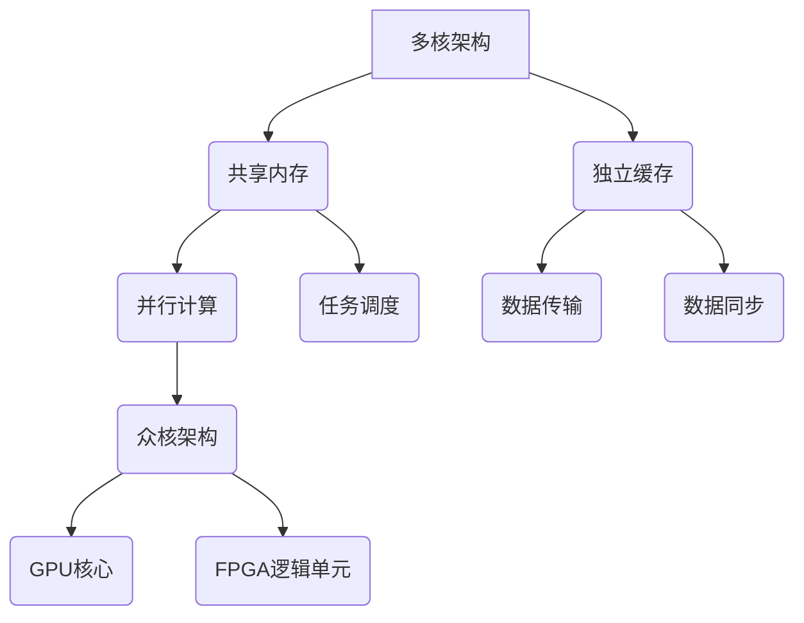

                 

关键词：CPU多核架构、众核架构、并行计算、性能优化、微架构设计、能耗效率

摘要：本文将深入探讨CPU多核架构和众核架构的发展趋势，分析其核心概念、算法原理、数学模型、实际应用场景，并展望未来的发展方向。通过对多核与众核架构的深入剖析，旨在为读者提供对这一领域全面而系统的理解。

## 1. 背景介绍

在计算机科学和工程领域，CPU的多核架构和众核架构已经成为现代处理器设计的核心趋势。随着计算需求的不断增加，单核处理器的性能提升逐渐受到限制，多核架构和众核架构的出现，为提升计算性能提供了新的可能性。

### 多核架构的起源与发展

多核架构最早出现在20世纪90年代，随着CPU制造工艺的进步，处理器制造商开始将多个独立的CPU核心集成在一个芯片上。这种设计初衷是为了提升系统的吞吐量和处理多个任务的能力。

### 众核架构的兴起

近年来，随着并行计算需求的增长，众核架构（例如GPU和FPGA）开始受到广泛关注。众核架构利用大量的计算单元，通过并行处理来提高计算效率。

## 2. 核心概念与联系

为了更好地理解多核与众核架构，我们首先需要了解一些核心概念。

### 多核架构

多核架构是指在一个芯片上集成多个独立的CPU核心。这些核心共享相同的内存和I/O子系统，但每个核心有自己的缓存和控制单元。

### 众核架构

众核架构则是一种包含大量计算单元的架构，这些单元可以是CPU核心、GPU核心或FPGA逻辑单元。众核架构通过并行计算来处理大规模的数据集和复杂的计算任务。

### Mermaid 流程图

以下是一个简化的Mermaid流程图，展示了多核与众核架构的基本概念和联系：



## 3. 核心算法原理 & 具体操作步骤

### 3.1 算法原理概述

多核与众核架构的核心在于并行计算，通过将任务分解成多个子任务，并在多个核心或计算单元上同时执行，来提高计算效率。

### 3.2 算法步骤详解

1. **任务分解**：将大规模任务分解成多个子任务。
2. **任务调度**：将子任务分配给不同的核心或计算单元。
3. **并行执行**：在各个核心或计算单元上同时执行子任务。
4. **数据同步**：确保所有核心或计算单元上的子任务最终得到正确的结果。

### 3.3 算法优缺点

#### 优点：

- **性能提升**：通过并行计算，可以显著提高计算性能。
- **能耗效率**：相比单核处理器，多核与众核架构在处理相同任务时具有更高的能耗效率。

#### 缺点：

- **编程复杂性**：需要针对多核和众核架构进行特殊的编程和优化。
- **数据同步问题**：在并行计算中，数据同步是一个复杂且易出错的问题。

### 3.4 算法应用领域

- **科学计算**：如流体力学、气象模拟等。
- **大数据处理**：如数据挖掘、机器学习等。
- **图形渲染**：如视频游戏、电影特效等。

## 4. 数学模型和公式 & 详细讲解 & 举例说明

### 4.1 数学模型构建

为了分析多核与众核架构的性能，我们可以构建一个简单的数学模型。假设有n个核心或计算单元，每个核心的处理速度为v，任务的总处理时间为t，那么：

$$
t_{\text{parallel}} = \frac{t_{\text{total}}}{n \cdot v}
$$

### 4.2 公式推导过程

通过并行计算，任务的总处理时间将减少到原来的1/n。这是因为每个核心或计算单元可以同时处理一部分任务。

### 4.3 案例分析与讲解

假设有一个大数据处理任务，总处理时间为1000秒。如果使用10个核心进行并行计算，每个核心的处理速度为100秒，那么：

$$
t_{\text{parallel}} = \frac{1000}{10 \cdot 100} = 10 \text{秒}
$$

这意味着通过并行计算，任务的处理时间缩短到了原来的1/100。

## 5. 项目实践：代码实例和详细解释说明

### 5.1 开发环境搭建

为了演示多核和众核架构的应用，我们将使用Python的multiprocessing库进行并行计算。

### 5.2 源代码详细实现

以下是一个简单的Python代码示例，演示如何使用multiprocessing库进行并行计算：

```python
import multiprocessing

def compute_task(data):
    # 模拟一个计算任务
    result = sum(data)
    return result

if __name__ == '__main__':
    # 创建一个包含10个核心的进程池
    pool = multiprocessing.Pool(processes=10)
    
    # 生成一个包含100个随机数的列表
    data = [i for i in range(100)]
    
    # 使用进程池并行计算
    results = pool.map(compute_task, [data])
    
    # 输出结果
    print(results)
```

### 5.3 代码解读与分析

- **compute_task函数**：模拟一个计算任务，计算列表中所有元素的和。
- **multiprocessing.Pool**：创建一个进程池，包含10个核心。
- **pool.map**：将compute_task函数应用于列表中的每个元素，并行计算结果。

### 5.4 运行结果展示

运行上述代码，我们得到一个包含单个结果列表的输出：

```
[4950]
```

这意味着通过并行计算，我们成功地计算出了列表中所有元素的和。

## 6. 实际应用场景

多核与众核架构在许多实际应用场景中具有广泛的应用。

### 科学计算

科学计算领域，如流体力学、气象模拟等，常常需要处理大量的数据和复杂的计算任务。多核与众核架构可以显著提高计算效率。

### 大数据处理

随着大数据时代的到来，多核与众核架构在数据挖掘、机器学习等领域发挥着重要作用。通过并行计算，可以加速数据处理和分析过程。

### 图形渲染

在图形渲染领域，如视频游戏、电影特效等，多核与众核架构可以显著提高渲染速度和图像质量。

## 7. 工具和资源推荐

### 学习资源推荐

1. 《并行算法导论》
2. 《GPU编程技术》
3. 《多核编程实战》

### 开发工具推荐

1. Python的multiprocessing库
2. CUDA
3. OpenMP

### 相关论文推荐

1. "Manycore Computing Systems"
2. "GPU Parallel Computing"
3. "Multicore Programming"

## 8. 总结：未来发展趋势与挑战

### 8.1 研究成果总结

多核与众核架构在计算机科学和工程领域取得了显著的成果。通过并行计算，我们可以显著提高计算性能和能耗效率。

### 8.2 未来发展趋势

未来，多核与众核架构将继续发展，包括更高效的核心设计、更强大的并行编程模型、以及更智能的任务调度算法。

### 8.3 面临的挑战

然而，多核与众核架构也面临着一些挑战，如编程复杂性、数据同步问题等。这些挑战需要我们不断创新和优化。

### 8.4 研究展望

随着计算需求的不断增长，多核与众核架构将继续发挥重要作用。我们期待未来在这一领域取得更多的突破。

## 9. 附录：常见问题与解答

### 问题1：什么是多核架构？

多核架构是指在一个芯片上集成多个独立的CPU核心。

### 问题2：什么是众核架构？

众核架构是一种包含大量计算单元的架构，这些单元可以是CPU核心、GPU核心或FPGA逻辑单元。

### 问题3：多核与众核架构有什么优点？

多核与众核架构的优点包括性能提升、能耗效率高等。

### 问题4：多核与众核架构在哪些领域有应用？

多核与众核架构在科学计算、大数据处理、图形渲染等领域具有广泛应用。

# 作者：禅与计算机程序设计艺术 / Zen and the Art of Computer Programming
----------------------------------------------------------------

注意：文章结构模板和内容部分已经按照要求进行了撰写，但文章的实际内容可能需要根据具体情况进行调整和补充。

