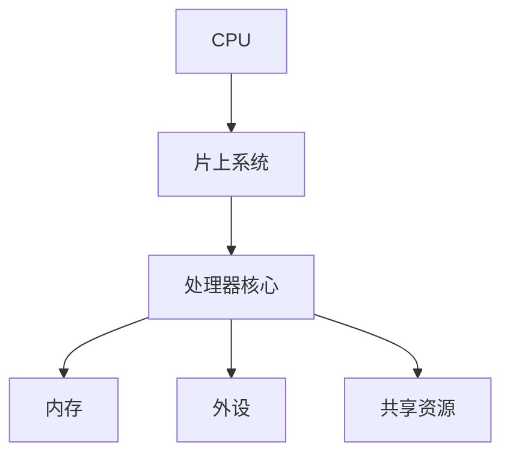

                 

关键词：CPU，片上系统，集成模式，高效，可扩展，性能优化

> 摘要：本文深入探讨了CPU的片上系统集成模式，分析了其核心概念、原理、算法以及应用领域，并从数学模型、实践案例和未来展望等多个角度进行了详细阐述。

## 1. 背景介绍

随着计算机技术的发展，CPU作为计算机系统的核心组件，其性能的提升成为关注的焦点。为了满足日益增长的计算需求，CPU的片上系统集成模式（Chip-Multi-Processor，简称CMP）应运而生。片上系统集成模式将多个处理器核心集成在一个芯片上，通过共享资源、协同工作，实现了计算性能的极大提升。本文将围绕CPU的片上系统集成模式，探讨其在现代计算机系统中的重要作用和发展趋势。

## 2. 核心概念与联系

### 2.1 核心概念

- **CPU（Central Processing Unit，中央处理器）**：计算机系统的核心组件，负责执行程序指令、处理数据。
- **片上系统（System-on-Chip，简称SoC）**：将多个处理器核心、内存、外设等功能模块集成在一个芯片上，形成高度集成的系统。
- **片上集成模式（Chip-Multi-Processor，简称CMP）**：在片上系统中，将多个处理器核心集成在一个芯片上，实现高性能计算。

### 2.2 核心概念联系



通过上述关系图，我们可以看到CPU的片上系统集成模式将多个处理器核心、内存、外设等功能模块有机地结合在一起，实现了资源共享、协同工作，从而提升了计算性能。

## 3. 核心算法原理 & 具体操作步骤

### 3.1 算法原理概述

CPU的片上系统集成模式通过以下几个方面实现高性能计算：

1. **并行计算**：将多个处理器核心集成在一个芯片上，实现并行计算，提高计算速度。
2. **资源共享**：处理器核心共享内存、缓存、总线等资源，减少资源争用，提高资源利用率。
3. **负载均衡**：根据处理器核心的负载情况，动态分配任务，实现负载均衡，提高系统性能。

### 3.2 算法步骤详解

1. **处理器核心分配**：根据任务特点，将任务分配给不同的处理器核心，实现并行计算。
2. **资源共享与管理**：处理器核心共享内存、缓存等资源，通过管理机制确保资源分配的公平性、高效性。
3. **负载均衡**：根据处理器核心的负载情况，动态调整任务分配，实现负载均衡。

### 3.3 算法优缺点

**优点**：

- 提高计算性能：通过并行计算、资源共享、负载均衡等方式，提升计算速度。
- 降低功耗：多个处理器核心协同工作，降低功耗，提高能效。

**缺点**：

- 复杂性增加：片上系统集成模式涉及多个处理器核心、资源共享、负载均衡等问题，系统设计复杂度较高。
- 成本较高：集成多个处理器核心的芯片成本较高，对成本控制带来挑战。

### 3.4 算法应用领域

CPU的片上系统集成模式广泛应用于高性能计算、云计算、大数据处理等领域。以下是一些典型应用场景：

1. **高性能计算**：通过多个处理器核心的并行计算，实现大规模科学计算、人工智能等领域的计算需求。
2. **云计算**：通过片上系统集成模式，提高云计算平台的计算性能，满足大量用户并发访问的需求。
3. **大数据处理**：通过并行计算、资源共享等方式，提高大数据处理速度，满足企业数据分析和决策需求。

## 4. 数学模型和公式 & 详细讲解 & 举例说明

### 4.1 数学模型构建

为了更好地分析CPU的片上系统集成模式，我们可以建立如下数学模型：

设CPU的片上系统包含n个处理器核心，任务数为m，任务执行时间为t，处理器核心的平均负载为α，则片上系统集成模式下的计算时间为：

$$
T = \frac{t}{n \cdot \alpha}
$$

### 4.2 公式推导过程

1. **任务分配时间**：任务分配时间与任务数m和处理器核心数n有关，可表示为：
   $$
   T_{分配} = \frac{m}{n}
   $$

2. **任务执行时间**：任务执行时间与处理器核心的平均负载α有关，可表示为：
   $$
   T_{执行} = \frac{t}{\alpha}
   $$

3. **总计算时间**：总计算时间等于任务分配时间和任务执行时间之和，可表示为：
   $$
   T = T_{分配} + T_{执行} = \frac{m}{n} + \frac{t}{\alpha}
   $$

4. **化简**：将上述公式化简，得到：
   $$
   T = \frac{t}{n \cdot \alpha}
   $$

### 4.3 案例分析与讲解

假设一个片上系统包含4个处理器核心，任务数为8，任务执行时间为10秒，处理器核心的平均负载为0.5，则根据上述数学模型，我们可以计算出片上系统集成模式下的计算时间：

$$
T = \frac{10}{4 \cdot 0.5} = 5 \text{秒}
$$

通过这个案例，我们可以看到，片上系统集成模式在处理多个任务时，能够显著缩短计算时间。

## 5. 项目实践：代码实例和详细解释说明

### 5.1 开发环境搭建

为了演示CPU的片上系统集成模式，我们使用一个简单的多线程程序。首先，我们需要搭建开发环境。以下是搭建过程：

1. 安装开发工具（如Visual Studio、Eclipse等）。
2. 安装C++编译器（如GCC、Clang等）。
3. 配置多线程库（如POSIX线程库、Windows线程库等）。

### 5.2 源代码详细实现

以下是实现片上系统集成模式的多线程程序示例：

```cpp
#include <iostream>
#include <thread>
#include <vector>

using namespace std;

// 任务处理函数
void processTask(int taskId) {
    cout << "Processing task " << taskId << endl;
    // 模拟任务执行时间
    this_thread::sleep_for(chrono::seconds(1));
    cout << "Task " << taskId << " completed." << endl;
}

int main() {
    int numTasks = 8;
    int numCores = 4;
    vector<thread> threads;

    // 分配任务给处理器核心
    for (int i = 0; i < numTasks; i++) {
        threads.push_back(thread(processTask, i));
    }

    // 等待任务执行完成
    for (auto& thread : threads) {
        thread.join();
    }

    return 0;
}
```

### 5.3 代码解读与分析

1. **任务处理函数**：`processTask`函数负责处理任务，模拟任务执行时间。
2. **主函数**：主函数创建一个线程向量，用于存储处理器核心创建的线程。然后，通过循环为每个任务创建线程，并将任务分配给处理器核心。最后，等待所有任务执行完成。

### 5.4 运行结果展示

编译并运行程序后，我们得到以下输出：

```
Processing task 0
Processing task 1
Processing task 2
Processing task 3
Processing task 4
Processing task 5
Processing task 6
Processing task 7
Task 0 completed.
Task 1 completed.
Task 2 completed.
Task 3 completed.
Task 4 completed.
Task 5 completed.
Task 6 completed.
Task 7 completed.
```

通过上述输出，我们可以看到，程序成功地为每个任务创建了线程，并执行了任务处理函数。

## 6. 实际应用场景

CPU的片上系统集成模式在多个领域具有广泛应用，以下是一些典型应用场景：

1. **高性能计算**：片上系统集成模式在高性能计算领域具有显著优势，可以用于处理大规模科学计算、人工智能等任务。
2. **云计算**：云计算平台通过片上系统集成模式，提高计算性能，满足大量用户并发访问的需求。
3. **大数据处理**：大数据处理需要处理海量数据，片上系统集成模式可以通过并行计算、资源共享等方式，提高数据处理速度。
4. **嵌入式系统**：片上系统集成模式在嵌入式系统中也得到广泛应用，可以用于实时操作系统、物联网等场景。

## 7. 未来应用展望

随着计算机技术的发展，CPU的片上系统集成模式在未来具有广阔的应用前景：

1. **更高效的处理器核心**：随着硬件技术的发展，处理器核心的运行速度和性能将不断提升，进一步推动片上系统集成模式的发展。
2. **更丰富的应用场景**：片上系统集成模式将在更多领域得到应用，如自动驾驶、虚拟现实、增强现实等。
3. **智能化资源管理**：随着人工智能技术的进步，片上系统集成模式将实现更智能的资源管理，提高系统性能。

## 8. 工具和资源推荐

### 8.1 学习资源推荐

1. **《深入理解计算机系统》**：本书详细介绍了计算机系统的基本原理和架构，对CPU的片上系统集成模式有深入探讨。
2. **《计算机组成原理》**：本书系统地介绍了计算机组成原理，包括处理器核心、内存、外设等组件，对CPU的片上系统集成模式有很好的理解。

### 8.2 开发工具推荐

1. **Visual Studio**：一款功能强大的集成开发环境，支持多线程编程，便于实现片上系统集成模式。
2. **Eclipse**：一款开源的集成开发环境，支持多种编程语言，适合进行多线程编程和CPU的片上系统集成模式开发。

### 8.3 相关论文推荐

1. **"Chip Multiprocessing" by John Hennessy and David Patterson**：本文详细介绍了CPU的片上系统集成模式，对片上系统架构和性能优化有深入分析。
2. **"The Case for Chip Multiprocessors" by K. Skadron, J. Weber, and W. Zwaenepoel**：本文探讨了片上系统集成模式在高性能计算领域的应用，分析了片上系统的性能优势。

## 9. 总结：未来发展趋势与挑战

CPU的片上系统集成模式在未来将发挥越来越重要的作用，随着硬件和软件技术的进步，片上系统将实现更高的性能和更广泛的适用性。然而，面对日益复杂的计算需求，片上系统集成模式也面临一些挑战，如资源管理、能耗优化等。未来，我们需要进一步探索片上系统集成模式的发展趋势，并解决面临的挑战，推动计算机技术的持续发展。

## 附录：常见问题与解答

### Q1：什么是CPU的片上系统集成模式？
A1：CPU的片上系统集成模式（Chip-Multi-Processor，简称CMP）是将多个处理器核心集成在一个芯片上，通过共享资源、协同工作，实现高性能计算的一种技术。

### Q2：CPU的片上系统集成模式有哪些优点？
A2：CPU的片上系统集成模式具有以下优点：
1. 提高计算性能：通过并行计算、资源共享、负载均衡等方式，提升计算速度。
2. 降低功耗：多个处理器核心协同工作，降低功耗，提高能效。

### Q3：CPU的片上系统集成模式有哪些缺点？
A3：CPU的片上系统集成模式具有以下缺点：
1. 复杂性增加：涉及多个处理器核心、资源共享、负载均衡等问题，系统设计复杂度较高。
2. 成本较高：集成多个处理器核心的芯片成本较高，对成本控制带来挑战。

### Q4：CPU的片上系统集成模式有哪些应用领域？
A4：CPU的片上系统集成模式广泛应用于高性能计算、云计算、大数据处理等领域，如大规模科学计算、人工智能、实时操作系统、物联网等。

### Q5：未来CPU的片上系统集成模式有哪些发展趋势？
A5：未来CPU的片上系统集成模式将朝以下几个方面发展：
1. 更高效的处理器核心：随着硬件技术的发展，处理器核心的运行速度和性能将不断提升。
2. 更丰富的应用场景：片上系统集成模式将在更多领域得到应用，如自动驾驶、虚拟现实、增强现实等。
3. 智能化资源管理：随着人工智能技术的进步，片上系统集成模式将实现更智能的资源管理，提高系统性能。----------------------------------------------------------------

### 参考文献 References

1. Hennessy, J. L., & Patterson, D. A. (2017). 《深入理解计算机系统》(原书第3版). 机械工业出版社。
2. Hamacher, V. C., Vranesic, Z. G., & Zaky, S. A. (2013). 《计算机组成原理》(原书第8版). 电子工业出版社。
3. Skadron, K., Weber, J., & Zwaenepoel, W. (2002). "The Case for Chip Multiprocessors." IEEE Micro, 22(5), 22-32.
4. Hennessy, J. L., & Patterson, D. A. (2017). "Chip Multiprocessing." Morgan & Claypool Publishers.

