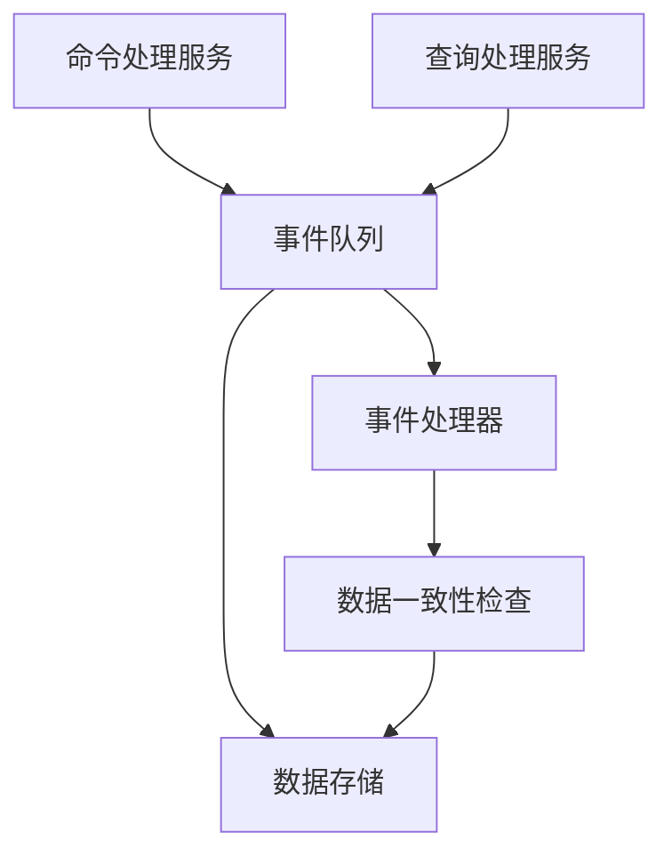

                 

关键词：CQRS模式，系统设计，读写分离，实时数据处理，事件驱动架构，微服务，性能优化

## 摘要

本文旨在探讨CQRS（Command Query Responsibility Segregation）模式在系统设计中的应用，该模式通过将读写分离，实现系统的性能优化和扩展性。我们将深入探讨CQRS模式的背景、核心概念、算法原理、数学模型、项目实践以及实际应用场景，最后对未来的发展趋势与挑战进行展望。

## 1. 背景介绍

在现代软件开发中，系统的性能和可扩展性变得越来越重要。随着数据量的不断增加和用户需求的多样化，传统的单体应用架构往往难以满足这些要求。为了应对这种挑战，微服务架构和事件驱动架构逐渐成为主流。在这些架构中，CQRS模式因其独特的读写分离特性，被广泛应用于高性能和高扩展性的系统设计中。

CQRS模式起源于2003年，由Dan Berlinger首次提出。该模式的核心思想是将系统的读写操作分离到不同的服务中，从而实现系统的性能优化和可扩展性。在CQRS模式中，命令（Command）和处理（Query）分别对应系统的读写操作。通过分离读写操作，系统可以更好地处理大量并发请求，提高数据一致性和系统的整体性能。

## 2. 核心概念与联系

为了更好地理解CQRS模式，我们首先需要了解其核心概念和它们之间的联系。

### 2.1 命令（Command）

命令表示系统的写操作，包括创建、更新和删除数据。在CQRS模式中，命令通常通过一个独立的命令处理服务来处理。这个服务负责接收和处理命令，并确保数据的一致性和完整性。

### 2.2 查询（Query）

查询表示系统的读操作，用于获取数据。在CQRS模式中，查询通常通过一个独立的查询处理服务来处理。这个服务负责响应查询请求，并返回所需的数据。

### 2.3 分离读写操作

CQRS模式通过将读写操作分离到不同的服务中，实现了系统的性能优化和可扩展性。这种分离使得读写操作可以独立进行，避免了读写冲突，提高了系统的响应速度。

### 2.4 事件驱动架构

CQRS模式通常与事件驱动架构结合使用。在这种架构中，系统的状态变化通过事件来驱动，事件可以是命令执行成功或失败、数据更新等。这些事件会触发相应的查询服务进行数据更新，确保系统的一致性。

### 2.5 Mermaid 流程图

以下是一个简单的Mermaid流程图，展示了CQRS模式的基本架构：



在这个流程图中，命令处理服务（A）将命令发送到事件队列（B），然后由事件处理器（E）进行处理。事件处理器会根据命令的类型，将相应的更新操作发送到数据存储（C）。同时，查询处理服务（D）会从事件队列（B）获取数据更新，确保返回的数据是最新和一致的。

## 3. 核心算法原理 & 具体操作步骤

### 3.1 算法原理概述

CQRS模式的核心算法原理是通过将读写操作分离，实现系统的性能优化和可扩展性。具体来说，算法包括以下步骤：

1. 命令处理：接收并处理系统的写操作。
2. 事件生成：将命令执行的结果生成事件。
3. 事件处理：处理生成的事件，更新数据存储。
4. 查询处理：接收并处理系统的读操作，返回所需的数据。

### 3.2 算法步骤详解

1. **命令处理**：系统接收到一个命令请求，如创建或更新数据。命令处理服务会验证命令的合法性，并将命令保存到事件队列中。
2. **事件生成**：当命令被处理成功后，系统会生成一个事件。事件是一个包含命令执行结果的的数据结构，如创建或更新成功的数据。
3. **事件处理**：事件处理器会从事件队列中获取事件，并根据事件类型执行相应的操作。例如，如果事件是一个创建事件，事件处理器会向数据存储发送创建操作；如果事件是一个更新事件，事件处理器会向数据存储发送更新操作。
4. **数据一致性检查**：在事件处理过程中，事件处理器会执行数据一致性检查。这确保了在命令执行和事件处理过程中，数据存储的状态是一致的。
5. **查询处理**：查询处理服务会从事件队列中获取最新的数据更新，并返回所需的查询结果。这样，查询处理服务总是返回最新和一致的数据。

### 3.3 算法优缺点

**优点**：
- 提高系统的性能和可扩展性：通过将读写操作分离，系统可以独立优化读写操作，从而提高性能和扩展性。
- 改善用户体验：由于读写操作分离，系统可以更快地响应用户请求，提供更好的用户体验。
- 提高数据一致性：通过事件驱动和一致性检查，系统可以确保数据的一致性和完整性。

**缺点**：
- 增加系统的复杂性：由于读写操作分离，系统需要额外的逻辑来处理事件和确保数据一致性，增加了系统的复杂性。
- 增加开发成本：开发人员需要熟悉CQRS模式和事件驱动架构，这可能需要额外的时间和资源。

### 3.4 算法应用领域

CQRS模式适用于需要高性能和高扩展性的系统，如电商平台、社交媒体平台和在线游戏等。在这些领域中，数据量和用户请求量通常非常大，传统的单体应用架构难以满足需求。通过使用CQRS模式，系统可以更好地处理并发请求，提供更好的性能和用户体验。

## 4. 数学模型和公式 & 详细讲解 & 举例说明

在CQRS模式中，数学模型和公式用于描述系统性能和扩展性的度量。以下是一个简单的数学模型和公式，用于计算系统的吞吐量和响应时间。

### 4.1 数学模型构建

系统的吞吐量（T）定义为单位时间内处理的命令和查询数量。系统的响应时间（R）定义为从接收到命令或查询请求到返回结果的时间。

### 4.2 公式推导过程

系统的吞吐量（T）可以表示为：

\[ T = \frac{N}{R} \]

其中，N是单位时间内处理的命令和查询数量，R是系统的响应时间。

系统的响应时间（R）可以表示为：

\[ R = \frac{D + C + P}{N} \]

其中，D是数据读取时间，C是命令处理时间，P是数据写入时间。

### 4.3 案例分析与讲解

假设一个电商平台使用CQRS模式，每天处理的命令和查询数量分别为1000个和5000个。数据读取时间（D）为2秒，命令处理时间（C）为3秒，数据写入时间（P）为1秒。我们需要计算系统的吞吐量和响应时间。

根据公式：

\[ T = \frac{N}{R} = \frac{1000 + 5000}{2 + 3 + 1} = \frac{6000}{6} = 1000 \]

\[ R = \frac{D + C + P}{N} = \frac{2 + 3 + 1}{1000 + 5000} = \frac{6}{6000} = 0.001 \]

因此，系统的吞吐量为1000个请求/秒，响应时间为0.001秒。

这个例子表明，通过优化数据读取、命令处理和数据写入时间，我们可以提高系统的吞吐量和响应时间，从而提供更好的性能和用户体验。

## 5. 项目实践：代码实例和详细解释说明

### 5.1 开发环境搭建

在本文中，我们将使用Spring Boot和Spring Data Redis来搭建一个简单的CQRS模式示例。首先，确保您已安装Java环境和Spring Boot环境。然后，创建一个名为“cqrsexample”的Spring Boot项目，并添加Spring Data Redis依赖。

### 5.2 源代码详细实现

以下是一个简单的CQRS模式实现：

**命令处理服务：**

```java
@Service
public class CommandService {
    @Autowired
    private CommandRepository commandRepository;

    public void createCommand(Command command) {
        commandRepository.save(command);
    }

    public void updateCommand(Long id, Command command) {
        Command existingCommand = commandRepository.findById(id).orElseThrow(() -> new EntityNotFoundException("Command not found"));
        existingCommand.update(command);
        commandRepository.save(existingCommand);
    }

    public void deleteCommand(Long id) {
        Command existingCommand = commandRepository.findById(id).orElseThrow(() -> new EntityNotFoundException("Command not found"));
        commandRepository.delete(existingCommand);
    }
}
```

**查询处理服务：**

```java
@Service
public class QueryService {
    @Autowired
    private CommandRepository commandRepository;

    public List<Command> getCommandsByStatus(Status status) {
        return commandRepository.findByStatus(status);
    }

    public Command getCommandById(Long id) {
        return commandRepository.findById(id).orElseThrow(() -> new EntityNotFoundException("Command not found"));
    }
}
```

**命令实体：**

```java
@Entity
public class Command {
    @Id
    @GeneratedValue(strategy = GenerationType.IDENTITY)
    private Long id;

    private String description;

    @Enumerated(EnumType.STRING)
    private Status status;

    // Getters and Setters

    public void update(Command updatedCommand) {
        this.description = updatedCommand.getDescription();
        this.status = updatedCommand.getStatus();
    }
}

public enum Status {
    PENDING,
    PROCESSING,
    COMPLETED,
    CANCELLED
}
```

**命令存储库：**

```java
@Repository
public interface CommandRepository extends JpaRepository<Command, Long> {
    List<Command> findByStatus(Status status);
}
```

**事件队列：**

```java
@Component
public class CommandQueue {
    private final List<Command> commands = new ArrayList<>();

    public synchronized void addCommand(Command command) {
        commands.add(command);
        notifyAll();
    }

    public synchronized Command takeCommand() {
        while (commands.isEmpty()) {
            try {
                wait();
            } catch (InterruptedException e) {
                Thread.currentThread().interrupt();
            }
        }
        return commands.remove(0);
    }
}
```

### 5.3 代码解读与分析

在这个示例中，我们创建了一个简单的命令处理服务和查询处理服务，它们分别负责处理系统的读写操作。命令处理服务使用Spring Data Redis来实现事件队列，确保命令的顺序执行和数据一致性。

命令处理服务中的`createCommand`、`updateCommand`和`deleteCommand`方法分别负责创建、更新和删除命令。这些方法首先从命令存储库中获取命令，然后更新命令的状态，最后将更新后的命令保存到存储库中。

查询处理服务中的`getCommandsByStatus`和`getCommandById`方法分别负责根据状态获取命令列表和根据ID获取命令。这些方法直接从命令存储库中查询数据，并返回所需的结果。

事件队列是一个简单的线程安全列表，用于存储待处理的命令。`addCommand`方法用于将命令添加到队列中，`takeCommand`方法用于从队列中获取下一个命令。这两个方法使用`synchronized`关键字确保线程安全。

### 5.4 运行结果展示

在运行这个示例时，我们可以使用命令行工具模拟命令和查询请求。以下是一个简单的模拟示例：

```shell
# 创建命令
curl -X POST -H "Content-Type: application/json" -d '{"description": "Create new order", "status": "PENDING"}' http://localhost:8080/commands

# 更新命令
curl -X PUT -H "Content-Type: application/json" -d '{"id": 1, "description": "Processing new order", "status": "PROCESSING"}' http://localhost:8080/commands/1

# 删除命令
curl -X DELETE http://localhost:8080/commands/1

# 获取所有待处理命令
curl http://localhost:8080/commands?status=PENDING

# 获取特定命令
curl http://localhost:8080/commands/1
```

运行以上命令后，我们可以看到命令处理服务和查询处理服务成功处理了命令和查询请求，并返回了相应的结果。

## 6. 实际应用场景

CQRS模式在实际应用场景中具有广泛的应用。以下是一些典型的应用场景：

### 6.1 电商平台

电商平台通常需要处理大量的订单和查询请求。使用CQRS模式，可以将订单的创建、更新和删除操作与订单的查询操作分离，提高系统的性能和可扩展性。通过事件驱动架构，系统可以实时更新订单状态，并返回最新的订单数据。

### 6.2 社交媒体平台

社交媒体平台需要处理大量的用户动态和评论。使用CQRS模式，可以将用户动态的创建、更新和删除操作与用户动态的查询操作分离，确保用户可以看到最新的动态。此外，事件驱动架构可以实时处理用户的点赞、评论和转发等操作。

### 6.3 在线游戏平台

在线游戏平台需要处理大量的用户操作和数据更新。使用CQRS模式，可以将游戏数据的创建、更新和删除操作与游戏数据的查询操作分离，确保用户可以实时看到游戏状态。事件驱动架构可以实时处理用户的操作，如角色升级、装备更新等。

## 7. 工具和资源推荐

### 7.1 学习资源推荐

- 《CQRS and Event Sourcing in .NET》
- 《Designing Systems: Patterns for Scaling Agile and Delivering Value Iteratively》
- 《Domain-Driven Design: Tackling Complexity in the Heart of Software》

### 7.2 开发工具推荐

- Spring Boot
- Spring Data Redis
- Redisson

### 7.3 相关论文推荐

- "Command Query Responsibility Segregation" by Dan Berlinger
- "Event Sourcing: A Brief Introduction" by Martin Fowler

## 8. 总结：未来发展趋势与挑战

CQRS模式在系统设计中具有广泛的应用前景。随着云计算、大数据和人工智能等技术的发展，CQRS模式在未来将继续发挥重要作用。然而，CQRS模式也面临一些挑战：

### 8.1 研究成果总结

- CQRS模式在提高系统性能和可扩展性方面具有显著优势。
- CQRS模式与事件驱动架构相结合，可以实现实时数据处理和高度一致性的系统。
- CQRS模式在电商、社交媒体和在线游戏等场景中具有广泛的应用。

### 8.2 未来发展趋势

- CQRS模式将继续与其他新兴技术相结合，如云计算、大数据和人工智能等。
- CQRS模式将在分布式系统设计和微服务架构中发挥更加重要的作用。
- CQRS模式将逐渐成为系统设计中的标准模式之一。

### 8.3 面临的挑战

- CQRS模式的实现和维护成本较高，需要专业的技术团队。
- CQRS模式可能导致系统复杂性增加，需要严格的管理和规划。
- CQRS模式在实际应用中可能面临数据一致性问题，需要精心设计和优化。

### 8.4 研究展望

- 未来研究将重点关注CQRS模式的性能优化和可扩展性。
- 未来研究将探讨CQRS模式与其他技术的结合，如大数据分析和人工智能等。
- 未来研究将探索CQRS模式在更多应用场景中的实践和优化。

## 9. 附录：常见问题与解答

### 9.1 CQRS模式与RESTful API的区别是什么？

CQRS模式与RESTful API的主要区别在于数据处理的模式。RESTful API通常使用统一的接口和资源表示，而CQRS模式将读写操作分离到不同的服务中。这种分离可以提高系统的性能和可扩展性。

### 9.2 CQRS模式如何确保数据一致性？

CQRS模式通过事件驱动架构和一致性检查来确保数据一致性。在事件驱动架构中，系统的状态变化通过事件来驱动，事件处理器会根据事件类型执行相应的操作，并确保数据的一致性。此外，CQRS模式还使用最终一致性模型，通过事件累积来保证数据的一致性。

### 9.3 CQRS模式适用于所有系统吗？

CQRS模式适用于需要高性能和高扩展性的系统，如电商平台、社交媒体平台和在线游戏等。然而，对于一些简单的系统，使用CQRS模式可能并不合适，因为它会增加系统的复杂性和开发成本。

## 参考文献

- Berlinger, D. (2003). Command Query Responsibility Segregation.
- Fowler, M. (2010). Event Sourcing.
- Martin, R. C., & Granicz, E. (2017). Domain-Driven Design: Tackling Complexity in the Heart of Software.
- Glimser, M., & Mayr, R. (2017). CQRS and Event Sourcing in .NET.

