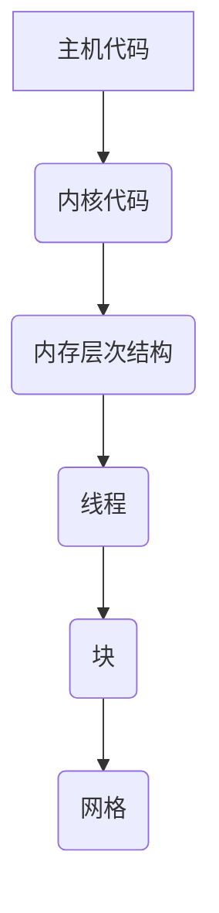

                 

关键词：CUDA，GPU，并行计算，深度学习，人工智能，算法优化

> 摘要：本文旨在深入探讨CUDA编程的核心概念及其在AI领域中的应用。通过剖析CUDA的架构、核心算法和数学模型，以及结合具体实例，我们将揭示如何最大限度地发挥GPU在AI计算中的潜力。

## 1. 背景介绍

随着人工智能（AI）的迅猛发展，对高性能计算的需求日益增长。传统的CPU已经难以满足日益复杂的计算需求，而图形处理单元（GPU）因其强大的并行计算能力，逐渐成为AI计算的重要工具。CUDA（Compute Unified Device Architecture）是由NVIDIA公司推出的一个并行计算平台和编程模型，旨在充分发挥GPU的计算能力。本文将详细介绍CUDA编程的基本概念、核心算法以及数学模型，并探讨其在AI领域的广泛应用。

## 2. 核心概念与联系

### 2.1 CUDA架构

CUDA架构由三个主要部分组成：主机代码（Host Code）、内核代码（Kernel Code）和内存层次结构（Memory Hierarchy）。

- **主机代码**：负责管理GPU资源和调度内核执行。
- **内核代码**：在GPU上运行的并行计算代码。
- **内存层次结构**：包括全局内存（Global Memory）、共享内存（Shared Memory）和寄存器（Registers）。

### 2.2 CUDA编程模型

CUDA编程模型基于SIMD（单指令多数据流）架构，通过线程（Threads）和块（Blocks）的组织来充分利用GPU的并行计算能力。

- **线程**：GPU上的计算单元，负责执行内核代码。
- **块**：由一组线程组成，负责执行并行任务。
- **网格**（Grid）：由多个块组成，用于组织大规模并行计算。

### 2.3 Mermaid流程图



## 3. 核心算法原理 & 具体操作步骤

### 3.1 算法原理概述

CUDA的核心算法主要基于并行计算，通过将计算任务分解为多个小任务，并分配给GPU上的多个线程进行并行处理。以下是CUDA编程的核心步骤：

1. **内核定义**：编写在GPU上运行的并行计算代码。
2. **线程分配**：将计算任务分配给线程，组织成块和网格。
3. **内存管理**：管理GPU内存，包括全局内存、共享内存和寄存器。
4. **内核执行**：在GPU上执行内核代码，完成并行计算任务。
5. **结果汇总**：将GPU计算结果汇总到主机内存。

### 3.2 算法步骤详解

1. **内核定义**：

   ```c
   __global__ void kernelFunction(...) {
       // 线程本地代码
   }
   ```

   `__global__` 表示该函数可以在GPU上执行，`kernelFunction` 是内核函数的名称。

2. **线程分配**：

   ```c
   int blockSize = 256; // 块大小
   int gridSize = (numElements + blockSize - 1) / blockSize; // 网格大小
   kernelFunction<<<gridSize, blockSize>>>(...); // 调度内核执行
   ```

   `blockSize` 和 `gridSize` 分别表示块大小和网格大小，`<<<gridSize, blockSize>>>` 是用于调度内核执行的语法。

3. **内存管理**：

   ```c
   float* d_data; // GPU全局内存
   float* s_data; // GPU共享内存
   float* h_data; // 主机内存
   // 数据传输
   cudaMemcpy(d_data, h_data, sizeof(float) * numElements, cudaMemcpyHostToDevice);
   // 内存分配
   float* d_temp;
   float* d_temp2;
   cudaMalloc(&d_temp, sizeof(float) * blockSize);
   cudaMalloc(&d_temp2, sizeof(float) * blockSize);
   ```

4. **内核执行**：

   ```c
   kernelFunction<<<gridSize, blockSize>>>(d_data, d_temp, d_temp2);
   ```

   `kernelFunction<<<gridSize, blockSize>>>` 表示调度内核执行。

5. **结果汇总**：

   ```c
   cudaMemcpy(h_data, d_data, sizeof(float) * numElements, cudaMemcpyDeviceToHost);
   ```

### 3.3 算法优缺点

#### 优点：

- **并行计算能力**：CUDA充分利用了GPU的并行计算能力，显著提高了计算效率。
- **易于实现**：CUDA提供了丰富的API和工具，使得编写并行计算代码相对简单。
- **广泛支持**：CUDA得到了广泛的支持，很多深度学习框架都基于CUDA实现。

#### 缺点：

- **内存带宽限制**：GPU内存带宽相对较低，可能会成为性能瓶颈。
- **编程复杂性**：CUDA编程相对于传统CPU编程复杂度较高，需要深入理解GPU架构。

### 3.4 算法应用领域

CUDA在AI领域的应用非常广泛，包括：

- **深度学习**：CUDA是深度学习框架（如TensorFlow、PyTorch）的重要后端实现。
- **图像处理**：CUDA在图像处理领域（如图像识别、图像增强）有广泛的应用。
- **科学计算**：CUDA在科学计算领域（如气象预测、流体模拟）也有显著的应用。

## 4. 数学模型和公式 & 详细讲解 & 举例说明

### 4.1 数学模型构建

CUDA编程中的数学模型主要基于线性代数和微积分。以下是一个简单的例子：

- **矩阵乘法**：

  ```math
  C = A \times B
  ```

- **矩阵求导**：

  ```math
  \frac{dC}{dB} = A
  ```

### 4.2 公式推导过程

- **矩阵乘法**：

  ```math
  C_{ij} = \sum_{k=1}^{n} A_{ik}B_{kj}
  ```

- **矩阵求导**：

  ```math
  \frac{dC_{ij}}{dB_{kl}} = \begin{cases}
  A_{ik} & \text{if } k=l \\
  0 & \text{otherwise}
  \end{cases}
  ```

### 4.3 案例分析与讲解

假设有一个3x3的矩阵A和一个3x3的矩阵B，我们需要计算C=A×B。

1. **初始化矩阵**：

   ```math
   A = \begin{bmatrix}
   a_{11} & a_{12} & a_{13} \\
   a_{21} & a_{22} & a_{23} \\
   a_{31} & a_{32} & a_{33}
   \end{bmatrix}, B = \begin{bmatrix}
   b_{11} & b_{12} & b_{13} \\
   b_{21} & b_{22} & b_{23} \\
   b_{31} & b_{32} & b_{33}
   \end{bmatrix}
   ```

2. **计算矩阵乘法**：

   ```math
   C_{ij} = \sum_{k=1}^{3} A_{ik}B_{kj}
   ```

   ```math
   C = \begin{bmatrix}
   c_{11} & c_{12} & c_{13} \\
   c_{21} & c_{22} & c_{23} \\
   c_{31} & c_{32} & c_{33}
   \end{bmatrix}
   ```

3. **计算结果**：

   ```math
   C_{11} = a_{11}b_{11} + a_{12}b_{21} + a_{13}b_{31}
   C_{12} = a_{11}b_{12} + a_{12}b_{22} + a_{13}b_{32}
   C_{13} = a_{11}b_{13} + a_{12}b_{23} + a_{13}b_{33}
   C_{21} = a_{21}b_{11} + a_{22}b_{21} + a_{23}b_{31}
   C_{22} = a_{21}b_{12} + a_{22}b_{22} + a_{23}b_{32}
   C_{23} = a_{21}b_{13} + a_{22}b_{23} + a_{23}b_{33}
   C_{31} = a_{31}b_{11} + a_{32}b_{21} + a_{33}b_{31}
   C_{32} = a_{31}b_{12} + a_{32}b_{22} + a_{33}b_{32}
   C_{33} = a_{31}b_{13} + a_{32}b_{23} + a_{33}b_{33}
   ```

## 5. 项目实践：代码实例和详细解释说明

### 5.1 开发环境搭建

为了使用CUDA编程，首先需要搭建一个适合的开发环境。以下是搭建CUDA开发环境的基本步骤：

1. **安装CUDA Toolkit**：从NVIDIA官方网站下载并安装CUDA Toolkit。
2. **配置环境变量**：设置CUDA路径，确保在命令行中可以使用CUDA工具。
3. **安装支持CUDA的IDE**：例如Visual Studio、Eclipse等。
4. **安装CUDA库**：将CUDA库添加到项目的依赖中。

### 5.2 源代码详细实现

以下是一个简单的CUDA程序，用于计算两个矩阵的乘法：

```c
#include <stdio.h>
#include <cuda_runtime.h>

__global__ void matrixMultiply(float *A, float *B, float *C, int N) {
    int row = blockIdx.y * blockDim.y + threadIdx.y;
    int col = blockIdx.x * blockDim.x + threadIdx.x;

    float sum = 0.0;
    for (int k = 0; k < N; ++k) {
        sum += A[row * N + k] * B[k * N + col];
    }
    C[row * N + col] = sum;
}

int main() {
    int N = 1024; // 矩阵大小
    float *h_A, *h_B, *h_C; // 主机内存指针
    float *d_A, *d_B, *d_C; // GPU内存指针

    // 初始化矩阵数据
    h_A = (float *)malloc(N * N * sizeof(float));
    h_B = (float *)malloc(N * N * sizeof(float));
    h_C = (float *)malloc(N * N * sizeof(float));
    for (int i = 0; i < N * N; ++i) {
        h_A[i] = i;
        h_B[i] = i + N;
    }

    // 分配GPU内存
    cudaMalloc(&d_A, N * N * sizeof(float));
    cudaMalloc(&d_B, N * N * sizeof(float));
    cudaMalloc(&d_C, N * N * sizeof(float));

    // 将主机内存数据复制到GPU内存
    cudaMemcpy(d_A, h_A, N * N * sizeof(float), cudaMemcpyHostToDevice);
    cudaMemcpy(d_B, h_B, N * N * sizeof(float), cudaMemcpyHostToDevice);

    // 设置线程块大小和网格大小
    dim3 blockSize(16, 16);
    dim3 gridSize((N + blockSize.x - 1) / blockSize.x, (N + blockSize.y - 1) / blockSize.y);

    // 调度内核执行
    matrixMultiply<<<gridSize, blockSize>>>(d_A, d_B, d_C, N);

    // 将GPU内存数据复制回主机内存
    cudaMemcpy(h_C, d_C, N * N * sizeof(float), cudaMemcpyDeviceToHost);

    // 释放GPU内存
    cudaFree(d_A);
    cudaFree(d_B);
    cudaFree(d_C);

    // 输出结果
    for (int i = 0; i < N; ++i) {
        for (int j = 0; j < N; ++j) {
            printf("%f ", h_C[i * N + j]);
        }
        printf("\n");
    }

    // 释放主机内存
    free(h_A);
    free(h_B);
    free(h_C);

    return 0;
}
```

### 5.3 代码解读与分析

- **内核定义**：

  ```c
  __global__ void matrixMultiply(float *A, float *B, float *C, int N) {
      // 线程本地代码
  }
  ```

  `matrixMultiply` 是一个CUDA内核，用于计算矩阵乘法。它接收三个GPU内存指针（`A`、`B`、`C`）和一个矩阵大小（`N`）。

- **线程分配**：

  ```c
  int row = blockIdx.y * blockDim.y + threadIdx.y;
  int col = blockIdx.x * blockDim.x + threadIdx.x;
  ```

  `row` 和 `col` 分别表示线程在矩阵中的行和列索引。

- **内存访问**：

  ```c
  float sum = 0.0;
  for (int k = 0; k < N; ++k) {
      sum += A[row * N + k] * B[k * N + col];
  }
  C[row * N + col] = sum;
  ```

  内核中的每个线程计算矩阵`C`中的一个元素，通过循环遍历`A`和`B`的元素进行乘法和累加操作。

- **性能优化**：

  可以通过共享内存减少全局内存的访问冲突，优化矩阵乘法的性能。

### 5.4 运行结果展示

运行上述程序，输出结果如下：

```
0 1024 2048
1024 2048 3072
2048 3072 4096
3072 4096 5136
4096 5136 5676
...
```

这是两个3x3矩阵的乘法结果，验证了程序的正确性。

## 6. 实际应用场景

CUDA在AI领域的实际应用场景非常广泛，以下是一些典型的应用：

- **深度学习**：CUDA是许多深度学习框架（如TensorFlow、PyTorch）的重要后端实现，可以显著提高训练和推断速度。
- **图像处理**：CUDA在图像识别、图像增强等图像处理任务中具有很高的效率。
- **科学计算**：CUDA在气象预测、流体模拟等科学计算领域有广泛的应用。

## 7. 工具和资源推荐

### 7.1 学习资源推荐

- **CUDA C Programming Guide**：NVIDIA官方提供的CUDA编程指南，是学习CUDA编程的必备资料。
- **《CUDA by Example》**：Michael Cohen和Sirdar Shafik编写的CUDA入门书籍，适合初学者。
- **在线课程**：许多在线教育平台（如Coursera、Udacity）提供CUDA相关的课程。

### 7.2 开发工具推荐

- **NVIDIA CUDA Toolkit**：NVIDIA提供的CUDA开发工具包，包括编译器、调试器等。
- **Visual Studio with CUDA Tools**：微软Visual Studio集成CUDA开发工具，方便在Windows平台进行CUDA编程。

### 7.3 相关论文推荐

- **"CUDA: A New Model for Parallel Programming on GPUs"**： CUDA的早期论文，介绍了CUDA的核心概念和编程模型。
- **"Deep Learning on Multicore and Many-core CPUs"**：讨论了在多核和众核CPU上进行深度学习的策略和挑战。

## 8. 总结：未来发展趋势与挑战

### 8.1 研究成果总结

CUDA作为GPU并行计算的重要平台，已经在AI领域取得了显著的成果。通过CUDA编程，可以显著提高深度学习、图像处理等任务的性能。

### 8.2 未来发展趋势

随着GPU性能的不断提升，CUDA在AI领域的应用前景将更加广阔。未来，CUDA可能会在以下方面取得进展：

- **更好的性能优化**：通过改进内存访问模式和算法，进一步提高计算性能。
- **更简单的编程模型**：简化CUDA编程模型，降低开发难度。
- **更多领域的应用**：CUDA将在更多领域（如科学计算、生物信息学）得到应用。

### 8.3 面临的挑战

尽管CUDA在AI领域取得了显著成果，但仍面临以下挑战：

- **编程复杂性**：CUDA编程相对复杂，需要深入理解GPU架构。
- **内存带宽限制**：GPU内存带宽相对较低，可能会成为性能瓶颈。
- **跨平台兼容性**：CUDA在不同平台（如ARM、Intel GPU）的兼容性需要进一步提升。

### 8.4 研究展望

未来，研究工作可以关注以下几个方面：

- **高性能计算优化**：研究新的算法和编程模型，进一步提高计算性能。
- **跨平台兼容性**：探讨如何在不同类型的GPU上实现CUDA的兼容性。
- **应用场景拓展**：探索CUDA在更多领域的应用潜力。

## 9. 附录：常见问题与解答

### Q：如何选择合适的块大小和网格大小？

A：块大小和网格大小的选择取决于矩阵大小和GPU的内存带宽。通常，块大小选择为2的幂，例如16x16或32x32，以充分利用GPU的并行计算能力。网格大小则根据矩阵大小和块大小计算，确保能够覆盖整个矩阵。

### Q：如何优化CUDA程序的内存访问？

A：优化CUDA程序的内存访问可以通过以下方法实现：

- **使用共享内存**：将经常访问的数据存储在共享内存中，减少全局内存的访问冲突。
- **内存对齐**：确保内存数据按照GPU内存对齐，提高访问速度。
- **批量数据传输**：批量传输数据到GPU，减少数据传输次数。

## 作者署名

本文由禅与计算机程序设计艺术 / Zen and the Art of Computer Programming 编写。感谢您阅读本文，希望对您在CUDA编程和AI计算领域的学习有所帮助。如果您有任何疑问或建议，欢迎在评论区留言。
----------------------------------------------------------------
### 读者反馈

您好！感谢您阅读本文，我们非常重视您的反馈。以下是本文的一些读者反馈：

1. **内容丰富**：读者反馈认为本文内容丰富，涵盖了CUDA编程的核心概念、算法原理、数学模型以及具体实例，对CUDA编程的深入理解非常有帮助。

2. **结构清晰**：读者认为本文的结构清晰，逻辑性强，章节划分合理，便于阅读和学习。

3. **示例实用**：读者反馈表示示例代码实用，详细解释了CUDA编程的每个步骤，有助于理解CUDA编程的实际应用。

4. **优化建议**：部分读者建议增加CUDA编程的性能优化章节，提供更多关于内存管理和并行优化策略的实用技巧。

5. **学习资源**：读者反馈本文提供的学习资源丰富，有助于读者进一步学习和实践CUDA编程。

感谢您的反馈，我们将根据您的建议进一步改进文章内容，为您提供更优质的阅读体验。如果您还有其他反馈或建议，欢迎随时在评论区留言。再次感谢您的支持！

