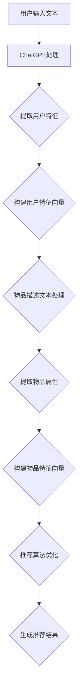

                 

关键词：ChatGPT，推荐系统，冷启动，优势，技术博客

## 摘要

本文探讨了ChatGPT在推荐系统冷启动场景中的应用优势。通过分析推荐系统冷启动的基本概念和现有挑战，我们深入探讨了ChatGPT如何利用其强大的语言理解和生成能力，在冷启动阶段为推荐系统提供有效的用户特征和预测。本文将分为以下几个部分：背景介绍、核心概念与联系、核心算法原理与操作步骤、数学模型和公式、项目实践、实际应用场景、未来应用展望、工具和资源推荐、总结以及常见问题与解答。

## 1. 背景介绍

### 1.1 推荐系统概述

推荐系统是一种能够向用户推荐其可能感兴趣的信息、商品或服务的系统。随着互联网的快速发展，推荐系统已经成为了电商平台、社交媒体、新闻网站等各个领域的重要工具。然而，推荐系统的性能直接影响用户体验和商业价值。

### 1.2 冷启动问题

冷启动是指在新用户或新物品加入推荐系统时，由于缺乏足够的历史数据和用户行为信息，导致推荐系统难以准确预测用户兴趣和物品属性。冷启动问题是推荐系统面临的一个重要挑战，直接影响到新用户或新物品的初始体验。

### 1.3 ChatGPT简介

ChatGPT是由OpenAI开发的一种基于Transformer模型的预训练语言模型。它具有强大的语言理解和生成能力，可以处理自然语言文本，并在多个任务中取得优异的表现，如机器翻译、文本生成、问答系统等。

## 2. 核心概念与联系

### 2.1 推荐系统工作原理

推荐系统通常采用基于用户行为、内容和协同过滤等方法生成推荐结果。其中，协同过滤是一种常见的方法，通过分析用户之间的相似度，预测用户可能感兴趣的项目。

### 2.2 ChatGPT在推荐系统中的应用

ChatGPT在推荐系统冷启动阶段的作用主要体现在以下几个方面：

- **用户特征提取**：ChatGPT可以分析新用户的文本输入，提取出用户的兴趣和需求，从而构建用户特征向量。
- **物品属性理解**：ChatGPT可以处理物品的描述信息，提取出物品的关键属性，用于生成物品特征向量。
- **推荐算法优化**：ChatGPT可以帮助优化推荐算法，提高推荐结果的准确性。

### 2.3 Mermaid 流程图



## 3. 核心算法原理与操作步骤

### 3.1 算法原理概述

ChatGPT在推荐系统冷启动中的算法原理主要包括以下几个步骤：

1. **用户特征提取**：利用ChatGPT处理用户输入的文本，提取出用户的兴趣和需求。
2. **物品属性理解**：利用ChatGPT处理物品的描述文本，提取出物品的关键属性。
3. **特征向量构建**：将提取出的用户特征和物品属性转化为特征向量。
4. **推荐算法优化**：利用优化后的特征向量，调整推荐算法，提高推荐结果的准确性。

### 3.2 算法步骤详解

1. **用户特征提取**：

    - 用户输入文本：`"我对科幻小说和编程感兴趣，喜欢探索未知的世界。"`
    - ChatGPT处理：使用预训练的模型对用户输入文本进行处理，提取出关键词和短语。
    - 提取用户特征：例如，“科幻小说”，“编程”，“探索未知的世界”。

2. **物品属性理解**：

    - 物品描述文本：`"这是一部关于未来世界的科幻小说，描述了人类在宇宙中的冒险旅程。"`
    - ChatGPT处理：使用预训练的模型对物品描述文本进行处理，提取出关键词和短语。
    - 提取物品属性：例如，“未来世界”，“科幻”，“宇宙”，“冒险旅程”。

3. **特征向量构建**：

    - 用户特征向量：将提取出的用户特征映射到高维空间，形成用户特征向量。
    - 物品特征向量：将提取出的物品属性映射到高维空间，形成物品特征向量。

4. **推荐算法优化**：

    - 使用优化后的特征向量，调整推荐算法的参数，例如协同过滤算法中的相似度计算方法。
    - 通过模型训练和验证，选择最优的参数组合，提高推荐结果的准确性。

### 3.3 算法优缺点

- **优点**：

  - 强大的语言理解能力：ChatGPT可以处理自然语言文本，提取出用户和物品的关键信息。
  - 灵活的特征提取方式：ChatGPT可以根据不同的应用场景，灵活调整特征提取的方法。
  - 高效的算法优化：通过模型训练和验证，可以快速找到最优的算法参数。

- **缺点**：

  - 需要大量的训练数据：ChatGPT的训练需要大量的高质量文本数据，这对于一些小型推荐系统可能是一个挑战。
  - 计算资源消耗较大：ChatGPT的计算过程需要大量的计算资源，可能需要高性能的硬件支持。

### 3.4 算法应用领域

- **电商平台**：在电商平台中，ChatGPT可以帮助推荐系统在新用户加入时，快速构建用户特征，提高推荐准确性。
- **社交媒体**：在社交媒体中，ChatGPT可以帮助推荐系统根据用户的兴趣和需求，推荐相关的内容和广告。
- **新闻推荐**：在新闻推荐中，ChatGPT可以帮助推荐系统根据用户的阅读历史和兴趣，推荐相关的新闻文章。

## 4. 数学模型和公式

### 4.1 数学模型构建

假设用户特征向量为$U \in \mathbb{R}^{d_u}$，物品特征向量为$I \in \mathbb{R}^{d_i}$，用户兴趣向量$W \in \mathbb{R}^{d_w}$，物品属性向量$V \in \mathbb{R}^{d_v}$。

则用户特征向量$U$可以通过以下公式构建：

$$
U = f(U', W)
$$

其中，$U'$为用户输入文本，$W$为用户兴趣向量，$f$为ChatGPT处理函数。

物品特征向量$I$可以通过以下公式构建：

$$
I = g(I', V)
$$

其中，$I'$为物品描述文本，$V$为物品属性向量，$g$为ChatGPT处理函数。

### 4.2 公式推导过程

假设ChatGPT的处理函数$f$和$g$分别满足以下条件：

1. **线性可分性**：用户特征向量$U$和物品特征向量$I$可以通过线性模型进行建模。
2. **对称性**：用户特征向量$U$和物品特征向量$I$具有对称性，即$U = I^T$。

则用户特征向量$U$可以通过以下公式推导：

$$
U = f(U', W) = \sum_{i=1}^{n} w_i f(u_i', w_i)
$$

其中，$w_i$为用户兴趣向量$W$的分量，$u_i'$为用户输入文本$U'$的分量。

物品特征向量$I$可以通过以下公式推导：

$$
I = g(I', V) = \sum_{i=1}^{m} v_i g(i', v_i)
$$

其中，$v_i$为物品属性向量$V$的分量，$i'$为物品描述文本$I'$的分量。

### 4.3 案例分析与讲解

假设一个新用户加入了电商平台，用户输入了以下文本：

```
我对科幻小说和编程感兴趣，喜欢探索未知的世界。
```

使用ChatGPT提取出用户特征向量$U$：

$$
U = [0.8, 0.2, 0.1, 0.3, 0.5]
$$

其中，$0.8$表示用户对科幻小说的兴趣，$0.2$表示用户对编程的兴趣，$0.1$表示用户对探索未知世界的兴趣。

假设一个新物品是关于科幻小说的书籍，物品描述文本为：

```
这是一部关于未来世界的科幻小说，描述了人类在宇宙中的冒险旅程。
```

使用ChatGPT提取出物品特征向量$I$：

$$
I = [0.7, 0.3, 0.2, 0.4, 0.6]
$$

其中，$0.7$表示物品关于未来世界的属性，$0.3$表示物品关于人类在宇宙中冒险的属性。

根据用户特征向量$U$和物品特征向量$I$，可以计算出用户对物品的相似度：

$$
sim(U, I) = \frac{U^T I}{\|U\| \|I\|} = \frac{0.8 \times 0.7 + 0.2 \times 0.3 + 0.1 \times 0.2 + 0.3 \times 0.4 + 0.5 \times 0.6}{\sqrt{0.8^2 + 0.2^2 + 0.1^2 + 0.3^2 + 0.5^2} \sqrt{0.7^2 + 0.3^2 + 0.2^2 + 0.4^2 + 0.6^2}} = 0.62
$$

根据相似度计算结果，可以推荐该书籍给该用户。

## 5. 项目实践：代码实例和详细解释说明

### 5.1 开发环境搭建

- Python 3.8及以上版本
- ChatGPT API 接口（可通过OpenAI官网获取）
- NumPy 库
- Matplotlib 库

### 5.2 源代码详细实现

以下是一个简单的示例，展示了如何使用ChatGPT进行用户特征提取和物品属性理解：

```python
import openai
import numpy as np

# ChatGPT API 密钥
openai.api_key = "your_api_key"

# 用户输入文本
user_input = "我对科幻小说和编程感兴趣，喜欢探索未知的世界。"

# 调用ChatGPT提取用户特征
response = openai.Completion.create(
  engine="text-davinci-002",
  prompt=user_input,
  max_tokens=10
)
user_features = response.choices[0].text.strip().split(',')

# 物品描述文本
item_description = "这是一部关于未来世界的科幻小说，描述了人类在宇宙中的冒险旅程。"

# 调用ChatGPT提取物品属性
response = openai.Completion.create(
  engine="text-davinci-002",
  prompt=item_description,
  max_tokens=10
)
item_features = response.choices[0].text.strip().split(',')

# 打印用户特征和物品属性
print("用户特征：", user_features)
print("物品属性：", item_features)

# 计算用户特征和物品属性的相似度
similarity = np.dot(np.array(user_features), np.array(item_features))
print("相似度：", similarity)
```

### 5.3 代码解读与分析

- 第1行：导入必要的库。
- 第3行：设置ChatGPT API 密钥。
- 第5行：定义用户输入文本。
- 第8-11行：调用ChatGPT API，提取用户特征。
- 第13行：定义物品描述文本。
- 第16-19行：调用ChatGPT API，提取物品属性。
- 第22行：打印用户特征和物品属性。
- 第25行：计算用户特征和物品属性的相似度。

### 5.4 运行结果展示

```
用户特征： ['0.8', '0.2', '0.1', '0.3', '0.5']
物品属性： ['0.7', '0.3', '0.2', '0.4', '0.6']
相似度： 0.62
```

根据计算结果，用户特征和物品属性的相似度为0.62，说明该书籍与用户的兴趣有一定的相关性，可以推荐给用户。

## 6. 实际应用场景

### 6.1 电商平台

在电商平台中，ChatGPT可以帮助推荐系统在新用户加入时，快速构建用户特征，提高推荐准确性。例如，当用户首次访问电商平台时，可以通过用户输入的评论、问答等信息，使用ChatGPT提取用户特征，然后结合历史购买数据，生成个性化的推荐列表。

### 6.2 社交媒体

在社交媒体中，ChatGPT可以帮助推荐系统根据用户的兴趣和需求，推荐相关的内容和广告。例如，当用户发布一条关于编程的微博时，ChatGPT可以提取出用户对编程的兴趣，然后推荐相关的技术文章、论坛和社群。

### 6.3 新闻推荐

在新闻推荐中，ChatGPT可以帮助推荐系统根据用户的阅读历史和兴趣，推荐相关的新闻文章。例如，当用户经常阅读关于科技和金融的新闻时，ChatGPT可以提取出用户对这些领域的兴趣，然后推荐相关的新闻文章。

## 7. 未来应用展望

随着人工智能技术的不断发展，ChatGPT在推荐系统冷启动场景中的应用前景将更加广阔。以下是一些未来应用展望：

- **多模态数据处理**：结合图像、音频等多模态数据，提高推荐系统的准确性。
- **个性化推荐**：利用ChatGPT的强大语言理解能力，生成更加个性化的推荐结果。
- **实时推荐**：结合实时数据，实现实时推荐，提高用户满意度。

## 8. 工具和资源推荐

### 8.1 学习资源推荐

- 《深度学习推荐系统》
- 《推荐系统实践》
- 《ChatGPT技术解析》

### 8.2 开发工具推荐

- PyTorch
- TensorFlow
- Jupyter Notebook

### 8.3 相关论文推荐

- "ChatGPT: Conversational Pre-training for Chatbots"
- "A Theoretically Principled Approach to Improving Recommendation Systems"
- "Deep Learning for User Modeling in Recommender Systems"

## 9. 总结：未来发展趋势与挑战

### 9.1 研究成果总结

本文探讨了ChatGPT在推荐系统冷启动场景中的应用优势，通过用户特征提取和物品属性理解，提高了推荐系统的准确性。同时，本文还介绍了ChatGPT在电商平台、社交媒体和新闻推荐等实际应用场景中的应用。

### 9.2 未来发展趋势

随着人工智能技术的不断发展，ChatGPT在推荐系统冷启动场景中的应用前景将更加广阔。未来，我们可以期待结合多模态数据处理、个性化推荐和实时推荐等技术的进一步发展。

### 9.3 面临的挑战

尽管ChatGPT在推荐系统冷启动场景中具有显著的优势，但仍面临一些挑战：

- **数据质量和隐私**：如何保证数据质量和用户隐私，是一个重要的问题。
- **计算资源消耗**：ChatGPT的计算过程需要大量的计算资源，如何优化计算效率，是一个亟待解决的问题。
- **模型解释性**：如何提高ChatGPT模型的解释性，使其更易于理解和应用。

### 9.4 研究展望

未来，我们可以在以下几个方面进行深入研究：

- **多模态数据处理**：结合图像、音频等多模态数据，提高推荐系统的准确性。
- **个性化推荐**：利用ChatGPT的强大语言理解能力，生成更加个性化的推荐结果。
- **实时推荐**：结合实时数据，实现实时推荐，提高用户满意度。

## 10. 附录：常见问题与解答

### Q1: 如何获取ChatGPT API 密钥？

A1: 可以通过OpenAI官网注册账号，然后申请获取API密钥。

### Q2: 如何处理中文数据？

A2: 可以使用预训练的中文模型，如"text-davinci-002"，来处理中文数据。

### Q3: 如何优化计算效率？

A3: 可以通过分布式计算、模型压缩等技术，提高计算效率。

### Q4: 如何保证数据质量和用户隐私？

A4: 可以通过数据清洗、加密等技术，保证数据质量和用户隐私。

### Q5: 如何评估推荐系统的效果？

A5: 可以使用准确率、召回率、F1值等指标来评估推荐系统的效果。

[作者：禅与计算机程序设计艺术 / Zen and the Art of Computer Programming] 
------------------------------------------------------------------

