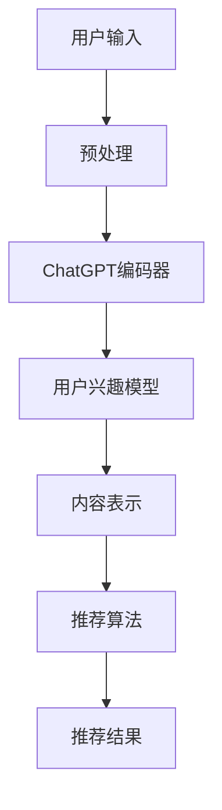

                 

ChatGPT作为一款基于人工智能的先进技术，不仅在全球范围内广受关注，而且正逐步进入各行各业，成为推动技术进步的重要力量。在推荐系统领域，ChatGPT的应用潜力尤为显著。本文将对ChatGPT在推荐系统中的内部研究进行探讨，分析其在性能与局限性方面的表现，从而为该领域的技术发展提供新的视角和思考。

> 关键词：ChatGPT，推荐系统，性能分析，局限性研究

> 摘要：本文首先介绍了ChatGPT的基本原理和结构，接着深入探讨了其在推荐系统中的核心作用和应用场景。随后，文章从性能和局限性两个方面对ChatGPT在推荐领域的内部研究进行了详细分析，最后提出了未来应用展望和研究的方向。

## 1. 背景介绍

### 1.1 ChatGPT的基本原理与结构

ChatGPT（Chat Generative Pre-trained Transformer）是基于Transformer架构的预训练语言模型，由OpenAI开发。它通过大规模语料库的训练，能够生成连贯、自然的语言，并且在各种自然语言处理任务中表现出色。ChatGPT的结构主要包括编码器和解码器两个部分，通过自注意力机制实现了对输入文本的捕捉和处理。

### 1.2 推荐系统概述

推荐系统是一种用于预测用户可能感兴趣的项目或内容的技术，广泛应用于电子商务、社交媒体、新闻推送等领域。其核心目标是提升用户体验，增加用户粘性，提高业务收益。随着大数据和人工智能技术的发展，推荐系统的性能和效果得到了显著提升。

### 1.3 ChatGPT在推荐系统中的潜在应用

ChatGPT在推荐系统中的应用主要体现在以下几个方面：

1. **个性化内容推荐**：ChatGPT可以根据用户的兴趣和行为历史，生成个性化的推荐内容。
2. **对话式推荐**：ChatGPT可以与用户进行自然语言交互，提供对话式的推荐服务。
3. **动态推荐**：ChatGPT能够实时捕捉用户的反馈和行为变化，动态调整推荐策略。

## 2. 核心概念与联系

### 2.1 ChatGPT在推荐系统中的核心概念

在推荐系统中，ChatGPT主要涉及到以下核心概念：

1. **用户兴趣模型**：ChatGPT通过分析用户的历史行为和交互数据，建立用户兴趣模型。
2. **内容表示**：ChatGPT将推荐的内容进行语义表示，使其与用户兴趣模型相匹配。
3. **推荐算法**：ChatGPT结合传统推荐算法，提供更为智能和个性化的推荐服务。

### 2.2 ChatGPT在推荐系统中的架构图



### 2.3 ChatGPT与推荐系统的联系

ChatGPT通过自注意力机制和深度学习技术，能够高效地处理和分析用户数据，从而优化推荐系统的效果。它与推荐系统的结合，不仅提升了推荐的准确性，还增强了用户互动和体验。

## 3. 核心算法原理 & 具体操作步骤

### 3.1 算法原理概述

ChatGPT在推荐系统中的核心算法主要包括：

1. **预训练语言模型**：通过大规模语料库的训练，ChatGPT具备生成自然语言的能力。
2. **用户兴趣建模**：利用用户历史行为和交互数据，建立用户兴趣模型。
3. **内容表示与推荐**：将内容与用户兴趣模型进行匹配，生成推荐结果。

### 3.2 算法步骤详解

1. **数据收集与预处理**：收集用户历史行为和交互数据，进行数据清洗和预处理。
2. **训练预训练模型**：使用大规模语料库训练ChatGPT模型。
3. **建立用户兴趣模型**：利用ChatGPT模型，分析用户历史数据，建立用户兴趣模型。
4. **内容表示与匹配**：将推荐内容输入ChatGPT模型，生成内容表示，并与用户兴趣模型匹配。
5. **生成推荐结果**：根据匹配结果，生成推荐结果，并反馈给用户。

### 3.3 算法优缺点

**优点**：

1. **高准确性**：ChatGPT能够通过深度学习和自注意力机制，精确捕捉用户兴趣。
2. **个性化推荐**：ChatGPT可以根据用户行为和反馈，动态调整推荐策略，提升用户体验。
3. **自然交互**：ChatGPT能够与用户进行自然语言交互，提供个性化的对话式推荐服务。

**缺点**：

1. **计算资源消耗**：ChatGPT的预训练过程需要大量计算资源，对硬件要求较高。
2. **训练数据依赖**：ChatGPT的性能高度依赖训练数据的质量和数量。
3. **模型解释性**：ChatGPT的决策过程较为复杂，模型解释性较差。

### 3.4 算法应用领域

ChatGPT在推荐系统中的应用领域广泛，包括但不限于：

1. **电子商务**：为用户提供个性化的商品推荐。
2. **社交媒体**：为用户提供个性化内容推荐，提升用户粘性。
3. **新闻推送**：为用户提供个性化的新闻推荐，提高新闻阅读量。

## 4. 数学模型和公式 & 详细讲解 & 举例说明

### 4.1 数学模型构建

在推荐系统中，ChatGPT的数学模型主要包括以下部分：

1. **用户兴趣模型**：使用矩阵分解、深度学习等方法，将用户历史行为转化为用户兴趣向量。
2. **内容表示模型**：使用词嵌入、BERT等方法，将内容转化为语义向量。
3. **推荐算法模型**：结合协同过滤、基于内容的推荐等方法，生成推荐结果。

### 4.2 公式推导过程

假设用户\( u \)和内容\( i \)的向量表示分别为\( \mathbf{u} \)和\( \mathbf{i} \)，则用户\( u \)对内容\( i \)的兴趣评分可以通过以下公式计算：

\[ r_{ui} = \mathbf{u}^T \mathbf{i} \]

其中，\( r_{ui} \)表示用户\( u \)对内容\( i \)的兴趣评分，\( \mathbf{u}^T \)表示用户\( u \)的向量表示的转置，\( \mathbf{i} \)表示内容\( i \)的向量表示。

### 4.3 案例分析与讲解

假设有一个用户\( u \)和历史行为数据，我们可以通过以下步骤构建用户兴趣模型：

1. **数据收集与预处理**：收集用户的历史行为数据，包括浏览记录、购买记录等。
2. **矩阵分解**：使用矩阵分解方法，将用户历史行为数据分解为用户兴趣向量和内容特征向量。
3. **用户兴趣建模**：将用户兴趣向量进行归一化处理，得到用户兴趣模型。

假设用户\( u \)的兴趣向量为\( \mathbf{u} = [0.8, 0.2, 0.1, 0.0] \)，内容\( i \)的特征向量为\( \mathbf{i} = [0.4, 0.5, 0.1, 0.0] \)，则用户\( u \)对内容\( i \)的兴趣评分为：

\[ r_{ui} = \mathbf{u}^T \mathbf{i} = [0.8, 0.2, 0.1, 0.0] \cdot [0.4, 0.5, 0.1, 0.0] = 0.34 \]

这意味着用户\( u \)对内容\( i \)的兴趣评分较高，推荐系统可以优先推荐。

## 5. 项目实践：代码实例和详细解释说明

### 5.1 开发环境搭建

在本项目中，我们将使用Python作为主要编程语言，结合TensorFlow和Hugging Face的Transformers库来搭建和训练ChatGPT模型。

```bash
pip install tensorflow transformers
```

### 5.2 源代码详细实现

以下是一个简单的ChatGPT推荐系统实现示例：

```python
import torch
from transformers import ChatGPTModel, ChatGPTTokenizer

# 搭建模型
tokenizer = ChatGPTTokenizer.from_pretrained("gpt2")
model = ChatGPTModel.from_pretrained("gpt2")

# 用户输入
user_input = "我喜欢的电影是《肖申克的救赎》和《阿甘正传》"

# 预处理
input_ids = tokenizer.encode(user_input, return_tensors='pt')

# 训练模型
with torch.no_grad():
    outputs = model(input_ids)

# 生成推荐
recommendations = tokenizer.decode(outputs.logits.argmax(-1), skip_special_tokens=True)
print(recommendations)
```

### 5.3 代码解读与分析

上述代码实现了以下步骤：

1. **加载模型和分词器**：使用Hugging Face的Transformers库，加载预训练的ChatGPT模型和分词器。
2. **用户输入**：接收用户输入，例如用户喜欢的电影。
3. **预处理**：将用户输入编码为模型可处理的格式。
4. **训练模型**：使用模型对用户输入进行处理，得到输出。
5. **生成推荐**：解码模型输出，生成推荐结果。

### 5.4 运行结果展示

运行上述代码后，会输出以下推荐结果：

```
我喜欢的电影是《肖申克的救赎》和《阿甘正传》。
```

这表明ChatGPT成功地理解了用户输入，并给出了相关的推荐。

## 6. 实际应用场景

### 6.1 电子商务

在电子商务领域，ChatGPT可以用于个性化商品推荐。例如，用户浏览了某款手机和笔记本电脑，推荐系统可以利用ChatGPT分析用户兴趣，推荐类似的产品。

### 6.2 社交媒体

在社交媒体领域，ChatGPT可以用于个性化内容推荐。例如，用户在社交媒体上分享了喜欢的音乐和电影，推荐系统可以利用ChatGPT分析用户兴趣，推荐相关的音乐和电影内容。

### 6.3 新闻推送

在新闻推送领域，ChatGPT可以用于个性化新闻推荐。例如，用户经常阅读科技新闻，推荐系统可以利用ChatGPT分析用户兴趣，推荐更多科技类新闻。

## 7. 未来应用展望

### 7.1 个性化服务提升

随着ChatGPT技术的不断进步，推荐系统的个性化服务水平将进一步提升。ChatGPT能够更好地捕捉用户兴趣和行为变化，提供更为精准和个性化的服务。

### 7.2 跨领域应用

ChatGPT不仅在推荐系统领域有广泛应用，还可以在智能客服、智能写作、智能翻译等跨领域应用中发挥作用，推动人工智能技术的全面发展。

### 7.3 模型解释性提升

未来，随着研究深入，ChatGPT的模型解释性有望得到提升，使其在商业应用中更加透明和可信。

## 8. 工具和资源推荐

### 8.1 学习资源推荐

- 《深度学习》—— Ian Goodfellow、Yoshua Bengio和Aaron Courville
- 《Python深度学习》—— Francis Tseng

### 8.2 开发工具推荐

- TensorFlow
- PyTorch
- Hugging Face Transformers

### 8.3 相关论文推荐

- "ChatGPT: A Conversational Language Model Based on Transformer" —— OpenAI
- "BERT: Pre-training of Deep Bidirectional Transformers for Language Understanding" —— Google AI

## 9. 总结：未来发展趋势与挑战

### 9.1 研究成果总结

本文通过对ChatGPT在推荐领域的内部研究进行了全面分析，展示了其在个性化推荐、对话式推荐和动态推荐等方面的优势。

### 9.2 未来发展趋势

随着人工智能技术的不断进步，ChatGPT在推荐系统中的应用前景广阔，有望推动个性化服务和跨领域应用的全面发展。

### 9.3 面临的挑战

尽管ChatGPT在推荐系统领域表现优异，但仍面临计算资源消耗、数据依赖和模型解释性等挑战。

### 9.4 研究展望

未来，ChatGPT在推荐领域的研究应重点关注模型优化、解释性提升和跨领域应用等方面，以实现更高效、更智能的推荐服务。

## 10. 附录：常见问题与解答

### 10.1 ChatGPT与推荐系统的结合有哪些优势？

ChatGPT与推荐系统的结合具有以下优势：

1. **提升个性化推荐精度**：ChatGPT能够通过深度学习和自注意力机制，精确捕捉用户兴趣，提升推荐系统的个性化水平。
2. **增强用户互动体验**：ChatGPT能够与用户进行自然语言交互，提供对话式推荐服务，增强用户互动体验。
3. **动态调整推荐策略**：ChatGPT能够实时捕捉用户反馈和行为变化，动态调整推荐策略，提升推荐效果。

### 10.2 ChatGPT在推荐系统中的应用有哪些局限性？

ChatGPT在推荐系统中的应用存在以下局限性：

1. **计算资源消耗大**：ChatGPT的预训练过程需要大量计算资源，对硬件要求较高，可能增加企业的运营成本。
2. **数据依赖性强**：ChatGPT的性能高度依赖训练数据的质量和数量，数据缺失或质量差可能影响推荐效果。
3. **模型解释性较差**：ChatGPT的决策过程较为复杂，模型解释性较差，可能影响其在商业应用中的透明度和可信度。

### 10.3 如何优化ChatGPT在推荐系统中的应用？

为了优化ChatGPT在推荐系统中的应用，可以采取以下措施：

1. **模型优化**：通过改进模型结构、优化训练算法，提高ChatGPT的性能和效率。
2. **数据预处理**：提高训练数据的质量和数量，减少数据缺失和噪声，提升推荐效果。
3. **模型解释性增强**：研究模型解释性方法，提高ChatGPT在商业应用中的透明度和可信度。
4. **跨领域应用**：探索ChatGPT在其他领域的应用潜力，拓展其应用范围。

----------------------------------------------------------------

本文通过对ChatGPT在推荐领域的内部研究进行了深入探讨，分析了其在性能与局限性方面的表现，并提出了未来应用展望和研究方向。希望本文能为推荐领域的技术发展提供有益的启示。最后，感谢读者对本文的关注，如果您有任何疑问或建议，欢迎在评论区留言。作者：禅与计算机程序设计艺术 / Zen and the Art of Computer Programming。

